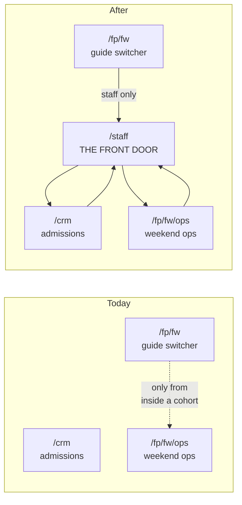

# The Staff Front Door

## Problem Frame

The 120 runs two staff-facing applications — the admissions CRM at `/crm` and First Profit's Founders Weekend operations at `/fp/fw/ops` — and **there is no link between them in either direction.** One Supabase session covers both, so a staff member signed into the CRM is already signed into First Profit and has no way to discover it.

The practical failure: a staff member who wants to create a Founders Weekend cohort types `/fp/fw`, which is the *guide's* cohort switcher, not an administrative surface. It has no chrome, no navigation, and no sign-out. The surface that actually does the job exists and works, but nothing points at it — `/fp/fw/ops` is linked only from the per-cohort guide header, which you can reach only from *inside* a cohort.

Two things make this worse than a missing link. First, the Founders Weekend spec had already decided that staff affordances belong **inside `/fp/fw`** — "one event surface for everyone on site" — so typing that URL and expecting administration was following the spec, not misreading it. The controls landed in a sibling subtree instead, and nothing bridged the gap. Second, `/fp/fw` has no sign-out for *anyone*, staff or guide, which is a plain defect independent of navigation.

So the tool is complete and unreachable, and the surfaces staff do reach cannot tell them which account they hold or let them leave it. Staff need one place that knows what applications exist, and consistent chrome that follows them through all of them.

## Navigation Map

Today the two applications are islands. After, they are spokes on a hub: each links back to `/staff`, never to each other. The diagram shows navigation only — the persistent chrome of R15–R18 spans every box in the "After" group.

## Requirements

**The staff hub**

- R1. A staff-only page at `/staff` is the front door to The 120's staff tools. It presents each application as a card carrying a name, a one-line description of what the application is for, and a link into it.
- R2. Two applications at launch: **Admissions CRM** (`/crm`) and **First Profit — Founders Weekend ops** (`/fp/fw/ops`).
- R3. Each card carries one live number. The CRM card shows seats filled against the total. The First Profit card shows how many **non-archived** Founders Weekend cohorts exist, plus the next one by start date when one is still upcoming.
- R4. A card whose live number cannot be loaded still renders and still links. The number is omitted; **the door is never hidden.** This contract binds the Founders Weekend card, whose read returns a typed failure. It **cannot** bind the CRM card: the seats figure catches every failure internally and returns a hand-maintained constant, so it is unable to report failure and may render a stale number indistinguishable from a live one. That limitation is stated rather than papered over, and changing it is out of scope because the same figure feeds the public marketing site.
- R5. `/staff` carries the persistent staff nav bar of R15, including sign-out.
- R5a. `/staff` declares itself unindexable, matching every other staff surface in the repo. Without its own declaration it would inherit the public marketing metadata from the root layout.

**Access and routing**

- R6. `/staff` requires an active staff identity, held to the same standard as `/crm`. Signed-out visitors reach the staff sign-in. Signed-in non-staff get 404 semantics — never a message confirming the surface exists. Note that "404 semantics" in this repo is produced by a proxy-level *rewrite*; the page-level gate only redirects, so R6 is not satisfied by reusing the gate alone.
- R7. After a successful staff sign-in **or password reset**, staff land on `/staff`. Both are entry points and both currently land on `/crm`; the reset path is the one a brand-new staff member takes on their first session, which makes it the more important of the two for this requirement's stated purpose.

**Persistent staff chrome and cross-application navigation**

- R8. From any screen in `/crm`, staff can return to `/staff`.
- R9. From any screen in `/fp/fw/ops`, staff can return to `/staff`.
- R10. Navigation is hub-and-spoke. Applications link back to the hub, never directly to each other.
- R15. **One persistent nav bar appears on every guarded staff surface**, carrying the signed-in account's identity and a sign-out control. It covers the *guarded layouts* of `/staff`, `/crm`, `/fp/fw`, and `/fp/fw/ops` — scoped to those layouts rather than to URL prefixes, because several unauthenticated doors share the same prefixes (R18). Today the chromes disagree: the Founders Weekend headers show no identity at all, and `/fp/fw` has no header whatsoever. The CRM band already shows the account email, which — see R17 — is the most any of them can honestly show.
- R16. **Sign-out must not complete, from any staff surface, while the device holds undrained Founders Weekend captures for the signing-out account.** This is the requirement's real shape: the drain gate is a property of the *device and session*, not of a URL subtree. The offline queue survives navigation out of `/fp/fw`, so a control that gates only inside that subtree is not a gate at all — and this work creates the path that exploits the difference, by linking from Founders Weekend surfaces to `/staff`. A plain sign-out on `/staff` or `/crm` is therefore forbidden. The design consequence to solve, not to discover: the drain verdict must be computable on surfaces where the Founders Weekend offline engine is not currently mounted.
- R17. The bar identifies the **account**, so a staff member can tell at a glance which one they are acting as — the case that matters is a shared event-day device. **Verified: that identity is an email address.** The `staff` table holds no name column, guide accounts are minted with no name metadata, and no display-name source exists anywhere in the repo. An earlier draft said "names the person," which was unsatisfiable. Adding real names is a schema change plus a backfill and is **not** in scope here.
- R18. Three deliberate exclusions. **The projected cohort board** never gets the bar: it is the repo's only unauthenticated read surface, a venue projector with no session, so there is no user to name and no one to sign out — and chrome naming a person on a screen projected to a room of strangers is exactly wrong. **The year-long family app** (`/fp`) keeps its existing shell in this work; it already has sign-out, it uses a different design system, and showing a child an account identity is a separate decision. **The unauthenticated doors sharing the guarded prefixes** — the staff login and reset, the staff-only 404 target, the guide sign-in, and the guide invite landing — have no session to name and nothing to sign out of. The bar's design must not foreclose the family app adopting it later.
- R22. **Sign-out's destination follows the account, not the surface.** A guide lands on the guide door; staff land on the staff sign-in. The existing guide sign-out hard-codes the guide door for a recorded reason — a guide handing back an iPad at end of shift must not be dropped on the child's door, which asks for a first name and would tell them a parent can reset it. Consolidating controls must not lose that.
- R23. **The bar renders sign-out unconditionally.** If the read that resolves identity fails or is slow, the bar still appears and sign-out still works; only the identity string degrades. This matters because R16 removes the per-subtree controls that currently work independently of that read — a silent failure would otherwise strand a staff member on a page with no way out, which is strictly worse than the three disagreeing-but-functional chromes we have today.
- R24. **The bar carries identity, sign-out, the return-to-hub link where R8/R9/R12 require one, and a label naming which application you are in** — without that label, a staff member crossing CRM → hub → Founders Weekend ops sees a visually identical bar in both applications. **It does not absorb section navigation:** the CRM's six section tabs survive as their own row. Folding six destinations plus identity plus sign-out into one bar would break a survive-at-375px contract the tab row already meets only by scrolling horizontally, and dropping them would strand five CRM sections behind URL-typing.

**Founders Weekend front-door repairs**

- R11. `/fp/fw` carries the persistent nav bar (R15). It has none today, so a guide sitting on the multi-cohort picker cannot sign out at all.
- R12. Staff on `/fp/fw` get a link to `/staff`. Guides do not — the hub refuses non-staff, so offering them the link would hand them a 404.
- R13. When no non-archived Founders Weekend cohorts exist, staff see copy saying exactly that, plus a way to create one. Guides continue to see "you aren't a guide on any cohort yet — ask The 120 staff," which is a different and still-correct fact: staff see every weekend, so their zero means *none exist*, while a guide's zero means *no grants*.
- R14. **Staff are exempt from the single-cohort redirect; guides keep it unchanged.** The redirect is a guide affordance — one grant means one place to work, and there is nothing to choose. For staff, one cohort means *one exists so far and more are coming*, so the picker and the create path are precisely what they need. Without this exemption R11–R13 would be unreachable in the one-cohort state, which is exactly the state the system sits in from the moment the first real weekend is created until the second.

**Retiring the rehearsal residue**

- R19. Founders Weekend cohorts can be archived. Archived cohorts are hidden by default from the hub's count (R3) and from the staff ops list. **They are not hidden from guides**, and the requirement cannot be written as "hide from the staff picker" because *there is no staff picker* — one shared query feeds both the staff list and each guide's own list, and the guide surfaces branch on list **length**. A filter applied inside that shared read would force-redirect a guide whose second cohort was archived, strip their switcher, and tell a guide whose only cohort was archived that they hold no grants — which would be false. **The filter therefore lives at the staff call sites, not inside the shared read.**
- R20. Archiving is reversible, is staff-gated, and **records who archived it and when, as columns on the cohort row.** This follows the attribution precedent the Founders Weekend build reserved for exactly the actions that are not its two liability actions. It deliberately does **not** write an ops-audit row: that table's subject column is `not null` against a real user, archiving a cohort has no human subject, and writing the actor as their own subject would poison the "what is this person's access history" read that column exists to serve.
- R21. The rehearsal and verification cohorts are archived **before the hub's Founders Weekend card is live to staff.** All four current cohorts are in scope — the two rehearsal cohorts, the import rehearsal, and the verification cohort — because none is a real weekend. The ordering *is* the requirement: whether it happens as a backfill or as operator action, the card must never ship into a window where it reports four weekends and names a rehearsal as next.
- R25. **Archiving a cohort closes its public projected-board link.** Token validity today is a function of expiry and revocation only and never consults the cohort, so an archived cohort would otherwise keep serving its grid — minors' first names plus initials — to anyone holding the link, while staff believe it retired. Two of the cohorts R21 archives carry 30 and 90 seeded students. If a weekend is retired enough to hide from staff, its projector door is closed too.
- R26. **Staff can list archived cohorts and unarchive them.** Without a surface that shows them, R20's reversibility has no entry point, and every per-cohort ops control — board-token revoke, the guide roster, the student-removal control that satisfies the privacy notice — becomes reachable only by someone who already knows the cohort's id.

## Success Criteria

- A staff member who has never opened First Profit can, from a cold browser, sign in and create a Founders Weekend cohort **without being told a URL by another person.**
- All four of the original complaints resolve: somewhere to enter or create cohorts; persistent navigation for staff; a staff headline; controls to add and to pick a cohort — and they resolve at **zero, one, and many** cohorts, not only at zero and many.
- A staff member moves CRM → hub → Founders Weekend ops → hub without typing a URL or using the browser back button.
- Every guarded staff surface shows which account is signed in and offers a sign-out that works.
- **Signing out never silently discards queued captures, from any surface.** A device holding undrained Founders Weekend work refuses to complete sign-out wherever the request is made.
- **The hub's Founders Weekend figure counts only real weekends.** On the day Boston is created, "next" names Boston — not the Aug 14 rehearsal window that currently outranks it.
- **Archiving a cohort closes its public board link**, verified by confirming a previously-live token stops resolving.
- **No guide loses a cohort, loses their switcher, or is told they hold no grants** because staff archived something.
- A read failure behind the Founders Weekend card degrades that card's number and nothing else — both links still work.

## Scope Boundaries

- **No staff administration for the year-long Path program.** `/fp` returns 404 for staff today (verified: the Path gate calls `notFound()` on a grant-less session, and staff hold no grants by design). That is a real gap and a separate piece of work. The hub's card layout leaves room for it without presupposing its shape.
- **The family app does not adopt the nav bar in this work** (R18), and the projected board never will.
- **No display names.** R17 settles for the account email because that is all the schema holds; adding names is a migration plus a backfill and is not in scope.
- No aggregated cross-application dashboard. The hub reports one number per application, not a synthesis across them.
- `/fp/fw/ops` does not move. It stays where it is, gains a return link, and gains the archive controls.
- The staff sign-in stays at `/crm/login`.
- No changes to guide check-in, roster management, CSV import, or offline capture semantics. The ops list changes by gaining archive controls and a default filter; the board changes only in that an archived cohort's token is revoked.

## Key Decisions

- **The front door is top-level `/staff`, not a section of either application.** It is the parent of both; nesting it under `/crm` or `/fp` would make one application's URL space own the other, and would have to move the first time a third application appears.
- **Cards with one live number, over a plain link list.** A bare link list is a page staff would stop visiting in favour of bookmarking the applications directly, which is the situation we are trying to leave. **The original cost claim behind this decision was wrong and is corrected here:** the seats figure is a genuine reuse of a computation the CRM band already renders, but the Founders Weekend figure is not near-free. The only existing query carrying start dates paginates the cohort table and then fans out to three more paginated scans — every membership row, every guide grant, and every board token across all Founders Weekend cohorts — tallying in memory. Planning should decide the read's *shape*, not merely its scheduling.
- **Over a full cross-application dashboard.** Aggregation turns every new surface in either application into a decision about whether it also belongs on the hub.
- **Reuse the CRM's visual language** rather than inventing a third.
- **Hub-and-spoke, not application-to-application links.** At two applications this reasoning is admittedly thin — a single extra tab in the CRM's existing chrome would have been cheaper. It is chosen anyway because the hub is where the deferred Path-administration card lands, and because R15's bar needs a canonical home regardless.
- **Sign-in and password reset both land on `/staff`.**
- **One nav bar for all staff surfaces, rather than three that disagree.** Recorded honestly, because a reviewer's subtraction test showed the bar's supporting success criterion was one this document authored to require it: the trigger was a single missing control on one page, and R11 plus R8/R9 would close the stated problem alone. The bar is kept anyway — identity and sign-out being a per-subtree accident is a real defect on shared event-day devices — but the cost is recorded rather than asserted. A layout that is chrome-less by explicit design gains chrome; a purpose-built event-day header gains a neighbour; one component must serve two token sets; and R18 carves out three exceptions before a line is written.
- **The drain gate is a session property, not a page property.** Stating R16 as "one consolidated control" invited a plain sign-out on surfaces where the offline engine is not mounted. The queue does not know what page you are on, so the requirement must not either.
- **Archiving records attribution on the cohort, not in the ops audit.** The audit table demands a human subject and archiving has none; forcing one in would corrupt the index that column exists to serve.
- **The archive flag is un-deferred.** The Founders Weekend build considered it and deferred it because it "impeded no Success Criterion." A hub that counts weekends and names the next one makes that judgement false: two rehearsal cohorts can never be deleted, so without archiving they would misreport the count forever.
- **The reused staff gate keeps its current home for now.** The hub imports its gate from one of its own spokes and the staff login remains under `/crm` — inverted, and deliberately so. The honest cost is not "churn": it is one mechanical import-path change across the calling files, plus a bookmark break only if the login URL itself moves. **The retirement trigger is named rather than vague: hoist the gate and move the login when the third staff application lands, or when the family app adopts the bar — whichever comes first.**

## Dependencies / Assumptions

Verified against the codebase during this brainstorm — planning should not re-derive these, and should not assume the opposite:

- `/fp/fw/ops` already renders the full weekend list and the create-a-weekend form. Confirmed loading for a real staff session.
- The only inbound link to `/fp/fw/ops` is from the per-cohort guide header, which requires already being inside a cohort.
- The `/fp/fw` authenticated layout renders no chrome, by explicit design — the header lives one level down. R15 revisits that deliberately.
- The proxy matches `/crm` and `/fp` only. A top-level `/staff` route needs adding to the matcher, and its routing verdict needs deciding rather than inheriting.
- The staff gate enforces an admin claim plus a live, active staff row.
- **"404 semantics" is produced by the proxy's rewrite branch, not by the page-level gate.** The gate redirects; only the proxy rewrites in place.
- The seats figure never throws — it catches everything and falls back to a hand-maintained constant, so it cannot signal failure. This is why R4 is scoped as it is.
- The Founders Weekend cohort listing returns a typed failure result, so R4's degradation is expressible there.
- Sign-in and password reset each hard-code `/crm` at separate call sites. R7 changes both.
- `/fp` returns 404 for staff.
- **Production is not in the zero-cohort state.** Four Founders Weekend cohorts exist from the build-out — two rehearsal cohorts carrying 30 and 90 seeded students, one four-student import rehearsal, and one verification cohort. **Two can never be deleted:** the ops audit reference is `RESTRICT` with immutable rows.
- **The seeded rehearsal window starts 2026-08-14**, before the real Boston debut on 2026-08-21, so any "next weekend by start date" computed today names a rehearsal.
- **The offline capture queue is device-scoped and survives navigation** out of the Founders Weekend subtree, and residue is purged wholesale when a different account signs in on that device. That purge is what converts an ungated sign-out from a recoverable inconvenience into permanent loss of verified child records. R16 exists because of it.
- **The offline drain engine mounts only inside the Founders Weekend authenticated layout**, so on `/staff` and `/crm` no drain verdict is currently computable at all.
- **The ops audit table's subject column is `not null` against a real user.** Archiving has no subject. This is why R20 uses cohort columns instead.
- **Board-token validity consults only expiry and revocation, never the cohort.** This is why R25 is a requirement rather than an assumption.
- **One shared query feeds both the staff cohort list and each guide's list**, and it also supplies the per-cohort header's weekend name and the switcher's visibility. This is why R19 places the filter at the call sites.
- **No display name exists** for staff or guides, in any table or in auth metadata. The session object used on Founders Weekend surfaces carries no email either, so rendering identity there needs the session widened rather than an extra lookup per render.
- The staff-row read is a plain async function, not request-memoized like its session-loading sibling. Any chrome branching on staff-ness pays an extra query per render unless memoized the same way.
- The CRM's section tab row documents a survive-at-375px contract it already meets only by scrolling horizontally.
- The Founders Weekend headers are sticky at the top; the CRM band is not.

## Timing

The Founders Weekend calendar is fixed and close. The build plan sets feature-complete plus a staff dry run at roughly **2026-08-17**, with the software debut at **Boston, 2026-08-21–23** and the season closing at **Hamptons, 2026-08-28–30**. The document is dated 2026-07-26.

This ships as **one landing**, by decision. The risk inside it is not evenly distributed, and planning should weight its verification accordingly:

1. **Archive flag, hub count, hub and routing** — staff-only. No guide-facing surface is touched. Lowest risk.
2. **The nav bar on guide-facing surfaces, and the R16 sign-out constraint** — the only slice that can regress live check-in, and the only one that can lose captured work. It deserves the largest share of dry-run time and an explicit rollback story, because **Boston and Hamptons are five days apart**: a regression surfacing at the debut has almost no room to be fixed before the next event.

The dry-run checklist does not currently cover the new bar or the sign-out constraint and needs extending. The single behaviour most worth rehearsing is the one this work introduces: signing out with a non-empty offline queue, on a shared device, after crossing a surface boundary.

**Correction, recorded rather than quietly dropped:** an earlier draft claimed the Founders Weekend student-deletion obligation was still unbuilt and told planning to sequence against it. That was wrong and was never verified before being written down. Anonymise-in-place shipped in Unit 5b — migration, core, action, and the staff control on the per-cohort ops page all exist. It constrains nothing here, except that R26's archived-cohort view must keep that control reachable.

## Outstanding Questions

### Resolve Before Planning

None.

### Deferred to Planning

- [Affects R16][Technical] How a sign-out on `/staff` or `/crm` learns whether the device holds undrained captures, given the drain engine mounts only inside the Founders Weekend layout. Mounting it globally, moving the verdict server-side, and gating at the sign-out action are all plausible; the requirement fixes the guarantee, not the mechanism.
- [Affects R16, R22][Technical] What happens when the drain gate legitimately refuses on a shared, offline device that must change hands before connectivity returns. Today's control tells the guide to stay signed in, which is right for the queue and wrong for handover; whether that needs an operator-change path is a real question this work surfaces without creating.
- [Affects R15, R24][Technical] Whether the bar is sticky like the Founders Weekend headers, or a true floating overlay. The word "floating" has been used throughout; every existing chrome in this repo is sticky, and the two stack differently against the per-cohort header that already claims the top offset.
- [Affects R11, R15][Technical] How the bar reconciles with the per-cohort guide header — cohort name, ops link, switcher, drain-gated sign-out — without regressing the context a guide works under on event day.
- [Affects R6][Technical] Whether the proxy carries an explicit branch for `/staff` or relies on fall-through. An explicit branch is preferred, and R6's rewrite requirement likely forces the question anyway. This is the highest-blast-radius file in the change and has no rollback story yet.
- [Affects R3][Technical] The Founders Weekend read's shape — the existing query is a four-way paginated fan-out for one integer — and whether the hub's two reads run concurrently.
- [Affects R3][Technical] How "next weekend by start date" sorts, and what it does with a null start date, a weekend in progress, and weekends already past. The existing listing orders by creation date and yields null rather than dropping the row.
- [Affects R19, R25, R26][Technical] Whether archiving affects a guide's ability to check in to that cohort, distinct from what any list shows.
- [Affects R21][Technical] Whether the four cohorts are archived by backfill or by operator action. R21 fixes the *ordering* either way; planning picks the mechanism and owns the verification query, following this repo's Management-API playbook.
- [Affects R11, R12, R13][Technical] Whichever layout hosts the chrome must resolve staff-ness through a request-memoized read, or every surface below it pays an extra query per render over venue wifi.
- [Affects R6][Technical] Whether the two staff gates are guaranteed to agree. Both require an admin claim plus a live active staff row today, so the hub can never show a door its holder is refused at — but that equivalence is coincidental, enforced by neither a shared function nor a test, and the bar becomes a third consumer of it.

## Next Steps

`-> /ce:plan` for structured implementation planning.
