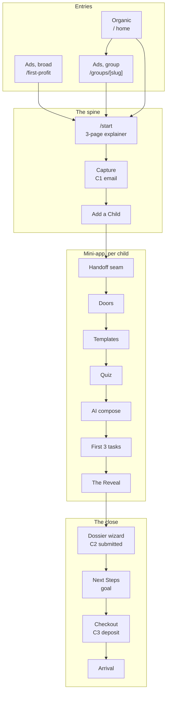

# The First Profit Funnel

## Problem Frame

The 120's site asks a cold visitor to "Join The 120" on the strength of copy, and converts
poorly. Every red CTA on every marketing surface opens the same account modal
(`app/components/account/AccountModal.tsx`, reached through `app/components/JoinButton.tsx`
from `Nav.tsx` ×3, `CtaBand.tsx`, and `ScholarsTuition.tsx`). A visitor's only path from
interest to commitment is a signup form.

The bet of this build: **families convert when the kid has already started.** A parent who
has watched their child design a real business in ten minutes, and then seen a credible
picture of that same child months later having sold to strangers for real money, is no
longer evaluating a program. They are deciding whether to interrupt something that has
already begun.

The tail of that funnel already exists and works. `/dashboard` holds the parent dashboard
and the five-step dossier wizard (`app/dashboard/wizard/`: Basics, Academics, Group,
Project, Workshops, Review). Stripe deposit rails run through `app/api/checkout/route.ts`
and `app/api/stripe/webhook` against the `deposits` table. The CRM ingests leads through
`app/crm/lib/lead-ingest.ts` and nurtures them through `app/lib/nurture`. What is missing
is everything in front of it: there is no `/start`, no `/first-profit`, no landing template,
no mini-app, and `/groups/[slug]` still serves the retiring brochure treatment.

## Source Documents

- `artifacts/First Profit/the-120-unified-funnel-design-brief.md` — routing, surfaces,
  attribution, the CTA reroute table. Authoritative on marketing-surface routing.
- `artifacts/First Profit/the-120-interactive-application-design-brief.md` — vision, gate
  ladder, copy registers, template copy (§8.2). Authoritative on tone.
- `artifacts/First Profit/First Profit application process design handoff/design_handoff_first_profit/README.md`
  — the sixteen funnel screens. **Pixel-fidelity source of truth for every screen.**
- `app/lib/site.ts` and `app/lib/seats.ts` — single source of truth for groups, seats,
  tuition, dates. The prototype's hardcoded "113 of 120" is prototype scaffolding.

## Rulings Made In This Brainstorm

The two briefs conflict in four places (F1–F4). Four further rulings (F5–F8) were added
after planning research surfaced blockers the briefs never addressed. All are settled.

| # | Conflict | Ruling |
|---|---|---|
| F1 | Interactive brief names the product **Foundry** at `/foundry` (A14, A15). Unified brief, written a day later, never mentions it and puts the spine at `/start`. The Path→First Profit rename shipped to `/fp` on 2026-07-24, after both. | **Foundry is dead.** The product is First Profit, the app is `/fp`, the funnel spine is `/start`. `/foundry` is never built. |
| F2 | Interactive brief (A4, A6) puts real parent-verified task work between the application and the deposit, with Gate 2 firing when task `1.2.1` is verified. The handoff prototype goes application → Next Steps → checkout with no task work between. | **Handoff wins. Ship the short funnel.** No pre-deposit task work, no Gate 2 at `1.2.1`, no pre-deposit verification mechanic. The data model must not preclude adding it later, but nothing in this build depends on it. |
| F3 | Interactive brief (A10, A13) makes the landing page inbound-marketing-only with nothing internal linking to it. Unified brief (D1) makes the five group landing pages the canonical `/groups/[slug]`, linked from the home page's five cards. | **Unified brief wins**, by its own supersession clause. The group landings are internal destinations; only `/first-profit` is ad-only. |
| F4 | Interactive brief (A8) puts the Apply button and FAQ accordion on the Reveal screen. Handoff closes the Reveal with "Continue Application →" into the dossier wizard, with the FAQ accordion below. | **Handoff wins.** It is the pixel source of truth. |
| F5 | The handoff runs submit → Next Steps → checkout with no offer step. But `canReserveSeat` (`app/dashboard/data.ts`) requires status ≥ `offered`, and `app/api/checkout/route.ts` re-enforces it server-side. **A staff member must offer a seat before any family may pay.** The funnel silently deleted admissions approval from the payment path. | **Admissions approval is preserved.** After C2 the family sees a review state. Staff offer through the existing CRM path, which fires the existing offer email (PR #8), and that email carries the deposit CTA into Next Steps. C3 is no longer contiguous with C2. The handoff's screen order is unchanged; only its timing is. |
| F6 | The capture screen is pixel-final and carries no consent control, but nurture's send gate requires `consent_given` on the family. Without a recorded CASL basis at C1, no funnel family may lawfully be emailed. | **An explicit consent checkbox ships at C1**, a deliberate deviation from the pixel-final handoff. Express consent is the only basis that clearly survives scrutiny for a flow involving minors, and implied consent's six-month expiry would silently drop exactly the stalled families the nurture exists to recover. |
| F7 | Nothing covers the 120th seat going mid-run, and `DEPOSIT_REFUND_DEADLINE_LABEL` is a display string already duplicated in three other files. | **Waitlist at zero seats**, closing checkout. The September 30 2026 date stays presentational this build, but a machine-readable `Date` constant lands beside the label so a later unit can enforce it without a second literal. |
| F8 | R7 originally specified Supabase `signInWithOtp` for magic-link resume. Research found three independent defects: the built-in mailer is capped at **2 emails/hour project-wide**; `createServerClient` forces PKCE *after* the options spread so `flowType` cannot be overridden, breaking cross-device resume; and the repo has no OTP precedent at all. | **No Supabase OTP.** Resume uses the repo's own proven shape — a self-issued 256-bit token stored as sha256, mailed via Resend, landing on a read-only GET that mutates only on POST. This is what `app/fp/lib/actions/invite.ts` already does. It sidesteps the rate limit, the PKCE cross-device failure, and the `no-auth-mail-guard` tripwire simultaneously. |

## The Shape

Three rules make it one system. Every red CTA for a logged-out visitor goes to `/start`.
The five home cards are the only links that do not — they go sideways to the group landing
pages, which warm the visitor before the same front door. The group a visitor entered
through follows them as a hint, never a lock.

## Requirements

### Foundations

- R1. A `projects` table holds one project per row, keyed to a child, carrying group tag,
  name, description, offer sketch, first-customer hypothesis, status
  (`active|paused|abandoned`), creation route (`template|own_idea|revival`), template id,
  quiz answers, and AI generation metadata including whether the family edited the output.
- R2. A child may hold up to five projects, exactly one `active` at a time. Switching is
  instant. Abandoned projects can be revived.
- R3. The funnel **extends** the existing `families` / `parents` / `children` tables rather
  than introducing a parallel application model. The brief's Application is a family and
  its Applicant is a child. The dossier wizard already reads these tables and must not
  need a bridge.
- R4. Each child carries an applicant state: `added → project_created → submitted →
  deposited → enrolled`. State lives server-side and is consulted, never recomputed from
  scattered UI conditionals.
- R5. `Group` in `app/lib/site.ts` gains the landing-page fields — headline line 1,
  subhead, hero asset, phase colour token — rather than a parallel content module.
  Scholars' `href` changes from `/scholars` to `/groups/scholars`.

### Resume and identity

- R6. Email capture at C1 creates no password. The family's way back is a resume link
  mailed to the captured parent address (F8).
- R7. The resume link is a **self-issued 256-bit token stored only as sha256**, single-use,
  short TTL, mailed via the existing Resend rails — not Supabase `signInWithOtp` (F8).
  The pattern is already proven in `app/fp/lib/actions/invite.ts` and
  `path_parent_invites`.
- R7a. **The link is never itself the credential.** The emailed URL lands on a read-only
  `GET` that renders a page with a button and no session; redemption happens on `POST`.
  Mail scanners (Defender Safe Links, Proofpoint, Barracuda) fetch every URL in an inbox,
  and a link that authenticates on GET is burned or claimed before the parent clicks. This
  is a documented past incident in this repo, not a hypothetical.
- R7b. **The resume position is never in the URL.** The server resolves the family's
  furthest-progressed state after redemption. A forwarded or leaked link must not deep-link
  into a specific child's data.
- R7c. The request-a-link response is byte-identical whether or not the address exists. An
  enumeration oracle here leaks which families have applied to a program for children.
- R7d. Requests are rate-limited per email **and** per IP, backed by the database rather
  than process memory. The repo's in-memory limiter has a documented TOCTOU race and a FIFO
  eviction that silently clears lockouts.
- R8. A session cookie carries the family through the ten-minute run with no auth friction.
  The resume link is the way back after the cookie expires or on another device.
- R8a. **Authorization is server-side and explicit.** A password-less family has no
  `auth.uid()`, so RLS authorizes nothing for them. Every funnel read and write runs
  server-side under the service role with a hand-written family-scope check. No funnel
  screen may rely on RLS, and no per-child authorization may live in a UI conditional.
- R9. Existing families with passwords keep signing in exactly as they do today. The Join
  modal retires for logged-out visitors only; nothing about an enrolled family's access
  changes.
- R9a. **Re-entry is specified as a matrix, not inferred.** Rows: live cookie, dead cookie,
  expired link, second click, different device, family already holds a password, family
  already enrolled. Columns: one child, several children at different stages. Every cell
  names a destination screen.
- R9b. An unverified email address must never bind to, merge with, or overwrite an existing
  family record. Forged consent through exactly this path is a documented past incident.

### Marketing rewire

- R10. Every red CTA for a logged-out visitor routes to `/start` with a `src=` marker.
  Signed-in visitors see Dashboard instead.
- R11. The `src=` marker pattern in `app/2026-27/cta-source.ts` is promoted to
  `app/lib/` and used by every entry surface. Markers: `home`, `lp-athletes`,
  `lp-founders`, `lp-makers`, `lp-scholars`, `lp-givers`, `fp-generic`, `2026-27`,
  `tuition`, `faq`, `parents`, `scholars-legacy`.
- R12. The home hero gains its own red "Start Here →" CTA routing to `/start?src=home`,
  in the bottom-anchored content block below the subhead row, left-aligned with the
  headline, `px-7 py-4 text-sm`.
- R13. Every CTA label into the funnel reads **"Start Here →"**. "Start Building" survives
  only as the internal name of the `/start` stage.
- R14. The five home cards' footer line changes from `ENROLLING NOW · BOOK OR JOIN →` to
  `EXPLORE YOUR GROUP →`, each in its group's phase colour, linking to
  `/groups/[slug]` — scholars included.
- R15. Door colours by position: Athletes `--tp-phase-sell` `hsl(14 78% 54%)`, Founders
  `--tp-phase-build` `hsl(217 74% 56%)`, Givers `--tp-phase-validate` `hsl(265 52% 58%)`,
  Makers `--tp-phase-grow` `hsl(150 52% 42%)`, Scholars `--tp-phase-scale`
  `hsl(41 88% 52%)`.
- R16. **Contrast is checked at build time, not assumed.** Gold at 52% lightness and coral
  on `#f7f6f3` paper are both expected to fail small-text contrast. Where a token fails,
  a darkened text-safe variant of the same hue carries the label and the raw token is kept
  for any chip or underline accent. The funnel's own doors screen is untouched — First
  Profit DS already handles this.
- R17. These five tokens are the only Path-register colours permitted on the marketing
  site. They appear on the card footer line and the pre-selected door, nowhere else.
- R18. No "Book a call" appears anywhere on the logged-out marketing site. `BOOKING_URL`
  and `attributedBookingUrl()` survive but stop appearing before C1: the call is offered
  afterwards as a quiet mono link on the parent dashboard and inside nurture emails.

### Landing pages

- R19. One landing template instantiated six times: five group pages at `/groups/[slug]`
  and one group-neutral page at `/first-profit`. Roughly 90% shared content; only the hero
  image, headline line 1, and subhead vary.
- R20. Shared skeleton in order: floating white nav card, full-bleed hero with gradient and
  text lightbox carrying the live seats line, proof strip, the "What is The 120" paragraph,
  red CTA band, real site footer on `#0300ed`.
- R21. The "What is The 120" paragraph is identical on all six. It is where the network is
  sold and must not become group-flavoured.
- R22. Headline line 2 is constant across all six: italic blush *"We'll show you how right
  now."*
- R23. The seats line renders from `app/lib/seats.ts`. The prototype's hardcoded "113 OF
  120 SEATS REMAIN" is scaffolding.
- R24. Landing CTAs route to `/start?g=[slug]&src=lp-[slug]`. `/first-profit` uses
  `src=fp-generic` and sets no `g`.
- R25. Nothing internal links to `/first-profit`. It is the broad-ads destination only.
- R26. The retiring brochure treatment loses Book a call, the Join modal, and the
  "← THE 120 / see the groups" chrome. One exit, forward.
- R27. `/scholars` stays live and reachable by URL but is unlinked from the home cards. Its
  CTAs reroute to `/start?src=scholars-legacy`. Repurposing its content is out of scope.

### The spine

- R28. `/start` accepts `?g=` and `?src=` and renders a 3-page explainer, then capture,
  then Add a Child.
- R29. The explainer is three swipes, one idea each, eyebrow always "HOW IT WORKS": your
  child designs a real business; you'll see exactly where it leads; this is the
  application.
- R30. Capture asks parent first name, last name, and email. This is **Conversion 1** and
  posts to `app/crm/lib/lead-ingest.ts` with `entry_source` written onto the lead. It calls
  `matchOrCreateLead` — never a blind upsert, which is a documented P0 consent hijack on a
  public endpoint, and which PostgREST cannot infer a conflict target for anyway against
  the partial unique index on `lower(email)`.
- R30a. Capture carries an **explicit, unticked CASL consent checkbox** (F6) whose accepted
  text and version are recorded with the timestamp. Consent is never granted on a generic
  match, and a revoked family is never re-subscribed.
- R31. Add a Child takes first name and grade per child, one or more, addable at any later
  point. Grade drives band and skin: 3–5 Trail, 6–12 HQ.
- R32. An application progress bar runs in the floating nav card from explainer through
  submission, at the percentages the handoff fixes (explainer 5/8/11/15, add-child 20,
  handoff 25, doors 30, templates 38, quiz 46, compose 55, tasks 62, reveal 70, wizard
  80/90/96, submitted 100).

### The mini-app

- R33. The handoff seam renders in the child's skin and names the child. The device passes
  to the kid here and back at the Reveal's close.
- R34. Five doors, "Five doors. Pick yours.", each with arch numeral chip in its phase
  colour and kicker `GROUP 0n · SPORT|ENTREPRENEURSHIP|SERVICE|CREATIVE|GIFTED & TALENTED`.
- R35. **Door pre-selection is a hint, never a lock.** A session carrying `?g=` renders that
  door pre-selected at full strength with one line of band-register copy under it. One tap
  confirms. Tapping any other door switches instantly, with no confirmation dialog and no
  friction copy — switching must feel like choosing, not correcting.
- R36. The hint is family-level and first-child-only. Siblings pick cold. A session with no
  `?g=` renders the doors cold.
- R37. Two curated starter templates per group plus a third "I've got my own idea" box with
  a textarea. Template copy ships from the interactive brief §8.2.
- R38. The quiz is four band-phrased questions per group. Suggestions appear as grey
  placeholder text and are **never pre-typed**. Trail shows a parent-assist banner naming
  the group: the founder decides, a grown-up types.
- R39. AI composition is a single server-side call returning validated JSON: name (≤5
  words), description (≤120 words, second person, band register), offer sketch, first
  customer hypothesis. Never called from the browser.
- R39a. **No child identifier leaves the country.** The call receives grade band, group,
  template id, and the scrubbed length-capped free-text answers. It never receives the
  child's name, the parent's name or email, the school, the city, or any internal id. The
  child's name is substituted client-side after the call.
- R39b. **Weak-signal fields are nullable, not required.** A schema that forces
  `firstCustomerHypothesis` on every call instructs the model to fabricate one for a child
  who wrote three words. `null` is a first-class "ask again" branch in the UI.
- R39c. The child's free text is **spotlighted** as untrusted data inside explicit
  delimiters, with the system prompt stating it is content to summarise and never
  instructions. Input containing the reserved delimiter is rejected before the call. The
  call is stateless, has no tools, and has no retrieval.
- R40. Regeneration is limited to two per quiz run, **counted server-side against a
  persisted counter**, never client state. Every field is editable afterwards and the edit
  is recorded. Per-template canned fallbacks render on error — the funnel never dead-ends
  on an AI failure.
- R40a. The failure taxonomy is explicit, because "on error" is not a specification:
  invalid JSON (retry once with the validation error appended, then fall back), safety
  refusal (arrives as a **successful** response — `stop_reason` must be read before
  `content` — fall back), truncation (fall back, never repair), timeout or 429 (backoff,
  then fall back). The fallback is a real product state that reads as a legitimate first
  draft, not an error screen.
- R40b. **Every AI output field is treated as untrusted user input at every render
  surface** — the project page, the CRM dossier, and any email. HTML-escaped in mail, never
  `dangerouslySetInnerHTML`. This repo has already shipped an HTML injection into the
  admissions inbox through unescaped child and parent names.
- R41. AI output obeys the copy rules: no em dashes, no promised outcomes, no dollar
  predictions, no invented facts about the child, no brand names, no emoji. Kid inputs are
  filtered for profanity and brand names, and no real names or addresses reach the
  description.
- R42. The first-3-tasks screen shows three bubbles only — pitch a product in 60 seconds,
  make your first real sale, hear "no" three times — each with one project-customised
  sentence. Step 2 is strictly first product plus collecting payment from one person.
- R43. The Reveal renders above the fold in the child's skin: the five-step climb as a bar
  chart, SELL and BUILD complete, VALIDATE partial, GROW and SCALE dashed. It is labelled
  a projection and is **never presented as achieved fact**. The stat strip may cite only
  numbers that are actual pass criteria.
- R44. The Reveal closes in the application register with a red "Continue Application →"
  CTA and an italic band-worded parent line, above a four-row FAQ accordion closed by
  default. Opening a row emits an event.
- R45. A share card renders the project name, crests, and stat strip. It is downloadable by
  the parent only, consistent with the app's nothing-is-public rule.

### The close

- R46. The dossier wizard receives the funnel's work pre-done: the Group step is answered
  by the chosen door, and the Project step is pre-filled with the actual project the child
  built. The Workshops step is removed.
- R47. Basics arrives pre-filled with name and grade, with birth year auto-calculated as
  `2021 − grade` and editable. *(Text corrected 2026-07-28: the original
  `2026 − 11 + grade` was inverted — it increases with grade; the implementation's
  `2021 − grade` matches the evident intent. See
  docs/solutions/logic-errors/a-requirements-literal-formula-can-be-wrong-assert-the-invariant-not-the-artifact-2026-07-28.md.)*
- R48. The application asks for the child's email with a "Don't have one" option.
- R49. Submission is **Conversion 2**. The dossier header flips to SUBMITTED FOR REVIEW.
- R49a. **The deposit does not open on submission (F5).** After C2 the family sees a review
  state. Staff offer the seat through the existing CRM path, which fires the existing offer
  email (PR #8); that email carries the deposit CTA. C2 and C3 are no longer contiguous,
  and every screen between them must read as an admissions process rather than a stall.
- R50. Next Steps is three swipes in the explainer UX: progress made, set your goal (with
  an editable goal input), secure the seat. It is reached from the offer email or from the
  parent dashboard once the child is `offered` — never directly from submission.
- R51. The deposit is $250, fully refundable until September 30 2026, stated at the point
  of ask. A machine-readable `Date` constant lands beside the existing
  `DEPOSIT_REFUND_DEADLINE_LABEL` in `app/lib/site.ts`, and the three existing duplicate
  literals are collapsed onto it (F7).
- R51a. **The full refund-policy text renders inline at the point of payment**, above an
  unticked checkbox, and the accepted text's version, hash, timestamp and IP are persisted.
  A checkbox containing only a link to a policy is explicitly rejected by card issuers as
  dispute evidence.
- R52. Payment is **Conversion 3** and rides the existing Stripe rails.
- R52a. **A child may hold at most one live paid deposit.** Enforced by a partial unique
  index, not an application probe. Today's schema is unique on `stripe_session_id` only, so
  two tabs or an impatient second tap produce two paid rows and consume two of 120 seats.
- R52b. When seats reach zero the funnel routes to a waitlist state and checkout closes
  (F7). The existing `WAITLIST_LABEL` treatment extends beyond the marketing surfaces.
- R53. Deposit receipt provisions the student account. If the family chose "Don't have
  one", a unique `@the120.school` address is created, and the parent is emailed the login
  address and password.
- R53a. **`assertNoAuthMailToFwStudent` widens to the whole student namespace**, not just
  `*.fw@`. R53 mints deliverable addresses in a namespace the guard does not currently
  match, which turns the existing browser-side `resetPasswordForEmail` in
  `app/dashboard/SignIn.tsx` into a way for any visitor to send mail to a child's real
  inbox. That call is inert only because the namespace has no catch-all today; R53 arms it.
- R53b. Provisioning returns a **discriminated union that forces a create-vs-adopt branch
  before any credential is reachable**. `ok: true` is not permission to issue a credential
   — an idempotent primitive plus an unconditional caller already rotated a live guide's
  working credential once in this repo.
- R54. The arrival screen is an acceptance-letter moment, not a settings screen. Login
  email, fallback password, forced reset on first login, parent-email preview, and the
  September 30 calendar note.
- R55. Never-deposited families are never reaped. Applications stay on file for
  re-engagement, exactly as a competitive school keeps applicant files. (The `path-evidence-
  reaper` cron reaps orphaned *storage objects* and is unrelated; the earlier wording named
  the wrong system.)
- R55a. **A written retention schedule ships before launch, and is automated.** A child's
  free-text quiz answers and generated project are deleted or irreversibly de-identified
  after a defined period of inactivity. Aggregate funnel analytics are kept as counts on
  non-identifying dimensions, so retention never costs measurement. R55's "keep the
  application on file" and this are not in tension: the file is the application, not the
  child's free text.

### Instrumentation and CRM

- R56. Every stage boundary emits an event with a shared schema carrying family, child,
  source, band, and group: `lp_view`, `start_view`, `explainer_start`, `c1_captured`,
  `child_added`, `quiz_start`, `door_confirmed`, `project_created`, `reveal_viewed`,
  `faq_opened`, `application_started`, `c2_applied`, `c3_deposit`, `student_account_created`,
  `c4_tuition`, plus `project_regenerated`, `project_switched`, `share_card_created`.
- R57. `door_confirmed` carries `{group, preselected, switched_from}`. The switch rate per
  landing page is the ad-targeting health metric.
- R58. The four conversions are first-class named conversions. `entry_source` persists from
  first touch through tuition so C1→C2→C3 is segmentable per entry surface. **This is the
  yardstick the ads plan needs, and it is why the marketing rewire ships before the
  mini-app.**
- R59. CRM pipeline stages map onto the funnel's states with time-in-stage, so staff can
  see where a family stalled: `email_captured → child_added → quiz_started →
  project_created → reveal_viewed → application_started → application_submitted →
  deposit_paid → enrolled`.
- R60. Quiz and project answers stream into the child's CRM dossier in real time, so staff
  see what a kid built before any parent conversation.
- R61. Nurture sequences key to the abandonment point: captured-but-no-child,
  child-but-no-project, project-but-no-application, applied-but-no-deposit. Each email
  deep-links to the exact resume point. Subjects carry nothing beyond a first name —
  no project name. *(Amended 2026-07-28, Peter: the original asked for the child's
  project name in the subject; the build's privacy posture — no child data beyond a
  first name in email — is confirmed as the requirement, and the in-code deviation
  flag is retired.)*

### Copy and register

- R62. Two registers, deliberately alternating. Application register (paper `#f7f6f3`, ink
  `#131416`, red `#d92632`, blue `#0300ed`, blush `#efc5b8`; Georgia display, Space Grotesk
  body, IBM Plex Mono labels) for landing, explainer, capture, dashboard, wizard, Next
  Steps, checkout, arrival, and the Reveal's close. First Profit app register (Trail or HQ
  by band, `--tp-*` tokens) for handoff through the Reveal's body.
- R63. Copy rules apply everywhere including AI output: no em dashes, phases are
  "complete" never "sealed", "Not Yet" never "failed", task IDs in mono, no emoji outside
  First Profit DS iconography.
- R64. Mobile-first is mandatory. The whole flow works one-handed on a phone.

## Build Order

**Superseded by `docs/plans/2026-07-27-002-feat-first-profit-funnel-plan.md`**, which is the
authoritative sequencing artifact. Planning research added units this table does not carry
(the reserve-gate and trigger repair, the authorization model, moderation). The shape below
is kept as the original intent; where the two differ, the plan wins.

Phase 0 precedes everything; Phase 1 ships before Phase 2 because C1 is a real conversion
and `entry_source` starts producing the data the ads plan needs (R58) weeks before the
mini-app is ready.

| Phase | Unit | Scope | Migration |
|---|---|---|---|
| 0 | U1 | Data model, `projects`, applicant state, `Group` landing fields | yes |
| 0 | U2 | Magic-link resume through the guard, session carry, C1 → lead-ingest | maybe |
| 1 | U3 | `cta-source` promotion, sitewide reroute, home hero CTA, card colours | no |
| 1 | U4 | Landing template ×6, scholars route, brochure retirement | no |
| 1 | U5 | `/start` explainer, capture (**C1**), Add a Child | no |
| 2 | U6 | Handoff seam, doors with `?g=` pre-selection, templates | no |
| 2 | U7 | Quiz, server-side AI compose, project page | no |
| 2 | U8 | First 3 tasks, the Reveal, FAQ accordion, share card | no |
| 3 | U9 | Wizard rewiring, pre-done group and project, child email (**C2**) | maybe |
| 3 | U10 | Next Steps, goal input, Stripe checkout (**C3**) | no |
| 3 | U11 | Arrival, student provisioning, school mailbox, credentials email | maybe |
| 4 | U12 | Event stream, CRM funnel stages, live dossier streaming | yes |
| 4 | U13 | Nurture sequences keyed to abandonment point | no |

## Dependencies Outside The Build

Five things this build cannot produce for itself.

1. **Hero photography does not exist.** All six landing pages need art; the handoff states
   it is not bundled. U4 builds the image slot and can merge without it, but those pages
   must not take ad spend until art lands. Generation prompts are in the unified brief
   §3.2 and the interactive brief §4.
2. **`@the120.school` mailbox creation is unsolved.** Founders Weekend provisions
   `*.fw@the120.school` addresses, but `no-auth-mail-guard.test.ts` states plainly that
   namespace has no catch-all and mail bounces into nothing. R53 needs a real mail-provider
   integration that does not exist today. U11 is blocked on it; nothing earlier is.
3. **No AI dependency exists in the repo.** R39 needs a provider. Recommendation is the
   Vercel AI Gateway through the AI SDK with plain `"provider/model"` strings, server-side
   only. This is a new dependency and a recurring cost line. Zero Data Retention should be
   pursued given the inputs are children's free text — note that ZDR forecloses Fable 5,
   which requires 30-day retention, so the model choice and the ZDR decision are one
   decision, not two.
4. **No content moderation of any kind exists in the repo.** R41 requires profanity
   filtering, brand-name filtering, and PII redaction of child-typed input. There is no
   precedent to follow and no library installed. This was missing from the original
   dependency list and is a real cost, not a free line item. **If it lands as a hosted
   third-party API it is a second offshore trust boundary, and a worse one than the model:
   by construction moderation sees the child's raw unredacted text, including anything the
   redaction pass exists to remove.** It needs the same retention, PII-handling and geography
   treatment as dependency 3, decided before the unit rather than during it.
5. **Ontario counsel review before launch.** The Consumer Protection Act gives a statutory
   cancellation right that operates independently of the September 30 refund deadline, and
   agreements over $50 must be in writing with a copy delivered. If the marketing deadline
   is shorter than the statutory right, that is a compliance gap and a dispute that will be
   lost. Flagging the constraint, not advising on it.

## Non-Goals

- Pre-deposit task work, the `1.2.1` gate, and the pre-deposit verification mechanic (F2).
  The data model must not preclude them; nothing in this build depends on them.
- Repurposing `/scholars` content.
- The Foundry name, the `/foundry` route, and the wordmark letterform swap (F1).
- Tuition-page redesign, ad creative, the Gauntlet, CRM work beyond `entry_source` and the
  stages of R59.
- Public sharing of anything. The share card is parent-only.
- AI that verifies or grades. The app's hard rule holds everywhere.
- Discounting mechanics at any gate.

## Success Criteria

- A logged-out visitor cannot reach the Join modal from any **marketing** surface. The
  Gauntlet's `openAccountModal` is deliberately excluded: it is a functional signup gate for
  tournament entry, not a marketing CTA, and the Gauntlet is a stated non-goal. Rerouting it
  would break tournament entry.
- Every entry surface stamps a distinct `src=`, and C1→C2→C3 is segmentable by it from the
  event stream alone, per channel, per band, per group.
- A family can complete landing → deposit on a phone, one-handed, without a password.
- A family that abandons at any point can resume at the exact point of abandonment from a
  link in their email.
- The switch rate from a pre-selected door is measurable per landing page.
- No resume link, password reset, or auth mail of any kind can be addressed to **any**
  student address in the `@the120.school` namespace, not merely `*.fw@`.
- A child's name, the parent's identity, and any internal id never appear in a request to
  the model provider.
- One child can hold at most one live paid deposit, proven by constraint rather than by a
  code path.
