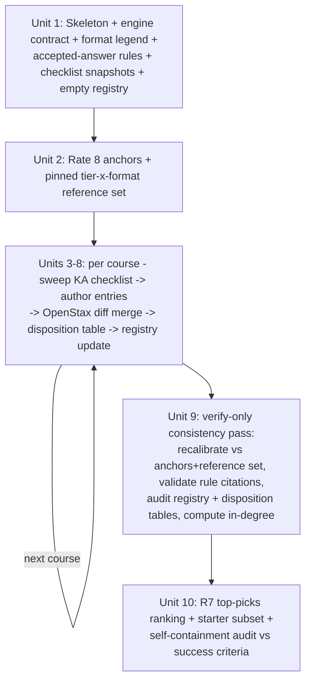

# feat: Author the Gauntlet content taxonomy (`artifacts/gauntletcontent.md`)

## Overview

Produce `artifacts/gauntletcontent.md`: a single, self-contained research/taxonomy document mapping Pre-Algebra through AP Calculus BC into hundreds of fine-grained drillable-skill entries, each rated for Gauntlet-friendliness (High/Medium/Low total-response-time for a fluent student), with sample questions, input-format requirements, kernel cross-references, and a prioritized "build this first" section. **Document-only cycle — no game code changes.** A future engineering cycle (roadmap item G2 "Pathway system" in `artifacts/roadmap.md` is explicitly blocked on this deliverable) uses the doc to add content to the game.

## Problem Frame

The Gauntlet (`/gauntlet`) is a speed-based FastMath boss battle: correct answers do damage scaled by speed and streak, so every question must be answerable in a few seconds of total response time (thinking plus answer entry). Today the game covers eight elementary topics (`app/gauntlet/game/problems.ts`). The product thesis: from Pre-Algebra through AP Calculus BC, a large set of building-block skills can be drilled to automaticity, lightening the cognitive load of the slow multi-step problems Gauntlet will never host. There is currently no map of which skills across this range are drillable at Gauntlet speed; without it, content expansion is ad hoc. (See origin: `docs/brainstorms/2026-07-10-gauntlet-content-taxonomy-requirements.md`.)

## Requirements Trace

Carried forward from the origin document (condensed; requirement numbering and grouping unchanged):

**Coverage and organization**

- **R1.** Full-range coverage Pre-Algebra → AP Calc BC in standard course order, preceded by a Foundational kernels section; each course section swept against a **named completeness checklist** with its source noted, so "nothing dropped" is auditable.
- **R2.** Hundreds of entries at single-skill/fact-family grain, each with a **stable slug ID**; kernel citations reference slugs so in-degree is mechanically countable.
- **R3.** Every entry: rating (High/Medium/Low) + one-line rationale; High/Medium entries additionally: one sample question with answer, required input format, and a parameter-range note.
**Rating semantics**

- **R4.** Rating = **total response time** for a fluent student (thinking + entry). High ≈ ≤3s (recall or one mental step); Medium ≈ 3–8s (one mental transformation, no paper); Low = inherently multi-step. Slow-to-enter answers rate down. The eight existing game topics are rated first as calibration anchors. *(The origin's R4 also asserts timings on "the shipped numeric keypad"; no such component exists — that claim is deliberately not carried forward. See Decision 7 and System-Wide Impact.)*
- **R5.** Ratings assume an **expanded lightweight input set**; each High/Medium sample states which format it needs; format-selection preference order (single number → two numbers → short expression → MC); two-number and short-expression samples must state their accepted-answer rule; new formats assume Enter-to-submit unless stated; accepted-answer rules are the spec for the normalization layer.
**Low-topic treatment (fast-kernel extraction)**

- **R6.** Low topics are listed with rating + reason and **name their fast kernels by slug**; High/Medium entries may declare prerequisite kernels; "no drillable kernel" is a recorded judgment, never a silent omission.
**Engineering guidance**

- **R7.** Prioritized top-picks section (~20–30 topics) ranked by **kernel in-degree** (primary: citations from Foundational→Algebra 2; secondary column: full-range), ties broken by judgment with one-line justification; each pick flagged **current-engine** / **needs input type X** (with MC-fallback-acceptable or **no-MC-fallback**); calls out the zero-engine-work starter subset.
- **R8.** Single file at `artifacts/gauntletcontent.md`, fully self-contained (future eng cycle needs no other document).

Success criteria and scope boundaries from the origin document apply unchanged and are restated below.

## Success Criteria (from origin)

- A reader can pick any unit-level topic from the named course checklists (Pre-Algebra to Calc BC) and find it — as a rated entry, a cross-reference row, or a recorded disposition.
- Engineering can select a topic from the doc and implement its generator without inventing *product* behavior: the sample plus parameter-range note fix the question shape, answer shape, accepted-answer rule, input format, and value bounds (difficulty curves and edge-case handling remain engineering judgment).
- The top-picks section gives a defensible next-content roadmap without further product input.
- Topic count lands in the intended "hundreds" range at drillable-skill granularity — verified via the Unit 10 grain audit (count reported as an outcome, never a padding target).

## Scope Boundaries

- **No game code changes** — no new generators, topics, input types, or UI. New input formats in the doc are *proposals*.
- **No band/level design** — no mapping to grade bands, unlock order, boss assignment, or difficulty curves (that is roadmap G2, downstream of this doc).
- **Not a lesson plan** — no pedagogy beyond the sample Q&A.
- **US/AP curriculum anchor**; no Common Core standard-code cross-referencing (a Common-Core-derived course *outline* is acceptable as checklist).
- Arithmetic below Pre-Algebra is out of scope except as kernels of listed topics.
- This plan also does **not** modify the origin brainstorm document; the one factual correction to it (see Key Technical Decisions: input surface) is handled inside the deliverable's engine-contract preamble.

## Context & Research

### Relevant Code and Patterns (verified in repo)

- `app/gauntlet/game/problems.ts` — the eight topics (`mul, div, add, sub, gcd, lcm, denom, congruence`), `Problem` shape (`answer` is ALWAYS a string; `kind: "numeric" | "choice"`), per-fact stable `key` (e.g., `mul:7×8`, commutative-normalized) consumed by the adaptive weak-fact trainer, band-scaled parameter ranges (`R` table).
- `app/gauntlet/components/Battle.tsx` and `app/gauntlet/components/Trial.tsx` — answer judging, duplicated verbatim: input strip `replace(/[^0-9-]/g, "")`; **auto-judge fires the instant typed length reaches `answer.length`** (no submit action; a same-length wrong answer is judged irrevocably on the final keystroke); strict string equality for both numeric and choice. **There is no custom on-screen keypad** — numeric input is a plain `<input inputMode="numeric">`, so touch devices get the OS keyboard.
- Game timing economy (Battle.tsx): damage speed bonus decays to zero over 6000ms, par at 4000ms; weak-fact flag at >20% miss or >5000ms average — independently consistent with the High ≤3s / Medium 3–8s tiers.
- All current generator answers are **positive integers** (the `-` in the strip regex is currently never exercised).
- `artifacts/` conventions: flat single-file docs, no frontmatter, `# H1` title with em-dash subtitle, `##` sections separated by `---`, bold inline IDs, heavy markdown tables, decision-logging prose (`artifacts/roadmap.md`, `artifacts/gtm-8-week-sprint.md`).

### Institutional Learnings

- `docs/solutions/` does not exist in this repo; no prior learnings corpus. (This cycle could seed one afterward with a large-document-authoring learning — optional, out of scope.)

### External References (verified live 2026-07-10)

- **Khan Academy course unit lists** (primary completeness checklists): Pre-Algebra (15 units), Algebra 1 (units 1–15; 16–17 are non-content), Geometry (9), Algebra 2 (12), Trigonometry (4) + Precalculus (10) jointly for the Trig/Precalc section. Public, named, unit-level, Common-Core-derived without standard codes; pages carry no version numbers and sit behind a bot wall, so the doc must **snapshot the unit lists** and cite "as of 2026-07-10".
- **OpenStax 2e TOCs** (secondary cross-check): Prealgebra 2e, Elementary Algebra 2e, Intermediate Algebra 2e, Algebra & Trigonometry 2e, Precalculus 2e. Known KA gaps the cross-check must catch: Algebra 1 one-variable statistics/scatterplots; Algebra 2 sequences/series and probability; Geometry constructions and logic/proof-writing. Not primary because OpenStax has no Geometry book and uses college-remedial course boundaries.
- **AP Calculus AB/BC Course and Exam Description** (College Board): AB = Units 1–8, BC = Units 1–10 (9: Parametric/Polar/Vector-Valued; 10: Infinite Sequences and Series). Covers the calculus sections per R1.
- Common Core Appendix A rejected as primary (covers only 3 of 5 courses; defunct canonical home; built around standard codes).

## Key Technical Decisions

1. **Khan Academy as the named checklist, snapshotted into the deliverable; OpenStax as per-course cross-check; AP CED for calculus.** Resolves the origin doc's needs-research question. The KA unit lists are copied into the doc (auditable even if KA reorganizes); each course section's coverage table maps every checklist unit to entry slugs.
2. **Per-course OpenStax cross-check, merged *before* advancing to the next course — the final pass verifies, never inserts.** Late insertion would land entries after later courses had already cited kernels, breaking slug stability and in-degree.
3. **Live kernel registry from pass 1.** A running registry section (slug → one-line definition → owning entry → canonical-home annotation where it differs from the minting section) maintained while authoring. Citations may only use registry slugs; a kernel is registered at first citation. Foundational (sub-Pre-Algebra) kernels use the `fk.` slug prefix and live in the Foundational kernels section; course-level skills cited as kernels keep their course slug. Later course passes MAY add a new entry to an *earlier* course section when first citation demands it (a course-grain kernel the earlier sweep didn't surface), via the same registry-mediated mechanism with a source note ("added during &lt;course&gt; pass") — safe because slugs are additive and in-degree isn't computed until Unit 9. This replaces "reconcile duplicates in one giant final pass" — the final pass validates the registry rather than rebuilding it.
4. **First-course-owns canonical ownership for cross-course topics.** A topic appearing in multiple course checklists (exact trig values; factoring) gets ONE canonical entry in the earliest course section; later course sections carry a one-line cross-reference row to the canonical slug (satisfying each course's checklist sweep) and in-degree accrues only to the canonical entry. Prevents double-counted in-degree and inflated entry counts.
5. **Closed legend of named accepted-answer rules.** The formats section defines named normalization rules once (e.g., `pair-unordered`, `factored-commutative-ws`, `frac-lowest-terms`, `int-exact`); entries cite rule names instead of free prose. Per R5, these rules ARE the future normalization-layer spec — a closed legend keeps ~200 entries from drifting into contradictory eng requirements.
6. **Input-format set extended with `fraction` and `decimal` formats** (extension of R5's five, same "cheaply supportable" spirit — a deliberate planning-level addition, flagged here for visibility). Fraction/decimal answers pervade the range (slopes, probabilities, percent↔decimal conversion in Pre-Algebra, exact trig values like 1/2) and "fraction operations" is a named expected top-pick; without a defined home, authors would shoehorn them inconsistently. Each gets an accepted-answer rule in the legend (e.g., whether lowest terms is required is fixed per rule, not per entry). Both slot into R5's preference order — single number → fraction/decimal (where the mathematically natural answer is non-integer) → two numbers → short expression → MC — with a stated rule for values expressible both ways (½ vs 0.5: the curriculum-natural form wins, and the entry says which).
7. **One assumed input surface per format, stated in the preamble; anchors rated under the same assumptions.** Corrects the origin doc's R4 claim of a "shipped numeric keypad" — none exists (plain HTML input → OS keyboard). The doc states, per format, the *hypothetical* game-rendered pad it assumes (explicitly marked as proposal, not precedent), because OS-keyboard symbol-layer switching would flip Medium/Low calls for expression entry. The eight calibration anchors are rated under these same assumptions, not observed current behavior, so anchors and later entries share one time-model. To keep assumption-based ratings falsifiable: each format's entry-time model is stated decomposably (taps-per-token × assumed per-tap time + submit keystroke), and any entry whose tier would flip if entry time were off by ~2× carries a **surface-sensitive** marker — giving the future input-work cycle a finite re-rating worklist rather than a full re-audit if the shipped surface diverges. The preamble states plainly that expression/fraction/two-number ratings are conditional on building the assumed surface.
8. **Fixed submit model and one consolidated mini-spec per format; no per-entry overrides.** Each format's spec: allowed characters, normalization steps, submit model (Enter-to-submit for variable-length formats; current length-based auto-judge documented as the single exception for fixed-length single-integer), and 2–3 accept/reject examples. Eng builds one input pipeline per format, not per entry.
9. **Prompt-rendering flag on High/Medium entries, default-omitted**: `plain-text` (the default — omitted when it applies) / `unicode-inline` / `needs-math-render` / `needs-figure`. Engine prompts are plain strings (only bespoke figure: the triangle SVG), so input format alone doesn't determine buildability — `x² + 19x + 84` is renderable as unicode, stacked fractions or graphs are not. Only exceptions are written out, so the flag costs nothing on the majority of entries. (Scope note: origin R3 doesn't require this field; it serves origin success criterion 2 — eng can build *any* chosen entry without invented product behavior — and R7's buildability flags.)
10. **In-degree defined once, mechanically:** count of *distinct citing entry slugs*, all citation kinds equal (a Low topic naming a kernel counts the same as a High entry declaring a prerequisite), filtered by the *citing* entry's course section for the primary (Foundational→Algebra 2) column — i.e., count distinct citing-entry slugs whose own section is Foundational through Algebra 2 — with full-range as secondary column. Stated beside the R7 ranking table. **Citation norm** (so the count measures dependency weight, not authoring salience): declaring prerequisite kernels on High/Medium entries is *required* whenever a registered kernel is a genuine prerequisite of the skill (origin R6's "may" becomes must-when-true); Unit 9 spot-checks citation *completeness* on a sample ("what kernels should this entry cite?"), not just citation resolution.
11. **Checklist-unit disposition table per course.** Every KA/OpenStax/CED unit maps to entry slugs OR an explicit disposition row (`out-of-grain: modeling/word-problem unit — no drillable content beyond kernels X, Y`). "Nothing dropped" becomes a mechanical table audit instead of a judgment call.
12. **Pinned calibration reference set beyond the 8 anchors.** The 8 existing topics are 7 single-integer High-ish drills + 1 MC — no worked example exists for Medium, two-number, short-expression, fraction, or true/false. After rating the anchors, author ~10 pinned reference entries spanning tier × format cells; the final recalibration pass compares all entries against anchors + reference set.
13. **Deliverable structure follows `artifacts/` house style** (single file, `#` title + em-dash subtitle, `##` sections with `---` separators, tables, bold inline IDs); frontmatter omitted to match `artifacts/` convention.

*Traceability of added mechanisms (each exists to serve the cited requirement and should be dropped if it stops doing so):* kernel registry→R2; accepted-answer-rule legend→R5; disposition tables→R1; calibration reference set→R4; render flag→R7 + origin success criterion 2; format extension→R5 (flagged for user review).

## Open Questions

### Resolved During Planning

- **Which completeness checklist for Pre-Algebra→Precalc?** → Khan Academy unit lists (snapshotted, dated), OpenStax 2e cross-check, AP CED for calculus. (Decisions 1–2.)
- **Section chunking strategy for authoring hundreds of entries in one file?** → Course-by-course authoring passes with a live kernel registry and per-course OpenStax merge; a verify-only consistency pass; ranking computed last. (Decisions 2–4; Implementation Units below.)
- **How do ratings stay uniform across authoring chunks?** → Shared per-format time-model in the preamble + 8 anchors + pinned tier×format reference set + final recalibration. (Decisions 7, 12.)
- **Where do fraction/decimal answers live?** → New `fraction`/`decimal` formats in the legend. (Decision 6 — flagged as an R5 extension.)

### Deferred to Implementation

- **Exact entry counts per course** — the "hundreds" target is a success criterion, not a quota; per-course counts emerge from the checklist sweep at single-skill grain.
- **Individual rating calls and tie-breaks** — author judgment per R4/R7, exercised against the calibration set; the plan fixes the *rules*, not the calls.
- **Which KA units turn out to be out-of-grain** — recorded as disposition rows when encountered; cannot be enumerated confidently in advance.
- **Final slug vocabulary** — the naming convention is fixed below; individual slugs are minted during authoring against the registry.

## High-Level Technical Design

> *This illustrates the intended approach and is directional guidance for review, not implementation specification. The implementing agent should treat it as context, not code to reproduce.*

**Authoring pipeline** (each course pass leaves the document internally consistent before the next begins):



**Entry grammar** (directional sketch of the repeating record shape — final wording set in Unit 1):

```text
### <slug> — <Skill name>                     e.g. alg1.factor-pairs-sum-product
Rating: High|Medium|Low · Format: <format-id> [· Render: unicode-inline|needs-math-render|needs-figure] [· Surface-sensitive]
                                     (Render omitted = plain-text; Surface-sensitive = tier flips if entry time is ~2x off)
Why: <one-line rationale referencing the tier definition>
Sample: <prompt> → <answer> · Rule: <accepted-answer-rule-id> · Params: <parameter-range note>
Kernels: [<slug>, <slug>] | "No drillable kernel beyond entries already listed (see <slug>…)"
-- Low entries: Rating + Why + Kernels only. Cross-reference rows: "<topic> → see <canonical-slug> (owned by <course>)."
```

**Slug convention:** `<section-prefix>.<kebab-skill-name>` with prefixes `fk` (Foundational kernels), `prealg`, `alg1`, `geo`, `alg2`, `trig` (Trig/Precalc), `calcab`, `calcbc`. Slugs are immutable once minted (registry-enforced); synonyms are prevented at citation time, not repaired later. Prefixes record the *minting* section, not a correctness claim about canonical level: if a later course reveals an entry's true canonical home (e.g., an OpenStax-merged topic minted under `alg1.` that is really Pre-Algebra grain), the registry's canonical-home field is annotated — never renamed — and cross-references and in-degree follow the registry, not the prefix. Mis-homing is thereby a recorded correction, not a contradiction.

## Implementation Units

### Phase A — Contracts and calibration (the parts that are near-impossible to retrofit)

- [x] **Unit 1: Document skeleton, engine contract, format legend, and checklist snapshots**

**Goal:** Create `artifacts/gauntletcontent.md` with everything every later entry depends on: the "How to read this document" preamble (tier definitions, format-preference order, current-engine definition — restated from R4/R5/R7 so the doc is standalone per R8); the verified engine contract (exact-string matching, length-based auto-judge with its no-backspace nuance, strip regex, `numeric|choice` universe, no custom keypad, positive-integer-only answers today — the judge grades negatives but touch `inputMode="numeric"` keyboards may lack a minus key — per-fact `key` convention for the adaptive trainer) with code pointers to `app/gauntlet/components/Battle.tsx` and `app/gauntlet/game/problems.ts`; the input-format legend (single number, two numbers, short expression, multiple choice, true/false, fraction, decimal) with per-format assumed input surface, submit model, allowed characters, normalization mini-spec, and accept/reject examples; the closed accepted-answer-rule legend; the in-degree counting rule; the canonical-ownership and cross-reference-row rules; the slug convention; the empty kernel registry section; and the snapshotted checklists (KA unit lists per course, OpenStax TOC cross-check lists, AP CED units) each with source + as-of date.

**Requirements:** R1 (checklist sources), R4 (tier semantics), R5 (formats + accepted-answer rules), R8 (self-containment). 

**Dependencies:** None.

**Files:**
- Create: `artifacts/gauntletcontent.md`

**Approach:**
- Follow `artifacts/` house style (Decision 13). The engine contract corrects the origin doc's keypad claim explicitly (Decision 7) and marks all non-current formats as proposals.
- The format legend is written to double as the future input-work spec (R5): one submit model and one normalization pipeline per format, no per-entry overrides (Decision 8).
- Checklist snapshots are **copied from this plan's Appendix** (captured live 2026-07-10) — do not re-fetch Khan Academy (bot-walled) and never reconstruct unit lists from model memory; if a list is missing from the Appendix, fail loudly and ask rather than fill the gap.
- The entry grammar's `Rating:` and `Kernels:` lines are declared machine-parseable invariants (fixed prefixes, bracketed slug lists) so Unit 9 can count in-degree with a script.

**Test scenarios:** Test expectation: none — document scaffolding; correctness is verified by the audit checks below and the Unit 9 consistency pass.

**Verification:**
- Every term used later by entries (tier names, format ids, rule ids, render flags, slug prefixes) is defined in this unit's sections; nothing is left to be defined "when first used".
- Engine-contract claims each carry a repo file pointer and match the verified findings (string match, auto-judge, strip regex, no keypad).
- All checklist snapshots — six KA course lists, five OpenStax TOCs, and the AP CED unit list — are present with named source and as-of date, matching this plan's Appendix.

- [ ] **Unit 2: Calibration anchors and pinned reference set**

**Goal:** Rate the eight existing game topics as worked examples of the tier definitions (each with the full R3 record: rating, rationale, sample, format, params — params taken from the actual `R` table bands in `app/gauntlet/game/problems.ts`), then author ~10 pinned reference entries chosen to cover the tier × format cells the anchors miss (Medium tier; two-number, short-expression, fraction, true/false formats). Mark the reference set as the recalibration standard for Unit 9.

**Requirements:** R3, R4 (anchors-first mandate).

**Dependencies:** Unit 1 (tier/format/rule vocabulary).

**Files:**
- Modify: `artifacts/gauntletcontent.md`

**Approach:**
- Anchors are rated under the preamble's per-format surface assumptions, not observed current behavior (Decision 7), with a one-line note where the two differ (e.g., current auto-judge vs. assumed Enter-to-submit for new formats).
- Reference entries are real taxonomy entries. Unit 2 creates stub course sections containing only these pinned entries (each later course pass absorbs its stub in place), so every reference entry has a physical home and a properly-prefixed slug from day one; pre-minted slugs obey the same registry immutability. They are pinned by slug in a small calibration table, not duplicated.

**Test scenarios:** Test expectation: none — document content; verified by audit checks.

**Verification:**
- All 8 anchor topics rated with complete R3 records; parameter notes match `problems.ts` generator bounds.
- The calibration table covers every format in the legend and every tier with at least one pinned example.

### Phase B — Course-by-course authoring (each pass leaves the doc consistent)

Units 3–8 share one recipe: sweep the course's snapshotted KA checklist unit-by-unit → enumerate single-skill entries (full R3/R5/R6 records for High/Medium; rating + reason + kernels for Low) → run the OpenStax cross-check diff and merge missing topics under this course's prefix with a source note → write the course's checklist-disposition table (every checklist unit → entry slugs or an explicit out-of-grain/cross-reference disposition) → register new kernels and citations in the live registry. Cross-course topics follow first-course-owns (Decision 4).

- [ ] **Unit 3: Foundational kernels seed + Pre-Algebra section**

**Goal:** Author the Pre-Algebra section against the KA Pre-Algebra checklist (15 units) with the Prealgebra 2e cross-check, seeding the Foundational kernels section with the sub-Pre-Algebra skills (`fk.` slugs) that Pre-Algebra entries cite (many will overlap the 8 anchors — anchors ARE Foundational/early entries and take their canonical slugs here).

**Requirements:** R1, R2, R3, R5, R6.

**Dependencies:** Units 1–2.

**Files:**
- Modify: `artifacts/gauntletcontent.md`

**Approach:** Recipe above. The Foundational kernels section is seeded here and grows in later units strictly via registry-mediated additions.

**Test scenarios:** Test expectation: none — document content; verified per-course audit below.

**Verification (applies to each of Units 3–8 for its course):**
- Disposition table maps 100% of the course's snapshotted checklist units to slugs or recorded dispositions — zero unmapped rows.
- Every kernel citation in the section resolves to a registry slug; no prose-name citations.
- Every High/Medium entry has: rating, rationale, sample+answer, format id from the legend, rule id from the legend (where the format requires one), params note, render flag. Every Low entry has rating, reason, and kernels-or-explicit-none.
- OpenStax diff outcomes recorded (merged entries carry a source note; already-covered rows say so).

- [ ] **Unit 4: Algebra 1 section**

**Goal:** Author Algebra 1 against KA units 1–15 with the Elementary Algebra 2e cross-check (must catch the KA statistics gap). Expected home of marquee entries like `alg1.factor-pairs-sum-product`.

**Requirements / Dependencies / Files / Approach / Test scenarios / Verification:** as Unit 3, for Algebra 1. Depends on Unit 3.

- [ ] **Unit 5: Geometry section**

**Goal:** Author Geometry against the KA Geometry checklist (9 units); cross-check must catch constructions and logic/proof-writing gaps. Expect a high share of Low entries with rich kernel extraction (the congruence anchor lives here canonically).

**Requirements / Dependencies / Files / Approach / Test scenarios / Verification:** as Unit 3, for Geometry. Depends on Unit 4.

- [ ] **Unit 6: Algebra 2 section**

**Goal:** Author Algebra 2 against the KA Algebra 2 checklist (12 units); cross-check must catch sequences/series and probability gaps (Intermediate Algebra 2e / Algebra & Trig 2e). This closes the primary in-degree window (Foundational→Algebra 2), so registry hygiene matters most here.

**Requirements / Dependencies / Files / Approach / Test scenarios / Verification:** as Unit 3, for Algebra 2. Depends on Unit 5.

- [ ] **Unit 7: Trigonometry/Precalculus section**

**Goal:** Author the joint Trig/Precalc section against BOTH KA courses (Trigonometry 4 units + Precalculus 10 units, deduplicated between themselves and against earlier canonical owners — heavy cross-reference traffic to Geometry/Algebra 2), with Algebra & Trigonometry 2e / Precalculus 2e cross-check.

**Requirements / Dependencies / Files / Approach / Test scenarios / Verification:** as Unit 3, for Trig/Precalc (disposition table covers both KA course checklists). Depends on Unit 6.

- [ ] **Unit 8: AP Calculus AB + BC-only sections**

**Goal:** Author Calculus AB against CED Units 1–8 and a BC-only section against CED Units 9–10. Expect the strongest Low→kernel extraction in the document (derivative/antiderivative fact families, exact trig values, series-convergence facts) with many kernels resolving to earlier sections.

**Requirements / Dependencies / Files / Approach / Test scenarios / Verification:** as Unit 3, for the two calculus sections against the CED checklist. Depends on Unit 7.

### Phase C — Consolidation and ranking

- [ ] **Unit 9: Consistency pass and in-degree computation (verify-only)**

**Goal:** One full-document pass that inserts nothing: recalibrate every rating against the anchors + pinned reference set (adjusting outliers with a note); validate every format id, rule id, and render flag against the legends; audit the kernel registry (no orphan slugs, no synonyms, every citation resolves); audit all disposition tables; then compute kernel in-degree per Decision 10 and record both columns (Foundational→Alg2 primary; full-range secondary) in the registry table.

**Requirements:** R2 (mechanical countability), R4 (uniform tiers), R6 (no silent drops), pre-req for R7.

**Dependencies:** Units 1–8.

**Files:**
- Modify: `artifacts/gauntletcontent.md`

**Approach:**
- Verify-only discipline (Decision 2): anything discovered missing at this stage is logged in the document's changelog-style note and added under its owning course section — as an exception with a reason, not silently.
- In-degree counting is mechanical given registry discipline: distinct citing entry slugs, filtered by citing entry's section. Compute it with throwaway parsing tooling (grep/script over the machine-parseable `Kernels:` lines) — permitted: the scope boundary bars game-code changes, not verification tooling — keeping the top-10 manual spot-recount as the cross-check.

**Test scenarios:** Test expectation: none — verification pass; its output IS the audit.

**Verification:**
- Zero unresolved kernel citations; zero rule/format/flag ids not in the legends; zero unmapped checklist rows across all disposition tables.
- Rating-adjustment notes exist for every entry whose tier changed in recalibration.
- In-degree columns present for every registry kernel; spot-recount of the top ~10 matches the recorded values.

- [ ] **Unit 10: Top-picks section and final self-containment audit**

**Goal:** Write the R7 "build this first" section: ~20–30 picks ranked by primary in-degree with the secondary full-range column, tie-breaks justified in one line each; each pick flagged current-engine or needs-input-type-X with MC-fallback-acceptable / no-MC-fallback, plus its render flag; call out the zero-engine-work starter subset (current-engine AND plain-text/unicode-inline render AND non-negative answer). Then run the final audit against the origin doc's success criteria.

**Requirements:** R7, R8; origin success criteria.

**Dependencies:** Unit 9.

**Files:**
- Modify: `artifacts/gauntletcontent.md`

**Approach:**
- "Current-engine" follows origin R7: a single integer answer — negative allowed, the judge grades it — or MC; decimals/fractions are never current-engine even as "single numbers". Recorded caveat (the second explicit origin correction, alongside the keypad one): touch `inputMode="numeric"` OS keyboards may expose no minus key, so picks with negative answers carry a touch-entry-risk note and the zero-engine-work starter subset admits only non-negative-answer picks.
- Post-Algebra 2 kernels score 0 on the primary window by construction (no Algebra 1 entry cites a derivative rule), so the ranked 20–30 list is Foundational→Algebra 2 leverage; post-Alg2 kernels appear in a separately labeled **forward inventory** sublist ordered by the secondary (full-range) column — they never enter the primary ranking via tie-break prose.

**Test scenarios:** Test expectation: none — document content; verified by the audit below.

**Verification (= origin success criteria, operationalized):**
- Random-sample audit: pick 10 random unit-level topics across the snapshotted checklists → each is findable as an entry, a cross-reference row, or a disposition row.
- Consumer dry-run: for 3 top picks (one current-engine, one needs-new-format, one no-MC-fallback), confirm the entry alone answers: question shape, answer shape, accepted-answer rule, input format + submit model, value bounds, render needs — without opening any other document.
- Grain audit: a sampled set of entries each pass the "one drillable thing" test (one fact family; the sample fully determines a generator) and no checklist unit is left unswept; the resulting entry count is reported as an outcome with a sanity note (a total far below ~150 suggests chapter-grain entries — investigate grain, never pad). Top-picks section has 20–30 ranked, flagged picks, the forward-inventory sublist, and the named starter subset.

## System-Wide Impact

- **Interaction graph:** No runtime impact — no code changes. Downstream consumers: the future content-expansion eng cycle and roadmap G2 (Pathway system) in `artifacts/roadmap.md`, which is explicitly blocked on this deliverable.
- **Error propagation / state lifecycle:** N/A (document).
- **API surface parity:** The doc's format mini-specs become the de facto spec for future input work; Decision 8 (one pipeline per format, no per-entry overrides) exists to keep that future surface coherent. The per-fact `key` convention is documented so future generators stay compatible with the adaptive trainer.
- **Unchanged invariants:** `app/gauntlet/**` is untouched; the doc describes today's engine as a contract with code pointers, and labels every non-current capability as a proposal.
- **Origin-document correction:** R4's "shipped numeric keypad" phrasing is factually wrong (no such component exists); the deliverable's engine contract states the truth and the assumed-surface model (Decision 7). The brainstorm file itself is left unedited.

## Risks & Dependencies

| Risk | Mitigation |
|------|------------|
| Rating drift across hundreds of entries authored in chunks | Shared time-model in preamble; 8 anchors + pinned tier×format reference set; Unit 9 recalibration (Decisions 7, 12) |
| Kernel slug synonyms corrupt in-degree and the R7 ranking | Live registry with citation-time slug resolution; first-course-owns rule; Unit 9 registry audit (Decisions 3, 4, 10) |
| Accepted-answer rules drift into contradictory eng requirements | Closed named-rule legend; entries cite rule ids; Unit 9 validates citations (Decision 5) |
| Khan Academy reorganizes its unit lists after authoring | Unit lists snapshotted into the doc with as-of date; the snapshot, not the live site, is the auditable checklist (Decision 1) |
| KA bot wall blocks re-fetch at authoring time, tempting reconstruction from model memory | Full unit lists captured in this plan's Appendix (2026-07-10); Unit 1 copies them and fails loudly on any gap |
| KA course-boundary gaps cause silently missing traditional topics | Per-course OpenStax cross-check with recorded diff outcomes, merged before the next course starts (Decision 2) |
| "Current-engine" picks blocked on unbudgeted display work | Prompt-rendering flag on every High/Medium entry; starter subset requires plain-text/unicode-inline (Decision 9) |
| Out-of-grain checklist units silently dropped | Disposition tables make "nothing dropped" a mechanical audit (Decision 11) |
| Single-file size strains authoring and review | Course-by-course units each leave the doc consistent and are natural commit boundaries; verify-only final pass keeps late churn small |
| Fraction/decimal format addition drifts from product intent | Flagged explicitly as an R5 extension (Decision 6) for user review at plan approval; contained to the format legend if reverted |

## Documentation / Operational Notes

- The deliverable is itself documentation; no runbooks or rollout.
- After this cycle, consider seeding `docs/solutions/` with a learning on chunked large-document authoring (registry + legend + calibration-set pattern) — optional.
- `artifacts/roadmap.md` G2 can be unblocked once the doc lands; updating the roadmap is a one-line follow-up outside this plan's units.

## Appendix: Checklist Snapshots (captured live 2026-07-10)

These are the auditable completeness checklists Unit 1 copies into the deliverable. Do not re-fetch or reconstruct; a missing list here is a blocker to surface, not a gap to fill from memory.

### Khan Academy course unit lists (primary)

**Pre-Algebra** (khanacademy.org/math/pre-algebra, 15 units): 1 Factors and multiples; 2 Patterns; 3 Ratios and rates; 4 Percentages; 5 Exponents intro and order of operations; 6 Variables & expressions; 7 Equations & inequalities introduction; 8 Percent & rational number word problems; 9 Proportional relationships; 10 One-step and two-step equations & inequalities; 11 Roots, exponents, & scientific notation; 12 Multi-step equations; 13 Two-variable equations; 14 Functions and linear models; 15 Systems of equations

**Algebra 1** (khanacademy.org/math/algebra; sweep units 1–15, units 16–17 are non-content): 1 Algebra foundations; 2 Solving equations & inequalities; 3 Working with units; 4 Linear equations & graphs; 5 Forms of linear equations; 6 Systems of equations; 7 Inequalities (systems & graphs); 8 Functions; 9 Sequences; 10 Absolute value & piecewise functions; 11 Exponents & radicals; 12 Exponential growth & decay; 13 Quadratics: Multiplying & factoring; 14 Quadratic functions & equations; 15 Irrational numbers

**Geometry** (khanacademy.org/math/geometry, 9 units): 1 Performing transformations; 2 Transformation properties and proofs; 3 Congruence; 4 Similarity; 5 Right triangles & trigonometry; 6 Analytic geometry; 7 Conic sections; 8 Circles; 9 Solid geometry

**Algebra 2** (khanacademy.org/math/algebra2, 12 units): 1 Polynomial arithmetic; 2 Complex numbers; 3 Polynomial factorization; 4 Polynomial division; 5 Polynomial graphs; 6 Rational exponents and radicals; 7 Exponential models; 8 Logarithms; 9 Transformations of functions; 10 Equations; 11 Trigonometry; 12 Modeling

**Trigonometry** (khanacademy.org/math/trigonometry, 4 units): 1 Right triangles & trigonometry; 2 Trigonometric functions; 3 Non-right triangles & trigonometry; 4 Trigonometric equations and identities

**Precalculus** (khanacademy.org/math/precalculus, 10 units): 1 Composite and inverse functions; 2 Trigonometry; 3 Complex numbers; 4 Rational functions; 5 Conic sections; 6 Vectors; 7 Matrices; 8 Probability and combinatorics; 9 Series; 10 Limits and continuity

The Trig/Precalc section sweeps both courses jointly with dedup (KA Precalc Unit 2 assumes the standalone Trigonometry course's foundations).

### OpenStax 2e tables of contents (cross-check)

**Prealgebra 2e**: 1 Whole Numbers; 2 The Language of Algebra; 3 Integers; 4 Fractions; 5 Decimals; 6 Percents; 7 The Properties of Real Numbers; 8 Solving Linear Equations; 9 Math Models and Geometry; 10 Polynomials; 11 Graphs

**Elementary Algebra 2e**: 1 Foundations; 2 Solving Linear Equations and Inequalities; 3 Math Models; 4 Graphs; 5 Systems of Linear Equations; 6 Polynomials; 7 Factoring; 8 Rational Expressions and Equations; 9 Roots and Radicals; 10 Quadratic Equations

**Intermediate Algebra 2e**: 1 Foundations; 2 Solving Linear Equations; 3 Graphs and Functions; 4 Systems of Linear Equations; 5 Polynomials and Polynomial Functions; 6 Factoring; 7 Rational Expressions and Functions; 8 Roots and Radicals; 9 Quadratic Equations and Functions; 10 Exponential and Logarithmic Functions; 11 Conics; 12 Sequences, Series and Binomial Theorem

**Algebra and Trigonometry 2e**: 1 Prerequisites; 2 Equations and Inequalities; 3 Functions; 4 Linear Functions; 5 Polynomial and Rational Functions; 6 Exponential and Logarithmic Functions; 7 The Unit Circle: Sine and Cosine Functions; 8 Periodic Functions; 9 Trigonometric Identities and Equations; 10 Further Applications of Trigonometry; 11 Systems of Equations and Inequalities; 12 Analytic Geometry; 13 Sequences, Probability, and Counting Theory

**Precalculus 2e**: 1 Functions; 2 Linear Functions; 3 Polynomial and Rational Functions; 4 Exponential and Logarithmic Functions; 5 Trigonometric Functions; 6 Periodic Functions; 7 Trigonometric Identities and Equations; 8 Further Applications of Trigonometry; 9 Systems of Equations and Inequalities; 10 Analytic Geometry; 11 Sequences, Probability, and Counting Theory; 12 Introduction to Calculus

Known KA gaps the cross-check must catch: Algebra 1 — one-variable statistics/scatterplots; Algebra 2 — sequences/series and probability; Geometry — constructions and logic/proof-writing.

### AP Calculus CED units (calculus checklist)

AB = Units 1–8; BC = Units 1–10: 1 Limits and Continuity; 2 Differentiation: Definition and Fundamental Properties; 3 Differentiation: Composite, Implicit, and Inverse Functions; 4 Contextual Applications of Differentiation; 5 Analytical Applications of Differentiation; 6 Integration and Accumulation of Change; 7 Differential Equations; 8 Applications of Integration; 9 Parametric Equations, Polar Coordinates, and Vector-Valued Functions (BC only); 10 Infinite Sequences and Series (BC only)

## Sources & References

- **Origin document:** [docs/brainstorms/2026-07-10-gauntlet-content-taxonomy-requirements.md](../brainstorms/2026-07-10-gauntlet-content-taxonomy-requirements.md)
- Related code: `app/gauntlet/game/problems.ts`, `app/gauntlet/components/Battle.tsx`, `app/gauntlet/components/Trial.tsx`, `app/gauntlet/GauntletGame.tsx`
- Related artifacts: `artifacts/roadmap.md` (G2 Pathway system), `artifacts/gtm-8-week-sprint.md` (house style)
- External: Khan Academy course pages (Pre-Algebra, Algebra 1, Geometry, Algebra 2, Trigonometry, Precalculus — khanacademy.org/math/…, snapshotted 2026-07-10); OpenStax 2e details pages (openstax.org/details/books/…); AP Calculus AB/BC CED (apcentral.collegeboard.org)
