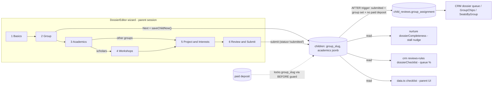

# feat: Dossier Wizard — Stepped, Group-Aware Application Flow

## Overview

Rebuild the parent dossier editor (`app/dashboard/DossierEditor.tsx`) from a single long form into a stepped wizard: Basics → **Group** (new, binding) → **Academics** (subject + Catch-Up/Reach-Ahead/Get-Solid plan) → Workshops (Scholars only, GT-style explore) → Project & Interests → Review & Submit. Per-step explicit saves with visible state, a progress rail, group-conditional steps, and a full cutover of every reader of the legacy `children.subjects` list to the new structured Academics entries. The parent's group pick seeds the staff review queue's `group_assignment` through a SECURITY DEFINER trigger and stays parent-editable until a deposit is paid.

## Problem Frame

The dossier is the application — the GTM funnel's conversion step — and today it captures neither the kid's group (the product's core positioning) nor an academic plan; staff invent both at review time. The wizard captures them structurally, adds progress/save affordances, and gives Scholars the GT-style workshops explore. Full product rationale, 5 founder decisions, and 29 integrated review findings: see origin `docs/brainstorms/2026-07-13-dossier-wizard-requirements.md`.

## Requirements Trace

Origin doc R1–R17 (including R9b, R12b, R16 no-caps, R17 undecided path). Unit mapping (primary units; R6 spans several): R1–R3 → Unit 3 · R4–R5, R16, R17 → Units 1+4 · R6 → Units 1 (lock/seed) + 3 (step re-derivation) + 4 (switch handling) · R7–R9b → Units 2+5 · R10–R13, R12b → Unit 6 · R14–R15 → Units 2+7.

## Scope Boundaries

- No time-slot ranking or scheduling collection (origin).
- No review-pipeline-stage or deposit-flow changes; CRM changes limited to: group seeding, dossier detail rendering Academics, the checklist mirror, and removing the now-contradicted `SCHOLARS_CAP` warning.
- No photo-upload rework (photos stay data-URL — S8 debt, don't deepen it; `academics` jsonb holds small structured entries only, never blobs).
- Re-verify zero `children` rows at deploy time; old-shape drafts handled per origin (null group → Step 2; plan-less entries prompt).

## Context & Research

### Relevant Code and Patterns

- **Step machine**: string-union step state with explicit transitions (`app/crm/components/library/SendComposer.tsx` `"compose" | "confirm"`); view switching precedent in `app/dashboard/DashboardApp.tsx`. No generic `<Wizard>` abstraction — that would be novel for this codebase.
- **Step rail visual grammar**: `StatusStepper` in `app/dashboard/ui.tsx` (numbered circles, done=blue ✓ / active=red / future=grey, mono labels).
- **Save-state machine**: `saving`/`submitError` pattern from `app/components/account/AccountModal.tsx` (origin R2).
- **Trigger skeleton**: `children_status_guard` (echo-tolerant `is distinct from`, `auth.role() = 'service_role'` bypass first line, SECURITY DEFINER + `set search_path = public`) and `stamp_dossier_submitted` (AFTER UPDATE, exception-swallowing `raise warning` so a parent save is never blocked) in `supabase/migrations/20260713110000_crm_core.sql`. Trigger naming convention `children_<thing>_guard`; same-timing triggers fire alphabetically.
- **child_reviews upsert posture**: `move_candidate`'s `on conflict (child_id) do update set group_assignment = coalesce(...)` — never clobber a staff-set group with null; `assignGroup` in `app/crm/lib/actions/reviews.ts` writes exactly one staff column and audits `group-assign`. Note `crm_audit_log.actor` is `uuid not null` — a DB trigger has no actor, so the seeding trigger writes **no** audit row.
- **Queue visibility**: `effectiveReviewStatus(children.status, review)` in `app/crm/lib/reviews-rules.ts` governs queue membership — a review row seeded for a *draft* child must not surface it. Hence: **seed only at/after submission** (see Key Technical Decisions).
- **Children selects to extend**: `fetchDossierQueue` in `app/crm/lib/queries.ts` (~line 700, the only staff select carrying dossier fields) + its `DossierChildRow`; the nurture cron select in `app/api/cron/nurture/route.ts` + `NurtureChildRow` in `app/lib/nurture/rules.ts`. (`fetchPipeline`/`fetchFamilyDetail`/CRM dashboard selects carry no dossier fields — untouched.)
- **Preview**: `app/dashboard/DossierPreview.tsx` renders `child.subjects` pills (the cutover site), workshop titles via `workshopById`, and a footer hardcoding "GT Toronto" (stale under five-groups positioning — fix in Unit 7).
- **Form primitives available**: `Label`, `TextField`, `TextArea`, `inputCls`, `Meter` (`app/dashboard/ui.tsx`); no select/radio/chip primitives on the parent side — group cards, plan pickers, and filter chips are new UI.
- Contradiction found in research: `computeSeatsByGroup` (`app/crm/lib/gtm.ts`) carries `SCHOLARS_CAP = 24` + `scholarsWarning` — obsolete under the no-per-group-caps decision; remove in Unit 7.

### Institutional Learnings

- `docs/solutions/integration-issues/supabase-cli-stale-db-password-management-api-workaround-2026-07-13.md` — the migration path: Management API SQL endpoint, UTF-8-byte bodies, `[string]`-typed params, record version in `supabase_migrations.schema_migrations`, verify with SELECTs.
- `docs/solutions/security-issues/supabase-autoconfirm-forged-consent-email-confirmation-signup-retrofit-2026-07-13.md` — (a) **deploy ordering**: additive schema first, app code second, behavior flips last; old clients must keep working during the gap; (b) **trigger trust audit**: `on_parent_created` was a P0 vector because it laundered a parent-controlled field into trusted state — the new seeding trigger copies **exactly one field (`group_slug`)** into staff-only rows, nothing else; (c) the production E2E recipe (SQL-simulated confirmation, `delivered+x@resend.dev`, cleanup) for end-to-end verification.
- Roadmap constraints: seat-count truth (single source), deposit strictly after dossier, five groups as peers, 700ms-debounce store is the one persistence pattern (extend, don't duplicate), the store's confirm-email self-heal must survive, GTM-1 stall nudge can't be E2E'd until `CRON_SECRET` is set.
- CRM residual todos overlap check: `.context/compound-engineering/todos/` — none touch the dossier queue's checklist path; no conflicts.

## Key Technical Decisions

- **Storage**: `children.group_slug text not null default ''` + `children.academics jsonb not null default '[]'` (array of `{subject, plan, goal}`); additive, old clients unaffected. **DB-enforced shape** (review finding — the dashboard's browser-to-Supabase save path has no server-side Zod layer, so UI limits alone are bypassable): CHECK `group_slug` ∈ {'', athletes, founders, makers, scholars, givers} (mirrors the `review_status` CHECK pattern; garbage values would silently vanish from seats-by-group accounting), and CHECK `jsonb_array_length(academics) <= 2` plus a `pg_column_size` bound (the "small entries, never blobs" rule enforced where writes land). Legacy `children.subjects` column stays but is no longer written (cutover: all readers use academics; checklist keeps a legacy fallback `subjects.length >= 1` per origin R14).
- **Seeding trigger fires for any non-draft child** (corrected in review — two reviewers independently confirmed that gating on `status = 'submitted'` breaks re-seeding the moment `move_candidate` advances the child to in_review/invited/offered, silently violating "parent-editable until deposit" exactly where it matters): AFTER INSERT OR UPDATE ON children; fire when no live paid deposit AND `group_slug <> ''` AND — TG_OP-aware, since OLD doesn't exist on INSERT — either (INSERT with `status <> 'draft'`) or (UPDATE with (draft→submitted transition) OR (`status <> 'draft'` AND group_slug changed)). Draft-leak protection is preserved: drafts never seed; non-draft group changes hit children that already have a review row (or are submitted). Upsert `child_reviews.group_assignment = NEW.group_slug` (`on conflict (child_id) do update`); copies only `group_slug`. **Staff-visible trace** (review finding — newest-write-wins stands per the origin decision, but a staff-set assignment must not vanish without a trace; `crm_audit_log.actor` is NOT NULL so the trigger can't audit): on a re-seed that changes an existing assignment, the trigger also inserts a system `family_notes` row ("Parent updated group preference to X" — `family_notes.author` is nullable, the established system-note posture). Exception-swallowing like `stamp_dossier_submitted`.
- **Deposit predicate + refund behavior (resolved in review)**: both the lock guard and the seeding trigger use the live-paid predicate — `status = 'paid' AND refunded_at IS NULL` (matching `isLivePaid` in `app/crm/lib/reviews-rules.ts`, not the delete-guard's status-only check). A refund therefore **re-opens** group editing — intentional, consistent with the dashboard already allowing re-reserving after a refund — and the corrected trigger re-seeds correctly in that window.
- **Submission is one-way for parents (resolved in review)**: `children_status_guard` is tightened so a parent session cannot leave 'submitted' (draft→submitted only; service_role unrestricted). Rationale: every submission now seeds a review row that `effectiveReviewStatus` trusts, so a parent un-submit (currently possible via direct PATCH) would produce an unlocked wizard while the staff queue still shows the child — the DB now matches the lock the UI already promises.
- **Deposit lock enforced server-side**: `children_group_lock_guard` BEFORE UPDATE OF group_slug — service_role bypass, echo-tolerant, raises when a live paid deposit exists for the child. The wizard mirrors this client-side (read-only group post-deposit) but the DB is the gate.
- **Stall threshold unchanged and provably invariant**: `>80%` equals "missing at most one item" for both the 8-item (non-Scholars) and 9-item (Scholars) checklists — 7/8 = 87.5, 7/9 = 77.8 < 80 < 8/9 = 88.9. No recalibration needed; origin's deferred question resolved by arithmetic.
- **Per-step validation posture**: Next always saves and advances (no step gating); required-ness is enforced once, at Review, by the checklist with deep-links (origin R3). Exception: the Group step's selection is required to *derive* later steps, so Next on Group is disabled until a card is picked.
- **Locked post-submit wizard**: all steps remain clickable read-only (per-step disabled fieldset + the existing lock banner). The Group step alone stays editable until deposit (origin R5/R6); changing it post-submit re-opens only Group + Workshops.
- **Grade filter data**: **derive** `gradeMin`/`gradeMax` by parsing the existing `grades` display strings at module load (one small parse function; K = 0, "8+" = 12) rather than hand-annotating 47 entries (review finding — 94 hand-typed numbers invite silent off-by-band errors), with an exhaustive test asserting every catalog entry parses. Filter bands mirror GT's (All, K–2, 3–5, 6–8) with overlap semantics.
- **Resume behavior**: reopening a draft lands on the first incomplete step (computed from the checklist), not Step 1.
- **Wizard external contract unchanged**: `DossierEditor({ child, onBack, onPreview })` mounted from `DashboardApp` stays; the "Saved to your account as you type" home-card copy updates to reflect explicit saves.

## Open Questions

### Resolved During Planning

- Seeding mechanism → SECURITY DEFINER trigger at submission (above), matching `stamp_dossier_submitted`'s never-block posture and `move_candidate`'s no-clobber upsert.
- Grade filter → structured gradeMin/gradeMax + GT's own bands.
- Next-save path → new awaited `saveChildNow(id): Promise<{ok, error?}>` in the store (flushes the pending debounce, single persistence pattern preserved).
- Mirror deploy sequencing → all three checklist implementations + both column selects change in **one deploy** (Unit 7 lands with Units 2–6 in the same release); schema (Unit 1) lands first and is additive.
- Academics storage & required plan → jsonb (above); an entry counts toward completeness only when subject AND plan are set (origin success criteria).
- Plan/goal staff visibility → CRM DossierDetail renders per-entry subject + plan + goal (Unit 7).

### Deferred to Implementation

- Exact copy for the undecided-parent affordance and the per-group example projects (drawn from `app/lib/site.ts` `body` lines; wordsmithing at build time).
- Whether the Workshops filter chips need a "45/60 min" length filter like GT's — add only if the two filters feel thin in practice.
- Confirm-dialog styling for "switching away from Scholars clears workshop picks" (native confirm vs inline).

## High-Level Technical Design

> *This illustrates the intended approach and is directional guidance for review, not implementation specification. The implementing agent should treat it as context, not code to reproduce.*

Step count is group-dependent (6 for Scholars, 5 otherwise); the three checklist readers at the bottom are the lockstep mirrors (origin R14).

## Implementation Units

- [ ] **Unit 1: Schema + triggers migration (production-applied)**

**Goal:** Additive children columns and the two DB-side rules: group seeding at submission, group lock at deposit.

**Requirements:** R4–R6, R14 plumbing preconditions.

**Dependencies:** None. Lands (and is applied to production) before any app code ships.

**Files:**
- Create: `supabase/migrations/20260714130000_children_group_academics.sql`

**Approach:**
- `alter table children add column group_slug text not null default '', add column academics jsonb not null default '[]'` + the two CHECK constraints (group-slug enum incl. ''; academics length ≤ 2 and size bound) per Key Technical Decisions.
- `children_group_lock_guard` (BEFORE UPDATE OF group_slug): service_role bypass → echo-tolerant → raise if a **live** paid deposit (`status='paid' AND refunded_at IS NULL`) exists for the child.
- `children_seed_group_assignment` (AFTER INSERT OR UPDATE): the corrected TG_OP-aware non-draft fire condition per Key Technical Decisions; body wrapped `begin/exception when others → raise warning`; upsert copies only `group_slug`; no audit insert; system `family_notes` trace when a re-seed changes an existing assignment.
- Tighten `children_status_guard`: parent sessions may not transition status away from 'submitted' (one-way; echo still allowed; service_role unrestricted).
- Apply via the Management API playbook; record version in `schema_migrations`; verify columns, constraints, all triggers, and a dry-run seed with SELECTs through the same endpoint.

**Patterns to follow:** `children_status_guard`, `stamp_dossier_submitted`, `move_candidate`'s upsert in `supabase/migrations/20260713110000_crm_core.sql`.

**Test scenarios:** (scripted SQL checks via the Management API — the repo has no pgTAP harness, a known gap)
- Happy path: child transitions to submitted with group_slug set, no deposit → child_reviews row exists with matching group_assignment.
- Happy path: post-submission group_slug change (no deposit) → group_assignment follows (newest write wins).
- Edge: draft child with group_slug set → NO child_reviews row (queue stays clean).
- Edge: group_slug echoed unchanged in a full-row autosave upsert → no error, no spurious re-seed effect.
- Error path: group_slug change on a child with a live paid deposit → raises; service_role performing the same change → allowed; **refunded** deposit (refunded_at set) → change allowed and re-seeds.
- Error path: out-of-enum group_slug or a 3-entry/oversized academics payload via direct REST → rejected by CHECK.
- Error path: parent attempt to flip status submitted→draft → raises (one-way guard); service_role → allowed.
- Integration: staff `assignGroup` after seeding, then parent group change pre-deposit → parent's newer value wins AND a system family_note records the change; after deposit → staff value untouchable by parent.
- Integration (the corrected-condition proof): `move_candidate` advances the child to 'in_review', then parent group change pre-deposit → `group_assignment` follows (this is the scenario the original `status='submitted'` gate failed).

**Verification:** All SEL./checks above pass against production; old deployed app (pre-wizard) still saves dossiers unaffected.

- [ ] **Unit 2: Data model, checklist, catalog structure, store save path**

**Goal:** The Child model gains groupSlug + academics; the parent checklist becomes group-aware; the catalog becomes filterable; the store gains an awaited explicit save.

**Requirements:** R2, R7–R9b, R14 (parent-UI mirror), R15 (cutover groundwork).

**Dependencies:** Unit 1 (columns exist in production before this deploys).

**Files:**
- Modify: `app/dashboard/data.ts`, `app/dashboard/store.tsx`, `vitest.config.ts` (include `app/dashboard/__tests__`)
- Test: `app/dashboard/__tests__/dossier-checklist.test.ts`

**Approach:**
- `data.ts`: `Academic` type (`subject` free string, `plan: "catch-up" | "reach-ahead" | "get-solid" | ""`, `goal`), `ACADEMIC_SUBJECTS` (the 7), `ACADEMIC_PLANS` (labels + blurbs), `academicComplete`; `Child.groupSlug` + `Child.academics`; `emptyChild` extended; `checklist()` per origin R14 (group item for all; workshops item only when `groupSlug === "scholars"`; academics item: `academics.some(academicComplete) || subjects.length >= 1` legacy fallback); `gradeMin`/`gradeMax` added to every `WORKSHOPS` entry (K=0, "8+"=12).
- `store.tsx`: `rowToChild`/`childToRow` map `group_slug`/`academics`; **stop writing `subjects`**; `saveChildNow(id)` flushes any pending debounce timer and awaits the upsert, returning `{ok, error?}` for the wizard's Next state machine. Self-heal path untouched.

**Patterns to follow:** existing `checklist()`/`completeness()` shape; `childToRow` mapping style.

**Test scenarios:**
- Happy path: non-Scholars complete child → 8/8 items, 100%; Scholars complete child (with a workshop) → 9/9.
- Happy path: academics entry with subject+plan satisfies the academics item; subject without plan does not.
- Edge: legacy row (subjects populated, academics empty) still satisfies the academics item (fallback).
- Edge: groupSlug "" → group item undone; workshops item absent for "" (treated as non-Scholars until picked).
- Edge: Scholars missing only the workshop → 8/9 ≈ 88.9% (>80, stall-nudge eligible); missing two → 77.8% (<80). Non-Scholars missing one → 87.5%.
- Happy path: catalog gradeMin/gradeMax spot-checks ("K–8+" → 0..12, "3–5" → 3..5, "6–8+" → 6..12).

**Verification:** Suite green; a hand-built Child object round-trips through childToRow/rowToChild preserving group + academics.

- [ ] **Unit 3: Wizard shell**

**Goal:** The stepped frame: progress rail, Next/Back with save states, resume, locked post-submit behavior, Review step.

**Requirements:** R1–R3, R6 (step re-derivation).

**Dependencies:** Unit 2.

**Files:**
- Modify: `app/dashboard/DossierEditor.tsx` (rebuilt), `app/dashboard/DashboardApp.tsx` (home-card copy), `app/dashboard/ui.tsx` (step-rail component if extracted)

**Approach:**
- Steps as a derived `const` array (group-aware: workshops included only for Scholars); string-union/index state with explicit transitions (SendComposer pattern); rail styled after `StatusStepper` but — unlike that passive display — carrying an interaction contract: `aria-current` on the active step, completed steps as keyboard-operable links, condensed "Step k of N · Name" under 480px.
- Next: `saveChildNow` → saving (disabled) → advance on ok / inline retryable error on failure (AccountModal pattern). Back and completed-step clicks free. Group step's Next disabled until picked; all other validation deferred to Review.
- **Submit gets the same state machine as Next** (review finding — the current `submitChild` is fire-and-forget with console-only errors, and Submit is the write the whole seeding chain hangs on): set status/submittedAt, await `saveChildNow`, render the submitted/locked state only on ok, inline retryable error on failure.
- Resume at first incomplete step; post-submit: steps clickable, fieldsets disabled, **lock banner copy updated** to state the Group exception ("Your group choice can still be changed until a deposit is paid; contact admissions@… for other changes" — the current copy would contradict an editable Group card); Group remains editable pre-deposit, a change re-opens Group + Workshops only, and a post-submit Group save gets its own confirmation affordance (inline "choice updated" — Next's advance feedback doesn't apply in the locked wizard).
- Review step: checklist with per-item deep-links to owning steps; a step reached via deep-link shows a "Back to review" affordance so the fix-and-return loop is direct; preview button (existing `onPreview`); submit gated at 100%. The existing confirm-gated "Remove this child" action survives the rebuild, living in the Review step's footer.

**Patterns to follow:** `SendComposer.tsx` step state; `StatusStepper` visuals; `AccountModal.tsx` save states.

**Test scenarios:** (pure step-derivation logic extracted to `data.ts` or a `wizard-rules` module for testability — the repo has no jsdom harness)
- Happy path: steps for scholars = 6, others = 5; step list re-derives when groupSlug changes.
- Happy path: first-incomplete-step resolution for an empty child (→ Basics), a child missing only pitch (→ Project), a complete draft (→ Review).
- Edge: current step becomes invalid after a group switch (sitting on Workshops, switch to Makers) → routes to Project & Interests.
- Integration (manual, listed in verification): Next persists before advancing; a network failure keeps the user on-step with an error.

**Verification:** A draft can be driven end-to-end through the wizard in the browser; killing the tab mid-flow and reopening resumes at the right step with data intact.

- [ ] **Unit 4: Group step**

**Goal:** The binding group pick with honest affordances.

**Requirements:** R4–R6, R16 (no caps), R17.

**Dependencies:** Unit 3.

**Files:**
- Modify: `app/dashboard/DossierEditor.tsx` (step component), possibly `app/dashboard/ui.tsx`

**Approach:**
- Five cards from `app/lib/site.ts` `groups` (name, category, blurb + `body` line for richness) as a semantic radiogroup; no availability states (no caps).
- Undecided affordance: "Not sure? …" block with the booking link (`BOOKING_URL`) and a one-liner on how families choose.
- Switch-away-from-Scholars: an inline confirm (styled, not native `confirm()`) with **no state mutated until accepted** — Cancel leaves the prior group selected and `workshopIds` untouched; on accept, clear `workshopIds`. Switch-to-Scholars: workshops step (re)appears and is prompted next.

**Patterns to follow:** group card content from `site.ts`; selection semantics per origin R4 a11y contract.

**Test scenarios:** (pure rules where extractable)
- Happy path: picking a group marks the checklist item, derives steps.
- Edge: switch away from Scholars clears workshopIds (rule-level test); switch back yields empty workshop selection (deliberate, per origin).
- Error path: group change attempt post-deposit is rejected by the DB → wizard surfaces the inline error (manual verification; guard tested in Unit 1).

**Verification:** All five groups selectable with keyboard alone; the binding + editable-until-deposit semantics render correctly pre/post-submit.

- [ ] **Unit 5: Academics step**

**Goal:** The renamed, restructured Academics capture.

**Requirements:** R7–R9b.

**Dependencies:** Unit 3.

**Files:**
- Modify: `app/dashboard/DossierEditor.tsx` (step component)

**Approach:**
- Ask copy per R7. Entry block: subject pills (7) + "Other subject…" free-text (R9b); three plan cards (Catch-Up / Reach Ahead / Get Solid with blurbs); optional goal textarea ("What do you want to accomplish with this Academic Project").
- "+ Add another subject" → second identical block (max 2), removable. Test scores textarea stays (optional).
- Old-shape draft handling: a legacy `subjects` entry without academics renders as a prefilled subject with plan unset, with an inline soft-required "pick a plan" hint on the entry (distinct from the checklist's pass/fail signal, which the legacy fallback already satisfies).

**Patterns to follow:** subject-pill toggle styling from the current editor; TextArea/TextField primitives.

**Test scenarios:**
- Happy path: one complete entry (subject+plan) → checklist satisfied; goal optional.
- Edge: two entries max — the + control disappears/disables at 2; removing the second re-enables.
- Edge: custom "Other" subject counts the same as a listed one.
- Edge: legacy subjects → prefilled plan-less entries; completeness satisfied via fallback but the UI still nudges for a plan.

**Verification:** Entries persist through Next and round-trip on reload; CRM sees them after Unit 7.

- [ ] **Unit 6: Workshops explore (Scholars) + Project & Interests**

**Goal:** The GT-style explore rebuild and the group-aware project step.

**Requirements:** R10–R13, R12b.

**Dependencies:** Units 2 (gradeMin/Max), 3.

**Files:**
- Modify: `app/dashboard/DossierEditor.tsx` (two step components; extract to `app/dashboard/wizard/` files if the editor grows unwieldy)

**Approach:**
- Workshops: filter chips — each axis (Track: All/Sciences/Humanities/Competition; Grade: All/K–2/3–5/6–8) is a single-select segmented control (radiogroup semantics), the two axes combinable, range-overlap matching; flat card grid (existing card content + audition badge from the **existing** `audition` flag in `app/dashboard/data.ts`), selected count, zero-match empty state with clear-filters (origin R11).
- Project & Interests: non-Scholars get the R12 copy + 2–3 example projects per group from `site.ts` `body` (R12b) + 4–8-week framing; Scholars keep the current framing (R13). Portfolio field stays.

**Patterns to follow:** existing workshop card markup in the current editor; GT page structure (filters left/above, grid, count) fitted to our design system.

**Test scenarios:** (filter logic as pure functions; sets corrected in review against the real catalog)
- Happy path: Competition × 3–5 → {Botball Robotics, Competitive Chess, History on Trial, I Said What I Said, Math Competitor Academy, Math Elite Academy} (six — the K–8+/3–8+/4–8+/4–5 ranges all overlap 3–5); Sciences × K–2 → {Board Game Masters, Think like a Scientist}.
- Edge: zero-match empty state exercised with a synthetic catalog fixture — no real Track × Grade combination is empty (Competitive Chess's K–8+ overlaps every band); clear-filters restores.
- Edge: grade-band overlap ("K–8+" appears in every band; "6–8+" not in K–2 or 3–5).
- Happy path: non-Scholars never render the step; their project step shows the R12 copy + examples for their specific group.

**Verification:** Scholars flow shows the explore grid with working filters and audition badges; a Makers kid goes Academics → Project directly with Makers examples.

- [ ] **Unit 7: Consumers cutover — preview, nurture mirror, CRM (one deploy with Units 2–6)**

**Goal:** Every reader of the legacy subjects list reads Academics; the three checklists agree; staff see group + plan + goal; the obsolete Scholars cap warning goes.

**Requirements:** R14, R15; origin success criteria (staff receive the plan).

**Dependencies:** Units 1–2 (must ship in the same release as 3–6).

**Files:**
- Modify: `app/dashboard/DossierPreview.tsx`, `app/lib/nurture/rules.ts`, `app/api/cron/nurture/route.ts`, `app/crm/lib/reviews-rules.ts`, `app/crm/lib/queries.ts`, `app/crm/components/dossiers/DossierDetail.tsx`, `app/crm/lib/gtm.ts` (+ its dashboard consumer for the removed warning)
- Test: `app/lib/nurture/__tests__/nurture-rules.test.ts`, `app/crm/__tests__/actions-reviews.test.ts` (dossierChecklist cases), `app/crm/__tests__/dashboard-derive.test.ts` (seats-by-group warning removal)

**Approach:**
- Preview: "Subjects to accelerate" block → Academics entries (subject — plan label — goal); add a Group line to the header; fix the hardcoded "GT Toronto" footer to the kid's group; workshops block renders only when it has content.
- Nurture: `NurtureChildRow` + cron select gain `group_slug, academics`; `dossierCompleteness` mirrors Unit 2's checklist exactly (group item, scholars-only workshops item, academics-with-legacy-fallback). Threshold untouched (invariance proven — see Key Technical Decisions).
- CRM: `fetchDossierQueue` select + `DossierChildRow` gain the columns; `dossierChecklist`/`dossierCompleteness` in `reviews-rules.ts` mirror the same definition; `DossierItem` carries academics; `DossierDetail` renders per-entry subject + plan + goal (replacing the joined subjects line) and shows the parent-picked group context next to `GroupChips`.
- Remove `SCHOLARS_CAP`/`scholarsWarning` from `computeSeatsByGroup` and its rendering (no-caps decision).

**Patterns to follow:** existing `asStringArray` tolerant-parse idiom for jsonb; the three-mirror lockstep list from origin R14.

**Test scenarios:**
- Happy path: identical child data produces identical completeness % across all three implementations (table-driven: complete Scholars, complete non-Scholars, missing-one, missing-two, legacy-subjects-only, empty).
- Edge: child rows fetched WITHOUT the new columns (undefined) classify as group-unset — no crash, workshops item excluded.
- Edge: stall-nudge eligibility unchanged at the boundary (missing exactly one item in both variants → eligible; two → not).
- Happy path: seats-by-group output no longer contains a scholars warning; committed/assigned math unchanged.
- Integration: submitted Scholars child with academics + workshops renders fully in DossierDetail (group, entries with plans/goals, workshop titles, completeness 100%).

**Verification:** Parent 100% == CRM queue 100% == nurture 100% for the same child; staff detail shows plan + goal without asking.

## System-Wide Impact

- **Interaction graph:** children writes now touch three triggers (status guard, new group lock, new seeding trigger, plus `stamp_dossier_submitted`) — all echo-tolerant/service_role-bypassed; `move_candidate` and `assignGroup` compose with seeding via the no-clobber upsert + newest-write-wins rule.
- **Error propagation:** the seeding trigger swallows exceptions (warning only) so a parent save never fails on CRM plumbing; the group-lock guard is the one intentional hard failure, surfaced inline by the wizard.
- **State lifecycle risks:** group switch clears workshop picks (explicit, confirmed); per-step saves make partial dossiers normal — checklist semantics already tolerate them.
- **API surface parity:** none — no new routes; parent writes stay on the existing RLS path.
- **Integration coverage:** the trigger chain (submit → seed → queue) is only provable against a real DB — covered by Unit 1's scripted checks + the E2E recipe.
- **Unchanged invariants:** review pipeline stages, deposit flow, seats-truth source, `move_candidate` contract, nurture sequences/gating, `effectiveReviewStatus` queue semantics (protected by the submit-only seeding decision).

## Risks & Dependencies

| Risk | Mitigation |
|------|------------|
| Seeding trigger leaks drafts into the staff queue | Seed only at/after submission (decision); Unit 1 test asserts draft+group → no review row |
| Checklist mirrors drift in a partial deploy | Units 2–7 ship as one release; schema (U1) is additive and lands first; table-driven parity test across all three implementations |
| Trigger privilege-laundering (the P0 pattern) | Trigger copies exactly `group_slug`; nothing else parent-controlled reaches staff rows; no consent/identity fields involved |
| Old client mid-deploy writes old-shape rows | Columns are defaulted; wizard handles null-group/plan-less drafts; zero-rows re-verified at deploy |
| DossierEditor rebuild balloons | Step components may be extracted to `app/dashboard/wizard/`; external contract (`child/onBack/onPreview`) fixed |
| Stall nudge misfires after checklist change | Threshold invariance proven arithmetically (independently re-verified in review, including the group-null old-draft case) + boundary tests in Units 2/7; note GTM-1 E2E still gated on `CRON_SECRET` |
| Stale parent tabs after the one-release deploy | Old tabs run the old checklist and can submit with `group_slug=''` — no seed fires, staff assign manually (their existing workflow); mirror parity holds for every post-refresh session. Accepted; noted for the post-deploy watch |

## Documentation / Operational Notes

- Deploy order: U1 migration (Management API + schema_migrations record + verify) → single app release (U2–U7) → production E2E via the documented recipe (signup with black-hole address, SQL-confirm, drive the wizard, verify child_reviews seeding, clean up).
- Update `artifacts/roadmap.md` (this absorbs S8's "Dashboard 'group' picker (data model + UI)" line) on completion.
- Post-deploy watch: Postgres logs for `children_seed_group_assignment` warnings; CRM queue for phantom drafts; stall-nudge counts once CRON_SECRET is live.

## Sources & References

- **Origin document:** [docs/brainstorms/2026-07-13-dossier-wizard-requirements.md](../brainstorms/2026-07-13-dossier-wizard-requirements.md)
- Related code: `app/dashboard/DossierEditor.tsx`, `app/dashboard/store.tsx`, `app/dashboard/data.ts`, `supabase/migrations/20260713110000_crm_core.sql`, `app/crm/lib/reviews-rules.ts`, `app/crm/lib/queries.ts`
- Institutional learnings: `docs/solutions/integration-issues/supabase-cli-stale-db-password-management-api-workaround-2026-07-13.md`, `docs/solutions/security-issues/supabase-autoconfirm-forged-consent-email-confirmation-signup-retrofit-2026-07-13.md`
- Pre-brainstorm WIP sketch: `docs/plans/attachments/2026-07-14-dossier-wizard-wip-sketch.patch` (materialized from the stash for stability — **read-only input, never apply/pop**; it predates the cutover, three-mirror, and corrected-trigger decisions)
