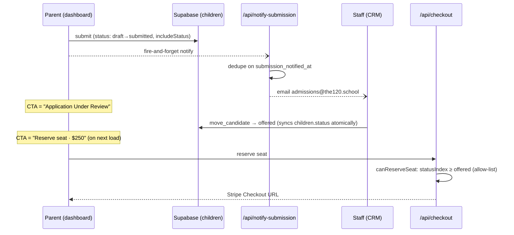
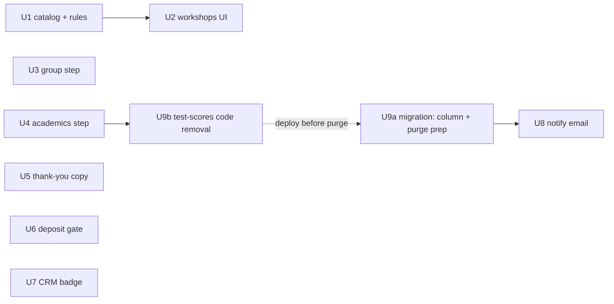

---
title: "feat: Dossier intake polish & application approval gate"
type: feat
status: completed
date: 2026-07-14
origin: docs/brainstorms/2026-07-14-dossier-intake-polish-and-approval-gate-requirements.md
---

# feat: Dossier intake polish & application approval gate

## Overview

Two threads, one release: (1) streamline the dossier intake wizard — compact group picker, decluttered academics, a faster Scholars workshops step with a 3-pick cap and no grade machinery; (2) insert an admissions approval stage between dossier submission and the $250 seat deposit — checkout unlocks only when staff move a candidate to `offered`, the CRM surfaces who is waiting, and admissions gets an email per submission. Also fully retires the test-scores field, including a DB purge.

## Problem Frame

The wizard is slower and more cluttered than an interest-gathering flow should be, and the deposit currently unlocks the instant a dossier is submitted — before admissions has looked at it. See origin: `docs/brainstorms/2026-07-14-dossier-intake-polish-and-approval-gate-requirements.md` (all product decisions, exact copy strings, and scope boundaries live there and are treated as fixed).

## Requirements Trace

| Req | Summary | Unit(s) |
|-----|---------|---------|
| R1 | Group step intro copy (exact string) | 3 |
| R2 | 5 compact group cards on one mobile screen; details disclosure separate from select | 3 |
| R3 | Retire test scores: wizard field, CRM display, DB purge | 4, 9 |
| R4 | Subjects in two rows (Fast Math/Math/Science; Reading/Writing/Language/Vocabulary) | 4 |
| R5 | Delete 5 K–2-only workshops from selectable catalog | 1 |
| R6 | No grade filter, no grades on cards | 1, 2 |
| R7 | No "All tracks"; one track at a time; default Sciences | 1, 2 |
| R8 | Max 3 selections; disable + inline note at cap; min stays 1 | 2 |
| R9 | Sticky selection bar: removable chips + Next always reachable | 2 |
| R10 | Exact thank-you message on submit | 5 |
| R11 | Deposit gated on `offered`-or-later; allow-list; server + UI; distinct rejection copy | 6 |
| R12 | "Application Under Review" CTA + sub-copy; blanket across pre-approval stages; paid wins | 6 |
| R13 | Reserve CTA appears at `offered`-or-later | 6 |
| R14 | Needs-review badge (all pre-`offered`) + per-stage chip counts in CRM queue | 7 |
| R15 | Best-effort submission email to admissions@the120.school with dedupe | 8 |
| R16 | Launch triage of existing `submitted` candidates | Operational notes |

## Scope Boundaries

Carried verbatim from origin: no new status values or enum migration; workshops step stays Scholars-only; no changes to deposit amount, refund policy, Stripe flow, or group-lock-on-deposit; Basics grade collection unchanged. Additionally out of scope here: consolidating the three checklist mirrors (they need no edits — see Unchanged Invariants), nav-level CRM badge placement (queue-page badge only), and dropping the `test_scores` column (purge-in-place; drop is a possible follow-up).

## Context & Research

### Relevant Code and Patterns

- **Wizard steps**: `app/dashboard/wizard/Step{Group,Academics,Workshops}.tsx`, shared primitives in `app/dashboard/wizard/shared.tsx` (`StepSection`, `StepProps`, `focusRing`) and `app/dashboard/ui.tsx`. Shell + step nav: `app/dashboard/DossierEditor.tsx` (nav block at bottom; `saveState` machine, `nextDisabled`, `goNext` saves-then-advances).
- **Catalog & rules**: `WORKSHOPS`, `GRADE_RANGES`, `SeatStatus`, `STATUS_FLOW`, `statusIndex`, `checklist` in `app/dashboard/data.ts`; `TRACK_FILTERS`, `GRADE_BANDS`, `filterWorkshops` in `app/dashboard/wizard-rules.ts`.
- **Dashboard CTA**: `app/dashboard/DashboardApp.tsx` — `canReserve` is a one-expression inline derivation (`c.status !== "draft" && (!deposit || deposit.status === "refunded")`); `reserveSeat()` and post-Stripe banners live here too.
- **Checkout**: `app/api/checkout/route.ts` — dual auth (Bearer → ad-hoc anon client / cookie client), RLS-scoped child select, `{ error }` JSON with 400/401/404/500, currently rejects only `status === "draft"`.
- **Email**: `sendEmail()` in `app/lib/email.ts` (raw Resend fetch, never throws, `FROM "The 120 <hello@the120.school>"`, reply-to admissions). Precedent route `app/api/welcome/route.ts`: same dual auth, idempotency via sent-marker, failure → 502 without stamping so retries work; client invokes fire-and-forget (`void fetch(...).catch(() => {})` — `app/dashboard/store.tsx`, `app/components/account/AccountModal.tsx`).
- **CRM queue**: `app/crm/(app)/dossiers/page.tsx` (server component, `requireStaff()`, `fetchDossierQueue()`); `app/crm/components/dossiers/QueueList.tsx` (client, local filter state, count-less stage `Chip`s from `app/crm/components/pipeline/atoms.tsx` — children are free ReactNode, so counts need no atom change); `DossierItem` shaped server-side in `app/crm/lib/queries.ts`.
- **Status ordering**: `REVIEW_STATUSES` tuple in `app/crm/lib/constants.ts` mirrors `STATUS_FLOW` ("one enum, one spelling"); `effectiveReviewStatus` in `app/crm/lib/reviews-rules.ts`.
- **Tests**: Vitest 4, pure-logic canon — *no Supabase mocking, no component/route tests*. Extract decision logic into pure helpers and test those. Homes: `app/dashboard/__tests__/wizard-rules.test.ts`, `app/dashboard/__tests__/dossier-checklist.test.ts`, `app/crm/__tests__/*.test.ts` (fixture-factory style, e.g. `child(overrides)` over `emptyChild`).
- **UI idioms**: native `
/
` disclosure (`app/components/Faq.tsx`); sticky chrome via `sticky … z-40 bg-paper/90 backdrop-blur-md` (`DashHeader` in `app/dashboard/ui.tsx` — mirror flipped for a bottom bar); Tailwind v4 design tokens (`text-ink`, `border-line`, `bg-red`/`hover:bg-red-dark`, mono uppercase micro-labels); primary button shape from `DossierEditor.tsx`.
- **`test_scores` touchpoints** (complete list): `supabase/migrations/20260709200000_initial_schema.sql` (column, `text not null default ''`); `app/dashboard/store.tsx` (row type, `rowToChild`, `childToRow`); `app/dashboard/data.ts` (`Child` field, `emptyChild`); `app/dashboard/wizard/StepAcademics.tsx` (input); `app/dashboard/DossierPreview.tsx` (render); `app/crm/lib/queries.ts` (`DossierItem`, select string, row interface, mapping); `app/crm/components/dossiers/DossierDetail.tsx` (render); `app/dashboard/__tests__/dossier-checklist.test.ts` (fixture). Not referenced by any checklist mirror.

### Institutional Learnings

- `docs/solutions/database-issues/stale-status-echo-full-row-upsert-vs-trigger-guard-coerce-not-raise-2026-07-14.md` — never round-trip server-owned columns in routine client saves (`childToRow` opt-in pattern); any trigger keyed to statuses must coerce, not raise, for parent-role writes; surface save failures, don't just `console.error`.
- `docs/solutions/integration-issues/supabase-cli-stale-db-password-management-api-workaround-2026-07-13.md` — all production SQL (the purge, any new column) goes through the Supabase Management API with the CLI token from Windows Credential Manager; one-invocation PowerShell, UTF-8 byte bodies; record migration versions in `supabase_migrations.schema_migrations`.
- `docs/solutions/security-issues/supabase-autoconfirm-forged-consent-email-confirmation-signup-retrofit-2026-07-13.md` — ship client changes before tightening server behavior (applies to the checkout gate rollout); test Resend sends with `delivered+x@resend.dev` black-hole addresses.

### External References

None needed — every touched surface has a strong local pattern.

## Key Technical Decisions

- **Gate keys off `children.status` directly**: the `move_candidate` RPC already syncs it atomically with `child_reviews.review_status`, and the status guard prevents parent self-approval. No new sync channel, no `child_reviews` read from parent-facing code (which would risk exposing staff notes). Unlock predicate: `statusIndex(status) >= statusIndex("offered")` as an explicit allow-list. (see origin: Dependencies)
- **One pure helper for the gate, used by both surfaces**: `canReserveSeat(status, deposit)` in `app/dashboard/data.ts`, consumed by `DashboardApp` and the checkout route — so UI and server can't drift, and it's testable under the no-mocks canon.
- **Retired workshops become a display-only tombstone map**: the 5 K–2 workshops move from `WORKSHOPS` to a `RETIRED_WORKSHOPS` lookup. Selectable catalog shrinks (R5) while CRM detail and the printable preview keep resolving titles for legacy selections instead of degrading to raw slugs. (resolves origin deferred question)
- **Selections sanitize wherever workshops are editable — not just drafts**: workshops remain editable *after* submission until a deposit is paid (`stepEditable` in `DossierEditor.tsx`), so legacy rows with >3 picks or retired ids can legitimately reach the wizard. `sanitizeWorkshopSelection` (drop non-live ids, trim to 3) applies **in-memory** whenever an editable dossier loads — drafts and submitted-pre-deposit alike — and persists through the next normal save; deposit-locked wizards and staff-side views render historical selections read-only via the tombstone map (the wizard's sticky-bar chips also resolve titles live-then-retired). Accepted consequence: until the family next saves, the nurture/CRM mirrors read the raw stored ids and may briefly disagree with the parent-side view for the tiny population of legacy rows. If sanitizing drops a Scholars selection below 1, the checklist correctly re-flags the step.
- **Thank-you message renders as the post-submit locked state**: it replaces the current not-yet-paid locked-banner copy in `DossierEditor` and the `StepReview` submitted hint — no new route or modal. (resolves origin deferred question)
- **Email dedupe via a server-owned column, DB-enforced**: add `children.submission_notified_at timestamptz`. It is never in `childToRow` (status-echo learning), **and** the migration adds a coerce-on-non-service-role-write trigger (mirroring `children_status_guard`) so a parent REST write can't clear or pre-set the stamp — client-code convention alone would leave it forgeable. Dedupe is an **atomic claim-then-send**: conditional `UPDATE … SET submission_notified_at = now() WHERE id = … AND submission_notified_at IS NULL` via the admin client, send only if a row was claimed. A rare send-failure-after-claim loses that one email — accepted under R15's best-effort framing, because the CRM badge (not the email) is the reliable signal.
- **Purge-in-place, not column drop**: `UPDATE children SET test_scores = ''` keeps the schema stable so a straggler client can't error. The mapper/UI removal deploys first — and because a deploy does **not** reload already-open tabs (an old bundle keeps round-tripping `test_scores` on autosave), the purge is re-run and re-verified 24–48h after deploy; the column-drop follow-up is gated on that second clean count, not the immediate one.
- **No checklist-mirror edits**: verified — no mirror references test scores, and the workshop rule (≥1) is unchanged by the cap. The cap is a UI/selection constraint only.

## Open Questions

### Resolved During Planning

- Legacy workshop ids in existing data → tombstone map + draft-only sanitize (above).
- Where the thank-you renders → locked-banner/StepReview copy replacement (above).
- Email dedupe key → `children.submission_notified_at` (above).
- Badge placement → dossiers queue page header (nav-level badge out of scope).

### Deferred to Implementation

- Exact sticky-bar markup/breakpoint behavior once real content heights are visible — the 375×667 no-scroll criterion is verified visually at the end, not designed blind here.
- Whether the notify email needs a plain-text-only fallback body — follow whatever `sendEmail` callers do at implementation time.

## High-Level Technical Design

> *This illustrates the intended approach and is directional guidance for review, not implementation specification. The implementing agent should treat it as context, not code to reproduce.*

**Dashboard CTA decision matrix (Unit 6):**

| `children.status` | Live paid deposit? | CTA area shows |
|---|---|---|
| `draft` | — | "Submit the dossier to reserve a seat ($250, refundable)" (unchanged) |
| `submitted` / `in_review` / `invited` | no | **"Application Under Review"** + "Upon Acceptance, the next step is a fully refundable $250 deposit." |
| `offered` / `member` | no | "Reserve seat · $250" (existing CTA) |
| any | yes | "✓ Seat reserved · $250 deposit paid" (unchanged — always wins) |

**Approval flow (sequence):**

**Unit dependency graph:**

U3, U4, U5, U6, U7 are independent of each other and of U1/U2 — parallelizable.

## Implementation Units

- [x] **Unit 1: Workshops catalog retirement + filter rules**

**Goal:** Selectable catalog has no K–2-only workshops; filtering is track-only (no grades, no "All tracks"), defaulting to Sciences; retired workshops remain resolvable for display.

**Requirements:** R5, R6, R7

**Dependencies:** None

**Files:**
- Modify: `app/dashboard/data.ts` (move 5 K–2 entries to `RETIRED_WORKSHOPS`; a lookup that checks live-then-retired for display resolution)
- Modify: `app/dashboard/wizard-rules.ts` (remove `GRADE_BANDS` + grade matching; `TRACK_FILTERS` becomes the three tracks with `"Sciences"` default, no `"all"`)
- Modify: `app/crm/lib/queries.ts`, `app/dashboard/DossierPreview.tsx` (workshop title resolution consults the retired map instead of falling back to raw id)
- Test: `app/dashboard/__tests__/wizard-rules.test.ts`

**Approach:** Keep retired entries' full data (title, advisor) so legacy renders are indistinguishable from before; only selectability changes. Grade parsing (`parseGradeRange`/`GRADE_RANGES`/`workshopGradeRange`) is deleted — note `app/dashboard/__tests__/dossier-checklist.test.ts` imports it and has a full `describe("parseGradeRange")` block, which is deleted alongside (add that file to this unit's edits).

**Execution note:** Unit 1 does not compile standalone — `StepWorkshops.tsx` (Unit 2) consumes `GRADE_BANDS`/`GradeBandId` and the old `filterWorkshops` signature. Land Units 1+2 as one buildable change; Unit 1's isolated verification is tests-only.

**Patterns to follow:** existing `TRACK_FILTERS`/`filterWorkshops` shape; `workshopById`-style lookups.

**Test scenarios:**
- Happy path: `filterWorkshops` with track "Sciences" returns only Sciences workshops; none of the 5 retired ids appear under any track.
- Happy path: default track filter value is "Sciences"; `"all"` is no longer a valid filter value.
- Edge case: display lookup resolves a retired id (e.g. `the-peace-table`) to its title/advisor; unknown id still falls back safely.
- Edge case: `RETIRED_WORKSHOPS` contains exactly the 5 named ids and `WORKSHOPS` contains none of them (guards against re-adding).

**Verification:** Wizard-rules + checklist tests pass; grepping the selectable catalog for the 5 retired ids finds nothing; CRM detail for a dossier referencing a retired id shows its title, not a slug.

- [x] **Unit 2: Workshops step UI — track tabs, 3-pick cap, sticky selection bar**

**Goal:** A Scholars parent picks up to 3 workshops from one track at a time, always sees their picks, and can always reach Next without scrolling to the list bottom.

**Requirements:** R6, R7, R8, R9

**Dependencies:** Unit 1

**Files:**
- Modify: `app/dashboard/wizard/StepWorkshops.tsx` (remove grade row + "All tracks"; remove "Grades …" from card meta; cap logic; top-of-step hint becomes static "Pick up to 3 workshops" copy — the live count/list moves to the sticky-bar chips, so the old "Selected: N" hint is dropped)
- Modify: `app/dashboard/DossierEditor.tsx` (workshops step renders the sticky selection bar; other steps keep the current nav block)
- Modify: `app/dashboard/store.tsx` or `app/dashboard/wizard-rules.ts` (pure `sanitizeWorkshopSelection(ids)` helper — drop non-live ids, trim to 3 — applied in-memory whenever an *editable* dossier loads: drafts and submitted-pre-deposit)
- Test: `app/dashboard/__tests__/wizard-rules.test.ts`

**Approach:** Cap enforcement at the toggle: with 3 selected, unselected cards get dimmed styling + `aria-disabled="true"` — **not** the native `disabled` attribute, so capped-out cards stay in the tab order and announce their state to keyboard/AT users — and an inline note near the bar reads "Pick up to 3 — remove one to add another", wrapped in `role="status"` (matching DossierEditor's existing save-confirmation convention) so it's announced when it appears; a 4th tap is never a silent no-op. Sticky bar: bottom-sticky strip (`sticky bottom-0` + the `bg-paper/90 backdrop-blur-md border-t border-line` treatment mirrored from `DashHeader`) showing one removable chip per selection (name + ×, removal allowed regardless of active track; titles resolve live-then-retired so legacy picks aren't blank) plus the step's forward actions. **Locked-but-editable state** (submitted, no deposit — workshops stays editable per `stepEditable`): the sticky bar carries the existing "Save workshop picks" action in place of Next, and the confirmation ("Workshop picks updated ✓") / save-error rows render directly above the strip with their current `role="status"`/`role="alert"` semantics — this shipped capability must not be dropped. Integrate with the existing `saveState`/`nextDisabled`/`goNext` machinery rather than duplicating it. Sanitize is in-memory at load for any editable dossier; it persists via the next normal save (never an eager write on load — `loadFamily` re-runs on auth events).

**Patterns to follow:** segmented control markup already in `StepWorkshops.tsx` (track row); primary/back button shapes and status/alert rows from `DossierEditor.tsx`; `focusRing`.

**Test scenarios:**
- Happy path: `sanitizeWorkshopSelection` passes through 1–3 valid ids unchanged.
- Edge case: 5 valid ids → trimmed to first 3; ids referencing retired workshops → dropped before trimming.
- Edge case: all ids retired → empty array (and checklist then re-flags the workshops step for Scholars — assert via existing checklist helpers).
- Edge case: selection spanning two tracks survives sanitize (cap is count-based, not track-based).
- Edge case: sanitize applies for a submitted-pre-deposit row (legacy 4-pick row with one retired id → 3 live picks in the editable wizard), and does not run for deposit-locked rows.
- Integration (manual, verification below): chip removal from the sticky bar deselects a workshop whose card is currently filtered out of view.

**Verification:** On a 375×667 viewport, the forward action is visible without scrolling the list; selecting 3 dims remaining cards (still focusable, announced) + note appears; chips show/remove selections across track switches; a submitted-pre-deposit child can still edit and save workshop picks from the sticky bar with confirmation/error feedback intact; `npm run test` green.

- [x] **Unit 3: Group step — compact cards + details disclosure + copy**

**Goal:** All 5 groups choosable on one mobile screen; long text tucked behind a per-card details control that never changes the selection.

**Requirements:** R1, R2

**Dependencies:** None

**Files:**
- Modify: `app/dashboard/wizard/StepGroup.tsx`

**Approach:** Hint copy becomes exactly: "Pick a group that makes sense for your kid. This can be changed at any time." Restructure each card: the selectable control (`role="radio"`) covers a compact row — name, category eyebrow, check circle — with a native `
/
` "Details" disclosure (the `Faq.tsx` idiom — no extra ARIA wiring needed) as a sibling *outside* the radio button element, expanding blurb + body inline. No nested interactive elements. Single-column stack on mobile (5 compact rows fit 375×667; the current 2-col grid can remain at `sm:`). Keep the Scholars-switch confirm dialog and the "Not sure?" booking card as-is.

**Patterns to follow:** existing radiogroup semantics in `StepGroup.tsx`; `
` disclosure from `app/components/Faq.tsx`; mono uppercase eyebrow styling.

**Test expectation:** none — pure presentational restructuring; selection semantics unchanged and no rules logic touched. (Manual verification below.)

**Verification:** 375×667: all 5 cards + intro visible without scrolling; expanding details doesn't change selection; keyboard: Tab moves through each card's radio button and its Details toggle in DOM order, Enter/Space selects or expands respectively (note: the current radiogroup has no arrow-key roving-tabindex — not in scope to add); copy string matches R1 exactly.

- [x] **Unit 4: Academics step — remove test-scores input, two subject rows**

**Goal:** Less clutter: no test-scores field; subjects visually grouped into two rows.

**Requirements:** R3 (UI part), R4

**Dependencies:** None (Unit 9 finishes the data retirement)

**Files:**
- Modify: `app/dashboard/wizard/StepAcademics.tsx` (delete the test-scores `TextArea`; render subject pills as two explicit groups: Fast Math/Math/Science, then Reading/Writing/Language/Vocabulary)

**Approach:** Two stacked `flex flex-wrap gap-2` rows replacing the single pill row; "Other subject…" input stays below. Selection/toggle logic unchanged. `ACADEMIC_SUBJECTS` is already ordered exactly as R4's rows and `StepAcademics.tsx` is its only consumer — render the split by slicing the existing constant in the component (`slice(0, 3)` / `slice(3)`); no new grouping structure in `data.ts`.

**Patterns to follow:** existing pill-toggle markup (`aria-pressed` buttons) in `StepAcademics.tsx`.

**Test expectation:** none — layout regrouping of an unchanged selection model; the checklist has no test-scores rule (verified). (Manual verification below.)

**Verification:** Row 1 shows exactly Fast Math, Math, Science; row 2 the other four; no test-scores field anywhere in the step; selecting from either row still populates the academic entry.

- [x] **Unit 5: Submission thank-you message**

**Goal:** Post-submit confirmation reads exactly per R10 everywhere the submitted state speaks.

**Requirements:** R10

**Dependencies:** None

**Files:**
- Modify: `app/dashboard/DossierEditor.tsx` (the locked-banner not-yet-paid variant becomes the R10 message; deposit-paid variant unchanged)
- Modify: `app/dashboard/wizard/StepReview.tsx` (submitted-state hint aligns with the same message)

**Approach:** The banner is **status-aware**, not one blanket string: for `submitted`/`in_review`/`invited` (no deposit) it shows exactly "Thank you for your interest in joining The 120. We will review your submission and be in touch. Feel free to contact admissions@the120.school for anything else." — rendered immediately upon successful submit. At `offered`-or-later (no deposit) the banner must NOT say "we will review your submission" (the family has been approved and their dashboard CTA says "Reserve seat · $250" — contradictory copy would stall the conversion the gate exists to create); it switches to an acceptance-oriented line, directionally: "Your application has been accepted — reserve your seat from your dashboard." Preserve the existing functional note that the group choice stays editable until a deposit is paid (it explains why Group/Workshops remain editable). Paid-deposit variant unchanged. Additionally, the submit handler confirms the persisted row actually echoes `status = "submitted"` (edge: if the submit upsert lands as the row's first-ever INSERT, the status guard coerces it back to `draft` while the write reports success) — on a coerced echo, surface the save-error path instead of the thank-you.

**Test expectation:** none — conditional copy in presentational components; the status-echo check rides the existing save plumbing. (Manual verification below.)

**Verification:** Submit a draft → banner shows the exact R10 string; move that child to `offered` in the CRM → banner switches to acceptance copy; paid-deposit variant unchanged.

- [x] **Unit 6: Deposit approval gate — shared predicate, checkout route, dashboard CTA**

**Goal:** Nobody can pay before `offered`; the dashboard tells waiting families exactly where they stand.

**Requirements:** R11, R12, R13

**Dependencies:** None (coordinate copy with Unit 5)

**Files:**
- Modify: `app/dashboard/data.ts` (pure `canReserveSeat(status, deposits)` helper — allow-list `statusIndex(status) >= statusIndex("offered")` and no live paid deposit. **Takes the child's full deposit list**, deriving `hasLivePaid = deposits.some(d => d.status === "paid")` internally — a refund-then-repay child has two rows, and the dashboard's current `find()`-based single-deposit derivation can grab the refunded row while a paid one exists, which is exactly the UI/server drift this helper must close. `DashboardApp` passes `deposits.filter(d => d.childId === c.id)`, and the paid-banner condition uses the same `some(paid)` derivation)
- Modify: `app/api/checkout/route.ts` (replace the draft-only check with the helper; new 400 rejection: "Your application is still under review — checkout opens once it's approved.")
- Modify: `app/dashboard/DashboardApp.tsx` (CTA per the decision matrix; client branches on the gate-rejection message instead of generic "Could not start checkout — try again.")
- Test: `app/dashboard/__tests__/dossier-checklist.test.ts` or a new `app/dashboard/__tests__/reserve-gate.test.ts`

**Approach:** One predicate, two consumers — route and UI can't drift. Keep the route's existing dual-auth, RLS-scoped select, and `{ error }`/status-code conventions; the gate rejection is a 400 with the distinct sentence, and the client shows it verbatim (distinguishable from transient failures). CTA precedence: paid deposit > offered-or-later > pre-approval "Application Under Review" (+ sub-copy "Upon Acceptance, the next step is a fully refundable $250 deposit.") > draft prompt.

**Execution note:** Implement `canReserveSeat` test-first — the allow-list boundary is the security-relevant core of this release.

**Test scenarios:**
- Happy path: `offered` + no deposit → reservable; `member` + no deposit → reservable (the member-no-deposit state must not lock out payment).
- Happy path: `submitted`, `in_review`, `invited` + no deposit → not reservable (each explicitly).
- Edge case: `draft` → not reservable; unknown/garbage status string → not reservable (allow-list semantics).
- Edge case: `offered` + paid deposit → not reservable (already paid); `offered` + only-refunded deposits → reservable again (matches current re-reserve behavior).
- Edge case: `offered` + deposit list `[refunded, paid]` (refund-then-repay child) → **not** reservable, and the paid banner shows — the multi-row case the singular derivation gets wrong.
- Error path: gate rejection copy is the distinct non-retry sentence, not the generic checkout failure (assert the string constant is exported/shared if the client branches on it).

**Verification:** Direct POST to `/api/checkout` for a `submitted` child returns 400 with the distinct message; dashboard for that child shows "Application Under Review" + sub-copy; moving the candidate to `offered` in the CRM flips the CTA to "Reserve seat · $250" on next dashboard load; paid child still shows the paid state regardless of status.

- [x] **Unit 7: CRM queue — needs-review badge + per-stage chip counts**

**Goal:** Staff see at a glance how many families are gated and where they sit.

**Requirements:** R14

**Dependencies:** None

**Files:**
- Modify: `app/crm/lib/reviews-rules.ts` (pure helper: given queue items → `{ needsReview, byStage }` where needsReview counts `submitted | in_review | invited`)
- Modify: `app/crm/components/dossiers/QueueList.tsx` (per-stage counts inside existing `Chip`s; "Needs review · N" badge in the queue header)
- Modify: `app/crm/(app)/dossiers/page.tsx` (only if the badge belongs in the page header rather than inside QueueList)
- Test: `app/crm/__tests__/actions-reviews.test.ts` (or a sibling test file)

**Approach:** Counts computed client-side in QueueList from the already-fetched `DossierItem[]` (no query changes); the pure counting helper lives in reviews-rules so it's testable. Badge styling follows the existing `ReviewPill`/chip visual language.

**Test scenarios:**
- Happy path: mixed statuses → needsReview = count of submitted + in_review + invited only; offered/member excluded.
- Edge case: empty queue → zero counts, badge renders "0" or hides (pick one and assert it).
- Edge case: byStage counts sum to total items across all stages.

**Verification:** Queue with candidates in several stages shows a correct badge number and per-chip counts; chips still filter as before; `npm run test` green.

- [x] **Unit 8: Submission notification email**

**Goal:** Admissions gets one email per new submission, best-effort, never blocking or duplicating.

**Requirements:** R15

**Dependencies:** Unit 9a (migration adds `submission_notified_at`)

**Files:**
- Create: `app/api/notify-submission/route.ts`
- Modify: `app/dashboard/DossierEditor.tsx` or `app/dashboard/store.tsx` (fire-and-forget invocation after a successful submit save)
- Modify: `app/lib/email.ts` only if a shared body-builder helper is warranted

**Approach:** Mirror `app/api/welcome/route.ts`: dual auth; parent-scoped child fetch (RLS proves ownership — the route can only act on the caller's own children); verify the child is actually `submitted`. Dedupe is an **atomic claim-then-send**: the admin client runs a conditional `UPDATE children SET submission_notified_at = now() WHERE id = … AND submission_notified_at IS NULL`; only if a row was claimed does the route `sendEmail` to admissions@the120.school (candidate name/group/dashboard-CRM pointers). This closes the check-then-act race where two concurrent invocations both observe a null stamp and both send. On send failure, best-effort clear the stamp (try/catch, never affects the response); if that also fails, the email for that child is lost — acceptable: there is **no retry channel** anyway (the only trigger is one fire-and-forget fetch at submit; a parent can never re-submit), so the CRM badge is the reliable signal and the email is a nudge. Client: `void fetch(...).catch(() => {})` immediately after the submit save resolves — a send failure must never affect the submit UX. `submission_notified_at` is server-owned twice over: never in `childToRow`, and DB-guarded by the Unit 9a coerce trigger.

**Test scenarios:**
- Happy path: any pure body-builder/dedupe-decision helper extracted → submitted child + null stamp → send; stamp set → skip (per the no-mocks canon, keep route plumbing untested and logic pure).
- Error path (manual): route called for a still-draft child → no email, non-200.
- Integration (manual): submit with a `delivered+x@resend.dev` override → email arrives once; resubmission/retry does not double-send.

**Verification:** One email per child submission in Resend logs; repeated calls no-op; submit flow unaffected when `RESEND_API_KEY` is absent locally.

- [x] **Unit 9: Test-scores retirement — code removal (9b) + migration & purge (9a)**

**Goal:** The field is gone from every surface and historical values are erased.

**Requirements:** R3 (data part)

**Dependencies:** Unit 9b (code removal) requires Unit 4's wizard-field removal to land with it in the same release; **the purge migration is applied only after 9b is deployed live** (a live pre-deploy session would otherwise re-upload values on autosave).

**Files:**
- Modify: `app/dashboard/store.tsx` (drop `test_scores` from row type, `rowToChild`, `childToRow`), `app/dashboard/data.ts` (drop `testScores` from `Child` + `emptyChild`), `app/dashboard/DossierPreview.tsx`, `app/crm/lib/queries.ts` (DossierItem, select, mapping), `app/crm/components/dossiers/DossierDetail.tsx`, `app/dashboard/__tests__/dossier-checklist.test.ts` (fixture)
- Create: **two separate migration files** (unconditionally — never combined, because they apply at different rollout steps):
  - `supabase/migrations/20260714HHMMSS_add_submission_notified_at.sql` — `ALTER TABLE children ADD COLUMN submission_notified_at timestamptz` **plus a coerce trigger** (mirroring `children_status_guard`) that resets `NEW.submission_notified_at` to `OLD.submission_notified_at` for non-service-role writes, making the column DB-enforced server-owned. Applied **pre-deploy** (rollout step 1; Unit 8 depends on it).
  - `supabase/migrations/20260714HHMMSS_purge_test_scores.sql` — `UPDATE children SET test_scores = ''` (purge-in-place; column + default retained). Applied **post-deploy only** (rollout step 3). Safe on fresh environments (no-op on empty data), so recording it in `schema_migrations` at apply time is fine.
  - Both headers cite this plan and the Management API playbook, per migration convention.

**Approach:** Code removal is mechanical across the enumerated touchpoints; no checklist mirror references the field (verified), so completeness numbers don't move. Migrations applied via the Management API playbook; record versions in `schema_migrations`; verify the purge with `SELECT count(*) FROM children WHERE test_scores <> ''` returning 0 — then **re-run purge + count 24–48h later** (open tabs keep the old bundle and can re-upload on autosave; deploys don't reload sessions).

**Test scenarios:**
- Happy path: existing `dossier-checklist.test.ts` fixtures compile and pass without the field (completeness values unchanged).
- Edge case: `rowToChild` on a row still containing a `test_scores` key (pre-purge data) ignores it without error.

**Verification:** `npm run lint` + `npm run build` clean (type system catches stragglers); grep for `test_scores`/`testScores` returns only the migrations; post-purge count query returns 0 immediately **and** on the 24–48h re-check (the second clean count is what gates any future column-drop follow-up).

## System-Wide Impact

- **Interaction graph:** `children` writes still flow through the status-guard and group-lock triggers — untouched. `move_candidate` RPC remains the sole approval write path. The wizard's three-mirror checklist (`data.ts` / `nurture/rules.ts` / `crm/reviews-rules.ts`) requires **no edits** (verified; workshop rule ≥1 preserved, test scores absent from all three).
- **Error propagation:** checkout gate rejection is a distinguishable 400 the client renders verbatim; notify-email failures are swallowed client-side and 502 server-side without stamping (retry-safe); neither can block submit or dashboard render.
- **State lifecycle risks:** (1) purge-before-deploy — and stale open tabs even after deploy — can resurrect test scores; sequencing plus the 24–48h re-run are mandatory (see Operational Notes); (2) sanitize runs in-memory for editable dossiers only (drafts + submitted-pre-deposit), never for deposit-locked rows, and never writes eagerly on load; the mirrors may read pre-sanitize data until the family's next save (accepted, tiny legacy population); (3) `submission_notified_at` stays out of `childToRow` **and** is DB-guarded by a coerce trigger.
- **API surface parity:** the reserve gate is one shared predicate consumed by both the route and the CTA — no second implementation anywhere. CRM `PaymentStrip`/`memberNoDeposit` semantics unchanged and remain correct because the gate is offered-*or-later*.
- **Integration coverage:** end-to-end approval flow (submit → CRM move to `offered` → CTA flip → checkout allowed) is verified manually per Unit 6; pure tests cover the predicate boundary exhaustively.
- **Unchanged invariants:** Stripe checkout/webhook mechanics, deposit amount/refund policy, group-lock-on-deposit trigger, parent `draft → submitted`-only transition, Scholars-only workshops step, Basics grade collection.

## Risks & Dependencies

| Risk | Mitigation |
|------|------------|
| Pre-gate Stripe sessions stay redeemable ~24h after deploy | Accept (refundable deposit, tiny volume); note in launch checklist; staff can refund via Stripe if one slips through |
| Stale open dashboard tab shows old CTA state | Accept — status is re-derived on load; same tolerance as existing status-echo behavior |
| Purge ordering mistake resurrects test-score data | Hard sequencing in Unit 9 + Operational Notes; verify with post-purge count query after traffic rolls |
| Sticky bar overlaps content on small screens / iOS safe-area | Manual 375×667 pass in Unit 2 verification; `env(safe-area-inset-bottom)` padding if needed |
| Families mid-wizard during deploy lose selected K–2 workshops | Intended behavior (catalog is being cut); sanitize is silent, checklist re-flags if they fall below 1 |
| Notify route abused to probe other children or spam admissions | RLS-scoped child fetch under the caller's own client (owned children only); atomic claim dedupe + DB-guarded stamp column cap it at one email per child |
| Workshop cap bypassable via direct REST write (no DB CHECK on `workshop_ids`) | Accepted — the cap is an interest-gathering product constraint, not a security boundary; staff review sees whatever was stored. A CHECK constraint (count ≤ 3, catalog membership) is a possible follow-up per the `group_slug`/`academics` precedent |

## Documentation / Operational Notes

**Deploy/rollout order (single release, then follow-ups):**
1. Apply the `add_submission_notified_at` migration (column + coerce trigger) via the Management API playbook.
2. Deploy the app (all code units).
3. **After deploy is live**, apply the `purge_test_scores` migration via the same playbook; verify `count = 0`.
4. **Launch triage (R16):** staff open the CRM dossier queue and work every candidate sitting in `submitted` — approving clear admits to `offered` — so families who had the unlocked CTA regain it quickly. (Manual step; the new badge makes the backlog visible.)
5. Smoke-check: one test family through submit → email received → CRM approve → reserve → Stripe test payment.
6. **24–48h later:** re-run the purge `UPDATE` and the count verification (open tabs from before the deploy keep the old bundle and can re-upload values on autosave). Any future column-drop follow-up is gated on this second clean count.

Email testing uses `delivered+x@resend.dev`. No DNS or Resend domain work needed (already verified). Backup/PITR note: Supabase backups taken before the purge retain pre-purge `test_scores` values for the retention window — accepted as residual; a restore within that window would need the purge re-applied.

## Sources & References

- **Origin document:** [docs/brainstorms/2026-07-14-dossier-intake-polish-and-approval-gate-requirements.md](../brainstorms/2026-07-14-dossier-intake-polish-and-approval-gate-requirements.md)
- Prior plan (wizard build): `docs/plans/2026-07-14-001-feat-dossier-wizard-plan.md`; CRM build: `docs/plans/2026-07-13-001-feat-the120-crm-plan.md`
- Key code: `app/dashboard/wizard/*`, `app/dashboard/DossierEditor.tsx`, `app/dashboard/DashboardApp.tsx`, `app/dashboard/data.ts`, `app/dashboard/wizard-rules.ts`, `app/api/checkout/route.ts`, `app/api/welcome/route.ts`, `app/lib/email.ts`, `app/crm/components/dossiers/QueueList.tsx`, `app/crm/lib/queries.ts`, `app/crm/lib/reviews-rules.ts`
- Institutional learnings: the three `docs/solutions/` entries listed under Context & Research
