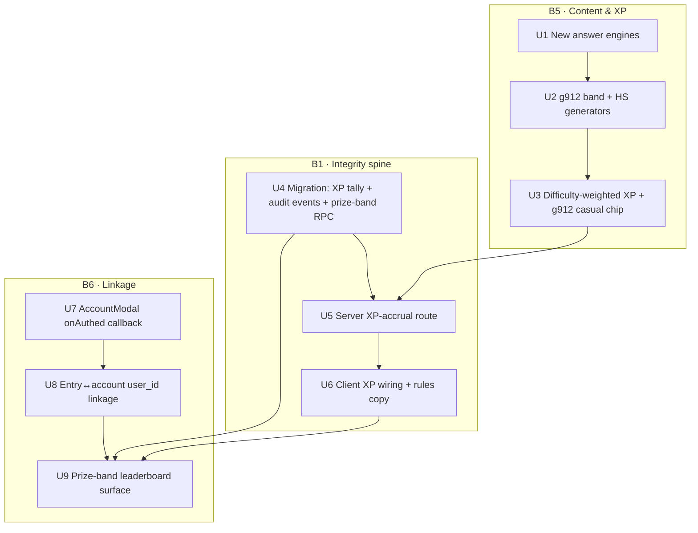

# feat: Gauntlet Summer Tournament — go-live spine (B5 + B6 + B1)

## Overview

The Summer Tournament front door shipped **dormant** (PR #9, commit `51dabc9`): nav, homepage band, `/gauntlet` banner, the `app/lib/tournament.ts` phase machine, rules page, entry modal + double-opt-in routes, standings cron, founding-leaderboard page. Flipping the phase to `live` (auto on Aug 3) lights the *surfaces* but does **not** yield a runnable, trustworthy, cash-prize tournament. This plan builds the three blockers that make turn-on real:

- **B6 · Entry↔account↔score linkage** — a confirmed entrant is tied to their player account (`user_id`) so they can appear on a leaderboard.
- **B5 · Grade 9–12 content + difficulty-weighted XP** — real high-school content (new answer engines + generators) so The Gauntlet is genuinely Grade 3–12, with higher-grade content worth more XP.
- **B1 · Score integrity** — tournament XP is server-validated (plausibility caps + audit event log + manual winner verification), because it's currently client-computed and browser-written with cash on the line.

**Scoring model (2026-07-17, revised after multi-persona review):** the tournament score is a **difficulty-weighted mastery score** — the count of *distinct facts mastered* during the window (mastered = correct under 3 s twice, the existing M5 model), each weighted by its content band (a g912 fact worth more than a g34 fact). Window-scoped (board resets Aug 3). **Content is fully open**; because each fact scores **once**, there is no endurance/grind runaway — the score climbs as you *learn*, and harder facts pull you upward. **Prize bands are age brackets** (b36/b78/b912), self-declared at entry — *not* content restrictions; the bracket only decides which prize pool you rank in. This **replaces** the earlier cumulative-effort-XP model, which the review found unverifiable for cash (a 21-day total can't be re-run) and grind-prone. Mastery is **re-demonstrable** (a winner re-answers a sample of their mastered facts live), so podium verification is real; and it reuses the game's M5 mastery model + the A4 "My Facts" heatmap.

## Problem Frame

The tournament's core promise — *enter → appear on the leaderboard → weekly standings → conversion* — cannot function as built:

- **Scores are account-bound and client-trusted; entries are account-less.** `gauntlet_saves` (the only leaderboard source) is written **browser-direct** by `app/gauntlet/game/cloudSave.ts` under RLS that gates *which* row, never *what value* — so `trial_best`/`xp` are forgeable. Tournament entries land in a separate `gauntlet_tournament_entries` table with a nullable, never-written `user_id` and no score. An entrant can't appear on the board they entered, and any score they did have would be untrustworthy.
- **There is no Grade 9–12 content.** `app/gauntlet/game/problems.ts` tops out at game band `g78`; the answer engines are numeric + multiple-choice only. "The Gauntlet = Grade 3–12 Fast Math" is not yet true.
- **XP is not tournament-safe.** XP is `save.xp`, accumulated client-side and written browser-direct — exactly the number cash prizes will be awarded on.

See origin: `artifacts/gauntlet-roadmap.md` (Phase B tasks B1/B5/B6, Decisions 6–7) and `artifacts/roadmap.md` (GPF TURN-ON CHECKLIST, D1/D2 resolved). Supersedes the [BLOCKED-ON-B1] units of `docs/plans/2026-07-16-001-feat-gauntlet-tournament-hardening-plan.md`, whose 5-persona review refuted ranking on the client-written `gauntlet_saves.trial_best` scalar and required resolving D1/D2 *with* B1 — which this plan does.

## Requirements Trace

- **R1.** A confirmed entrant appears on a tournament leaderboard, ranked by **server-authoritative difficulty-weighted mastery** (distinct facts mastered × band weight) within their age (prize) band. (origin B6/D1; roadmap Decision 6)
- **R2.** The mastery score cannot be trivially forged or botted: a server write path validates mastery events with plausibility caps, every event is audited, and podium winners **re-demonstrate a sample of their mastered facts** before payout. (origin B1; roadmap Decision 1 "cash prizes → integrity non-negotiable")
- **R3.** The Gauntlet serves real Grade 9–12 content via new answer-input engines + high-school generators, and higher-grade facts carry more mastery weight. (origin B5, D2; Decision 7 — "no asterisk, no 7–8 fallback")
- **R4.** Content is fully open during the tournament; prize bands are age brackets, self-declared at entry, not content gates. (roadmap 2026-07-17 decision)
- **R5.** Entering drives full account creation (every entrant is a full admissions lead), and the entry links to the player's `user_id`. (roadmap Decision 6 — account-to-rank via the full AccountModal)
- **R6.** The mastery score is window-scoped (facts mastered Aug 3–23, board resets Aug 3), separate from lifetime client save state. (gauntlet-roadmap Decision 3)
- **R7.** The already-shipped entry/confirm hardening (handle-hijack immunity, per-email caps, POST-confirm, referral validation) remains intact. (verify, do not regress)

## Scope Boundaries

- **Not** re-implementing the v1 dormant surfaces (PR #9) — only the spine.
- **Not** redoing the entry/confirm route hardening — it **already shipped 2026-07-16** (`enter/route.ts` does select-then-branch + 409-on-confirmed + per-email cap + referral validation; `confirm/route.ts` is GET-button/POST-stamp + `timingSafeEqual`). This plan builds on it and verifies it (R7).
- **Not** server-re-deriving every answer for XP — the chosen integrity model is caps + audit + verify-winners. Per-answer re-derivation and sampled audit are a deferred fast-follow (see Deferred).
- **Not** hardening the *casual* (lifetime) leaderboard — it stays client-trusted (low stakes). Only *tournament* XP is server-validated.
- **Not** the Aug-24 post-close nurture handoff (GPF-12) or multiplayer.

## Context & Research

### Relevant Code and Patterns

- **Score write path (client-direct):** `app/gauntlet/game/cloudSave.ts` — `pushCloudSave(userId, row)` upserts `gauntlet_saves` from the browser (anon/user JWT); no server route exists. Called debounced (2500ms) from `app/gauntlet/GauntletGame.tsx:190`. `trial_best`/`xp` are client-computed.
- **Leaderboard RPC (casual):** `supabase/migrations/20260712150000_gauntlet_saves.sql` — `gauntlet_leaderboard(band_in)` SECURITY DEFINER, projects `(handle, band, trial_best)`, top-20 by `trial_best`, string-equality band filter, no grouping. Called via `fetchLeaderboard` + `LeaderboardPanel` (`GauntletGame.tsx:817`). Adding a band to `BANDS` auto-adds a filter chip; the RPC needs no change.
- **Content engine:** `app/gauntlet/game/problems.ts` — `Band = "g34" | "g56" | "g78"` (closed union, line 39); `BANDS` (41–45); five `R.*` difficulty tables keyed by band (104–114); `GENERATORS: Record<TopicId, (band) => Problem>` (411–432, only 6 of 20 read band); `enumerateFacts`/`factSetFor` fact-set enumeration (517–602). Answer kinds today: `"numeric" | "choice"` (line 84). `app/gauntlet/game/mastery.ts` is band-independent.
- **Content taxonomy (authored, not implemented):** `artifacts/gauntletcontent.md` — full Pre-Algebra → AP Calc BC kernel registry (346 entries) with params, difficulty ratings, and an **input-format legend** (lines 78–135: `single-number`, `two-numbers`, `multiple-choice`, `short-expression`, `true-false`, `fraction`, `decimal`). This is the source for B5's generators + the new engines.
- **Entries table + API:** `supabase/migrations/20260716120000_gauntlet_tournament_entries.sql` — `prize_band` CHECK already allows `b912`; nullable `user_id` FK exists but is never written; RLS-on-no-policies (service-role only). `app/api/gauntlet/tournament/enter/route.ts` + `confirm/route.ts` (service role, guest/JWT-free, already hardened).
- **Account flow:** `app/components/account/AccountModal.tsx` — full admissions signup (name/email/password/phone/postal/CASL); terminal state is internal `submitted`; **no success callback** (props `{isOpen, onClose}`). `AccountModalProvider.tsx` exposes `openAccountModal`/`closeAccountModal`. `TournamentEntryModal.onHandleSet` (`app/gauntlet/components/TournamentEntryModal.tsx:49`) is the closest existing post-submit-hook pattern to mirror.
- **Prize bands + phase machine:** `app/lib/tournament.ts` — `PRIZE_BANDS` (b36/b78/b912, labels), `PRIZES` ($50/$25/$10), `resolvePhase`/`resolveTournamentState`; deliberately decoupled from game bands. Rules page `app/gauntlet/rules/page.tsx` renders bands/prizes from the state machine (single source of truth).
- **Server-route + service-role pattern:** the tournament routes + `app/lib/supabase/admin.ts` (`supabaseAdmin()`, `server-only`); session-from-bearer pattern in `app/api/welcome/route.ts`.

### Institutional Learnings

- **Migrations via Management API** — `docs/solutions/integration-issues/supabase-cli-stale-db-password-management-api-workaround-2026-07-13.md`: `supabase db push` is dead; apply DDL via `POST /v1/projects/deolvqnyvhhnavsifgxz/database/query` with the CLI token (Windows Credential Manager `Supabase CLI:supabase`); **one PowerShell invocation**, decode credential as UTF-8, send body as UTF-8 bytes (`charset=utf-8`), then insert the version into `supabase_migrations.schema_migrations` and verify with SELECTs.
- **Blind-upsert / consent-hijack on the public endpoint** — `docs/solutions/database-issues/blind-upsert-on-conflict-public-endpoint-expression-index-inference-and-consent-hijack-2026-07-16.md`: written about `enter/route.ts`. Never `upsert(onConflict:...)` on a public write against a `lower(handle)` expression index; select-then-branch; confirmed rows immutable; prove ownership via `user_id`/`confirm_token`, **never `parent_email`**. (Already applied — R7 verifies it stays.)
- **Client-JWT writes are asserted-not-proven** — `docs/solutions/security-issues/supabase-autoconfirm-forged-consent-email-confirmation-signup-retrofit-2026-07-13.md`: don't trust client-supplied identity (email/handle) for privileged merges; require a session id or server-issued token; defer RLS writes until a session exists. Directly grounds B1 (why client XP can't be trusted) and B6's proven-email reconciliation.
- **CHECK-constraint drift** — `docs/solutions/best-practices/crm-audit-action-allowlist-db-check-constraint-drifts-from-ts-enum-2026-07-15.md`: any new band value must land in the TS union **and** any DB CHECK in the same change. `prize_band` already allows `b912`; the concern is any band column on the new tournament tables.
- **Split-phase migrations** — `docs/solutions/workflow-issues/split-phase-migrations-pre-deploy-schema-post-deploy-purge-separate-files-rerun-2026-07-14.md`: one file per rollout phase, phase stated imperatively in the header.
- **Vercel env traps** — `docs/solutions/integration-issues/stripe-live-mode-cutover-vercel-env-var-silently-stale-2026-07-15.md` + memory `powershell-bom-pipe-pitfall`: never pipe secrets through PS 5.1; delete-and-recreate env vars with explicit per-environment scopes rather than in-place edits.
- **Grep-before-you-build** — `docs/solutions/workflow-issues/build-reporting-ticket-may-already-be-half-built-grep-domain-terms-scope-to-delta-match-truth-source-2026-07-15.md`: confirmed the entry/confirm hardening already shipped; scope to the delta, compute new views from the same truth-source. Tournament XP and casual XP are deliberately separate truth-sources (different trust levels), stated out loud here.

### External References

External research skipped — local patterns are strong for every layer (SECURITY DEFINER RPC + RLS, Management-API migrations, service-role routes, session-from-bearer, Resend/cron). The one genuinely net-new area is **plausibility-cap rate limiting on a scoring endpoint**; there's no in-repo limiter, so Unit 5 is greenfield (document it as a new solution afterward). Vercel BotID/Firewall can front the route as defense-in-depth (per session Vercel knowledge context, 2026-02).

## Key Technical Decisions

- **Tournament score = difficulty-weighted mastery, server-authoritative.** A server route logs each *fact-mastery event* (a fact first reaching mastered state) with its band weight; the score = sum of band weights over distinct mastered facts in the window (aggregate over the events table). The leaderboard ranks confirmed entrants by this within their prize (age) band. *Rationale (review):* mastery is re-demonstrable (dissolves the cash-verification P0), one-time-per-fact (grind-proof), rewards learning over hours, and reuses the M5 mastery model + A4 heatmap. No cash ranking touches a client-written scalar.
- **Prize bands are age brackets, self-declared at entry.** `prize_band` (b36/b78/b912) is eligibility, decoupled from content (as `tournament.ts` already comments). No prize-band↔content-band mapping is built; content is fully open. *Rationale:* Peter's 2026-07-17 decision; peers compete against peers, everyone plays everything.
- **B1 integrity = validated mastery events + audit + live re-demonstration.** The server route accepts fact-mastery events, applies plausibility caps (facts-mastered-per-minute ceiling; a fact can be *first-mastered* only once, so replay/retry is inert), and audits each. Podium winners **re-demonstrate a sample of their mastered facts live** under the 3 s bar — verification that actually fits the metric. *Rationale (review):* re-demonstrable mastery is the backstop cumulative XP never had; small cash amounts + this bound fit the Aug-3 window.
- **Tournament mastery is separate from client `save` state.** `gauntlet_saves` (lifetime, client-trusted, casual board) is untouched; tournament mastery events live in new server-written tables. *Rationale:* two truth-sources at two trust levels (grep-before-you-build learning) — the client's own mastery tracking drives play/UI, but only server-validated mastery events count for cash.
- **Account-to-rank via the full AccountModal + a new `onAuthed(userId)` callback.** Entering drives the existing full admissions signup (every entrant is a full lead); the callback hands control back so the entry/XP can link to `user_id`. *Rationale:* Peter's decision; the callback is the specific missing wiring the prior review flagged.
- **Email-confirm linkage via proven-email reconciliation.** Under email confirmation `signUp` returns no session, so `user_id` can't always be stamped at entry time. On a signed-in visit, stamp `entry.user_id` where `entry.parent_email` equals the caller's **confirmed** auth email. *Rationale:* email is trustworthy *once proven* (forged-consent learning); avoids forcing the JWT-free entry route to change.
- **Difficulty-weighted mastery.** Each mastered fact scores its band weight (`g34 < g56 < g78 < g912`), so mastering harder facts is worth more and "play anything" stays fair. *Rationale (review):* because scoring is per-distinct-fact (not per-minute), the earlier "easy content is answered 10× faster" grind exploit doesn't apply — a fact credits once regardless of how fast it was reached.
- **New answer-input engines (full-depth B5).** Add `fraction`, `two-numbers`, `short-expression`, `decimal`, `true-false` input kinds (the taxonomy's legend) so high-school kernels beyond numeric/choice are playable. *Rationale:* Peter chose full depth; without these, g912 would be only harder arithmetic.

## Open Questions

### Resolved During Planning

- *How does a guest entrant get a rankable score?* → Account-to-rank; entering drives the full AccountModal; XP accrues to `user_id`.
- *How are prize-band winners computed without a grind exploit?* → Cumulative server-validated XP over open content; higher grade = more XP; age brackets segment prizes.
- *Does 9–12 ship with real content?* → Yes, full depth: new answer engines + HS generators; no asterisk.
- *How is XP made tournament-safe?* → Server route with plausibility caps + audit events + manual winner verification.
- *How does the email-confirm gap not break linkage?* → Proven-email reconciliation on signed-in visit.

### Resolved by the 2026-07-17 scoring-model pass

The review's scoring-model cluster is **resolved** by switching from cumulative effort-XP to **difficulty-weighted mastery** (distinct facts mastered × band weight):
- **Cash verification (was P0):** ✓ mastery is *re-demonstrable* — podium winners re-answer a sample of their mastered facts live under the 3 s bar. A real protocol replaces the impossible "screen-record a 21-day total."
- **Win-metric (was P1):** ✓ the winner is who *learned the most* (distinct facts mastered), not who played longest — bounded per fact, no endurance runaway or degenerate ceiling-tie.
- **Anti-grind (was P1):** ✓ each fact scores once and harder facts weigh more, so grinding easy content earns nothing new — the per-minute exploit doesn't exist for a one-time mastery credit.
- **Multi-band identity (was P0 — security):** fixed structurally (Unit 4 partial-unique-index on `user_id where confirmed` + Unit 8 one-entry scope).
- **Still to decide (P1, lighter now):** age-bracket self-declaration — brackets stay self-declared; optionally verify age at payout (small prizes make acceptance defensible). Record the choice before Aug 3.

### Deferred to Implementation

- Exact plausibility-cap numbers (XP/min, problems/min, daily ceiling) and per-band XP multipliers — tune against real play traces during `ce:work`.
- Whether the authoritative tally is a table column vs. a materialized aggregate over the audit-events table — decide when writing the RPC against real schema.
- Exact batching cadence/size for the client XP post (per-run vs. periodic) — decide when wiring `GauntletGame.tsx`.
- Which specific high-school kernels make the launch set per new engine, and their difficulty ratings — pick from `gauntletcontent.md` during implementation.
- Server-side sampled re-derivation of posted answers (fast-follow B1 hardening) — deferred by decision.
- Final Vercel BotID vs Firewall choice on the XP + enter routes — depends on what's enabled on the project.

## High-Level Technical Design

> *This illustrates the intended approach and is directional guidance for review, not implementation specification. The implementing agent should treat it as context, not code to reproduce.*

**Tournament XP flow (B1 + B6):**

```
Signed-in player, phase=live, confirmed entrant
        │  plays open content (any band, any topic)
        ▼
Client batches answered facts (fact key, band, correct?, ms) during play
        │  POST /api/gauntlet/tournament/xp  (Authorization: Bearer <session JWT>)
        ▼
Server route (supabaseAdmin, user_id from verified session — NEVER body):
   • plausibility caps: reject/clamp if xp/min, problems/min, or daily total exceed ceilings
   • difficulty-weighted credit (band multiplier)
   • INSERT audit event row  → gauntlet_tournament_events
   • UPSERT authoritative tally → gauntlet_tournament_xp (window-scoped)
        ▼
RPC gauntlet_tournament_leaderboard(prize_band_in):   (SECURITY DEFINER, handles-only)
   JOIN gauntlet_tournament_entries e (confirmed_at not null, consent, user_id)
     TO gauntlet_tournament_xp x ON x.user_id = e.user_id
   GROUP/ORDER by x.tournament_xp DESC within e.prize_band
        ▼
FoundingBoard: three age-bracket pools (b36 / b78 / b912), ranked by tournament XP
```

**Prize band = age bracket (decision matrix):**

| prize_band | eligibility (self-declared age/grade) | content they may play | ranks by |
|---|---|---|---|
| b36 | ages/grades 3–6 | **all** (g34…g912) | weighted mastery (facts × band) |
| b78 | ages/grades 7–8 | **all** (g34…g912) | weighted mastery (facts × band) |
| b912 | ages/grades 9–12 | **all** (g34…g912) | weighted mastery (facts × band) |

Higher-grade facts carry a higher mastery weight, so mastering harder content is rewarded; each fact counts once, so there is no benefit to re-grinding mastered or easy facts.

**Unit dependency graph:**



## Implementation Units

> **Prerequisite (all test-bearing units):** `vitest.config.ts` `include` only covers `app/crm/__tests__`, `app/dashboard/__tests__`, `app/lib/**/__tests__`. **`app/gauntlet/**` and `app/api/**` tests will not run** until those globs are added. **Apply this glob extension FIRST as a Phase-1 enabler** — before Units 4/5/7/8/9 tests, even though the answer-engine work (Unit 1) lands in Phase 2 — or those suites silently pass by not running. **Test style (review — repo precedent):** the repo is `environment: node` with **no jsdom/testing-library and zero `.tsx` render tests**. Do **not** add a DOM harness under deadline — test the *pure extracted helpers* (`answer.ts`, `xpCaps.ts`, the batch-builder, RPC-mapping) and verify component render manually. Replace the planned `AccountModal.test.tsx` / `FoundingBoard.test.tsx` render tests with pure-helper + real-RPC integration coverage.

> **Server-derive invariant (security):** every server route reads `user_id` **only** from the verified session bearer (like `app/api/welcome/route.ts`), never from the request body. Applies to Units 5 and 8.

> **Scoring-model note (2026-07-17 — read before Units 3–6):** Units 3–6 below are written in the earlier *XP* framing; per the scoring-model pass they now operate on **difficulty-weighted mastery events**, not XP batches. Map: **Unit 3** = per-band *mastery weight* (not per-answer XP); **Unit 4** events table logs *fact-mastery events* (`fact_key`, `band`, `batch_id`) and the windowed tally sums band weights over *distinct* mastered facts; **Unit 5** route validates mastery events (facts-mastered/min cap; first-master-once ⇒ replay inert) + requires a confirmed entry; **Unit 6** posts mastery events client-side and the rules describe **re-demonstration** verification (not "screen-recorded re-run"). The architecture (server route + audit events + windowed tally + prize-band RPC + linkage) is unchanged — only *what is counted and validated* changes from XP to mastery. Reconcile the unit prose during `ce:work`.

### Phase B5 — Grade 9–12 content + difficulty-weighted XP

- [ ] **Unit 1: New answer-input engines**

**Goal:** Support the taxonomy's non-numeric answer formats so high-school kernels are playable.

**Requirements:** R3

**Dependencies:** None.

**Files:**
- Modify: `app/gauntlet/game/problems.ts` (extend the `Problem.kind` union with `fraction | two-numbers | short-expression | decimal | true-false`; add answer-normalization/equality per kind)
- Modify: `app/gauntlet/GauntletGame.tsx` (render the matching input UI per kind; route the answer through the kind's checker)
- Create: `app/gauntlet/game/answer.ts` (per-kind normalize + `isCorrect(kind, submitted, answer)` — e.g. fraction reduces before compare, two-numbers respects ordered/unordered, short-expression canonicalizes whitespace/×↔*)
- Test: `app/gauntlet/game/__tests__/answer.test.ts`
- Modify: `vitest.config.ts` (add `app/gauntlet/**/__tests__/**` and `app/api/**/__tests__/**` to `include`)

**Approach:**
- Follow the input-format legend in `artifacts/gauntletcontent.md` (lines 78–135) for accepted-answer rules per kind. Keep each checker pure and colocated in `answer.ts` so it's unit-testable without the React tree.
- Reuse the existing numeric auto-submit idiom; new kinds get explicit submit where free-form (fraction, expression).

**Patterns to follow:** existing `kind: "numeric" | "choice"` handling in `GauntletGame.tsx`; the pure-function + `__tests__` convention in `app/lib/__tests__/tournament.test.ts`.

**Test scenarios:**
- Happy path: `fraction` `2/4` accepted as equal to `1/2` (reduced compare); `decimal` `0.5` vs `.50` accepted.
- Happy path: `two-numbers` unordered pair `[3,5]` accepts `5,3`; ordered pair rejects the swap.
- Edge case: `short-expression` `2x+1` accepts `2*x + 1` / `1+2x` per the canonicalization rule; rejects `2x+2`.
- Edge case: `true-false` accepts only the two tokens; empty/garbage rejected.
- Error path: malformed fraction (`3/0`, `3/`) rejected without throwing.

**Verification:** Each new kind round-trips a correct and an incorrect answer through `isCorrect`; the game renders the right input control per kind.

- [ ] **Unit 2: g912 band + high-school generators**

**Goal:** A real Grade 9–12 content band drawn from the authored taxonomy.

**Requirements:** R3, R4

**Dependencies:** *Split for phasing (review):* **2a** (g912 band scaffold + generators on the existing numeric/choice engines) depends on **nothing** and ships Phase 1; **2b** (HS generators using the new engines) depends on **Unit 1** and ships Phase 2. Track 2a/2b as separate deliverables with their own tests/verification so the phase gate maps onto real unit boundaries.

**Files:**
- Modify: `app/gauntlet/game/problems.ts` (extend `Band` union with `"g912"`; add to `BANDS`; add a `g912` key to **all five** `R.*` tables; add HS `TopicId`s + `make*`/`gen*` generators + `GENERATORS` entries; extend `enumerateFacts`/`factSetFor` for closed-set HS topics)
- Test: `app/gauntlet/game/__tests__/problems.test.ts`

**Approach:**
- Extend the closed `Band` union first — TypeScript then flags every `Record<Band,…>` and `R.*[band]` site missing the `g912` case (the safety net; the five `R.*` tables are the required edits).
- Pick a launch set of HS kernels from `gauntletcontent.md` spanning the new engines (e.g. evaluate-exponent, simplify-radical, slope-two-points, evaluate-function, special-right-triangle, discriminant-root-count, factor-simple-quadratic via two-numbers, simplify-fraction, solve-proportion). Each generator sets a stable `key` per the doc's scheme so mastery tracking works.
- `BANDS` extension auto-flows a `g912` chip into `LeaderboardPanel` and the config UI (`GauntletGame.tsx:523`).

**Patterns to follow:** the `make*`/`gen*` + `GENERATORS` registry and `enumerateFacts` structure already in `problems.ts`; the Starter-Twelve generators shipped for G3.

**Test scenarios:**
- Happy path: each new generator produces a `Problem` with a stable `key`, correct `answer`, and a valid `kind`; `GENERATORS[topic]("g912")` returns in-range instances.
- Edge case: closed-set HS topics enumerate their full fact set via `factSetFor(topic,"g912")` with no duplicates; the trial deck deals the whole set.
- Edge case: band-sensitive arithmetic topics honor the new `g912` `R.*` ranges (harder than g78).
- Error path: no generator throws on `g912`; every `TopicId` has a `GENERATORS` entry (exhaustiveness).

**Verification:** `g912` appears as a playable band + leaderboard chip; a full Mastery Trial on g912 deals real HS problems that check correctly.

- [ ] **Unit 3: Difficulty-weighted XP + g912 casual leaderboard**

**Goal:** Higher-grade content earns more XP; g912 shows on the casual board.

**Requirements:** R3, R4

**Dependencies:** Unit 2.

**Files:**
- Modify: `app/gauntlet/game/problems.ts` or a new `app/gauntlet/game/xp.ts` (a `bandXpMultiplier(band)` and the per-answer XP formula incorporating it)
- Modify: `app/gauntlet/GauntletGame.tsx` (apply the multiplier where XP is awarded)
- Test: `app/gauntlet/game/__tests__/xp.test.ts`

**Approach:**
- Centralize the XP-per-correct-answer formula (base × speed/streak × **band multiplier**) client-side. **Share only `bandXpMultiplier(band)` + per-band per-minute ceiling constants** with the server (Unit 5) — the server can't re-derive the full formula, so parity is asserted on the multiplier/ceilings. Exact multipliers are deferred tuning, but the ordering `g34 < g56 < g78 < g912` is fixed. **⚠️ Review (blocking — see Open Questions):** the multiplier must make hard content *rate-neutral or better per minute* vs. faster easy content, or grinding easy fast content is the optimal exploit — prove this as a hard tuning constraint, don't leave it a free knob.
- g912 on the casual board is free — `BANDS` already added it in Unit 2; the band-agnostic RPC needs no change.

**Patterns to follow:** the existing speed/streak XP multiplier logic (M3) in `GauntletGame.tsx`.

**Test scenarios:**
- Happy path: same answer speed/streak yields strictly more XP on `g912` than `g34`.
- Edge case: the multiplier is monotonic across `g34 < g56 < g78 < g912`.
- Integration: the client XP formula and the server-side cap formula (Unit 5) import the same function (no drift).

**Verification:** Playing a g912 problem awards more XP than the equivalent g34 problem; the multiplier lives in one place shared with the server.

### Phase B1 — Score integrity spine

- [ ] **Unit 4: Migration — tournament XP tally + audit events + prize-band RPC**

**Goal:** Server-authoritative tournament XP storage + audit trail + the ranking RPC.

**Requirements:** R1, R2, R6

**Dependencies:** None (schema); consumed by Units 5 and 9.

**Files:**
- Create: `supabase/migrations/20260717120000_gauntlet_tournament_scoring.sql`
- Test: `app/lib/gauntlet/__tests__/tournamentLeaderboard.test.ts` (pure SQL-shape/mapping helpers if any; RPC behavior is integration-verified in Unit 9)

**Approach:**
- `gauntlet_tournament_events` — append-only audit rows: `id`, `user_id → auth.users`, **`batch_id` (client UUID, UNIQUE — idempotency; review)**, `xp_claimed`, `xp_credited`, `problems`, `duration_ms`, `band_mix jsonb`, `created_at`. RLS-on-no-policies (service-role writes only), mirroring `gauntlet_tournament_entries`. The unique `batch_id` makes a retried/replayed POST a no-op, satisfying R2's no-double-count.
- **One prize band per identity (review — P0 security):** a partial unique index on `gauntlet_tournament_entries(user_id) where confirmed_at is not null`, so one account cannot hold confirmed entries in multiple age brackets and rank/win in all three pools. Unit 8's linkage/reconciliation must respect it (stamp at most one entry per identity).
- `gauntlet_tournament_xp` — the authoritative tally. **Pinned (review):** compute it as an aggregate over `gauntlet_tournament_events` filtered to the tournament window (`created_at` within the live window), so the window is *intrinsic* and the Aug-3 reset is free — no mutable running total to zero, and any pre-Aug-3 soft-launch XP is naturally excluded. A cached/materialized form is an optimization, not the source of truth. RLS-on-no-policies.
- `gauntlet_tournament_leaderboard(prize_band_in text default null)` — SECURITY DEFINER, `set search_path = public`, joins `gauntlet_tournament_entries` (confirmed + consented + `user_id` not null) to `gauntlet_tournament_xp` on `user_id`, returns handles-only `(handle, prize_band, tournament_xp)`, ordered `tournament_xp desc, updated_at asc`, grouped/filtered by `prize_band`. Granted to `anon, authenticated`, mirroring `gauntlet_leaderboard`.
- Any band column carries a CHECK kept in lockstep with the TS union (CHECK-drift learning). Apply via the Management API playbook; record in `schema_migrations`.

**Patterns to follow:** `supabase/migrations/20260712150000_gauntlet_saves.sql` (RPC shape, grants, `security definer`); `20260716120000_gauntlet_tournament_entries.sql` (RLS-on-no-policies, header style).

**Test scenarios:**
- Test expectation: schema/RPC — behavior verified via Unit 9's integration test (two entrants, different XP, correct order; unconfirmed/unconsented excluded; emails/names never projected; `prize_band_in` null = all, specific = filtered).

**Verification:** The RPC returns confirmed entrants grouped by prize band ranked by tournament XP; audit + tally tables exist with service-role-only RLS.

- [ ] **Unit 5: Server XP-accrual route (caps + audit)**

**Goal:** The only path that increases tournament XP, with plausibility caps and audit logging.

**Requirements:** R2

**Dependencies:** Unit 3 (shared XP weighting), Unit 4 (tables).

**Files:**
- Create: `app/api/gauntlet/tournament/xp/route.ts`
- Create: `app/lib/gauntlet/xpCaps.ts` (pure cap logic: given a batch + prior daily total, return credited XP + a clamp/reject reason)
- Test: `app/api/gauntlet/tournament/__tests__/xp.test.ts`, `app/lib/gauntlet/__tests__/xpCaps.test.ts`

**Approach:**
- POST accepts a batch summary (problems, duration_ms, band_mix, claimed_xp, **`batch_id`**). `user_id` from the **verified session bearer only**. Gate on `resolvePhase() === "live"` (like the enter route) **and** on the session `user_id` having a `confirmed_at is not null` entry — only confirmed, consented entrants accrue tournament XP, not any authenticated user (review). A duplicate `batch_id` is a no-op.
- **Credit = `min(claimed_xp, band-weighted cap)` — the server clamps, it does NOT re-derive the per-answer formula** (it has only the batch summary, no per-answer speed/streak). Only `bandXpMultiplier` + per-band ceiling constants are shared with the client (Unit 3); the parity test asserts *that* shared surface, not the whole formula.
- **Daily-ceiling check must be atomic (review):** a conditional UPDATE bounded by the running window total (or `SELECT … FOR UPDATE`), not read-then-decide-then-write — concurrent tabs/retries could otherwise jointly blow past the ceiling.
- `xpCaps` clamps to plausibility bounds: XP/min ceiling, problems/min ceiling, and a per-user daily total ceiling (derive today's total from the tally/events). Over-ceiling → clamp credited XP and flag the event (do not hard-reject a legit fast player; caps bound the damage). Egregious (impossible problems/min) → reject the batch.
- Always INSERT an audit event (`xp_claimed`, `xp_credited`); UPSERT the authoritative tally. Best-effort, never throws to the client; opaque 500 + prefixed `console.error` for log grep (env-log learning).
- Front with Vercel BotID/Firewall as defense-in-depth (ops step).

**Patterns to follow:** `app/api/welcome/route.ts` (bearer→session); the tournament routes' `supabaseAdmin()` + phase-gate; `sendEmail` never-throw contract as the best-effort model.

**Test scenarios:**
- Happy path: a plausible batch credits the weighted XP, inserts one event, updates the tally.
- Edge case: a batch above the XP/min ceiling is **clamped** (credited < claimed), event flagged, tally reflects the clamped value.
- Edge case: daily-ceiling reached → further batches credit 0 but still log.
- Error path: missing/invalid bearer → 401, no write; body-supplied `user_id` is ignored (session wins).
- Error path (integrity): impossible problems/min → batch rejected, no tally change, event logged as rejected.
- Integration: cap formula uses the same band multiplier as the client (Unit 3) — a g912-heavy batch has a higher legit ceiling than a g34-heavy one.

**Verification:** Scripted over-rate posting is clamped/rejected and audited; a normal play session accrues the expected XP; no path trusts a body `user_id`.

- [ ] **Unit 6: Client XP wiring + rules "winners verified" copy**

**Goal:** Signed-in tournament play posts XP through the server route; rules disclose verification.

**Requirements:** R2, R6

**Dependencies:** Unit 5.

**Files:**
- Modify: `app/gauntlet/GauntletGame.tsx` (when signed-in + phase live + entrant, batch answered-fact events and POST to `/api/gauntlet/tournament/xp`; keep casual `pushCloudSave` untouched)
- Modify: `app/gauntlet/rules/page.tsx` (add "winners are verified (screen-recorded re-run) before prizes" to the rules)
- Test: `app/gauntlet/game/__tests__/xpBatch.test.ts` (pure batching/accumulation helper)

**Approach:**
- Extract the batch-builder into a pure helper (fact key, band, correct?, ms → batch summary) so it's testable without the network. Post per-run (on trial/raid completion) plus a periodic flush; exact cadence deferred. Tournament XP is display-only until the server confirms (never claim a rank the server hasn't credited).
- The lifetime `save.xp` / casual path is unchanged — two separate truth-sources by design.

**Patterns to follow:** the debounced `pushCloudSave` effect (`GauntletGame.tsx:190`) for the batching/lifecycle idiom; the "banner only after a real write succeeds" honesty pattern from GTM-2.

**Test scenarios:**
- Happy path: a completed run builds a batch with the correct problem count + band mix.
- Edge case: signed-out or non-live phase → no tournament post (casual save still works).
- Edge case: a failed post leaves lifetime play unaffected and retries/queues without double-counting.

**Verification:** A signed-in live-phase run produces a server-credited tournament-XP delta; a signed-out run does not; casual saves are unchanged.

### Phase B6 — Entry ↔ account linkage

- [ ] **Unit 7: AccountModal success callback**

**Goal:** The account flow can hand control back with the new `user_id`.

**Requirements:** R5

**Dependencies:** None.

**Files:**
- Modify: `app/components/account/AccountModal.tsx` (add `onAuthed?(userId: string)`; fire it when a session/user id is obtained — both immediate-session and post-confirm paths)
- Modify: `app/components/account/AccountModalProvider.tsx` (thread an optional `onAuthed` through `openAccountModal`)
- Test: `app/components/account/__tests__/AccountModal.test.tsx` (add `app/components/**/__tests__/**` to `vitest.config.ts` include if not already covered)

**Approach:**
- Fire `onAuthed(user.id)` where the session/user id is available (`handleSubmit`, ~line 141). Under email-confirm (no session), do not fire immediately; the reconciliation in Unit 8 covers that case on the next signed-in visit. Preserve the existing `submitted`/`needsConfirm` UX.

**Patterns to follow:** `TournamentEntryModal.onHandleSet` callback (`app/gauntlet/components/TournamentEntryModal.tsx:49`) as the post-submit-hook shape.

**Test scenarios:**
- Happy path: immediate-session signup fires `onAuthed` with the user id.
- Edge case: email-confirm signup (no session) does **not** fire `onAuthed`; still shows the confirm screen.
- Edge case: modal without an `onAuthed` prop behaves exactly as today (no regression).

**Verification:** A consumer passing `onAuthed` receives the id on immediate-session signup; existing callers are unaffected.

- [ ] **Unit 8: Entry ↔ account user_id linkage**

**Goal:** A confirmed entry is tied to the player's `user_id`.

**Requirements:** R1, R5

**Dependencies:** Unit 7.

**Files:**
- Modify: `app/gauntlet/GauntletGame.tsx` (entry CTA: if guest, open `AccountModal` first via `onAuthed`, then continue the entry; pass the session to the entry submit)
- Modify: `app/gauntlet/game/tournamentEntry.ts` (submit carries the session so the route can stamp `user_id`)
- Modify: `app/api/gauntlet/tournament/enter/route.ts` (when a valid session bearer is present, stamp `user_id` from it — **never from the body**; preserve all existing hardening)
- Create: `app/api/gauntlet/tournament/reconcile/route.ts` **or** fold into an existing signed-in touchpoint — on a signed-in visit, stamp `entry.user_id` where `entry.parent_email` == the caller's **confirmed** auth email and `user_id` is null
- Test: `app/api/gauntlet/tournament/__tests__/enter.test.ts`, `app/api/gauntlet/tournament/__tests__/reconcile.test.ts`

**Approach:**
- Guest clicks "Enter" → `AccountModal` (full funnel) → `onAuthed` → continue entry with the session; the enter route stamps `user_id` from the verified bearer when present (additive; JWT-free guest entries still work and reconcile later).
- Reconciliation handles the email-confirm gap: only match on a **proven** (confirmed) email, per the forged-consent learning — never treat an unproven email as identity.
- Do not regress the shipped hardening (R7): still select-then-branch, confirmed rows immutable, ownership via `user_id`/`confirm_token` not `parent_email`.
- **Auth-confirmation regime (review — own it explicitly):** Supabase email confirmation is **ON in production since 2026-07-13** (roadmap S5), so `signUp` returns no session and reconciliation IS needed — a tracked dependency, not an implicit branch. The entrant faces **two emails** (Supabase auth-confirm + the entry double-opt-in); design that funnel deliberately. R1's real precondition is confirmed-entry AND confirmed-auth AND a signed-in visit — measure drop-off across all three.
- **Reconciliation trigger (review):** fire once per session on `GauntletGame` mount for any signed-in user with a pending unlinked entry — a bounded, known gap between confirming and appearing.
- **One entry per identity + email-mismatch fallback (review):** stamp at most one entry per confirmed auth email (respect the Unit 4 partial unique index). When the entry `parent_email` ≠ the account email (parent-enters-for-child), the proven-email match fails — provide a signed-in **handle-claim** fallback (claim an unlinked confirmed entry by handle, same confirmed-identity guardrails) plus a visible "not yet linked to your account" state so a genuine entrant is never silently dropped.
- **Mid-entry state (review — design):** if signup hits the email-confirm screen mid-entry, show an explicit "You're entered — confirm your email, then sign in to appear on the board" state, distinct from AccountModal's generic `needsConfirm`.
- **Entry-context framing (review — design):** carry the tournament context (handle, prize band) visibly into `AccountModal` when opened from the "Enter" CTA so the full admissions form doesn't read as a bait-and-switch; and recognize an already-registered returning user (offer login, not a fresh signup).

**Patterns to follow:** `app/api/welcome/route.ts` (bearer→session, `user_id` server-derived); the shipped `enter/route.ts` select-then-branch; the forged-consent reconciliation precedent.

**Test scenarios:**
- Happy path: signed-in entry stores `user_id` = session user; leaderboard join finds their XP.
- Happy path (reconcile): a guest entry whose `parent_email` later matches a confirmed account gets `user_id` stamped on the next signed-in visit.
- Error path: a body-supplied `user_id` is ignored (session is the only source).
- Error path (security): reconciliation refuses to stamp when the auth email is unconfirmed or doesn't match; hijack of another family's entry via a guessed email fails.
- Edge case (R7): a second family reusing a confirmed handle is still rejected, original row intact.

**Verification:** A confirmed, signed-in entry's `user_id` matches its account; the email-confirm path reconciles; no hardening regressed.

- [ ] **Unit 9: Prize-band (age) tournament leaderboard surface**

**Goal:** The founding board shows the three age-bracket pools ranked by tournament XP.

**Requirements:** R1, R4

**Dependencies:** Unit 4 (RPC), Unit 8 (`user_id` linkage), Unit 6 (real XP flowing).

**Files:**
- Modify: `app/gauntlet/components/FoundingBoard.tsx` (call `gauntlet_tournament_leaderboard`; chips = prize/age bands b36/b78/b912 from `tournament.ts`)
- Modify: `app/gauntlet/game/cloudSave.ts` (add `fetchTournamentLeaderboard(prizeBand)` alongside `fetchLeaderboard`)
- Test: `app/gauntlet/components/__tests__/FoundingBoard.test.tsx` **and** an integration test exercising the real RPC (Unit 4's behavior lands here — the crux join, not mocked)

**Approach:**
- Swap the founding board's source to the prize-band RPC; chips become the three age brackets with labels from `tournament.ts`. Keep the empty/loading states (helper returns `[]` on error → intentional empty state). Emails/names never surface (handles-only projection).

**Patterns to follow:** existing `fetchLeaderboard` + `LeaderboardPanel`/`FoundingBoard` structure.

**Test scenarios:**
- Happy path: three age-bracket chips render; selecting b912 filters to that pool ranked by tournament XP.
- Edge case: empty pool → intentional empty state, not a spinner.
- Integration: two confirmed entrants with different tournament XP rank correctly via the real RPC; an unconfirmed entry is excluded; a confirmed entrant with no XP row is excluded or shows 0 per the RPC.

**Verification:** The board groups by age bracket and shows a 9–12 pool ranked by validated tournament XP.

## System-Wide Impact

- **Interaction graph:** the entry CTA now depends on `AccountModal` (new game↔account edge, Unit 8); the game gains a new server dependency (`/api/gauntlet/tournament/xp`, Unit 6); the standings cron (`app/api/cron/gauntlet-standings`) can later read the new tally for a real rank (out of scope here, noted).
- **Error propagation:** the XP route is best-effort and never throws to the client; caps clamp rather than hard-fail a fast player; ranking-ineligible states (no `user_id`, no XP) are excluded from the board, never error.
- **State lifecycle risks:** window-scoped tournament XP must reset at Aug 3 (board reset) — scope the tally/query to the window, don't reuse lifetime XP; reconciliation must not double-stamp or overwrite a `user_id`; the client batcher must not double-count on retry.
- **API surface parity:** the new RPC mirrors `gauntlet_leaderboard`'s handles-only SECURITY DEFINER anon-grant shape — no new data exposure. The casual board is untouched.
- **Integration coverage:** the `entry.user_id ↔ gauntlet_tournament_xp` join and the XP-route caps are the crux — cover both with real (non-mock) tests (Units 5, 9).
- **Unchanged invariants:** `gauntlet_saves` schema/RLS and the casual leaderboard are untouched; guest *play* stays account-free; the shipped entry/confirm hardening is preserved (R7); `tournament.ts` phase machine + prize-band definitions are unchanged.

## Risks & Dependencies

| Risk | Likelihood | Impact | Mitigation |
|------|-----------|--------|------------|
| Full-depth B5 (new engines + broad HS content) is the long pole and slips past the ~Jul 20 W2 soft launch | **High** | High | Sequence the **integrity+linkage spine (B1+B6) first** so a rankable board exists for W2 on whatever content is ready; land B5 engines/kernels incrementally through W2→Aug 3. Phased Delivery below makes this explicit. |
| Cumulative-XP leaderboard rewards time-on-task → botting / burnout | Med | High | Server caps (XP/min, problems/min, daily ceiling) + audit events + manual podium verification (B1); daily ceiling bounds grind; "winners verified" in rules. |
| Client XP formula and server cap formula drift | Med | Med | Single shared weighting function (Unit 3) imported by both client and route; integration test asserts parity. |
| Email-confirm gap leaves entrants unlinked (no `user_id` → not on board) | Med | Med | Proven-email reconciliation on signed-in visit (Unit 8); disclose "sign in to appear on the board." |
| New `g912`/answer-engine cases missed across the closed `Band` union or `kind` switch | Low | Med | The closed union makes TypeScript flag every missing case; exhaustiveness test over `GENERATORS` (Unit 2). |
| Tests silently don't run (gauntlet/api excluded from vitest) | Med | High | Unit 1 extends `vitest.config.ts` `include` first; verify the new suites actually execute. |
| Migration/env friction (stale DB password, PS BOM) | Med | Low | Management API playbook (single PS invocation, UTF-8, record in `schema_migrations`); env vars via UI/REST, delete-and-recreate. |

## Phased Delivery

### Phase 1 — Integrity + linkage spine, live for W2 (~Jul 20 soft launch)
- Units 4, 5, 7, 8 (+ Unit 3's XP weighting) + **Unit 2a** (g912 on reused numeric/choice kernels; the vitest-include enabler lands here first) + Unit 6 + Unit 9. Ambassadors can enter, play, and rank.
- **Note (review — R3):** R3 ("real 9–12 via new engines") is only *fully* satisfied in Phase 2 (Unit 1 + 2b); Phase 1 delivers 9–12 on existing engines.
- **Note (review — de-risk):** scored XP only accrues from Aug 3, so weigh whether W2 truly needs the *full* validated-XP path or just entry + linkage + play (with XP hardening through the window). Give the B1+B6 spine the same explicit slip-risk scrutiny the plan gives B5.
- **Ops (review — feasibility):** set `TOURNAMENT_STATE=live` for any pre-Aug-3 soft-launch environment, or the `enter` and `xp` routes 403 (date default is `tease` before Aug 3). The events-aggregate window (Unit 4) ensures that soft-launch XP is excluded from the real Aug-3 board.

### Phase 2 — Full-depth content, hardened by Aug 3
- Unit 1's answer engines (fraction/expression/two-numbers/decimal/true-false) + Unit 2b's broader HS kernel set + XP tuning against real W2 play traces. Cap numbers finalized from observed data.
- **Bound (review — scope):** "full depth" for Aug-3 needs a concrete floor — e.g. at least N kernels per new engine across the taxonomy's Algebra/Geometry sections — not an open-ended march through the 346-entry registry. Set the floor + a sign-off owner so Phase 2 has a stopping point.

## Documentation / Operational Notes

- Update `artifacts/gauntlet-roadmap.md` (B1/B5/B6) and `artifacts/roadmap.md` (GPF/GTM-3) as units land.
- Migrations via the Management API playbook; record versions in `schema_migrations`.
- New env: none required for the spine beyond what the Turn-On Checklist already lists (`UNSUBSCRIBE_SECRET`, `STANDINGS_ENABLED`, `CRON_SECRET`); if a BotID/Firewall secret is added, set it via UI/REST (no PS pipe).
- **Enable Vercel BotID/Firewall on `/api/gauntlet/tournament/xp` and `/enter` as a GO-LIVE BLOCKER (review — not an optional ops step):** verify before the Aug-3 phase flip. With self-reported caps as the only other defense, an unprotected scoring endpoint + cash prizes is the primary bot exposure.
- **Manual winner verification (review):** define it before Aug 3 — reviewer, pass/fail criteria, inconclusive/appeal handling — and feed each podium candidate's clamped/flagged-event history into that review. It's the last line of defense for real money; today it's one under-specified sentence (and see the P0 cash-verification blocker above).
- After launch, write a `docs/solutions/` entry for the plausibility-cap scoring endpoint (net-new pattern).

## Alternative Approaches Considered

- **Rank on the existing `gauntlet_saves.trial_best` (prior plan's naive D2).** Rejected — the 2026-07-16 review refuted it: a band-agnostic client-written scalar lets a 9–12 entrant grind g34 and win the 9–12 pool. The XP tally + open-content + difficulty-weighting model replaces it.
- **Server re-derive every answer for XP.** Rejected for Aug 3 (Peter's call) — near-uncheatable but a large build (server-side regeneration for all topics incl. new engines) + heavy traffic; kept as a documented fast-follow.
- **Per-prize-band content scoping (map b36/b78/b912 → fixed content bands).** Rejected — Peter's model is age-bracket eligibility with fully open content and difficulty-weighted XP, which is simpler and dissolves the grind exploit via incentives rather than restriction.
- **Slim tournament-only account instead of the full AccountModal.** Rejected — Peter chose the full admissions funnel so every entrant is a full lead.

## Sources & References

- **Origin:** `artifacts/gauntlet-roadmap.md` (Phase B: B1/B5/B6; Decisions 3, 6, 7), `artifacts/roadmap.md` (GPF TURN-ON CHECKLIST, GTM-3)
- **Supersedes (partially):** `docs/plans/2026-07-16-001-feat-gauntlet-tournament-hardening-plan.md` (resolves its [BLOCKED-ON-B1] units with B1)
- **Content taxonomy:** `artifacts/gauntletcontent.md` (kernel registry + input-format legend)
- Related code: `app/gauntlet/game/problems.ts`, `app/gauntlet/game/cloudSave.ts`, `app/gauntlet/GauntletGame.tsx`, `app/components/account/AccountModal.tsx`, `app/api/gauntlet/tournament/*`, `app/lib/tournament.ts`, `supabase/migrations/20260712150000_gauntlet_saves.sql`, `supabase/migrations/20260716120000_gauntlet_tournament_entries.sql`
- Migration playbook: `docs/solutions/integration-issues/supabase-cli-stale-db-password-management-api-workaround-2026-07-13.md`
- Security precedents: `docs/solutions/database-issues/blind-upsert-on-conflict-public-endpoint-expression-index-inference-and-consent-hijack-2026-07-16.md`, `docs/solutions/security-issues/supabase-autoconfirm-forged-consent-email-confirmation-signup-retrofit-2026-07-13.md`
