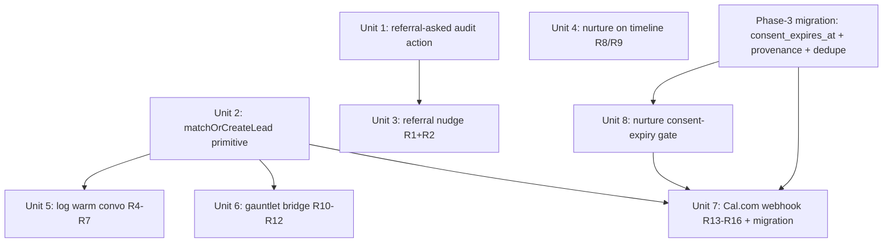
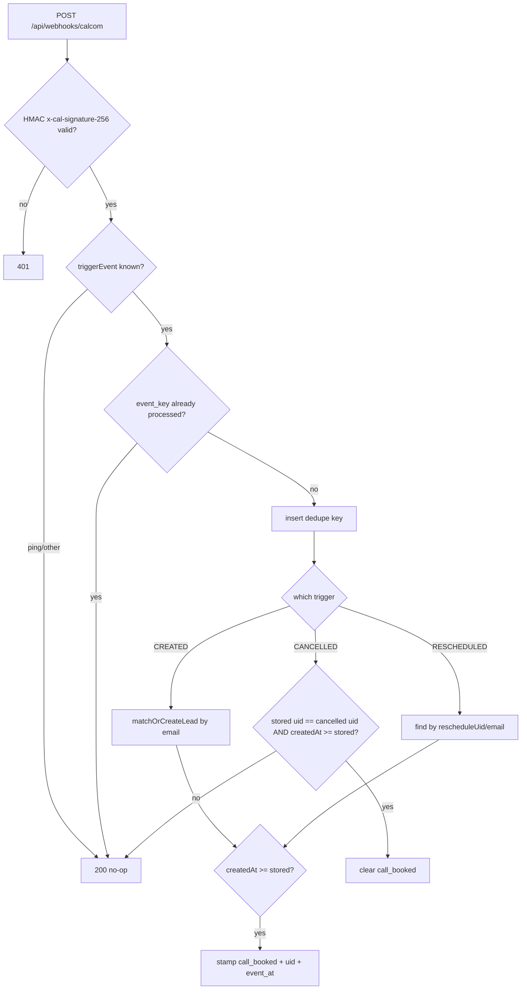

# feat: CRM external-events ingestion & fast capture

## Overview

Five CRM improvements for The 120's staff CRM (Next.js App Router + Supabase),
grouped around one structural gap — the CRM only knows about events that flow
through its own staff server actions, so robot nurture emails, gauntlet
tournament entries, and Cal.com bookings are invisible — plus a fast-capture
shortcut and a confirmed co-pilot bug. The work spans a timeline read-path
change, a shared create-or-match primitive, two external ingestion paths
(gauntlet confirm, Cal.com webhook), a dual-surface capture action, and a
one-line bug fix with an auto-dismiss.

## Problem Frame

Staff (Peter/Ethan) work the pipeline blind to automation: they write a personal
note not knowing the robot emailed the family that morning; confirmed,
consented gauntlet entrants sit stranded in a side table; `call_booked` is keyed
by hand; and the "ask for one introduction" co-pilot nudge nags every
deposit-paid family forever because `deposit_asked_referral` has no setter. See
origin: docs/brainstorms/2026-07-17-crm-external-events-and-capture-improvements-requirements.md.

## Requirements Trace

Carried from the origin doc (R1–R16). Grouped by feature:

- **Item 4 — referral nudge bug:** R1 (manual "Mark referral asked" action), R2
  (auto-set from the T+10 nurture send), R3 (Rule 2 stops once flag set — holds
  by construction).
- **Item 3 — fast warm capture:** R4 (global "Log warm convo" create-or-match),
  R5 (same one-click collapse in-drawer), R6 (heat "warm floor", never lowers),
  R7 (dedup by `lower(email)`, never clobber identity/consent).
- **Item 1 — nurture visibility:** R8 (timeline shows `nurture_sends` as a
  distinct robot event), R9 (display-only — never bumps `last_touch_at`).
- **Item 2 — gauntlet bridge:** R10 (on confirm, create-or-match lead: source
  `gauntlet`, `gauntlet-played` signal, consent carried), R11 (match by email,
  never clobber), R12 (pending/unconfirmed entries never enter the pipeline).
- **Item 5 — Cal.com sync:** R13 (`BOOKING_CREATED` stamps `call_booked`;
  unmatched → new `booking` lead), R14 (implied-EBR consent for booking leads),
  R15 (`BOOKING_CANCELLED` clears only webhook-set stamps; reschedule updates
  time), R16 (HMAC-verified, idempotent, ordering-tolerant webhook).

## Scope Boundaries

- `call_held` stays manual (only `call_booked` is automated).
- No new nurture sequences or copy; item 1 makes existing sends *visible* only.
- Co-pilot Rule 2 stays deterministic; no LLM.
- No backfill of already-confirmed gauntlet entries (follow-up).
- Pending gauntlet entries are not ingested.
- Gauntlet tournament is dormant until go-live (~Aug 3, 2026) — the bridge is
  built now but produces no pipeline rows until entries confirm post-launch.

## Context & Research

### Relevant Code and Patterns

- **Server-action canon** — `app/crm/lib/actions/families.ts`: `requireStaff()`
  → `schema.safeParse` → `supabaseAdmin()` → `loadLiveFamily()` → single
  `families` UPDATE (always bumping `last_touch_at`) → `family_stage_history`
  insert for stage events → `audit(db, actor, action, familyId, metadata)` →
  `maybeClearSupersededOverride()` → `revalidatePath("/crm/pipeline")` →
  `{success, error?}`. Actions never throw. Pure logic in
  `app/crm/lib/families-rules.ts`.
- **Create path** — `addFamily` in `app/crm/lib/actions/families.ts`:
  `findEmailConflict` checks live `families` (`ilike` on `email`) **and** the
  `parents` table; `findSimilarFamily`/`isSimilarFamily` gives a non-blocking
  name/phone `warning`. Insert lets DB defaults fill `heat_score` (3),
  `deposit_asked_referral` (false), `kid_count` (1). `checkDuplicates` is the
  read-only probe the modal calls on blur.
- **Signal/heat/note** — `toggleSignal` (`applySignalToggle`, idempotent),
  `overrideHeat` (absolute set with a no-op short-circuit — R6's floor is new
  logic layered on top), `addNote` (inserts `family_notes` then bumps
  `last_touch_at`).
- **Timeline** — `buildTimeline` in `app/crm/lib/queries.ts` is a **pure**
  function (tested in `app/crm/__tests__/timeline-merge.test.ts`).
  `TimelineEntry.type` union = `"system" | "note" | "stage" | "deposit" |
  "send"`; a module `DOT` hex map colors each. Inputs are assembled in
  `fetchFamilyDetail`'s `Promise.all` (already fetches `library_sends`).
- **Nurture engine** — `app/lib/nurture/rules.ts` (`computeDueSends`, pure;
  gate = `consent_given && !consent_revoked_at && email`), `app/lib/nurture/send.ts`
  (`sendNurtureEmail`), `app/api/cron/nurture/route.ts` (claim-then-send: insert
  `nurture_sends` claim → send → `if (result.ok)` success branch, else delete
  claim). T+10 referral ask = `sequence:"deposit", step:"d10",
  template:"deposit-referral"`. `nurture_sends` schema:
  `supabase/migrations/20260713230000_nurture_sends.sql` — `(family_id, sequence,
  step)` unique; **no subject column**.
- **Gauntlet confirm** — `app/api/gauntlet/tournament/confirm/route.ts`: `GET`
  renders a prefetch-safe button, `POST` verifies token (`timingSafeEqual`) and
  idempotently sets `confirmed_at`. Entries table
  (`supabase/migrations/20260716120000_gauntlet_tournament_entries.sql`) has
  `handle`, `parent_email`, `consent_given`, `consent_at`, `referral_code`,
  `heard_about`, `confirmed_at` — **no parent-name or phone column**.
- **Webhook template** — `app/api/stripe/webhook/route.ts`: raw body via
  `await req.text()`, signature-verify-then-branch, upsert `onConflict` for
  idempotency, returns 500 on DB error so the sender retries.
- **Drawer UI** — `app/crm/components/pipeline/DrawerHeader.tsx` `run(fn, msg)`
  helper (server action → toast → `router.refresh()`); `CopilotCard.tsx` is
  read-only/presentational; `AddFamilyModal.tsx` is the create-modal model;
  `PipelineShell.tsx` mounts the single `BTN_PRIMARY` "Add family" CTA + modals.
- **Constants** — `app/crm/lib/constants.ts`: `SOURCES` already has
  `warm-network` and `gauntlet` (**not** `booking`); `ENGAGEMENT_SIGNALS` has
  `warm-convo` and `gauntlet-played`; `AUDIT_ACTIONS` (18 values) mirrors the
  `crm_audit_log` CHECK.

### Institutional Learnings

- **Never blind-`upsert(onConflict:"email")`** — `docs/solutions/database-issues/blind-upsert-on-conflict-public-endpoint-expression-index-inference-and-consent-hijack-2026-07-16.md`.
  PostgREST can't infer a conflict target against `unique(lower(email))`, and a
  blind upsert silently overwrites another family's consent/identity (a P0 authz
  hole). **Select-first via `.ilike`, then branch explicitly.**
- **Families model / consent** — `docs/solutions/best-practices/bulk-import-crm-leads-families-derived-stage-parent-id-consent-2026-07-15.md`.
  `parent_id` NULL = lead, NOT NULL = account (never insert a 2nd family for an
  account-holder). **Stage is derived, not stored.** `coalesce` `consent_at`/
  `consent_source` so a real signup timestamp is never clobbered.
- **Audit CHECK drifts from the TS enum** — `docs/solutions/best-practices/crm-audit-action-allowlist-db-check-constraint-drifts-from-ts-enum-2026-07-15.md`.
  Adding an action in TS only → silent runtime insert failure (`audit()` swallows
  errors). Either reuse an allowed action + `metadata.kind`, or ALTER the CHECK
  **and** the TS array together (precedent: `20260715090000_offer_email_stamp.sql`,
  constraint `crm_audit_log_action_check`).
- **Flip server-owned columns with a targeted, hardcoded UPDATE** (never upsert)
  — `docs/solutions/database-issues/upsert-insert-arm-poisons-excluded-status-guard-coercion-submit-fails-2026-07-14.md`.
- **Claim-then-send / CAS-guarded stamps** — `docs/solutions/best-practices/resend-safe-atomic-claim-then-send-cas-guarded-claim-and-unclaim-2026-07-15.md`;
  the ordering guard for the webhook mirrors this.
- **State-changing links: GET renders, POST mutates** — `docs/solutions/security-issues/state-changing-email-links-mutate-on-get-scanner-prefetch-false-confirm-2026-07-16.md`
  (exemplar `app/unsubscribe/route.ts`).
- **Migrations via Management API** (no DB password on disk) —
  `docs/solutions/integration-issues/supabase-cli-stale-db-password-management-api-workaround-2026-07-13.md`;
  one file per rollout phase, keep provenance text **ASCII**, verify writes with
  `count(*)`, and insert the version into `supabase_migrations.schema_migrations`.

### External References

- **Cal.com webhooks** ([docs](https://cal.com/docs/developing/guides/automation/webhooks)):
  triggers `BOOKING_CREATED` / `BOOKING_CANCELLED` / `BOOKING_RESCHEDULED`
  (reschedule is a discrete event that mints a **new** `uid`, referencing the old
  via `payload.rescheduleUid`). Booker email = `payload.responses.email.value`
  (canonical) / `payload.attendees[0].email`; **never** `payload.organizer.email`
  (that's the host). Signature header `x-cal-signature-256`, HMAC-SHA256 hex over
  the **raw** body, per-webhook secret. No delivery-id header → dedupe on
  `triggerEvent + uid + createdAt`. Ping/unknown events → ack 200 no-op. If the
  event type has "requires confirmation" on, `BOOKING_REQUESTED` fires instead of
  `BOOKING_CREATED` (config check — see deferred questions).
- **CASL implied consent** ([CRTC](https://crtc.gc.ca/eng/com500/guide.htm),
  [ISED](https://ised-isde.canada.ca/site/canada-anti-spam-legislation/en/getting-consent-send-email)):
  a booking/inquiry gives **6 months** of implied consent (EBR) from the inquiry
  date; it expires (no auto-renew). Record `consent_source='booking-inquiry'`,
  `consent_at = payload.createdAt` (the booking/inquiry time — not webhook
  receipt), `consent_expires_at = consent_at + 6mo`; the nurture send-gate must
  stop at expiry. Every send still needs identity + working unsubscribe.
- **Webhook idempotency/ordering** ([Svix](https://www.svix.com/resources/webhook-university/reliability/idempotency-and-deduplication/),
  [Hookdeck](https://hookdeck.com/webhooks/guides/implement-webhook-idempotency)):
  insert dedupe key first (unique constraint) in the same transaction as the
  effect; store the winning event's timestamp and ignore older events; make
  CANCELLED a no-op when no live matching stamp.

## Key Technical Decisions

- **One shared create-or-match primitive** (`matchOrCreateLead`) backs R7/R10/R11/R13
  so dedup/consent rules never diverge. Select-first via `ilike` against
  `families` and `parents`; on match, add signal only (never overwrite `source`,
  identity, or **stronger** consent — see the booking-consent decision below); on
  miss, insert a lead. Rationale: three copies is the scope-guardian's flagged bug
  surface; the repo already has the anti-pattern documented as a P0.
- **Module boundary (security-critical): the shared db-taking core lives OUTSIDE
  any `"use server"` file.** `matchOrCreateLead` and `stampCallBookedFromWebhook`
  go in a plain server-only module (`app/crm/lib/lead-ingest.ts`, **no** `"use
  server"` directive) — mirroring `app/crm/lib/queries.ts`, which imports
  `supabaseAdmin` and exports db-taking functions without being a Server Action.
  Two reasons: (a) every export of a `"use server"` file is a client-callable
  Server Action, so an auth-skipping core in `families.ts` would be a public
  unauthenticated path to stamp `call_booked`/create leads/mint consent, bypassing
  the Cal.com HMAC gate; (b) a `db`-argument function can't serialize across the
  Server Action RPC boundary. `families.ts` stays exception-free (every export
  still `requireStaff()`-first); staff-triggered effects use thin
  `requireStaff()`-wrapped actions that call the shared core.
- **Booking establishes implied-EBR consent by event, not by row novelty.** On the
  Cal.com path, an inquiry is an inquiry whether or not the booker already has a
  family row. So the booking core may **upgrade** a matched lead that has
  `consent_given=false` and no `consent_revoked_at` to implied-EBR consent — but
  it never downgrades express consent and never re-subscribes a revoked family.
  (This is the one deliberate exception to "never touch consent on match", scoped
  to the booking path.)
- **A manual "Mark referral asked" (R1) also suppresses the robot's T+10 ask.**
  `computeDueSends` skips the `deposit/d10` referral email when
  `deposit_asked_referral` is already true — otherwise R1 wouldn't achieve the
  origin's stated "de-duplicate robot vs human asks" goal (the flag is not in
  today's send-gate).
- **External ingests skip `crm_audit_log`, use nullable-actor tables.** Gauntlet
  and webhook writes record provenance via `family_stage_history` (`actor: null`)
  and a `family_notes` system note (`author: null`) — mirroring the existing
  `parents→families` trigger — avoiding the "no system-actor UUID + NOT NULL
  actor" wall entirely. Only the staff action R1 writes `crm_audit_log`.
- **R1 audit action** = new `'referral-asked'` value, added to the CHECK **and**
  `AUDIT_ACTIONS` in one migration (queryable, first-class; drift-safe).
- **`deposit_asked_referral` setter** is a targeted, hardcoded `UPDATE` in the
  cron's `if (result.ok)` branch, keyed to `sequence==="deposit" && step==="d10"`
  (not email copy). Never an upsert (repo P0 class).
- **Cal.com "only clear webhook-set stamps" is implemented by uid provenance.**
  New columns `call_booked_uid` + `call_booked_event_at`; a manual `stampCall`
  leaves `call_booked_uid` null, so a `BOOKING_CANCELLED` (which only clears when
  its uid matches the stored uid) can never wipe a manual stamp. Same columns
  give the out-of-order guard.
- **Booking match key = email; reschedule falls back to `rescheduleUid`.** Email
  is stable across a reschedule (which mints a new uid), so it's the primary CRM
  key; `rescheduleUid` disambiguates the stamped uid on the reschedule event.
- **Implied-consent expiry via `consent_expires_at`.** New nullable column
  (null = no expiry, i.e. existing/express consent — backward compatible);
  nurture gate extended to `... && (consent_expires_at is null || now < consent_expires_at)`.
- **Warm-convo source = `warm-network`** (already exists) — no new source needed;
  the `warm-convo` signal already distinguishes the interaction. Heat "warm
  floor" = 4 (tunable), applied as `max(current, 4)`.
- **Webhook idempotency via `processed_webhook_events`** (`event_key` unique),
  insert-first-catch-violation, with a TTL purge.

## Open Questions

### Resolved During Planning

- *Gauntlet ingest — trigger vs route?* → **Confirm route POST** (after the
  `confirmed_at` update), not a DB trigger: it already runs service-role, is the
  exact double-opt-in moment, and keeps R12 (pending never ingested) true by
  construction.
- *System actor for external ingests?* → **Not needed** — use nullable-actor
  `family_stage_history` / `family_notes`, skip `crm_audit_log`.
- *Warm-convo source value?* → **Reuse `warm-network`.**
- *Booking-lead consent?* → **Implied-EBR inquiry, `consent_expires_at = now+6mo`,
  `consent_source='booking-inquiry'`** (origin decision), enforced by the gate.
- *R2 write point?* → cron success branch, keyed to `d10` step id.
- *No-email warm capture?* → run the soft `findSimilarFamily` check and surface a
  "did you mean?" attach-or-create choice (reuse the modal's similar-warning
  pattern); create with `email: null` if none.

### Deferred to Implementation

- **Cal.com "requires confirmation" setting** — verify on the live "The 120 —
  Intro Call" event type; if on, also subscribe/handle `BOOKING_REQUESTED` or the
  stamp lags until host acceptance. Verifiable only against the live Cal.com
  account.
- **Exact `nurture` timeline label copy** per sequence/step (derived in code
  since `nurture_sends` has no subject) — final wording at implementation.
- **`processed_webhook_events` TTL purge mechanism** (cron vs scheduled delete) —
  choose alongside the existing cron infra.
- **Heat-floor display state** — whether the warm-floor write reads as a "manual
  override" in `HeatBlock` (it will whenever `heat_score != suggestHeat`);
  confirm the copy is acceptable when driving the real component.
- **"Mark referral asked" placement + state** — header action row (chosen home) vs
  co-pilot card; and its persistent "already asked" state (disabled / checkmark /
  timestamp) so staff can tell at a glance whether R1 or the R2 auto-set fired.
  Whether a mis-click needs an unset path (mirroring `clearStamp`) or is low-stakes
  enough to leave.
- **Consent precedence on match (deferred CASL question)** — whether a genuine
  fresh double-opt-in (gauntlet confirm) should be allowed to clear a prior
  `consent_revoked_at`, or whether revoked families require manual staff review
  before any re-subscription. Default in this plan: **do not re-subscribe** a
  revoked family from any ingest path.
- **Express-consent supersedes the implied window** — when a `booking`/implied
  lead later gains express consent (account link via `parents→families`, or a paid
  deposit), `consent_expires_at` should be nulled so a real customer is not dropped
  from nurture at 6 months. The account/deposit path is out of scope here; capture
  as a fast-follow, and defensively the Unit 8 gate may exempt families with a live
  paid deposit.
- **Ordering-guard NULL handling** — a manual stamp leaves `call_booked_event_at`
  NULL; the guard must treat NULL as "no prior webhook stamp, proceed" (evaluate in
  JS or with an explicit `IS NULL` predicate, not a bare SQL `>=` which excludes).
- **Webhook payload validation + hardening** — Zod-validate the Cal.com payload
  (email format, string-length caps) before any DB write; confirm a body-size /
  rate limit exists at the platform layer or add one; define a PII-redaction policy
  for the 500-retry error-log path (payloads carry booker email); document
  `CAL_WEBHOOK_SECRET` rotation.
- **`processed_webhook_events` TTL purge** — pick a purge mechanism (cron vs
  scheduled delete, ~7–14 day retention) so the dedupe table doesn't grow unbounded.
- **New-surface interaction specifics** — the no-email "did you mean?"
  attach-or-create surface (candidate card/list, multi-candidate handling, what
  writes through on attach vs create); matched-family success feedback in the
  warm-convo modal (navigate/open the matched drawer, symmetric with the new-lead
  path); whether a blank in-drawer note skips the `family_notes` insert; robot
  timeline volume de-emphasis/filter as nurture history accumulates; toast copy
  differentiating the three warm-convo outcomes; responsive/overflow behavior for
  the two new header buttons.

## High-Level Technical Design

> *These illustrate the intended approach and are directional guidance for
> review, not implementation specification. The implementing agent should treat
> them as context, not code to reproduce.*

**Unit dependency graph:**

**Cal.com webhook decision flow (Unit 7):**

**Booking-event → CRM effect matrix:**

| triggerEvent | Match key | Effect | Guard |
|---|---|---|---|
| `BOOKING_CREATED` | booker email | stamp `call_booked_at/_uid/_event_at`; create `booking` lead if unmatched | apply only if `createdAt >= call_booked_event_at` |
| `BOOKING_RESCHEDULED` | `rescheduleUid` then email | update `call_booked_at` + swap `call_booked_uid` | same ordering guard |
| `BOOKING_CANCELLED` | booker email | clear `call_booked*` | only if `call_booked_uid == payload.uid` (never clears manual/null-uid stamps) |
| ping / other | — | 200 no-op | — |

## Implementation Units

- [x] **Unit 1: Phase-1 foundation (referral-asked audit action)**

**Goal:** Land only the schema/constant change Phase 1 actually uses. (The Cal.com
schema moves to a Phase-3 foundation migration — see Unit 7 — to honor the "one
migration file per rollout phase" convention and keep Phase 1's footprint
proportional to its goal.)

**Requirements:** R1 (enabling)

**Dependencies:** None

**Files:**
- Create: `supabase/migrations/20260717130000_crm_referral_asked_audit.sql`
- Modify: `app/crm/lib/constants.ts`

**Approach:**
- Migration (apply via Supabase Management API per the learnings note; record the
  version in `supabase_migrations.schema_migrations`; verify with `count(*)`):
  extend `crm_audit_log_action_check` — single `drop constraint` + `add
  constraint` re-listing all 18 values plus `'referral-asked'` (mirror the
  `offer_email_stamp` migration exactly).
- `constants.ts`: append `'referral-asked'` to `AUDIT_ACTIONS`. (The `'booking'`
  source moves to Unit 7's constants edit, alongside the Cal.com schema.)

**Patterns to follow:** `supabase/migrations/20260715090000_offer_email_stamp.sql`
(CHECK extend), the Management-API apply playbook.

**Test scenarios:**
- Edge case: inserting a `crm_audit_log` row with `action='referral-asked'`
  succeeds; an unknown action still rejects (CHECK intact).
- Integration: `AuditAction` type includes `'referral-asked'` (type-checks).

**Verification:** Migration applied and versioned; a manual `insert ...
'referral-asked'` succeeds and an unknown action rejects.

---

- [x] **Unit 2: `matchOrCreateLead` shared primitive**

**Goal:** One safe create-or-match-by-email function for all ingestion/capture
paths.

**Requirements:** R7, R10, R11, R13 (foundation)

**Dependencies:** Unit 1 (for `booking` source usage by callers)

**Files:**
- Create: `app/crm/lib/lead-ingest.ts` — server-only module, **no `"use server"`
  directive** (mirrors `app/crm/lib/queries.ts`): exports the db-taking
  `matchOrCreateLead`. This is a security boundary, not a style choice (see Key
  Technical Decisions → module boundary).
- Modify: `app/crm/lib/families-rules.ts` (pure match/normalize helpers)
- Modify: `app/crm/lib/actions/families.ts` — refactor `findEmailConflict` to call
  the shared `ilike` matcher (single email-match implementation); no db-taking
  export added to this `"use server"` file.
- Test: `app/crm/__tests__/match-or-create-lead.test.ts`

**Approach:**
- `matchOrCreateLead(db, { email?, source, signals, consent?, identity })` —
  `email` is **optional**: on match it is the key; on miss the lead is inserted
  with `email` as given (`null` is valid). The no-email soft-match / "did you
  mean?" flow is the **caller's** responsibility (Unit 5); callers with a reliable
  email (gauntlet, webhook) pass it.
  1. If `email` present: `ilike` live `families` (`merged_into_id is null`) → if
     found, return `{ familyId, matched: true }` after adding any `signals` via
     `applySignalToggle` **without** overwriting `source`/identity/stronger
     consent (`coalesce` only fills nulls, per bulk-import doc; the booking path's
     consent upgrade is the one scoped exception — see Key Technical Decisions).
  2. Else check `parents` by email → if an account-holder, resolve to their live
     family (never insert a second row).
  3. On miss: insert a lead (reusing `addFamily`'s field-defaulting), set
     `signals`, `source`, and consent fields as passed.
- Refactor `addFamily`/`findEmailConflict` to call the shared `ilike` matcher so
  there is a single email-match implementation.
- Never `upsert(onConflict)`. A genuine concurrent insert losing to
  `families_email_live_unique_idx` is the correct outcome — catch it and
  re-select rather than papering over.

**Execution note:** Test-first — the concurrency/consent-preservation contract is
the whole point of extracting this; write the failing tests before refactoring.

**Patterns to follow:** `findEmailConflict`/`findSimilarFamily`/`addFamily` in
`app/crm/lib/actions/families.ts`; `applySignalToggle` in `families-rules.ts`.

**Test scenarios:**
- Happy path: unknown email → new lead created with given source/signal/consent;
  returns `matched: false`.
- Happy path: email matches a live family → returns that `familyId`, adds the
  signal, `matched: true`.
- Edge case: matched family already has the signal → idempotent, no duplicate.
- Edge case: email matches a `parents` account-holder → resolves to their
  existing family, never inserts a second family row.
- Error/consent path: matched family has `consent_given=true` / a real
  `consent_at` → a call passing weaker consent does **not** overwrite it
  (`coalesce` preserves the original); a revoked family
  (`consent_revoked_at` set) is not silently re-subscribed.
- Integration: two near-simultaneous inserts for the same new email → exactly one
  family row exists afterward (the loser re-selects the winner), no unhandled
  500.

**Verification:** All match/create/consent-preservation tests pass; `addFamily`
still behaves identically through the shared matcher.

---

- [x] **Unit 3: Referral-nudge fix (R1 manual + R2 auto)**

**Goal:** Give `deposit_asked_referral` its missing setter so Rule 2 can be
dismissed, and self-dismiss when the robot sends the T+10 ask.

**Requirements:** R1, R2, R3

**Dependencies:** Unit 1 (`referral-asked` audit action)

**Files:**
- Modify: `app/crm/lib/actions/families.ts` (new `markReferralAsked` action)
- Modify: `app/crm/lib/families-rules.ts` (Zod schema)
- Modify: `app/crm/components/pipeline/DrawerHeader.tsx` (action-row button)
- Modify: `app/api/cron/nurture/route.ts` (success-branch flag set)
- Modify: `app/lib/nurture/rules.ts` (`computeDueSends` skips `deposit/d10` when
  `deposit_asked_referral` is already true — so a manual R1 ask suppresses the
  robot ask, fulfilling the origin's de-dup intent; requires threading
  `deposit_asked_referral` into the rules input)
- Test: `app/crm/__tests__/actions-families.test.ts`,
  `app/lib/nurture/__tests__/rules.test.ts` (or the existing nurture test file)

**Approach:**
- `markReferralAsked({ familyId })`: canon action; targeted hardcoded
  `update({ deposit_asked_referral: true, last_touch_at })`; `audit('referral-asked')`;
  `revalidatePath`. Idempotent (setting true when already true is a harmless no-op
  — optionally short-circuit like `overrideHeat`).
- DrawerHeader: a "Mark referral asked" button via the `run(fn, msg)` helper,
  in the action row (not the read-only `CopilotCard`).
- Cron: in the `if (result.ok)` branch, add
  `if (item.sequence === "deposit" && item.step === "d10")` → targeted
  `update({ deposit_asked_referral: true })`. Only on success (the failure branch
  already deletes the claim), so the flag never sets without the email going out.
  Note: the `nurture_sends` `d10` row is the durable record of the robot ask, so a
  failed flag-write does not lose data (the timeline still shows the send);
  worst case the nudge lingers one extra day until re-evaluated.
- Suppression (rules): thread `deposit_asked_referral` into `computeDueSends`'s
  family input and skip the `deposit/d10` step when it is already true, so a
  staff-made manual ask (R1) prevents the robot from also asking.

**Test scenarios:**
- Happy path: `markReferralAsked` sets the flag true and writes a
  `referral-asked` audit row; Rule 2 (`deriveNextMove`) no longer returns the
  referral message for that family.
- Edge case: calling `markReferralAsked` twice is idempotent (no error, no
  duplicate side effect).
- Happy path (R2): cron sends the `deposit/d10` email successfully → the family's
  `deposit_asked_referral` becomes true.
- Error path (R2): the `d10` send fails → flag stays false and the claim is
  deleted (tomorrow retries); no phantom dismiss.
- Edge case (R2): a non-`d10` deposit send (`d0`/`d3`) does **not** set the flag.
- Suppression: a family with `deposit_asked_referral=true` yields no `deposit/d10`
  due-send from `computeDueSends` (manual ask suppresses the robot ask); a family
  with it false still gets the `d10` send on schedule.
- Integration: `deriveNextMove` for a `deposit_paid` family flips from Rule 2 to
  the next applicable rule once the flag is set (existing `engine.test.ts` fixture
  extended).

**Verification:** Manually dismissing the nudge in the drawer clears it; a
simulated `d10` cron send flips the flag; unit tests green.

---

- [x] **Unit 4: Nurture emails on the family timeline (R8, R9)**

**Goal:** Surface automated `nurture_sends` as a distinct robot event on the
family timeline, without touching the staleness clock.

**Requirements:** R8, R9

**Dependencies:** None (independent read-path change)

**Files:**
- Modify: `app/crm/lib/queries.ts` (`buildTimeline` union + input +
  `fetchFamilyDetail` fetch + `DOT` map + label derivation)
- Modify: `app/crm/components/pipeline/ActivityTimeline.tsx` (if any type/label
  handling is non-generic)
- Test: `app/crm/__tests__/timeline-merge.test.ts`

**Approach:**
- Add `"nurture"` to the `TimelineEntry.type` union and a `TimelineNurtureInput
  = { id, sequence, step, sent_at }` param to `buildTimeline`; map each to an
  entry with a derived label (e.g. `"Automated · Deposit T+10 referral ask"`) and
  a new `DOT.nurture` hex visually distinct from `send`'s blush.
- `fetchFamilyDetail`: add
  `db.from("nurture_sends").select("id, sequence, step, sent_at").eq("family_id", id)`
  to the `Promise.all`, using the pre-migration-tolerant `res.error ? [] : res.data`
  idiom already used for `library_sends`; pass to `buildTimeline`.
- R9 holds by construction: this is a read/display change only; no writer sets
  `last_touch_at`. Add a regression test asserting the nurture fetch path never
  mutates.

**Test scenarios:**
- Happy path: given two `nurture_sends` rows, `buildTimeline` emits two
  `type:"nurture"` entries with derived labels, merged in correct desc-time order
  with notes/sends/stages.
- Edge case: `d10` referral-ask send renders a label that lets staff see it was
  the referral ask (ties to Unit 3's auto-dismiss auditability).
- Edge case: no `nurture_sends` rows → timeline is unchanged from today.
- Edge case: a nurture send and a manual `library_send` at the same timestamp are
  visually distinguishable (different `type`/`dotColor`) and tie-break
  deterministically by id.
- Integration: `fetchFamilyDetail` tolerates a missing/empty `nurture_sends`
  table (pre-migration idiom) and never writes `last_touch_at`.

**Verification:** A family with nurture history shows robot events on the
timeline, styled distinctly from staff sends; `last_touch_at` unchanged.

---

- [x] **Unit 5: "Log warm convo" capture (R4, R5, R6, R7)**

**Goal:** One-step warm-conversation capture, both globally (create-or-match) and
inside an open drawer.

**Requirements:** R4, R5, R6, R7

**Dependencies:** Unit 2

**Files:**
- Modify: `app/crm/lib/actions/families.ts` (new `logWarmConvo` action)
- Modify: `app/crm/lib/families-rules.ts` (Zod schema; `warmFloorHeat` helper)
- Create: `app/crm/components/pipeline/LogWarmConvoModal.tsx`
- Modify: `app/crm/components/pipeline/PipelineShell.tsx` (button + modal mount)
- Modify: `app/crm/components/pipeline/DrawerHeader.tsx` (in-drawer button +
  note popover)
- Test: `app/crm/__tests__/actions-families.test.ts` (or a new
  `actions-warm-convo.test.ts`)

**Approach:**
- `logWarmConvo({ familyId?, name?, email?, note? })`:
  - If `familyId` given (R5, in-drawer): operate on that family.
  - Else (R4, global): `matchOrCreateLead` by email (source `warm-network`);
    if no email, run `findSimilarFamily` and return a `warning` + candidate for a
    "did you mean?" attach-or-create choice, else create with `email: null`.
  - In all cases: add `warm-convo` signal, apply the **warm floor**
    (`heat_score = max(current, 4)` — only writes if it raises), insert the
    `note` as a `family_notes` row, bump `last_touch_at` — collapsing today's four
    separate writes into one action. Audit reuses `note-add` / `signal-toggle`
    conventions (or a `metadata.kind` discriminator).
- `LogWarmConvoModal`: modeled on `AddFamilyModal` (fields, blur `checkDuplicates`,
  submit → `logWarmConvo`, on new-family success `router.push('/crm/pipeline?family=' + id)`).
- PipelineShell: a `BTN_SECONDARY` "Log warm convo" next to the primary "Add
  family" CTA (secondary weight — do not add a second primary).
- DrawerHeader: a button opening a small note popover (mirror the call-stamp
  backdate popover), then `logWarmConvo({ familyId, note })`.

**Test scenarios:**
- Happy path (R4 new): name + email + note, no match → new `warm-network` lead
  with `warm-convo` signal, heat ≥ 4, a note row, `last_touch_at` set.
- Happy path (R4 match): email matches a family → note + signal added to it, no
  duplicate lead.
- Happy path (R5): in-drawer with `familyId` → one action adds signal + note +
  heat floor + touch.
- Edge case (R6): family already at heat 5 → warm floor does **not** lower it to
  4; family at heat 2 → raised to 4.
- Edge case (R7 no email): no email + a similar existing family → returns the
  attach-or-create candidate rather than silently creating a duplicate; no email +
  no similar → creates with `email: null`.
- Error path: matched family with revoked consent → capture adds the signal/note
  but does not re-subscribe consent.

**Verification:** From the pipeline, logging a brand-new warm contact lands a
fully-populated lead in one submit; the in-drawer button collapses the four
writes; heat never regresses.

---

- [x] **Unit 6: Gauntlet → CRM bridge (R10, R11, R12)**

**Goal:** On tournament confirmation, create-or-match a `gauntlet`-source lead
with the `gauntlet-played` signal.

**Requirements:** R10, R11, R12

**Dependencies:** Unit 2

**Files:**
- Modify: `app/api/gauntlet/tournament/confirm/route.ts` (POST, after
  `confirmed_at` update)
- Test: `app/api/gauntlet/tournament/__tests__/confirm-bridge.test.ts` (or extend
  existing confirm tests)

**Approach:**
- After the idempotent `confirmed_at` set in the POST handler, call
  `matchOrCreateLead` with: `email = parent_email`, `source = 'gauntlet'`,
  `signals = ['gauntlet-played']`, consent carried from the entry
  (`consent_given`, `consent_at`, `consent_source = 'gauntlet-tournament'`).
  Synthesize `parent_name = "Gauntlet: {handle}"` (ASCII) since the entries table
  has no name — avoids "Unnamed family" rows.
- Record provenance via a `family_notes` system note (`author: null`) e.g.
  "Joined via Gauntlet ({handle})"; no `crm_audit_log` row (nullable-actor path).
- R12 holds by construction: this runs only on the confirm POST, never on
  pending entries.
- **Isolation:** wrap the bridge call in try/catch — the confirm POST must return
  its success shell (consent is already recorded) even if `matchOrCreateLead`
  throws; log and continue. The parent must never see a 500 after `confirmed_at`
  was committed.
- Idempotent: `matchOrCreateLead` adds the signal idempotently, so a re-fired
  confirm (the entries table allows a pending re-entry to reset confirmation) is a
  no-op — it does not create a second family or re-add the signal.

**Test scenarios:**
- Happy path: a valid confirm for a new email → a `gauntlet` lead with the
  `gauntlet-played` signal, `parent_name = "Gauntlet: {handle}"`, consent carried.
- Happy path (match): confirm for an email already in the pipeline → adds the
  signal to the existing family, no duplicate, existing source/identity untouched.
- Edge case (R12): a pending (unconfirmed) entry never produces a family row.
- Edge case: a re-submitted confirm (already `confirmed_at`) does not create a
  second family or re-add the signal.
- Error/consent path: confirm for an email whose family previously revoked
  consent → the signal is added but consent is **not** silently re-granted
  (consent-precedence is the deferred CASL question; default to not re-subscribing).
- Error path (isolation): the bridge write fails (e.g. `matchOrCreateLead` throws)
  → the confirm POST still returns its success shell and `confirmed_at` stays set;
  the parent sees confirmation, not a 500.
- Integration: the created lead appears in `fetchPipeline` with derived stage
  and the signal visible.

**Verification:** Confirming a test entry surfaces a `gauntlet` lead in the
pipeline; re-confirming is a no-op; pending entries stay invisible; a simulated
bridge failure still confirms.

---

- [x] **Unit 7: Cal.com booking webhook (R13, R14, R15, R16)**

**Goal:** Stamp/clear `call_booked` from Cal.com bookings, safely and
idempotently, creating implied-consent leads for unmatched bookers.

**Requirements:** R13, R14, R15, R16

**Dependencies:** Unit 2, Unit 8 (send-gate must honor expiry before booking
leads are nurtured). Includes its own Phase-3 foundation migration (below).

**Files:**
- Create: `supabase/migrations/20260717150000_crm_calcom_booking.sql` — the
  Cal.com schema (moved out of Unit 1 to keep migrations one-per-phase): `alter
  table public.families add column call_booked_uid text`, `add column
  call_booked_event_at timestamptz`, `add column consent_expires_at timestamptz`;
  `create table public.processed_webhook_events (event_key text primary key,
  created_at timestamptz not null default now())` (RLS on, no policies). Apply via
  Management API, versioned, `count(*)`-verified.
- Modify: `app/crm/lib/constants.ts` — append `'booking'` to `SOURCES` +
  `SOURCE_LABELS`.
- Create: `app/api/webhooks/calcom/route.ts`
- Create: `app/lib/calcom/verify.ts` (HMAC helper), `app/lib/calcom/events.ts`
  (payload **Zod schema** + typed parse — validate email format and cap
  string lengths on fields flowing into `parent_name`/notes before any DB write,
  matching the codebase's `safeParse`-before-mutate canon for a public source)
- Create: `app/crm/lib/lead-ingest.ts` addition — `stampCallBookedFromWebhook`
  (db-taking, **not** in a `"use server"` file; see module-boundary decision)
- Modify: `app/crm/lib/actions/families.ts` — `clearStamp` **and** `stampCall`'s
  booked branch must also set `call_booked_uid = null` and `call_booked_event_at
  = null`, so the manual path always restores the null-uid invariant R15 relies on
  (otherwise a stale webhook uid survives a manual clear and a later foreign
  cancel could wipe a manual re-stamp)
- Test: `app/api/webhooks/calcom/__tests__/route.test.ts`,
  `app/lib/calcom/__tests__/verify.test.ts`

**Approach:**
- Route (`runtime = "nodejs"`): `await req.text()` raw body → HMAC-SHA256 hex with
  `CAL_WEBHOOK_SECRET`, constant-time compare to `x-cal-signature-256`; 401 on
  mismatch or missing secret. Parse only after verifying (mirror the Stripe route).
- Idempotency (ordering-safe): compute `event_key = sha256(triggerEvent + ':' +
  uid + ':' + createdAt)`. Because PostgREST statements are **not** transactional
  across calls, do **not** insert the dedupe key first and rely on a 500-retry —
  a transient failure after the dedupe insert would make the retry a 200 no-op and
  permanently drop the stamp. Instead either (a) wrap dedupe-insert + effect in a
  single Postgres RPC/transaction, or (b) record the dedupe key **after** the
  effect succeeds — safe here because every effect is an idempotent set-to-value,
  so at-worst a concurrent redelivery re-applies the same value. On an
  already-present `event_key`, return 200 (already handled).
- Branch `triggerEvent` per the effect matrix above. Booker email =
  `payload.responses.email.value` (fallback `attendees[0].email`); never
  `organizer.email`.
  - `BOOKING_CREATED`: `matchOrCreateLead`. Consent is established **by the
    booking event**, from the booking's own time: `consent_at = payload.createdAt`
    (the inquiry date — never webhook-receipt time, or the 6-month window
    overshoots on a delayed delivery), `consent_expires_at = payload.createdAt +
    6mo`, `consent_source = 'booking-inquiry'`. Applies to an **unmatched** lead
    (new `booking` row, `consent_given=true`) *and* to a **matched** lead that
    currently has `consent_given=false` and no revocation (upgrade to implied-EBR
    — see the booking-consent decision); never downgrades express, never
    re-subscribes a revoked family. Then stamp `call_booked_at`, `call_booked_uid
    = payload.uid`, `call_booked_event_at = payload.createdAt` — only if
    `payload.createdAt >= existing call_booked_event_at` (ordering guard; a NULL
    stored value means "no prior webhook stamp — proceed"). Write a
    `family_stage_history` row (`actor: null`, `note: "stamp · {iso}"`).
  - `BOOKING_RESCHEDULED`: locate the family via stored `call_booked_uid ==
    payload.rescheduleUid` (fallback email); update `call_booked_at` to new time,
    swap `call_booked_uid` to the new `payload.uid`, apply ordering guard.
  - `BOOKING_CANCELLED`: clear `call_booked*` only if `call_booked_uid ==
    payload.uid` and the ordering guard passes — a manual stamp (`call_booked_uid`
    null) never matches, so it's never wiped (R15).
  - ping/unknown `triggerEvent`: 200 no-op.
- Return 500 on unexpected DB error so Cal.com retries (idempotency makes retries
  safe).

**Execution note:** Start with a failing test of the HMAC verify + the
signature-reject path (the trust boundary) before wiring effects.

**Patterns to follow:** `app/api/stripe/webhook/route.ts` (raw body, verify,
retry-on-500), `stampCall` in `families.ts` (stamp + `family_stage_history`
shape), `matchOrCreateLead` (Unit 2).

**Test scenarios:**
- Security: a body with a wrong/missing signature → 401, no DB write; a valid
  signature proceeds.
- Happy path: `BOOKING_CREATED` for a matched email → `call_booked_at/_uid/_event_at`
  stamped; `family_stage_history` row with null actor.
- Happy path: `BOOKING_CREATED` for an unknown email → a `booking` lead with
  implied-EBR consent (`consent_expires_at` ≈ booking time + 6mo) then stamped.
- Consent (matched): a matched lead with `consent_given=false`, not revoked →
  upgraded to implied-EBR (consistent with the unmatched path); a matched lead
  with express consent is **not** downgraded; a matched **revoked** lead is **not**
  re-subscribed.
- Idempotency: the same `BOOKING_CREATED` delivered twice → second delivery is a
  200 no-op (dedupe key), no double effect.
- Ordering: a stale `BOOKING_CANCELLED` (older `createdAt`) arriving after a newer
  `BOOKING_CREATED`/rebook → ignored (stamp stands).
- R15 authority: a `BOOKING_CANCELLED` whose uid ≠ stored uid, or a family whose
  `call_booked` was set manually (null uid) → **not** cleared.
- R15 provenance reset: webhook stamps uid=X → staff `clearStamp` (nulls
  `call_booked_uid`/`_event_at`) → staff `stampCall` booked (uid stays null) → a
  late `BOOKING_CANCELLED` for uid=X does **not** wipe the manual stamp.
- Idempotency/durability: a transient failure between accepting the event and
  applying the effect does not permanently drop the stamp (retry re-applies) — the
  dedupe key is not committed ahead of a lost effect.
- Reschedule: `BOOKING_RESCHEDULED` updates the time and swaps the stored uid;
  matches via `rescheduleUid`.
- Edge case: ping/unknown event → 200 no-op, no CRM write.
- Edge case: cancelled booking with no live stamp → 200 no-op.

**Verification:** A Cal.com "ping test" returns 200; a real test booking stamps
`call_booked`; cancelling clears it; a manually-stamped family is untouched by a
foreign cancel; replays are no-ops.

---

- [x] **Unit 8: Nurture send-gate honors consent expiry**

**Goal:** Stop nurturing implied-consent (booking) leads after their 6-month
window, without affecting express-consent families.

**Requirements:** R14 (enforcement)

**Dependencies:** The Phase-3 Cal.com migration (`consent_expires_at` column,
listed in Unit 7's Files) must be **applied first** — apply that migration at the
start of Phase 3, then Unit 8, then the Unit 7 webhook code.

**Files:**
- Modify: `app/lib/nurture/rules.ts` (`computeDueSends` gate)
- Modify: `app/api/cron/nurture/route.ts` (select `consent_expires_at` into the
  gate input, if not already present)
- Test: `app/lib/nurture/__tests__/rules.test.ts` (or existing nurture rules test)

**Approach:**
- Extend the CASL gate from `consent_given && !consent_revoked_at` to also require
  `consent_expires_at == null || nowMs < consent_expires_at`. Null = no expiry
  (express/existing consent) → unchanged behavior. Fetch the column in the cron's
  families query and thread it into `computeDueSends`'s family input.

**Execution note:** Test-first — the expiry boundary is the CASL-critical
behavior.

**Test scenarios:**
- Happy path: a family with `consent_expires_at` in the future is still eligible.
- Edge case (boundary): a family whose `consent_expires_at` is now/in the past is
  **excluded** from due sends.
- Edge case: `consent_expires_at = null` (existing/express families) → behavior
  identical to today (still eligible on the existing gate).
- Integration: a `booking` lead created 6 months ago receives no further nurture.

**Verification:** Rules tests cover the future/expired/null cases; expired
booking leads drop out of `computeDueSends`.

## System-Wide Impact

- **Interaction graph:** New writers into `families` (webhook, gauntlet confirm,
  warm-convo) all flow through `matchOrCreateLead`; the co-pilot (`deriveNextMove`)
  and derived stage (`deriveStage`) read the resulting rows unchanged. The nurture
  cron gains a flag-write and a gate condition.
- **Error propagation:** External ingests must never 500 the public gauntlet/booking
  flows on CRM failure — the gauntlet confirm should still confirm even if the
  bridge write fails (log + continue); the webhook returns 500 only to trigger a
  safe retry.
- **State lifecycle risks:** Webhook out-of-order/duplicate delivery (guarded by
  `processed_webhook_events` + `call_booked_event_at`); create-or-match races
  (guarded by `families_email_live_unique_idx` + re-select); reschedule uid churn
  (guarded by `rescheduleUid` lookup).
- **API surface parity:** `call_booked` is now set by three paths (manual
  `stampCall`, webhook, and — indirectly — none else); the provenance columns keep
  manual and webhook stamps distinguishable. `clearStamp` (manual) still works and
  should also clear `call_booked_uid`/`_event_at` to avoid a stale uid guarding a
  future webhook.
- **Integration coverage:** Timeline rendering with mixed staff + robot events;
  co-pilot rule transition on flag set; nurture eligibility across the expiry
  boundary — all covered by the per-unit integration scenarios.
- **Unchanged invariants:** Stage remains derived (no `stage` column written);
  `last_touch_at` is bumped only by staff mutations (R9); `addFamily`'s external
  behavior is preserved through the shared matcher; existing/express consent
  (null `consent_expires_at`) nurtures exactly as before.

## Risks & Dependencies

| Risk | Mitigation |
|------|------------|
| Blind upsert reintroduces the consent-hijack P0 | Shared `matchOrCreateLead` is select-first via `ilike`; never `upsert(onConflict)`; unit tests assert consent preservation |
| Audit CHECK drift → silent runtime insert failure | `referral-asked` added to CHECK **and** `AUDIT_ACTIONS` in one migration; external ingests avoid `crm_audit_log` entirely |
| Cal.com "requires confirmation" changes which events fire | Deferred verification against the live event type before wiring; handle `BOOKING_REQUESTED` if on |
| Webhook cancel wipes a manual stamp | `call_booked_uid` provenance: cancel clears only when uid matches (manual = null uid) |
| Duplicate/out-of-order webhook delivery | `processed_webhook_events` dedupe + `call_booked_event_at` ordering guard |
| Booking leads emailed without lawful basis | Implied-EBR consent metadata + `consent_expires_at` gate (Unit 8) stops sends at 6 months |
| Migration applied without DB password | Supabase Management API playbook; ASCII text; `count(*)` verify; version recorded |
| Concurrent create-or-match duplicates a family | Unique live-email index + catch-and-re-select |
| Auth-skipping core becomes a public Server Action | Shared db-taking core lives in a non-`"use server"` module (`lead-ingest.ts`); `families.ts` stays exception-free; webhook is the only unauthenticated caller, behind HMAC |
| Dedupe-key committed before a lost effect drops a booking | Transactional RPC or mark-processed-after-effect (idempotent set-to-value) |
| Foreign cancel wipes a manual re-stamp | `clearStamp`/`stampCall` reset `call_booked_uid`/`_event_at` to NULL on the manual path |
| Booker email is self-reported (not confirmed like gauntlet) | HMAC-gated; implied consent scoped to the inquiry; nurture content topical + unsubscribe; consider deferring consent to call-held (deferred question) |

## Documentation / Operational Notes

- Configure the Cal.com webhook (Settings → Developer → Webhooks) subscribing to
  `BOOKING_CREATED/CANCELLED/RESCHEDULED`, set the Secret, and store it as an
  env-scoped `CAL_WEBHOOK_SECRET` (dev/preview/prod) — never hardcode/log it.
- Add a `processed_webhook_events` TTL purge (align with existing cron infra).
- After shipping, consider a follow-up backfill of already-confirmed gauntlet
  entries (explicitly out of scope here).
- CASL: keep `consent_source` strings ASCII; ensure booking-lead nurture content
  stays topical to the inquiry and retains identity + unsubscribe.

## Phased Delivery

### Phase 1 — Quick wins (low risk)
- Unit 1 (referral-asked audit action), Unit 3 (referral-nudge fix), Unit 4
  (nurture timeline). Ships item 4 and item 1 independently of the heavier
  integration work. Migration footprint is just the audit-CHECK extension.

### Phase 2 — Capture + gauntlet
- Unit 2 (shared primitive), then **Unit 5 (log warm convo) first** (live value
  the day it ships), then Unit 6 (gauntlet bridge). Unit 6 can be timed close to
  the ~Aug 3 tournament go-live — it yields no pipeline rows until entries confirm
  post-launch and is best verified against the real confirm flow; its only hard
  dependency (Unit 2) is already needed for Unit 5, so deferring it costs nothing
  structurally.

### Phase 3 — Cal.com integration (heaviest)
- Apply the Cal.com/consent migration first (the `consent_expires_at`/provenance
  columns + dedupe table, listed in Unit 7's Files), then Unit 8 (consent-expiry
  gate), then Unit 7 (webhook code). Ships item 5 with the CASL gate already in
  place so booking leads are never over-nurtured. The Cal.com schema lands here,
  not in Phase 1 — so a Phase-3 slip never leaves dormant schema in production.

## Sources & References

- **Origin document:** docs/brainstorms/2026-07-17-crm-external-events-and-capture-improvements-requirements.md
- Related code: `app/crm/lib/actions/families.ts`, `app/crm/lib/queries.ts`,
  `app/lib/nurture/`, `app/api/cron/nurture/route.ts`,
  `app/api/gauntlet/tournament/confirm/route.ts`, `app/api/stripe/webhook/route.ts`,
  `app/crm/components/pipeline/`, `app/crm/lib/constants.ts`
- Learnings: `docs/solutions/database-issues/blind-upsert-on-conflict-public-endpoint-expression-index-inference-and-consent-hijack-2026-07-16.md`,
  `docs/solutions/best-practices/bulk-import-crm-leads-families-derived-stage-parent-id-consent-2026-07-15.md`,
  `docs/solutions/best-practices/crm-audit-action-allowlist-db-check-constraint-drifts-from-ts-enum-2026-07-15.md`,
  `docs/solutions/best-practices/resend-safe-atomic-claim-then-send-cas-guarded-claim-and-unclaim-2026-07-15.md`,
  `docs/solutions/integration-issues/supabase-cli-stale-db-password-management-api-workaround-2026-07-13.md`
- External: [Cal.com Webhooks](https://cal.com/docs/developing/guides/automation/webhooks),
  [CRTC implied-consent guidance](https://crtc.gc.ca/eng/com500/guide.htm),
  [Svix idempotency & dedup](https://www.svix.com/resources/webhook-university/reliability/idempotency-and-deduplication/)
