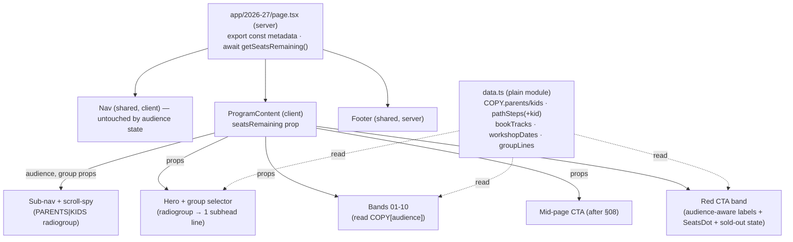
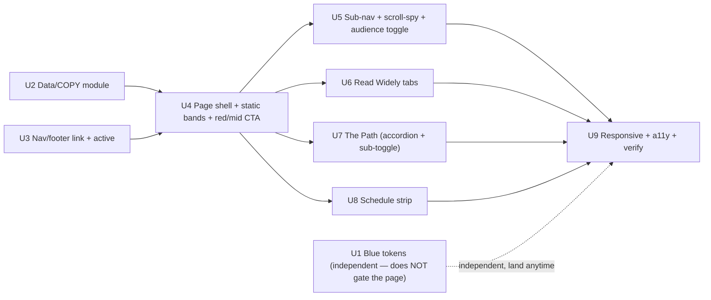

# feat: The 2026-27 program page (`/2026-27`) + site-wide blue unification

## Overview

Build `/2026-27`, The 120's flagship founding-year recruitment page, by recreating the high-fidelity prototype in `artifacts/2026-27 Page Handoff/design_handoff_2026-27_program_page/` in the app's Next.js 16 / React 19 / Tailwind v4 idiom. The page is a long, editorial marketing page with **thirteen bands** and two signature interactions: a **Parents↔Kids audience toggle** that rewrites every string that has a Kids variant, and a **hero group selector** that swaps one line of hero copy. It also introduces one net-new UI primitive — a **sticky anchor sub-nav with scroll-spy** — and folds in a **site-wide blue token unification** (`#22219B → #0300ED`).

Everything reuses the existing design system (tokens, `.eyebrow`/`.display` classes, `Nav`/`Footer`/`JoinButton`/`Cta`/`SeatsDot`/`Wordmark`, the server-page + `"use client"`-island pattern). Content lives in a typed data/COPY module so non-devs edit copy, not markup.

## Problem Frame

The founding-year story is scattered across the home page and five thin group pages; there is no single page that sells the 2026-27 program to parents (the buyers) while letting a kid flip into a voice written for them (see origin). The page must feel serious, scarce, and honest — observable milestones (a real sale, a real product, real numbers), never revenue guarantees — and its real job is conversion: routing parents to **Join** (account modal) and **Book a call** (`BOOKING_URL`).

## Requirements Trace

Carried from the origin requirements doc (`docs/brainstorms/2026-07-17-2026-27-program-page-requirements.md`). IDs match the origin.

- **R1** New public route `/2026-27` — server page, `await getSeatsRemaining()`, metadata export, shared `Nav`/`Footer` chrome.
- **R2** `2026-27` as the first link in the shared `nav` array (→ global nav + footer); active (red) on this page.
- **R3** Page-only sticky anchor sub-nav (10 mono links) with scroll-spy; instant anchor jumps; `scroll-margin-top` offsets.
- **R4** `PARENTS | KIDS` segmented control pinned right of the sub-nav.
- **R5** Thirteen bands = Hero + the 10 numbered sections (`01`-`10`) + the red CTA band + the blue Footer, in fixed order/background per handoff; numbered mono kicker + Georgia headline with one italic accent per section. (The sub-nav's 10 links map to the 10 numbered sections; Hero, CTA, and Footer are not in the sub-nav.)
- **R6** Math is its own section `09 · THE FOUNDATION` (prototype structure confirmed to supersede the v2 one-to-one rule).
- **R7** The Path (§08): 5-node stepper, 3 pacing cards, single-open accordion (Phase 01 open on load), 25 pass criteria.
- **R8** Read Widely (§04): three grade-track tabs; five path-phase groups of four books each; default Grades 3-5.
- **R9** Schedule (§05): workshop date strip (Fall/Winter/Spring) + month/week blocks; honesty fix ("19 scheduled, one more to be added"; softened cadence line).
- **R10** CTA band (red): serif headline, audience-aware buttons, `<SeatsDot>` via `getSeatsRemaining()`; no pricing/guarantees.
- **R11** Audience toggle (default Parents): swaps every string that has a Kids variant (shared strings unchanged); relabels **only the in-page red-band CTAs** (global nav untouched); not persisted.
- **R12** Hero group selector (default `The 120`): swaps only the hero subhead across 6 selections.
- **R13** Kids-only Path criteria sub-toggle (`KID VOICE | ORIGINAL`), visible only in Kids.
- **R14** Path accordion single-open; book tabs switch grid; all interactivity in `"use client"` islands.
- **R15** Typed data/COPY module (dates, path criteria ×2 voices, book tracks, COPY parents/kids); COPY transcribed from the `.dc.html`.
- **R16** Unify brand blue to `#0300ED` site-wide (token + hardcoded literal); re-verify vibration, sweep literals, check contrast.
- **R17** Reuse the design system exactly; new assemblies only (stepper, book tabs, date strip, loop arrows) beyond the scroll-spy sub-nav.
- **R18** Desktop-first, breakpoints 920/600, `prefers-reduced-motion` respected.
- **R19** Image slots: hero (full-bleed, `#0300ED` placeholder until filled) + optional coaching photo.
- **R20** Wire conversion to the existing funnel (Join → account modal; Book a call → `BOOKING_URL`); primary CTA reachable near top; instrument clicks (deferred).

## Scope Boundaries

- No pricing, no guarantee/refund analog, no unpublished numbers (coach ratios, guest-founder counts) on the page.
- No peer-vote advancement gate.
- No new *visual* primitives beyond the scroll-spy sub-nav (reuse existing tokens/components). The page does add new *interactive assemblies* — a tablist, an accordion, and three radiogroups — each carrying its own ARIA/keyboard contract (R17); that interaction surface is intended.
- Real hero/coaching photography deferred — placeholders ship first.
- Do **not** port the prototype runtime (`support.js`, `image-slot.js`, `.dc.html` framework).
- Blue unification is limited to reconciling the *value* to `#0300ED` everywhere; collapsing the `--color-crm-blue` token into `--color-blue` is optional cleanup, deferred (the CRM value is already `#0300ed`).
- No URL-synced interactive state in v1 (audience/tab/accordion are client-only) — avoids opting the page into dynamic rendering.

## Context & Research

### Relevant Code and Patterns

- **Server page + island composition:** `app/scholars/page.tsx` (async server page, `export const metadata`, `await getSeatsRemaining()`, passes `seatsRemaining` as a prop, interleaves `"use client"` islands). Mirror this shell.
- **Segmented-pill state:** `app/components/PaceSimulator.tsx` — `useState`-driven pills, no refs. Reusable classes: base `rounded-full border px-3.5 py-1.5 font-mono text-xs uppercase tracking-[0.08em] transition-colors`; active `border-red bg-red text-white` (or `border-blue bg-blue text-white`); inactive `border-line-strong text-ink-soft hover:border-ink`.
- **Reusable components (exact signatures):** `Nav()` (`"use client"`, no props, session-aware CTAs, **no** "Book a call", **no** active-link styling); `Footer()`; `CtaBand({headline?, accent?, subline?})` (not audience-aware, no button-label props — so the page needs its own audience-aware red band); `JoinButton({variant?, className?, children?="Join the 120", onClick?})` (opens account modal, never navigates); `Cta({href?, variant?, ...})` + exports `ctaClass`, `ctaVariants`, `type CtaVariant = "primary"|"ghost"|"white"|"ghostLight"`; `SeatsDot({tone?, remaining?})`; `Wordmark({tone?, sublabel?})`; `Faq()` (hardcoded copy — fork the pattern, don't reuse).
- **Link source:** `app/lib/site.ts` `nav` array (consumed by both `Nav` and `Footer`); `BOOKING_URL`; `groups` (no business-line field — the six hero lines live in the new COPY module); `SEATS_TOTAL/SEATS_REMAINING/seatsLabel`; `getSeatsRemaining()` in `app/lib/seats.ts`.
- **Tokens/helpers:** `app/globals.css` `@theme inline` block (`--color-blue: #22219b`, `--color-blue-dark: #191877`, `--color-crm-blue: #0300ed`); `.eyebrow` (red mono kicker), `.display` (Georgia), `.display .accent` (red italic), `.display .accent-blush` (blush italic). No `scroll-behavior` set (deliberate — instant jumps); sections use `scroll-mt-24`.
- **Hero / image slot:** two patterns — real photo (`app/components/Hero.tsx`: `next/image` fill + fixed gradient overlay, `-mt-[92px]`, `min-h-[780px]`) or the `bg-blue` + gradient placeholder (`app/groups/[slug]/page.tsx:43`). Use the placeholder (photo deferred).
- **Fonts/metadata:** `app/layout.tsx` loads Space Grotesk + IBM Plex Mono via `next/font` and exposes CSS vars app-wide — **do not re-import**. Georgia is a system serif via `--font-serif`. Root `title` is a plain string (no template), so the page `title` fully replaces it (self-suffix "· The 120"). `<AccountModalProvider>` wraps the app, so `JoinButton` works on any page.

### Institutional Learnings

- **`docs/solutions/build-issues/env-less-build-hangs-render-time-supabase-clients-and-undefined-fetch-url-2026-07-17.md`** — an env-requiring `await` in a server page hangs env-less `next build` for 60s×3 with a misleading "took more than 60 seconds" error. **Reuse `getSeatsRemaining()`** (already env-guarded, falls back to `SEATS_REMAINING`); never construct `supabaseBrowser()` in a client island's render path or `useRef`/`useState` initializer; run env-less `npm run build` as verification.
- **`docs/solutions/best-practices/shared-db-taking-core-must-not-live-in-a-use-server-file-*.md`** — every export of a `"use server"` file becomes a public Server Action. The COPY/data module and any island helpers must be **plain modules** (or `import "server-only"`), never `"use server"`.
- **`docs/solutions/database-issues/silent-zero-row-update-em-dash-hyphen-title-drift-*.md`** — exact-string find/replace silently misses drifted variants. For the blue migration, enumerate every form (`#22219B`/`#22219b`, `rgba(34,33,155,…)`) and **verify by negative space** (`rg -i 22219b` → 0), knowing expected cardinality first.
- **`docs/solutions/workflow-issues/build-reporting-ticket-may-already-be-half-built-*.md`** — grep domain terms first; compute from the same truth-source (seats, JoinButton, groups) so `/2026-27` can never disagree with the rest of the site.

### External References

- **Next.js 16 (local docs, `node_modules/next/dist/docs/`):** `export const metadata` current and correct (`generate-metadata.md`); metadata only in server components; `fetch` **uncached by default** in v16 (live seats re-run per request, which is desired; `cacheComponents` not enabled so no build error); `next/font` unchanged (don't re-import); v16 no longer overrides `scroll-behavior` (keep instant, don't set smooth); async request APIs (`params`/`searchParams` are Promises) — irrelevant for this static route unless we read `searchParams`. React 19.2 ships stable `useEffectEvent` (read latest active-section in the IO callback without re-subscribing) and `useLayoutEffect` (pre-paint focus/scroll correction). `next/image` v16 default `qualities:[75]` etc. — relevant only when a real hero photo is added later.
- **WAI-ARIA APG:** Tabs (book tracks: `tablist`/`tab`/`tabpanel`, roving tabindex, `aria-selected`, arrow keys, automatic activation); Accordion (heading>button, `aria-expanded`, `aria-controls`, `+/−` `aria-hidden`); Radio Group (the three toggles: `role=radiogroup`/`radio`, `aria-checked`, roving tabindex, arrow moves+selects); `aria-current="location"` for scroll-spy (one current at all times, no announce on scroll).

## Key Technical Decisions

- **Shared chrome (R1):** use the global `Nav`/`Footer` (like home/tuition/faq), not the scoped `/scholars` chrome. The prototype's bespoke header is realized as `Nav` + a new page-only sub-nav strip.
- **State architecture (R14 tension made explicit):** `page.tsx` stays a **server** component (metadata + `await getSeatsRemaining()` + server-rendered `Nav`/`Footer`). The interactive content region is **one client island** (`ProgramContent`) that owns cross-cutting state (`audience`, `group`) and renders the sub-nav + all bands from the COPY module. Because the audience toggle rewrites *nearly every string on the page*, the audience-reactive surface is essentially the whole body — so a single content-island is the pragmatic realization of R14's "islands in a server page," not a literal violation of it. **Deviation noted:** R14 says "do not convert the whole page to a client component"; keep the deviation as tight as the pervasive audience-reactivity allows (route + chrome stay server; truly-static sub-trees inside a band may still be plain server-renderable markup passed as children where practical). `audience`/`group` pass as **props** to the ~11 flat child sections (they are direct children of `ProgramContent`, so this is not prop-drilling — no context needed); a lightweight context is optional only if it reads cleaner. The global `Nav` stays out of this state (R11: red band only).
- **Testing strategy (repo canon = "pure functions throughout"):** the repo has **no** DOM test harness (`vitest` `environment: "node"`, no `@testing-library/react`/`jsdom`; all existing tests are pure `.test.ts`). So this plan ships **pure-logic `.test.ts` only** — extract the testable logic as pure helpers (COPY key-parity/shape invariants, `activeSectionFor`, `isActiveNav`, pill-state) and unit-test those; the widgets' ARIA/roles/keyboard/focus behavior is verified by a **manual browser + axe/lighthouse walkthrough in Unit 9**, not `.test.tsx`. **Also:** `vitest.config.ts`'s `include` allowlist omits `app/2026-27/**`, so Unit 2 must add `"app/2026-27/**/__tests__/**/*.test.{ts,tsx}"` to it or the new tests silently never run. (Adding a DOM stack is out of scope — it would be a new test toolchain for one page against the repo's stated canon.)
- **Audience-aware red band + mid-page CTA:** build a page-local red CTA band (client) mirroring `CtaBand`'s structure/classes but with audience-driven `JoinButton`/`Cta` labels + `seatsRemaining`; the shared `CtaBand` can't relabel its buttons. Because the dedicated band is 12th of 13, add **one compact mid-page conversion prompt** after The Path (§08) — the intent peak — so a convinced parent isn't forced to scroll the whole page (Nav has Join but no "Book a call", and hides Join behind the hamburger under `sm`).
- **Conversion attribution without an analytics layer:** append a source marker to the booking link when it is an http(s) URL (e.g. `${BOOKING_URL}?src=2026-27`; no-op/subject on the `mailto:` fallback) and record a page-source on Join-modal signups, so `/2026-27` conversion is attributable at launch even if no analytics layer exists. Full click instrumentation stays deferred.
- **Blue unification (R16) — decoupled from the page launch:** change `--color-blue` `#22219b→#0300ED`, `--color-blue-dark` `#191877→#0200BD`, and the one hardcoded `rgba(34,33,155,0.7)→rgba(3,0,237,0.7)` in `app/dashboard/DashboardApp.tsx:254`; also update the CRM-palette comment (globals.css ~L29-31) which currently asserts marketing blue is "deepened"/"untouched". All marketing `bg-blue`/`text-blue`/`blue-dark` utilities (and the **signed-in dashboard**, which uses `bg-blue` across ~6 files) inherit automatically; CRM's `--color-crm-blue` is already `#0300ed`. **Unit 1 does not gate the page** — `/2026-27` inherits whatever `--color-blue` holds, so it can ship regardless of Unit 1's landing order; if the re-verification triggers "stop and reconvene," the page still ships.
- **Ages 8-17:** the codebase is uniformly `8–17`; write `8–17` in the new copy (the artifacts' `9-16` is corrected on transcription). No existing file changes for age.
- **Data module is a plain module** at `app/2026-27/data.ts` (typed; not `"use server"`).
- **Accordion collapses to zero** (this matches the prototype itself — its `onToggle` sets the open index to `-1` when re-tapping the open item, with `pathOpen: 0` opening Phase 01 on load; **not** a behavior change): re-activating the open header closes it; no `aria-disabled`.
- **Widget state on audience flip:** accordion open-phase and book-track selection **persist** across a Parents↔Kids flip (the flip changes voice, not structure); the Kids-only criteria sub-toggle initializes to `KID VOICE` each time Kids is (re-)entered. Sensible default — confirmable with Peter given the Kids tone-journey intent.
- **Sold-out (0 seats) state:** when `getSeatsRemaining() <= 0`, the red band shows a waitlist state (e.g. "Founding cohort full — join the waitlist") rather than "0 OF 120 SEATS REMAIN" beside an active Join; Join still opens the modal. Copy confirmable.
- **No URL state in v1:** interactive state is client-only; deep-links to `#anchor` still work via native fragment + scroll-spy highlight on load. Landing on `#path`/`#books` does **not** restore a specific accordion phase or book tab — they open at their defaults.

## Open Questions

### Resolved During Planning

- *How is audience state shared without touching the global Nav?* → `page.tsx` server + one `ProgramContent` client island; `audience`/`group` as props to flat children (no context needed); Nav untouched (red band relabels only). R14 deviation made explicit and kept as tight as the pervasive audience-reactivity allows.
- *Test harness?* → repo canon is pure-logic `.test.ts` (no RTL/jsdom); ship pure-helper tests + manual browser/axe a11y in Unit 9; add `app/2026-27/**` to `vitest.config.ts` `include`.
- *Blue migration surface?* → 2 token lines + 1 hardcoded literal + the CRM-palette comment; CRM already `#0300ed`. Verify `rg -i 22219b` → 0. Unit 1 decoupled — does not gate the page.
- *Metadata in v16?* → `export const metadata` object; page stays a server component; self-suffix the title.
- *Seats without breaking env-less build?* → reuse `getSeatsRemaining()`; verify with env-less `npm run build`.
- *Accordion collapse-to-zero?* → yes, matches the prototype's own `onToggle`; no `aria-disabled`; Phase 01 open on load.
- *Widget state on audience flip / sold-out state?* → accordion + book-tab persist; Kids sub-toggle resets to `KID VOICE`; at 0 seats the red band shows a waitlist state (copy confirmable).
- *Conversion measurement?* → attribution at launch via a `?src=2026-27` marker on the http booking URL + a page-source on Join signups; full instrumentation deferred.
- *Age range?* → `8–17`, new copy only.

### Resolved: Path/Schedule content

- **Math gate and twice-daily workshop runs → excluded** (Peter's call): match the prototype exactly. No "business work pauses if math falls behind" gate in §08/§09, and no "each workshop runs 9-12 and 12-3, same session" copy in §05. Units 7 and 8 are unblocked.

### Deferred to Implementation

- Exact sticky `top` for the sub-nav under the floating-card `Nav` (`sticky top-[18px]`, `mx-5`, variable height when the mobile menu expands) and the matching `scroll-margin-top` — measure against the real rendered nav height.
- `--color-blue-dark` exact value (`#0200BD` proposed) — confirm white/blush-on-blue AA contrast against the pure-blue hover pair during the Unit 9 visual pass (this pair also colors the signed-in dashboard hover states).
- Confirm `useEffectEvent` is stably exported at React 19.2.4 before relying on it in the scroll-spy callback (ref-latched fallback if not).
- Final COPY strings — transcribed verbatim from the `.dc.html`; treat the prototype as source of truth, not this plan.

## High-Level Technical Design

> *This illustrates the intended approach and is directional guidance for review, not implementation specification. The implementing agent should treat it as context, not code to reproduce.*

**State / component architecture** — how audience state flows without touching the global nav:

**Unit dependency graph:**

## Implementation Units

- [ ] **Unit 1: Site-wide blue unification**

**Goal:** One brand blue (`#0300ED`) everywhere; remove the marketing indigo.

**Requirements:** R16

**Dependencies:** None (foundational; independent of the page).

**Dependencies note:** independent — **does not gate the page** (Units 4-9 inherit whatever `--color-blue` holds). Land it in parallel; if the re-verification triggers "stop and reconvene," the page still ships on the current token.

**Files:**
- Modify: `app/globals.css` (`--color-blue`, `--color-blue-dark`, the blue-token comment, **and** the CRM-palette comment ~L29-31 which falsely says marketing blue is "deepened"/"untouched")
- Modify: `app/dashboard/DashboardApp.tsx` (line ~254 hardcoded `rgba(34,33,155,0.7)`)

**Approach:**
- `--color-blue: #22219b → #0300ED`; `--color-blue-dark: #191877 → #0200BD`; rewrite both comments to record the unification (so no future contributor re-deepens it).
- Fix the one hardcoded literal `rgba(34,33,155,0.7) → rgba(3,0,237,0.7)`.
- CRM `--color-crm-blue` is already `#0300ed` — leave it; note token-collapse as deferred cleanup.
- **Re-verify the "vibration"** on the warm surfaces — home `GroupsBand`/`KeyDates`, tuition Membership card, footers, **and the signed-in dashboard cards** (which also use `bg-blue`). This reverses a documented side-by-side-tested decision, so if the pure blue genuinely reads badly on bone/paper, stop and reconvene with Peter.

**Patterns to follow:** the existing `@theme inline` token block; the enumerated blast radius in Context (all `bg-blue` utilities inherit the token).

**Test scenarios:**
- Test expectation: none (pure token/style change). Verification is visual + grep.

**Verification:**
- `rg -i "22219b"` and `rg "34,33,155"` across the repo return **zero** matches.
- Every blue surface (home, group pages, tuition, footers, **dashboard**) renders `#0300ED`; white **and blush** text on the new blue and on `--color-blue-dark #0200BD` hover states meets WCAG AA (spot-check the darkest pairs, including the dashboard hover states).
- Env-less `npm run build` succeeds.

---

- [ ] **Unit 2: Content & COPY data module**

**Goal:** All edit-prone content + both voices in one typed, plain module.

**Requirements:** R15, R9 (honesty fix), R6, ages 8-17

**Dependencies:** None.

**Files:**
- Create: `app/2026-27/data.ts`
- Create: `app/2026-27/__tests__/data.test.ts` (pure-logic, runs in node)
- Modify: `vitest.config.ts` (prepend `"app/2026-27/**/__tests__/**/*.test.{ts,tsx}"` to `include` — the current allowlist omits `app/2026-27`, so without this the new tests silently never run)

**Approach:**
- Transcribe from `artifacts/2026-27 Page Handoff/design_handoff_2026-27_program_page/program-data.js` (dates, `dateNotes`/`dateNotesKid`, `pathSteps`/`pathStepsKid`, `bookTracks`) and **extract the full `COPY` parents/kids dictionary from the `.dc.html` logic class** (it is not in `program-data.js`).
- Add `groupLines` (six hero business lines, single-voice) and the sub-nav section list (`{id, label}` × 10).
- Correct age copy to `8–17`; correct the "Year at a Glance" figure to "19 scheduled workshops (one more to be added)" and soften the "1st and 3rd Saturday" cadence line to match the real dates (Sept starts on the 19th; Jan on 9th/23rd).
- Plain module — **no `"use server"`**; export typed constants.

**Patterns to follow:** the co-located typed-`const` data pattern (`groups`/`intensives` in `app/lib/site.ts`); the prototype's `program-data.js` shape.

**Test scenarios:**
- Happy path: `COPY.parents` and `COPY.kids` have **identical key sets** (deep key parity) — the invariant that keeps the toggle from surfacing an undefined string.
- Edge case: `bookTracks` has exactly 3 tracks, each with 5 path-phase groups of exactly 4 books (title+author non-empty).
- Edge case: `pathSteps` and `pathStepsKid` each have 5 phases of exactly 5 criteria; both define all five keys (SELL…SCALE).
- Edge case: `workshopDates` has 20 entries (19 dated + 1 TBD) and exactly the expected count of `★` Demo Days.
- Edge case: no age string in the module reads `9-16`/`9–16` (guards against a transcription miss).

**Verification:**
- `npm run test` passes the invariant tests; `tsc` clean.

---

- [ ] **Unit 3: Global nav/footer link + active-link styling**

**Goal:** `2026-27` is the first nav link everywhere and reads active on this page.

**Requirements:** R2

**Dependencies:** None.

**Files:**
- Modify: `app/lib/site.ts` (`nav` array — prepend `{ label: "2026–27", href: "/2026-27" }`)
- Modify: `app/components/Nav.tsx` (pathname-based active styling)
- Create: `app/lib/__tests__/nav-active.test.ts` (pure helper)

**Approach:**
- Prepend the link to the single `nav` array (updates both `Nav` and `Footer`). Note `as const` — the added member widens fine; confirm no type break in consumers.
- Add active-link styling to `Nav`: import `usePathname` (it is already `"use client"`), extract a tiny pure helper `isActiveNav(pathname, href)` and apply `text-red font-semibold` + `aria-current="page"` to the matching link. Must not visually change other pages (only the link whose `href` matches the current path reddens).

**Patterns to follow:** existing `Nav` link mapping + `hover:text-red`; `usePathname` usage in `app/crm/components/CrmTabs.tsx`.

**Test scenarios:**
- Happy path: `isActiveNav("/2026-27", "/2026-27")` → true; `isActiveNav("/tuition", "/2026-27")` → false.
- Edge case: trailing-slash / nested path handling matches the repo's routing expectation (e.g. exact match only, so `/2026-27` doesn't falsely activate on `/2026-27x`).
- Manual browser check: on `/2026-27` the 2026-27 link carries `aria-current="page"` and red styling; on `/faq` no nav link is active; the footer lists the link. (`nav-active.test.ts` lives under `app/lib/__tests__`, already covered by the vitest `include` — it runs.)

**Verification:**
- Helper unit tests pass; visual check that Tuition/FAQ/home nav appearance is unchanged.

---

- [ ] **Unit 4: Page shell, cross-cutting state, static bands + audience-aware red CTA band**

**Goal:** A readable top-to-bottom page in both voices, minus the three complex widgets and the sub-nav.

**Requirements:** R1, R5, R6, R10, R11 (copy swap), R12 (hero selector), R17, R19, R20

**Dependencies:** Unit 2 (COPY), Unit 1 (blue), Unit 3 (nav link).

**Files:**
- Create: `app/2026-27/page.tsx` (server: metadata, `await getSeatsRemaining()`, `Nav`/`ProgramContent`/`Footer`)
- Create: `app/2026-27/ProgramContent.tsx` (`"use client"`: state owner + band composition)
- Create: `app/2026-27/sections/*.tsx` (Hero + group selector, `01` Year, `02` Who, `03` Coaching, `06` Core Loop, `07` Skill Track, `09` Math, `10` End)
- Create: `app/2026-27/RedCtaBand.tsx` (audience-aware Join/Book labels + `SeatsDot` + sold-out state) and a compact mid-page CTA (after §08)
- Create: `app/2026-27/cta-source.ts` + `app/2026-27/__tests__/cta-source.test.ts` (pure helper: build the audience-aware CTA labels + the attributed booking URL)

**Approach:**
- `page.tsx` sets `metadata = { title: "The 2026-27 Year · The 120", description: <default group line> }`, awaits seats, renders `<Nav/>`, `<ProgramContent seatsRemaining={…}/>`, `<Footer/>`.
- `ProgramContent` holds `audience` ("parents"|"kids", default parents) and `group` (default "the120") in `useState` and passes them as **props** to its flat child sections (direct children — no context needed); sections read strings from `COPY[audience]`, never hardcode.
- **Hero:** `bg-blue` placeholder + fixed gradient overlay (photo deferred, R19), pulled under the floating chrome; kicker + Georgia headline; **group selector** = a `radiogroup` of 6 pills that swaps only the subhead line (`groupLines[group]`) inside a persistent `aria-live="polite"` node. Reserve `min-height` on the **subhead block** sized to the *tallest of all six variants* (not just the pill row) so the vertically-centered hero doesn't jump when the line length changes.
- **Coaching (§03):** include the optional inline coaching image slot (same `bg-blue` + gradient placeholder pattern, radius 18) per R19.
- **Static bands:** section wrapper `max-w-[1240px]` + `scroll-mt-*` + `id`; `.eyebrow` numbered kicker; `.display` headline with `.accent` italic; card vocab per handoff (`rounded-2xl border border-line`, `bg-white`/`bg-paper`, hover-lift). Band background alternates per R5 (bone/white/blue/red).
- **Red CTA band (§CTA) + mid-page CTA:** page-local; `JoinButton` child + `Cta ghostLight → BOOKING_URL` child use audience-driven labels (`Join the 120`/`Get my seat`, `Book a call`/`Show my parents`); the booking href carries the `?src=2026-27` attribution marker when http(s); `<SeatsDot remaining={seatsRemaining} tone="onDark" />`; `id="join"`. **Sold-out:** when `seatsRemaining <= 0`, show the waitlist state instead of "0 … SEATS REMAIN". Add a compact Join / Book-a-call prompt after The Path (§08) so a convinced parent can convert mid-page. Reuse `ctaClass`/`ctaVariants`.

**Execution note:** the sections are repetitive copy-into-band work — implement the section-wrapper + one representative band first, verify visually, then fan out the rest.

**Patterns to follow:** `app/scholars/page.tsx` (server shell + islands + metadata + seats prop); `app/components/CtaBand.tsx` (red-band structure to mirror, not reuse); `PaceSimulator` pill classes; `app/components/Hero.tsx` + `app/groups/[slug]/page.tsx:43` (hero placeholder pattern); `.eyebrow`/`.display`/`.accent`.

**Test scenarios (pure-logic `.test.ts`; widget/DOM behavior verified manually in Unit 9):**
- Happy path (`cta-source`): audience `"parents"` → labels `Join the 120` / `Book a call`; `"kids"` → `Get my seat` / `Show my parents`.
- Happy path (`cta-source`): an http(s) `BOOKING_URL` gains `?src=2026-27` (and a second call is idempotent / merges an existing query); a `mailto:` `BOOKING_URL` is returned unchanged.
- Edge case (sold-out helper): `remaining <= 0` returns the waitlist label/state; `remaining > 0` returns `seatsLabel(remaining)`.

**Verification (manual):**
- Page renders top-to-bottom in both voices with correct band rhythm; hero doesn't jump when swapping group subheads; the mid-page + red-band CTAs both convert (Join opens the modal, Book a call reaches `BOOKING_URL`); env-less `npm run build` succeeds; visual parity with handoff screenshots 01-03.

---

- [ ] **Unit 5: Sticky anchor sub-nav + scroll-spy + PARENTS|KIDS toggle**

**Goal:** The net-new navigation primitive and the page's audience control, with correct a11y and no disorienting voice-swap jump.

**Requirements:** R3, R4, R11 (mechanics), R18

**Dependencies:** Unit 4 (sections + state owner exist).

**Files:**
- Create: `app/2026-27/SubNav.tsx` (`"use client"`)
- Create: `app/2026-27/useScrollSpy.ts` (hook) + `app/2026-27/scrollspy.ts` (pure `activeSectionFor` helper) + `app/2026-27/__tests__/scrollspy.test.ts`
- Modify: `app/2026-27/ProgramContent.tsx` (mount sub-nav; voice-swap scroll anchoring; **preserve** accordion/book-tab state across an audience flip — the flip changes voice, not structure)

**Approach:**
- Sticky strip under `Nav`: `<nav aria-label="On this page">` with 10 mono `#`-anchor links joined by `·`; horizontal scroll on mobile; instant jumps (no smooth). Concrete `top` offset and section `scroll-margin-top` measured against the rendered floating nav (deferred value).
- **Scroll-spy:** `IntersectionObserver` over the 10 sections; keep exactly one link current via `aria-current="location"`; use `useEffectEvent` so the callback reads latest state without re-subscribing. On link activation move focus into the target (`tabindex="-1"` + `.focus()`). On mobile, scroll the active link into view **within the strip only** (never move page focus/scroll).
- **PARENTS|KIDS** = a `radiogroup` (roving tabindex, `aria-checked`, arrow moves+selects) pinned right; sets `audience` in context.
- **Voice-swap anchoring:** in a `useLayoutEffect`, record the toggle's `getBoundingClientRect().top` before the swap and `scrollBy` the delta after, so the toggle stays put despite the height change; give swapped blocks stable `min-height`; announce once via a single `role="status"` node ("Showing content for kids") — do **not** mark big containers live.

**Patterns to follow:** APG Tabs/Radio/`aria-current` contract (Context §External); `scroll-mt-*` convention; `PaceSimulator` roving-selection styling.

**Test scenarios (pure-logic `.test.ts`):**
- Happy path: `activeSectionFor(offsets, scrollY)` returns the correct id at top, mid-page, between sections, and at the short last section (the classic "last section never activates" bug) — exactly one id at every scroll position.

**Manual browser verification (Unit 9 a11y walkthrough):**
- Exactly one link carries `aria-current="location"` at all scroll positions; scrolling fires no focus move and no announcement.
- Activating a link jumps instantly, moves focus into the target section, and `scroll-margin-top` clears the sticky bar.
- `PARENTS|KIDS` `radiogroup` has one `aria-checked`; `Right/Down` switches selection + audience; `Tab` enters on the checked radio only.
- Toggling Parents↔Kids mid-page keeps the toggle at the same viewport position (no jump); one `role="status"` announcement; focus stays on the checked radio; accordion/book-tab selections are preserved.
- Mobile: active link auto-scrolls into view horizontally with no vertical page scroll; no horizontal `body` overflow; targets ≥44px.

**Verification:**
- `activeSectionFor` unit tests pass; browser check of scroll-spy, jumps, and the voice-swap anchor on desktop + a 375px viewport.

---

- [ ] **Unit 6: §04 Read Widely — book-track tabs**

**Goal:** Accessible three-grade-track tabs showing five path-phase groups of four books.

**Requirements:** R8, R14 (tabs), R17

**Dependencies:** Unit 4, Unit 2.

**Files:**
- Create: `app/2026-27/sections/ReadWidely.tsx` (`"use client"`)

**Approach:**
- APG **Tabs**: `role="tablist"` (`aria-label="Book tracks by grade"`), 3 `role="tab"` (`aria-selected`, `aria-controls`, roving tabindex `0`/`-1`), 3 `role="tabpanel"` (`aria-labelledby`, hidden when inactive). Automatic activation on arrow. Default = Grades 3-5.
- Each panel: 5 path-phase groups (mono red phase label) × 4 book cards (bone card, 16/600 title + 14 muted author) from `bookTracks`. Book titles are single-voice (do not change with audience).
- Writing-habit strip below (bone card, mono kicker) — copy is audience-varied via COPY.

**Patterns to follow:** APG Tabs; `PaceSimulator` pill styling for the tab buttons; card vocab from Unit 4.

**Test scenarios:** the `bookTracks` shape (3×5×4) is covered by Unit 2's data invariants. Tab ARIA/keyboard behavior is DOM-level and verified in Unit 9's manual a11y walkthrough (no DOM harness in the repo):
- `Tab` lands on the selected tab only; `Left/Right` cycles and swaps the visible panel; `Home/End` jump to ends.
- Exactly one tab `aria-selected="true"`/`tabindex="0"`; only the selected panel is visible; each `aria-controls` id resolves; `Tab` from the active tab enters that panel, never a hidden one.

**Verification:**
- Manual keyboard + SR check matches APG; visual parity with handoff screenshot 04.

---

- [ ] **Unit 7: §08 The Path — stepper, pacing cards, single-open accordion, Kids sub-toggle**

**Goal:** The richest section — the 5-phase path with mastery-paced criteria and the Kids-only voice sub-toggle.

**Requirements:** R7, R13, R14 (accordion), R17

**Dependencies:** Unit 4, Unit 2. (Math gate excluded per Peter — no gating callout here.)

**Files:**
- Create: `app/2026-27/sections/ThePath.tsx` (`"use client"`)
- Create: `app/2026-27/path-criteria.ts` + `app/2026-27/__tests__/path-criteria.test.ts` (pure helper: pick `pathSteps` vs `pathStepsKid` from `audience` + `kidVoice`)

**Approach:**
- Blue statement band: 5-node stepper (bone circles + mono number, Georgia phase name, `→` connectors; stacks vertically ≤920), 3 pacing cards.
- **Accordion** (APG Accordion): 5 items, each header a real heading whose only child is a `<button aria-expanded aria-controls>`; `+/−` marker `aria-hidden`; single-open, **collapse-to-zero** (matches the prototype's own `onToggle`), Phase 01 open on load; panel `role="region" aria-labelledby`. Renders principle + 5 numbered criteria + a "what parents see / what you'll pull off" line.
- **Kids-only sub-toggle** (`KID VOICE | ORIGINAL`) = a `radiogroup` visible only when `audience === "kids"`, initialized to `KID VOICE` each time Kids is entered; toggles between `pathStepsKid` and `pathSteps` criteria. Parents always sees original criteria and the control is absent.
- **Focus loss remedy:** when switching Parents→Kids/back unmounts the sub-toggle, in a `useLayoutEffect` move focus to the persistent checked audience radio if focus was inside the removed control.

**Patterns to follow:** APG Accordion + Radio; the prototype's `onToggle`/`pathOpen` single-open+collapse-to-zero behavior; `app/components/Faq.tsx` for the +/− interaction feel; card vocab.

**Test scenarios (pure-logic `.test.ts`):**
- Happy path: the criteria selector returns `pathStepsKid` for `(audience=kids, kidVoice=true)`, `pathSteps` for `(kids, kidVoice=false)` and for any Parents state; each phase has exactly 5 criteria.

**Manual browser verification (Unit 9 a11y walkthrough):**
- Exactly one panel open at a time; opening item B collapses A; Phase 01 open on load with no stolen focus; `Enter`/`Space` toggle; re-activating the open header closes it; `+/−` is `aria-hidden`; accessible name is just the phase title.
- Kids sub-toggle visible only in Kids; ORIGINAL shows `pathSteps`, KID VOICE shows `pathStepsKid`; Parents hides the control.
- With focus on the sub-toggle, switching to Parents moves focus to the checked audience radio, never `<body>`.

**Verification:**
- Selector unit test passes; manual keyboard/SR check matches APG; focus never drops to body on voice switch; visual parity with handoff screenshots 06/08.

---

- [ ] **Unit 8: §05 The Schedule — date strip + month/week blocks**

**Goal:** The honest, data-driven schedule.

**Requirements:** R9, R5, R17

**Dependencies:** Unit 4, Unit 2. (Twice-daily workshop runs excluded per Peter — no such schedule copy here.)

**Files:**
- Create: `app/2026-27/sections/Schedule.tsx`
- Create: `app/2026-27/pill-state.ts` + `app/2026-27/__tests__/pill-state.test.ts` (pure helper mapping a `workshopDates` entry → its pill state)

**Approach:**
- Three white cards (THE YEAR / THE MONTH / THE WEEK). THE YEAR renders the date strip grouped FALL 2026 / WINTER 2027 / SPRING 2027 as mono pills with states (normal, `★` Demo Day, kickoff on Sep 19, special/TBD dashed) from `workshopDates`; note lines from `dateNotes`/`dateNotesKid`.
- THE MONTH / THE WEEK: labelled bullet clusters; audience-varied copy via COPY.
- Reflect the honesty fix (R9): the "Year at a Glance" figure and cadence line already corrected in Unit 2 data (and guarded by the Unit 2 "no 20 sessions / unqualified 1st-and-3rd-Saturday" invariant).

**Patterns to follow:** card vocab; mono pill styling; the data-driven `.map()` convention.

**Test scenarios (pure-logic `.test.ts`):**
- Happy path: `pillState(entry)` returns `kickoff` for Sep 19, `demo-day` for `★` entries, `tbd` for the special entry, `normal` otherwise.

**Verification:**
- Pill-state unit test passes; 20 pills render in three season groups; date-note copy switches with audience; visual parity with handoff screenshot 05; copy reads honestly in both voices.

---

- [ ] **Unit 9: Responsive, a11y, and verification hardening**

**Goal:** Ship-quality across breakpoints, motion prefs, focus, contrast, and the env-less build.

**Requirements:** R18, plus a11y/contrast success criteria across R3-R14, R16

**Dependencies:** Units 4-8.

**Files:**
- Modify: `app/2026-27/**` (responsive classes, reduced-motion guards, focus/ARIA polish)

**Approach:**
- Breakpoints 920/600: grids 3→2→1 and 5→3→2; Path stepper stacks vertically (arrows hidden); date strip wraps; Core Loop arrows rotate; sub-nav horizontal scroll; audience toggle stays reachable on mobile; **the hero's 6 group pills wrap to multiple rows** (do not horizontal-scroll — reserve that convention for the sub-nav) without overlapping the hero copy.
- `prefers-reduced-motion`: ensure no JS `scrollIntoView({behavior:'smooth'})` sneaks past the brand's instant convention; gate any transition behind `no-preference`; confirm accordion/tab open/close transitions are also reduced.
- **This unit owns the manual a11y walkthrough** for all widgets deferred from Units 5-8 (tabs, accordion, the three radiogroups, scroll-spy, focus remedies): roles/roving tabindex/`aria-current`/`aria-checked`/`aria-selected`/`aria-expanded` per the APG contract; minimum 44px tap targets on mono-11px sub-nav links and pills; the single `role="status"` announcer; the `useLayoutEffect` focus + scroll-anchor remedies; focus never drops to `<body>` on a voice switch.
- Contrast: verify white/blush text on the now-`#0300ED` bands **and the new page-local red CTA band (blush accent word + blush SeatsDot dot on red — a pairing new to the codebase)** and the `--color-blue-dark #0200BD` hover states all meet WCAG AA.

**Test scenarios:**
- Edge case: at 600px, every section is single-column, the Path stepper is vertical, the sub-nav scrolls horizontally without `body` overflow, the hero pills wrap cleanly, and the audience toggle is reachable.
- Edge case: with `prefers-reduced-motion: reduce`, no smooth scrolling or non-essential transition occurs anywhere.
- Integration: full keyboard walkthrough — tab order is sane across the sub-nav, hero pills, book tabs, accordion, and toggles; no focus trap; focus never drops to `<body>` on a voice switch; toggling audience preserves accordion/book-tab state.

**Verification:**
- Manual pass at 1440 / 920 / 600 / 375; env-less `npm run build` succeeds; `rg -i 22219b` still 0; axe/lighthouse spot-check on `/2026-27` (and the red band + blue-dark contrast) shows no critical a11y violations.

## System-Wide Impact

- **Interaction graph:** `app/lib/site.ts` `nav` feeds both `Nav` and `Footer` — adding the link changes both (intended). `Nav` gains pathname awareness (net-new) rendered on every page; must not alter other pages' appearance. `app/globals.css` `--color-blue` is consumed by ~20 files across marketing + dashboard — the token change recolors all of them at once.
- **Error propagation:** the page depends only on `getSeatsRemaining()`, which already swallows failures and falls back to `SEATS_REMAINING`; no new failure surface.
- **State lifecycle risks:** audience toggle is not persisted (resets on reload — accepted). Voice swap changes document height → handled by the useLayoutEffect scroll anchor. Focus loss on sub-toggle unmount → handled by the focus remedy.
- **API surface parity:** none — no new endpoints, actions, or exported types beyond the page's own module.
- **Integration coverage:** the audience toggle → COPY-swap → red-band relabel → scroll anchor chain and the scroll-spy on real scroll are browser-verified, not unit-only.
- **Unchanged invariants:** the global `Nav` stays "one nav site-wide" (only gains a current-page highlight); `CtaBand`, `SeatsDot`, `JoinButton`, `getSeatsRemaining` behavior unchanged; CRM `--color-crm-blue` unchanged (already `#0300ed`); the site's `8–17` age copy unchanged (new page matches it).

## Risks & Dependencies

| Risk | Mitigation |
|------|------------|
| Pure `#0300ED` "vibrates" on warm bands (reverses a tested decision) | Unit 1 re-verifies on real marketing bands before proceeding; if it reads badly, stop and reconvene with Peter. |
| Blue find/replace misses a drifted literal | Enumerated blast radius + `rg -i 22219b`/`34,33,155` → 0 as a hard gate. |
| Env-less `next build` hangs on a bad seats fetch | Reuse `getSeatsRemaining()` (guarded + fallback); run env-less build in Units 1/4/9. |
| COPY transcription from `.dc.html` drifts or misses a Kids key | Unit 2 key-parity + shape-invariant tests; treat the prototype as source of truth. |
| New tests silently never run (vitest `include` omits `app/2026-27`; no DOM harness) | Unit 2 adds `app/2026-27/**` to `vitest.config.ts` `include`; ship pure-logic `.test.ts` only (repo canon), verify widget a11y via the Unit 9 manual walkthrough — no `.test.tsx`. |
| Whole-body client island deviates from R14 | Deviation recorded (Key Decisions); `page.tsx`/chrome stay server; the client boundary is the audience-reactive content, which is nearly the whole body by design. |
| Sticky sub-nav offset wrong under the floating, height-variable nav | Measure against the rendered nav; test scroll-margin at desktop + mobile-menu-open. |
| Accidentally coupling audience state into the global `Nav` | Architecture keeps `Nav` outside the context (R11 red-band-only); reviewed in Unit 5. |
| A `"use server"` slip publishing the COPY module as an action | Learnings-driven: module is plain; no directive. |

## Documentation / Operational Notes

- After shipping, capture a `docs/solutions/` note if the blue-vibration re-verification changed the decision, and document the scroll-spy/voice-swap-anchor pattern (net-new, no prior art in the repo).
- No migrations, env vars, or rollout gating. `NEXT_PUBLIC_BOOKING_URL` already governs the Book-a-call target.
- Optional follow-up (deferred): a "SEE THE 2026-27 YEAR →" link from `/groups/founders`; collapse `--color-crm-blue` into `--color-blue`; real hero/coaching photography (mind v16 `next/image` `qualities` default).

## Sources & References

- **Origin document:** [docs/brainstorms/2026-07-17-2026-27-program-page-requirements.md](docs/brainstorms/2026-07-17-2026-27-program-page-requirements.md)
- Handoff prototype: `artifacts/2026-27 Page Handoff/design_handoff_2026-27_program_page/` (`README.md`, `.dc.html`, `program-data.js`, `screenshots/`)
- Reuse references: `app/scholars/page.tsx`, `app/components/{Nav,Footer,CtaBand,JoinButton,Cta,SeatsDot,Wordmark,Hero,PaceSimulator}.tsx`, `app/lib/{site,seats}.ts`, `app/globals.css`, `app/layout.tsx`
- Learnings: `docs/solutions/build-issues/env-less-build-hangs-*.md`, `docs/solutions/best-practices/shared-db-*-use-server-*.md`, `docs/solutions/database-issues/silent-zero-row-update-*.md`
- Framework: `node_modules/next/dist/docs/01-app/**` (v16 metadata, server/client, fetching, fonts, upgrading); WAI-ARIA APG (Tabs, Accordion, Radio Group, `aria-current`)
