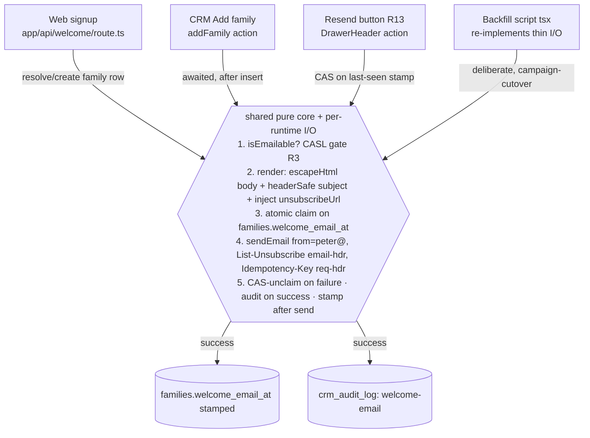
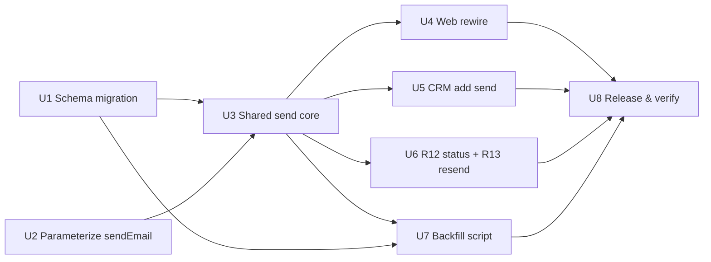

# feat: Week-1 Welcome Email — auto-trigger, CRM controls, and one-time backfill

## Overview

Wire the finished GTM "Welcome Email #1" so it sends automatically, once, whenever a family
becomes a **consented** lead — from the website signup **or** the CRM "Add family" flow — then
give staff a sent-status indicator and a manual resend on each contact, and run a one-time
backfill of the new welcome to all consented existing families. All three send paths converge
on **one shared, server-only send core** and **one idempotency stamp** (`families.welcome_email_at`),
send from `peter@the120.school` via the Resend transactional API, close a documented HTML-injection
hole, and honor CASL + 2024 bulk-sender rules.

This is a **Deep** plan: it reworks a shipped auth-email path (`app/api/welcome/route.ts`),
touches the CASL/consent legal boundary, performs a bulk PII send on a domain shared with
transactional mail, and adds CRM UI plus a schema migration.

## Problem Frame

Today a welcome fires only on website signup (`app/api/welcome/route.ts`), with older inline copy,
guarded on the auth user's `user_metadata.welcome_sent_at`, **with no consent check**, and with a
best-effort `families.welcome_email_at` stamp. The CRM "Add family" path never sends. No existing
family has the new copy, and there's no path to reach them. Staff can't see whether a welcome went
out or resend a failed one. (See origin: `docs/brainstorms/2026-07-20-week1-welcome-email-trigger-and-backfill-requirements.md`.)

Affected: every prospect family (consistent, on-brand, forwardable first touch), and CRM staff
(the add-contact path finally behaves like the site; sent-status + resend visible per contact).

## Requirements Trace

Carried from the origin requirements doc (R1–R13):

- **R1** Welcome fires automatically, once, within seconds on both web signup and CRM add, consent-gated.
- **R2** Single-send enforced by an atomic claim on `families.welcome_email_at`; **replaces** the web route's `user_metadata.welcome_sent_at` guard so CRM-then-web can't double-send.
- **R3** CASL send-gate before every send (`consent_given && !revoked && !merged && email && !expired`); web route gains a *new* server-side consent gate.
- **R4 / R4a** Merge safety (fallback greeting, skip invalid email) **and** mandatory `escapeHtml` of `{{parent_first}}` in the HTML part + CRLF-strip in the subject.
- **R5** Ship the finished GTM asset (subject *"Welcome to The 120 — here's your first step"*), replacing the old inline copy.
- **R6** Accurate CASL identification line for every recipient; inject the existing HMAC-signed unsubscribe into the asset (no double-footer via `sendNurtureEmail`).
- **R7** From `peter@the120.school`, reply-to `admissions@the120.school`, all paths.
- **R8** One-time backfill to **all consented families** (any stage, incl. already-welcomed), test/staff excluded, run-scoped idempotency.
- **R9** Internal/test/staff rows excluded — a new exclusion mechanism must be added (none exists today).
- **R10** Backfill throttled with an **auto-pause** circuit breaker on bounce/complaint spikes.
- **R11** Verify: dry-run (terminal-only) → test-to-self → full send; injection + test-row + CRM-then-web gates.
- **R12** Single-contact pipeline view shows Welcome-email status.
- **R13** Manual "Resend welcome" button (CAS-guarded) — also the recovery net for a failed/stranded send.

## Scope Boundaries

- **Transactional `/emails` path, not Resend Broadcasts** — keep `families`/HMAC-unsubscribe/`welcome_email_at` as the single source of truth (see Key Decisions + Alternatives).
- **`peter@the120.school`, not a marketing subdomain** (Peter, 2026-07-20) — safeguards do the protecting; subdomain is the documented upgrade path if this becomes recurring/large.
- **Nurture engine/cron untouched** — instant per-insert, not a nurture step.
- **No new nurture steps / follow-up emails** — Welcome Email #1 only.
- **Re-welcoming is intended** for the one-time backfill (supersedes "never-welcomed only"); ongoing auto-sends still fire once per genuinely-new contact.
- **No consent-capture UI redesign** — the Add-Family consent checkbox stays; only the sent/no-consent state is surfaced.
- **No change to the transactional offer email** or its identification-only footer.
- **"All families" excludes** non-consented, revoked, expired-implied, merged, no-email, and test/staff rows.

## Context & Research

### Relevant Code and Patterns

- **CAS claim-then-send template (mirror for R2 + R13):** `app/crm/lib/actions/reviews.ts` (`sendOfferEmail`), pure logic in `app/crm/lib/offer-rules.ts` (`offerEmailTemplate`, `headerSafe`, `interpretClaimMiss`, `unclaimOutcome`), UI in `app/crm/components/dossiers/OfferEmailButton.tsx`, migration `supabase/migrations/20260715090000_offer_email_stamp.sql`. Claim = `update … where stamp IS NULL | stamp = resendOf .select()`; unclaim = CAS-guarded on the stamp this call wrote; audit on success only; never throws.
- **Send helpers:** `app/lib/email.ts` `sendEmail` (hardcodes `From: hello@the120.school`, `AbortSignal.timeout(8000)`, `{ok,error?}`, never-throws — R7 needs a `from`/`replyTo`/`headers` param). `app/crm/lib/crm-email.ts` `sendCrmEmail` (staff identity + footer variants — *not* used by welcome). **Do not** use `app/lib/nurture/send.ts` `sendNurtureEmail` — it appends its own footer and would double-footer the asset (R6).
- **Unsubscribe machinery (reuse for R6):** `app/lib/nurture/token.ts` `unsubscribeUrl(familyId)`/`verifyUnsubscribeToken` (on `app/lib/hmacToken.ts`); `app/unsubscribe/route.ts` (GET renders confirm, POST revokes — scanner-safe).
- **CASL gate is NOT a single predicate:** `app/lib/nurture/rules.ts` (inline, checks `consent_expires_at`) and `app/crm/lib/library-rules.ts` `sendGate` (no `merged_into_id`/`consent_expires_at`). Extract a shared `isEmailable(family)` covering the full R3 set.
- **`escapeHtml`** in `app/crm/lib/library-rules.ts` (R4a body); `headerSafe` shape in `app/crm/lib/offer-rules.ts` (R4a subject).
- **Entry points:** `app/api/welcome/route.ts` (route handler; guard + no-consent-check + unescaped greeting + inline copy + best-effort stamp). `app/crm/lib/actions/families.ts` `addFamily` (`consent_source="manual"` when given; sends nothing).
- **CRM contact UI (R12/R13):** `app/crm/components/pipeline/ContactDrawer.tsx` (URL-driven `?family=`), header/actions in `app/crm/components/pipeline/DrawerHeader.tsx`, no-consent treatment in `DrawerAside.tsx` `ConsentCard`. `fetchFamilyDetail`/`composeFamily` in `app/crm/lib/queries.ts` select `welcome_email_at` but don't expose it on `FamilyDetail` yet.
- **Backfill precedent:** `scripts/backfill-families.ts` (`npm run backfill:families`, `tsx`; falls back to `.env.local`; repairs `welcome_email_at` from `user_metadata.welcome_sent_at`; select omits `consent_revoked_at`/`consent_expires_at`).
- **Asset:** `artifacts/gtm/welcome-email-1.html` + `.txt`, merge fields `{{parent_first}}` + `{{unsubscribe_url}}` only.

### Institutional Learnings (`docs/solutions/`)

- **`best-practices/resend-safe-atomic-claim-then-send-cas-guarded-claim-and-unclaim-2026-07-15.md`** — first send claims on NULL; resend = CAS on last-seen stamp; unclaim CAS-guarded on the stamp *this* call wrote (zero rows = "superseded", never restore); stamp is an **opaque string minted in JS** (`new Date().toISOString()`, never SQL `now()`, never re-parsed); validate with `z.iso.datetime({ offset: true })`.
- **`best-practices/atomic-claim-then-send-db-guarded-stamp-column-dedupes-best-effort-email-2026-07-14.md`** — server-owned stamp (client convention + a **coerce-not-raise** DB trigger); claim-then-send; never-throw send + hard timeout; fire-and-forget only after a confirmed save.
- **`security-issues/admissions-notification-email-html-injection-via-unescaped-child-parent-names-2026-07-14.md`** — names `app/api/welcome/route.ts` as a **still-open** instance; double-defense: `escapeHtml` HTML part **only**, newline-strip+truncate the subject.
- **`security-issues/state-changing-email-links-mutate-on-get-scanner-prefetch-false-confirm-2026-07-16.md`** — GET renders, POST mutates; `timingSafeEqual`; `app/unsubscribe/route.ts` is the exemplar.
- **`database-issues/blind-upsert-on-conflict-public-endpoint-...-2026-07-16.md`** + **`best-practices/bulk-import-crm-leads-families-...-2026-07-15.md`** — select-first via `ilike(lower(email))` then branch (never blind-upsert on the functional index); never insert a second family for an account-holder (the `on_parent_created` trigger links one); **stage is derived** (`deriveStage()` in `app/crm/lib/engine.ts`) — don't write it; `coalesce` consent timestamps; verify with `count(*)`.
- **`integration-issues/supabase-cli-stale-db-password-management-api-workaround-2026-07-13.md`** — apply DDL via the Management API (project ref `deolvqnyvhhnavsifgxz`, token from Windows Credential Manager `Supabase CLI:supabase`), record the version in `supabase_migrations.schema_migrations`, verify with `count(*)`; UTF-8 byte handling gotchas.
- **`workflow-issues/split-phase-migrations-...-2026-07-14.md`** — pre-deploy schema and post-deploy data must be **separate timestamped files**.
- **`best-practices/shared-db-taking-core-must-not-live-in-a-use-server-file-...-2026-07-17.md`** — the shared send core takes a `db` client and skips the staff gate → it must be an `import "server-only"` module, never `"use server"`.
- **`best-practices/webhook-idempotency-...-2026-07-17.md`** — pick key-before vs key-after ordering by whether the effect is idempotent and has a release step (claim-then-send writes the lock first).
- **User memory / cross-refs:** PowerShell BOM-pipe pitfall — set any Vercel env credential via REST/`--value`, and a changed env var only takes effect on the next production deploy.

### External References

- **Resend:** transactional API is *not* for blasts, but Broadcasts fork unsubscribe/audience truth → **keep `/emails`** (+ optional `/emails/batch`, 100 msgs/call, 50 recipients/msg). Rate limit **10 req/s team-wide** (shared with live mail); `Idempotency-Key` supported (24h). Resend does **not** auto-inject `List-Unsubscribe` on transactional — set `List-Unsubscribe` + `List-Unsubscribe-Post: List-Unsubscribe=One-Click` (RFC 8058) ourselves. *(Verify plan sending cap + current rate limit in the Resend dashboard before sizing.)*
- **Vercel/Next 16.2.10:** function `maxDuration` default **300s** (Pro max 800s GA / 1800s beta) → a throttled multi-hundred send **won't fit** → run the backfill as a **local/CI script**. Go-forward: `await` the ≤8s send (offer-email pattern); `after()`/`waitUntil` are bounded by `maxDuration`, so only worth it to shave latency.
- **CASL / 2024 bulk rules:** CEM needs sender identity (The 120), a valid **physical mailing address** (Toronto, valid ≥60 days), a contact method, and a working **one-click unsubscribe** honored fast; SPF/DKIM/DMARC aligned on the sending domain; complaint rate **<0.30%** (target <0.10%). Staff-checked consent is weaker evidence than a recipient's own opt-in — **Peter accepts this tradeoff** for `consent_source='manual'` records (see Key Decisions).

## Key Technical Decisions

- **Shared *pure* logic across all paths; thin I/O per runtime.** Render/escape/gate/CAS-interpret and unsubscribe-URL signing live in **plain modules** (no `"use server"`, no `import "server-only"`) so the **tsx backfill can import them too** — `import "server-only"` throws outside Next's bundler, which is exactly why `scripts/backfill-families.ts` rolls its own client. The Next paths (web route, `addFamily`, resend action) call a shared `sendWelcome` I/O wrapper; the backfill re-implements the same thin claim+send against its own `createClient`. Copy, footer, gate, and escaping never diverge because the *pure* layer is shared.
- **`families.welcome_email_at` is the single idempotency stamp.** Go-forward = atomic claim on `welcome_email_at IS NULL`, **replacing** the web route's `user_metadata.welcome_sent_at` guard. Backfill + resend are **deliberate** sends that bypass the NULL claim (CAS/run-scoped guarded). Stamp is an opaque JS-minted ISO string.
- **Transactional Resend `/emails` (single sends), not Broadcasts** — preserves the single source of truth and per-row control. `/emails/batch` is **dropped**: at 10 req/s single sends clear a small list in minutes, and batch can't carry the unique per-family `List-Unsubscribe` header each message needs.
- **`peter@the120.school` everywhere** (reply-to `admissions@`), with safeguards (throttle, engaged-first, auto-pause, monitoring) instead of a subdomain. Note: this is a **standing** choice — go-forward welcome mail rides `peter@` on the shared domain permanently, not just the one-time backfill, and `peter@` gives **zero domain-level isolation** (DKIM/DMARC/reputation are domain-scoped), so the safeguards are the *only* protection for Stripe/auth/offer mail. The marketing subdomain remains the upgrade path if the channel grows. Verify `peter@the120.school` is DKIM-authenticated in Resend before the first real send.
- **Add `from`/`replyTo`/`headers` params to `sendEmail`** (default to today's constant, preserve never-throw) rather than a new sender — "reuse over new abstraction," made explicit.
- **Inject the signed `unsubscribeUrl(familyId)` into the asset** and set the RFC 8058 `List-Unsubscribe`/`List-Unsubscribe-Post` headers pointing at the same `app/unsubscribe` route — no `sendNurtureEmail`, no second footer.
- **`Idempotency-Key`** (`welcome/<familyId>` go-forward; `welcome-backfill-<familyId>` backfill) is an **HTTP request header** on the Resend fetch — distinct from the `List-Unsubscribe`/`List-Unsubscribe-Post` **email** headers, which go in the `headers` body field. It is a 24h second-layer guard behind the DB claim for the 8s-timeout retry ambiguity; the **durable** dedupe is the `welcome_email_at` stamp + the fixed campaign cutover, not this 24h key.
- **Backfill = local Node script from a Vercel-scoped credential** pulled into the process env **for the run only** (never written to disk; rotate the service-role key after — it bypasses RLS across the whole DB). The dry-run PII preview prints to a **local TTY only**, never CI logs (CI runs, if any, emit aggregate non-PII counts). Select-first by consent, **ordered by consent strength then recency** (recipient opt-in first, staff-`manual` last), client-side throttle, **auto-pause** on complaint ≥0.10% (hard-stop <0.30%) / bounce ≥2%.
- **Backfill idempotency = a fixed campaign-cutover timestamp**, not a per-run cursor: send where `welcome_email_at` is null or `< cutover`, skip `>= cutover`. This is resumable across restarts (no per-run state to lose) **and** immune to post-cutover go-forward double-sends (a family welcomed with the new copy after the U4/U5 deploy is `>= cutover` → skipped). **Stamp after** a confirmed send — for a bulk welcome a rare duplicate beats a silent lost send; the `Idempotency-Key` covers the <24h retry window.
- **Backfill audience = all consented families, every funnel stage** (Peter, 2026-07-20), including deposited/enrolled families — accepted tradeoff: the copy's "reserve your seat · $250" CTA is stage-mismatched for members, a complaint risk mitigated by consent-strength ordering + the auto-pause.
- **Include `consent_source='manual'` records** in the backfill (Peter, 2026-07-20) — accepts the CASL burden-of-proof tradeoff; retain consent evidence (`consent_source` + `consent_at` already on `families`) as the record.
- **CRM-add send is backgrounded** (claim synchronously, send via `after()`/`waitUntil`) so the staff "Add family" modal never hangs up to 8s on Resend; the web route stays awaited (its dashboard caller is already fire-and-forget). R13 resend is the recovery net for either.
- **Migration is split-phase:** pre-deploy schema (new `is_test` flag, audit action, optional `welcome_email_at` coerce guard) as one file; test-row tagging + the bulk send are post-deploy operational steps. Apply DDL via the Management API; record the version; verify with `count(*)`.
- **Audit action `welcome-email`** added to the `crm_audit_log` CHECK allowlist **and** `AUDIT_ACTIONS` in `app/crm/lib/constants.ts` in lockstep (offer-email/referral-asked precedent) — queryable per family.

## Open Questions

### Resolved During Planning

- **Broadcasts vs transactional?** → Transactional `/emails` single sends; Broadcasts fork the source of truth; `/emails/batch` dropped (can't carry per-family List-Unsubscribe).
- **Go-forward send: await vs background?** → Web route **awaited** (its caller is already fire-and-forget); CRM-add **backgrounded** via `after()` so the staff modal doesn't hang; R13 resend is the recovery net.
- **Backfill home?** → **Local** Node script from a Vercel-scoped credential (maxDuration can't hold a throttled send; CI would leak the dry-run PII).
- **Backfill idempotency / post-cutover double-send?** → A fixed **campaign-cutover timestamp** (send where `welcome_email_at` null or `< cutover`; skip `>= cutover`); restart-safe, no per-run cursor, no send-log table.
- **Family-row resolution at web-send time?** → Resolve by **`parent_id`** (avoids the `lower(email)` unique index); create mirroring the trigger on absence; the atomic `welcome_email_at` claim is the sole dedupe.
- **Advanced-stage families in the backfill?** → **All stages** included (Peter) — accepted complaint-risk tradeoff, mitigated by consent-strength ordering + auto-pause.
- **Staff-checked (`manual`) consent in the backfill?** → Included (Peter accepts the CASL evidence tradeoff); ordered last.
- **Unsubscribe mechanism?** → Existing HMAC `unsubscribeUrl` injected into the asset + RFC 8058 headers to the same route, which gains a **one-click POST code change** (read the token from the query string).
- **Marketing subdomain vs `peter@`?** → `peter@the120.school` with safeguards (Peter); the subdomain remains the standing-channel upgrade path.

### Deferred to Implementation

- **Identification-line wording (R6)** — the exact CASL-accurate footer text for all recipient types (web signup, staff-added, backfilled), replacing the asset's "you started an account" line; drafted in U3, finalized/checked at the U8 CASL gate.
- **Physical mailing address** — Peter to provide a CASL-valid address for the footer (blocking the bulk send, not go-forward single sends).
- **Late consent (R1)** — if a CRM contact added *without* consent later consents (a consent update, or a booking-inquiry), should the welcome fire then? Today it fires only at entry (origin deferred item).
- **`welcome_email_at` coerce guard** — whether to add a `children_notified_guard`-style trigger; `families` RLS is already admin-only, so this stays out of committed scope unless a concrete tamper scenario surfaces.
- **Exact throttle rate** — pace against the *actual* Resend team rate limit + plan cap (verify in dashboard); the R10 numbers are starting points.
- **Test-row tagging source** — which emails/domains define `is_test=true` (Kuperman family + internal/staff addresses); confirm the allowlist before tagging.

## High-Level Technical Design

> *This illustrates the intended approach and is directional guidance for review, not implementation specification. The implementing agent should treat it as context, not code to reproduce.*

**Three entry paths → one server-only core → one stamp:**

**Auto vs deliberate claim:** auto go-forward claims `WHERE welcome_email_at IS NULL` (once per new
family). Backfill + resend deliberately bypass NULL — backfill guarded by a fixed **campaign-cutover
timestamp** (send where null or `< cutover`), resend by CAS on the stamp staff saw (offer-email pattern).

**Unit dependency graph:**

## Implementation Units

### Phase 1 — Schema & shared send core (pre-deploy)

- [ ] **Unit 1: Pre-deploy schema migration**

**Goal:** Add the state the feature needs, before the code that reads it ships.

**Requirements:** R9, R2 (guard), R12/R13 (audit)

**Dependencies:** None

**Files:**
- Create: `supabase/migrations/YYYYMMDDHHMMSS_welcome_email_support.sql`
- Modify: `app/crm/lib/constants.ts` (`AUDIT_ACTIONS` += `welcome-email`)

**Approach:**
- `alter table public.families add column if not exists is_test boolean not null default false` (NULL-safe, backward-compatible — mirrors `20260717150000`'s additive pattern).
- Extend `crm_audit_log_action_check` with `'welcome-email'` via the `drop constraint … add constraint … check (action in (…))` re-listing pattern. **Re-list the CURRENT allowlist verbatim from `AUDIT_ACTIONS` in `app/crm/lib/constants.ts` (the authoritative source)** — it includes `'referral-asked'` (added in `20260717130000`), which a copy from the older `20260715090000` would silently drop, breaking existing referral-ask audit inserts. Update `AUDIT_ACTIONS` in the **same PR** (lockstep).
- Apply via the Management API playbook; record the version in `supabase_migrations.schema_migrations`; verify column + constraint with a `count(*)`/introspection SELECT.
- (The optional `welcome_email_at` coerce guard is intentionally **not** in this unit's committed scope — see Deferred to Implementation; `families` RLS is already admin-only.)

**Patterns to follow:** `supabase/migrations/20260717150000_crm_calcom_booking.sql` (additive column), `supabase/migrations/20260715090000_offer_email_stamp.sql` (audit CHECK extension).

**Test scenarios:**
- Test expectation: none — pure DDL. Verify: `is_test` column exists defaulting false; a `crm_audit_log` insert with `action='welcome-email'` succeeds; the migration version is recorded.

**Verification:** Column present and defaulted; audit insert with the new action passes the CHECK; `AUDIT_ACTIONS` includes it.

- [ ] **Unit 2: Parameterize `sendEmail` (From / reply-to / headers)**

**Goal:** Let the shared core send from `peter@` and attach RFC 8058 headers + an idempotency key without a new sender.

**Requirements:** R7, R6

**Dependencies:** None

**Files:**
- Modify: `app/lib/email.ts`
- Test: `app/lib/__tests__/email.test.ts` (create)

**Approach:**
- Add optional `from`, `replyTo`, `emailHeaders` (→ the Resend `headers` **body** field, e.g. `List-Unsubscribe`/`List-Unsubscribe-Post`), and `idempotencyKey` (→ the **HTTP request header** `Idempotency-Key` on the fetch, **not** the email `headers` body) params; default `from`/`replyTo` to today's constants so existing callers are unchanged. These are two different Resend mechanisms — conflating them makes the idempotency key an inert email header and Resend's dedupe never engages. **Preserve the never-throw `{ok,error?}` + `AbortSignal.timeout(8000)` contract** — the claim/unclaim logic depends on a clean boolean verdict.

**Patterns to follow:** existing `sendEmail` shape; `app/crm/lib/crm-email.ts` for the params-object style.

**Test scenarios:**
- Happy path: default call still sends from `hello@the120.school` (back-compat).
- Happy path: `from`/`replyTo` override applies; `emailHeaders` land in the request-**body** `headers` object (List-Unsubscribe) while `idempotencyKey` lands as the fetch **`Idempotency-Key` request header** — asserted as two distinct locations.
- Error path: a rejected/timed-out fetch returns `{ok:false, error}` and never throws.

**Verification:** Existing callers unaffected; overrides + headers appear in the outbound request; never throws.

- [ ] **Unit 3: Shared welcome-send core + rules + CASL predicate**

**Goal:** The one place all paths send through.

**Requirements:** R1, R2, R3, R4a, R5, R6

**Dependencies:** U1, U2

**Files:**
- Create: `app/lib/welcome/welcome-rules.ts` (**plain module** — pure: `renderWelcome`, `isEmailable`, claim/unclaim interpreters; importable by Next *and* the tsx backfill)
- Create: `app/lib/welcome/template.ts` (asset HTML + text as the **single code-resident source**, relocated from `artifacts/gtm/welcome-email-1.*`; **add the physical mailing address** Peter provides to the footer)
- Create: `app/lib/welcome/send.ts` (**plain module — not `"use server"`, not `import "server-only"`**; `sendWelcome(db, family, { resendOf?, idempotencyKey })` I/O wrapper for the Next paths)
- Modify: `app/unsubscribe/route.ts` (accept the RFC 8058 one-click POST — see approach)
- Modify: `app/lib/nurture/token.ts` / `app/lib/hmacToken.ts` only if the signer isn't already importable outside a server bundle (the backfill needs it)
- Test: `app/lib/welcome/__tests__/welcome-rules.test.ts`

**Approach:**
- `renderWelcome(template, { parentFirst, unsubscribeUrl })` → `{subject, html, text}`: `escapeHtml(parentFirst)` in the **html only**, raw in text; `headerSafe` (CRLF-strip+truncate) the subject; fallback `"Hi there,"` when `parentFirst` blank; replace `{{unsubscribe_url}}` with the signed URL. The footer identification line is **drafted CASL-accurate for all recipient types** (web signup, staff-added, backfilled) — e.g. "You're receiving this because you're on The 120's admissions list" — and carries all CASL-required elements: The 120 sender identity, the **physical mailing address**, a contact method, and the one-click unsubscribe.
- `isEmailable(family)` — the extracted shared R3 predicate (`consent_given && !consent_revoked_at && !merged_into_id && email && (!consent_expires_at || now < consent_expires_at)`).
- `sendWelcome` (plain module, so the backfill can reuse the *pure* layer and re-implement this thin I/O against its own client) — resolve email + `unsubscribeUrl(familyId)` → atomic claim (`update families set welcome_email_at=<jsStamp> where id=? and (welcome_email_at is null | welcome_email_at = resendOf) .select("id")`) → `sendEmail` (from `peter@`, `emailHeaders`: List-Unsubscribe, `idempotencyKey`) → CAS-unclaim on failure → typed result. Never throws.
- **One-click unsubscribe (`app/unsubscribe/route.ts`):** the POST must read `f`/`t` from `url.searchParams` (falling back to the form body for the human confirm page) and revoke **without** a confirm step when the provider POSTs `List-Unsubscribe=One-Click`; keep the bare-GET confirm page for scanner safety. This is a **code change**, not just verification — today the POST reads `f`/`t` from the form body only, so a provider one-click POST fails `validParams` and never revokes.

**Execution note:** Implement the rules test-first — this is the correctness core (escaping, gate, CAS interpretation).

**Patterns to follow:** `app/crm/lib/offer-rules.ts` + `app/crm/lib/actions/reviews.ts` (`sendOfferEmail`) claim/unclaim/CAS; `docs/solutions/best-practices/resend-safe-atomic-claim-then-send-...`.

**Test scenarios:**
- Happy path: consented family → renders merged subject/body, claims null stamp, sends, returns sent.
- Edge: blank `parentFirst` → `"Hi there,"`; missing/invalid email → skipped, not sent.
- Error path (R4a): `parentFirst` = `"</strong><a href=x>"` renders as **literal text** in html; a name with `\r\n` is stripped from the subject.
- Edge: claim matches zero rows (already sent) → returns `already_sent`, no send.
- Error path: send fails → CAS-unclaim restores only if our stamp still holds; a superseding concurrent send is not clobbered.
- Gate: revoked / merged / expired-implied / no-email family → `isEmailable` false, no send.
- Resend: `resendOf` set → CAS claim on the last-seen stamp succeeds; stale `resendOf` → no-op.

**Verification:** All rules scenarios pass under `npm test`; core is `server-only`; no path double-sends.

### Phase 2 — Go-forward triggers

- [ ] **Unit 4: Rewire the web signup welcome**

**Goal:** Web signup sends the new copy through the shared core, consent-gated, single-guarded on `welcome_email_at`, injection-closed.

**Requirements:** R1, R2, R3, R4a, R5

**Dependencies:** U3

**Files:**
- Modify: `app/api/welcome/route.ts`
- Test: `app/api/__tests__/welcome-route.test.ts` (create; or rules-level coverage if the route can't be unit-tested — see conventions)

**Approach:**
- Replace the `user_metadata.welcome_sent_at` guard with a call to `sendWelcome` (the `welcome_email_at` atomic claim is the guard). Add the R3 consent gate (`isEmailable`). **Resolve the `families` row by `parent_id`** — the `parents_families_sync` trigger runs AFTER INSERT (synchronous but best-effort: it swallows errors, so the row *usually* exists), and resolving by `parent_id` avoids the `families_email_live_unique_idx` on `lower(email)` that an email-keyed create would collide with. If the row is absent, create it mirroring the trigger's conflict handling (never a duplicate live row); on a unique violation, re-select and proceed. Because R2 removes the metadata guard (which made client double-fires harmless), confirm the `welcome_email_at` atomic claim is the **sole** dedupe and is safe under two concurrent row-absent `/api/welcome` calls before removing it. Remove the inline copy (now in `template.ts`). Read `next/dist/docs/` before changing the route handler (AGENTS.md).

**Patterns to follow:** the route's existing bearer/anon auth; `sendWelcome` contract.

**Test scenarios:**
- Happy path: consented signup → exactly one email, `welcome_email_at` stamped, greeting escaped.
- Edge: second dashboard sign-in of an already-welcomed user → no second email (claim no-ops).
- Error path: no consent → account created, **no email** (new R3 behavior).
- Integration: family row absent at send time → resolved/created (by `parent_id`, no duplicate), unsubscribe URL valid.
- Edge: two concurrent row-absent `/api/welcome` calls for the same parent → exactly one email, one live family row, no unique-index error surfaced.

**Verification:** One email per consented signup; none without consent; injection payload renders literal; no duplicate family rows.

- [ ] **Unit 5: CRM Add-family go-forward send**

**Goal:** `addFamily` sends the welcome (consent-gated) after insert.

**Requirements:** R1, R2, R3, R12 (stamp feeds status)

**Dependencies:** U3

**Files:**
- Modify: `app/crm/lib/actions/families.ts` (`addFamily`)
- Test: `app/crm/__tests__/actions-families.test.ts` (extend rules-level coverage as feasible)

**Approach:**
- After the successful insert (with `familyId`), **claim `welcome_email_at` synchronously** (dedupe set before the response), then run the send **in the background via `after()`/`waitUntil`** so the staff "Add family" modal never hangs up to ~8s on Resend availability. Consent-gated → an unconsented add creates the contact and sends nothing (surface state in U6). Audit `welcome-email` on success and CAS-unclaim on failure, both inside `after()`; R13 resend is the recovery net for a backgrounded failure. Keep the action never-throwing to the client. (The web route U4 stays awaited — its dashboard caller is already fire-and-forget, so nothing blocks on it.)

**Patterns to follow:** `sendOfferEmail` awaited send + audit-on-success; existing `addFamily` canon.

**Test scenarios:**
- Happy path: add with consent → contact created + one welcome + `welcome_email_at` stamped + audit row.
- Edge: add without consent → contact created, no send, no stamp.
- Integration (R2): add-with-consent (welcomed) then the same email signs up on web → **one email total** (shared stamp).
- Error path: send fails → contact still created; stamp CAS-unclaimed in the background; staff can resend (U6).
- Edge: Resend slow/unavailable → the Add-family modal returns promptly (send is backgrounded); the welcome arrives when the background task completes, or is recoverable via R13.

**Verification:** Consented adds welcome exactly once; unconsented adds don't; the modal never hangs on Resend; CRM-then-web never doubles.

### Phase 3 — CRM contact controls

- [ ] **Unit 6: Sent-status (R12) + Resend button (R13)**

**Goal:** Staff see whether the welcome went out and can resend a failed one.

**Requirements:** R12, R13

**Dependencies:** U3 (resend core), U5

**Files:**
- Modify: `app/crm/lib/queries.ts` (expose `welcomeEmailAt` on `composeFamily`/`FamilyDetail`)
- Modify: `app/crm/components/pipeline/DrawerHeader.tsx` (status chip + "Resend welcome" control)
- Modify: `app/crm/components/pipeline/ContactDrawer.tsx` (thread the field/overlay if needed)
- Create: `app/crm/lib/actions/welcome.ts` (`"use server"` resend action: `requireStaff` → `sendWelcome(db, family, { resendOf })`)
- Test: `app/crm/__tests__/welcome-resend.test.ts` (rules-level: state + CAS token derivation)

**Approach:**
- **R12 chip — explicit state table** (not just three states): "Welcome sent · [date]" when stamped; when unstamped, differentiate every `isEmailable` failure the way `ConsentCard` already does (revoked = red, no-CASL = amber) — never-consented, revoked, expired-implied, merged, and **no email on file** (fixable by adding an email — distinct from a compliance block) vs "not sent yet" (emailable, will auto-send). Also cover **sent-then-unemailable**: a past "Welcome sent · [date]" on a family now revoked/expired keeps the sent badge and shows the current unemailable reason separately.
- **R13 resend — explicit gate-closed disabled state.** Mirror `OfferEmailButton`'s `OfferButtonState`: when the resend action's `isEmailable` re-check would fail (consent revoked/expired since last send, no email), render a **disabled, focusable** button with an `aria-describedby` reason — not an enabled button that errors on click. Otherwise: optimistic overlay **owned by the parent** (not local `useState(item.*)`), CAS token + is-resend derived from the **same merged** `welcomeEmailAt`, `try/finally` around the send, confirm dialog previews the exact (escaped) text; the resend bypasses the NULL claim via CAS, re-stamps, audits.
- **Chip vs button IA:** the chip (R12) is the **sole** status source; the R13 button is a plain action labeled "Send welcome" pre-send / "Resend welcome" post-send (it does not duplicate the date). This deliberately diverges from `OfferEmailButton`, where the button itself carries status — state the divergence so the implementer doesn't merge them.

**Patterns to follow:** `app/crm/components/dossiers/OfferEmailButton.tsx` (overlay/CAS/try-finally/confirm-preview); `DrawerHeader.tsx` `run()`/`busy` for simple actions; `docs/solutions/*no-try-finally-freezes-modal*`.

**Test scenarios:**
- Happy path: sent family → chip shows date; unsent-emailable → "not sent yet".
- Edge: chip renders distinct states for never-consented / revoked / expired / no-email / merged; sent-then-revoked keeps the sent badge and shows the unemailable reason.
- Edge: resend clicked on a family that failed `isEmailable` since the last send → button is disabled with a visible `aria-describedby` reason (no error-toast-after-click).
- Happy path: resend on a failed send → one email, stamp advances.
- Edge: two concurrent resends → CAS lets only one fire; the other reports already-sent (no double).
- Edge: resend token derived from stale props during `router.refresh()` → still resends correctly (merged value, not props-only).
- Error path: resend send throws → `sending` resets via `finally`; error toast; stamp not left advanced.

**Verification:** Status accurate in all three states; resend recovers a failed send; never double-sends.

### Phase 4 — Backfill & release (post-deploy)

- [ ] **Unit 7: Test-row tagging + one-time backfill script**

**Goal:** Send the new welcome once to all consented families, safely.

**Requirements:** R8, R9, R10, R11 (dry-run/test-send), R7

**Dependencies:** U1 (`is_test`), U3 (core)

**Files:**
- Create: `scripts/backfill-welcome-email.ts` (`tsx`; new `npm run` script) — thin runner: own `createClient`, imports the **pure** `welcome-rules.ts` + `backfill-rules.ts` + signer, re-implements the claim+send I/O (it can't import the Next server wrapper)
- Create: `app/lib/welcome/backfill-rules.ts` (**pure** selection / consent-strength ordering / throttle / auto-pause logic)
- Modify: `package.json` (add the `npm run` script)
- Test: `app/lib/welcome/__tests__/backfill-rules.test.ts` (**under `app/lib/**` so `vitest.config.ts`'s include allowlist actually collects it** — a `scripts/**` test path is silently skipped)

**Approach:**
- **Tagging (data, pre-send):** set `is_test=true` on the Kuperman family + internal/staff addresses via a one-off `UPDATE` by a confirmed email/domain allowlist; verify with `count(*)`.
- **Credential:** pull `SUPABASE_SERVICE_ROLE_KEY` + the Resend key from a **Vercel-scoped credential into the process env for the run only** — never written to a local file (a `vercel env pull` that writes `.env*.local` defeats this; inject directly). The service-role key bypasses RLS across the **whole** DB, so **rotate it after** the one-time run.
- **Select-first** all families where `isEmailable` **and** `is_test=false` (**any funnel stage** per Peter, incl. deposited/members), including `consent_source='manual'`; extend the select to carry `consent_revoked_at`, `consent_expires_at`, address, `parent_first`, `welcome_email_at`. **Campaign-cutover filter:** additionally require `welcome_email_at IS NULL OR welcome_email_at < <cutover>` (the U4/U5 deploy timestamp) — so families already welcomed with the **new** copy via go-forward are skipped, and the run is resumable across restarts with no per-run state. **Order by consent strength then recency:** recipient opt-in (web-signup/booking) first, staff-`manual` last, so the strongest cohort proves the send clean before the weakest, highest-complaint cohort is reached.
- **Dry-run:** print exact recipient count + a rendered preview to a **local TTY only** (TTY-detect / `--local-only`); never a file, CI log, or third-party. A non-local run emits aggregate non-PII counts only.
- **Throttle + auto-pause (R10):** deliberate steady pacing (no bursts) well under the 10 req/s budget *shared with live transactional mail*; **auto-pause** when complaint rate warns ≥0.10% / hard-stops <0.30% or hard-bounce ≥2%, evaluated per batch; honor `retry-after` on 429.
- **Idempotency / crash safety:** the campaign-cutover predicate is the durable, restart-safe skip; the per-family `Idempotency-Key` `welcome-backfill-<familyId>` covers the <24h retry window. **Stamp `welcome_email_at` AFTER a confirmed send** — for a bulk welcome a rare duplicate is preferable to a silent lost send (the accepted failure mode). No separate send-log table: `welcome_email_at` + `consent_source`/`consent_at` on `families` are the CASL record.
- Each send reuses the **pure** render/gate/escape/sign layer; the script owns its own claim+send I/O.

**Execution note:** Execution target — **local run**, not a Vercel function (maxDuration can't hold a throttled send); if ever run in CI, no PII preview.

**Patterns to follow:** `scripts/backfill-families.ts` (pagination, own service-role client, `main().catch(exit 1)`); `docs/solutions/best-practices/bulk-import-crm-leads-...` (select-first, `count(*)` verify).

**Test scenarios:**
- Happy path: selection returns only `isEmailable && !is_test`, ordered consent-strength-then-recency, honoring the campaign-cutover filter.
- Edge: revoked / expired-implied / merged / no-email / `is_test` / `welcome_email_at >= cutover` families excluded.
- Edge: `consent_source='manual'` included but ordered last.
- Error path (R10): a batch crossing the complaint/bounce threshold → auto-pause, no further sends.
- Edge (R8): restart after an auto-pause (fresh process) → the campaign-cutover predicate skips everyone already stamped `>= cutover`; no re-send of the reached cohort.
- Edge: crash between send and stamp → at most a rare duplicate within 24h (idempotency-key no-op), never a silent miss.
- Happy path: dry-run prints count + preview to a local TTY, sends nothing; non-local mode prints counts only.

**Verification:** Dry-run count matches the gate with no PII leak; test-send lands; a threshold breach halts the run; a restart re-sends nobody already stamped `>= cutover`.

- [ ] **Unit 8: Release, verification & rollout (R11)**

**Goal:** Prove the whole flow before the real backfill; ship in the right order.

**Requirements:** R11 (all), R7 (auth), R6 (one-click)

**Dependencies:** U4, U5, U6, U7

**Files:**
- Modify: `docs/plans/2026-07-20-001-feat-week1-welcome-email-plan.md` (check off units)
- (Operational — no product code)

**Approach — ordered gates:**
1. **CASL compliance gate:** confirm the asset footer carries The 120's identity, the **physical mailing address** (Peter-provided), a contact method, and the working one-click unsubscribe — the asset is not "done" until it passes the plan's own CASL bar. Confirm `peter@the120.school` is DKIM-authenticated in Resend; verify plan cap + rate limit in the dashboard.
2. Deploy Phase 1–3 code (schema already applied pre-deploy). **Record the campaign-cutover timestamp (this deploy)** for the backfill filter.
3. Prove go-forward: web-signup+consent → 1 email; CRM add+consent → 1 email; CRM add no-consent → 0; **CRM-add-then-web-signup same email → 1 total**; two concurrent row-absent signups → 1 email + 1 family row; crafted `first_name` renders literal (R4a).
4. Verify the one-click `List-Unsubscribe=One-Click` POST (query-string token) revokes against `app/unsubscribe` without a human-confirm step — the U3 route change; the in-body GET link still shows the confirm page.
5. Backfill dry-run (**local TTY** count + preview) → confirm the `is_test` + cutover exclusions against the list; if the count is far larger than expected, reconsider the subdomain before sending.
6. Test-send to Peter's inbox (render across Gmail/Apple Mail/Outlook; links + one-click unsubscribe work).
7. Full send in one go with auto-pause armed **and the `consent_revoked_at`-spike monitor on**; watch bounce/complaint between batches.
8. **Post-send outcome read:** measure the outcome metric (see Success Metrics) against a baseline so "did it work" is answerable, not just "did it send."

**Test scenarios:**
- Test expectation: none — this is release verification, exercised via the gates above and the units' own tests.

**Verification:** Every gate passes in order; the CASL footer is compliant before send; the full send completes (or auto-pauses on signal); post-send `count(*)` of stamped families matches the intended set; the outcome metric is read against baseline.

## System-Wide Impact

- **Interaction graph:** `on_parent_created` / `parents_families_sync` trigger (family-row race), the dashboard fire-and-forget caller of `/api/welcome`, `addFamily`, the CRM `ContactDrawer`, and the nurture timeline (`buildTimeline` already renders a "Welcome email sent" entry from `welcome_email_at`).
- **Error propagation:** `sendWelcome` never throws; callers get a typed result; failures leave no stamp (unclaimed) and are recoverable via R13.
- **State lifecycle risks:** stranded stamp (mitigated by a synchronous claim + CAS-unclaim + R13 + Idempotency-Key, whether the send is awaited (web) or backgrounded (CRM add)); family-row resolution by `parent_id`; backfill campaign-cutover vs go-forward NULL claim (kept distinct).
- **API surface parity:** all four send paths funnel through `sendWelcome` — no divergent copy/footer/gate.
- **Integration coverage:** CRM-then-web single-send; family-row-created-async; one-click POST revocation — none provable by mocks alone; cover in U4/U5/U8.
- **Unchanged invariants:** the offer email, nurture sequences/cron, Stripe/auth mail, and the consent-capture UI are untouched; `welcome_email_at` remains a funnel snapshot that survives account deletion.

## Alternative Approaches Considered

- **Resend Broadcasts + Audiences for the backfill** — rejected: forks unsubscribe/audience truth away from `families`/HMAC/`welcome_email_at`, removes per-row R8–R11 control. (Managed one-click headers are the one real pull; we replicate them on the transactional path.)
- **Dedicated marketing subdomain** — deferred (Peter chose `peter@` for a small one-time send); documented as the upgrade path if this becomes recurring or the list is large. A fresh subdomain also needs warm-up.
- **Backfill as a Vercel function / cron** — rejected: a throttled multi-hundred send exceeds `maxDuration`; a local/CI script is simpler for a one-off and keeps the dry-run PII local. (Cron-chunking or Vercel Workflows noted if it must run on-platform.)
- **Awaited vs backgrounded go-forward send** — split by path: the web route stays **awaited** (its caller is already fire-and-forget); the CRM-add send is **backgrounded** via `after()` so the staff modal doesn't hang up to 8s on Resend. Fully-awaited-everywhere was rejected for that modal-hang cost; R13 resend covers a backgrounded failure.
- **`/emails/batch`** — rejected: it can't carry a unique per-family `List-Unsubscribe` header, and at 10 req/s single sends clear a small list in minutes.

## Success Metrics

Delivery mechanics (once per consented family, no double-sends, injection-safe, auto-pause intact) are necessary but not sufficient — they measure that the email *sent*, not that it *worked*. Read at least one outcome signal after the backfill, against a pre-send baseline:

- **Engagement/health:** one-click unsubscribe rate and spam-complaint rate stay under the R10 thresholds (a low complaint rate is itself a signal the send landed as *welcome*, not spam).
- **Funnel movement (primary):** among welcomed families, a downstream signal the funnel already emits — **dossier-start or call-booking rate** — moves relative to baseline (carried from the origin doc's outcome criterion). This is what makes the send a GTM win, not just a clean blast.

If neither can be instrumented cheaply before the send, record that explicitly rather than shipping a one-shot with no feedback loop.

## Risk Analysis & Mitigation

| Risk | Likelihood | Impact | Mitigation |
|------|-----------|--------|------------|
| Bulk send hurts shared-domain reputation (Stripe/auth/offer mail) | Med | High | Throttle + engaged-first + auto-pause (<0.30% complaint / ≥2% bounce); verify `peter@` DKIM + rate limit; subdomain as documented upgrade |
| CRM-then-web double-send | Med | Med | Single `welcome_email_at` atomic claim replacing the metadata guard; U5/U8 regression test |
| Stranded stamp (send after claim fails silently) | Low | Med | Await + CAS-unclaim + `Idempotency-Key` + R13 manual resend backstop |
| HTML/CRLF injection reships (known-open in this file) | Med | High | `escapeHtml` (body) + `headerSafe` (subject) in the core; R11 literal-render gate |
| Family row absent at web-send time | Med | Med | Resolve-or-create in the claim step (Deferred → resolved in U4) |
| Backfill re-runs double-send | Low | Med | Run-scoped cursor + `Idempotency-Key`; deliberate-vs-auto claim kept distinct |
| Real send fires to test/staff rows | Low | High | `is_test` flag added + tagged + confirmed against dry-run before any batch |
| CASL challenge on `manual` consent | Low | Med | Accepted by Peter; retain consent evidence + send log; identification + one-click unsubscribe present |
| Migration applied out of order | Low | High | Split-phase files; schema pre-deploy via Management API + version recorded + `count(*)` verify |
| Vercel env credential corrupted / stale | Low | Med | Set via REST/`--value` (no PS BOM pipe); redeploy after env change |
| Stage-mismatched copy → member complaints (all-stages send) | Med | Med | Accepted (Peter); consent-strength ordering sends the strong cohort first, auto-pause halts on a complaint spike |
| One-click unsubscribe token leaked/forwarded → forced revocation | Low | Med | Accepted (a non-expiring token is required for one-click); monitor a `consent_revoked_at` spike during/after the backfill window |
| R13 resend during the backfill window double-sends | Low | Low | Different guards/keys don't cross-dedupe; discourage manual resends while the backfill runs; `welcome_email_at` + 24h idempotency-key bound the blast |
| Service-role key over-exposed (whole-DB RLS bypass) | Low | High | Pull into the process env for the run only (never to disk); rotate immediately after the one-time backfill |
| Dry-run PII leaks into CI logs | Low | Med | PII preview is local-TTY-only; CI mode prints aggregate counts only |

## Phased Delivery

- **Phase 1 (pre-deploy):** U1 schema (applied via Management API), U2 `sendEmail` params, U3 shared core + rules.
- **Phase 2:** U4 web rewire, U5 CRM add send — go-forward live.
- **Phase 3:** U6 sent-status + resend.
- **Phase 4 (post-deploy):** U7 tagging + backfill script, U8 gated release (dry-run → test-to-self → full send).

## Documentation / Operational Notes

- Add a `docs/solutions/` note if the one-click POST reconciliation or the shared-core boundary surfaces a reusable lesson.
- Rollout: confirm Resend DKIM for `peter@the120.school`, plan sending cap, current rate limit, and the **CASL footer (physical mailing address present)** before the U8 gates.
- Monitoring: watch Resend bounce/complaint dashboards live during the backfill (auto-pause is the automated backstop), **plus a `consent_revoked_at`-spike alert** to catch a scanner/leaked-token mass one-click revocation.
- Security: pull the backfill's service-role credential into the process env for the run only (never to disk), and **rotate it after** the one-time run.

## Sources & References

- **Origin document:** [docs/brainstorms/2026-07-20-week1-welcome-email-trigger-and-backfill-requirements.md](docs/brainstorms/2026-07-20-week1-welcome-email-trigger-and-backfill-requirements.md)
- Related code: `app/crm/lib/actions/reviews.ts`, `app/crm/lib/offer-rules.ts`, `app/api/welcome/route.ts`, `app/crm/lib/actions/families.ts`, `app/lib/email.ts`, `app/lib/nurture/token.ts`, `app/unsubscribe/route.ts`, `app/crm/components/pipeline/DrawerHeader.tsx`, `scripts/backfill-families.ts`
- Institutional learnings: `docs/solutions/best-practices/resend-safe-atomic-claim-then-send-cas-guarded-claim-and-unclaim-2026-07-15.md`, `docs/solutions/security-issues/admissions-notification-email-html-injection-via-unescaped-child-parent-names-2026-07-14.md`, `docs/solutions/workflow-issues/split-phase-migrations-pre-deploy-schema-post-deploy-purge-separate-files-rerun-2026-07-14.md`, `docs/solutions/best-practices/shared-db-taking-core-must-not-live-in-a-use-server-file-server-action-boundary-2026-07-17.md`, `docs/solutions/integration-issues/supabase-cli-stale-db-password-management-api-workaround-2026-07-13.md`
- External: Resend (batch, rate limit, idempotency, transactional unsubscribe, Broadcasts), Vercel (function max duration, `waitUntil`), Next.js `after()`, RFC 8058, CRTC/ISED CASL guidance, Google/Yahoo 2024 bulk-sender rules
