# feat: The Path T1 — the core loop at `/path`

**Plan 1 of 3.** T1 → [T2](2026-07-21-002-feat-the-path-t2-the-year-plan.md) → [T3](2026-07-21-003-feat-the-path-t3-completeness-plan.md).

## Overview

Build the core loop of The Path, an authenticated multi-role application at `/path`. A student captures evidence of real-world curriculum work, submits it, a parent verifies it against a published *Done when* line, and the student is told. Everything else in the product amplifies that loop.

T1 is the boundary at which **a family can work criterion 1.1 end to end in the app** — five tasks captured, submitted, verified, celebrated at Tier 1, with the criterion entering review. Nothing is faked.

**One honest narrowing against the origin document.** The origin's success criterion for 1.1 ends with "the crest awarded, the Criterion Recap generated". The crest reveal is T2 Unit 5 and the Recap is T2 Unit 8. T1 therefore satisfies a **reduced form** of that criterion — the loop runs and the criterion enters review, but the ceremony that closes it lands in T2. This is a deliberate scope decision, recorded here rather than discovered when someone asks whether T1 is done.

Three capabilities here have **zero precedent in this repo**: student identity, media storage, and offline-capable capture. They carry the most risk and drove the most research.

## Problem Frame

The curriculum exists as prose (`artifacts/The Path/the-path-home-study-curriculum-brief.md`) and as a marketing section (`app/2026-27/sections/ThePath.tsx`). A family running it has nowhere to file evidence, no verification trail, and no way to see where their child is. See origin: `docs/brainstorms/2026-07-21-the-path-app-requirements.md`.

Per **D22** this build deliberately does not target the 19 Sept 2026 cohort start; families run Phase 01 on paper this autumn and a paper-to-app migration is a separate deliverable.

## Requirements Trace

- **R1–R6, R29, R31, R32** — parent-provisioned student accounts, independent simultaneous sessions, evidence visibility, the no-self-verification guarantee, rate limiting, linkage to `public.children`, parent-driven reset.
- **R7–R9, R12, R27, R30** — app at `/path`, per-role notification transport, in-app surface, three-timestamp instrumentation. **R8 in full: the phone and desktop app shells are separately authored layouts, not one responsive tree** — the prototype uses a single container query and switches between hand-built phone (390×812) and desktop (236px sidebar + sticky top bar) scenes. Shipping both is close to double the student and parent UI surface and is budgeted as such in Units 12 and 13. **T1 ships the desktop shell as the verified target (R9); the phone layout follows in the same units and is not held to the same polish bar.**
- **R13–R15, R17, R28** — all evidence types including log tables, native video, append-only on verify, offline capture, private storage with signed URLs.
- **R18–R20** — both skins on placeholder art.
- **R22–R24** — versioned content package with a per-`ProgramVersion` manifest, both copy registers, criteria reconciled with `app/2026-27/data.ts`.

Inherited behaviour in T1: task state machine and concurrency (brief §9.1, §9.2, §9.5), Criterion Review (§9.3), data model (§10), Tier 1 celebration and the Not Yet moment (§5), roles (§14), privacy non-negotiables (§11).

Decisions carried in: **D15–D26** (origin document).

## Scope Boundaries

- No phase review or countersign — T2.
- No celebrations above Tier 1, no AI layer, no wisdom, no export, no PWA install or web push, no skin *toggle* (both skins render; switching is T2).
- No Guide surfaces, Field Guides, or math gate — T3. The engine exposes a `gateStatus` hook so the gate is additive.
- No native mobile app, no app-store work, no iOS-PWA-specific engineering beyond what offline durability requires (R11).
- **No `cacheComponents`.** It is off in `next.config.ts` and enabling it is an app-wide switch.
- Standing non-goals: no payments, no leaderboards, no social layer, no AI that verifies or gates.

## Context & Research

### Relevant code and patterns

| Purpose | Reference |
|---|---|
| Guard to mirror — pure verdict module + thin wrapper | `app/crm/lib/access.ts` (`resolveStaffAccess`), `app/crm/lib/auth.ts` (`requireStaff`) |
| The R6 clamp, already written | `app/crm/lib/reviews-rules.ts` (`effectiveReviewStatus`) |
| Atomic transition RPC with audit write | `public.move_candidate()` in `supabase/migrations/20260713110000_crm_core.sql` |
| CAS claim-then-send and CAS-guarded unclaim | `app/lib/welcome/send.ts`, `app/lib/welcome/welcome-rules.ts` |
| Dedupe-key-after-effect (the offline-sync model) | `app/lib/calcom/events.ts` + `public.processed_webhook_events` |
| Server action canon: gate → zod → service-role → audit → revalidate → `{success,error?}` | `app/crm/lib/actions/welcome.ts`, `app/crm/lib/actions/families.ts` |
| Never-throw email wrapper, 8s abort | `app/lib/email.ts` |
| Cron auth shape | `app/api/cron/nurture/route.ts` |
| Proxy gate (matcher is currently the single string `"/crm/:path*"`) | `proxy.ts` |
| Content to reconcile against | `app/2026-27/data.ts`, `app/2026-27/path-criteria.ts` |
| Design prototype (Vite + Tailwind v3 — port, do not copy) | `artifacts/The Path/v1 Path Design/src/components/**` |
| Visual contract, verbatim copy, tokens | `artifacts/The Path/The Path design handoff/design_handoff_the_path_app/` |
| Next 16 PWA guide (bundled locally) | `node_modules/next/dist/docs/01-app/02-guides/progressive-web-apps.md` |

### Institutional learnings that change this plan

- **`supabase db push` is permanently dead here** — no DB password exists. All DDL goes through the Supabase Management API with the CLI token from Windows Credential Manager: `docs/solutions/integration-issues/supabase-cli-stale-db-password-management-api-workaround-2026-07-13.md`. Decode with `Marshal.Copy` → `Encoding.UTF8.GetString` (never `PtrToStringUni`); send UTF-8 **bytes** with `charset=utf-8`; type the param `[string]`; record the version in `supabase_migrations.schema_migrations` **only after** the DDL succeeds.
- **A committed migration is not an applied migration.** `docs/solutions/integration-issues/dormant-migration-not-applied-prerequisite-table-missing-2026-07-17.md`. `select to_regclass('public.x')` before applying dependents; make every migration idempotent.
- **One migration file per rollout phase.** `docs/solutions/workflow-issues/split-phase-migrations-...-2026-07-14.md`. Postgres aborts the whole file on one error; there is no "apply half a file".
- **`"use server"` vs `import "server-only"` are different boundaries.** Every export of a `"use server"` file is a client-callable Server Action; `server-only` throws under `tsx`. `docs/solutions/best-practices/shared-db-taking-core-must-not-live-in-a-use-server-file-...-2026-07-17.md`, `.../server-only-import-breaks-tsx-scripts-plain-core-re-export-2026-07-21.md`. **This decides Unit 3's shape and is the cheapest decision now, the most expensive later.**
- **`vitest.config.ts` `include` is an explicit allowlist** — a new test directory silently never runs while `npm run test` stays green. `docs/solutions/test-failures/vitest-include-allowlist-new-test-dirs-silently-never-run-2026-07-18.md`.
- **No jsdom, no `@testing-library/react`, no component tests, no CI.** 44 test files, all `.test.ts`, `environment: "node"`. Only pure logic is defensible.
- **Full-row upserts poison guard triggers.** `docs/solutions/database-issues/upsert-insert-arm-poisons-excluded-status-guard-coercion-submit-fails-2026-07-14.md` and `.../stale-status-echo-...-2026-07-14.md`. A `BEFORE INSERT` trigger's coercion propagates into `EXCLUDED`. Guards coerce, never raise — so `{error: null}` does not mean the row is what you asked for. Echo interpretation is **three-way**: matches → success; behind intent → retryable; **ahead of intent → adopt the DB value**.
- **Seed prose drifts.** `docs/solutions/database-issues/silent-zero-row-update-em-dash-hyphen-title-drift-crm-library-2026-07-14.md` — em-dashes flattened on application; a later UPDATE keyed on that text matched 0 rows silently. See Decision 7.
- **Env-less `next build` must pass.** `docs/solutions/build-issues/env-less-build-hangs-render-time-supabase-clients-...-2026-07-17.md`. Never construct a Supabase client in a render path (including `useState`/`useRef` initializers); never interpolate a possibly-undefined env var into a fetch URL — the patched fetch hangs 60s per page rather than throwing.
- **Client-side awaited server actions need `try/catch/finally`.** `docs/solutions/ui-bugs/server-action-rejection-no-try-finally-freezes-capture-modal-2026-07-20.md`. The guard can `redirect()` (throws) before the action's own try.
- **Escape user-supplied values in email HTML**, `html` part only. `docs/solutions/security-issues/admissions-notification-email-html-injection-...-2026-07-14.md`.
- **Never mutate on GET from an email link** — scanners prefetch. `docs/solutions/security-issues/state-changing-email-links-mutate-on-get-...-2026-07-16.md`.
- **`on_parent_created` auto-creates a `families` row on every `parents` insert.** `docs/solutions/best-practices/bulk-import-crm-leads-families-derived-stage-parent-id-consent-2026-07-15.md`.

### Next.js 16 constraints (from `node_modules/next/dist/docs/`, per AGENTS.md)

- **`proxy.ts` is the renamed middleware.** Runtime is `nodejs` and **cannot be configured** — setting `runtime` throws. `config.matcher` must be statically analyzable.
- **Server Action body limit is 1 MB.** Separately `experimental.proxyClientMaxBodySize` defaults to 10 MB and **silently truncates** an oversized buffered body with only a warning. And **Vercel Functions cap request and response bodies at 4.5 MB** (`413 FUNCTION_PAYLOAD_TOO_LARGE`). Three independent reasons bytes must not traverse our origin — Decision 4.
- **Server Actions dispatch sequentially per client**; `Promise.all` over actions does not parallelize.
- **A proxy matcher that excludes a path also skips Server Function calls on that path.** Next's own docs: verify auth inside every Server Function.
- **Sync `cookies()`/`headers()`/`params`/`searchParams` are fully removed** — all must be awaited.
- **`revalidateTag(tag)` single-arg is a TypeScript error.** Use `revalidatePath` or `refresh()` for read-your-writes.
- **Multiple root layouts require deleting `app/layout.tsx`** and force a **full page reload** on cross-root navigation — see Decision 3.
- **Parallel routes now require an explicit `default.tsx`** or the build fails.
- **Once streaming starts the status code is committed** — do auth checks before any `await`, or reject in the proxy.
- **Layouts do not re-render on navigation** — never put the auth check only in a layout.

### Supabase constraints

- **`@supabase/ssr` 0.12.0 → 0.12.3 available**; cookie-correctness fixes. The `setAll` callback gained a `headers` argument in 0.10 — **this repo omits it**, and `proxy.ts` returns `redirect`/`rewrite` **without copying refreshed auth cookies**. Both desync sessions. Unit 1.
- **TUS resumable above 6 MB**, `chunkSize` exactly `6 * 1024 * 1024` (docs say do not change it), against `https://{ref}.storage.supabase.co/storage/v1/upload/resumable` — the direct storage hostname, not the project URL. **The upload URL is valid 24 hours**; persist it *and* its creation time, and treat >24h as restart-from-zero. Concurrent clients on one URL get **409**.
- TUS auth accepts either the user's JWT (RLS applies) or a server-minted token in the **`x-signature` header**. Prefer `x-signature`: authorize server-side at mint time so the child's client never needs a long-lived session for the upload leg.
- **`createSignedUploadUrl` expiry is fixed at 2 hours**, not configurable.
- **Signed download URLs are signed with a per-project key separate from the Auth JWT key.** Rotating auth keys does not invalidate them and **there is no self-serve revocation** — a leak requires contacting Supabase support. Keep expiries short.
- **Signed URLs defeat the CDN.** Each unique token is a separate cache key, so every freshly-minted URL is a cache miss billed at $0.09/GB uncached vs $0.03/GB cached. **Mint one URL per object, store it in Postgres, reuse until near expiry.** Never mint per render.
- **Deleting `storage.objects` rows via SQL orphans the underlying file permanently.** Deletion must go through the Storage API — this matters enormously once a retention obligation exists.
- **`storage.allow_any_operation()`** distinguishes listing a bucket from reading an object; without it users can enumerate filenames across families.
- **RLS performance:** wrap function calls as `(select fn())` so Postgres builds an initPlan and evaluates once per statement, not per row (a security-definer function measured 178,000 ms → 12 ms). Specify `TO authenticated`. Index policy columns.
- **`app_metadata` changes are not reflected in `auth.jwt()` until token refresh.** Never optimize the DB lookup away into a pure claim check.
- **Never module-scope a Supabase client** — Vercel Fluid Compute reuses warm instances and would leak sessions between users.
- `supabase/config.toml` has `enable_confirmations = false`, which is why R2's system addresses are expected to work — **verify it** (Unit 6).
- **`ca-central-1` is available**; region is chosen at project creation and migration later is painful. Relevant to the launch gate below.

### Offline and media research

- **Background Sync is Chromium-only.** Not in Firefox, not in Safari desktop, **not in iOS Safari, in any version**. ~76% global. For an app whose capture device is a child's phone, it is an *enhancement*, never the mechanism. The mechanism is an **IndexedDB queue drained on foreground signals** (`load`, `online`, `visibilitychange → visible`, post-auth-refresh).
- **iOS wipes all script-writable storage — IndexedDB, Cache API, and the service worker registration — after 7 days of browser use without interaction with the origin.** **Installed home-screen web apps are exempt.** This makes install a **data-durability requirement**, not a nicety: a child who captures a 400 MB video in a Safari tab and returns in eight days has lost it. Mitigations: call `navigator.storage.persist()` and expect `false` on Safari; warn loudly whenever queued bytes exist and the app is not installed.
- **iOS kills the service worker aggressively when backgrounded** — an upload in flight from SW context dies. Run uploads from the **page context**, and rely on TUS resume.
- **Serwist confirmed unusable here.** `@serwist/next` 9.5.11 is a **webpack** plugin and Next 16 defaults to Turbopack; `@serwist/turbopack` has been in preview since Sept 2025. `next-pwa` last published 2022. **Hand-roll the service worker** per Next's own guide.
- **iOS Safari no longer transcodes camera-roll video on upload** (since 13.6.1) — you receive the original, commonly **HEVC in a `.mov`**, which **desktop Firefox and GPU-less Chrome cannot play**. A child uploads on iPhone, a parent opens review on a Windows laptop, and sees a black rectangle. **`MediaRecorder` on iOS writes H.264/AAC MP4** — universally playable, free, no vendor. Record in-app; treat the file picker as the fallback path needing normalization (Mediabunny v1.50.9, pure-TS, WebCodecs-backed, tree-shakes to ~5 kB — the 2026 replacement for `ffmpeg.wasm`).
- **Always generate a poster frame on-device at capture time.** Cheap, universal, and the review list still renders when a video is unplayable.
- **Canvas re-encode strips EXIF orientation**, producing rotated photos — a classic bug. EXIF GPS/timestamp also has genuine evidentiary value here. Preserve server-side, strip on export; the policy belongs with the launch gate.
- **Range-request support for `<video>` seeking over Supabase signed URLs is undocumented.** Verify with `curl -I -H 'Range: bytes=0-1024'` against a real signed URL before designing the player; a 200 instead of 206 means seeking is broken.
- **Do not build a serverless ffmpeg pipeline** — 300s/800s function limits and bundle size make it a trap. If client-side normalization proves painful, **Cloudflare Stream** is the paved escape hatch at roughly $10/month at this scale, encoding and ingress free.
- Storage cost on Supabase at 100 families: **~$33/mo year 1**, ~$54/mo year 2. Egress stays inside the 250 GB allowance. There is **no cold tier** — a permanent record accumulates at full rate.

## Key Technical Decisions

1. **Authorization boundary: service-role behind a `requirePathUser()` gate, not RLS-as-primary.** R5's graph — student reads self, either parent of a family, siblings see position but not evidence, a cohort Guide reads across ~24 families — cannot be expressed in this repo's single-column-ownership RLS idiom, and the repo's precedent for anything non-trivial is service-role reads inside a guarded server context. All Path tables get **RLS enabled with zero policies**, matching `gauntlet_tournament_events`. *Trade-off:* no direct-from-browser PostgREST path and no RLS backstop if a guard is missed — mitigated by an exhaustively tested pure verdict module and by the guard running inside every Server Function, which Next 16 requires anyway. **Storage objects are the exception**: they get real RLS policies — but for a reason worth stating precisely, because the obvious one is backwards. The server-minted `x-signature` upload token and the server-minted signed download URL are both authorized at mint time and are **not** evaluated under the caller's Postgres identity, so RLS covers neither leg. RLS on `storage.objects` exists because **Unit 6 mints genuine Supabase Auth sessions for students and parents**, and an authenticated JWT can hit the storage REST API directly. That is the threat the policy defends. Unit 9 must therefore name the policy's subject: a `TO authenticated` SELECT policy keyed on the **family relationship**, not on `student_id` alone — a policy on `(storage.foldername(name))[1]` against a `{student_id}/…` path would grant the student and deny the parent, who must read their child's evidence.

2. **Role grants, not a role enum.** `User.role: student|parent|guide` cannot represent a parent who is also a Guide, which D24 requires forbidding for a specific review. Model `path_role_grants (user_id, role, scope_type, scope_id)`. One-line change now, multi-table migration after 120 families are linked.

3. **Fonts: extend the existing root layout; do not split into route groups.** Multiple root layouts require deleting `app/layout.tsx`, moving every page on disk, putting `/` inside a group, and **forcing a full page reload on every marketing → `/path` navigation**. Instead add Fraunces, Inter, and Spline Sans Mono to `app/layout.tsx` with **`preload: false`**, so marketing pages declare but never fetch them. *Trade-off:* three extra `@font-face` declarations site-wide.

4. **Evidence never uploads through our origin.** Client requests a signed upload slot from a Server Action (metadata only), then uploads **directly to Supabase Storage** — plain `upload()` under 6 MB, TUS above. This sidesteps three independent limits: the 1 MB Server Action cap, the 10 MB proxy **silent truncation**, and Vercel's hard 4.5 MB function body cap.

5. **Every state transition goes through one atomic security-definer RPC**, modelled on `public.move_candidate()`: validate → transition → cascade → audit, in one transaction. This is simultaneously the answer to concurrent verification (first write wins via a CAS predicate), review attempts, and R6's audit requirement — "no path advances without an adult verification record" becomes enforceable by inspecting one function.

6. **`reviewOpenedAt` timestamp, not a seventh enum state.** Gives R30's three timestamps, §9.1's withdraw legality, and the handoff's two distinct chips, without widening the enum or risking the documented TS-enum/DB-CHECK drift.

7. **Curriculum prose never enters SQL.** A `tsx` script parses the markdown into a committed typed TS module; the DB stores only stable slug IDs, sequence, and version. Sidesteps the recorded em-dash seed drift entirely, keeps content diffable in git, removes a DB round-trip from every render.

8. **Notification durability is T1.** A parent who never learns a submission exists is a core-loop failure by the tiering test itself. Build `path_notification_sends` with a unique-constraint claim, a `CRON_SECRET`-gated retry cron, and Resend's `Idempotency-Key`.

9. **Skins are two token namespaces swapped by class, not runtime CSS-variable overrides.** Tailwind v4.3.2's `@theme` **cannot be scoped** — verified against the compiled implementation, which merges all blocks into one `:root, :host` rule with no scoping modifier. And `@theme inline` compiles utilities to *literal* values, so overriding `--color-*` under a `.trail` class does nothing. Ship `--color-hq-*` and `--color-trail-*` in the single global block, swap class names at the subtree root. **Must be settled before any component is written.**

10. **Sync is a rebase, not a replay.** Evidence always attaches — it is a fact about the world and `capturedAt` is honest. Queued *submits* validate against current server state. Evidence landing on an already-verified task is flagged `addedAfterVerification` and surfaced quietly to the reviewer: not a re-verification, but never invisible, because the alternative silently violates R6.

11. **Record video in-app; do not accept camera-roll files as the primary path.** `MediaRecorder` on iOS yields H.264/AAC MP4 that plays everywhere, for free, with no third party holding children's video. The file picker remains available and routes through client-side normalization.

## Open Questions

### Resolved During Planning

- **Crest on a returned criterion?** Never taken back; renders provisional (D23).
- **Self-countersign?** Forbidden; routes to a co-Guide (D24) — forces Decision 2.
- **Guide read scope?** Evidence for their cohort at any time (D25).
- **Single-parent families?** Staff-mediated recovery (D26); needs an audit trail and a written policy.
- **Enforcement boundary, fonts, upload path, transition mechanism, content storage, skin architecture, video capture** — Decisions 1, 3, 4, 5, 7, 9, 11.
- **Withdraw legality** — legal until `reviewOpenedAt` is set (Decision 6).
- **Two parents verify simultaneously** — first write wins via CAS; the loser is told who won and when, not shown an error.
- **Band drift** — snapshot band onto `TaskProgress` at first `available`, so a staff grade correction cannot move a child's bar mid-review.
- **Append-only is a one-way latch** — set at first verification, never lifts, through revocation, Not Yet, criterion return, and phase return.
- **Math gate boundary** — gates at **submit**, never at open (gate itself is T3).

### Deferred to Implementation

- Exact RPC and helper names, and the audit payload shape.
- Whether the token split needs a third shared namespace for genuinely common values — discoverable only once components exist.
- Video compression parameters — depends on measured file sizes from real devices.
- Precise index set on `path_task_progress` — write the queries, then index against real `explain analyze`.
- Practical per-blob IndexedDB ceilings on current iOS. **Spike a real 400 MB write on a real iPhone before committing to the 500 MB cap** — historical Safari IDB blob bugs are well documented and 2026 behaviour is unverified.
- Whether `navigator.storage.persist()` is honoured meaningfully by Safari in installed PWAs (unconfirmed; treat `false` as expected).

## 🚩 Launch Gate — not a unit, and not resolvable by engineering

**The children's-data compliance research failed and produced nothing.** It is unresolved and must not be guessed at.

**This gate must start before Unit 1, not after Unit 12.** It has a long external lead time (counsel), and one of its answers — data residency — is not a scheduling constraint but a project-level architectural fork. It needs a named owner and a start date now.

**Consequence for T1's exit check.** T1 cannot be verified by "a real family" while the gate is open, because the gate forbids exactly that. The lawful T1 verification is a **staff-family dry run**: adult participants, synthetic evidence, real devices, the full loop. That is sufficient to falsify every platform bet in this plan. Verification with a real child's real evidence happens only after the gate clears.

**Residency is a fork, not a delay.** The Supabase project already exists and holds `auth.users` and `public.children`, which R31's linkage depends on. Region is fixed at project creation. If the answer requires `ca-central-1`, the remedy is a project migration or a two-project identity split — the second of which breaks R31's linkage premise and Decision 1's single service-role boundary. **Price both branches before Unit 1**; do not treat this as "blocks Unit 5".

Before any real family uses this, a dedicated task must answer — and a Canadian privacy lawyer must review the consent flow and privacy policy:

- Whether PIPEDA is still the operative law in 2026 (Bill C-27 / CPPA status after the January 2025 prorogation), plus any Ontario private-sector statute and Quebec Law 25 exposure.
- The consent standard for minors, and whether "verifiable parental consent" in the COPPA sense applies here or something lighter.
- **Third parties incidentally captured** — the door-to-door prospect, the lemonade-stand customer named in a sales ledger. These people never consented and have standing.
- Retention versus the product's permanence promise (PIPEDA Principle 4.5), and what happens when the child turns 18.
- Data residency and cross-border transfer disclosure — `ca-central-1` is available but **region is fixed at project creation**, so this must be decided before Unit 5 if it matters.
- **Whether any AI vendor trains on or retains API-submitted images of children** — this is a compliance question wearing an engineering hat and belongs in the same task. It gates T2's AI units.

Engineering readiness that *does* land in T1: the `redacted_at` / `redacted_by` / `redaction_reason` columns (Unit 10), and the rule that object deletion goes through the Storage API, never SQL.

## High-Level Technical Design

> *This illustrates the intended approach and is directional guidance for review, not implementation specification. The implementing agent should treat it as context, not code to reproduce.*

```mermaid
stateDiagram-v2
    [*] --> locked
    locked --> available: predecessor verified
    available --> in_progress: opened / evidence added
    in_progress --> submitted: submit (band snapshotted at first available)
    submitted --> in_progress: withdraw (legal only while reviewOpenedAt is null)
    submitted --> verified: verify (CAS; first write wins)
    submitted --> not_yet: Not Yet + required note
    not_yet --> in_progress: student resumes, evidence intact
    verified --> not_yet: revoke by original verifier, before criterion review clears
    verified --> not_yet: criterion review returns this task
    note right of verified
      Append-only latches here and never lifts.
      On a return, later-sequence verified tasks are
      NOT relocked — they become display-blocked and
      un-submittable until the returned task clears.
    end note
```



**Why bytes leave our origin immediately:**

```
browser                    Server Action            Supabase Storage
   |  request upload slot      |                          |
   |-------------------------->|  metadata only, <1MB     |
   |                           |  guard + quota + mint    |
   |  slot: strategy + token   |                          |
   |<--------------------------|                          |
   |                                                      |
   |  PUT bytes (plain <6MB / TUS >6MB, x-signature)      |
   |----------------------------------------------------->|
   |  confirm(clientId, storageRef)                        |
   |-------------------------->|  insert EvidenceItem     |
                               |  unique(taskProgressId, clientId)
```

## Implementation Units

**Sixteen units. Unit numbers are stable IDs, not the execution sequence** — Units 13–16 were added after review and must run in the positions below, not last.

**Execution order:**

`1 → 2 → 13 → 3 → 4 → 5 → 6 → 7 → 8 → 9 → 10 → 14 → 15 → 11 → 12 → 16`

| Order | Unit | Why here |
|---|---|---|
| 1–2 | Session fixes, test harness | Prerequisites for everything |
| **13** | **Design foundation — tokens, fonts, skins** | Decision 9: must be settled **before any component is written** |
| 3–4 | Content package, content schema | Nothing renders without tasks |
| 5–6 | Identity, sign-in and gate | Nothing is reachable without accounts |
| 7–8 | State machine, transition RPC | The engine |
| 9–10 | Storage, evidence model | The pipeline |
| **14** | **Student app shell, journey, task view, submit** | The surface the loop actually runs on |
| **15** | **Parent surfaces — onboarding, family dashboard, provisioning** | How a family gets in at all |
| 11 | Offline queue and sync | Layers onto a working capture surface |
| 12 | Review queue and durable notification | Closes the loop |
| **16** | **Tier 1 celebration, Not Yet, in-app notification surface** | The moment the loop pays off |

- [ ] **Unit 1: Fix Supabase session handling and bump `@supabase/ssr`**

**Goal:** Correct two pre-existing session-desync bugs before a second gated area depends on the same code.

**Requirements:** Prerequisite to R1, R3, R7.

**Dependencies:** None.

**Files:** Modify `proxy.ts`, `app/lib/supabase/server.ts`, `package.json`. Create `app/lib/supabase/proxy-rules.ts` (pure). Test: `app/crm/__tests__/auth-guard.test.ts`, `app/crm/__tests__/proxy-rules.test.ts`.

**Approach:**
- Add the `headers` argument in `proxy.ts` and write it onto the response via `response.headers.set`. It landed in `@supabase/ssr` 0.10; omitting it compiles fine while silently dropping CDN protection. In `app/lib/supabase/server.ts`, accept the argument but note **no response object is in scope there** — the `cookies()` store cannot set arbitrary response headers, so the CDN-protection headers are the proxy's responsibility. `app/lib/supabase/client.ts` calls `createBrowserClient` with no cookie methods and needs **no change**; it is not in the Files list for that reason.
- **Extract the testable part.** This file gates both `/crm` and `/path` and is the highest-blast-radius change in the plan, but the repo has no way to test a `NextRequest`. Put `mergeAuthCookies(sourceCookies, targetResponse)` and a pure `resolveProxyOutcome({ pathname, session })` returning `pass | login | staff-only | path-login` in `proxy-rules.ts`, and have `proxy.ts` call them. Otherwise the regression test silently reduces to the unchanged-verdict check.
- On the `redirect` and `rewrite` branches in `proxy.ts`, copy `supabaseResponse.cookies.getAll()` onto the new response. Today those branches drop refreshed auth cookies, which can terminate a session prematurely.
- Bump `@supabase/ssr` to 0.12.3. Pin `engines.node` ≥22 (storage-js dropped Node 20 at 2.110.0) and confirm the Vercel project setting matches.
- Keep `getUser()` in `requireStaff()` — it is revocation-sensitive. `getClaims()` is appropriate in the proxy only, since it validates the JWT locally and does not detect server-side logout.
- Do not introduce a module-scoped client anywhere.

**Test scenarios:**
- Happy path: `resolveStaffAccess` verdicts unchanged after the bump.
- Edge case: a proxy redirect response carries the same auth cookie names the pass-through response would have carried.
- Edge case: `"Admin"`, `"ADMIN"`, `"admin "`, `"administrator"` all still resolve to forbidden.

**Verification:** `npm run test` green; a manual `/crm` sign-in survives navigation and a token refresh.

---

- [ ] **Unit 2: Test harness and `/path` module skeleton**

**Goal:** Make Path tests capable of running at all, and fix the module layout before any logic exists.

**Requirements:** Prerequisite to every unit below.

**Dependencies:** None.

**Files:** Modify `vitest.config.ts`. Create `app/path/lib/`, `app/path/lib/__tests__/smoke.test.ts`.

**Approach:**
- Add `app/path/**/__tests__/**/*.test.ts` to the `include` allowlist **in this unit**. A directory outside the allowlist silently never runs and the suite stays green.
- Establish the convention: pure `*-rules.ts` modules with no Next, Supabase, or React imports, colocated `__tests__/`. Nothing here can test a React component, so anything that must be defended has to be pure.

**Test scenarios:**
- Happy path: a deliberately failing assertion **fails** under `npm run test`, proving the glob took effect — then invert it. Do not verify with `npx vitest run <path>`; that bypasses the config and gives false confidence.

**Verification:** `npm run test` discovers and runs the new file.

---

- [ ] **Unit 3: Curriculum content package — parser and manifest**

**Goal:** Turn the curriculum markdown into a typed, versioned, validated module the app and scripts both consume.

**Requirements:** R22, R23, R24.

**Dependencies:** Unit 2.

**Files:** Create `app/path/content/parse-curriculum.ts` (plain core — **no `server-only`, no `"use server"`**), `app/path/content/manifest.ts`, `app/path/content/types.ts`, `scripts/build-path-content.ts`, `app/path/content/generated/program-2026-27.ts` (generated, committed). Test: `app/path/content/__tests__/parse-curriculum.test.ts`, `.../manifest.test.ts`.

**Approach:**
- **The `server-only` decision is this unit's most consequential.** The parser must be reusable by a `tsx` script, and `import "server-only"` throws under `tsx`, transitively. Author it plain from the start; retrofitting means touching every importer.
- Parse task IDs `N.N.N`, title, body, the `*Done when:*` line, band variants. **Band variants exist on only ~half the tasks** (63 / 57 / 59 for grades 3–5 / 6–8 / 9–12); the curriculum states a missing band line means identical across bands. Treat absence as inheritance, never as a parse failure.
- **Tasks per criterion is variable:** 2.3 has six, 3.4 has four, all others five. The manifest declares totals per `ProgramVersion`; ingestion asserts parsed content matches the manifest it shipped with, plus an explicit check that 2026-27 declares 25/26/24/25/25 = 125. A revision then ships a new manifest, not a code change.
- **Reconciliation against `app/2026-27/data.ts` is structural, not textual.** The two sources deliberately differ: the curriculum's own "Home-Study Adaptations of Cohort Moments" table strips cohort references (3.4 drops "on a Saturday", 4.5 drops "to the cohort", 5.5 drops "at an intensive"), and nine further criteria are independently reworded. **Zero of the 25 match exactly today** — eight differ only by a trailing period, seventeen substantively, and the encoding drift runs both ways (1.3 has straight quotes in the markdown and curly in `data.ts`; 2.5 has an en dash in one and a hyphen in the other). A string-equality assertion would fail the build on first run for every criterion. Assert instead that the 25 `N.N` IDs exist, that phase and criterion counts and ordering align with `pathSteps`, and that each curriculum criterion links to its `data.ts` index. **State explicitly that curriculum wording and marketing wording are permitted to differ.** If drift detection is still wanted, commit a snapshot of the 25 `data.ts` strings and assert against the snapshot, so a marketing edit fails the build while the intentional home-study rewording does not.
- **Handle the `As written.` sentinel.** 15 of the 57 `6–8` band lines read literally `- **6–8:** As written.`, meaning "inherit the base text" — not a variant. A parser handling only the *absent* case stores `"As written."` as the variant, and a Grade 7 child opening task 1.1.3 sees those words where their instruction should be. Resolve the sentinel (case-insensitive, with or without the period) exactly as an absent line.
- **The kid register does not exist.** The curriculum has no kid-voice task copy — its own open items still ask whether one should be produced. R23 requires it for all 125 tasks and no parser can produce strings nobody wrote. See the content track note below; the parser must **fall back to the standard register, never render blank**, and the manifest must treat a missing kid string as tolerated inheritance rather than a hard failure, or the build cannot go green until an authoring project finishes.
- UTF-8 safety throughout — the source is full of em-dashes and curly quotes.

**Prerequisite:** `artifacts/The Path/` is **untracked in git today** (`?? "artifacts/The Path/"`), and the previously tracked copy at `artifacts/the-path-home-study-curriculum-brief.md` is staged for deletion. The single source of 125 tasks, 125 Done-when lines and 179 band variants exists on one machine. **Commit it before this unit starts** — the parser's input must be a tracked file or no other developer, agent, or verification pass can run these tests.
- `app/2026-27/__tests__/data.test.ts` hard-asserts `toHaveLength(5)` on criteria arrays. Still correct for the 25 criteria; do not let that invariant leak into task-level code.

**Execution note:** Implement test-first. The contract is fully knowable from the source, and the failure mode — silent under-parse — is invisible at runtime.

**Test scenarios:**
- Happy path: parsing yields exactly 125 tasks, 25 criteria, 5 phases.
- Happy path: task `1.2.4` parses with title, Done-when line, and three band variants.
- Edge case: criterion `2.3` yields six tasks; `3.4` yields four. Both are required fixtures — a hard-coded five passes every other case.
- Edge case: a task with no band lines resolves each band to the base text, not empty or undefined.
- Edge case: a band line reading `As written.` resolves to the base text, not the literal string. The fixture must be one of the 15 real occurrences.
- Edge case: a task with no kid-register string falls back to the standard register rather than rendering blank.
- Edge case: em-dashes and curly quotes survive byte-identical.
- Error path: a manifest declaring 124 against a 125 parse fails loudly, naming the mismatch.
- Error path: a malformed task ID fails rather than being skipped silently.
- Integration: all 25 `N.N` IDs resolve to a `data.ts` index and the phase/criterion ordering aligns; a reordering of `pathSteps` fails the assertion, a rewording does not.

**Verification:** env-less `npm run build` succeeds; the generated module is committed and diffable.

---

- [ ] **Unit 4: Program version schema and content seed**

**Goal:** Referential integrity for tasks and criteria, without curriculum prose in SQL.

**Requirements:** R22.

**Dependencies:** Unit 3.

**Files:** Create `supabase/migrations/<ts>_path_program_content.sql`, `scripts/seed-path-content.ts`. Test: `app/path/content/__tests__/seed-rows.test.ts`.

**Approach:**
- Tables hold **IDs, slugs, sequence, version only** — `path_program_versions`, `path_phases`, `path_criteria`, `path_unit_tasks`. Prose lives in the generated TS module (Decision 7), structurally avoiding the recorded em-dash flattening incident.
- Idempotent DDL (`create table if not exists`); header states the rollout phase imperatively.
- Apply via the Management API playbook. `to_regclass` **before** applying dependents; record the version only after the DDL succeeds. Check for a timestamp collision before naming the file.

**Test scenarios:**
- Happy path: the row builder emits 125 task rows with stable slugs and correct FK targets.
- Edge case: re-running against existing rows is a no-op, not a duplicate insert.
- Error path: a task whose criterion slug is absent raises rather than inserting an orphan.

**Verification:** `select count(*) from path_unit_tasks` = 125; a **negative-space** query (`count(*) where criterion_id is null`) = 0. Verify by counting the bad condition, not by absence of error.

---

- [ ] **Unit 5: Identity schema — role grants, families, students, cohorts**

**Goal:** The account model, linked to the existing CRM roster.

**Requirements:** R1, R2, R4, R31, D24.

**Dependencies:** Unit 4. **Blocked on the launch gate's residency question if `ca-central-1` is required** — region is fixed at project creation.

**Files:** Create `supabase/migrations/<ts>_path_identity.sql`, `app/path/lib/access-rules.ts` (pure), `app/path/lib/auth.ts` (thin `server-only` wrapper). Test: `app/path/lib/__tests__/access-rules.test.ts`.

**Approach:**
- `path_student_profiles` links to `public.children` (R31), which stays authoritative for name and grade; band is **derived**, not stored twice.
- `path_role_grants (user_id, role, scope_type, scope_id)` per Decision 2 — a human can hold `parent` scoped to a family and `guide` scoped to a cohort simultaneously.
- Path tables: **RLS enabled, zero policies** (Decision 1). Where a policy is ever added, use `TO authenticated` and `(select fn())`-wrapped calls.
- Student provisioning must not trip the `on_parent_created` trigger.
- Mirror `app/crm/lib/access.ts` exactly: a pure `resolvePathAccess({ session, grants, target })` returning a verdict union, with a thin `requirePathUser()` wrapper. That purity is the only way any of this gets tested.

**Execution note:** Implement `access-rules.ts` test-first — it is the enforcement of R5 and R6 and nothing else in the stack can defend it.

**Test scenarios:**
- Happy path: a student resolves `ok` for their own profile and evidence.
- Happy path: either parent of a family resolves `ok` for any student in it.
- Happy path: a Guide resolves `ok` for cohort-student evidence with no review pending (D25).
- Edge case: a Guide resolves `forbidden` for a student in a different cohort.
- Edge case: a sibling resolves `ok` for position and awards, `forbidden` for evidence.
- Edge case: a human holding both a parent and a guide grant resolves per scope, and is **not** treated as having either role globally.
- Error path: no session resolves `login`, never `forbidden` — the distinction drives redirect vs rewrite.
- Error path: a grant referencing a deleted cohort resolves `forbidden`, not a throw.

**Verification:** every branch of the verdict union has a test.

---

- [ ] **Unit 6: Student sign-in, provisioning, reset, and the `/path` gate**

**Goal:** An eight-year-old signs in with a name and a password; a parent provisions and resets it; the route is gated.

**Requirements:** R1, R2, R3, R6, R29, R32, D26.

**Dependencies:** Unit 5.

**Files:** Modify `proxy.ts`. Create `app/path/(auth)/sign-in/page.tsx`, `app/path/lib/actions/provision.ts` (`"use server"`), `app/path/lib/provision-rules.ts` (pure), `app/path/lib/rate-limit-rules.ts` (pure). Test: `__tests__/provision-rules.test.ts`, `__tests__/rate-limit-rules.test.ts`.

**Approach:**
- **Verify first** that Supabase Auth accepts a system-generated non-deliverable address with confirmations disabled. `config.toml` sets `enable_confirmations = false`, so this is expected to hold — a single `admin.createUser` call settles it. If it fails, escalate rather than working around it.
- Provision via the service-role admin API with a parent-set password — **not** `signUp()`, which returns no session and strands the profile write.
- Sign-in shows **name + password**; the system address is derived server-side and never displayed.
- Rate limiting and a strength floor (R29) are entirely greenfield — no throttle exists anywhere in this repo, and a first name is far more guessable than an email address within a cohort.
- `config.matcher` becomes a literal array `["/crm/:path*", "/path/:path*"]` with a pathname branch. `/path/sign-in` gets its own unguarded allowlist — the guard must not lock the door to the door.
- Auth checks run **before any `await` that could start streaming**. And since a proxy matcher does not reliably cover Server Functions, `requirePathUser()` runs inside every action regardless.
- Staff recovery (D26) reuses `requireStaff()` and writes to `crm_audit_log`. A new audit action value must be added to the DB CHECK **and** `app/crm/lib/constants.ts` in the same change, or reuse an existing value with a `metadata.kind` discriminator — these have drifted before.

**Test scenarios:**
- Happy path: a valid name + password resolves to the right student profile.
- Happy path: a parent-initiated reset sets a new password with no email round-trip.
- Edge case: two students in different families share a first name and resolve to different accounts.
- Edge case: a password below the strength floor is rejected at provisioning with a specific message.
- Error path: 5 failed attempts in the window locks out; the 6th is rejected even with the correct password.
- Error path: a student session hitting `/crm` is rewritten to staff-only, not redirected to the Path sign-in.
- Error path: a parent resetting a child outside their family is refused.
- Integration: a student and a parent hold simultaneous independent sessions in separate browsers, neither invalidating the other (R3 — the requirement a profile-picker design would have failed).

**Verification:** manual two-browser test of R3; env-less `npm run build` passes.

---

- [ ] **Unit 7: The progress engine — pure state machine**

**Goal:** Every transition, precondition, and cascade as a pure module with exhaustive tests. The heart of the product, and the only part this repo's testing setup can genuinely defend.

**Requirements:** R6, R30, brief §9.1, §9.2, §9.5, D23.

**Dependencies:** Units 3, 5.

**Files:** Create `app/path/lib/path-rules.ts`, `app/path/lib/transition-table.ts`. Test: `app/path/lib/__tests__/path-rules.test.ts`.

**Approach:**
- Write the **transition table before any schema** — every transition including `withdraw`, `revoke`, `criterion_return`, `phase_return`, each with actor, precondition, effect on successors, effect on awards, effect on notifications.
- Mirror `effectiveReviewStatus`: R6 is enforced by a **pure clamp function**, not a UI affordance check. A forged student-supplied `verified` must coerce back.
- Concurrency: tasks sequential within a criterion; criteria parallel within a phase; phases strictly sequential.
- Withdraw legal iff `reviewOpenedAt` is null.
- Criterion return: returned tasks → `not_yet`; later-sequence verified tasks **stay verified** but become display-blocked and un-submittable; the criterion sits in `returned` until every task is verified again.
- Awards immutable (D23) — a returned criterion renders its crest provisional, never withdrawn.
- Band snapshotted at first `available`.
- Expose a `gateStatus` hook now, gating at **submit**, so T3's math gate is additive rather than structural.

**Execution note:** Strictly test-first. The transition table is the specification.

**Technical design:** *(directional)* the table is a data structure, not a switch — `{ from, to, actor, precondition(ctx), cascade(ctx) }` — so adding a transition is a data change and tests can enumerate the table rather than hand-listing cases.

**Test scenarios:**
- Happy path: verifying a criterion's last task moves the criterion to `review_underway`.
- Edge case: criterion 2.3's **sixth** task, not its fifth, triggers the review.
- Edge case: a student holds `in_progress` tasks in three criteria of one phase simultaneously.
- Edge case: withdraw with `reviewOpenedAt` null succeeds; with it set, refused.
- Edge case: revoke by the original verifier succeeds; by the other parent, refused (§9.5 is actor-scoped).
- Edge case: a criterion return leaves later verified tasks verified but un-submittable.
- Edge case: changing `StudentProfile.band` does not alter an already-`available` task's variant.
- Error path: **enumerate the table** — a student actor attempting any verifying transition is clamped, for every row. Do not hand-list; this is R6.
- Error path: verifying a task whose predecessor is unverified is refused.
- Integration: a full criterion 1.1 walkthrough ends in `review_underway` with exactly five verification records.

**Verification:** every table row has a passing and a refused test; no transition is reachable that the table does not name.

---

- [ ] **Unit 8: Transition RPC and progress schema**

**Goal:** Make the state machine atomic, audited, and safe under concurrency.

**Requirements:** R6, R30, R15.

**Dependencies:** Unit 7.

**Files:** Create `supabase/migrations/<ts>_path_progress.sql`, `app/path/lib/actions/transition.ts` (`"use server"`), `app/path/lib/progress-core.ts` (plain; `server-only` wrapper separate). Test: `app/path/lib/__tests__/progress-core.test.ts`.

**Approach:**
- One security-definer RPC per Decision 5: `set search_path = public`, revoke from `public`/`anon`/`authenticated`, grant to `service_role` only.
- **Optimistic concurrency in the WHERE clause** — first write wins; the loser is told "Mum verified this at 7:42pm", not shown an error.
- **Never a full-row upsert.** Content via status-free write, state flip via targeted UPDATE with the transition value **hardcoded** so a stale caller cannot smuggle local state in. This exact shape broke "Submit for review" in production before: a `BEFORE INSERT` trigger's coercion propagates into `EXCLUDED` and poisons the DO UPDATE arm.
- Guards **coerce, never raise** — so `{error: null}` does not mean the row is what you asked for. Echo-verify critical transitions with `.select()` and interpret **three ways**: matches → success; behind intent → retryable; **ahead of intent → adopt the DB value**. Treating the third as failure reverts authoritative state to a stale belief and loops forever.
- `path_task_progress` carries `submitted_at`, `review_opened_at`, `decided_at` (R30) and the snapshotted band.
- An errored response is **not** proof the write failed — the write can commit while the response is lost. Re-read once before reporting failure.
- `path_reviews` gets an `attempt` int; uniqueness `(scope, scope_id, student_id, attempt)`. A second review must not overwrite the first, or the audit trail R6 exists to keep is destroyed.
- Test policy and trigger behaviour by replaying the app's **real statement shape under the real role** inside a `DO $$ ... RAISE EXCEPTION 'RESULT %' $$` rollback block with `set_config('request.jwt.claims', ...)`. A prior suite of targeted UPDATEs passed while the bug shipped.

**Test scenarios:**
- Happy path: a verify writes actor, role, timestamp and returns the new state.
- Edge case: two concurrent verifies — exactly one wins, the other reports the winner's identity and time.
- Edge case: a second criterion review creates `attempt = 2`, leaving attempt 1 intact and readable.
- Error path: a failed precondition changes nothing and returns a typed refusal, not a throw.
- Error path: a stale client cannot change the transition target (value hardcoded server-side).
- Integration: echo verification detects the ahead-of-intent case and adopts the DB value.

**Verification:** the concurrency test run 50× yields exactly one winner every time; migration verified via `to_regprocedure`.

---

- [ ] **Unit 9: Storage, signed uploads, and quota**

**Goal:** Private media storage with direct-to-storage uploads. Entirely greenfield.

**Requirements:** R13, R14, R28, D21.

**Dependencies:** Unit 5.

**Prerequisites, all cheap and all blocking:** confirm the **Supabase plan tier and its per-file ceiling** (Free 50 MB / Pro 500 GB) — if it is 50 MB, D21's 500 MB cap moves by an order of magnitude, most video becomes a link, and the ~$33/mo cost model is invalid; confirm **`storage.allow_any_operation()` exists** in the current storage schema, since an unresolvable function aborts the entire migration file; and confirm **range-request support** with `curl -I -H 'Range: bytes=0-1024'` against a real signed URL.

**Files:** Create `supabase/migrations/<ts>_path_storage.sql`, `app/path/lib/actions/upload-slot.ts` (`"use server"`), `app/path/lib/upload-rules.ts` (pure), `app/path/components/EvidenceUploader.tsx`. Test: `app/path/lib/__tests__/upload-rules.test.ts`.

**Approach:**
- **Private bucket, always.** Media served only through signed download URLs. Include `storage.allow_any_operation()` in read policies — without it users enumerate filenames across families. Path pattern `{student_id}/{evidence_id}/{sha256}.{ext}` with a policy on `(storage.foldername(name))[1]`.
- **Mint one signed download URL per object and store it in Postgres**, reusing until near expiry. Minting per render defeats the CDN entirely — every unique token is a fresh cache key billed at 3× the cached rate.
- Keep expiry short anyway: signed URLs use a per-project key separate from the Auth JWT key, rotating auth keys does not invalidate them, and **there is no self-serve revocation**.
- Upload per Decision 4: the action returns a slot; the client uploads direct. Plain `upload()` under 6 MB; **TUS above, `chunkSize` exactly `6 * 1024 * 1024`**, against `https://{ref}.storage.supabase.co/storage/v1/upload/resumable`. Authorize with a server-minted **`x-signature`** token so the child's client never needs a long-lived session for the upload leg.
- **Persist the TUS URL and its creation time**; it expires after **24 hours** and an older unfinished upload must restart from zero. One client per URL — a second gets 409.
- Enforce D21's caps (3 min / 500 MB) **client-side at capture**; quota server-side at slot issue. A six-minute video rejected at sync time is rejected long after the moment is gone.
- **Object deletion goes through the Storage API, never SQL** — deleting `storage.objects` rows orphans the file permanently, which matters enormously once a retention obligation exists.
- Every client-side awaited action needs `try/catch/finally`; the guard can `redirect()` (throws) before the action's own try, and a frozen upload modal is the worst instance of that class here.
- Never construct a Supabase client in a render path, including `useState`/`useRef` initializers.
- **Verify range-request support** with `curl -I -H 'Range: bytes=0-1024'` against a real signed URL before designing the player; a 200 instead of 206 means seeking is broken.

**Test scenarios:**
- Happy path: a 2 MB photo returns the plain-upload strategy.
- Edge case: a 40 MB video returns TUS with the correct chunk size and resumable endpoint.
- Edge case: a request at exactly 6 MB resolves deterministically — name which strategy and test both sides of the boundary.
- Edge case: a TUS URL older than 24h is treated as expired and a fresh one minted.
- Error path: video over 500 MB or 3 minutes refused at slot issue with a specific reason.
- Error path: a student at the 10 GB annual quota is refused with the link-overflow path offered.
- Error path: a slot request for an inaccessible task is refused (delegates to `resolvePathAccess`).

**Verification:** a real 40 MB upload resumes after a mid-transfer network interruption; the object is not readable by URL without a signature.

---

- [ ] **Unit 10: Evidence model, capture, video, and log tables**

**Goal:** All evidence types captured and playable everywhere, immutable after verification, schema ready for redaction.

**Requirements:** R13, R14, R15, Decision 11.

**Dependencies:** Units 8, 9.

**Files:** Create `supabase/migrations/<ts>_path_evidence.sql`, `app/path/lib/evidence-rules.ts` (pure), `app/path/components/VideoCapture.tsx`, `app/path/components/LogTable.tsx`, `app/path/components/EvidenceList.tsx`. Test: `app/path/lib/__tests__/evidence-rules.test.ts`.

**Approach:**
- **Client-generated UUID as the evidence identity**, `unique (task_progress_id, client_id)`. This is what makes the offline queue safe: an upload that times out *after* the server committed, then retries, must not create a second permanent row. Append-only plus at-least-once sync would otherwise make duplicates undeletable garbage in a keepsake. Add a content hash for the re-picked-same-file case.
- **Record video in-app via `MediaRecorder`** (Decision 11). iOS writes H.264/AAC MP4 that plays everywhere; the camera-roll path yields HEVC `.mov` that desktop Firefox and GPU-less Chrome cannot play at all. Cap recording at 60–90s, which also caps the storage bill. File-picker fallback routes through client-side normalization (Mediabunny, WebCodecs-backed).
- **Generate a poster frame on-device at capture** and use it as the review thumbnail, so the list renders even when a video is unplayable.
- Preserve EXIF server-side in a private column; **do not canvas-re-encode to strip it**, which also destroys orientation and rotates photos. Stripping on export is a launch-gate policy question.
- **Log table is a first-class structured type** — the 25-attempt tracker, No Log, sales ledger, and P&L ship as per-task templates.
- **Append-only latches at first verification and never lifts** — through revocation, Not Yet, criterion return, and phase return. State this in the module header: it is currently derivable but unstated, and a reasonable implementer would conclude the latch lifts when a task returns to `in_progress`, which would let a student delete the evidence that made a reviewer uncomfortable. Carve-out: duplicate reconciliation *before* verification is not a deletion.
- Ship `redacted_at`, `redacted_by`, `redaction_reason` from day one. The policy is deferred; the columns must not be.

**Test scenarios:**
- Happy path: five evidence items of different types attach to one task and read back in capture order.
- Edge case: the same `clientId` submitted twice yields one row.
- Edge case: two different files with the same content hash on one task — decide keep-both or dedupe, and test the decision.
- Edge case: a log table with zero rows is distinguishable from no log table at all.
- Error path: editing a verified item is refused.
- Error path: deleting a verified item is refused.
- Error path: deleting an *unverified* duplicate succeeds (the carve-out).
- Integration: redaction leaves the task verified and the verification record intact.

**Verification:** append-only holds across all four return paths, each covered; a video recorded on iOS plays in desktop Firefox.

---

- [ ] **Unit 11: Offline capture queue and sync**

**Goal:** Evidence made without signal survives and lands honestly. The highest-risk unit in the plan — no local precedent, and both failure modes cause *permanent* damage.

**Requirements:** R17, R30.

**Dependencies:** Units 9, 10.

**Files:** Create `app/manifest.ts`, `public/sw.js`, `app/path/lib/offline-queue.ts`, `app/path/lib/sync-rules.ts` (pure), `app/path/components/SyncStatus.tsx`, `app/path/components/InstallPrompt.tsx`. Modify `next.config.ts` (headers). Test: `app/path/lib/__tests__/sync-rules.test.ts`.

**Approach:**
- **IndexedDB queue drained on foreground signals** — `load`, `online`, `visibilitychange → visible`, post-auth-refresh. **Background Sync is Chromium-only and absent from iOS Safari entirely**; register it if `'sync' in registration` as a free win on Android, but never branch product behaviour on it.
- Store the `File`/`Blob` directly (structured clone handles it; far cheaper than base64) alongside `{id, kind, taskId, mime, bytes, sha256, capturedAt, attempts, tusUrl, tusMintedAt, uploadedBytes}`.
- **Run uploads from the page context, not the service worker** — iOS kills a backgrounded SW and an in-flight upload dies with it. Rely on TUS resume.
- **Hand-roll the service worker.** Serwist's Next plugin is webpack-only and Next 16 defaults to Turbopack; the Turbopack variant has been in preview since Sept 2025. Next's own guide covers manifest plus a hand-written `public/sw.js`.
- `/sw.js` needs `Cache-Control: no-cache, no-store, must-revalidate` in `next.config.ts` headers plus `updateViaCache: 'none'` at registration. A CDN-cached service worker is a multi-hour outage of your update path.
- **Do not cache navigations or RSC payloads.** Next serves flight payloads via `?_rsc=` with an `RSC: 1` header; caching them under confusable keys produces stale-data and hydration bugs. Precache only content-hashed `/_next/static/**` and a single `/offline` route served on navigation failure.
- **Do not `skipWaiting` blindly** — v1 HTML requesting v2 chunks yields `ChunkLoadError`. Detect the waiting worker, show an update toast, reload on user action. Guard registration with a hostname check so a preview-deployment SW does not poison later previews on the same origin.
- **Install is a data-durability requirement, not a nicety.** iOS wipes IndexedDB, the Cache API, *and* the SW registration after 7 days without interaction — installed home-screen apps are exempt. Call `navigator.storage.persist()` (expect `false` on Safari). **T1 must ship the minimum viable install path, not just a warning:** `apple-touch-icon` at 180×180, standalone detection, and the iOS coached Share → Add to Home Screen sheet. A warning a user cannot act on is not a mitigation — there is no `beforeinstallprompt` on iOS, so without the coached sheet there is no discoverable install path at all, and a minimal manifest produces no usable home-screen icon because iOS ignores manifest icons entirely. The richer install UX (maskable icons, urgency tiering, Android prompt capture) is T2 Unit 2. **If the coached sheet slips, forbid offline capture on non-installed iOS** — refusing capture is a far better failure than queueing a 400 MB video that gets wiped on day eight.
- **Sync is a rebase, not a replay** (Decision 10). Four server-state-moved cases, each explicit: task returned to `not_yet` (attach; re-apply submit); criterion returned (attach; submit no-ops with a note); phase locked (attach; submit refused with an explanation); **task already verified** (attach, flagged `addedAfterVerification`, surfaced quietly to the reviewer). That fourth case silently violates R6 if left to default behaviour, and it is the one nobody will test.
- At-least-once, possibly-reordered replay is the webhook problem — model on `app/lib/calcom/events.ts`, recording the dedupe key **after** the idempotent effect.
- Submit **is** offline-capable: record `submitted_at` (client, skew-clamped) and `submit_received_at` (server). R30 instruments off the **server** timestamp, or the metric measures the child's connectivity rather than the parent's responsiveness.
- Verification events landing while offline queue unseen and fire on next open — the one case where Tier 1 celebration is deliberately replayed rather than missed.
- The service worker holds a stale bundle far longer than a tab. Any later migration touching a column the queue writes needs split-phase treatment and a re-run 24–48h post-deploy.
- Nothing about the SW itself is testable here, so `sync-rules.ts` must hold **all** decision logic as pure functions; the SW is a thin driver.

**Test scenarios:**
- Happy path: three queued items sync in order and clear the queue.
- Edge case: an item queued against a since-returned task attaches and its submit re-applies.
- Edge case: an item queued against a since-verified task attaches with `addedAfterVerification` set.
- Edge case: an item queued against a since-locked phase attaches but its submit is refused with a student-readable reason.
- Edge case: the same queued item replayed twice yields one row.
- Edge case: a submit whose response was lost but which committed is detected on re-read, not double-applied.
- Edge case: a `capturedAt` in the future is clamped, and the clamping is recorded.
- Edge case: a TUS URL past 24h restarts rather than resuming into a 404.
- Error path: a queued item whose task no longer exists is dropped with a surfaced note, never silently.
- Integration: `submitted_at` and `submit_received_at` diverge by the offline duration; R30 uses the server value.

**Verification:** airplane-mode test — capture three items and a submit offline, reconnect, all four land correctly. A mid-upload disconnect on a 40 MB video resumes. **Spike a 400 MB IndexedDB write on a real iPhone before trusting the 500 MB cap.**

---

- [ ] **Unit 12: Review queue, verification, and durable notification**

**Goal:** Close the loop. A parent is reliably told, verifies against the Done-when line, and the student learns — including an under-13 with no inbox.

**Requirements:** R12, R27, R30, R6, brief §9.3, §5.

**Dependencies:** Units 8, 10.

**Files:** Create `supabase/migrations/<ts>_path_notifications.sql`, `app/path/lib/notify/send.ts` (plain — **no `server-only`**, so cron and scripts reuse it), `.../template.ts`, `.../notify-rules.ts` (pure), `app/api/cron/path-notifications/route.ts`, `app/path/(app)/review/page.tsx`, `app/path/components/ReviewPanel.tsx`. Modify `vercel.json`. Test: `app/path/lib/notify/__tests__/notify-rules.test.ts`.

**Approach:**
- **Durable delivery** per Decision 8. Today `app/lib/email.ts` never throws, has an 8s abort, and a failed send is simply lost — documented as acceptable for a nudge. Not acceptable for the only channel that lets a parent advance the system.
- `path_notification_sends` with a unique-constraint claim (the `nurture_sends` shape). **Atomic claim-then-send, never send-then-stamp:** conditional `UPDATE ... WHERE stamp IS NULL`, row cardinality is the verdict; on failure a **CAS-guarded** unclaim that cannot clobber a concurrent real send. The stamp is a JS-minted opaque ISO string, never SQL `now()` and never re-parsed through `Date`. Zero rows claimed is ambiguous — disambiguate by re-probing.
- Retry with Resend's `Idempotency-Key` (24h window). Cron copies the existing guard shape: missing secret → 503, wrong bearer → 401, plus a per-run cap. **Note Vercel Hobby caps crons at once daily** — anything time-sensitive needs Pro.
- **Escape every user-supplied value in email HTML** — student names, captions, reviewer notes. Escape the `html` part only, never the `text` part.
- Any verification link must render a button that **POSTs**; scanners prefetch GETs and would false-confirm.
- **In-app surface (R27)** is the guaranteed channel for under-13 students. Store the event and its parameters, **never rendered copy** — a Not Yet queued in Trail voice and read after a skin toggle would otherwise render Trail copy in an HQ shell. Render the register at read time.
- Reviewer-side stall nudge at a family-set threshold (default 72h). Nothing currently acts on a parent sitting on a queue; R30 measures that failure and nothing responds to it, and an under-13 would see "awaiting review" indefinitely with no recourse.
- Not Yet requires a note, uses amber never red, returns the task to `in_progress` with evidence intact.
- Use `refresh()` or `revalidatePath` after a verification — **not** `revalidateTag`, whose single-arg form is now a TypeScript error and which does not re-render in the action response.

**Test scenarios:**
- Happy path: a submission creates exactly one pending notification per parent.
- Happy path: a verification writes an in-app event the student sees on next open.
- Edge case: an under-13 receives an in-app event and **no** email is attempted.
- Edge case: two parents both notified; only the first verification wins and the second's view reflects the winner.
- Edge case: a claim finding zero rows is disambiguated by re-probing, not assumed failed.
- Edge case: a Not Yet without a note is refused before any send.
- Edge case: a reversed event marks the original superseded and renders in past tense — no new celebration, no deleted history.
- Error path: a transient Resend failure retries with the same idempotency key and does not double-send.
- Error path: a send failure unclaims only if the stamp is still the one this invocation set.
- Error path: cron without `CRON_SECRET` → 503; wrong bearer → 401.
- Integration: a name containing `<script>` renders escaped in HTML and raw in text.

**Verification:** a submission with the provider deliberately failing still delivers on the next cron run, exactly once — **with the worst-case latency stated as an acceptance criterion.** Determine the Vercel plan tier first: Hobby caps crons at once daily, which would make "delivers on the next cron run" satisfiable with a 24-hour silence, defeating the requirement Decision 8 exists to serve. If the project is on Hobby, either budget the Pro upgrade or add an in-request retry path.

---

- [ ] **Unit 13: Design foundation — tokens, fonts, and the skin architecture**

**Goal:** Settle Decision 9 in code before a single component is written, and land the design system both skins render through.

**Requirements:** R18, R19, R20, and the enabling half of R8.

**Dependencies:** Unit 2. **Runs third, before Unit 3** — Decision 9's constraint is that this must precede any component work, and Units 9–12 all create components.

**Files:** Modify `app/globals.css` (add `--color-hq-*` and `--color-trail-*` to the existing single `@theme inline` block), `app/layout.tsx` (add Fraunces, Inter, Spline Sans Mono with `preload: false`), `package.json` (add `lucide-react`). Create `app/path/components/system/{Button,StatusChip,ProgressMeter,Crest,Seal,Icon}.tsx`, `app/path/components/hq/{HQTaskCard,PhaseRow}.tsx`, `app/path/components/trail/TrailStep.tsx`, `app/path/lib/skin-tokens.ts` (pure). Test: `app/path/lib/__tests__/skin-tokens.test.ts`.

**Approach:**
- Two token namespaces in the one global block (Decision 9). `@theme` cannot be scoped and `@theme inline` compiles utilities to literal values, so a runtime CSS-variable override does nothing — this is the architecture, not a preference.
- The handoff stores tokens as **HSL channel triplets** consumed via `hsl(var(--x) / a)` under Tailwind v3. Converting to this repo's flat `--color-*` hex convention is mechanical but real work.
- Fonts on the existing root layout with `preload: false` (Decision 3) — marketing pages declare but never fetch them.
- Port the handoff's components; **do not copy the prototype**, which is Vite + Tailwind v3 + Google-Fonts-via-`@import`. Crests and seals are the parametric template (colour + numeral) behind **swappable art references** so commissioned illustration drops in later without touching logic.
- `lucide-react` is not currently a dependency and the handoff's `Icon` needs it.

**Test scenarios:**
- Happy path: `skin-tokens` resolves an HQ token name and a Trail token name to distinct class strings.
- Edge case: a token present in one namespace and absent in the other fails at build/type level, not silently at runtime.
- Test expectation: the components themselves are not unit-testable here (no jsdom) — they are covered by the manual verification below.

**Verification:** a marketing page's rendered CSS and computed fonts are unchanged; env-less `npm run build` passes; a scratch page renders the same component under both skins with visibly different tokens.

---

- [ ] **Unit 14: Student app shell, journey, and the task surface**

**Goal:** The surface the loop actually runs on. Without this, Units 7–11 are an engine no child can reach.

**Requirements:** R8, R9, R18–R20, and the student half of the core loop.

**Dependencies:** Units 10, 13. **Runs after Unit 10, before Unit 11** — the offline queue layers onto a working capture surface.

**Files:** Create `app/path/(app)/layout.tsx` (desktop sidebar shell + phone shell), `app/path/(app)/page.tsx` (territory map / phase ledger), `app/path/(app)/criterion/[criterionId]/page.tsx`, `app/path/(app)/task/[taskId]/page.tsx` (the capture and submit surface), `app/path/components/EmptyStates.tsx`. Test: `app/path/lib/__tests__/now-card-rules.test.ts`.

**Approach:**
- Both layouts per R8 — separately authored phone and desktop shells, desktop verified and polished (R9), phone honest.
- The task view mounts `EvidenceUploader`, `VideoCapture`, `LogTable`, `EvidenceList`, and `SyncStatus` from Units 9–11. Those components have no route until this unit exists.
- **The "Now" card selection rule is pure and testable:** criteria run in parallel within a phase, so several tasks can be open at once and both skins render one current step. Most-recently-touched, with a student pin override.
- **Design first-run explicitly.** Every one of the handoff's 18 surfaces is seeded with a mid-program persona. Day one for a Grade 4 on Trail is `0 / 125`, twenty-five locked silhouettes, an empty satchel — a screen of grey, the opposite of what the brief promises. An implementer handed only mid-program components will render them with empty props. Territory revealed rather than fully locked; the student's skin and avatar choice as their first act.
- **Withdraw needs a visible affordance and copy** — it is legal until `reviewOpenedAt` is set and currently has no UI anywhere. Likewise the evidence-locked-while-submitted state ("Evidence is locked while Dad reviews · Withdraw to add more"), which is one of three mutability regimes and the only one with no rendering.
- Client submit handlers need `try/catch/finally` — a rejected action freezes the UI permanently.

**Test scenarios:**
- Happy path: with three criteria open, the Now card resolves to the most recently touched task.
- Edge case: a student pin overrides recency until cleared.
- Edge case: a student at `0 / 125` resolves to the first-run presentation, not the mid-program one with empty props.
- Edge case: a task in `submitted` resolves to the locked-with-withdraw affordance; in `verified`, to append-only.
- Error path: a task the student cannot access resolves to not-found, not a partial render.

**Verification:** a student signs in and reaches a task, attaches evidence, and submits — the first point in the plan at which that is possible.

---

- [ ] **Unit 15: Parent surfaces — onboarding, family dashboard, provisioning**

**Goal:** How a family gets into the product at all, and how a parent sees more than one child.

**Requirements:** R4, R31, R2, R8, D26.

**Dependencies:** Units 6, 13, 14.

**Files:** Create `app/path/(app)/family/page.tsx`, `app/path/(app)/onboarding/page.tsx`, `app/path/components/AddFounder.tsx`, `app/path/lib/onboarding-rules.ts` (pure). Test: `app/path/lib/__tests__/onboarding-rules.test.ts`.

**Approach:**
- **The enrolled-family path is the primary path and the handoff does not design it.** Handoff scene 2 is "Add a founder — name field plus three band cards", but R31 links to an existing `public.children` row which is authoritative for name and grade, with band **derived**. For 2026-27 families the flow is *confirm and link*, not *create*. Band is shown derived-and-confirmable, not chosen.
- **How does an existing parent get a `parent` role grant, and how do they sign in at `/path` at all?** Unit 6 describes only the student's name-and-password path. This unit owns the parent's entry.
- **Second-parent invite exists nowhere** and R4 permits more than one. Build it here — it is also the practical mitigation for a single verifier going dark.
- Multi-sibling dashboard: each child's phase and criterion position at a glance, with per-child review counts. Siblings see position and awards, never evidence.
- R31's **linkage migration for already-enrolled families** lands here — a backfill, plus the rule for who owns a grade change at a birthday.

**Test scenarios:**
- Happy path: an enrolled family's existing `children` rows appear as linkable founders with derived bands.
- Edge case: a family with no `children` rows falls through to the create path.
- Edge case: **a linked child whose `grade` is null** — `public.children.grade` is nullable and CRM rows start as drafts. Provisioning refuses with a specific message, or applies a documented default band recorded as defaulted. Decide and test; without this a real child gets no band and no variant text for all 125 tasks.
- Edge case: adding a second child mid-year does not disturb the first's progress.
- Error path: a parent linking a child outside their family is refused.

**Verification:** an enrolled 2026-27 family reaches a working student account without re-entering any data.

---

- [ ] **Unit 16: Tier 1 celebration, the Not Yet moment, and the in-app notification surface**

**Goal:** The moment the loop pays off, and the only guaranteed channel an under-13 student has.

**Requirements:** R27, brief §5 Tier 1 and the Not Yet moment.

**Dependencies:** Units 12, 14.

**Files:** Create `app/path/components/TaskVerifiedMoment.tsx`, `app/path/components/NotYetPanel.tsx`, `app/path/(app)/notifications/page.tsx`, `app/path/lib/celebration-tier1-rules.ts` (pure). Test: `app/path/lib/__tests__/celebration-tier1-rules.test.ts`.

**Approach:**
- Two to four seconds, **never a modal, never interrupts flow**. Trail: the wax stamp thumps, the avatar steps, a short chime. HQ: the chip flips, the meter ticks. Honour `prefers-reduced-motion`.
- **The verifier's comment displays here** — the brief is explicit that adult words are the best reward in the system, and it is the cheapest thing in the plan to get right.
- **Not Yet lands as information, not judgement**: the reviewer's note beside the Done-when line, amber never red, no error iconography, no broken streak, task returns to `in_progress` with evidence intact.
- **R27's in-app surface renders here.** Unit 12 stores events; nothing displayed them. Store event plus parameters and **render the register at read time** — a Not Yet queued in Trail voice and read after a skin toggle would otherwise render Trail copy in an HQ shell.
- Events that arrived while the student was offline queue unseen and fire on next open — the one case where Tier 1 is deliberately replayed rather than missed.
- **A reversed event renders in past tense with the correction inline** — "Verified on Sat — Dad reopened this Sunday to take another look." No new celebration, no deleted history.

**Test scenarios:**
- Happy path: a verification with a verifier comment renders the comment; without one, renders cleanly.
- Edge case: three events queued offline all fire in order on next open.
- Edge case: an event stored in Trail context renders in HQ register after a toggle.
- Edge case: a superseded event renders past-tense and does not re-celebrate.
- Edge case: `prefers-reduced-motion` suppresses motion, not the moment.
- Error path: an event referencing a deleted task is skipped with a note, never rendered blank.

**Verification:** an under-13 student with no inbox learns of a verification and of a Not Yet, entirely in-app.

## System-Wide Impact

- **Interaction graph:** `proxy.ts` gains a second matcher and branch — the file both gated areas share, which is why Unit 1 fixes it first. `on_parent_created` fires on any `parents` insert. `app/2026-27/data.ts` gains a build-time consumer, so a marketing copy edit can now fail the build (intentionally). `app/layout.tsx` gains three fonts for every route.
- **Error propagation:** actions return `{success, error?}` and never throw *from their own body* — but the guard can `redirect()` before that body runs, so every client call site needs `try/catch/finally`. Storage failures degrade to a retryable queue entry, never a lost capture.
- **State lifecycle risks:** the offline queue holds a stale bundle far longer than a tab; append-only plus at-least-once sync makes duplicates permanent without Unit 10's dedupe; a partial TUS transfer must resume, and expires at 24h; a review attempt must never overwrite its predecessor.
- **API surface parity:** none — `/path` adds no public API. `/crm` gains an audited recovery action (D26).
- **Integration coverage:** behaviours no unit test can prove and which need manual verification — two simultaneous independent sessions (R3), offline capture and sync end to end, a resumed large upload, iOS-recorded video playing in desktop Firefox, and delivery of a notification whose first send failed.
- **Service worker and manifest scope — decide deliberately.** `public/sw.js` registers at origin scope by default, so once registered from a Path page it intercepts fetches for **every marketing route**, turning a Path SW bug into a site-wide outage. `app/manifest.ts` is a root metadata route: Next injects `<link rel="manifest">` into every page, making the marketing site installable under Path branding. Either serve the worker from `/path/sw.js` and register with `{ scope: '/path/' }` (adding `Service-Worker-Allowed` if it stays at root), or accept origin-wide scope explicitly and add a marketing smoke check to Unit 11's verification. This is free to choose now and expensive after families have a registered worker.
- **Unchanged invariants:** `/crm` behaviour and its role check are unchanged beyond Unit 1's cookie fixes; `public.children` stays authoritative for name and grade; `cacheComponents` stays off; no existing table gains a policy. **Marketing components are untouched, but `app/globals.css` and `app/layout.tsx` are modified by Unit 13** (added token namespaces and three non-preloaded fonts) — verified by that unit as visually inert on marketing pages.

## Risks & Dependencies

| Risk | Likelihood | Impact | Mitigation |
|---|---|---|---|
| **Children's-data compliance is unresearched** | Certain | Critical | The launch gate above. Dedicated task plus a Canadian privacy lawyer. Blocks real families, not this build — but blocks Unit 5 if `ca-central-1` is required, since region is fixed at project creation. |
| iOS wipes queued evidence after 7 days uninstalled | High | High | Install warning whenever queued bytes exist; `storage.persist()`; full install UX in T2. A lost 400 MB video is product-destroying. |
| Migration application is a manual Management-API ritual; ~10 new tables | High | High | One file per phase, idempotent DDL, `to_regclass` before dependents, version recorded only on success. Budget it as real work. |
| Silent body truncation corrupts large evidence | Medium | High | Structurally avoided — bytes never traverse the proxy (Decision 4). |
| Offline sync produces permanent duplicate evidence | Medium | High | Client-generated IDs with a uniqueness constraint plus the pre-verification carve-out (Unit 10). |
| Evidence lands on a verified task via sync, breaching R6 | Medium | High | `addedAfterVerification`, surfaced to the reviewer. A named required test. |
| iOS-recorded HEVC unplayable for the reviewing parent | High | Medium | Record in-app via MediaRecorder (Decision 11); poster frame always; Cloudflare Stream as the paved escape hatch (~$10/mo). |
| No CI, no component or integration tests | Certain | Medium | All decision logic in pure modules; the five listed integration behaviours get explicit manual steps. UI regressions are undetectable automatically — accept it. |
| Multi-role auth has zero precedent | High | High | Pure `resolvePathAccess` with exhaustive branch tests; service-role boundary (Decision 1); verify DB behaviour by replaying real statement shapes under the real role. |
| A leaked signed URL for a child's media cannot be revoked | Low | High | Short expiries, private bucket, `allow_any_operation`. Note the tension with the CDN-cost mitigation — resolve toward shorter expiry. |
| `@theme` cannot be scoped, discovered after components exist | Low | High | Settled up front (Decision 9). Must hold before any component work. |
| **125 kid-register strings do not exist and no unit authors them** | Certain | High | Not a discovery risk — a confirmed gap. The curriculum has no kid-voice task copy. **Trail is the default skin for Grades 3–5**, the exact persona T1's success story is built around. Needs its own track with a named owner and a milestone, plus Unit 3's fallback-to-standard-register rule so the build can go green before it finishes. |
| **T1 verification requires a real family, which the launch gate forbids** | Certain | High | Resolved above: T1's exit check is a staff-family dry run with adult participants and synthetic evidence. Real children's evidence only after the gate clears. |
| Parent knows the child's password, so a parent can submit as the child and verify as themselves | Medium | Medium | An accepted trust boundary of home study, recorded rather than discovered. R6's guarantee is against forged clients and mis-attributed actors, **not** against a parent choosing to act as their child. Record the session/device distinction in the audit payload as a cheap signal; do not pretend the invariant is stronger than it is. |
| Vercel and Supabase plan tiers unknown, and both change unit content | Certain | Medium | Establish both before Units 9 and 12. Hobby's daily cron cap defeats Decision 8; Free's 50 MB file ceiling invalidates D21 and the cost model. |

## Documentation / Operational Notes

- Every schema unit needs the Management API apply-and-verify sequence run manually; there is no automated path.
- `vercel.json` gains one cron entry (Unit 12); entries are additive. Hobby caps crons at once daily.
- **Never pipe secrets through PowerShell 5.1** — it prefixes a BOM and has corrupted a Vercel env var before. Use `--value` flags, the dashboard, or the REST API. After one failed edit, delete every row with that name and recreate with explicit per-environment scopes rather than editing again.
- Confirm the Supabase plan's storage file-size ceiling (Free 50 MB / Pro 500 GB) before setting the bucket limit.
- Env-less `npm run build` must pass — this failure class produces no stack trace.
- Storage cost projection: ~$33/mo at 100 families year 1, ~$54/mo year 2, egress inside allowance. There is no cold tier; a permanent record accrues at full rate indefinitely.

## Next Steps

Implement this plan with `/ce:work docs/plans/2026-07-21-001-feat-the-path-t1-core-loop-plan.md`.

**Start these three before Unit 1**, because each has a long lead time or forecloses an architecture: the compliance gate (owner + start date), the data-residency fork (price both branches), and the kid-register authoring track (owner + milestone). Also settle the Vercel and Supabase plan tiers — two cheap lookups that change unit content.

**When every unit here is checked off and the verification steps pass, the next step is:**
`/ce:work docs/plans/2026-07-21-002-feat-the-path-t2-the-year-plan.md` — T2, *The Year*: phase reviews and countersign, install and web push, the skin toggle, Tier 2–3 celebrations, the AI Readiness Check and Criterion Recap, wisdom, and export.

Do not start T2 before T1's core loop is verified end to end with a real family. Every T2 unit assumes the state machine, evidence pipeline, and notification transport are trustworthy.

## Sources & References

- **Origin document:** `docs/brainstorms/2026-07-21-the-path-app-requirements.md`
- Product behaviour and tone: `artifacts/The Path/the-path-app-design-brief.md`
- Curriculum content: `artifacts/The Path/the-path-home-study-curriculum-brief.md`
- Visual contract: `artifacts/The Path/The Path design handoff/design_handoff_the_path_app/README.md`
- Design prototype (port, do not copy): `artifacts/The Path/v1 Path Design/src/components/`
- Next 16 docs: `node_modules/next/dist/docs/01-app/` — authoritative for this version per `AGENTS.md`
- Institutional learnings: `docs/solutions/` — specific docs cited in Context & Research
- **Next plan:** `docs/plans/2026-07-21-002-feat-the-path-t2-the-year-plan.md`
