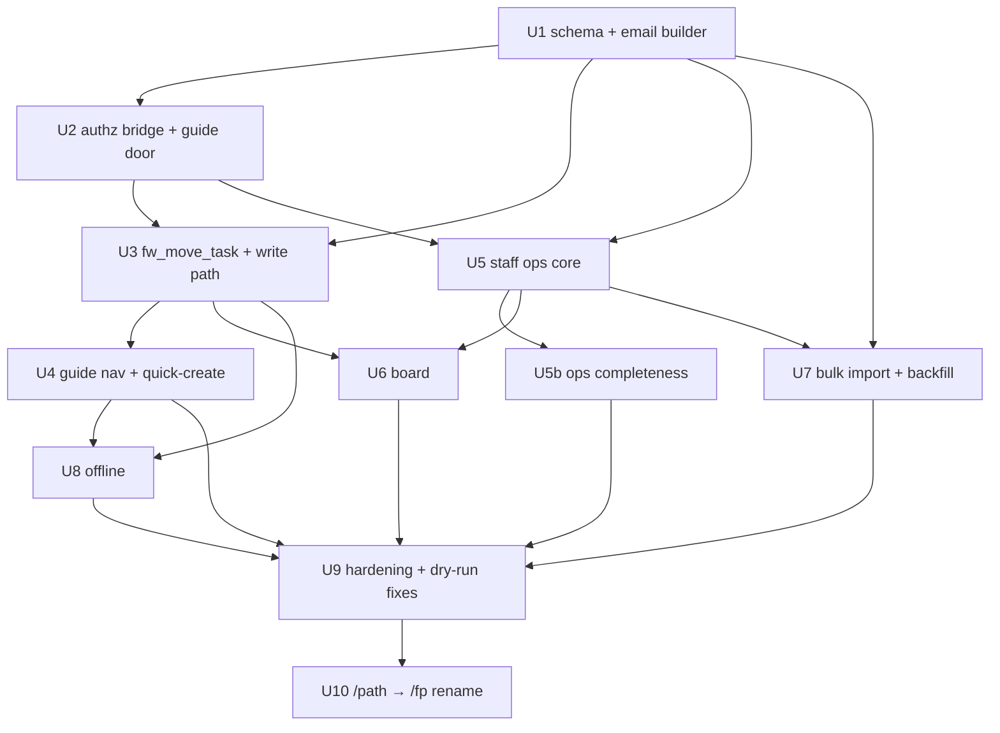

# feat: First Profit — Weekend Cohort Sprints (/path/fw) + whole-app /fp rename

## Overview

Build the Founders Weekend feature inside the existing Path app: a guide check-in surface (iPad, student → stage → criterion → task, Checkmark/Not-yet) and a projected cohort dashboard (token URL, 3–5 s polling, cohort-total XP, First Dollar moment), plus guide-provisioned dormant student accounts, an offline check-in queue with an offline-navigable shell, staff bulk import, and — as a separately-sequenced final step — the whole-app `/path` → `/fp` rename. Two hard dates govern sequencing: **feature-complete + staff dry-run ~Aug 17** for the **Boston Aug 21–23 debut**, and the rename in the **Aug 31–Sept 12** window before the Sept 19 Path cohort.

The origin brief is unusually hardened (two 7-persona review passes + a premise-level redesign with four user-settled decisions). This plan turns it into dependency-ordered implementation units, resolves the 22 flow gaps surfaced during planning research, and was itself hardened by a 7-persona plan review (34 findings — all folded in below, including four composition bugs in the plan's own first draft: the write-path race, the queue-reduction/undo-correction conflict, the false `ensureStudentProgress` reuse, and the authorless undo guard).

## Problem Frame

Founders Weekend today runs on paper. The product is deliberately tiny — a guide taps Checkmark or Not-yet and the room's projected board fills in — but it sits on real machinery: dormant minor accounts on a deliverable domain with a mechanism-enforced no-auth-mail invariant, a no-gating write path that must bypass the Path state machine's verify cascade without forking the event log, cohort-scoped guide authorization bridged to staff, and a venue-wifi reality that made offline capture a v1 requirement. See origin: `docs/brainstorms/2026-07-23-weekend-cohort-sprints-requirements.md` (Problem Frame, Redesign Pass).

**Settled by the user (2026-07-23, binding):** Boston full-v1 debut; no per-child XP on the board; offline check-in queue + offline-navigable surface in v1; batch multi-select check-in in v1.

**PROPOSED, pending accept/reject — now with hard decision dates (Decision 17):** PROPOSED-1 and PROPOSED-3 by **~Aug 1** (their seams thread Phase B/C builds, and PROPOSED-3's consent chain needs calendar room); PROPOSED-2 by **~Aug 8** (before Unit 6 builds the board). Unit 9 verifies seam states; it never hosts the decisions.

## Requirements Trace

The brief's FW-R/FW-D identifiers are the trace keys; each implementation unit lists the ones it advances. (Note: the numbered **Decisions** below are this plan's planning-owned resolutions; origin decision ids are always written with the `FW-D` prefix — the two numbering spaces are distinct.)

- FW-R1–R5, FW-D3/D9 (roles, bridge, guide door, no `/crm`) → Units 2, 5
- FW-R6–R12, FW-D2/D8 (student accounts, email builder, quick-create, import, PROPOSED-1/3) → Units 1, 4, 7
- FW-R13–R16, FW-D1/D5 (full catalog, navigation, reading rule, no gating) → Units 3, 4
- FW-R17–R22, FW-D10/D12/D16 (check-in mechanics, undo, events, batch, action id) → Units 1, 3
- FW-R23–R24 (cohorts, kind flag, dates, membership) → Units 1, 5
- FW-R25–R29, FW-D6/D11/D13, PROPOSED-2 (board, tokens, XP, First Dollar) → Units 1, 6
- FW-R31, FW-D15 (offline) → Unit 8
- FW-R30, FW-D7 (rename) → Unit 10
- Success Criteria (all ten) → named in unit test scenarios; the dry-run gate (Operational Notes) runs them live.

## Scope Boundaries

Everything in the brief's "Scope Boundaries — Roadmap / V2" stands (no evidence, reviews, parents, notifications, export, team entity, cross-city rollup, CRM integration, analytics surfaces). Additions made by this plan:

- **Join-code guide self-registration is cut from v1** (release valve 1, exercised now). Both 2026 software events have known guide rosters; pre-provisioned invite-link accounts cover them, and the join-code's mandatory other half — a leaked-code response surface — is not worth building for two events. The staff ops unit still ships a guide list + grant-revoke view (needed for revocation regardless). This closes origin FW-R4(b) and flow gap G13 explicitly.
- **No FW notifications**: the FW write path never enqueues `path_notification_events` — the Path notify machinery is untouched (see System-Wide Impact).
- **Ops audit rows are scoped, not blanket**: only the two liability actions — deletion/anonymize and guide-grant changes — write audit records (the `path-recovery.ts` D26 precedent's posture). Cohort/token metadata mutations are already actor-attributed by their own rows.
- The FW→Path conversion "rationalize" pass (FW-D12) remains out of scope; this plan only makes the schema conversion-legal (Decision 7) so it stays a data operation.

## Context & Research

### Relevant Code and Patterns

- **Layering canon** (stated in `app/path/lib/actions/transition.ts`): gate → zod → authorize → decide (pure) → mutate via service-role RPC → interpret → typed result. Every FW action follows it.
- **Pure-rules / impure-shell split**: decision logic in `*-rules.ts` modules with exhaustive vitest coverage (`app/path/lib/access-rules.ts`, `provision-rules.ts`, `sync-rules.ts`, `rate-limit-rules.ts`); drivers carry zero policy. FW adds `fw-rules.ts` / `fw-board-rules.ts` / `fw-import-rules.ts` / `fw-sync-rules.ts` in the same mold.
- **Provisioning**: `app/path/lib/provision-core.ts` — `provisionStudent`, `ensureStudentProgress`, `email_confirm: true` pinned at type level in `provision-rules.ts`. **Caution (plan-review verified): `ensureStudentProgress` cannot be reused verbatim for FW** — it derives band from the `children(grade)` join (null for FW rows → fails closed `no_band`) and seeds first-phase first tasks `available` with system `unlock` events, contradicting FW's all-locked posture. Unit 1 adds an FW-shaped sibling materializer reusing the row-shape helpers only.
- **Invite tokens**: `app/path/lib/actions/invite.ts` + `app/path/(auth)/invite/[token]/page.tsx` — 256-bit base64url token, SHA-256-hex-only storage, single-use CAS claim, per-IP rate-limited accept, compensation-based multi-step writes, GET-never-mutates. Template for guide credential invites and board tokens.
- **Rate limiting**: `app/path/lib/rate-limit-rules.ts` + `rate-limit-store.ts` (atomic `checkAndRecordRateLimit`; **per-instance in-memory, fails open across instances** — token security rests on entropy, throttle is defense-in-depth only).
- **Transition executor**: `move_path_task` in `supabase/migrations/20260722120000_path_progress.sql` — race-safe because the state check IS the UPDATE's WHERE predicate. `fw_move_task` must preserve that property (Decision 2); `move_path_task` itself is untouched.
- **Offline**: `app/path/lib/sync-rules.ts` (FIFO by queue membership, `clampToNow`, fail-closed refusal interpretation), `offline-queue.ts` (IndexedDB driver; **not cleared on sign-out** — FW consciously diverges, Decision 8), `sync-engine.ts` (foreground-signal drain), `public/sw.js` (never caches navigations — pinned by `app/path/lib/__tests__/sw-discipline.test.ts`; Unit 8's amendment is deliberately scoped to the FW app shell only). SW registration lives solely in `PathPwa` mounted from `app/path/(app)/layout.tsx` — a layout guides never load, so Unit 8 ships an FW-side registration component.
- **Staff**: `scripts/seed-staff.ts` (admin claim + `staff` row), `app/crm/lib/access.ts` (`resolveStaffAccess` — claim AND active row), `app/crm/lib/actions/path-recovery.ts` (the D26 staff-acting-on-Path precedent with audit row).
- **Match-or-create discipline**: `app/crm/lib/lead-ingest.ts` — select-first-and-branch, never blind upsert. Template for PROPOSED-1 matching.
- **Content**: static generated module `app/path/content/generated/program-2026-27.ts` via registry barrel `app/path/content/registry.ts` — no DB round-trip to render a task, so the offline task tree is bundle-served.
- **SQL-parity test convention**: `app/path/lib/__tests__/progress-core.test.ts` regex-parses the migration's CASE arms against the TS map. The FW RPC gets the same treatment, extended to assert the state-guard predicate lives inside the UPDATE (the race-safety structure), since the node-only test setup cannot run true concurrency tests.
- **Notable absences (greenfield)**: no guide-facing code anywhere (door, provisioning, surface); no cohort board UI (T3 unbuilt); no CSV code in the repo.

### Institutional Learnings (docs/solutions/)

- `integration-issues/supabase-admin-createuser-non-deliverable-email-requires-email-confirm-2026-07-21.md` — `email_confirm: true` mandatory; `config.toml` lies about hosted confirmations.
- `integration-issues/supabase-cli-stale-db-password-management-api-workaround-2026-07-13.md` + `integration-issues/dormant-migration-not-applied-prerequisite-table-missing-2026-07-17.md` — migration playbook: `to_regclass` precheck → Management API apply → verify objects → only then record in `schema_migrations`; idempotent DDL.
- `workflow-issues/split-phase-migrations-pre-deploy-schema-post-deploy-purge-separate-files-rerun-2026-07-14.md` — schema and data mutations in separate files/phases.
- `best-practices/no-transaction-multi-step-write-compensation-post-write-verify-cas-scoped-claim-2026-07-22.md` — multi-step provisioning flows are compensable (track created account, best-effort delete on later failure, post-write verification). Applies to bulk import **and** quick-create (Decision 13).
- `best-practices/offline-sync-device-clock-is-untrusted-input-membership-holds-single-clock-freshness-clamp-and-record-2026-07-22.md` — queue order by membership, clamp-and-record capture times.
- `best-practices/in-memory-rate-limiter-toctou-race-and-fifo-eviction-clears-lockout-2026-07-22.md` — reuse the atomic limiter primitive.
- `security-issues/state-changing-email-links-mutate-on-get-scanner-prefetch-false-confirm-2026-07-16.md` — tokened URLs never mutate on GET; constant-time compare.
- `best-practices/idempotent-reconciler-replaying-one-way-flags-needs-temporal-scope-2026-07-22.md` — `occurred_at`/`captured_at` (capture) vs `created_at` (insert) from day one.
- `test-failures/vitest-include-allowlist-new-test-dirs-silently-never-run-2026-07-18.md` + `test-failures/middleware-proxy-is-testable-next-experimental-testing-server-2026-07-21.md` + `test-failures/security-definer-sql-case-third-untested-copy-parse-migration-file-2026-07-22.md` — test-infrastructure constraints for Units 1, 3, 10.
- `runtime-errors/use-server-type-reexport-registers-server-reference-referenceerror-2026-07-22.md` + `best-practices/shared-db-taking-core-must-not-live-in-a-use-server-file-server-action-boundary-2026-07-17.md` — module-boundary rules for all new actions/cores.
- `build-issues/env-less-build-hangs-render-time-supabase-clients-and-undefined-fetch-url-2026-07-17.md` — board routes are `force-dynamic`; no render-time client construction on static pages.
- `ui-bugs/server-action-rejection-no-try-finally-freezes-capture-modal-2026-07-20.md` — try/finally on every submitting flag.
- `best-practices/tailwind-v4-theme-not-scopable-inline-literals-two-namespace-classname-swap-2026-07-22.md` — FW surfaces use the existing skin-token system (`app/path/lib/skin-tokens.ts`).

### Flow-Gap Analysis

Planning research traced eight end-to-end flows and surfaced 22 gaps (G1–G22), all resolved in Key Technical Decisions or unit requirements; the plan review then stress-tested the resolutions themselves and corrected four (Decisions 2, 8, 9, 13 as now written). The six live-event-critical gaps (G1 sign-out queue destruction, G2 already-decided writes, G3 cohort-stamp ambiguity, G4 missing event window, G5 replay bell salvo, G6 walk-in during outage) are called out on their owning units.

## Key Technical Decisions

1. **FW gets its own sibling RPC, `fw_move_task`; `move_path_task` is untouched.** The Path executor's verify cascade and revoke semantics are correct for the Path and wrong for FW (origin FW-D12). A separate SECURITY DEFINER function, service-role-only, keeps the Path's tested surface frozen and gives FW its own SQL-parity test. The two share the events table, not code.
2. **Writes are atomic, no-op-on-already-decided, and author-stamped (G2 + race-safety).** `fw_move_task` decides and writes in **one state-predicated UPDATE** — the per-action legal-from set lives in the WHERE clause, exactly the property that makes `move_path_task` race-safe; on zero rows it re-reads inside the same transaction to classify the echo (`alreadyDone` vs `refused`) truthfully. Semantics: checkmark onto `verified` → full no-op (no event — bell safety); **a fresh not-yet tap onto `not_yet` appends a re-attempt event without a state change** (repeat struggle is exactly the blocker signal FW-D4 exists to capture, and FW-R17 calls Not-yet a recorded state; replayed `client_id`s remain no-ops); `verified → not_yet` refused (undo first); undo from `locked` → no-op. **Both decisions stamp an author** (`verified_by`/`verified_role` on checkmark *and* not-yet; cleared on undo) — the same-actor replay guard (Decision 9) reads it for either decision. Batch actions skip already-decided students and report which. Named race test scenario: checkmark × undo on one `verified` row must serialize to exactly one event and one truthful echo.
3. **Cohort stamping is verified-client-context (G3).** The guide surface always carries an active cohort (the cohort switcher's value); every action passes it; the server verifies `activeCohort ∈ (student's membership ∩ actor's scope)` from authoritative rows, then stamps it. Never inferred (ambiguous for returners at Hamptons), never trusted (the IDOR seam). Quick-create's membership row uses the same rule. Switcher states: hidden for single-cohort sessions; multi-cohort sessions make an **explicit pick at session start (no default)** — that is the wrong-stamp prevention working; the pick persists per device; switching resets the drill-down.
4. **`path_cohorts` gains `starts_at`/`ends_at` (G4).** Staff sets them at cohort creation (timestamptz; the ops form is explicitly timezone-aware — five cities, three zones — with a test pinning the conversion). Board-token `expires_at` = `ends_at` + 6 h grace; one active token per cohort (re-mint revokes prior — note: a mid-event re-mint kills the projector until the new URL is entered; the ops checklist says so); tokens mintable only for `kind='fw'` cohorts (G18).
5. **Freshness gates celebrations — and only celebrations (G5).** The board fires a First Dollar celebration only for events whose `captured_at` is within 60 s of `created_at`; stale (replayed) events update **every recomputed aggregate silently** — grid, XP, and the PROPOSED-2 counter all count them (a first dollar earned during an outage is still a first dollar; only the bell stays quiet, since the room already rang the physical one — a guide-briefing line says so). Ticker lines for undone events retract on the next poll, including First Dollar lines (G17).
6. **First Dollar mis-tap guard = one-tap confirm on 1.2.4 only.** ("First dollar for Maya C.? This rings the bell.") For a batch containing 1.2.4 the confirm fires **once per action, naming every selected student** — never skipped, never per-student. The delay-one-poll-cycle alternative is incoherent for replayed events (G5), which settles the origin's open call in favor of the confirm.
7. **The XOR CHECK permits the converted superset (G12):** `child_id IS NOT NULL OR (first_name IS NOT NULL AND last_name IS NOT NULL AND band IS NOT NULL)` — Path rows (child only), FW rows (name/band only), and future converted rows (both; `children` authoritative for name going forward) are all legal; the empty row is not. FW→Path conversion stays a data operation, not a migration.
8. **FW offline sign-out: block-until-drained (G1), with the rotation consequence stated.** Signing out with queued items while offline is refused with a count; after a successful drain, sign-out clears residue (queue and cached roster both). This diverges deliberately from the Path queue's keep-on-sign-out posture (`offline-queue.ts`) — family devices protect a child's evidence; shared guide iPads rotate operators, and block-until-drained protects both the data and the next guide's session. **Accepted consequence, stated plainly:** during an outage no *new* sign-in is possible either (auth needs the network), so mid-outage operator rotation is impossible regardless of this posture — a device with queued items stays with its signed-in guide until reconnect, or rests. That is an ops-briefing line, not a mechanism.
9. **Queue reduction preserves legality; the same-actor guard has a data source (G14, corrected by plan review).** The local queue reduces per student-task to the **minimal legal op-sequence from the pre-outage state** — pure checkmark/undo pairs cancel to nothing, but an `undo + decision` correction sequence (e.g. undo-then-not-yet on a pre-outage `verified`) is **never collapsed to the bare decision** (which Decision 2 would rightly refuse); it replays in order. A surviving replayed undo applies only if the decision it reverts was authored by the same actor (reading the author column Decision 2 stamps on both decisions — so the guard works for `verified` and `not_yet` rows alike); a cross-actor offline correction therefore rejects to staff — intended posture, stated. Rejected replays (re-auth failure, CAS loss, guard refusal) are recorded in `path_fw_replay_rejects` and surfaced on the staff ops view with student/task/reason and a **resolved/dismissed state** (G11) — never only on the possibly-revoked guide's device.
10. **Deletion = anonymize-in-place, with a durable released-address ledger.** The staff deletion action, in one service-role sequence: rewrites the profile's name columns to tombstone placeholders (XOR CHECK still satisfied), renames the auth email to `removed-<profileId>.fw@the120.school` (stays inside the no-auth-mail-gated namespace), and **inserts the released local-part into `path_fw_released_aliases`** — a Unit 1 table the email builder's collision probe checks alongside existing accounts, so a freed name-derived address is never re-minted for a different same-named child. That guard traces to FW-D2: the address is a future contact channel, and a re-minted address would silently point it at the wrong child. Events are retained (task ids are not PII; the student's name appears nowhere in events; partial action-id groups after a teammate's deletion are tolerated — test). Anonymization fulfills the notice's promise as PII removal; the notice's wording is aligned at sign-off (Operational Notes), and a legal demand for hard erasure remains a documented manual escalation.
11. **Bulk import is chunked, compensable, and resumable.** Per-row: match (PROPOSED-1 discipline from `lead-ingest.ts`) → provision (compensation pattern from the invite flow) → membership → verify. Chunks sized to stay inside serverless duration; re-runs skip already-minted rows via the normalized-name dedupe; per-row error report (reject the row, never the file — G19). Import exception rows must be resolved before event doors (pre-event checklist gate), and the quick-create lookup also matches pending exception rows (G7).
12. **Guide invites get their own TTL constant (14 days), a staff re-issue action, and per-event issuance (G9).** The plan-review arithmetic: a single build-complete issuance dies before or during Hamptons, so invites are issued **per event** (Boston batch at build-complete, Hamptons batch during patch week), and the pre-event checklist includes "all guides claimed" so dead links surface before Friday doors. Friday-morning recovery = staff re-issues a link. The claim action carries the same per-IP rate limit and double-claim (already-claimed → dead-link) handling as its `invite.ts` template.
13. **Walk-in consent is persisted; quick-create is leg-verified (G6, G10).** The quick-create attestation checkbox ("family has seen the program notice" — QR/paper slip on the ops checklist) **blocks submission** and is **persisted** (`notice_attested_at`/`notice_attested_by` on the profile, written by quick-create; the import writes it when PROPOSED-3's notice sequence completes). Quick-create verifies all three legs (account, membership, progress materialization) **before** routing into the task tree; a failed leg surfaces retry-in-place (idempotent completion per the compensation canon) — a kid standing at the table is never handed a tree that cannot accept taps. When offline, the form is replaced by the written procedure — which **opens with "search the roster first"** at reconnect (the walk-in may have been created on another device mid-outage; see Decision 15's refresh triggers).
14. **Surface-state defaults settled (plan review).** Post-tap, the task view **stays in place** with the updated control (undo-as-toggle needs the view; auto-advance fights the mis-tap recovery premise) plus a prominent next-student affordance — tunable at the dry run, but this is the build default, single and batch alike. The reading-rule banner is per-device, dismissible, re-openable. The offline indicator carries all three states (n queued / syncing / synced), and a failed tap (error/retry) is visibly distinct from a queued one. Session expiry mid-outage never auth-redirects the cached shell — re-auth at drain means silent token refresh, falling back to password re-entry by the same guide if truly expired. `isQueueSupported()` failure (private mode) shows a persistent "this device cannot capture offline" warning at sign-in.
15. **The offline roster lives in IndexedDB, not the service worker (plan review).** The cohort roster is fetched into the same IndexedDB store family the queue uses — at session start and refreshed on every drain signal and successful action — keeping the `public/sw.js` amendment scoped to the FW **app shell only** (the smallest possible touch on the pinned never-cache-navigations invariant). Roster cache staleness, mid-event quick-create visibility from another device, and versioning across a mid-weekend deploy are named test scenarios. The cached roster clears on sign-out with the queue residue (Decision 8).
16. **Board scoping: the record is lifetime; the weekend's numbers are the weekend's (plan review).** Grid cells are record-to-date (a Hamptons returner's Boston cells arrive filled — the record lives on the student, and that is the resume affordance working). But the **hero XP, the ticker, and the PROPOSED-2 counter are weekend-scoped** — derived from non-undone verify/not-yet events cohort-stamped to *this* cohort — so the room's number opens at zero on Friday and climbs on the room's own work. (Origin FW-R27's "sum over verified rows" formula predates the many-weekends membership model; cohort-stamped events are the same numbers for a first-time cohort and the honest ones for returners.)
17. **PROPOSED decision gates are calendar entries, not phase references (plan review).** PROPOSED-1 and PROPOSED-3: decided by **~Aug 1** (P-1's matching module threads Units 4/5b/7; P-3's chain — retroactive notice ≥72 h before minting, transcription owner, backfill before the Boston roster import — needs the calendar). PROPOSED-2: by **~Aug 8**. Unit 9 verifies each accepted seam landed / each rejected seam removed; deferring into the fix buffer would double-book it as a feature buffer.
18. **PROPOSED seams.** PROPOSED-1 = one pure matching module (`fw-match-rules.ts`) consumed by quick-create (Unit 4), staff resolution (Unit 5b), and import (Unit 7); rejecting it deletes the module and its three call sites — and the G6 reconnect procedure then leans entirely on its "search the roster first" step, stated in Unit 4. PROPOSED-2 = one board component + one aggregate in the board read model (Unit 6). PROPOSED-3 = one importer mode flag + the consent-notice ops sequence (Unit 7). Each is a checkbox sub-item marked *(PROPOSED-n — only if accepted)*.

## Open Questions

### Resolved During Planning

- Join-code path → **cut from v1** (Scope Boundaries).
- First Dollar guard shape → **confirm-tap, once per batch action** (Decision 6).
- Hard-delete vs anonymize → **anonymize-in-place + released-address ledger** (Decision 10); notice wording aligned at sign-off (Operational Notes).
- Event-window source of truth → **columns on `path_cohorts`** (Decision 4).
- Weekend vs lifetime board numbers → **grid lifetime; XP/ticker/counter weekend-scoped** (Decision 16).
- Repeat not-yet → **recorded as re-attempt events** (Decision 2).
- Sign-out-with-queue, mid-outage rotation, replay reduction, rejected-replay disposition, cohort-stamp rule, already-decided writes, celebration staleness, walk-in outage/consent, surface-state defaults → Decisions 2, 3, 5, 8, 9, 13, 14, 15.
- XOR conversion legality → Decision 7.
- Where staff FW affordances live → inside `/path/fw`, bridge-gated (origin, confirmed; Units 5/5b).
- Where the poll endpoint lives → a route handler under the board token subtree (Unit 6), so the UNGUARDED prefix and per-request token check provably cover the payload, not just the page.

### Deferred to Implementation

- Exact IndexedDB store shape and the FW queue's entry union (whether to extend `sync-rules.ts`'s `QueueEntry` or define a parallel union in `fw-sync-rules.ts`) — decided when the queue lands against real payloads; policy (Decisions 8–9, 15) is fixed either way.
- The idempotency/action-id landing shape on `path_task_events` (two columns + partial unique index vs a dedupe side-table) — Unit 1 picks against write-path ergonomics; requirement (exactly-once, grouped) is fixed.
- Typo-tolerance mechanics for roster search (client-side prefix + edit-distance over ≤90 cached names is the expectation) — tuned against the real roster shape.
- Grid rendering geometry at ~90 rows on a projector (columns = stages vs criteria, pagination) — resolved against the real screen at the dry run; the non-negotiables (no per-child score, fixed row order, cell-state encoding legible at distance, board-side duplicate-name tiebreaker) are requirements, not implementation choices.
- Chunk size / `maxDuration` for the importer — measured, not guessed.

## High-Level Technical Design

> *This illustrates the intended approach and is directional guidance for review, not implementation specification. The implementing agent should treat it as context, not code to reproduce.*

```mermaid
flowchart LR
  subgraph guide["Guide surface /path/fw (offline-navigable)"]
    NAV[roster (IndexedDB cache) + search\n+ task tree (static bundle)] --> ACT[check-in action\ncheckmark / not-yet / undo / batch]
    QC[quick-create, leg-verified\n(+PROPOSED-1 confirm)] --> ACT
    ACT --> Q[(IndexedDB queue\nonline: direct call\noffline: enqueue)]
  end
  subgraph server["Service-role boundary"]
    Q -->|drain: re-auth, minimal-legal-\nsequence reduction, same-actor\nundo guard| FWACT[fw actions\ngate→zod→authorize→decide→RPC]
    FWACT --> RPC[[fw_move_task\natomic state-predicated UPDATE\nauthor-stamped decisions\ncohort stamp, action id, captured_at]]
    RPC --> EV[(path_task_progress\npath_task_events)]
    FWACT -->|rejects| RR[(path_fw_replay_rejects)]
  end
  subgraph staff["Staff ops (bridge-gated, /path/fw)"]
    OPS[cohorts+dates · guides+invites\ntokens · import · match resolution\nreject list · anonymize+ledger] --> EV
  end
  subgraph board["Board /path/fw/board/[token]"]
    POLL[poll route (no-store,\nper-request token check)\nweekend XP · grid · ticker\nFirst Dollar (fresh, action-grouped)\n(+PROPOSED-2 counter)] --> EV
  end
```

Unit dependency graph (arrows = "requires"):



## Implementation Units

### Phase A — Foundation (~Jul 24–Aug 1)

- [x] **Unit 1: FW schema migration, email builder, FW materializer, no-auth-mail mechanism** — landed 2026-07-23. Migration AUTHORED, production apply HELD for the ~Jul 28 Chicago checkpoint; both email probes still outstanding (they run against the applied schema). Implementation-time resolutions: idempotency shape = `action_id` + `client_id` columns on `path_task_events` with a partial unique index (over a dedupe side-table); the normalized-name lookup ships as a stored `normalized_name` column + partial index rather than an expression index (the NFKC fold is not an immutable SQL function); FW profiles keep `family_id` NOT NULL via a private single-student `path_families` row rather than loosening a column ~12 Path reads assume.

**Goal:** All FW DDL in one idempotent migration; the name-derived email builder with the mechanism-enforced no-auth-mail invariant; the FW progress materializer; parity tests.

**Requirements:** FW-R8–R11, FW-R20–R24, FW-D2, FW-D8; gaps G4, G12; Decisions 2 (columns), 4, 7, 10 (ledger), 13 (attestation columns).

**Dependencies:** None. **Timing note:** hold the production apply until after the ~Jul 28 Chicago-rehearsal checkpoint (origin's revision gate) — a schema revision after apply is a new production migration, not an edit. (Week-1 side task rides along: the two email probes — live `createUser` on the real domain confirming zero mail; probe mail to a nonexistent `*.fw@` address confirming bounce/no-catch-all.)

**Files:**
- Create: `supabase/migrations/20260728TBD_fw_cohort_sprints.sql`
- Create: `app/path/lib/fw-provision-rules.ts` (pure: email derivation, collision suffixing incl. released-alias exclusion, payload builder, auth-mail refusal guard)
- Modify: `app/path/lib/provision-core.ts` (add `ensureFwStudentProgress` — reuses the row-shape helpers, **not** `ensureStudentProgress`: band from the profile's own `band` column, all 125 rows `locked`, no `available` promotion, no `unlock` events; plus the FW provisioning entry)
- Test: `app/path/lib/__tests__/fw-provision-rules.test.ts`, `app/path/lib/__tests__/fw-migration-parity.test.ts`

**Approach:**
- One migration, idempotent DDL, applied via the Management API playbook (`to_regclass` precheck → apply → verify objects → record version). **Seven DDL groups:** (1) `path_student_profiles` — `child_id` to nullable, add `first_name`/`last_name`/`band`, `notice_attested_at`/`notice_attested_by` (Decision 13), superset-XOR CHECK (Decision 7), normalized-name index *(supports PROPOSED-1; harmless if rejected)*; (2) `path_task_events` — nullable `cohort_id` RESTRICT FK, `captured_at timestamptz`, `action_id uuid`, client idempotency key with partial unique index; (3) `path_cohort_members (student_id, cohort_id, joined_at)`; (4) `path_cohorts` — `kind` (`'path'|'fw'`, default `'path'`), `starts_at`, `ends_at` (Decision 4); (5) `path_fw_board_tokens` (cohort FK, `token_hash`, `expires_at`, `revoked_at`, `created_by`); (6) `path_fw_replay_rejects` (student/task/cohort/actor/reason/`resolved_at`/`resolved_by`); (7) `path_fw_released_aliases (local_part text primary key, released_profile_id uuid, released_at timestamptz)` (Decision 10). RESTRICT posture throughout; RLS-enabled, zero policies.
- Email builder: NFKC → ASCII-fold → dotted local part → `.fw@the120.school`; collision = probe existing accounts **and `path_fw_released_aliases`** + next integer, insert-retry on the unique constraint as backstop; payload pins `email_confirm: true` and `app_metadata.role:"student"` at the type level; provisioning is password-less. The refusal guard is the single choke-point any future auth-mail-capable call must pass, with a regression test.

**Patterns to follow:** `supabase/migrations/20260721130000_path_identity.sql` (header comment, idempotency, RESTRICT rationale comments); `app/path/lib/provision-rules.ts`; parity-test idiom from `app/path/lib/__tests__/progress-core.test.ts`.

**Test scenarios:**
- Happy path: `deriveFwStudentEmail("Maya","Chen")` → `maya.chen.fw@the120.school`; accented/hyphenated/apostrophe names fold cleanly; `ensureFwStudentProgress` materializes exactly 125 `locked` rows with zero events.
- Edge: collision produces `maya.chen2.fw@…` silently; a released alias in the ledger is skipped (a new Maya Chen gets `maya.chen2…` even though `maya.chen…` is technically free); empty/whitespace names fail closed.
- Edge (parity, migration text): XOR CHECK — Path shape legal, FW shape legal, converted superset legal, empty-identity row illegal; all seven DDL groups present; RESTRICT on every new FK; RLS-enable on every new table.
- Error: payload builder without `email_confirm: true` is a compile error; the refusal guard throws on any `*.fw@the120.school` recipient.
- Integration: Path's own `ensureStudentProgress` behavior is bit-identical after the migration (full Path suite green — the nullable `child_id` and new columns must not disturb Path reads or provisioning).

**Verification:** Migration applies cleanly via Management API against production (verified with `to_regclass`/`to_regprocedure` before recording); existing Path suites green; both email probes pass and are recorded in the checklist.

- [ ] **Unit 2: FW authz — admin bridge, guide door, guide provisioning**

**Goal:** Guides can sign in (and land at the right door); staff/admin implicitly act as guides in `kind='fw'` cohorts; guides can never reach `/crm` or carry the admin claim.

**Requirements:** FW-R1–R5, FW-D3, FW-D9; Decision 12.

**Dependencies:** Unit 1 (`kind` flag).

**Files:**
- Create: `app/path/lib/fw-access-rules.ts` (pure: FW actor resolution given grants + bridge inputs), `app/path/lib/actions/fw-guide.ts` (guide sign-in, provisioning, invite claim), `app/path/fw/(auth)/sign-in/page.tsx`, `app/path/fw/(auth)/invite/[token]/page.tsx`
- Modify: `app/lib/supabase/proxy-rules.ts` — UNGUARDED additions (`/path/fw/sign-in`, prefix `/path/fw/invite/`, prefix `/path/fw/board/`) **and a new `fw-login` outcome**: a session-less request to any other `/path/fw/*` route redirects to `/path/fw/sign-in`, not the student/parent `/path/sign-in` (a guide with an expired session on event day must land at the guide door)
- Test: `app/path/lib/__tests__/fw-access-rules.test.ts`; extend `app/crm/__tests__/proxy-rules.test.ts`

**Approach:**
- `resolveFwActor` (pure): a `guide`/`cohort` grant for the target cohort → guide; else, bridge inputs `{ hasAdminClaim, staffRowActive, cohortKind }` → guide iff all three hold and `cohortKind === 'fw'`. The impure shell gathers claim + staff row (reusing `resolveStaffAccess`'s inputs) — pure Path resolvers are not widened (origin FW-D9).
- Guide door mirrors `app/path/lib/actions/parent-sign-in.ts` (email + password, existing rate-limit configs). Guide provisioning (staff-gated; surface in Unit 5): `createUser` with **no admin claim**, `guide`/`cohort` grant row, credential issuance via a guide-invite token — `invite.ts` pattern with its own 14-day TTL constant, re-issue action, **the same per-IP rate limit on the claim action, and double-claim → dead-link handling** (Decision 12).
- Tests pin: guide session → `/crm` yields `crm-staff-only`; a provisioned guide's `app_metadata.role` is never `"admin"`; bridge refuses `kind='path'` cohorts, inactive staff rows, claim-only sessions.

**Test scenarios:**
- Happy: guide grant → guide for that cohort only; admin claim + active staff row + fw cohort → guide with no grant row; session-less `/path/fw/board/<token>` passes; session-less `/path/fw` (guarded) → `/path/fw/sign-in`.
- Edge: admin claim + revoked staff row → refused (stale-JWT rule); bridge against `kind='path'` → refused; guide grant for cohort A acting on cohort B → refused.
- Error: expired guide invite → dead-link card; staff re-issue produces a working link and kills the old hash (CAS); **a second claim against an already-claimed token → dead-link**; claim attempts are per-IP rate-limited.
- Integration (proxy test): the three unguarded FW entries reachable session-less; everything else under `/path/fw` gated to the **guide** door.

**Verification:** A staff session and a granted guide session can both open the (stub) FW surface for an fw cohort; a guide session 404s on `/crm`; all existing proxy tests green.

### Phase B — The loop (~Aug 1–8)

- [ ] **Unit 3: `fw_move_task` RPC + check-in write path**

**Goal:** The sanctioned, cascade-free, no-gating FW transition — checkmark / not-yet / undo, batch-capable, atomic, author-stamped, cohort-stamped.

**Requirements:** FW-R16–R22, FW-D5, FW-D10 (guard flag), FW-D12, FW-D16; Decisions 1–3, 5 (event side), 6, 9 (author source).

**Dependencies:** Units 1, 2.

**Files:**
- Create: `supabase/migrations/20260801TBD_fw_move_task.sql` (function-only migration), `app/path/lib/fw-rules.ts` (pure decision: action legality, batch planning, already-decided skip reporting), `app/path/lib/actions/fw-checkin.ts`
- Test: `app/path/lib/__tests__/fw-rules.test.ts`, `app/path/lib/__tests__/fw-move-task-parity.test.ts`

**Approach:**
- `fw_move_task(p_student, p_task, p_action, p_actor, p_cohort, p_captured_at, p_action_id, p_client_id)`: SECURITY DEFINER, service-role-only. Hardcoded targets: `checkmark→verified`, `not_yet→not_yet`, `undo→locked`. **Atomicity: the per-action legal-from set is the UPDATE's WHERE predicate** (checkmark from any state ≠ `verified`; undo from `verified` or `not_yet`; the not-yet arm updates state where ≠ `not_yet` and *appends a re-attempt event* when already `not_yet` and the `client_id` is fresh — Decision 2); zero rows → re-read in-transaction to classify `alreadyDone` vs `refused` truthfully. **Author stamping:** `verified_by`/`verified_role` set on checkmark *and* not-yet, cleared on undo. Stamps `snapshot_band` from the profile's stored band on checkmark; writes the event row (`actor_role='adult'`, cohort, server-clamped `captured_at`, `action_id`, idempotency key — replayed `client_id` is a silent no-op). No unlock-next, no review-open. The SQL-parity test parses the CASE, the WHERE-predicate structure (race safety is structural — the node-only test setup cannot run true concurrency), and the author-stamp arms.
- Action layer: gate → zod → `resolveFwActor` + verified-client-context cohort check (Decision 3) → pure `fw-rules` decision (batch = N per-student plans sharing one `action_id`; skip list for already-decided) → N RPC calls → typed result naming applied/skipped/refused per student, plus `firstDollar: true` when 1.2.4 was newly verified.

**Execution note:** Test-first on `fw-rules.ts` — the decision table (action × current-state × batch × fresh-vs-replay) is the product's core logic.

**Test scenarios:**
- Happy: checkmark on `locked` → `verified` + author + event; not-yet on `locked` → `not_yet` + author + event; undo on `verified` → `locked`, author cleared, event; undo on `not_yet` → `locked` likewise.
- Edge (G2/Decision 2): checkmark on `verified` → `alreadyDone`, zero events; **fresh not-yet on `not_yet` → re-attempt event, state unchanged**; replayed `client_id` not-yet → no-op; `verified → not_yet` refused with reason; batch of 3 with one already-verified → 2 applied + 1 skipped by name.
- Edge (race, named): checkmark × undo near-simultaneous on one `verified` row → exactly one event, both echoes truthful (structural WHERE-predicate assertion + interleaving test at the pure layer); checkmark × checkmark → one event ever.
- Edge: `captured_at` far from receipt → clamped-and-recorded.
- Error: cohort not in membership ∩ scope → refused before the RPC; student outside the actor's scope → refused.
- Integration (parity): migration CASE ↔ TS action map both directions; author-stamp and WHERE-predicate structure asserted; grants revoked from public/anon/authenticated.

**Verification:** From a guide session, the full loop (check, not-yet ×2, undo, batch) round-trips against production schema on a test cohort; `move_path_task`'s own tests untouched and green.

- [ ] **Unit 4: Guide navigation, roster, quick-create**

**Goal:** The minute-loop surface: cohort switcher → roster (search, resume chips) → task tree (reading rule) → task view (check controls, batch picker, First Dollar confirm) → leg-verified quick-create.

**Requirements:** FW-R6–R7, FW-R13–R15, FW-D1, FW-D11 (data), FW-D16 (UI); Decisions 3, 6, 13, 14; gaps G6, G10, G21, G22. *(PROPOSED-1 quick-create confirm — only if accepted, decided ~Aug 1.)*

**Dependencies:** Unit 3.

**Files:**
- Create: `app/path/fw/(app)/layout.tsx` (FW gate + shell + cohort switcher), `app/path/fw/(app)/page.tsx` (roster), `app/path/fw/(app)/student/[studentId]/…` (stage → criterion → task drill-down), `app/path/lib/fw-loader.ts`, `app/path/lib/actions/fw-student.ts` (quick-create), components under `app/path/fw/components/`
- Create *(PROPOSED-1)*: `app/path/lib/fw-match-rules.ts` (pure matching, shared with Units 5b/7)
- Test: `app/path/lib/__tests__/fw-match-rules.test.ts`, roster/search/quick-create rules in `app/path/lib/__tests__/fw-rules.test.ts` (extend)

**Approach:**
- Cohort switcher per Decision 3 (hidden single-cohort; explicit no-default pick multi-cohort; persisted per device; switch resets drill-down). Roster = membership join; resume chip shows furthest position (G21). Search client-side over cached roster: prefix + edit-distance, duplicates disambiguated by band/recency. Task tree from the static content bundle; reading-rule banner per Decision 14. Task view: title + control, body, band-resolved done-when; undo-as-toggle for both decisions; **post-tap stays in place** with next-student affordance (Decision 14); batch picker (max 3, roster-scoped, cleared after action; partial outcome surfaced per student from Unit 3's result); **1.2.4 confirm once per action naming all selected students** (Decision 6). try/finally on all submitting flags; failed tap (error/retry) visibly distinct from queued.
- Quick-create: three fields + **blocking, persisted** notice attestation (Decision 13); **verifies account + membership + materialization before routing** into the task tree, with retry-in-place on a failed leg; offline → the G6 procedure text (opens "search the roster first" at reconnect). *(PROPOSED-1: normalized-name lookup first — same-cohort match → full card confirm; cross-cohort → minimal "confirm with staff" signal; rate-limited and logged.)*

**Test scenarios:**
- Happy: guide reaches any task via the drill-down; quick-create mints account + membership + 125 locked rows, records attestation, lands in the tree.
- Edge: duplicate roster names disambiguated; returner's resume chip reflects prior-weekend rows; batch partial outcome names the skipped teammate; batched 1.2.4 shows one confirm naming all three; post-tap view state updated in place.
- Edge *(PROPOSED-1)*: exact same-cohort match → confirm card with band; cross-cohort-only match → minimal signal with no band/city/date in the payload (asserted); "New student" always available; pending import-exception rows also match (G7).
- Error: unchecked attestation blocks submission; empty band → inline validation, no partial account; **membership-leg failure → retry-in-place, guide never lands in a tap-dead tree; materialization-leg failure → same**; action rejection re-enables the form.
- Integration: quick-create offline shows the procedure text and creates nothing.

**Verification:** On an iPad-sized viewport, the full find→tap loop runs well under a minute against a 30-student seeded cohort; the 1.2.4 confirm intercepts exactly that task, once per action.

- [ ] **Unit 5: Staff FW ops — core (Boston-critical)**

**Goal:** The staff affordances Boston cannot run without: cohorts (with dates), guide credentialing end-to-end, board tokens.

**Requirements:** FW-R4, FW-R23, FW-R25 (mint/revoke), FW-D9, FW-D14 (ops); Decisions 4, 12.

**Dependencies:** Units 1, 2.

**Files:**
- Create: `app/path/fw/(app)/ops/page.tsx` (+ cohort/guide/token sub-pages), `app/path/lib/actions/fw-ops.ts`, `app/path/lib/fw-board-rules.ts` (pure: token mint/verify/expiry decisions)
- Test: `app/path/lib/__tests__/fw-board-rules.test.ts`

**Approach:** Visible only to bridge-resolved sessions (guides see none of it; every action re-gated server-side). Cohort create writes `kind='fw'` + `starts_at`/`ends_at` via a **timezone-explicit form** (Decision 4, with a conversion-pinning test). Token mint: `randomBytes(32)` → raw shown once → SHA-256 hex + `expires_at` stored; one active token per cohort, re-mint revokes prior. Guide list per cohort with provision / invite / re-issue / **grant revoke** (audit row on grant changes — Scope Boundaries).

**Test scenarios:**
- Happy: mint → board URL opens; re-mint → old token dead, new works; guide provision → invite claim → password set → grant listed.
- Edge: token for `kind='path'` refused; expiry honors `ends_at` + 6 h across timezones (the city-local entry test); revoke-grant removes check-in power on next action; grant change writes an audit row.
- Error: a pure-guide session invoking any ops action → refused server-side.
- Integration: staff walk-through creates a complete Boston-shaped cohort (dates, guides, token) without touching `/crm` or SQL.

**Verification:** The Boston pre-event checklist's system steps are executable end-to-end by a staff session alone.

### Phase C — Board, import, offline, ops completeness (~Aug 8–14)

- [ ] **Unit 5b: Staff FW ops — completeness**

**Goal:** The remaining ops surfaces: replay-reject list, deletion/anonymize, and (PROPOSED-1) cross-cohort match resolution. First to slip toward Unit 9's buffer if Phase C compresses — named now, not discovered at the dry run.

**Requirements:** Decisions 9 (surface), 10; gaps G8, G11. *(PROPOSED-1 resolution surface — only if accepted.)*

**Dependencies:** Unit 5 (+ Unit 8's rejects to display; buildable against the table from Unit 1).

**Files:** Extend `app/path/fw/(app)/ops/` + `app/path/lib/actions/fw-ops.ts`; test extensions in `fw-board-rules.test.ts` / a small `fw-ops-rules` module if decision logic accrues.

**Approach:** Replay-reject list with student/task/reason and **resolved/dismissed state** (Decision 9). Deletion action per Decision 10 in one service-role sequence (tombstone names → rename auth email → insert released alias → audit row), typed confirm. *(PROPOSED-1: staff sees the full cross-cohort match detail the guide's minimal signal withheld; links membership or confirms new-student.)*

**Test scenarios:**
- Happy: a reject row marked resolved disappears from the open list, retained in history; deletion tombstones + renames + writes the alias ledger + audit row atomically (compensation on partial failure).
- Edge: deleted teammate leaves a partial action-id group the board tolerates; a same-named child created post-deletion gets a suffixed address (ledger probe).
- Error: deletion of a student with queued-unresolved rejects surfaces a warning, not a silent orphan.

**Verification:** The deletion promise is executable end-to-end before the first consent notice goes out (Operational Notes gate).

- [ ] **Unit 6: The projected board**

**Goal:** The token route and the room's spectacle: grid, rollups, ticker, weekend XP, First Dollar — live within ~5 s, honest when stale.

**Requirements:** FW-R25–R29, FW-D6, FW-D10–D11, FW-D13; Decisions 4, 5, 16; gaps G5, G17, G18. *(PROPOSED-2 counter — only if accepted, decided ~Aug 8.)*

**Dependencies:** Units 3, 5.

**Files:**
- Create: `app/path/fw/board/[token]/page.tsx` (`force-dynamic`, `robots noindex/nofollow`, `no-store`), **`app/path/fw/board/[token]/feed/route.ts`** (the poll transport — a route handler inside the same UNGUARDED token subtree, `Cache-Control: private, no-store`, re-running the full token → SHA-256 → lookup → expiry/revocation check on every poll), `app/path/lib/fw-board-loader.ts` (read model), board components, a small polling client component
- Test: extend `app/path/lib/__tests__/fw-board-rules.test.ts` (read-model shaping is its own work line: weekend-XP aggregate, freshness gate, retraction, grouping, name display)

**Approach:**
- GET never mutates; page and feed each validate the token per request (constant-time compare). Poll every 3–5 s; stale-poll indicator when a poll fails/ages.
- Read model (pure shaping in `fw-board-rules.ts`): per-student cell states (never-attempted / not-yet / verified — record-to-date per Decision 16) scoped to cohort members; **weekend-scoped cohort XP** (phase-weighted over non-undone verify events cohort-stamped here — Decision 16); rollups; ticker from recent cohort-stamped events, first name + last initial with a duplicate tiebreaker (band); not-yet activity **including re-attempts** (Decision 2); First Dollar celebrations grouped by `action_id`, freshness-gated (Decision 5), retracted on undo (G17). Row order fixed by name; the read model **exposes no per-student XP field at all** (FW-D13, structural assertion). *(PROPOSED-2: counter = distinct students with a non-undone, cohort-stamped 1.2.4 verify — **no freshness term**; Decision 5.)*

**Test scenarios:**
- Happy: a checkmark's cell + ticker line + XP delta appear in the next poll payload; batched 1.2.4 → one celebration, three cells; a re-attempt not-yet resurfaces in not-yet activity.
- Edge (G5/Decision 5): replayed 1.2.4 (`captured_at` 20 min old) → grid/XP **and counter** update, zero celebrations; two fresh first-dollar actions in adjacent windows → two celebrations, queued not dropped.
- Edge (Decision 16): a Hamptons returner's Boston cells render filled, but Friday-morning weekend XP is 0 and the counter ignores their Boston 1.2.4.
- Edge (G17/FW-D13): undo retracts the ticker line and decrements XP/counter next poll; read model has no per-student score field.
- Error: expired/revoked/garbage token → 404 semantics on page **and** feed, no cohort-existence leak; feed responses carry no-store (header test); poll failure → stale indicator, never a blank board.
- Integration: token subtree reachable session-less (proxy test); page metadata noindex.

**Verification:** Projected on a real screen at ~30 seeded students: tap-to-board latency ≤ ~5 s; XP animates; a batched First Dollar rings once; the feed's headers verified in the browser.

- [ ] **Unit 7: Bulk import (+ paper backfill)**

**Goal:** Boston's roster path — CSV → accounts + memberships, chunked/compensable/resumable; the backfill variant for paper weekends.

**Requirements:** FW-R12; Decision 11; gaps G7, G19. *(PROPOSED-1 per-row matching; PROPOSED-3 backfill mode + consent sequencing — each only if accepted, decided ~Aug 1.)*

**Dependencies:** Units 1, 5 (surface), 3 (backfill writes events via `fw_move_task`).

**Files:**
- Create: `app/path/lib/fw-import-rules.ts` (pure: row parsing/validation/normalization, dedupe, chunk planning, resume keying), `app/path/lib/actions/fw-import.ts`, ops-surface import page under `app/path/fw/(app)/ops/`
- Test: `app/path/lib/__tests__/fw-import-rules.test.ts`

**Execution note:** Test-first on `fw-import-rules.ts`; greenfield CSV parsing with no repo prior art — pin the format with aggregate invariants (whole-set assertions, not fixture spot-checks).

**Test scenarios:**
- Happy: 30-row CSV → 30 accounts + memberships + locked progress + attestation stamps (PROPOSED-3 notice path); re-run of the same file → zero new accounts.
- Edge: within-import duplicates collapse; malformed row rejected with row-level report, file continues; 90-row import completes across chunks.
- Edge *(PROPOSED-1)*: row matching an existing FW student (first,last,band) → membership only; ambiguous → exception list, nothing minted; exceptions resolvable in ops before doors (G7 gate).
- Edge *(PROPOSED-3)*: backfill row with checked task ids → events via `fw_move_task` (no-gating, `alreadyDone`-safe on re-run), cohort-stamped, backfill-marked, `captured_at` = entry time; invalid task id → row rejected with reason (G19); an opt-out family's row skipped.
- Error: provisioning failure mid-row → compensation deletes the created account; mid-file failure → re-run skips completed rows.
- Integration: an imported returner in a later cohort's CSV gets a second membership, one account.

**Verification:** A realistic Boston-shaped CSV (with deliberate dirt) imports to a correct roster visible in Unit 4, with a per-row report.

- [ ] **Unit 8: Offline capture**

**Goal:** The FW queue + offline-navigable shell: a 20-minute outage loses nothing and misleads no one.

**Requirements:** FW-R31, FW-D15; Decisions 8, 9, 14, 15; gaps G1, G11, G14, G15, G16.

**Dependencies:** Units 3, 4.

**Files:**
- Create: `app/path/lib/fw-sync-rules.ts` (pure: queue entry union, **minimal-legal-sequence reduction**, drain planning, rejection interpretation, sign-out verdict, roster-cache policy), `app/path/lib/fw-queue.ts` (IndexedDB driver — queue + roster cache), `app/path/lib/fw-sync-engine.ts` (drain), **`app/path/fw/components/FwPwa.tsx`** (SW registration + foreground drain-signal wiring, mounted from `app/path/fw/(app)/layout.tsx` — the existing `PathPwa` mounts only in the Path layout guides never load), queued-indicator component
- Modify: `public/sw.js` (**app-shell caching for `/path/fw` only** — the roster is IndexedDB, not SW-cached, per Decision 15)
- Test: `app/path/lib/__tests__/fw-sync-rules.test.ts`; amend `app/path/lib/__tests__/sw-discipline.test.ts` deliberately (the never-cache-navigations pin gains a narrowly-scoped FW app-shell exception)

**Approach:**
- Queue entries: `{clientId, actionId, studentId, taskId, action, cohortId, capturedAt, actorUserId}`. Policy in pure rules: **reduction to the minimal legal op-sequence** per student-task (pairs cancel; `undo + decision` sequences preserved in order — Decision 9), same-actor guard on surviving undos (reads the author column; works for both decisions), drain on the Unit-11 foreground signals, re-auth at drain (silent refresh, password re-entry by the same guide if truly expired — Decision 14), rejects → `path_fw_replay_rejects` + local tombstone with a visible note. Sign-out verdict per Decision 8 (refuse offline-with-queue; clear queue **and roster cache** after drain). Roster cache: session start + refresh on every drain signal and successful action (Decision 15); versioned against deploys. `isQueueSupported()` warning at sign-in.

**Execution note:** Test-first on `fw-sync-rules.ts`; the reduction × guard × rejection matrix is where both adversarial reviews found live-event bugs — pin every named row.

**Test scenarios:**
- Happy: 3 queued check-ins drain in capture order; capture times preserved; board catches up.
- Edge (the original P1): offline checkmark+undo pair cancels locally; a bare queued undo of another guide's live checkmark → same-actor guard rejects, reject row written, board intact.
- Edge (the corrected P1): **offline `undo + not-yet` on a pre-outage `verified` → replays in order, lands `not_yet`** (same actor); the cross-actor variant rejects to staff — both rows in the matrix, plus undo-of-not_yet same/cross-actor.
- Edge (G14): check→undo→check offline → one checkmark; undo-of-pre-outage-checkmark alone → survives, guard evaluates.
- Edge (G1): sign-out with 3 queued offline → refused with count; after drain → allowed, queue and roster cache cleared.
- Edge (Decision 15): a walk-in quick-created on device B appears on device A's roster after A's next drain signal; a stale roster during the outage still allows the G6 procedure; a mid-weekend deploy doesn't wedge the cached shell (version test).
- Error: replay against an already-verified task → `alreadyDone` no-op, not a reject; a revoked guide's drain → all rejects recorded server-side, none applied; private-mode → persistent warning; expired session offline → shell stays navigable, re-auth at drain.
- Integration: airplane-mode walk on real hardware: navigate roster → task → tap → reconnect → event lands, indicator shows queued → syncing → synced.

**Verification:** The Success-Criteria outage drill passes on a real iPad against production: 20 minutes offline mid-loop, navigation intact, nothing lost, nothing double-rung, the correction sequence lands.

### Phase D — Hardening (~Aug 14–20)

- [ ] **Unit 9: Hardening, seam verification, and dry-run fixes**

**Goal:** Close the gap between "units verified" and "event-ready". This unit **verifies** the PROPOSED seam states (decided ~Aug 1 / Aug 8 per Decision 17 — it never hosts the decisions), sweeps the remaining tuning items (grid geometry at scale, touch targets), seeds a 90-student rehearsal cohort for projector legibility, and owns the fixes the Aug 17 dry run surfaces.

**Requirements:** All ten Success Criteria, run live; FW-D14's gate.

**Dependencies:** Units 4, 5b, 6, 7, 8.

**Files:** Fix-driven; no new modules expected.

**Test scenarios:** Test expectation: none — this unit's product is fixes, each landing with its own test in the owning unit's suite.

**Verification:** Dry-run checklist signed off (pass/fail per Operational Notes); all suites green; each accepted PROPOSED item demonstrably live, each rejected seam demonstrably removed. A failed gate → Boston runs on paper (the standing fallback), not on hope.

### Phase E — The rename (Aug 31–Sept 12, after Hamptons)

- [ ] **Unit 10: Whole-app `/path` → `/fp` rename**

**Goal:** One mechanical commit: routes, identifiers, **and user-facing brand strings** move to First Profit; `/path` 308-redirects; nothing else changes.

**Requirements:** FW-R30, FW-D7.

**Dependencies:** Unit 9 (post-Hamptons); no live Path users before Sept 19.

**Files (measured surface):**
- Move: `app/path/` → `app/fp/` (~129 files; 83 files' `@/app/path/` import specifiers — 5 outside the tree: `app/api/cron/path-notifications/route.ts`, `app/api/cron/path-evidence-reaper/route.ts`, `app/crm/lib/actions/path-recovery.ts`, `scripts/backfill-path-families.ts`, `scripts/provision-path-family.ts`)
- Modify: 37 files with quoted `/path` route literals (incl. `proxy.ts`, `app/lib/supabase/proxy-rules.ts`, `public/sw.js`, `sync-rules.ts` constants, `app/offline/page.tsx`, shells/forms), `public/path.webmanifest` (`id`/`start_url`/`scope` **and the brand strings `name`/`short_name` → First Profit**), `app/path/layout.tsx` metadata (**`appleWebApp.title` and title tags → First Profit**), `next.config.ts` (308 `/path/:path*` → `/fp/:path*`), `vitest.config.ts` include glob, npm script aliases, and the `sw-discipline.test.ts` assertions that pin the manifest name and scope.
- Keep stable: IndexedDB names (`path-offline-queue` and the FW stores), SW cache/message strings (`path-sw-*`, `path-skip-waiting`, `path-drain`) — internal identifiers; renaming them orphans queues/caches for zero user value (documented inline). `/api/cron/path-*` route paths unchanged (`vercel.json` untouched).
- Test: proxy matcher + redirect behavior via `next/experimental/testing/server`; vitest run listing must show every moved suite (the include-allowlist trap); **the straggler grep assertion is precisely specified**: (1) zero occurrences of the specifier `@/app/path/`; (2) route-boundary `/path` literals (followed by `/`, quote, `?`, or end) with a **named allowlist** — the `next.config.ts` redirect map, `/api/cron/path-*` strings, the kept internal SW/IDB names, and `docs/`/`supabase/migrations/` — so the assertion is a real straggler-catcher, not a regex the implementer weakens ad hoc mid-commit.

**Approach:** Single mechanical commit; no logic changes ride along. Order: directory move → import-specifier sweep → route-literal sweep → manifest/SW scope + brand strings → proxy rules + UNGUARDED set (`/fp/sign-in`, `/fp/invite/`, `/fp/fw/...`) → redirects → test-config. Stale installed SWs hold the `/path` scope; the 308 + `updateViaCache:"none"` + the no-blind-skipWaiting toast are the migration path, and with zero pre-launch users the orphaned PWA identity costs nothing.

**Test scenarios:**
- Happy: `/path`, `/path/sign-in`, `/path/fw/board/<token>` each 308 to their `/fp` twins preserving path + query; the `/fp` tree behaves identically.
- Edge: proxy UNGUARDED matches the new prefixes and not the old; SW registers on scope `/fp`; manifest `start_url`/`scope`/`name` agree and the amended `sw-discipline` assertions pass.
- Error: the specified grep assertion goes red on a planted straggler and green on the full allowlist.
- Integration: vitest run listing contains every moved suite.

**Verification:** Production deploy where the five smoke flows (student sign-in, parent dashboard, FW guide loop, board token, CRM untouched) work under `/fp` with First Profit branding, and `/path/*` 308s cleanly.

## System-Wide Impact

- **Interaction graph:** New UNGUARDED proxy entries + the `fw-login` outcome (Unit 2) — each addition is a session-less door or redirect and gets a proxy test. The FW write path never calls `move_path_task`, never triggers unlock-next or `path_maybe_open_review`, and never enqueues `path_notification_events` — Path journeys, reviews, and notifications cannot be touched by FW activity.
- **Unchanged invariants:** `move_path_task` and its tests; `ensureStudentProgress`'s Path behavior (the FW materializer is a sibling, and the Path suite pins it); `resolvePathAccess`/`resolveActorRole` signatures; the Path offline queue's keep-on-sign-out posture; `PATH_ROLES`/grant CHECK; the events `actor_role` CHECK (`'adult'` for FW writes); the no-comparison board rule (structurally asserted in Unit 6).
- **Error propagation:** Actions return typed refusals (never throw); offline rejects are recorded server-side with a resolution state (staff-visible), tombstoned client-side; board polling failure degrades to a stale indicator, never a blank screen; quick-create leg failures surface retry-in-place, never a tap-dead tree.
- **State lifecycle risks:** Nullable `child_id` — every existing Path read assumes it set; Unit 1's verification runs the Path suites against the migrated schema. Eager FW materialization keeps `fw_move_task` inside the no-upsert contract. Partial batch application is a designed, reported state. One accepted bias, stated: when a queued checkmark loses to a live one, the surviving event carries the live guide's timestamp — outage-era attempt-to-clear durations skew slightly late.
- **API surface parity:** No public API; the board token subtree (page + feed) is the only new unauthenticated read surface — hash-validated per request, expiring, no-store, noindex.
- **Integration coverage:** The cross-layer scenarios unit tests can't prove — the outage drill (including the correction sequence) on real hardware, tap-to-projector latency, feed headers in a real browser, Management-API migration against production — are named verification steps (Units 8, 6, 1) and dry-run checklist items.

## Risk Analysis & Mitigation

| Risk | Likelihood | Impact | Mitigation |
|------|-----------|--------|------------|
| Timeline: ~18 working days to dry run, 10 units | Med | High | Dependency order front-loads schema/write-path; PROPOSED decisions gated early (Decision 17) so the fix buffer stays a fix buffer; Unit 5b named first-to-slip; a failed gate → Boston on paper |
| **Phase C compression: board + import + offline + 5b share ~5 days, and all Phase B slip funnels into it** | Med | High | Unit 5b is the sanctioned shed; Unit 6's read model named as its own work line; offline reuses proven Unit-11 policy patterns; real-hardware drill scheduled before the dry run, not at it |
| iPad Safari offline realities (IndexedDB, SW, private mode) | Med | High | SW touch minimized to app-shell only (Decision 15); runtime `isQueueSupported` warning; the drill is Unit 8's verification |
| Migration mis-apply via Management API (no local DB; first execution is production) | Low | High | The documented playbook (precheck → apply → verify → record), idempotent DDL, Path suites re-run post-migration; apply held past the Jul 28 Chicago checkpoint |
| Nullable `child_id` breaks a Path read path | Low | High | Superset CHECK + full Path suite green as Unit 1's verification |
| Import crunch: transcription + exceptions + Boston roster in Aug 10–17 | Med | Med | Importer lands early in Phase C; PROPOSED-3 decided ~Aug 1 so the notice/transcription chain starts with calendar room; exceptions gate on the pre-event checklist |
| Two-guide / offline-replay conflicts corrupt the record | Low | High | Decisions 2/9 (atomic predicate, author stamping, minimal-legal-sequence reduction, same-actor guard) each pinned by named matrix rows; rejects staff-visible with resolution state |
| Rate limiter fails open across instances (token/lookup guessing) | Med | Low | 256-bit token entropy + auto-expiry are the security; the limiter is defense-in-depth; PROPOSED-1 lookup additionally logged |
| Rename regressions (routes, SW scope, brand strings, silent test loss) | Med | Med | Single mechanical commit, measured surface incl. brand strings, proxy tests via `next/experimental/testing/server`, include-glob check, precisely-specified straggler assertion |
| A stray auth mail reaches a real minor address | Low | High | Password-less accounts + `email_confirm: true` + single refusal choke-point with regression test + the two week-1 probes |

## Operational / Rollout Notes

- **Timeline:** Phase A ~Jul 24–Aug 1 · **PROPOSED-1/-3 decision ~Aug 1** · Phase B ~Aug 1–8 · **PROPOSED-2 decision ~Aug 8** · Phase C ~Aug 8–14 · dry run Aug 17 (gate) · **Boston Aug 21–23** · patch week (incl. Hamptons guide-invite batch) · **Hamptons Aug 28–30** · Phase E rename Aug 31–Sept 12 · Path cohort Sept 19.
- **Chicago (Jul 24–26 — immediate):** the origin's URGENT item stands — shadow the paper flow, task-ID-keyed paper forms for Chicago/SF/LA, revision checkpoint ~Jul 28 **before Unit 1's production apply** (the migration is held for it).
- **Week-1 probes (Unit 1 rider):** live `createUser` on the real domain (zero mail); bounce probe on a nonexistent `*.fw@` address (no catch-all).
- **PROPOSED-3 consent sequence (if accepted ~Aug 1):** retroactive notice to paper-weekend registrants ≥ 72 h before minting; opt-outs excluded; backfill entered before the Boston roster import runs; transcription owner named at acceptance.
- **Consent-notice sign-off (before it ships):** align the notice's word "deletion" with Decision 10's anonymize-in-place semantics — either reword (e.g., "removal of your child's identifying information") or commit that an explicit parental deletion request routes to the documented hard-erasure escalation. **Name which was chosen at sign-off.** The anonymize action (Unit 5b) must be live before the first notice goes out. The retention-policy text (origin item — it also owns the standing "no Workspace catch-all ever arms `*.fw@`" invariant) is due before the Boston import mints ~90 accounts.
- **Dry-run gate (Aug 17):** the ten Success Criteria executed live as pass/fail, including the outage drill (with the correction sequence), the not-yet-volume canary (guides briefed that Not-yet taps — including repeat ones — are wanted data), and the **done-when spot-audit** of the hot Stage-1–2 tasks against the FW reading rule, using Chicago's observed working set. Staff-power holders for Boston/Hamptons named (plus a backup each); paper kit packed as Boston's standing fallback; the on-site staff holder owns any mid-event fall-back call (recovery via backfill).
- **Guide-briefing lines (from this plan's decisions):** a device with queued check-ins stays with its guide until it syncs; a first dollar captured during an outage rings no screen bell on drain — the physical bell was the moment; a mid-event board-token re-mint kills the projector until the new URL is entered.
- **Guide invites are issued per event** (Boston at build-complete; Hamptons during patch week); the pre-event checklist includes "all guides claimed."

## Sources & References

- **Origin document:** [docs/brainstorms/2026-07-23-weekend-cohort-sprints-requirements.md](../brainstorms/2026-07-23-weekend-cohort-sprints-requirements.md) (mirrored at `artifacts/First Profit/weekend-cohort-sprints-requirements.md`)
- Parent requirements: `docs/brainstorms/2026-07-21-the-path-app-requirements.md`; Path plans `docs/plans/2026-07-21-001/002/003-*.md`
- Key code: `supabase/migrations/20260721130000_path_identity.sql`, `supabase/migrations/20260722120000_path_progress.sql`, `app/path/lib/access-rules.ts`, `app/path/lib/provision-rules.ts`, `app/path/lib/provision-core.ts`, `app/path/lib/actions/invite.ts`, `app/path/lib/actions/transition.ts`, `app/path/lib/sync-rules.ts`, `app/path/lib/offline-queue.ts`, `public/sw.js`, `app/lib/supabase/proxy-rules.ts`, `app/crm/lib/access.ts`, `app/crm/lib/lead-ingest.ts`, `app/path/content/manifest.ts`
- Institutional learnings: see Context & Research (docs/solutions/ paths)
- Event dates: https://founders.school/founders-weekend (fetched 2026-07-23)
