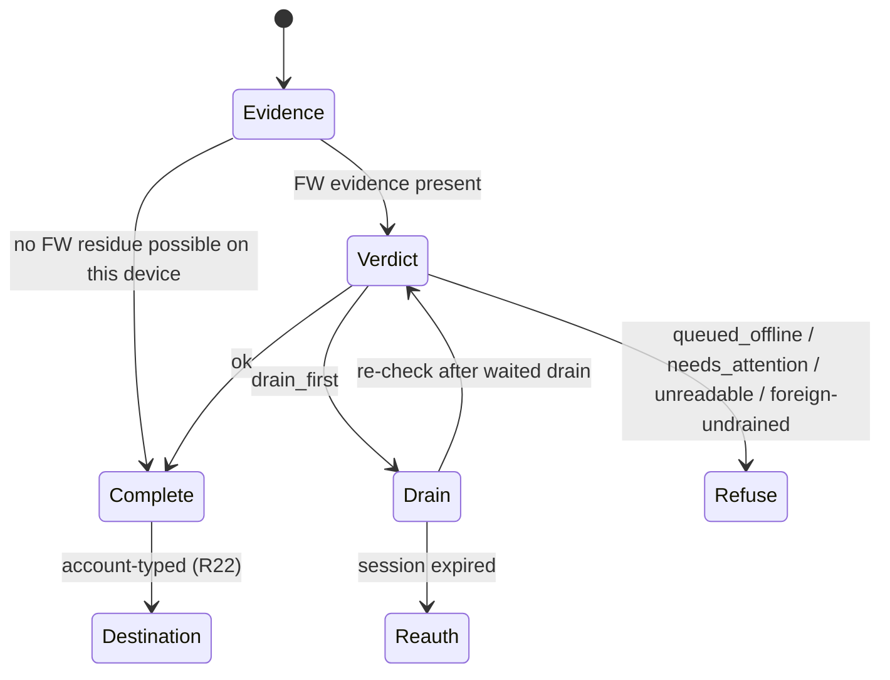
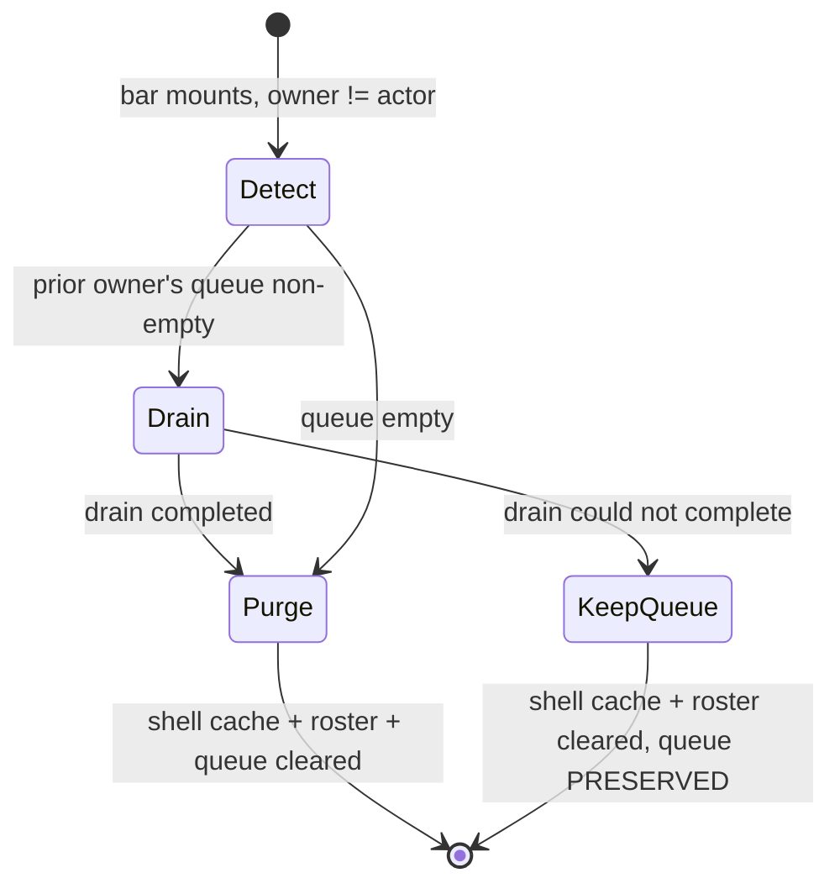

# feat: The Staff Front Door

## Overview

A new top-level `/staff` hub becomes the front door to The 120's staff tools, with hub-and-spoke return navigation to the admissions CRM and Founders Weekend ops. One persistent nav bar carries account identity and sign-out across every guarded staff surface. `/fp/fw` gains chrome it has never had. Founders Weekend cohorts gain an archive flag so the hub's weekend count reports real weekends rather than rehearsal residue.

**Six things planning changed from the origin document**, each recorded in Key Technical Decisions:

1. R16's gate already exists and is already portable — this is a mounting problem, not a new mechanism. But it sits on a **live defect in `main`** this work would weaponise, so that defect ships **first and standalone**.
2. R25 becomes a property of the **board read**. The origin's assumption that this is free turned out to be wrong; the honest cost is stated.
3. R19's "filter at the staff call sites" is the riskier of two options. The read carries `archivedAt` and each caller decides.
4. The hub's weekend figure gets its **own narrow read** rather than the four-way paginated fan-out.
5. **The guide-facing slice ships early, not last** — it is the only slice that can regress live check-in, and it needs calendar buffer before the Aug 17 dry run, not just dry-run minutes.
6. **Archiving refuses three write paths the origin's scope boundary excluded** — bulk import, student-linking, and guide-grant-add. Declared here rather than smuggled in: the retire-in-place learning says guard the mutation choke point, and importing a roster into a weekend staff believe is retired is exactly that failure. Only the board-token mint refusal traces to an R-number (R25).

## Problem Frame

See origin: `docs/brainstorms/2026-07-26-staff-front-door-requirements.md`.

`/fp/fw` is the guide's cohort switcher, not an admin surface — no chrome, no sign-out, and copy that tells staff to ask staff. `/fp/fw/ops` works but is linked only from the per-cohort guide header, reachable only from inside a cohort. `/crm` and `/fp` have no links between them despite sharing one session.

**Confirmed during planning:** four `kind='fw'` cohorts exist in production — `rehearsal-unit9` (90 students), `unit5-verify` (0 students, sitting on Boston's own Aug 21–23 dates), `rehearsal-unit4-second` (4), `rehearsal-unit4` (30). All four windows are in the future, so "next weekend by start date" today names a rehearsal.

**Closed during planning:** `rehearsal-unit4` carried a **live projected-board token** with three weeks to run — the repo's only unauthenticated read surface. Revoked 2026-07-27 via `npm run fw -- token-revoke`, verified by re-read; no live tokens remain on any cohort. The students were `-Rehearsal`-suffixed synthetic records, so no real child's name was exposed. Recorded because Unit 8's read-side enforcement is what stops the same state recurring invisibly.

## Requirements Trace

- **R1–R5a** — hub page, two cards, live numbers, degradation, chrome, noindex → Units 2, 3, 11
- **R6, R7** — staff gate with rewrite-based 404 semantics; sign-in *and* reset land on `/staff` → Units 2, 12
- **R8–R10** — hub-and-spoke return navigation → Units 3, 4
- **R11–R14** — `/fp/fw` repairs → Unit 4
- **R15–R18** — one nav bar; sign-out as a queue constraint; account identity; three exclusions → Units 3, 4
- **R19–R21** — archive flag, attribution, retiring the four cohorts → Units 6, 7, 9, 10
- **R22–R24** — sign-out destination by account; unconditional sign-out; the bar's contents → Unit 3
- **R25, R26** — archiving closes the public board door; archived cohorts listable and reversible → Units 7, 8, 9

## Scope Boundaries

Carried from origin: no Path staff administration (`/fp` still 404s for staff); the family app does not adopt the bar and the projected board never will; no display names (the bar shows the account email); no cross-application dashboard; `/fp/fw/ops` does not move; the staff sign-in stays at `/crm/login`.

Added during planning:

- **Archiving does not disable a cohort.** It is staff visibility plus a closed public board door. Guide check-in and guide quick-create both continue to work — deliberately, and tested.
- **Archiving refuses bulk import, student-linking, and guide-grant-add.** This *narrows* the origin's "no changes to roster management" boundary. See Overview item 6.
- **An archived cohort can still mint new minors' auth accounts** via guide quick-create. Accepted consequence of the check-in decision, named here rather than left implicit, and covered by a test that says so.
- **Unarchiving does not restore a board token.** Tokens are one-way.
- **`claimGuideInviteAction` remains outside R16's interlock.** It deliberately signs a claiming guide in over whatever session a shared iPad held. This work does not close that path and must not claim to.

## Context & Research

### Relevant Code and Patterns

**The layering canon** — a pure rules module with no `next`/`@supabase`/`react` imports, a `*-core.ts` taking `db` as a parameter, and a thin `"use server"` action holding no policy. Action shape: `gate → zod → authorize → decide (pure) → mutate via core → interpret → typed result`, with `input: unknown` + `safeParse`, one collapsed `STAFF_ONLY` refusal, an **extracted** failure-copy function with a `default`-less switch, and `revalidatePath` naming every changed surface.

**There is no jsdom.** Every decision must be a pure exported function with its own test; components get rendering only.

**`vitest.config.ts` `include` is an allowlist** and `app/staff` is not in it.

**Sign-out today, three ways that disagree:** the CRM does a client-side `signOut()` with no gate landing on `/crm/login`; the FW ops header is a plain server-action form with **no** gate landing on `/fp/fw/sign-in`; only the per-cohort `FwSignOutButton` is drain-gated.

**`path_cohorts` columns:** `id`, `slug`, `created_at`, `kind`, `starts_at`, `ends_at`, `created_by`, `time_zone`. `created_by` is nullable with `on delete restrict`, from `supabase/migrations/20260801120000_fw_ops_audit.sql:191`. Latest migration on disk is `20260804120000`.

**`revokeFwBoardToken`** takes an **optional** `expectedTokenId` — *"omitted only by callers with no view that could be stale."*

**Board reads, and why the archived check placement matters.** `resolveFwBoardToken` reads `path_fw_board_tokens` only and produces the collapsed **404**. `loadFwBoard` reads `path_cohorts` for `kind` and signals every fault as an untyped `{ok:false}`, which `feed/route.ts` maps to **503** — deliberately: *"the token is GOOD; the read just failed. 503 tells the poller to hold its last frame."* `FwBoard.tsx` honours that: it clears the frame only on 404 and **keeps the last frame on 503**. `loadFwBoardShell` reads `slug` only, skips even the `kind` re-check, and cannot fail.

### Institutional Learnings

| Learning | Bearing |
|---|---|
| `docs/solutions/best-practices/offline-drain-reuses-a-fail-closed-signal-across-a-safety-boundary-irreversible-action-needs-tri-state-2026-07-24.md` | The sign-out verdict was already burned once by this exact class of bug. Any check-then-destroy must observe one serialized snapshot and fail closed. |
| `docs/solutions/logic-errors/retire-in-place-soft-delete-keeps-the-relationship-row-so-the-write-path-stays-reachable-guard-the-mutation-choke-point-2026-07-24.md` | Guarding list reads while leaving the mutation reachable shipped a P1 through full review. Unit 8's guard table exists because of this — **and so do its PROCEED rows**, whose tests stop a later reviewer "fixing" them. |
| `docs/solutions/test-failures/middleware-proxy-is-testable-next-experimental-testing-server-2026-07-21.md` | `unstable_doesMiddlewareMatch` works under plain-node vitest with an `AsyncLocalStorage` bridge line. Extract the branch production calls, never a parallel helper. |
| `docs/solutions/workflow-issues/split-phase-migrations-pre-deploy-schema-post-deploy-purge-separate-files-rerun-2026-07-14.md` | Schema and backfill are two files with two timestamps. |
| `docs/solutions/integration-issues/supabase-cli-stale-db-password-management-api-workaround-2026-07-13.md` | All production SQL goes through the Management API. PRE-APPLY probes; POST-APPLY verification **before** recording the version. |
| `docs/solutions/test-failures/migration-parity-assertions-that-cannot-fail-2026-07-23.md`, `…must-scope-to-its-table-2026-07-23.md` | Strip SQL comments before parsing; anchor scans on the table name. A new migration is exactly the kind of file that hijacks a sibling scanner. |
| `docs/solutions/test-failures/vitest-include-allowlist-new-test-dirs-silently-never-run-2026-07-18.md` | Add the `app/staff` glob in the same commit as the first staff test. |
| `docs/solutions/build-issues/env-less-build-hangs-render-time-supabase-clients-and-undefined-fetch-url-2026-07-17.md` | `ResetForm.tsx` carries a lazy `supabaseRef` pattern to survive env-less prerender. Do not regress it. |
| `docs/solutions/security-issues/guard-function-with-no-callers-is-not-a-mechanism-2026-07-23.md` | `LoginForm.tsx` is on a reviewed-call-site allowlist pinned by `no-auth-mail-guard.test.ts`. |
| `docs/solutions/integration-issues/postgrest-max-rows-1000-silently-truncates-unranged-select-paginate-and-refuse-2026-07-24.md` | `listFwCohortsForActor` is currently unpaginated. Unit 9 widens its staff result set, so Unit 9 paginates it. |
| `docs/solutions/best-practices/tailwind-v4-theme-not-scopable-inline-literals-two-namespace-classname-swap-2026-07-22.md` | Two token sets share one utility namespace. A component serving both does a class-name swap keyed on a narrowed literal. Note `skinClass()` has no `crm` namespace — follow the pattern, do not call the function. |

### External References

None gathered; local patterns are dense and on point. **AGENTS.md's mandate stands as an execution-time obligation** — read `node_modules/next/dist/docs/` before touching `proxy.ts`, carried as an execution note on Unit 2.

## Key Technical Decisions

**Unit 1 ships first, standalone, on its own branch.** `decideFwSignOut` counts only *drainable* entries while `clearFwQueueIfEmpty` uses a bare `store.count()`. One blocked or foreign entry yields `ok:true` then `cleared:false`, forever, with copy claiming a fresh capture arrived. Today that is escapable on `/fp/fw` via the queued indicator's dismiss control; the moment sign-out exists on `/staff`, the only escape is clearing site data. It traces to no R-number, has no dependencies, and is independently shippable — so it is not bundled into this plan's branch.

**The Web Lock is acquired at exactly one level.** `runFwClientDrain` already takes `navigator.locks.request("fw-offline-drain", …)`, and Web Locks are **not reentrant** — wrapping the sequence in the same named lock would deadlock (outer holds, inner requests, outer awaits inner) or, on the `ifAvailable` path, silently skip the drain and refuse in a loop. Extract a lock-free inner drain that both the background kick and the sign-out sequence call, and acquire the lock once, in the sequence.

**Reconciliation drains before it purges.** `reconcileFwCacheOwner` calls `purgeFwResidue`, which does an **unconditional** `clearFwQueue()` — justified in its docblock by *"block-until-drained already prevented an offline handoff,"* an argument that holds only where a drain engine is mounted. Moving reconciliation to the bar without changing that would make the bar's mount the mechanism that destroys a prior guide's verified check-ins, on a surface with no engine. So the bar's mount attempts a waited drain under the lock first; **if the drain cannot complete, it does not purge the queue** (shell cache and roster still reconcile). This is the R7/R16 handover fix and the data-loss fix in one.

**`FwPwa` is split; it is not mounted globally.** Its Background Sync effect awaits `navigator.serviceWorker.ready`, which off `/fp/fw` matches no registration and **never settles**. Broadening the scope to `/` would put the FW worker in control of the marketing site. Verdict, drain, clear, and reconcile travel with the session; SW registration and the queued indicator stay in `/fp/fw`. `FwPwa`'s own reconcile effect is **removed** when the bar takes it over — leaving both would race two reconciles on one localStorage key.

**Identity and every role-derived branch render client-side.** `/fp/fw` navigations are cached into `path-sw-fw-shell-v1`, from which `/fp/fw/ops` is already excluded so authed HTML never sits in a shared iPad's cache. This covers more than the email: the staff-only hub link and the role-branched zero-cohort copy are equally role-revealing, and a cached shell that differs between a staff and non-staff visit leaks role to the next holder. **Offline behaviour is specified, not deferred:** identity persists client-side keyed to the reconcile owner, so a cached shell with no network still names the account — neither cached HTML nor a network call.

**R25 is enforced in `resolveFwBoardToken`, and the cost is real.** Putting it in `loadFwBoard` — the "free" placement, since that read already fetches `kind` — produces a **503**, which tells the poller to *hold its last frame*. An archived cohort's projector would keep displaying children's names indefinitely under a "catching up" chip: the exact opposite of the requirement. Only 404 clears the frame, and 404 comes from token resolution, which reads only the token table. So this **adds a `path_cohorts` read to every four-second poll per live board**. The origin's "costs no round trip" claim was wrong. The requirement survives the correction; the justification changes.

**Revoke first, then archive.** Archive-then-revoke failing between leaves an archived cohort with a live board — invisible (hidden from the ops list) and harmful. Revoke-then-archive failing between leaves an active cohort with a dark board — visible, recoverable, not an exposure.

**Minting refuses on an archived cohort**, ordered after `cohort_not_fw` and before `no_event_window`. The test fixture must use a **future** window: the four production cohorts' windows will be past by the time anyone tests, so `window_passed` would refuse incidentally and a missing guard would look fine.

**Archiving does not block guide check-in or quick-create.** Nothing on the check-in path can see `archived_at`, and blocking it would violate "no guide-facing behaviour changes." Quick-create proceeds because a guide who can check in must be able to add the child in front of them. The consequence — a new minor's auth account can be created inside a cohort hidden from staff's default list — is accepted and named in Scope Boundaries with a test that says so. Both defaults are structurally invisible, so both get **positive-invariant tests named for their reason**, or a reviewer applying the retire-in-place learning will file them as P1s and "fix" them.

**Every archive guard lives in the core**, because `scripts/fw-ops.ts` drives the cores under service-role credentials with no action-layer gate.

**The read carries `archivedAt`; callers decide.** The origin's "filter at the staff call sites" does not survive the call site it fails to enumerate: `app/fp/fw/(app)/cohort/[cohortId]/layout.tsx` uses one list for the header's weekend name *and* the switcher. Filtering there makes a staff member opening an archived cohort see the fallback `"This weekend"`. **And `canSwitch` counts every cohort the actor holds, archived or not** — filtering it would strand a guide inside an archived cohort with no Switch link back, which is precisely the guide-facing regression the criterion forbids.

**The hub's weekend figure gets its own narrow read.** `listFwActiveWeekends` is one paginated query; the existing dated read fans out to three further paginated scans for one integer.

**Unarchive nulls both columns.** Attribution describes the *current* state, not a history, and no audit row is written — so reversal genuinely loses who archived it. Accepted.

**The archive action gates with `requireCohortStaff`** because the archive is cohort-scoped and only that helper loads the cohort and refuses a `kind='path'` id. It also hardens the actor id against `resolveFwActorForCohort`'s synthetic `userId: ""` session, which matters because `archived_by` is an FK. (`resolveFwStaffGate` returns a real id and is already used for `created_by` — it is not unsafe for attribution, merely not cohort-aware.)

**`/staff`'s 404 rewrite target reuses `/crm/staff-only`.** A rewrite leaves the URL bar reading `/staff`, so the CRM-branded path is never visible.

## Open Questions

### Resolved During Planning

- *Is the rehearsal board token live?* Yes — **revoked 2026-07-27**, verified.
- *Does a display name exist?* No. The bar shows the account email.
- *Which audit mechanism for archiving?* Cohort attribution columns; the audit table's subject column is `not null` and a cohort has no human subject.
- *Sticky or floating?* **Sticky**, matching both FW headers and the family shell.
- *Does the CRM tab row survive?* Yes, as its own row.
- *Where does the archived board check go?* `resolveFwBoardToken`, for 404 semantics. The page shell is gated too — see Unit 8.
- *What does the bar show offline?* Persisted client-side identity keyed to the reconcile owner.

### Deferred to Implementation

- *Exact helper and component names.*
- *The evidence-predicate mechanism* for "could this device hold FW residue at all?" — candidates are the `fw.cacheOwner` localStorage key or an `indexedDB.databases()` probe. **Safari does not support `databases()`, and Safari is the shared-iPad browser**, so the localStorage key is the likely answer. Unit 1 names the requirement; the mechanism is a small implementation call.
- *Whether the whole-chunk import refusal is a new result variant or N per-row `failed` outcomes* — `RunFwImportChunkResult` is currently `{ outcomes }` and the core's contract is "never rejects."
- *Whether `narrowOpsCohort`'s stricter narrowing can null a pre-migration row* on the ops path.
- *Exhaustive `revalidatePath` set for archive/unarchive.*

## High-Level Technical Design

> *This illustrates the intended approach and is directional guidance for review, not implementation specification. The implementing agent should treat it as context, not code to reproduce.*

**The sign-out interlock (R16).** This is a client-side **interlock**, not an enforceable invariant — the queue is on the device and the session is a cookie, so a direct action call or a cleared cookie bypasses it. Review against the success criterion, not the phrase "must not complete."

The lock is acquired **once**, by this sequence, around a lock-free inner drain.

**Reconciliation on a device that changed hands.**

## Implementation Units

### Phase 1 — Close the live defect (standalone; ships now, on its own branch)

- [x] **Unit 1: Make the sign-out check and act agree** — landed 2026-07-27. Five commits on `fix/fw-signout-check-act-predicate`. **97 files / 2647 tests passing** (from 96 / 2638), `tsc --noEmit` clean. No migration. **All 13 planned test scenarios covered 1:1**, plus a 14th (`unknown` evidence is not absence). Both test files confirmed collected by `vitest list` — `app/fp/**/__tests__/**` was already in the include allowlist, so the trap did not bite here; **it will for Unit 2, which adds `app/staff`.** **Implementation (`a067d6d`):** `classifyFwSignOutQueue` partitions once into drainable / ownBlocked / quarantined / foreignUndrained / foreignBlocked; `countFwSignOutBlockers` is the one definition of "not empty enough to wipe"; `fwEntryBlocksSignOutClear` is that counter applied to a singleton, and `clearFwQueueIfEmpty` now takes it as a parameter instead of holding its own `store.count()` opinion. **Four deviations from the brief, all confirmed defensible in review:** a `drain_stalled` reason was added (behind a captive portal `onLine` is true, so `drain_first` was an infinite "try again in a moment"); the lock became an injected port (`FwSignOutPorts.withDrainLock`) because the repo is node-only; the sequence and every refusal string moved out of `FwSignOutButton.tsx` for the same reason; and the now-unused `fwSignOutVerdict` export was deleted (zero orphaned callers, verified after the greppability fix below). **Review — 13 personas, full pass:** 3 P0, 3 P1, 4 P2, 8 P3. **Nine of the eleven significant findings are pre-existing** and are carried into Units 3–5 below. Nothing faulted the unification itself; multiple reviewers independently verified that check and act now agree, that the evidence gate short-circuits before any IndexedDB call or lock acquisition, that the TS2366 tripwire is real (via `strictNullChecks`, not the `default`-less switch shape the comment credits), and that the `as Promise<T>` cast on `navigator.locks.request` fixes a genuine `lib.dom.d.ts` inference gap rather than hiding unsoundness. **Fixes applied during review:** `63b151d` — `fwStudentTaskKey` held two *literal* NUL bytes, which made the entire file binary to ripgrep; a recursive search for a symbol declared and used three times in it returned zero results and exit code 1, and `git diff` never flagged it (its heuristic scans ~the first 8KB; the bytes sat at offset ~46,880 of ~49,900). Replaced with the `\x00` escape — byte-identical at runtime, transient Map key, nothing to migrate. Same commit pinned the three refusal copies (`queued_offline`, `drain_first`, `needs_attention`) that were asserted only for pluralization, so a copy edit could silently break this unit's own Verification. `40bdcc1` — bounded the client's await of the `drainFwQueue` action (`FW_ACTION_TIMEOUT_MS`, separate from and larger than the per-round-trip `FW_CALL_TIMEOUT_MS`; `withFwTimeout` gained a defaulted budget parameter so no existing caller changed). A timeout is disposed of exactly as the throw branch is — queue untouched, attempts not advanced, session not blamed — so the re-verdict returns `drain_stalled` and the fix composes with the state this unit added rather than inventing one. `fw-call.ts` had no test file; it has one, including the shape that actually breaks you (a promise that never settles). `1121638` — corrected two comments asserting "Safari does not implement `indexedDB.databases()`" (true pre-2024, Baseline since May 2024) and recorded where the evidence gate can fail **open**. **Owed to Peter:** the on-device dry run. Nothing in `fw-queue.ts`'s real IndexedDB path, nor `withFwDrainLock`'s real `navigator.locks` branch, is exercised by CI — node-only, by design — so the atomic clear, the fallback chain, and the "throwing predicate aborts the transaction" claim rest on the dry run alone.

**Goal:** The emptiness test that destroys the queue and the verdict authorising it observe the same predicate, so no device can be wedged into an unescapable sign-out loop.

**Requirements:** None — a pre-existing defect. Prerequisite for R16.

**Dependencies:** None. **Ships as its own change, not as part of this plan's branch.**

**Files:**
- Modify: `app/fp/lib/fw-sync-rules.ts`, `app/fp/lib/fw-queue.ts`, `app/fp/lib/fw-sync-client.ts`
- Modify: `app/fp/fw/components/FwSignOutButton.tsx`
- Test: `app/fp/lib/__tests__/fw-sync-rules.test.ts`, `app/fp/lib/__tests__/fw-sync-engine.test.ts`

**Approach:**
- Classify entries as drainable / blocked / quarantined / foreign, and make **both** the verdict and the clear read that classification. A blocked entry has an authoritative reject row server-side and must not block a clear. Quarantined entries block.
- **Foreign entries: a single disposition, not an either/or.** A foreign *undrained* entry **refuses**, with copy naming the other account. Only foreign entries that are already *blocked* are eligible for reconciliation. Reconciliation destroys undrained work, so the choice is stated rather than left to the implementer.
- Add a refusal state for **session expired** — today a drain returning `no_session` leaves the verdict at `drain_first` forever while the copy says "still sending."
- Add an **evidence predicate** ahead of the fail-closed branch. `fwSignOutVerdict` currently calls `openFwDb()` unconditionally, *creating* the queue database on a CRM-only staff member's browser; if that open rejects, their sign-out blocks permanently.
- **Extract a lock-free inner drain.** `runFwClientDrain` already holds `fw-offline-drain`; Web Locks are not reentrant. Both the background kick and the sign-out sequence call the inner function; the lock is acquired at exactly one level.

**Execution note:** Test-first. Every state is expressible against the pure decision module before any client code moves.

**Test scenarios:**
- *Happy path:* empty queue → ok → clear succeeds → sign-out proceeds.
- *Happy path:* three own drainable entries online → `drain_first`; after a waited drain, ok.
- *Edge case:* exactly one **blocked** entry → verdict ok and the clear **succeeds**.
- *Edge case:* one foreign **undrained** entry → **refuses**, copy names the other account.
- *Edge case:* one foreign **blocked** entry → eligible for reconciliation, does not wedge.
- *Edge case:* one quarantined entry → `needs_attention` with a count.
- *Error path:* queue read throws with FW evidence present → fails closed.
- *Error path:* queue read throws with **no** FW evidence → ok, sign-out completes.
- *Error path:* drain returns `no_session` → copy names re-authentication. Assert the string.
- *Error path:* captive portal, `onLine` true but drain fails → copy escalates rather than repeating indefinitely.
- *Integration:* capture enqueued between verdict and clear → clear reports not-cleared, sign-out aborts.
- *Integration:* **the sequence does not deadlock** — drain invoked from inside the sign-out sequence completes; assert the lock is acquired exactly once.
- *Integration:* two documents, drain in one and sign-out in the other → no entry survives the clear.

**Verification:** No queue state produces a refusal the user cannot act on from the surface they are standing on. Sign-out never hangs.

### Phase 2 — Route scaffold

- [x] **Unit 2: `/staff` route, gate, and proxy** — landed 2026-07-27. Seven commits on `feat/staff-front-door-unit-2`. **99 files / 2666 tests passing** (from 97 / 2647), `tsc --noEmit` clean, `rm -rf .next && next build` clean with `/staff` reported `ƒ (Dynamic)`, `eslint` clean on the touched files. No migration. **All seven planned test scenarios covered**, plus three supplements. **Allowlist entries added to `vitest.config.ts`: one** — `app/staff/**/__tests__/**/*.test.{ts,tsx}`, in the same commit as `app/staff/__tests__/staff-route.test.ts` and confirmed collected by name via `npx vitest list --filesOnly`. **The trap did not bite, and it can no longer bite anyone:** `app/lib/__tests__/vitest-include-coverage.test.ts` now fails when any test file in the repo falls outside `include`. **Implementation:** `config.matcher` gains `"/staff/:path*"` (still a literal array); `isStaffPath` is exact-or-slash and **exported** — unlike `isFwPath` — because `/staff` and `/crm` resolve to the same outcomes, so a `/staffing` leak is invisible at the outcome level and only the predicate can witness it; `resolveAdminClaimOutcome` extracts the gate the two share, since R6 is a sameness requirement and Unit 1 shipped to fix exactly the shape of two predicates that must agree written twice. `requireStaff()` memoized in place (trap 12). Page body is a placeholder with two working links; Unit 11 fills it. **Review — 12 personas, full pass.** Security, correctness, api-contract, performance and agent-native found nothing. **The finding that mattered came from mutation testing:** deleting the `/staff` branch left all 50 tests green, because it returns exactly what the catch-all returns — five reviewers converged on it independently. Its value is entirely in being wired up, which makes it the `guard-function-with-no-callers` shape, and a duplicate-code pass would have deleted a security guard with nothing going red. `staff-route.test.ts` now asserts the wiring in source **and its position ahead of the catch-all**; the reviewer's mutation now reddens. **Also fixed in review:** `resolveAdminClaimOutcome` returns a three-member `Extract<>` subset, so a fourth value — which would be a gated branch skipping `carryOverAuthState`, i.e. a silently dropped session — is now a compile error rather than something a runtime test must notice; **two comments asserted false things about Next** (`/crm` does *not* carry `force-dynamic`, and an undeclared page inherits `robots` from its nearest ancestor, not the root layout) — exactly what AGENTS.md's read-the-docs mandate exists to prevent; the coverage tripwire's own `SEARCH_ROOTS` was a hardcoded list reproducing the same hole one level up, now discovered from the filesystem; `tinyglobby` moved to `devDependencies` (it resolved only because npm flattens a transitive of vitest); `requireStaff()`'s staff-row query error was discarded, so a transient DB fault and a revoked account both rendered as 404 with nothing to distinguish them afterwards — now logged, still fail-closed; and `requireStaff()`'s docblock claimed to follow `fw-auth.ts`'s precedent when it **inverts** it, caught by two reviewers independently. **Three learnings written** (one an upgrade to the existing vitest-allowlist doc rather than a near-duplicate), plus an aftermath note on the rename-straggler doc, whose scanner reads raw source lines including comments — a test fixture trips it, and so does the comment explaining why. **Carried forward: B5 on Unit 5.**

**Goal:** `/staff` exists, is staff-only, and refuses non-staff with in-place 404 semantics — giving the bar a mount target.

**Requirements:** R1, R5a, R6

**Dependencies:** None.

**Files:**
- Create: `app/staff/layout.tsx`, `app/staff/page.tsx` (placeholder body; Unit 11 fills it)
- Modify: `proxy.ts`, `app/lib/supabase/proxy-rules.ts`, `vitest.config.ts`
- Test: `app/crm/__tests__/proxy-rules.test.ts`

**Approach:**
- Matcher gains `"/staff/:path*"`, still a statically analyzable literal array.
- An **explicit** `/staff` branch resolving to the existing `crm-staff-only` outcome (which the wrapper already renders as a rewrite to `/crm/staff-only`). Exact-or-slash matching so `/staffing` cannot inherit it.
- The new branch routes through `carryOverAuthState`.
- Page gate reuses `requireStaff()`; `force-dynamic`; own `metadata` with `robots: {index:false, follow:false}`.
- **`requireStaff()` is not `cache()`-memoized** while `loadFwSession` is. Units 3 and 4 mount staff-dependent chrome across several layouts, so wrap it following `loadFamilyContextCached`'s precedent — otherwise every surface below pays an extra staff-row query per render over venue wifi. (Origin flagged this; it was missing from the first draft of this plan.)

**Execution note:** Read `node_modules/next/dist/docs/` before editing `proxy.ts` — AGENTS.md mandate. Test-first: the matcher assertion is writable before the matcher changes.

**Test scenarios:**
- *Happy path:* `/staff` and `/staff/` match the middleware; a nested path matches.
- *Edge case:* `/staffing` does **not** match; `/` and `/dashboard` still do not.
- *Happy path:* session-less `/staff` → outcome routes to the staff sign-in.
- *Happy path:* signed-in without the admin claim → outcome is `crm-staff-only`. **Assert the outcome string, not `isRewrite`** — the rewrite-vs-redirect branch lives in `proxy.ts`, which this repo documents as untestable (no way to construct real Next cookie/header objects). Inventing a parallel helper to test it is the precise trap the middleware learning warns about.
- *Happy path:* signed-in with the claim → `pass`.
- *Edge case:* the rewrite destination resolves to `pass` session-less — the existing loop check, extended.
- *Edge case:* a test under `app/staff/**/__tests__/` appears by name in bare `npx vitest run`.

**Verification:** A guide typing `/staff` sees a 404 at the `/staff` URL, and their session survives.

### Phase 3 — The bar and `/fp/fw` (the guide-facing slice — earliest calendar, largest rehearsal)

- [x] **Unit 3: The persistent staff bar** — landed 2026-07-27. Four commits on `feat/staff-front-door-unit-3`. **102 files / 2775 tests passing** (from 99 / 2666), `tsc --noEmit` clean, `rm -rf .next && next build` clean with `/staff` still `ƒ (Dynamic)`, `eslint` clean on every touched file. No migration. **No `vitest.config.ts` change: zero allowlist entries added** — `app/lib/**/__tests__/**` already covered `app/lib/staff-bar/__tests__/`, confirmed by name via `npx vitest list --filesOnly`, and the Unit 2 coverage tripwire still passes. **All 14 planned test scenarios covered**, plus the B1 test written first and watched to fail exactly as predicted (`{kind:"sign_out"}` returned while three captures sat undrained). **Implementation:** `bar-rules.ts` holds every decision — application label, hub-link predicate, sign-out destination, identity string and its offline fallback, queue chip, and the two-token-set class swap; `StaffBar.tsx` composes and renders; `actions.ts` carries two Server Actions. **Identity is fetched over a Server Action, not passed as props** — client-component props serialize into the SW-cached `/fp/fw` shell, so a prop-borne email or role would leave a cached shell that differs between a staff and a non-staff visit. The bar takes only `application` and an opaque `actorUserId`. **B1/B2/B3 all fixed** (see below). **Deviation from the plan, deliberate:** `FwPwa.tsx`'s `reconcileFwCacheOwner` effect was **NOT removed** — the plan's Files list schedules it here, but the Key Technical Decisions text says "removed *when the bar takes it over*", and Unit 4 is what mounts the bar. Removing it now would leave `main` with **no** reconcile on the one subtree where shared iPads change hands. A new tripwire counts reconcile owners mounted in the FW subtree and reddens at **zero or two**, so Unit 4 cannot half-do the swap. **Review — 13 personas, full pass:** 1 P0, 7 P1, 12 P2, 4 P3. **The headline finding had FIVE independent reporters** and is Unit 2's lesson recurring inside the unit meant to apply it: two decisions (`identity?.isFwGuide ?? true` and `surfaceCreatesResidue: application === "fw"`) were written inline in the `.tsx`, and flipping either left all 218 tests green. Worse, the first was *shared* between sign-out and the queue chip — fail-closed is correct for a destructive gate and wrong for an observational read, so the chip opened (and therefore **created**) the FW queue database on an admissions staffer's browser, permanently, since nothing deletes it and the existence probe then answers `true` forever. Split into `staffBarSignOutActorIsFwGuide` (fails closed) and `staffBarQueueProbe` (declines to look), both taking the LIVE read only — a persisted identity can predate a mid-event guide grant. **Also fixed in review:** the reconcile's resolved outcome was discarded by a bare `.catch()` (the typed outcome exists precisely to make failure visible — half of B2); `indexedDB.databases()` and the in-lock queue read were unbounded and both can HANG, not merely reject, the second while the cross-document drain lock is held; `FwSession` now carries `email`, removing a duplicate `auth.getUser()` round trip per bar mount; one `resolveStaffBarRoles` replaces two hand-written copies of the staff predicate; a ref guards sign-out re-entrancy; a thrown `getItem` no longer flips the `useSyncExternalStore` snapshot; the `IDBFactory` cast was unnecessary (`lib.dom.d.ts:18088` declares `databases()` non-optional) in the very docblock warning against false claims about that API. **Three of my own source-scans were defeated by reviewers** — an R23 check walked through with `{Boolean(identity) && …}`, a branch assertion satisfied by the *comment* explaining the branch, and a subject resolved via `process.cwd()`; all now strip comments, anchor on semantics, and resolve from `import.meta.url`. **17 mutations applied; all 17 reddened a test.** **Three learnings written** (one an update to `checking-a-lazily-created-client-resource-creates-it-…`, whose own prediction came true and whose `indexedDB.databases()` conclusion this unit reversed). **Carried forward: B4 and B5 remain on Unit 5.** **New for Unit 4:** `FwSignOutButton.tsx` still swallows the `redirect()` digest; the reconcile-owner tripwire must be flipped in the same change that mounts the bar. **Newly reachable consequence to weigh, not yet decided:** mounting the sign-out interlock on `/crm` means a CRM-only staffer can be refused sign-out by *another* account's stuck FW queue (`foreign_queue`), with a remedy outside their control. R16 scopes the constraint to "the signing-out account", so this exceeds it — but Unit 1's five-class disposition is settled, so it is recorded here rather than changed.

**Goal:** One bar carrying account identity, sign-out, the hub link, an application label, and queue state — usable on any guarded staff surface.

**Requirements:** R5, R15, R16, R17, R22, R23, R24

**Dependencies:** Units 1, 2

**Files:**
- Create: `app/lib/staff-bar/StaffBar.tsx`, `app/lib/staff-bar/bar-rules.ts`, `app/lib/staff-bar/__tests__/bar-rules.test.ts`
- Modify: `app/fp/lib/fw-sync-client.ts` (export the portable sequence)
- Modify: `app/fp/fw/components/FwPwa.tsx` (**remove** the `reconcileFwCacheOwner` effect — it moves here)

**Approach:**
- **Every decision is a pure function** in `bar-rules.ts` — application label, whether the hub link renders, sign-out destination by account, queue-chip state and copy. No jsdom exists; a decision inside a `.tsx` is invisible to CI.
- **Identity and every role-derived branch render client-side**, persisted keyed to the reconcile owner so an offline cached shell still names the account.
- **The sign-out sequence is Unit 1's**, lock acquired once.
- **Reconciliation drains before purging.** If the drain cannot complete, the queue is preserved and only the shell cache and roster reconcile.
- **Sign-out renders unconditionally** (R23) — if identity fails, the string degrades, the control does not.
- **Destination follows the account** (R22); an account holding both resolves staff-first.
- Sticky, `top-0`. Two token sets by class-name swap keyed on a narrowed literal — follow `skinClass()`'s pattern; it has no `crm` namespace, so a new literal table is needed.
- Note `app/lib/` currently holds no `.tsx`; this is a new convention, and the existing `app/lib/**/__tests__/**` glob already covers the rules test.

**Blockers carried from Unit 1's review (2026-07-27) — evidence-backed, not speculative.** Each is pre-existing in `main`; none is a Unit 1 regression; all three become *reachable* precisely because this unit mounts the bar outside `/fp/fw`.

- **B1 — the evidence gate fails OPEN, and this unit is what makes it reachable (P0, four reviewers converged).** `hasFwDeviceEvidence` returns "no evidence" for `cacheOwner === null && !queueDbOpened`, which is indistinguishable from "holds an undrained queue but localStorage was evicted" — localStorage and IndexedDB evict independently, and `queueDbOpened` is per-document and false on every fresh load. Sign-out then skips the queue check entirely. It is unreachable today **only** because `FwPwa` opens the database on every mount of the layout that renders the button; that is incidental coupling, and this unit breaks it. **Do not harden the client-storage heuristic** — whether the actor is an FW guide is known SERVER-side at the layout. Gate on that. The code comments at `fw-queue.ts` and `fw-sync-rules.ts` now say so.
- **B2 — `purgeFwResidue` unconditionally destroys undrained captures (P0), and its failure is unobservable (P1).** The Approach above already requires draining before purging; the review adds two things it does not yet cover. First, `reconcileFwCacheOwner` calls the purge on *every* mount where identity differs, which is the ordinary shared-iPad handover when the outgoing guide never tapped sign-out (crash, revoked grant, forgotten) — the code contradicts itself about this, asserting "block-until-drained already prevented an offline handoff" forty lines from a comment listing exactly the handovers where it did not. Second, `purgeFwResidue` returns `Promise<void>` and swallows all three clears, and `reconcileFwCacheOwner` then overwrites `fw.cacheOwner` **unconditionally** — so a failed purge is permanently masked and never retried, because the owner key now matches. **Moving the reconcile here must fix both**, or this unit's careful drain-before-purge is undone by the same unconditional overwrite.
- **B3 — `clearFwResidue` reports `{cleared:true}` when it partly failed (P1).** Its own comment promises "all three residues together, or none", but `cleared` is computed solely from the queue step; a throwing `clearFwRoster()` or `caches.delete()` is logged and swallowed. `runFwSignOutFlow` treats `cleared:true` as authorisation to end the session, so the previous guide's cached roster — children's first and last names — and the authenticated shell can survive for the next operator. The bar's sign-out inherits this.

**Execution note:** Test-first on `bar-rules.ts`.

**Test scenarios:**
- *Happy path:* no residue → sign-out completes, destination by account.
- *Integration (B1):* a device with a **real undrained queue** but no `fw.cacheOwner` and a fresh document → sign-out must NOT skip the check. Assert the captures survive. This test fails today.
- *Integration (B2):* identity mismatch at mount with undrained captures and no connectivity → captures preserved, `fw.cacheOwner` **not** advanced, so the next mount retries.
- *Error path (B3):* the roster or shell-cache clear throws → sign-out does not report success.
- *Happy path:* staff → staff sign-in; guide → guide door; both → staff.
- *Edge case:* hub link renders for staff, not for guides — and the decision is client-evaluated, so it is absent from cached HTML.
- *Edge case:* application label differs between CRM and FW surfaces.
- *Edge case:* queue chip states — drainable, offline, attention, foreign, expired-session — map to distinct copy.
- *Edge case:* offline on a cached shell → identity still renders from persisted state.
- *Error path:* identity read fails → sign-out still renders.
- *Error path:* three queued captures, sign-out from `/staff` → refuses with a count. Same from `/crm`.
- *Integration:* **device handover with an undrained foreign queue and no connectivity → the queue is preserved, not purged.** Assert the captures still exist.
- *Integration:* device handover with connectivity → drain completes, then purge.
- *Edge case:* copy never promises automatic sending where the sync engine is not running.

**Verification:** The same device state produces the same verdict from every guarded staff surface, and no reconcile destroys undrained work.

- [x] **Unit 4: Mount the bar and repair `/fp/fw`** — landed 2026-07-27. Six commits on `feat/staff-front-door-unit-4`. **102 files / 2810 tests passing** (from 102 / 2775), `tsc --noEmit` clean, `rm -rf .next && next build` clean with `/staff` still `ƒ (Dynamic)`, `eslint` clean on every touched file. No migration. **Zero allowlist entries added** — `bar-wiring.test.ts` and `fw-nav-rules.test.ts` both already existed under covered globs; the Unit 2 coverage tripwire still passes. **All 6 planned test scenarios covered**, plus the CRM contract pair the plan's scenario list asks for (all six sections reachable; both rows keep the mechanism that meets 375px). **Implementation:** the bar mounts in the three outermost guarded layouts taking `application` + `actorUserId` only; `signOutFwGuide` and `FwSignOutButton` are **deleted, not unlinked**; `CrmTabs` gives up identity and sign-out and keeps its six tabs; `FwPwa`'s reconcile effect is deleted in the same change that mounts the bar, and the tripwire is flipped rather than loosened; R12/R13/R14 land as pure functions in `fw-nav-rules.ts`. The bar publishes its measured height as `--staff-bar-h` and the two FW headers offset by it — two `sticky top-0` elements do not stack, and the bar's height is not constant (it wraps at 375px and grows a line for the queue chip). **29 mutations applied across the unit; all 29 reddened a test**, and two that survived the first pass exposed genuinely missing assertions (the sticky offset, and which session field feeds `actorUserId`). **Two decisions taken to Peter, both answered:** (1) **R16 was scoped properly rather than deferred** — a departed guide's undrained captures no longer refuse *anyone else's* sign-out, because R16 says "captures **for the signing-out account**" and the original justification (reconciliation would destroy them) was removed by Unit 3's B2 fix. `countFwSignOutBlockers` drops `foreignUndrained`; `fwEntryBlocksSignOutClear` becomes the three-way `fwEntryClearDisposition`; `clearFwQueueIfEmpty` becomes `clearFwQueueUnlessBlocked` and deletes selectively by cursor; `foreign_queue` is deleted from the refusal union. **Boston was cancelled during this unit** (Peter, 2026-07-27; target is now September) — which is what changed the answer from "defer, this is Unit 1 core surgery days before the event" to "build it right." **Every remaining Boston/Hamptons calendar argument in this plan is now reasoning from a stale premise.** (2) **R13's role-branched copy renders SERVER-side**, a deliberate deviation from the plan's client-side default, recorded in `fwPickerZeroState`'s docblock: this page's cohort list, headline and redirect are all already role-derived server decisions, so moving one sentence to the client buys a flicker on the screen a guide reads at shift start and closes nothing. **Review — 13 personas, full pass.** `project-standards` returned **zero findings** and verified every Next claim against `node_modules/next/dist/docs/` with file+line citations (layouts not re-rendering on navigation; props serializing into the RSC payload; a `"use server"` export staying POST-addressable; `redirect()`'s digest) — the check that caught false Next claims in Units 2 and 3 held clean this time. **The finding that mattered was the evidence gate**, and it is Unit 3's P0 recurring by the exact mechanism its own solution doc predicted: `hasFwDeviceEvidence` checked `actorIsFwGuide` **before** the non-creating `queueDbExists` probe, which was safe only while that value arrived as a server-rendered prop on the component this unit deletes. The bar's equivalent fails closed to `true` while identity is in flight and R23 keeps the button live throughout — so a CRM-only staffer tapping sign-out early reached `openFwDb()` and **created the FW database on their browser, permanently**. The fact now outranks both guesses; B1 is intact. **Also fixed in review:** a `queueRemaining = 1` sentinel made a thrown clear indistinguishable from a legitimate preserve and advanced the owner key over it (B2 one layer down) — now `number | null`; the disposition is consumed through an exhaustive switch and deletes only on an explicit `"remove"`; the O(1) `store.clear()` is back for the no-preserve case so the cross-document lock is not held proportional to queue size; the height publish moved to `useLayoutEffect`; four docblocks that contradicted the change they shipped in. **Three of my own source scans were defeated by the testing reviewer with live proof** (`identity === null || (…)`, `application == "fw"`, `isStaff === true ?`) — all now anchor on operator adjacency, and all six reviewer-authored mutations are killed. **Declined with reasons in code:** special-casing the identity fetch off `/crm` and `/staff` (would give the bar two identity paths), and splitting `bar-wiring.test.ts` three ways. **Compound: one new learning + five corrected** (68 docs) — the new one is deploy skew on a deleted Server Action; three candidates turned out to be already-documented and were folded into the docs that predicted them. **Carried forward to Unit 5, three needing Peter:** quarantined records are still not actor-scoped (the same R16 gap, three reporters, unfixable here because it needs a resolved identity the tap does not have); no `deploymentId` is configured, so a stale bundle can wipe a device and leave the session alive; and the R16 fix made a real failure mode **quieter** — nothing off-device reports that an iPad holds someone else's captures.

**Goal:** Every guarded staff surface carries the bar; the disagreeing sign-outs are retired; `/fp/fw` gets chrome and role-correct copy.

**Named by Unit 1's review (2026-07-27):** "the disagreeing sign-outs" is not an abstraction — `app/fp/fw/(app)/ops/layout.tsx` signs out via a bare `<form action={signOutFwGuide}>` with **no verdict, no drain, no evidence gate, and no atomic clear**. A guide who is also staff can capture check-ins in the cohort view, then sign out from `/fp/fw/ops` and skip block-until-drained entirely, abandoning the queue on a shared iPad. Both doors sit inside the same `(app)` layout for the same actor. Retiring it is the whole point of this unit; assert it, do not assume it. Second finding, lower severity: `FwSignOutButton.tsx` awaits `signOutFwGuide()` — which `redirect()`s — inside a generic `catch` with no `isNextRedirect` check, while `drainFwQueueOnce` checks exactly that one module away. If the digest throw reaches the catch, a *successful* sign-out reports "Couldn't sign out just now." Latent today because the redirect navigates before the message paints; this unit changes the surfaces it renders on, so verify it against `node_modules/next/dist/docs/` rather than by inspection.

**Requirements:** R8–R14, R15, R16, R18, R24

**Dependencies:** Unit 3

**Files:**
- Modify: `app/staff/layout.tsx`, `app/crm/(app)/layout.tsx`, `app/fp/fw/(app)/layout.tsx`
- Modify: `app/crm/components/CrmChrome.tsx`, `CrmTabs.tsx`
- Modify: `app/fp/fw/(app)/ops/layout.tsx`, `app/fp/fw/(app)/cohort/[cohortId]/layout.tsx` (**remove** their sign-out controls only)
- Modify: `app/fp/fw/components/FwSignOutButton.tsx` (retired from the cohort layout)
- Modify: `app/fp/fw/(app)/page.tsx` (R12, R13, R14)
- Test: `app/fp/lib/__tests__/fw-nav-rules.test.ts`

**Approach:**
- **Mount in the outermost guarded layout per application only** — `app/staff/layout.tsx`, `app/crm/(app)/layout.tsx`, `app/fp/fw/(app)/layout.tsx`. The ops and cohort layouts **nest inside** the FW one; mounting in all five would render the bar two or three levels deep. Those two layouts change only by dropping their own sign-out controls and keeping their surface-specific context.
- Unauthenticated doors sharing the prefixes get nothing (R18) — which falls out of mounting in `(app)` groups rather than by URL prefix.
- **The CRM's six section tabs survive as their own row**; only identity and sign-out move up.
- **R14 lands here**, before any archiving exists — `isStaff` is already computed at `app/fp/fw/(app)/page.tsx:44`, before the redirect at line 72.
- R13's zero-cohort copy branches on role.

**Test scenarios:**
- *Happy path:* staff with exactly one cohort at `/fp/fw` → picker renders, no redirect. Guide with one → redirected, unchanged.
- *Happy path:* staff with zero cohorts → "none exist yet" plus a create path. Guide with zero grants → unchanged copy.
- *Edge case:* the bar renders **once** on `/fp/fw/ops` and on `/fp/fw/cohort/X`, not twice or three times.
- *Edge case:* a guide at `/fp/fw` sees no hub link; a signed-in student or parent sees neither hub link nor staff headline.
- *Integration:* sign-out from `/fp/fw/ops` as staff → staff sign-in; from `/fp/fw/cohort/X` as a guide → guide door.
- *Edge case:* all six CRM sections still reachable; the 375px contract holds with the bar above the tab row.

**Verification:** No guarded staff surface lacks identity or sign-out; no unauthenticated door has either; the bar appears exactly once per page.

- [x] **Unit 5: Service-worker discipline and the dry-run checklist** — landed 2026-07-27. Three commits on `feat/staff-front-door-unit-5`. **107 files / 2917 tests passing** (from 102 / 2810; the count includes Lane B's funnel Unit 1, merged mid-session — this unit's own additions are 5 test files / ~90 tests), `tsc --noEmit` clean, `rm -rf .next && next build` clean with `/staff` still `ƒ (Dynamic)`, `eslint` clean on every touched file. No migration (Lane A does not hold the lock). **Zero allowlist entries added** — every new test file sits under already-covered globs; the Unit 2 coverage tripwire still passes. **B4 and B5 both closed, as one reliability pass, and neither was closed the way the plan's one-line remedy implies.** B4: `loadFwSession` became the THREE-WAY `loadFwSessionRead` (`IdentityRead`: identity | none | unknown, the third member deliberately non-nullable and non-falsy so the old `if (!session)` collapse is a compile error) — because a bounded call that reported its timeout as `null` would have been strictly worse than the hang: null means signed-out, and `requireFwSession` redirects on it, mid-shift, with captures on the device. An unreadable GRANTS query is unknown too, not an account with zero grants — that list becomes the bar's `isFwGuide`, the server-known half of B1. B5: `resolveStaffAccess` gained `unavailable`, ordered AFTER the JWT-claim check (an unreadable row must never upgrade a caller refused on evidence in hand — the ordering is pinned by a mutation test); `requireStaff` THROWS `IdentityUnavailableError` instead of redirecting to the 404 that told active staff their account did not exist. `error.tsx` at the app root, `/staff` and `/crm` over one tested pure copy function, using `unstable_retry` (re-fetches) not `reset` (re-renders the same payload — a Try-again that cannot try). **Boundary placement is not uniform and the files say why**: error.tsx does not wrap its OWN segment's layout, so `/staff`'s gating layout bubbles past `app/staff/error.tsx` to the root, while `(app)` being a route group means `app/crm/error.tsx` DOES catch `/crm`'s gate. **The plan's SW-scan wording was not implementable as written** — "nothing outside `app/fp/fw/**` calls serviceWorker.register" fails on day one because `PathPwa` legitimately registers at `/fp` from `app/fp/components/pwa/` — so the shipped scan is strictly stronger: set EQUALITY over exactly two allowed files PLUS a per-file call-site count (file-set equality alone is blind to a rogue second call inside an allowed file), with bracket-notation patterns and a `sync?.register` exclusion, all self-tested. FwPwa's `scope: FW_SW_SCOPE` is pinned INSIDE the register call's own argument list (a whole-file `toContain` is satisfied by a decoy literal). **The checklist landed as `docs/plans/fw-dry-run-checklist.md`** — no date, `status: unscheduled`, per the cancelled-calendar rule — owning the five CI-invisible paths plus Unit 5's own changes, with the automatable items annotated. **Three decisions taken to Peter, all three answered and shipped:** (1) **quarantined records no longer refuse anyone's sign-out** — the R16 correction applied to the class Unit 4 could not reach (no readable `actorUserId` to scope by); they are PRESERVED by the clear via an explicit branch, because dropping them from the blocker count alone would have routed them to the `remove` tail; `needs_attention` left the refusal union and took the entire `surface` copy parameter with it. (2) **`deploymentId` configured** (`NEXT_DEPLOYMENT_ID` → `VERCEL_DEPLOYMENT_ID` → `VERCEL_GIT_COMMIT_SHA`, undefined locally by design), with the resolution ORDER verified by a test that sets all three and re-imports — the first draft mirrored the production formula and passed for any order. (3) **the residue beacon shipped** as a structured `[fw/residue]` log line (a table needs a migration; carried to Unit 6): the server logs its AUTHENTICATED sender and the client's CLAIMED actor separately, because a handover racing the fire-and-forget POST otherwise attributes A's residue to B — the mismatch is the race made visible; plus a persisted random `deviceId` (the "which iPad" field an account id cannot be), `schemaVersion: 1`, `console.log` not `console.error`, and one bounded `getUser()` instead of the full session read. **Review — 13 personas, full pass: 11 findings actioned.** project-standards returned ZERO findings again (every Next claim verified against `node_modules/next/dist/docs` with citations); correctness confirmed from React 19's source that `cache()` replays a rejection identically within a request. The two biggest catches: **the B4 throw was unhandled in 3 of 5 `resolveFwActorForCohort` call sites** (fw-import's own `requireCohortStaff`, fw-checkin, fw-student — all now catch into the typed `unavailable` their clients already treat as retryable, pinned by a structural try/catch-adjacency scan that survived two defeat rounds of its own); and **`writeOwner`'s discarded boolean** meant a private-mode iPad re-ran the DESTRUCTIVE handover reconcile on every remount all shift — an in-memory owner now backstops the unwritable key. Also: symmetric logging at every gate's terminal branch (a silent timeout and a silent revocation were indistinguishable from logs, defeating B5's stated purpose); the root boundary's copy split from the gated boundaries' (it fronts anonymous marketing visitors, to whom "you are still signed in" was a false authentication claim); client-side bound on the sign-out await; 2s retry-button cooldown; `requireStaff` rewritten so the compiler proves the return (the `as {email}` cast was hiding a type mis-shape); five defeatable tests hardened. **Mutation testing: 9 applied across work+review, all 9 reddened a test** — including two that defeated the review fixes' own first drafts (the import-presence guard, twice). **Compound: 3 docs updated in place** (deploy-skew debt discharged; the classifier doc's predicted quarantine sibling closed as a second occurrence; source-scanning ROUND 4 — renumbered in rebase, Lane B landed its own ROUND 3 the same day) **+ 4 new (72 total)**. **Carried to Unit 6, needing Peter: a successful sign-out over preserved foreign residue never beacons** — `FwSignOutOutcome`'s success member carries no count, so the common orderly-sign-out-over-a-foreign-queue case produces no off-device record; extending the union is his scope call. **Carried, not needing Peter:** `requirePathUser` is B4's named un-fixed twin (both calls bare, both states terminal); the beacon's persistent store (the migration unit's business); `bar-wiring.test.ts` split (still optional); `clear_failed` still refuses sign-out (revisit only with dry-run evidence — now a checklist item).

**Goal:** The guardrails that would catch a broadened worker scope or a cached identity exist, and the Aug 17 dry run has a document that owns it.

**Requirements:** R18, and the origin's dry-run obligation

**Dependencies:** Unit 4

**Files:**
- Modify: `app/fp/lib/__tests__/sw-discipline.test.ts`
- Modify: `app/fp/lib/fw-auth.ts` (see B4)
- Create: `docs/plans/2026-08-17-fw-dry-run-checklist.md`

**Approach:**
- **B4 — carried from Unit 1's review (P1, three reviewers). `loadFwSession()` is the one FW Supabase call not wrapped in `withFwTimeout`.** Its `getUser()` and `path_role_grants` select are both bare, and it is the *first* thing `drainFwQueue` does — inside the client's Web Lock. `fw-sync.ts` wraps the per-cohort authz resolve forty lines later with the comment *"it runs inside the client's Web Lock, so an unguarded hang here would wedge the single-drainer"*; the call that runs first, in the same lock, has no such guard. Unit 1 bounded the **client's** leg of this (`40bdcc1`), which caps the damage, but the server-internal half is still unguarded and belongs with this unit's reliability pass. Wrap it; a timeout is UNKNOWN → retry, never a terminal refusal.
- **B5 — carried from Unit 2's review (2026-07-27; P1, reliability reviewer, 0.82). `requireStaff()` is the CRM/staff twin of B4, and Unit 2 made it hotter.** Neither of its two Supabase calls — `getUser()` and the `staff` row select — is wrapped in any timeout or `AbortSignal`, and there is **no `error.tsx` at `app/staff`, `app/crm`, or the app root**, so a genuine exception (as opposed to the intentional `redirect()` digest) surfaces as Next's generic framework error page. Unit 2 added a new top-level route whose layout *and* page both gate through it, and Units 3–4 mount staff-dependent chrome across three more layouts — so a hang is now a hard stop for the front door to every staff tool, bounded only by the platform's serverless timeout. This is pre-existing code, but B4's own argument applies verbatim: it is the reliability pass's business, and the two belong in one change. Note the plan's Risks table already anticipated the *cost* of these reads on venue wifi (mitigated by Unit 2's memoization) but not their *unboundedness*.
- `sw-discipline.test.ts` pins `scope: SW_SCOPE` for `PathPwa` only. Add the equivalent for `FwPwa`, plus a repo-wide check that nothing outside `app/fp/fw/**` calls `serviceWorker.register`.
- Assert the general navigate clause still caches nothing.
- **The checklist is a standalone document**, not an edit to `docs/plans/2026-07-23-001-feat-fw-cohort-sprints-plan.md` — that plan is `status: completed` with every box checked and is the historical record of what shipped. It gets a pointer, nothing more. The checklist lands in Phase 3 so it exists well before the event it governs.

**Test scenarios:**
- *Edge case:* `FwPwa` registers with `FW_SW_SCOPE`; mutate to `"/"` and the test reddens.
- *Edge case:* no component outside `app/fp/fw/**` calls `serviceWorker.register`.
- *Edge case:* the general navigate clause caches nothing.
- *Integration (dry run):* guide captures offline, navigates to `/staff`, signs out → refuses with a count.
- *Integration (dry run):* guide A leaves an undrained queue and closes the tab; staff B signs in and lands on `/staff` → **B's sign-out works AND A's captures still exist or were drained.** Not merely "does not wedge."
- *Integration (dry run):* CRM-only staff sign out normally with no FW residue.
- *Integration (dry run):* guide A signs in, closes the tab, device offline, guide B opens the same URL → the cached shell shows no email **and no staff-only affordance**.
- *Integration (dry run):* **guide-account rehearsal of Unit 1 and Unit 4** — the guide sign-out control and the guide picker page both changed, and neither is staff-only.

**Verification:** The checklist names the behaviour this work introduces, on the accounts that will meet it.

### Phase 4 — Archive (staff-only surfaces; guide reads unchanged)

- [x] **Unit 6: Archive schema migration** — landed 2026-07-27. Three commits on `feat/staff-front-door-unit-6`. **110 files / 2971 tests passing** (from 107/2917; includes Lane B's funnel Unit 2, rebased onto mid-unit), `tsc` clean, `next build` clean with `/staff` still `ƒ (Dynamic)`, eslint clean. Zero allowlist entries. **THE MIGRATION LOCK MOVED TO LANE A in this PR** (Peter, 2026-07-27), and **the plan's filename was stale on arrival**: Lane B's funnel Unit 1 consumed `20260805120000`, so the archive file is `20260806120000_fw_cohort_archive.sql` — exactly as the handoff predicted; re-check `ls supabase/migrations/` at authoring time, always. **Applied to production via the Management API** with the full PRE/POST ritual (to_regclass; column count 0→2; per-column data_type/is_nullable; `confdeltype = 'r'`) before recording each version — and one operational lesson: PowerShell tool calls do not share state, so the credential-read + apply + verify + record sequence must be ONE invocation (a split attempt failed cleanly pre-auth and applied nothing). **Two more of Peter's decisions shipped in the same window, each its own artifact:** (1) `20260806130000_fw_residue_reports.sql` — the beacon's durable table (9 cols, RLS-on-no-policies; `session_user_id` CASCADE because telemetry must not block account deletion, `claimed_actor_user_id` deliberately FK-less because its value is that it may disagree with reality; device-recency index). A second FILE, not a widening — separate rollback, separate reviewers' questions. (2) **The beacon gap**: `{kind:"sign_out"}` gained `queueRemaining`, and an orderly sign-out over preserved foreign work now reports as `queue_preserved` — same fact, other door, one desk vocabulary; zero stays silent; 13 engine expectations updated with the count each scenario actually preserves. **Review (5 personas fit the diff; project-standards zero findings again) produced the unit's two real catches:** the success-path report was fire-and-forget and RACED `auth.signOut()` — two requests, no ordering, and when sign-out won the beacon authenticated against a dead session and was silently DROPPED on the exact path it was approved for (correctness 0.72); and the beacon action was writable by ANY authenticated account, letting a parent poison the table staff physically act on (security 0.68). One mechanism fixed both: `signOutStaffBar` takes the residue payload as a second zod-validated argument and writes the row ITSELF, before ending the session — same request, no race, authenticated by construction — while the fire-and-forget action (now reconcile/refusal paths only) gained an `isStaff || isFwGuide` gate plus a 20-per-10-min rate limit. **Also from review:** the zod-vs-CHECK vocabulary scan was hijackable by a decoy comment (proven live) — now comment-stripped and schema-block-anchored; comma-bounded clause slices became line-bounded; the sibling-hijack guard's comment now states what it actually checks; the unreachable `queueRemaining === null` branch is labelled defence-in-depth with the reason its reconcile twin IS load-bearing. `residue-beacon-action.test.ts` covers the action's exit paths including session-vs-claim attribution and the flood limit. **7 mutations this unit (5 migration + 2 review-fix), all reddened.** Compound: 2 docs updated (the beacon doc's ROUND 2; the scan doc's ROUND 4 coda — which then CONFLICTED with Lane B's same-day ROUND 5 on the same doc, resolved coda-first) + 1 new (`add column if not exists` gates the whole clause, FK included) — **74 docs**. **Carried: the lock stays with Lane A** (Units 7–8 have no migration; Unit 10's is next; hand-back is a Unit 10-time question), `requirePathUser` (B4's twin) still open, retention policy for the reports table unset (volume is low by construction; revisit with dry-run data).

**Goal:** `path_cohorts` carries archive state and attribution.

**Requirements:** R19, R20 — **Dependencies:** None.

**Files:** Create `supabase/migrations/20260805120000_fw_cohort_archive.sql`; Test `app/fp/lib/__tests__/fw-archive-migration-parity.test.ts`

**Approach:** `archived_at timestamptz` and `archived_by uuid references auth.users (id) on delete restrict`, both **nullable**, idempotent — direct siblings of `created_by`. **SCHEMA ONLY.** No new audit action and no widening of `FW_OPS_AUDIT_ACTIONS`. Timestamps run ahead of the calendar; `20260804120000` is current latest.

**Execution note:** Apply via the Management API immediately. PRE-APPLY `to_regclass`; POST-APPLY column verification **before** recording the version.

**Test scenarios:**
- *Happy path:* both columns added idempotently; `archived_by` carries `on delete restrict` and no `cascade`.
- *Edge case:* neither column is `not null` — isolate the statement and assert the absence.
- *Edge case:* no `insert into`, no `update public.` — schema-only.
- *Edge case:* the `FW_OPS_AUDIT_ACTIONS` set-equality assertion still passes untouched.
- *Edge case:* the new file does not hijack a sibling scanner — run `fw-ops-migration-parity`, `fw-migration-parity`, `fw-move-task-parity`, `evidence-migration-parity`, `audit-actions-parity`.

- [x] **Unit 7: Archive and unarchive cores** — landed 2026-07-27. Three commits on `feat/staff-front-door-unit-7`. **112 files / 3032 tests** (includes Lane B's funnel Unit 3, rebased onto), `tsc`/`next build`/eslint clean, `/staff` still `ƒ`. No migration; the lock rests with Lane A untouched. **All nine plan scenarios plus three the review demanded.** Implementation to the plan's letter: revoke-first-then-archive with a failed revoke STOPPING the archive (the recoverable-state inverse — revoke landed, archive write failed → active cohort, dark board — has its own test); `no_active_token` folded into success in the archive's interpretation, not the revoke core; CAS both directions (`is`/`not("archived_at","is",null)`) with `.select("id")` zero-rows semantics; unarchive nulls BOTH columns and deliberately leaves the board dark (R25 survives the round trip: unarchive-then-mint issues a NEW token, the old URL never resolves again — tested); every guard in the CORE because the CLI drives it gateless; `COHORT_COLUMNS` + `narrowOpsCohort` widened FAIL-CLOSED-TO-VISIBLE (a pre-migration row shape reads active — the harmful direction is a phantom archive); copy in `fw-ops-rules.ts` (pure, tested), actions gate→zod→core→copy, CLI verbs `archive`/`unarchive`. The deferred revalidate set resolved as `/fp/fw/ops` + the cohort page + `/fp/fw`. **Review (correctness zero findings, testing 2, adversarial 4) pulled Unit 8's mint guard FORWARD:** merging Unit 7 alone left the archive's central promise defeatable — no archived check in `fwBoardTokenMintVerdict` meant one bookmarked mint re-opened a retired weekend's projector (adversarial 0.9, with the board READ also unguarded until Unit 8 — no second fence). `cohort_archived` now sits in the verdict, ordered after `cohort_not_fw` and before the window pair, tested under the plan's own future-window fixture rule; PLUS the reviewer's second-order find (0.7): mint's write is two steps, so a concurrent archive between revoke-prior and insert slips past a read-time check — closed with an insert-time re-check that revokes the just-minted token (compensation loud if IT fails). **Unit 8 keeps the read-side half** (resolveFwBoardToken 404, list filtering, the guard table) and its first test is mint-vs-archive through the real routes. **Testing's find (0.85):** unarchive's CAS had no twin of the archive's stale-read test — its deletion survived the suite; added, plus the gate-POSITION scan over every exported fw-ops action (gate before the core gets a client). **The sticky-proxy lesson:** the stale-read test's first draft detached at the first `.eq()` (`.bind` returns the real builder) and passed while injecting nothing — caught because mutation M17 survived it; the fake also now THROWS on unsupported filter operators rather than silently no-opping a CAS test into theatre. **CLI: archive REQUIRES `--actor`** (durable user-visible attribution; the first-active-staff-row fallback pinned arbitrary names) and the `unavailable` copy warns the board may ALREADY be dark (the revoke runs first — a bogus `--actor` FK failure was a silent projector outage). **8 mutations (M17–M24), all reddened — two of them caught the tests' own first drafts.** Compound: 2 docs updated (the phased-plan doc's second occurrence: invariants do not take turns; the scan doc's fake-seam coda) — 75 docs. **Carried:** `loadFwOpsCohort` collapses not-found and read-failed into one null (pre-existing, low); true-concurrency CAS semantics rest on Postgres, unit-verifiable only as modelled races.

**Goal:** Archiving revokes the live board token and then sets archive state, with no partial state invisible.

**Requirements:** R19, R20, R25 — **Dependencies:** Unit 6

**Files:** Modify `app/fp/lib/fw-ops-core.ts`, `app/fp/lib/fw-ops-rules.ts`, `app/fp/lib/actions/fw-ops.ts`, `scripts/fw-ops.ts`; Test `fw-ops-core.test.ts`, `fw-ops-rules.test.ts`

**Approach:**
- **Revoke first, then archive.** Call the core `revokeFwBoardToken` with **no** `expectedTokenId`; fold `no_active_token` into success in the archive's own failure-copy function, not in the core it calls.
- **CAS both directions**, `.select("id")`, zero rows → typed `already_archived` / `already_active`.
- Unarchive nulls **both** columns.
- Gate with `requireCohortStaff` — the archive is cohort-scoped and only that helper loads the cohort and refuses a `kind='path'` id, and it hardens the actor id against the synthetic empty-id session.
- Add the columns to `COHORT_COLUMNS` and a fail-closed line to `narrowOpsCohort`.

**Test scenarios:**
- *Happy path:* archive with a live token → token revoked **then** archive set; assert ordering.
- *Happy path:* archive with no token ever minted → succeeds.
- *Happy path:* unarchive → both columns null; cohort reappears.
- *Edge case:* two concurrent archives → one succeeds, other reports `already_archived`; `archived_by` names the **first** actor.
- *Edge case:* unarchive an active cohort → `already_active`, not an error.
- *Error path:* a `kind='path'` id → refused by the gate's cohort read.
- *Error path:* the revoke fails → archive does **not** proceed.
- *Error path:* non-staff caller → the collapsed `STAFF_ONLY` message.
- *Integration:* unarchive then mint → a new token; the old URL never resolves again.

- [ ] **Unit 8: Read-side enforcement and the write-path guard table**

**Goal:** An archived cohort's public board door is closed as a property of the read, and every reachable write path has an explicit tested verdict.

**Requirements:** R19, R25 — **Dependencies:** Unit 6

**Files:** Modify `app/fp/lib/fw-board-loader.ts` (`resolveFwBoardToken` **and** `loadFwBoardShell`), `app/fp/lib/fw-board-rules.ts`, `app/fp/lib/fw-import-core.ts`, `app/fp/lib/fw-ops-core.ts`, `app/fp/lib/fw-guide-core.ts`; Tests across the matching suites.

**Approach:**

| Write path | Core | Verdict |
|---|---|---|
| Guide check-in / task move | `fw-checkin-core.ts` | **proceed** ✓ audit-confirmation |
| Offline drain replay | inherits check-in | **proceed** ✓ |
| Guide quick-create | `fw-student-core.ts` | **proceed** ✓ (creates a new minor — see Scope Boundaries) |
| Student anonymize | `fw-ops-core.ts` | **proceed** ✓ privacy obligation |
| Revoke a guide grant | `fw-ops-core.ts` | **proceed** ✓ never block de-escalation |
| Reject / exception resolution | `fw-ops-core.ts`, `fw-import-core.ts` | **proceed** ✓ |
| Revoke board token | `fw-ops-core.ts` | **proceed** ✓ inert post-archive |
| **Mint a new board token** | `fw-board-rules.ts` | **refuse** ← R25 |
| **Board read (feed + page)** | `fw-board-loader.ts` | **refuse** ← R25 |
| **Bulk CSV import** | `fw-import-core.ts` at `runFwImportChunk` | **refuse** ← added scope |
| **Link an existing student** | `fw-ops-core.ts` | **refuse** ← added scope |
| **Add a guide grant** | `fw-guide-core.ts` | **refuse** ← added scope |

- ✓ rows are **audit confirmations** that no regression occurred; ← rows introduce new restrictions. The distinction is marked so a future scope reviewer need not reverse-engineer it.
- **The archived check goes in `resolveFwBoardToken`**, not `loadFwBoard` — only 404 clears the projector's frame; 503 makes it hold. This adds a `path_cohorts` read per poll. `loadFwBoardShell` is gated too, so the page does not paint a titled shell for a retired weekend.
- The import guard sits at `runFwImportChunk`, **not** `provisionFwStudent`, which is shared with quick-create.
- The mint's archived branch goes after `cohort_not_fw`, before `no_event_window`.
- Every guard in the core — `scripts/fw-ops.ts` bypasses the action layer.

**Test scenarios:**
- *Happy path (invariant):* a guide checks in to an archived cohort → the event **lands**. Named for its reason.
- *Happy path (invariant):* guide quick-create on an archived cohort → **succeeds**, and the test names the consequence: a new minor's account inside a cohort hidden from staff's default list.
- *Happy path:* offline drain replays into an archived cohort → lands, no reject.
- *Error path:* mint on an archived cohort **with a future window** → refused with an archived reason. The future window is load-bearing.
- *Error path:* the same mint via `scripts/fw-ops.ts` → also refused.
- *Error path:* `archived_at` set directly in SQL **without** revoking, then poll the feed → **404**, and the client **clears the frame**. This is the test that distinguishes read-property from side-effect.
- *Error path:* the board **page** for an archived cohort → does not paint a titled shell.
- *Error path:* CSV import chunk POSTed directly → refused; zero accounts, zero memberships.
- *Error path:* `provisionGuideAction`, `linkStudentAction` on archived → refused.
- *Happy path:* `revokeGuideGrantAction`, `anonymizeStudentAction`, reject/exception resolution on archived → succeed.

**Verification:** Every row has a test, including PROCEED rows.

- [ ] **Unit 9: Archive-aware list reads and ops surfaces**

**Goal:** Staff can archive, list archived, and unarchive — and no guide notices.

**Requirements:** R19, R26, R3's count contract — **Dependencies:** Units 7, 8

**Files:** Modify `app/fp/lib/fw-ops-core.ts`, `app/fp/lib/fw-guide-core.ts`, `app/fp/fw/(app)/ops/page.tsx`, `app/fp/fw/(app)/ops/cohort/[cohortId]/page.tsx`, `app/fp/fw/(app)/page.tsx`, `app/fp/fw/(app)/cohort/[cohortId]/layout.tsx`; Create `app/fp/fw/components/FwArchiveControl.tsx`

**Approach:**
- `listFwOpsCohorts` excludes archived ids **before** the three-way fan-out.
- `listFwActiveWeekends` — one paginated query for the hub.
- `listFwCohortsForActor` gains `includeArchived` and returns `archivedAt` per row — **and gains `fetchAllRows`/`.range()`**. It is currently unpaginated, and this unit widens its staff result set with rows that accumulate permanently and can never be deleted, so this is the unit that must paginate it.
- The cohort layout takes everything: the header name resolves against the unfiltered list, and **`canSwitch` counts every cohort the actor holds** so a guide inside an archived cohort keeps the Switch link.
- The archived ops detail page renders in **archived mode** — banner, Unarchive, and the de-escalating and obligation controls kept; roster-building affordances removed from the page *and* refused server-side. Not a 404: unlike a tombstoned student, an archived cohort has legitimate remaining actions.
- The board-token panel stays unconditionally rendered — a prior frontend-races review found a conditional render unmounting a just-minted, unrecoverable URL.
- `slug_taken` copy points at the archived list.

**Test scenarios:**
- *Happy path:* ops list omits archived by default; `includeArchived` includes them with correct counts and a "Board revoked" chip.
- *Happy path:* `listFwActiveWeekends` returns only non-archived, with dates.
- *Edge case:* **archived cohort with `archived_at` set and `archived_by` null** — the state all four backfilled cohorts ship in, and the only attribution state present at launch → the banner renders the date and states the actor is unrecorded, not blank or "undefined."
- *Edge case:* guide holds X (active) and Y (archived) → `/fp/fw` shows both, Y's header shows Y's slug, **and standing inside Y the Switch link still renders**.
- *Edge case:* guide holds only Y (archived) → redirected into Y, never told they hold no grants.
- *Edge case:* staff with two cohorts, one archived → picker shows one, no redirect (R14 already landed in Unit 4), hub count 1.
- *Edge case:* staff open an archived cohort's guide view directly → header shows its slug, not `"This weekend"`.
- *Edge case:* all cohorts archived → zero-state copy with a create path.
- *Edge case:* slug matching an archived cohort → `slug_taken`, message routes to the archived list.
- *Integration:* `listFwCohortsForActor` still returns a typed failure distinct from an empty list.

- [ ] **Unit 10: Retire the four production cohorts**

**Goal:** The hub's first factual claim is true the day it ships.

**Requirements:** R21 — **Dependencies:** Units 6, 7, 9

**Files:** Create `supabase/migrations/20260805130000_fw_archive_rehearsal_cohorts.sql`

**Approach:** A separate file from Unit 6 per the split-phase convention. All four in scope — none is a real weekend, and `unit5-verify` sits on Boston's own dates. Sets `archived_at` only, leaving `archived_by` **null** per `created_by`'s recorded rationale. `WHERE`-guarded on slug so it is a no-op on a fresh environment. Board tokens are already all revoked as of 2026-07-27, but the verification asserts it anyway — a column-only archive on a cohort with a live token is precisely the invisible state Unit 8 prevents.

**Test expectation:** none — a data migration with no application code. Its correctness is the POST-APPLY verification query.

**Verification:** All four have `archived_at is not null`; every token on all four has `revoked_at is not null`; `npm run fw -- cohorts` shows an empty active set.

### Phase 5 — The hub

- [ ] **Unit 11: The hub page**

**Goal:** Two application cards with one live number each, neither of which can hide a door.

**Requirements:** R1, R2, R3, R4 — **Dependencies:** Units 2, 9

**Files:** Modify `app/staff/page.tsx`; Create `app/staff/lib/hub-rules.ts`, `app/staff/__tests__/hub-rules.test.ts`

**Approach:** CRM number from `getSeatsRemaining()`, FW number from `listFwActiveWeekends`, read concurrently. **"Next weekend" is a pure function** — sort by `starts_at` ascending, exclude nulls, name the earliest still upcoming; a weekend in progress and an all-past set each get a defined outcome. **R4's asymmetry is stated in the code:** the FW read degrades to a number-less card; `getSeatsRemaining()` cannot report failure and may render a stale constant. Clock read outside the component body. CRM token set via class-name swap.

**Test scenarios:**
- *Happy path:* two upcoming → count 2, "next" names the earlier.
- *Edge case:* a weekend in progress today → assert which one "next" names.
- *Edge case:* all past → defined copy, no "next."
- *Edge case:* null `starts_at` → neither crashes nor wins "next."
- *Edge case:* zero non-archived → zero-state copy with a create path.
- *Error path:* FW read typed failure → card renders, link works, number absent.
- *Error path:* seats falls back → card renders; the code does not claim it is live.

- [ ] **Unit 12: Post-authentication landing**

**Goal:** Both authenticated entry points land on the hub.

**Requirements:** R7 — **Dependencies:** Units 4, 11 (the hub must be real **and** carry sign-out before staff are sent there)

**Files:** Modify `app/crm/login/LoginForm.tsx`, `app/crm/reset/ResetForm.tsx`

**Approach:** Two hard-coded `router.push("/crm")` sites become `/staff`. The reset path matters more — it is a new staff member's first session. Note a non-staff account authenticating through this form lands on `/staff` and is rewritten to a 404, functionally identical to today's dead end at `/crm` — not a regression, but not an improvement either.

**Execution note:** `ResetForm.tsx` carries a lazy `supabaseRef` pattern for env-less prerender; do not regress it. `LoginForm.tsx` is pinned by `no-auth-mail-guard.test.ts`; check its shape pin first.

**Test scenarios:**
- *Edge case:* `no-auth-mail-guard.test.ts` still passes.
- *Edge case:* `rm -rf .next && npm run build` succeeds env-less — the lazy-ref regression is a 60-second timeout with no stack.

## System-Wide Impact

- **Interaction graph:** `proxy.ts` gates `/crm`, `/fp`, and now `/staff`. The bar mounts in three outermost guarded layouts. `listFwCohortsForActor` has two production call sites, one of which uses it for two unrelated purposes. `provisionFwStudent` is shared by import and quick-create, which now diverge.
- **Error propagation:** actions return typed refusals; pages use `redirect()`/`notFound()`. The archive's revoke failure aborts the archive.
- **State lifecycle risks:** archive/revoke is two non-transactional writes — ordering is the mitigation. The offline queue outlives navigation, sessions, and tabs. Reconciliation now runs on more surfaces and must drain before it destroys.
- **API surface parity:** every archive guard exists in the core, because `scripts/fw-ops.ts` bypasses the action layer.
- **Integration coverage:** the two-tab drain/sign-out race, the feed's per-poll re-validation, and the device-handover drain are not provable by unit tests over pure functions.
- **Unchanged invariants:** guide check-in and quick-create, cohort switching, wrong-stamp prevention, the single-cohort redirect **for guides**, the board's token-hash validation, `claimGuideInviteAction`'s session replacement, and the family app's shell.

## Rollback & Slip

The origin asked for this twice and the first draft of this plan omitted it.

- **Individually revertable after landing:** Unit 12 (two `router.push` lines), Unit 4's bar mounts (the old chromes are restorable), Unit 2's proxy branch (matcher entry plus branch).
- **Not revertable:** Units 6 and 10 — migrations apply to production on authoring under repo policy, and there is no staging window. Unit 6's file must carry the standard `⚠️ ROLLBACK` note: the window closed when the code deployed; roll back the deploy, not the schema.
- **First to slip:** Unit 11 and Unit 12. The hub page and the post-auth redirect are the least load-bearing — without them, `/staff` is a gated placeholder nobody is sent to, and everything else still works. Archive (Phase 4) is second to slip.
- **If the Aug 17 dry run fails the bar:** the bar can be unmounted from `app/fp/fw/(app)/layout.tsx` alone while remaining on `/staff` and `/crm`. That restores the guide surfaces to today's behaviour, at the cost of R11's sign-out on `/fp/fw` — which is why Unit 1 ships standalone and stays regardless.

## Risks & Dependencies

| Risk | Mitigation |
|---|---|
| The bar's reconcile destroys a prior guide's captures | Drain before purge; preserve the queue when the drain cannot complete; the dry run asserts the captures survived, not merely that sign-out worked |
| The sign-out sequence deadlocks on its own lock | Lock-free inner drain; lock acquired at exactly one level; an explicit no-deadlock test |
| An archived cohort's projector holds children's names on screen | The check goes where 404 is produced, not where 503 is; the test asserts the client cleared the frame |
| Someone broadens the service-worker scope so the bar "works everywhere" | Unit 5 makes it a red test |
| The mint guard looks correct because fixtures' windows are past | The fixture uses a **future** window, stated in the scenario |
| A reviewer "fixes" the deliberately unguarded check-in or quick-create paths | Positive-invariant tests named for their reasons |
| The archive migration hijacks a sibling parity scanner | Anchor on the table name; run all sibling suites |
| A new `app/staff` test never runs | The `vitest.config.ts` glob lands in the same commit |
| The proxy change breaks `/crm` or `/fp` gating | Explicit branch, matcher assertions against Next's real router, `carryOverAuthState` |
| Guide-facing changes land too close to Aug 17 | **Phase 3 is now second**, with Phases 4–5 after it; Unit 1 ships immediately and standalone |
| Staff-row reads multiply across four layouts on venue wifi | `requireStaff()` memoized in Unit 2 |

## Documentation / Operational Notes

- **⚠️ THE CALENDAR IN THIS PLAN IS STALE (updated 2026-07-27, during Unit 4).** Peter
  cancelled **Boston (Aug 21–23)**; Founders Weekend now targets **September**, and the
  Chicago rehearsal was already cancelled on 2026-07-23. Every argument below and above
  that reasons from "Boston is Aug 21–23 with Hamptons five days later" — the Phase 3
  ordering rationale, the Risks table's slip reasoning, the Aug 17 dry-run date — is
  reasoning from a premise that no longer holds. **Phase 3 shipping early was still
  right** (it is the only slice that can regress live check-in, which is a property of
  the work, not of the date). What changed is that schedule risk may no longer be used
  as a reason to defer a real fix: Peter's instruction is *"don't worry about deadlines,
  just worry about building it right."* Unit 4's R16 scoping decision turned on exactly
  this. The dry run is still owed and is now **unscheduled**, not Aug 17.

- Two migrations apply to production immediately on authoring — Management API, PRE-APPLY probes, POST-APPLY verification before recording the version.
- **Already done:** the live board token on `rehearsal-unit4` was revoked 2026-07-27 and verified.
- The Aug 17 dry-run checklist becomes its own document, `docs/plans/2026-08-17-fw-dry-run-checklist.md`. The completed FW plan gets a pointer, not an edit.
- `npm run lint` is pre-existing red on `main` for unrelated files.

## Sources & References

- **Origin document:** `docs/brainstorms/2026-07-26-staff-front-door-requirements.md`
- Prior FW plan and its dry-run history: `docs/plans/2026-07-23-001-feat-fw-cohort-sprints-plan.md`
- FW requirements: `docs/brainstorms/2026-07-23-weekend-cohort-sprints-requirements.md`
- Institutional learnings: see Context & Research for the eleven `docs/solutions/` documents this plan depends on
