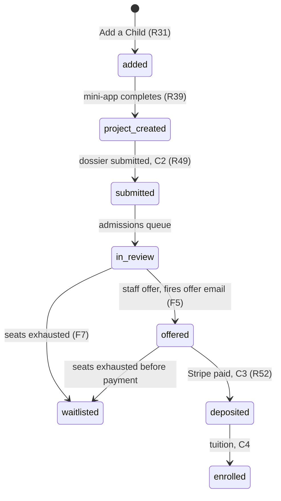

# feat: The First Profit funnel

## Overview

Replace the Join modal with a sixteen-screen application funnel: six landing pages →
`/start` (explainer, email capture, Add a Child) → a per-child mini-app that produces a real
project in ten minutes → the existing dossier wizard → admissions review → staff offer →
deposit → student arrival.

Seventeen units in five phases. Phase 0 is foundations and must land first. Phase 1 is the
marketing rewire and ships before the mini-app, because Conversion 1 is real and
`entry_source` starts answering the ads question weeks before the mini-app is ready.

This plan runs in **Lane B** (`docs/LANES.md`). Lane B holds the migration lock.

## Problem Frame

Every red CTA on the marketing site opens `app/components/account/AccountModal.tsx` through
`app/components/JoinButton.tsx`, from twelve call sites. A cold visitor's only path from
interest to commitment is a signup form, and it converts poorly.

The bet: families convert when the kid has already started. See the origin document's
Problem Frame — it is not restated here.

The tail already exists: `app/dashboard/` holds the parent dashboard and the five-step
dossier wizard, `app/api/checkout/route.ts` and `app/api/stripe/webhook` hold the deposit
rails, `app/crm/lib/lead-ingest.ts` and `app/lib/nurture` hold ingest and nurture. What is
missing is everything in front of it.

## Requirements Trace

R1–R64 with F1–F8 rulings, in `docs/brainstorms/2026-07-27-first-profit-funnel-requirements.md`.
Each unit below names the requirements it advances. Four rulings arrived from planning
research and change the build materially: F5 (admissions approval preserved), F6 (CASL
checkbox at C1), F7 (waitlist at zero seats), F8 (no Supabase OTP).

## Scope Boundaries

Non-goals are in the origin document. Three deserve restating because research made them
tempting:

- **The Gauntlet's account modal does not reroute.** `app/gauntlet/ComingSoon.tsx:44` and
  `app/gauntlet/GauntletGame.tsx:315-333` use `openAccountModal` as a functional signup gate
  for tournament entry, not as a marketing CTA. The Gauntlet is a stated non-goal and
  rerouting it breaks entry.
- **`cacheComponents` is not enabled.** Sixteen files use `export const dynamic = "force-dynamic"`,
  which the flag removes. Out of scope, and the funnel does not need it.
- **No pre-deposit task work** (F2). The data model must not preclude it; nothing here
  depends on it.

## Context & Research

### Relevant Code and Patterns

| Area | Follow | Note |
|---|---|---|
| Guarded route groups | `app/crm/(app)/layout.tsx`, `app/fp/(app)/layout.tsx` | Pure verdict module → thin gate → **both** layout and page gate. Next 16 layouts do not re-render on soft navigation. |
| Pure decision modules | `app/dashboard/wizard-rules.ts`, `app/crm/lib/engine.ts`, `app/fp/lib/access-rules.ts` | `environment: "node"`, no jsdom. A decision in a `.tsx` is structurally untestable. |
| Tokened email links | `app/fp/lib/actions/invite.ts`, `path_parent_invites` | 256-bit token, sha256 at rest, single-use, read-only GET landing, POSTed action. The model for R7. |
| Lead ingest | `app/crm/lib/lead-ingest.ts` (`server-only`, deliberately no `"use server"`) | `matchOrCreateLead`, select-first-and-branch. Never upsert. |
| Claim-then-send | `app/api/cron/nurture/route.ts`, `nurture_sends` unique constraint | Claim first, release on failure. Email is not idempotent. |
| Webhook idempotency | `runCalcomWebhook` + `processed_webhook_events` | Record the dedupe key **after** an idempotent effect; claim-first only for non-idempotent ones. |
| Static params + metadata | `app/groups/[slug]/page.tsx` + `app/lib/site.ts` | The working precedent for six landing pages. |
| Attribution | `app/2026-27/cta-source.ts` | `SRC_MARKER = "src=2026-27"`, applied at two call sites, **never read back anywhere**. |
| Two-register skinning | `app/globals.css` `@theme inline` | Class-name swap at a subtree root. A CSS-variable override is a silent no-op. |

### Institutional Learnings

The load-bearing ones. Each changed a decision below.

- `docs/solutions/database-issues/upsert-insert-arm-poisons-excluded-status-guard-coercion-submit-fails-2026-07-14.md` — BEFORE INSERT triggers fire on an upsert's proposed row; `EXCLUDED` reflects them. Split content writes from status writes.
- `docs/solutions/database-issues/blind-upsert-on-conflict-public-endpoint-expression-index-inference-and-consent-hijack-2026-07-16.md` — P0 consent hijack. Governs U6.
- `docs/solutions/security-issues/supabase-autoconfirm-forged-consent-email-confirmation-signup-retrofit-2026-07-13.md` — an unverified email bound to a family record forged CASL consent. Governs R9b.
- `docs/solutions/security-issues/guard-function-with-no-callers-is-not-a-mechanism-client-side-supabase-auth-bypasses-server-guards-2026-07-23.md` — browser-side Supabase auth calls cannot be guarded server-side. Governs U3 and U15.
- `docs/solutions/security-issues/state-changing-email-links-mutate-on-get-scanner-prefetch-false-confirm-2026-07-16.md` — mail scanners fetch every URL. Governs R7a.
- `docs/solutions/best-practices/post-write-verify-adopt-only-on-ambiguous-error-never-on-unique-violation-and-the-verify-read-is-tri-state-2026-07-24.md` — the verify read is tri-state. Governs U15.
- `docs/solutions/logic-errors/idempotent-primitive-plus-unconditional-caller-rotated-a-live-credential-reuse-the-existing-verdict-2026-07-23.md` — `ok: true` is not permission to issue a credential. Governs R53b.
- `docs/solutions/logic-errors/retired-workshops-checklist-mirrors-gate-on-raw-array-not-live-selection-2026-07-14.md` — the direct precedent for U12. Three lockstep checklist mirrors.
- `docs/solutions/test-failures/vitest-include-allowlist-new-test-dirs-silently-never-run-2026-07-18.md` — a test outside the allowlist never runs and the suite stays green.
- `docs/solutions/best-practices/tailwind-v4-theme-not-scopable-inline-literals-two-namespace-classname-swap-2026-07-22.md` — governs the two-register seam and the door colours.
- `docs/solutions/best-practices/in-memory-rate-limiter-toctou-race-and-fifo-eviction-clears-lockout-2026-07-22.md` — governs R7d. Its own carry-forward says the in-memory store is inadequate at public-funnel volume.
- `docs/solutions/workflow-issues/a-phased-plans-unit-boundary-is-a-schedule-not-a-proof-that-the-swap-is-atomic-2026-07-27.md` — a scheduled removal must verify its replacement is mounted **at that moment**. Governs U4 and U12.

### External References

- Next 16.2.10 bundled docs (`node_modules/next/dist/docs/`) — `revalidateTag` now takes a required second argument; `dynamic`/`revalidate`/`fetchCache` are demoted; Turbopack is the build default; `redirect()` must sit outside `try`, with `unstable_rethrow` as the escape hatch.
- `use-search-params.md` — a prerendered route reading `useSearchParams` client-side inside `<Suspense>` stays static. A Server Component read of `searchParams` opts **the whole route** into dynamic rendering.
- AI SDK v7 — `generateObject` is deprecated in favour of `generateText` + `Output.object`. Schema-validation failures **do not retry** (verified at source: retry wraps the provider call, parse/validate runs outside it). zod 4 is supported and recommended.
- Stripe — `ui_mode` enum values renamed as of `2026-03-25.dahlia`; `constructEventAsync` required; idempotency keys are the **second** argument in stripe-node v22; `line_items` is absent from webhook payloads.
- Stripe dispute guidance — a checkbox containing only a link to a refund policy is rejected by issuers as evidence. Governs R51a.
- OPC guidance on children's data; Ontario CPA cancellation rights. Governs R55a and the counsel dependency.

## Key Technical Decisions

1. **Applicant state is a new `applicant_state` column, never `children.status`.** Three
   independent collisions make reuse fail silently: `statusIndex` is an allow-list returning
   `-1` for unknown values so `canReserveSeat` would return false forever; the
   `children_status_guard` trigger **coerces rather than raises**, so it fails quietly in
   production while passing in service-role tests; and `children_seed_group_assignment`
   early-returns only on `status = 'draft'`, so any new non-draft state would put every
   door-tapper into the staff review queue.

2. **A real auth account is created at C1, server-side, with the email unverified — so RLS
   keeps working.** This is the load-bearing decision of the whole build, and it was almost
   got wrong.

   `children.parent_id` is `NOT NULL references parents(id)`, and `parents.id` references
   `auth.users(id)`. The service role bypasses row-level security; it does **not** bypass a
   NOT NULL foreign key. So a family with no auth account has nowhere to store a child — and
   Add a Child happens seconds after capture, in the same session, long before anyone opens
   their inbox.

   Creating the account at C1 means `auth.uid()` exists from the first screen. The existing
   policies (`parents` and `children` are `for all using (auth.uid() = ...)`, `deposits` is
   `for select using (auth.uid() = parent_id)`) authorize the funnel unchanged. There is no
   custom session cookie to forge, no parallel authorization layer, no ~50 hand-written
   scope checks to forget one of, and `/api/checkout`'s existing `getUser()` gate,
   `deriveStage`'s `account_created` rung, and the offer email's `/dashboard` link all work
   without modification.

   Two conditions make it safe, and both are cheap:
   - **Consent is not stamped until the first magic-link click.** Anyone can type a
     stranger's address into a public form; stamping CASL consent on an unverified address
     is exactly the 2026-07-13 forged-consent incident.
   - **An email that already has an account never gets a second one.** It gets a resume link
     to the existing account instead — which also resolves the previously-unhandled case of a
     password-holding family entering cold from an ad.

   Accepted trade: an unverified address becomes taken. A maliciously-typed stranger's
   address cannot self-register afterwards and must come in through the magic link.

3. **Resume uses a self-issued token over Resend, not Supabase `signInWithOtp` (F8).**
   Supabase's built-in mailer caps at 2 emails/hour project-wide; `createServerClient` forces
   PKCE *after* the options spread so cross-device resume cannot work; and the repo has no
   OTP precedent. The invite-token shape solves all three and never trips
   `no-auth-mail-guard.test.ts`.

4. **The landing pages only *emit* `?g=`/`?src=`; `/start` *reads* them.** The slug on a
   landing page comes from `generateStaticParams`, not from the query string, so nothing in
   R19–R27 requires a landing page to read `searchParams` and none should — a Server
   Component read would opt **the whole route** into dynamic rendering and cost six indexable
   pages their static generation. `/start` is where params are read, and it is dynamic anyway.
   If any landing page ever needs a param, it reads it client-side inside `<Suspense>`
   (a missing boundary fails the production build while working in dev). Deliberately not
   copying `app/gauntlet/beta/page.tsx`, which reads `searchParams` in `generateMetadata` and
   sets `force-dynamic` — correct there because that page is `noindex`, wrong here.

5. **Each mini-app step gets a real URL — for back semantics, and that reason only.**
   Two arguments that were originally offered for this do not survive checking and are struck:
   R40's regeneration limit is server-counted, so it is safe under any routing (Back is a
   client history operation and cannot decrement a Postgres row); and `/dashboard` does *not*
   lose the run on refresh — `app/dashboard/store.tsx` debounces a persist on every keystroke
   and `DossierEditor.tsx` awaits a gated save before every Next, with `firstIncompleteStep`
   as a purpose-built resume rule. It loses *position*, and recovers it.

   What remains is back-button behaviour across seven steps, which is real but narrower than
   first stated. **Note this buys a pattern the repo does not have** — there are zero `[step]`
   route segments across 43 `page.tsx` files; every existing multi-step UI is single-route
   plus client state, and the established idiom for URL-as-state is a query param on one route
   (`app/crm/components/pipeline/ContactDrawer.tsx`). U8 should weigh the query-param variant
   before committing to seven segments.

6. **AI is `generateText` + `Output.object`** through the Vercel AI Gateway with a plain
   `"provider/model"` string. `generateObject` is deprecated. Because schema-validation
   failure does not retry, the re-ask loop is hand-written: one re-ask feeding the validation
   error back, then the canned fallback.

7. **One live paid deposit per child is a partial unique index**, not an application probe.
   `canReserveSeat` only hides the CTA after a row exists; it cannot close the window between
   session creation and webhook arrival.

8. **The offer step reuses the existing CRM offer path and its email (PR #8)** rather than
   introducing a second way to open payment. F5 preserved admissions approval; adding a
   parallel path would give the seat count two writers. Note the email **already has** a
   deposit CTA (`app/crm/lib/offer-rules.ts:43`, `${SITE_URL}/dashboard`, "Sign in to your
   dashboard and reserve") — U13's work is retargeting it, not adding one, and three
   renderings must move together: `text`, the duplicated `html`, and the confirm-dialog
   preview in `app/crm/components/dossiers/OfferEmailButton.tsx`.

9. **Most planned tests need no `vitest.config.ts` change.** `app/lib/**/__tests__/**`,
   `app/api/**/__tests__/**`, `app/fp/**/__tests__/**`, `app/dashboard/__tests__/**` and
   `app/crm/__tests__/**` are already allowlisted. Two real hazards remain: `app/start/**` is
   **not** allowlisted, so any test landing there must add the glob and a name-pinned
   assertion in the same commit; and `app/crm`/`app/dashboard` use the **narrow** form, so
   U12's `reviews-rules` tests must land in `app/crm/__tests__/`, not
   `app/crm/lib/__tests__/`. `docs/LANES.md` already reserves the Lane B comment block.

11. **Every new table gets `alter table ... enable row level security` with zero policies.**
    Every one of the repo's 41 migrations does this, including tables only the service role
    ever touches (`processed_webhook_events`, `nurture_sends`, `path_parent_invites`). RLS
    with no grants makes a table invisible to anyone holding the public anon key — which
    ships in every client bundle — while the service role works unaffected. This applies to
    `projects` (U1), the resume-token table (U3), and `funnel_events` (U16).

10. **Two registers swap by class name at a subtree root.** Tailwind v4's `@theme` cannot be
    scoped and `@theme inline` compiles to literal values, so a CSS-variable override under a
    class is a silent no-op. Class strings must be complete literals in source.

## Open Questions

### Resolved During Planning

- *After C2, what opens the deposit?* Staff offer, through the existing CRM path (F5). C2 and C3 are no longer contiguous.
- *CASL basis at C1?* Explicit unticked checkbox, text and version recorded (F6).
- *Seats exhausted mid-run, and the Sept 30 date?* Waitlist at zero closes checkout; the date gets a machine-readable constant but stays presentational this build (F7).
- *Magic link mechanism?* Self-issued token over Resend (F8).
- *Where does applicant state live?* New column (Decision 1).
- *How does a password-less family authorize, and where does a child row live before an account exists?* A real auth account is created at C1 with the email unverified, so RLS authorizes the funnel unchanged (Decision 2). This replaces an earlier service-role-plus-hand-written-scope-check design that would have added roughly fifty unenforced authorization sites.
- *Does `applicant_state` collide with `children.status`?* They are separate columns and `children.status` remains the single source for the reserve gate and for `move_candidate`. `applicant_state` carries only the funnel-specific rungs that `children.status` has no value for. U13's staff offer writes `children.status` through `move_candidate` exactly as today.
- *Does the Gauntlet modal reroute?* No — success criterion narrowed to marketing surfaces.
- *Does the mail guard widen?* Yes, to the whole `@the120.school` student namespace (R53a).

### Deferred to Implementation

- **How the C1 session is actually minted.** Two candidate shapes: `admin.createUser` with a server-generated password never disclosed, followed by a server-side `signInWithPassword` (the shape `app/fp/lib/actions/invite.ts` already uses); or `admin.generateLink`. The second appears in `no-auth-mail-guard.test.ts`'s `MAIL_CAPABLE` set and would have to route through the guard. Either way the constraint is fixed: no consent stamped pre-verification, and no second account for an existing email.
- Whether the resume-token table is new or extends `path_parent_invites`. Its RESTRICT FKs and FW-specific columns may not fit; U3 decides against real schema.
- **The address shape for R53-provisioned students.** `assertNoAuthMailToFwStudent` is shape-only and matches the `.fw@` local-part suffix, not the domain — and `admissions@`, `hello@`, `peter@` and `staff@the120.school` are live addresses its own tests require it to permit. So "widen to the whole `@the120.school` namespace" cannot mean the domain. The funnel's students need their own suffix convention analogous to `.fw`, or the guard becomes lookup-based and loses its pure-function property. U15 cannot start until this is picked.
- Precise model and effort setting for U10. Requires a cost and latency sweep against real quiz answers, and is coupled to the ZDR decision.
- Whether the moderation pass in U9 is a library, a hosted API, or a rules module. No precedent exists; U9 evaluates against real child input.
- Whether `/first-profit` needs a `robots.ts` entry. There is no `sitemap.ts` or `robots.ts` in the repo at all; U5 decides whether to introduce one.

## High-Level Technical Design

> *This illustrates the intended approach and is directional guidance for review, not
> implementation specification. The implementing agent should treat it as context, not code
> to reproduce.*

The applicant state machine, with the F5 offer rung that the original requirements omitted:

Family-level versus child-level ownership, which the requirements left ambiguous in five
places:

| Concern | Level | Consequence |
|---|---|---|
| Session, consent, `entry_source` | Family | One record, stamped once at C1, immutable |
| `?g=` hint | Family, first child only (R36) | Siblings pick cold |
| `applicant_state`, project, deposit | Child | Each child has its own ladder |
| Progress bar (R32) | Child, with an explicit active-child selector | Otherwise the bar drops when a sibling is added |
| Dashboard register (application vs First Profit) | Family | Flips once **any** child is deposited |
| Nurture | Family today, must become child-aware | `app/lib/nurture/rules.ts` sends one email per family per run and stops on family-level `dossier_submitted_at` |

## Implementation Units

### Phase 0 — Foundations

- [x] **Unit 1: Applicant state, projects, and the reserve-gate repair** *(landed
  2026-07-27, PR pending)*

  **What landed:** migration `20260805120000_funnel_applicant_state.sql` applied to
  production via the Management API, verified by SELECT, re-run once to prove
  idempotency, constraints exercised live in a rolled-back probe (illegal state refused,
  second active project refused, second live-paid deposit refused, refunded row does not
  block). `app/lib/funnel/applicant-rules.ts` + four test files (all under the existing
  `app/lib/**` allowlist — **no vitest.config change needed**). `canReserveSeatForChild`
  (options-object signature) wired into `/api/checkout` — the server gate — with a
  source-scan test pinning the wiring; dashboard CTA and CRM gates adopt it in the units
  that load the column (documented at the predicate). Four (not three) September-30
  literals collapsed: review found a fourth behind `&nbsp;` and three abbreviated
  (`Sept`/`SEP`) copies; the two in Lane A's files (`app/crm/lib/engine.ts`,
  `DepositThermometer.tsx`) are carved out by a self-expiring test until Lane A adopts
  the constant. Suite: **106 files / 2871 tests** (from 102 / 2810), `tsc` and
  `next build` clean.

  **Carried forward:** (1) **U14 must catch 23505 on `deposits_one_live_paid_per_child`
  in the webhook and return non-5xx** — the index is live and the current upsert's
  `onConflict: "stripe_session_id"` cannot absorb it, so a double-tab double-payment
  today = charged-but-unrecorded + ~3-day Stripe retry storm; interim signature is any
  `[webhook] deposit insert failed` log line (reconcile against Stripe). Also fix
  partial refunds unconditionally setting `refunded_at`, which drops the row out of the
  index predicate. See `docs/solutions/database-issues/partial-unique-index-under-live-upsert-onconflict-names-different-key-23505-retry-storm-2026-07-27.md`.
  (2) The unit that first writes `projects` must reconcile the `on delete cascade` from
  `children` with the ungated "Remove this child" button before real project data
  exists.

**Goal:** The data model the rest of the funnel stands on, plus repair of the three existing
mechanisms that would silently break under it.

**Requirements:** R1–R5, R52a, F7

**Dependencies:** None. Holds the migration lock.

**Files:**
- Create: `supabase/migrations/<ts>_funnel_applicant_state.sql`
- Create: `app/lib/funnel/applicant-rules.ts`
- Modify: `app/lib/site.ts` (Group landing fields, scholars href, machine-readable deadline `Date`)
- Modify: `app/dashboard/data.ts` (`statusIndex`, `canReserveSeat` awareness of the new column)
- Test: `app/lib/__tests__/funnel-applicant-rules.test.ts`

**Approach:**
- New `applicant_state` column on `children`, plus a `projects` table anchored on
  `children(id)` — not `families`, which parents cannot read at all under RLS. **RLS enabled
  on `projects` with zero policies** (Decision 11); parents reach it through server code.
- `children.status` is untouched and remains the single source for the reserve gate and
  `move_candidate`. The two columns are not two writers on one fact.
- **Do not rewrite `children_seed_group_assignment`.** An earlier draft of this unit said to,
  reasoning that frictionless door switching would flood the staff review queue. That is
  false under Decision 1: the trigger early-returns on `status = 'draft'`, funnel children
  stay `draft` until C2, and funnel state lives on a different column — so door switching
  cannot seed a `child_reviews` row today. Rewriting the trigger is the change that would
  *create* the flood.
- Partial unique index enforcing one live paid deposit per child (R52a), **and** the R2
  constraint of at most one `active` project per child, which the first draft omitted.
- This unit also authors the columns U6 needs, because U6 has no migration and Lane B's rule
  is that authoring a migration is applying it: `entry_source` (which does not exist anywhere
  in the repo today), and the consent text and version columns F6/R30a require — `families`
  carries only booleans and timestamps.
- Collapse the three duplicate September-30 literals (`app/dashboard/DashboardApp.tsx`,
  `app/lib/nurture/copy.ts`, `app/lib/welcome/template.ts`) onto one constant.
- **Do not change scholars' `href` in this unit.** `app/components/GroupsBand.tsx` renders
  `g.href` directly and `app/groups/[slug]/page.tsx` `notFound()`s on scholars until U5
  admits it to `generateStaticParams`. Moving the href in Phase 0 points a live home-page card
  at a 404 for the length of Phase 1. The href moves in U5, with the route that serves it.
- Migration is idempotent DDL; the `schema_migrations` insert is gated on the apply call
  succeeding.

**Execution note:** Author the pure rules module test-first; the migration follows the shape
the tests pin.

**Patterns to follow:** `supabase/migrations/20260714160000_children_guard_hardening.sql` for
trigger shape; `app/fp/lib/access-rules.ts` for a const-array-derived closed union.

**Test scenarios:**
- Happy path: each `applicant_state` transition in the U1 diagram is permitted; `added → deposited` is refused.
- Edge case: an unknown state string from a service-role row is dropped by the fail-closed guard and logged, never coerced to a legal value.
- Edge case: `canReserveSeat` returns false for every pre-`offered` state, and true only at `offered`.
- Error path: a second paid deposit row for the same child violates the partial unique index; a refunded row does not block a new one.
- Integration: inserting a child at a non-draft state does **not** create a `child_reviews` row.
- Integration: the deadline constant and the display label agree, asserted against both.

**Verification:** Migration applied and verified by SELECT against production. `canReserveSeat`
behaviour unchanged for existing non-funnel children, pinned by a regression test.

---

- [x] **Unit 2: Account provisioning at C1 and the re-entry matrix** *(landed
  2026-07-27)*

  **What landed:** `app/lib/funnel/session-rules.ts` (the R9a matrix as one pure
  priority-ordered function, per-screen discriminated destinations carrying a
  `reason` rule-id; full situation-space enumerated in tests — 192 cells, none
  undefined) and `app/lib/funnel/account.ts` (provision-or-recognize;
  `server-only`, NOT an action). **The C1 session-minting question is closed:**
  `admin.createUser` + server-generated discarded password + server-side
  `signInWithPassword` — `email_confirm: true` at the AUTH layer only, because
  hosted confirmations are ON and an unconfirmed user cannot sign in at all
  (verified against production: `email_not_confirmed`); inbox-verification truth
  stays with the funnel's own consent flow, and nothing may read
  `email_confirmed_at` as "verified" (source-scan enforced). No migration
  needed; no vitest allowlist change. A cookie-writability probe fails CLOSED
  before any side effect (the @supabase/ssr adapter silently swallows
  Server-Component cookie writes — documented in
  `docs/solutions/logic-errors/cookie-probe-before-account-side-effect-2026-07-27.md`).
  Compensation is one atomic `deleteUser` riding the FK cascade. Behavioral
  tests through a typed injection seam (`ProvisionDeps`), not source scans.
  Production probe (rolled-back/cleaned): unconfirmed-cannot-sign-in,
  session mint, email_exists convergence, children insert under real JWT,
  status-guard coercion, **RLS isolation (family B reads zero of family A's
  children)** — Decision 2 verified end to end. Matrix nuance from review: an
  enrolled family holding a VALID resume link routes to dashboard, not
  sign_in — a funnel family has no password, so sign_in would strand them even
  on a stale `enrolled` bit. Suite: **110 files / 2949 tests** measured after rebasing onto Lane A's Unit 5 (own delta: +1 file / +32 tests; U1 baseline 106 /
  2871), `tsc` and `next build` clean.

  **Carried forward to U3:** resume redemption should self-heal a missing
  parents row (recovery for a compensation-interrupted stranded account), and
  redemption owns session-vs-link family-identity reconciliation — the matrix's
  `ReentryContext` is single-family by contract.

**Goal:** A real auth account from the first screen, so RLS authorizes the funnel — and one
pure function that says where any returning visitor lands.

**Requirements:** R8a, R9a, R9b

**Dependencies:** Unit 1

**Files:**
- Create: `app/lib/funnel/session-rules.ts` (pure: the re-entry matrix)
- Create: `app/lib/funnel/account.ts` (`server-only`: provision-or-recognize at C1)
- Test: `app/lib/__tests__/funnel-session-rules.test.ts`

**Approach:**
- Provision an auth account server-side at C1 with the email unverified (Decision 2), so
  `auth.uid()` exists and the existing `parents` / `children` / `deposits` policies apply
  with no new authorization surface. **This unit is much smaller than an authorization
  layer** — it is account creation plus a decision table, not a parallel security model.
- Provision-or-recognize: an email that already has an account never gets a second one. It
  gets a resume link to the existing account. This is also the fix for a password-holding
  family entering cold from an ad.
- No consent stamped and no merge into an existing family until the first verified click
  (R9b).
- The re-entry matrix of R9a is a pure function returning a destination, not scattered
  conditionals: rows are cookie/link/password/enrolled state, columns are child counts.

**Execution note:** Test-first on the matrix. The provisioning path needs one real invocation
before ship — a `"use server"` file's failure modes are invisible to tsc, eslint and vitest.

**Patterns to follow:** `app/fp/lib/actions/invite.ts` for provision-then-session;
`app/fp/lib/fw-access-rules.ts` for typed verdicts that never throw.

**Test scenarios:**
- Happy path: a new email provisions exactly one auth user, one `parents` row, and returns a live session.
- Happy path: a live session for family F resolves to F's furthest-progressed child.
- Edge case: every cell of the R9a matrix returns a destination; a table-driven test asserts no cell is undefined.
- Edge case: an email that already has an account provisions nothing and returns the resume-link branch.
- Edge case: two concurrent captures for the same address converge on one account, not two — the loser adopts rather than compensating, since a `23505` here is a concurrent caller's row.
- Edge case: a family with two children at different stages resolves to the explicit active child, not the first by insertion.
- Error path: no consent is written on the provisioning path; consent appears only after a verified click.
- Error path: a session for family F requesting a child of family G reads zero rows under the existing RLS policy — asserted against the policy, not against application code.
- Integration: an enrolled family entering from an ad link is routed to sign-in, not to a second deposit.

**Verification:** A funnel family's `children` read returns their rows and only their rows
under the anon key with their own session — proving RLS is doing the work.

---

- [x] **Unit 3: Resume tokens and the return path** *(landed 2026-07-27)*

  **What landed:** migration `20260805150000_funnel_resume_tokens.sql` (applied,
  verified, re-run clean, constraints probed in a rolled-back DO block: duplicate
  token_hash refused, CAS claim2=0) carrying BOTH `funnel_resume_tokens` and
  `funnel_rate_events` — the DB-backed limiter R7d requires, authored here because
  U6 reuses it and would otherwise need a second production migration. RLS on,
  zero policies, both. `resume-rules.ts` (pure verdicts, insert-then-count math,
  `isFunnelProvisioned`), `resume-store.ts` (**operation-level** persistence seam +
  the exported `checkFunnelRateLimit` U6 reuses), `resume-core.ts` (sequencing),
  thin `"use server"` wrappers, `/resume/[token]` read-only GET + POST-redeeming
  form. Session minted by `admin.generateLink` (never mailed) + in-process
  `verifyOtp` — NOT password rotation, which would destroy a password family's
  known credential. `account.ts` now stamps `app_metadata.funnel` so the matrix's
  `hasPassword` bit is read, not guessed.

  **Review (8 agents) fixed:** the constant response leaked through **timing**
  (awaited Resend round-trip only on the known-address path → now deferred) and
  through **shape** (an unhandled throw is a different response → try/catch
  shells); the per-IP backstop was **starved** (per-target denial returned before
  the IP strike recorded → both buckets now record before either verdict); a
  mint failure **burned the token** with no session (→ the claim is handed back);
  infra failures now release strikes; the client-level DI seam needed
  `as unknown as` on both sides (→ operation-level, casts gone); dead-end states
  gained a real link out. `no-auth-mail-guard` reddened on the refactor because
  extraction moved `generateLink` away from its guard — fixed at the call site.
  Suite: **113 files / 3009 tests** after rebasing onto Lane A (own delta +4 files / +60 tests), `tsc` / build / lint clean.

  **Carried forward:** `funnel_rate_events` prunes opportunistically on the
  deferred path; if funnel volume outgrows that, U17's retention work owns a
  scheduled sweep. A leaked *expired* token remains resendable to its own bound
  address (rate-limited, never redirectable) — acceptable, documented.

**Goal:** A family that leaves can come back, on any device, without a password — and the
link is safe if forwarded, scanned, or leaked.

**Requirements:** R6, R7, R7a–R7d, R8

**Dependencies:** Unit 2

**Files:**
- Create: `supabase/migrations/<ts>_funnel_resume_tokens.sql`
- Create: `app/lib/funnel/resume-rules.ts` (pure), `app/lib/funnel/actions/resume.ts`
- Create: `app/resume/[token]/page.tsx` (read-only GET), `app/resume/[token]/ResumeForm.tsx`
- Test: `app/lib/__tests__/funnel-resume-rules.test.ts`

**Approach:**
- 256-bit token, sha256 at rest, single-use, short TTL. The GET landing renders a button and
  establishes nothing; POST redeems.
- The resume position is resolved server-side after redemption and never appears in the URL.
- Database-backed rate limiting keyed on `${ip}:${normalizedEmail}` plus a coarse per-IP
  backstop, gated before any I/O.
- Request-a-link responses are constant and identical regardless of address existence.

**Execution note:** Test-first, and mutation-test the enumeration and single-use guards — both
are branches whose correct behaviour looks like their incorrect behaviour from outside.

**Patterns to follow:** `app/fp/lib/actions/invite.ts` end to end; `app/unsubscribe/route.ts`
for the GET-renders/POST-mutates shape.

**Test scenarios:**
- Happy path: a fresh token redeems on POST, establishes a session, and routes to the resume point.
- Edge case: cross-device — a token minted in one session redeems in a session with no prior cookie.
- Error path: a GET to the landing URL mutates nothing; a test asserts no write occurs, simulating a scanner prefetch.
- Error path: a second POST with the same token is refused; the first redemption still holds.
- Error path: an expired token renders a resend affordance, not a dead end.
- Edge case: request-a-link for a non-existent address returns a byte-identical response to one for a real address.
- Edge case: rate limiter refuses at the bound; two concurrent requests for the same key cannot both pass (the documented TOCTOU shape).
- Integration: the resume mail is addressed only to a parent address; a student-namespace recipient is refused by the guard.

**Verification:** `no-auth-mail-guard.test.ts` stays green with no new `REVIEWED_CALL_SITES`
entry, because no Supabase auth-mail call was added.

### Phase 1 — Marketing rewire

- [x] **Unit 4: Attribution and the sitewide CTA reroute** — *part one landed
  2026-07-27; **the CTA swap itself moves to U6**, see below*

  **Scope decision (the plan's own fallback, taken deliberately):** Operational
  Notes say "U4 must not merge before U6… if the two are ever separated, leave
  `JoinButton` wired until U6 ships." `AccountModal.tsx` holds the only
  `signUp()` in `app/`, and U6 depends on U4's source vocabulary — so the
  dependency and the merge order point opposite ways. Resolved by splitting at
  the seam the plan names: **everything except the `JoinButton` swap landed
  here; U6 performs the swap in the same PR that ships `/start`.** The reroute
  therefore never exists without an account-creating destination behind it.

  **What landed:** `app/lib/cta-source.ts` — the twelve-marker closed vocabulary
  (R11) with `funnelEntryHref` and, new, a **read-back** (`readCtaSource`,
  fail-closed to null: a wrong attribution is worse than a missing one). The
  original `SRC_MARKER` had been applied at two call sites since launch and read
  back nowhere. `app/2026-27/cta-source.ts` re-exports the two moved symbols and
  keeps its page-local vocabulary — it has **17 importers, fourteen for
  `Audience` alone**; extract, never delete. Door colours (R14–R17): all five
  raw phase tokens were **measured failing** WCAG AA on `#f7f6f3` (gold worst at
  1.83:1) — the brief predicted only gold and coral would — so `globals.css`
  gains `--phase-*-ink` text-safe variants at the same hue and saturation, and
  `DOOR_CLASSES` maps each group to complete literal class strings keyed on a
  `GroupSlug` union, so a missing entry is a compile error rather than a card
  silently rendering in error-red. `Group.cta` deleted (zero consumers, carried
  the retired "BOOK OR JOIN" copy R18 removes). Contrast is **recomputed from
  `globals.css` in the test**, not asserted from a comment.

  **Verification:** route table diffed before/after — identical, no
  static→dynamic regression. Tailwind confirmed to emit all ten door classes
  from the `.ts` literals (verified against a fresh build, and independently by
  a reviewer compiling the real PostCSS pipeline). Suite **115 files / 3064
  tests**; `tsc`, build, eslint clean.

  **Carried to U6:** the `JoinButton` swap at the 13 marketing call sites, the
  home hero's "Start Here →" (R12), and R18's "Book a call" removal — all
  landing together with `/start`. The three preserved call sites (Gauntlet ×2,
  `SignIn.tsx:168`) must be asserted by count in that PR.

**Goal:** Every marketing CTA leads to `/start` with a source marker, and the marker is read
back — which nothing does today.

**Requirements:** R10–R18

**Dependencies:** Unit 1 (Group fields)

**Files:**
- Create: `app/lib/cta-source.ts`, `app/lib/__tests__/cta-source.test.ts`
- Modify: `app/2026-27/cta-source.ts` — **extract, do not delete.** It has 17 importers, not
  two. Only `attributedBookingUrl` has two call sites; the file also exports `type Audience`
  (imported by `SubNav.tsx`, `ProgramContent.tsx`, `path-criteria.ts` and ten files under
  `app/2026-27/sections/`), `ctaLabels`, `seatsDisplay`, and `WAITLIST_LABEL` — which R52b
  wants to reuse. Move `SRC_MARKER` and `attributedBookingUrl` out; leave the page-local
  vocabulary in place.
- Modify: `app/components/{Nav,CtaBand,Hero,GroupsBand,ScholarsTuition}.tsx`, `app/2026-27/{MidPageCta,RedCtaBand}.tsx`, `app/tuition/page.tsx`, `app/scholars/page.tsx`, `app/groups/[slug]/page.tsx`
- Test: `app/lib/__tests__/door-colors.test.ts`

**Approach:**
- Promote the marker from a `key=value` literal to a typed source vocabulary with a read-back
  path, since `entry_source` (R58) is the point of the exercise. The column itself lands in
  U1; this unit stamps into it.
- **13 `JoinButton` JSX usages, plus one direct `openAccountModal`.** Three are deliberately
  out of scope and must be asserted as still present so a later sweep cannot remove them:
  `app/gauntlet/ComingSoon.tsx`, `app/gauntlet/GauntletGame.tsx` (both the `JoinButton` and
  the `useAccountModal` call at line 329), and **`app/dashboard/SignIn.tsx:168`
  ("Create an account")** — which R9 preserves, is not a marketing surface, and is the only
  remaining path to `signUp()` in the entire app.
- Door colours: the tokens are `--phase-*` / `--color-phase-*` in `app/globals.css`, **not**
  `--tp-phase-*`; the brief's spelling does not exist in this repo. Run the contrast check
  R16 demands — gold at 52% lightness and coral on `#f7f6f3` are both expected to fail; ship
  darkened text-safe variants for labels and keep the raw tokens for accents. Class strings
  must be complete literals — Tailwind's scanner cannot see `` `text-${slug}` ``.
- Removal of `BOOKING_URL` CTAs (R18) happens in the same change that lands their
  replacement, never a unit early.

**Test scenarios:**
- Happy path: each entry surface produces its documented marker; a table-driven test covers all twelve.
- Edge case: the marker is idempotent — applying it twice yields one marker.
- Edge case: a `mailto:` or relative URL passes through untouched.
- Error path: an unknown source slug is a compile error, not a runtime fallback (const-array-derived union).
- Edge case: every door colour label passes WCAG AA against `#f7f6f3` at its rendered size, asserted numerically rather than by eye.
- Integration: no marketing surface renders `JoinButton`; a source scan asserts it, with comments stripped and paths resolved from `import.meta.url`, and with the three preserved call sites named as an explicit allowlist rather than left to the scan's blind spot.
- Integration: the Gauntlet's two account-modal call sites **and** `app/dashboard/SignIn.tsx:168` still exist — asserted by count, so a later sweep cannot silently remove the app's only remaining `signUp()` path.

**Verification:** `/2026-27`'s existing attribution still reaches Cal.com unchanged.

---

- [x] **Unit 5: The landing template, six times** *(landed 2026-07-28, after U6/U7
  — reordered so `/start` existed before six pages pointed at it)*

  **What landed:** `app/components/landing/LandingPage.tsx` — R20's skeleton
  once (floating nav card, full-bleed hero with the seats lightbox, proof
  strip, the R21 network paragraph as ONE exported constant asserted by
  identity, red CTA band, footer). `/groups/[slug]` rebuilt on it with
  **scholars admitted to `generateStaticParams` in the same change that moved
  its href** — the U1-deferred swap, executed in its scheduled order; the
  U1-era pin test expired on cue and now states the invariant directly (every
  card href is a generated page). `/first-profit` created: `src=fp-generic`,
  no `?g=`, and **nothing internal links to it** (scanned, stem-anchored, with
  config files included). All six built **static** (SSG + 60s seats ISR).
  Decision 4 enforced by shape and by scan: the landings emit `?g=`/`?src=`
  and read nothing. Zero seats renders the waitlist state via `seatsDisplay`
  (moved to site.ts with re-exports, so six static pages don't drag the
  2026-27 content file in for one string).

  **Review (2 agents) fixed:** the seats fetch had an env guard but NO timeout
  — a hanging (not down) Supabase at build time would stall six static pages
  for the full page timeout each; now `AbortSignal.timeout(4000)` into the
  fallback. Dead `Group.kicker`/`accent` removed (their only consumer was the
  brochure page R26 retired). Stale U1-era comments corrected. Test-robustness:
  the `/first-profit` scan is stem-anchored with a lookahead (catches
  `?ref=`/trailing-slash forms, skips the hero asset path) and covers config
  files; the scholars-notFound scan is dot-all. The unrendered `hero` prop is
  documented honestly: the slot ships blue, and the art drop must land with
  its `<Image>` wiring in the same change. Suite **121 files / 3200 tests**;
  build clean, all six static; lint clean.

**Goal:** Six statically-generated landing pages that carry a group into the funnel without
becoming dynamic.

**Requirements:** R19–R27

**Dependencies:** Units 1, 4

**Files:**
- Create: `app/first-profit/page.tsx`, `app/components/landing/*`
- Modify: `app/groups/[slug]/page.tsx` (rebuild; scholars joins `generateStaticParams`)
- Modify: `app/scholars/page.tsx` (unlink from cards, reroute CTAs)
- Test: `app/lib/__tests__/landing-content.test.ts`

**Approach:**
- One template, six instances from `app/lib/site.ts`. Only hero image, headline line 1, and
  subhead vary; the "What is The 120" paragraph is byte-identical across all six.
- **Scholars' `href` moves to `/groups/scholars` in this unit**, in the same change that
  admits scholars to `generateStaticParams` and removes the `notFound()` — never before it,
  or the home card points at a 404.
- These pages **emit** `?g=`/`?src=` on their CTAs; they do not read them (Decision 4). No
  Server Component here may touch `searchParams`.
- Seats render from `app/lib/seats.ts`, which must keep its env guard — an undefined fetch URL
  stalls static generation for the full 60s page timeout.
- Hero image slots ship; the art does not exist yet and is a content dependency.

**Test scenarios:**
- Happy path: `generateStaticParams` returns all five groups including scholars.
- Edge case: the shared content block is one exported constant referenced by all six, asserted by identity — `environment: "node"` means there is no renderer to compare output with, so this must be a data assertion, not a render assertion.
- Edge case: scholars' `href` and the set returned by `generateStaticParams` agree, so the home card can never point at a `notFound()`.
- Edge case: an unknown slug 404s.
- Error path: seats unavailable renders the fallback constant, not a crash or an empty string.
- Integration: no landing page reads `searchParams` in a Server Component — a source scan, since this is what silently destroys static generation.
- Integration: every landing CTA carries both `g` and `src` except `/first-profit`, which carries `src` only.

**Verification:** `next build` reports all six as static. No route regressed from static to
dynamic — compare the build output route table before and after.

---

- [x] **Unit 6: `/start` — explainer, capture, and consent** *(landed 2026-07-28,
  and discharges Unit 4's carried-forward CTA swap)*

  **What landed:** `/start` — three explainer swipes then capture, the only route
  that reads `?src=`/`?g=` (Decision 4). `capture-rules.ts` (pure: R32's whole
  percentage ladder, field validation, the versioned CASL record),
  `capture-core.ts` (server-only, deps seam) + a thin `"use server"` wrapper.
  **Consent is never granted at capture** — the checkbox records intent plus the
  exact disclosure text and version; the grant belongs to U3's verified click.
  `families-rules.ts` gains `entrySource` and consent `text`/`version`;
  `entry_source` rides `buildLeadInsert` only, so `buildMatchUpdate`'s silence is
  what makes it immutable. **Verified against production** (probe, cleaned up):
  the fields survive the closed literal row, `consent_given` is false, and a
  second capture from a different source matches without rewriting attribution.

  **Unit 4's deferred swap, discharged:** 10 marketing `JoinButton` sites →
  `StartCta` (a `<Link>`, not a modal button — crawlable, works pre-hydration,
  and drops the modal provider from every marketing page's critical path); the
  three preserved sites (`SignIn.tsx`, Gauntlet ×2) asserted **by count**; R18's
  "Book a call" gone from every logged-out surface, including prose on
  `/faq`, `/tuition` and `HowItWorks`, whose three steps described a process that
  no longer runs.

  **Review (4 agents) fixed:** `CtaBand` hardcoded `source="home"` for all seven
  pages it mounts on — caught independently by two reviewers, and it would have
  credited `/faq` and `/parents` conversions to the home page permanently
  (`entry_source` is immutable) while leaving those two markers unreachable;
  `source` is now a required prop. Capture's rate limits were *looser* than
  resume's while the comment claimed tighter, on the endpoint that mints
  accounts. A CRM ingest **throw** (matchOrCreateLead throws, never returns null)
  took the outer catch and reported `failed` to a family whose session was
  already live — now caught locally and non-fatal. Capture landed on
  `/start/children`, which U7 builds — **Peter's call: land on `/dashboard`**,
  which is real and theirs; U7 changes one line. Added 16 behavioral tests for
  `captureCore` (it had the seam and no tests), plus aliased-import and
  `useAccountModal` evasion checks, and narrowed R18's scan so `SignIn.tsx` — a
  logged-out surface living under `app/dashboard/` — is no longer excluded by
  path prefix. Suite **119 files / 3152 tests**; `tsc`, build, lint clean.

  **Carried forward:** a signed-in visitor clicking a page-level CTA can capture
  under a different email and silently swap their own session — `StartCta` is
  session-unaware by design (only `Nav` checks); needs a product decision with
  U7's active-child work. Bot resistance in front of account creation before ad
  traffic arrives (`clientIp` trusts a client-supplied header, so the per-IP
  bound is a speed bump). Alerting on `[funnel/capture] lead ingest THREW`.

**Goal:** Conversion 1, lawfully.

**Requirements:** R28–R30a, R32, F6

**Dependencies:** Units 2, 3, 4

**Files:**
- Create: `app/start/page.tsx`, `app/start/*`, `app/lib/funnel/capture-rules.ts`, `app/lib/funnel/actions/capture.ts`
- Modify: `app/crm/lib/lead-ingest.ts` (funnel source vocabulary), `app/crm/lib/constants.ts`
- Test: `app/lib/__tests__/funnel-capture-rules.test.ts`
- Test: `vitest.config.ts` + `app/lib/__tests__/vitest-include-coverage.test.ts` if a new test root is introduced

**Approach:**
- Three explainer swipes then capture. Capture calls `matchOrCreateLead` — never an upsert —
  **and** provisions the auth account through U2 (Decision 2), so the next screen can write a
  `children` row.
- CASL checkbox unticked, with accepted text and version persisted (F6) into the columns U1
  authored. **Consent is recorded as pending until the first verified click**; the checkbox
  captures intent, verification confirms it.
- `entry_source` is stamped **once, immutably**, at this first identified moment. Never
  recomputed; a resume must not create a second attribution record. Note
  `MatchOrCreateInput` and `buildLeadInsert` in `app/crm/lib/families-rules.ts` write a
  closed literal row and will silently drop an unknown field — both need the new field added,
  not just the column.
- **This endpoint gets the same rate-limiting treatment as U3's resume endpoint**: DB-backed,
  keyed on `${ip}:${normalizedEmail}` with a per-IP backstop, gated before any I/O. It is the
  one public unauthenticated endpoint that mints both an auth account and a consent record,
  and the first draft specified no throttle at all.
- Progress bar percentages per R32, computed in a rules module.

**Execution note:** Test-first on the capture rules — this is a public unauthenticated
endpoint that mints CASL consent.

**Patterns to follow:** `app/crm/lib/lead-ingest.ts` module header; `app/fp/lib/rate-limit-rules.ts`.

**Test scenarios:**
- Happy path: a new email creates a lead with `entry_source`, consent stamped, and derives to `interested`.
- Edge case: an email matching a live family matches rather than inserting, and does not overwrite that family's consent.
- Edge case: a revoked family is never re-subscribed by a new capture.
- Edge case: consent unticked submits successfully but records no consent, and nurture later skips that family.
- Error path: a malformed email is rejected before any DB call.
- Error path: two concurrent captures for the same address converge on one family, not two.
- Edge case: `entry_source` is not overwritten by a second capture from a different source.
- Edge case: rate limiter refuses at the bound; two concurrent requests for the same key cannot both pass.
- Integration: the progress-bar rules function returns the documented percentage for each explainer step — a pure-function assertion, since there is no renderer under `environment: "node"`.
- Integration: after capture, a `children` insert for the new family succeeds — the check that Decision 2 actually solved the NOT NULL FK problem.

**Verification:** A captured family appears in the CRM with the correct source and consent
state, verified against production data.

---

- [x] **Unit 7: Add a Child** *(landed 2026-07-28)*

  **What landed:** `child-rules.ts` (pure: `gradeVerdict` — 3–5 Trail / 6–12 HQ
  with band and skin kept as separate fields so a future divergence stays
  expressible; out-of-range REFUSED with program-fact copy, never clamped;
  `resolveActiveChild` with the same precedence and tie-break as
  `resolveResumeChild` so the bar and the resume link cannot name different
  children; `activeChildAfterAdd`; `seatsCopy`). `children-core.ts` +
  `/start/children` — and Decision 2's payoff made literal: **no
  `supabaseAdmin` import at all** (a test asserts the absence); every
  read/write runs under the family's own session and RLS authorizes it.
  Children insert at `status: "draft"` (the seeding trigger's early-return —
  door switching cannot flood the review queue) on `applicant_state: "added"`.
  The **explicit active-child selector the repo has never had**, durable via
  `useSyncExternalStore` over localStorage (cross-tab coherent; private-mode
  degrades to per-load, never crashes). **`/start` is now session-aware**: a
  signed-in visitor is routed by `resolveReentry` instead of being offered
  capture — closing U6's carried session-swap hole. Capture's redirect now
  points at `/start/children` for real.

  **Review (2 agents) fixed:** both independently caught the caller passing the
  RAW stored selection where the RESOLVED active id was meant — on a fresh
  device, adding a sibling would hand the new child the active slot and swing
  the progress bar away from a mid-application child (R31's exact forbidden
  outcome; the pure function's tests could not see it). Also `gradeVerdict`'s
  `parseInt` accepted `"7abc"` as 7 and `"4.5"` as 4 — silent coercion, worse
  than clamping; now strict-shape validation. Both compounded
  (`raw-vs-resolved-*` in docs/solutions). Accepted + documented: the
  child-cap's read-then-insert TOCTOU (soft cap by design) and the SSR
  first-paint showing furthest-progressed before the stored selection hydrates.
  Suite **120 files / 3184 tests**; `tsc`, build, lint clean.

  **Decisions taken with Peter (2026-07-28):** U9 moderation = in-repo rules
  module; U10 = provider-agnostic, model string from env, ZDR deferred; U13's
  review-wait and waitlist screens = drafted by the build, revised by Peter.

**Goal:** One or more children under one family, each with a band and a skin.

**Requirements:** R31, R32

**Dependencies:** Unit 6

**Files:**
- Create: `app/start/children/*`, `app/lib/funnel/child-rules.ts`
- Modify: `app/dashboard/DashboardApp.tsx` (active-child model)
- Test: `app/lib/__tests__/funnel-child-rules.test.ts`

**Approach:**
- Grade drives band and skin (3–5 Trail, 6–12 HQ).
- Introduces the **explicit active-child selector** the repo has never had — today it is
  ephemeral React state and a refresh drops to the grid.
- Adding a child must not reset a sibling's progress bar.

**Test scenarios:**
- Happy path: grades 3, 5, 6, 8, 9, 12 map to the correct band and skin at every boundary.
- Edge case: grade outside 3–12 is refused with copy, not silently clamped.
- Edge case: adding a second child leaves the first child's state and progress untouched.
- Edge case: active child survives a refresh.
- Error path: adding a child to a family the session does not own is refused by Unit 2's check.
- Integration: three children means three seats; the seats implication is surfaced.

**Verification:** A family with children at three different states renders each correctly.

### Phase 2 — The mini-app

- [x] **Unit 8: The mini-app shell, handoff seam, and doors** *(landed 2026-07-28)*

  **The routing decision Decision 5 delegated, taken:** ONE route
  (`/start/child/[childId]`) with `?step=` — the repo's own URL-as-state idiom,
  not seven `[step]` segments the repo has never had. Back walks the ladder
  because the step DERIVES from the URL (`useSearchParams`), and `go()` merges
  the query rather than replacing it, so the `?g=` hint survives every
  transition and a refresh.

  **What landed:** `miniapp-rules.ts` (the seven-step ladder pinned to R32's
  percentages via `satisfies`; `doorsModel` — confirmed > first-child hint >
  cold, unknown `g` → cold; door order by the handoff's POSITION, not the
  home-cards order; `doorConfirmOutcome` carrying `preselected`/`switchedFrom`
  for U16's event; `SKIN_ROOT_CLASSES` — the Decision 10 class-name swap;
  `handoffCopy` naming the child in both registers). `miniapp-core.ts` — RLS
  authorization (no `supabaseAdmin`, asserted), someone-else's-child and
  no-such-child deliberately the SAME 404, and **confirm persists once, only
  at `applicant_state = "added"`** — taps are client state, and a stale
  `?step=doors` URL cannot reassign a group under a built project. The `?g=`
  hint threads capture → grid → mini-app, first-child-only. Steps beyond
  handoff/doors render a coming-next stub behind `BUILT_STEPS` (U9–U11 flip
  one list).

  **Review (2 agents) fixed, converging:** `useState(initialStep)` broke the
  Back button (URL popped, UI stayed — the routing decision's own
  justification, silently false); `router.push("?step=…")` replaced the whole
  query and dropped the hint, so a refresh on the doors rendered them cold;
  the grid gated the hint on **only-child** rather than **first-born**,
  dropping it the moment a sibling was added. All fixed with wiring
  assertions. Added the past-doors confirm guard and the tap-never-persists
  component scan. Suite **122 files / 3227 tests**; `tsc`, build, lint clean.

**Goal:** Routed, refresh-safe mini-app steps, and the group doors with the `?g=` hint.

**Requirements:** R33–R36, R62

**Dependencies:** Unit 7

**Files:**
- Create: `app/start/child/[childId]/*`, `app/lib/funnel/miniapp-rules.ts`
- Test: `app/lib/__tests__/funnel-miniapp-rules.test.ts`

**Approach:**
- Each step is a real route (Decision 5). Back and refresh are defined at all seven steps.
- The two-register seam is a class-name swap at a subtree root (Decision 10).
- Door pre-selection is a hint: one tap confirms, any other door switches instantly with no
  confirmation and no friction copy. **The choice persists on confirm, not on tap** — otherwise
  the seeding trigger fires on every switch.

**Test scenarios:** *(state, not rendering — `environment: "node"` has no DOM)*
- Happy path: the doors rules function returns Makers pre-selected and the other four at rest for a session carrying `?g=makers`.
- Edge case: no `?g=` returns all five cold.
- Edge case: the hint applies to the first child only; a sibling's call returns cold.
- Edge case: switching returns `switched_from` populated and requires no confirmation step.
- Error path: an unknown `g` value returns cold rather than throwing.
- Edge case: the door choice is persisted on confirm, not on tap — asserted as a write count, since persist-on-tap is what would fire the seeding trigger repeatedly.
- Integration: the step-resolution function maps every (step, direction) pair to the correct neighbour, covering back from all seven steps.
- Integration: `staffBarSkin`-style class-name swap is used and no CSS-variable override appears in the subtree (source scan, comments stripped).

**Verification:** No step is reachable by URL for a child the session does not own.

---

- [x] **Unit 9: Templates, the quiz, and input moderation** — *landed 2026-07-28.
  `quiz-rules.ts` (10 templates §8.2-verbatim + own-idea box; 4 questions × 3 band
  registers per group; parent-assist names the group, b35 only; blockers avoid
  "failed"; template seeds are VALUES, suggestions stay placeholders) and
  `moderation.ts` (storage pass REDACTS email/phone/street/postal/handle, masks
  profanity, genericizes brands; model pass REJECTS the reserved delimiter ⟦⟧,
  empties, over-length; `moderateAnswers` exported as the seam U10's compose MUST
  wire before any insert). Steps live in MiniAppShell behind the existing ?step=
  URL ladder; BUILT_STEPS now handoff→quiz. Review pair converged on two highs,
  both fixed: cross-group contamination (template/answers now reset on door
  switch AND re-validated at use) and STREET-regex false positives destroying
  the product's own taught vocabulary ("3 houses on my street") — the honest
  corpus now comes from the shipped copy. Suite 124 files / 3,263 tests; tsc,
  build, lint clean. Draft answers stay client-side until the projects row at
  U10 (accepted). Note: the plan named `app/start/child/[childId]/quiz/*`; steps
  render inside MiniAppShell per U8's one-route-?step= decision instead.*

**Goal:** Structured answers from a child, safely.

**Requirements:** R37, R38, R41, R39a

**Dependencies:** Unit 8

**Files:**
- Create: `app/start/child/[childId]/quiz/*`, `app/lib/funnel/quiz-rules.ts`, `app/lib/funnel/moderation.ts`
- Test: `app/lib/__tests__/funnel-quiz-rules.test.ts`, `app/lib/__tests__/funnel-moderation.test.ts`

**Approach:**
- Two templates per group plus the own-idea box; copy from the interactive brief §8.2.
- Suggestions are grey placeholders, **never pre-typed** — a pre-typed answer is the child's
  answer as far as every downstream system is concerned.
- Moderation is a real dependency with no repo precedent: profanity, brand names, and PII
  redaction before storage and before the model call. Free text is length-capped.

**Test scenarios:** *(content-package assertions, not render assertions)*
- Happy path: the quiz content function returns four questions per group with band-appropriate phrasing for 3–5, 6–8, 9–12 — asserted over the whole set, not a named fixture.
- Edge case: the returned model flags parent-assist for Trail bands and not for HQ, and names the group.
- Edge case: an unanswered required question blocks progression with copy that avoids "failed".
- Error path: input containing an email, a phone number, or a street address is redacted before storage, asserted on the stored value not just the outgoing payload.
- Error path: input containing the reserved model delimiter is rejected before the call.
- Edge case: free text at and beyond the cap.
- Integration: a chosen template pre-seeds draft answers the child can edit; the own-idea box feeds the same structure.

**Verification:** No stored quiz answer contains PII the moderation pass is specified to catch,
verified against a corpus of adversarial samples.

---

- [x] **Unit 10: AI project composition** — *landed 2026-07-28. Provider-agnostic
  (Peter's decision): `compose-rules.ts` pure (⟦⟧-fenced prompt assembly, zod
  schema with nullable hypothesis, the WHOLE R40a taxonomy as `composeBranch`,
  template-derived canned fallbacks), `compose-model.ts` the one model-touching
  file (`FUNNEL_COMPOSE_MODEL` env string, maxRetries 0, unset = graceful
  `unconfigured` fallback), `compose-core.ts` + thin actions, compose step in
  the shell. Review pair found the unit's real bomb: `projects` had RLS with
  ZERO policies while the cores speak PostgREST with the anon key — every
  production compose would have paid the model and failed the insert. Fixed by
  migration `20260808120000` (parent-scoped projects policy + coercing
  `children_applicant_state_guard`), applied to production and pinned by a
  migration-scan tripwire. Second converging finding restructured the write
  order to CLAIM-BEFORE-SPEND: compose inserts the fallback row first (the
  one-active index arbitrates, losers spend zero model calls), regenerate
  CAS-reserves the counter before generating. Also: sanitize-then-validate
  (brand replacement grows word counts), R40a's backoff arm real (one delayed
  retry on timeout/429), added→project_created advance re-issued on re-entry
  (self-heal), R2's five-project cap wired, delimiter stripped from family
  edits. Suite 126 files / 3,311 tests; tsc, build, lint clean. CARRIED to the
  unit that first renders project fields into email/CRM (U13/U15): R40b's
  HTML-escape-at-render scenario. ZDR agreement = Peter-owned launch
  precondition.*

**Goal:** The child's words become a company page, or something equally good when the model
fails.

**Requirements:** R39, R39a–R39c, R40, R40a, R40b

**Dependencies:** Unit 9

**Files:**
- Create: `app/lib/funnel/compose-rules.ts` (pure: prompt assembly, validation, fallback selection), `app/lib/funnel/actions/compose.ts`
- Modify: `package.json` (`ai`), `app/lib/site.ts` or env config for the gateway key
- Test: `app/lib/__tests__/funnel-compose-rules.test.ts`

**Approach:**
- `generateText` + `Output.object` (Decision 6). `temperature: 0`. Weak-signal fields
  nullable, not required (R39b).
- Because schema-validation failure does not retry, the re-ask loop is explicit: one re-ask
  with the validation error appended, then the canned fallback.
- The whole failure taxonomy of R40a is a pure function mapping a result to a branch, so it is
  testable without calling a model.
- No child identifier in the payload (R39a); the name is substituted after the call.
- Regeneration counted server-side (R40).

**Execution note:** Test-first on `compose-rules.ts`. The action is a thin shell; every
decision belongs in the pure module, and `environment: "node"` means anything in the action is
untestable.

**Test scenarios:**
- Happy path: a valid model response maps to a project with all fields populated.
- Edge case: a response with `firstCustomerHypothesis: null` maps to the "ask again" branch, not to a fabricated customer.
- Error path: invalid JSON triggers exactly one re-ask, then the fallback — asserted as a call count, since the SDK will not retry this itself.
- Error path: a safety refusal (successful response, refusal `stop_reason`) selects the fallback; `stop_reason` is read before `content`.
- Error path: truncation selects the fallback and never attempts repair.
- Error path: timeout and 429 back off, then fall back.
- Edge case: the third regeneration attempt is refused server-side; pressing back does not reset the counter.
- Edge case: the assembled payload contains no child name, parent name, email, school, or internal id — asserted on the payload itself.
- Edge case: input attempting instruction injection cannot change the output shape, only field contents.
- Integration: composed output rendered into an email is HTML-escaped.

**Verification:** A forced model outage still produces a project page a family would accept as
a first draft.

---

- [ ] **Unit 11: First three tasks, the Reveal, and the share card**

**Goal:** The emotional close of the mini-app.

**Requirements:** R42–R45, R63

**Dependencies:** Unit 10

**Files:**
- Create: `app/start/child/[childId]/reveal/*`, `app/lib/funnel/reveal-rules.ts`
- Test: `app/lib/__tests__/funnel-reveal-rules.test.ts`

**Approach:**
- The stat strip may cite only numbers that are actual pass criteria. This is a rules-module
  constraint, not an editorial one.
- The projection is labelled as a projection everywhere; it is never presented as achieved.
- FAQ rows closed by default; opening emits an event.
- Share card is parent-only, consistent with the nothing-is-public rule.

**Test scenarios:** *(all restated as pure-function assertions — `environment: "node"` has no
renderer, so every scenario here must be about a rules module's return value, not about
rendered output. The first draft of this unit had five render assertions and therefore no
executable test plan at all.)*
- Happy path: the reveal rules function returns the five-phase climb structure with the correct completion state per phase for a given project.
- Edge case: every stat the function emits maps to a real pass criterion in the content package — an invented stat fails the assertion.
- Edge case: the projection label is present in the returned model for every band and both skins.
- Edge case: the FAQ model marks all four rows closed by default.
- Error path: the function refuses a child with no composed project rather than returning a partial model.
- Integration: copy rules hold across the whole emitted copy set — no em dashes, no "failed", no promised outcomes.
- Edge case: shortest and longest plausible AI output both produce a valid layout model, since the ≤120-word cap is a request to the model, not a guarantee.

**Verification:** Both skins reviewed by eye against
`artifacts/First Profit/First Profit application process design handoff/design_handoff_first_profit/screenshots/` —
there is no `screenshots/` directory at the repo root, and the files are numbered per screen.

**Design note:** the Reveal is the **only** screen in the handoff that mixes both registers on
one route — Path-register body closing into an application-register strip. That is a *nested*
subtree swap, structurally different from the full-route swap Decision 10 describes for every
other seam. Build it as such.

### Phase 3 — The close

- [ ] **Unit 12: Wizard rewiring and the Workshops removal**

**Goal:** The dossier wizard receives the funnel's work pre-done, and loses a step without
breaking Scholars.

**Requirements:** R46–R49

**Dependencies:** Unit 11

**Files:**
- Modify: `app/dashboard/wizard-rules.ts`, `app/dashboard/DossierEditor.tsx`, `app/dashboard/data.ts`
- Modify: `app/crm/lib/reviews-rules.ts`, `app/lib/nurture/rules.ts` (the two other checklist mirrors)
- Delete: `app/dashboard/wizard/StepWorkshops.tsx`
- Test: `app/dashboard/__tests__/wizard-rules.test.ts`, `app/dashboard/__tests__/dossier-checklist.test.ts`

**Approach:**
- **This is the highest-risk unit in the plan for silent breakage.** Removing Workshops while
  leaving the Scholars-only checklist item strands every Scholars child at 8/9 = 89%, and
  `canSubmit` requires 100 — C2 becomes unreachable for a fifth of applicants.
- Three lockstep mirrors must change in the same commit: `app/dashboard/data.ts`,
  `app/crm/lib/reviews-rules.ts`, `app/lib/nurture/rules.ts`. Their tests hardcode item counts
  and percentages.
- `resolveStep` falls back to a hardcoded `"project"` literal that the step-list change
  invalidates.
- Group and Project arrive pre-done from the funnel; birth year auto-calculates and stays
  editable; the child-email step gains "Don't have one".

**Execution note:** Characterization-first. Pin current checklist percentages for all five
groups before touching anything, then change and observe exactly what moved.

**Test scenarios:**
- Happy path: a Scholars child reaches 100% and can submit, post-removal.
- Happy path: every non-Scholars group reaches 100% and can submit.
- Edge case: a legacy child with stored `workshop_ids` still computes correctly — fixtures built from the **raw** stored shape, not from the sanitizer's own output.
- Edge case: all three mirrors report the same percentage for the same child, asserted by comparison across the three functions.
- Edge case: birth year derives correctly at grade boundaries and remains editable.
- Error path: "Don't have one" records the flag without an address.
- Integration: `checklist()`, `dossierChecklist()` and `dossierCompleteness()` return the same percentage for the same child fixture — the three mirrors compared directly, since there is no renderer to compare through.
- Integration: Group and Project arrive marked done for a funnel child and not for a direct applicant.

**Verification:** No child in production moves percentage bucket unexpectedly — verified by
querying before and after.

---

- [ ] **Unit 13: Review state and the offer bridge**

**Goal:** The F5 rung. The family sees a real admissions process; staff open the deposit
through the path that already exists.

**Requirements:** R49a, F5

**Dependencies:** Unit 12

**Files:**
- Create: `app/start/review/*`, `app/start/waitlist/*`, `app/lib/funnel/offer-rules.ts`
- Modify: `app/crm/lib/offer-rules.ts` (all three renderings: `text`, the duplicated `html`,
  and the confirm-dialog preview in `app/crm/components/dossiers/OfferEmailButton.tsx`)
- Test: `app/crm/__tests__/funnel-offer-rules.test.ts` *(narrow allowlist form — not `app/crm/lib/__tests__/`)*

**Approach:**
- After C2 the family lands on a review state that reads as admissions, not as a stall.
  **This screen does not exist in the handoff** — F5 created it, so it needs a real design
  pass before implementation, not one aspirational sentence. It must say what happens next and
  when, or it reads as the stall it exists not to be.
- **The waitlist screen likewise has no design and no file in the handoff.** It is a routing
  destination named three times in this plan; U13 creates it.
- Staff offer through the **existing** CRM path. The email already carries a deposit CTA
  pointing at `${SITE_URL}/dashboard`; with Decision 2 a funnel family has a real account and
  that link now works, so retargeting is a smaller change than first assumed. No second path
  to open payment (Decision 8).
- Seats exhausted routes to waitlist instead of offer (F7). **Note offers do not reserve
  seats**: `seats_claimed()` counts paid deposits only, so nothing today stops staff offering
  more seats than exist and sending 40 families to a waitlist wall after telling them they
  were admitted. Either cap outstanding offers or surface remaining-minus-outstanding to
  staff at the point of offer.

**Test scenarios:**
- Happy path: a staff offer moves the child to `offered` and the deposit CTA becomes reachable.
- Edge case: before an offer, the deposit route is refused server-side, not merely hidden.
- Edge case: zero seats routes to waitlist rather than offer.
- Edge case: outstanding offers plus paid deposits exceeding total seats is surfaced or refused, not silently permitted.
- Error path: an offer for a child in a state that cannot be offered is refused.
- Integration: the offer email's deposit link resolves for a funnel family (who now has a real account) and for an account-holding family, and all three renderings carry the same target.

**Verification:** The existing staff offer flow for non-funnel families is unchanged.

---

- [ ] **Unit 14: Next Steps, checkout, and deposit integrity**

**Goal:** Conversion 3, without double-charging or double-selling a seat.

**Requirements:** R50, R51, R51a, R52, R52a, R52b

**Dependencies:** Unit 13

**Files:**
- Create: `app/start/next-steps/*`, `app/lib/funnel/deposit-rules.ts`
- Modify: `app/api/checkout/route.ts`, `app/api/stripe/webhook/route.ts`
- Test: `app/api/__tests__/checkout.test.ts`, `app/api/__tests__/stripe-webhook.test.ts`

**Approach:**
- **Both Stripe routes currently have zero tests.** This unit adds them, following
  `app/api/webhooks/calcom/__tests__/route.test.ts`.
- `/api/checkout` gains a funnel-session path alongside the existing auth path, and validates
  `origin` rather than trusting the header into redirect URLs.
- Idempotency key as the **second** argument, derived from a persisted attempt row — not a
  bare `deposit:${childId}`, which is pruned at 24h and would block a legitimate retry.
- Full refund-policy text inline with version, hash, timestamp, IP persisted (R51a).
- Add the missing `async_payment_succeeded` / `async_payment_failed` / `expired` handlers; a
  delayed payment currently arrives and is never recorded.
- Record the dedupe key **after** the idempotent deposit write; use claim-then-send for the
  non-idempotent effects.
- Fix the known refund bug: a redelivered `completed` after a refund re-sets `paid` without
  clearing `refunded_at`, leaving `hasPaidDeposit` and `isLivePaid` disagreeing.

**Execution note:** Test-first. This is money.

**Test scenarios:**
- Happy path: an offered child's checkout session is created and a `completed` webhook records one paid deposit.
- Edge case: a replayed `completed` for the same session is a no-op.
- Edge case: two distinct sessions for one child — the second paid row is refused by the partial unique index.
- Edge case: `payment_status: unpaid` records pending and does not fulfil.
- Edge case: `async_payment_succeeded` fulfils through the same idempotent path as `completed`.
- Error path: a refund followed by a redelivered `completed` does not resurrect `paid` with a stale `refunded_at`.
- Error path: a webhook whose effect fails returns non-200 and does not record the dedupe key.
- Error path: checkout for a child the session does not own is refused with the same response as a non-existent child.
- Error path: checkout at zero seats is refused and routes to waitlist.
- Edge case: `origin` from a foreign header does not appear in the redirect URL.
- Integration: the persisted policy-acceptance record contains version, hash, timestamp, and IP.

**Verification:** A test-mode end-to-end deposit, plus a replayed webhook, produce exactly one
paid row and one seat consumed.

---

- [ ] **Unit 15: Arrival, provisioning, and the guard widening**

**Goal:** The acceptance-letter moment, and a student account that cannot be mailed by a
stranger.

**Requirements:** R53, R53a, R53b, R54

**Dependencies:** Unit 14. **Blocked on the mailbox dependency.**

**Files:**
- Modify: `app/fp/lib/fw-provision-rules.ts` (widen `assertNoAuthMailToFwStudent`)
- Modify: `app/dashboard/SignIn.tsx`, `app/crm/login/LoginForm.tsx` (move resets server-side)
- Create: `app/start/arrival/*`, `app/lib/funnel/provision-rules.ts`
- Test: `app/fp/lib/__tests__/no-auth-mail-guard.test.ts`, `app/lib/__tests__/funnel-provision-rules.test.ts`

**Approach:**
- Widen the guard to cover funnel students. R53 mints deliverable addresses the guard does not
  match, which arms the browser-side `resetPasswordForEmail` in `app/dashboard/SignIn.tsx:41`
  as a way for any visitor to mail a child. **"Widen to the whole `@the120.school` domain" is
  not implementable as stated** — `admissions@`, `hello@`, `peter@` and `staff@the120.school`
  are live addresses the guard's own tests require it to permit. Funnel students need their
  own local-part convention analogous to FW's `.fw`, decided before this unit starts (see
  Deferred to Implementation).
- Move both client-side reset forms behind Server Actions so the guard is actually in the
  path — the current `REVIEWED_CALL_SITES` exemption exists **only** because they are
  unguardable from the browser, and that reason expires here.
- Provisioning returns a discriminated union forcing a create-vs-adopt branch before any
  credential is reachable (R53b). `email_confirm: true` typed as the literal.
- Failure ladder: `23505` compensates and never verify-and-adopts; the verify read is
  tri-state.
- Arrival races the webhook — the success page must handle "provisioning not yet landed" as a
  real state.

**Execution note:** Test-first, and mutation-test the guard widening with an address spelling
the current regex would miss.

**Test scenarios:**
- Happy path: deposit receipt provisions an account and the parent receives credentials once.
- Edge case: the widened guard refuses every funnel-student address shape and `maya.chen.fw@the120.school`, in mixed case, **and still permits `admissions@`, `hello@`, `peter@` and `staff@the120.school`** — the assertion that makes a naive domain-wide widening fail.
- Edge case: re-running provisioning for an already-provisioned child adopts and does **not** issue a second credential or rotate a live one.
- Error path: a unique violation compensates rather than adopting.
- Error path: an ambiguous verify leaves the account intact rather than deleting a possibly-live one.
- Error path: provisioning failure after payment leaves the deposit intact and surfaces a recoverable state, never a silent success.
- Edge case: arrival reached before the webhook lands renders a pending state, not credentials or an error.
- Integration: no call site anywhere in `app/` can mail a student address — the enforcement test still passes with no new exemptions.

**Verification:** The mailbox provider actually delivers to a created address, confirmed by a
real send.

### Phase 4 — Instruments

- [ ] **Unit 16: Event stream, CRM stages, and live dossiers**

**Goal:** Answer the question the whole build exists to answer.

**Requirements:** R56–R60

**Dependencies:** Units 1 and 6 for the schema and the first events. **Not gated on Unit 15**
— U15 is blocked on an external mailbox vendor, and the unit that answers the question the
whole build exists to answer must not sit behind an unbounded blocker. Each earlier unit emits
its own events as it ships, using the helper and schema landed here; this unit's remaining
scope is CRM-stage mapping and live-dossier streaming. Emitting events as a retrofit across
already-shipped units is the shape this plan warns against elsewhere.

**Files:**
- Create: `supabase/migrations/<ts>_funnel_events.sql`, `app/lib/funnel/events.ts`, `app/lib/funnel/event-rules.ts`
- Modify: `app/crm/lib/constants.ts`, `app/crm/lib/engine.ts`
- Test: `app/lib/__tests__/funnel-event-rules.test.ts`

**Approach:**
- Events are emitted **server-side**. Client-side analytics in a flow involving minors is both
  a privacy surface and a data-loss surface.
- Every event carries the full segmentation tuple; **no PII in event properties**, ids only —
  which is also what lets the retention purge run without destroying measurement.
- Stage vocabulary exists exactly once, exported and `as const satisfies`, so a loader's
  `.in(...)` filter cannot drift from the pure function's set.
- If a new `crm_audit_log` action is genuinely needed, add it to the CHECK **in the same
  migration**. (An earlier draft claimed the constraint was already drifted from the TS enum —
  it is not; `20260722180000_crm_audit_path_recovery.sql` re-lists all 21 values and
  `app/crm/__tests__/audit-actions-parity.test.ts` asserts set equality and passes. Prefer
  reusing an existing action with a `metadata.kind` anyway, since a public ingest has no
  `actor` and that column is NOT NULL.)

**Test scenarios:**
- Happy path: each funnel transition emits exactly one event with the full tuple.
- Edge case: a resume does not create a second attribution record or re-stamp `entry_source`.
- Edge case: `door_confirmed` carries `preselected` and `switched_from` correctly for pre-selected, switched, and cold cases.
- Error path: no event property contains a name, email, or free text — asserted over the whole emitted set.
- Edge case: the stage vocabulary used by the loader filter is the same exported constant as the pure function's, asserted by identity not by value.
- Integration: C1→C2→C3 is segmentable by `entry_source`, band, and group from the event table alone.
- Integration: a paginated CRM read refuses rather than truncating at the PostgREST 1000-row bound.

**Verification:** The ads question — home versus each landing page, by conversion — is
answerable from one query.

---

- [ ] **Unit 17: Nurture and retention**

**Goal:** Recover abandoned families, and delete what should not be kept.

**Requirements:** R61, R55, R55a

**Dependencies:** Units 6, 16

**Files:**
- Modify: `app/lib/nurture/rules.ts`, `app/lib/nurture/copy.ts`
- Create: `app/api/cron/funnel-retention/route.ts`, `app/lib/funnel/retention-rules.ts`
- Modify: `vercel.json` (cron)
- Test: `app/lib/__tests__/nurture-rules.test.ts`, `app/lib/__tests__/funnel-retention-rules.test.ts`

**Approach:**
- The nurture engine is family-level today: one email per family per run, and the account
  sequence stops on family-level `dossier_submitted_at`. Submitting child A's dossier
  currently silences nurture for child B. R61's per-child sequences require making it
  child-aware.
- Deep links go through Unit 3's resume tokens, never a URL encoding the resume point.
- No child data in the email body beyond a first name.
- Retention purge is automated and verified, with a re-run window before any irreversible
  tightening.

**Test scenarios:**
- Happy path: each abandonment point produces its sequence; each email deep-links through a resume token.
- Edge case: a family with one submitted and one stalled child still receives the stalled child's sequence.
- Edge case: a family without consent receives nothing.
- Edge case: a revoked or expired-consent family receives nothing.
- Error path: a send failure releases the claim so the next run retries; a succeeded send is never re-sent.
- Edge case: interpolated names are HTML-escaped in the `html` part.
- Edge case: the retention purge removes free text past the window and leaves the application record and aggregate counts intact.
- Integration: unsubscribe renders on GET and revokes only on POST.

**Verification:** A full nurture cycle against seeded families produces exactly the expected
sends, and the purge leaves funnel analytics unchanged.

## Design Gaps The Handoff Does Not Cover

The handoff is pixel-final for sixteen happy-path screens and specifies exactly one loading
state. Everything below is a state the funnel will certainly reach and no one has drawn.

**Needs a real design pass before its unit can be built:**
- **The review-wait screen (U13).** F5 created it; it exists in no handoff. It is the first
  time the funnel makes a family wait, in a design whose whole thesis is momentum. One
  aspirational sentence is not enough to build against.
- **The waitlist screen (U13).** Named as a routing destination three times, with no content
  anywhere: does it promise to email when a seat opens, or is it terminal?
- **The active-child selector (U7).** New control, no IA. It has routing consequences that
  U8's URL structure already assumes, so guessing wrong is rework, not a copy fix.
- **Provisioning-failed and webhook-pending (U15, U14).** Named as required states, not
  designed.
- **Network loss across seven routed steps**, for parents on mobile data. Not mentioned once.

**Cheap to close now, a paragraph each:**
- CASL checkbox placement, and whether unticking disables the CTA. Note R51a requires the
  refund policy's full text inline rather than a link — decide deliberately whether CASL gets
  the same treatment, rather than having the two consent points differ by accident.
- Error copy and placement for: invalid email (U6), out-of-range grade (U7), unanswered quiz
  question (U9). All three currently say "with copy" and supply none.
- Whether Stripe-hosted Checkout inherits decline and 3DS/SCA UI, and what Next Steps shows
  on the cancel return (U14).
- What the checkout screen displays after September 30 2026, given F7 leaves the date
  presentational and the constant will keep rendering "fully refundable until September 30" to
  an October customer.

**Orphaned requirement:** R64 (mobile-first, one-handed on a phone) is claimed by **zero** of
the seventeen units, and the words mobile, responsive, touch, keyboard, focus and accessibility
appear nowhere in this plan. The handoff gives two fixed viewports, which is a demo, not a
responsive strategy. One unit should own R64 with testable criteria — thumb-reach zone for
primary CTAs, touch-target minimums on the doors, template cards and the new checkboxes, and
keyboard-avoidance for the quiz free-text field. The door-colour contrast check in U4 is the
only accessibility work currently in the plan.

## System-Wide Impact

- **Interaction graph.** Twelve `JoinButton` call sites, three checklist mirrors, the
  `children_status_guard` / `children_seed_group_assignment` / `children_group_lock_guard`
  triggers, `deriveStage`, `seats_claimed()`, the nurture engine, and the Stripe webhook all
  sit downstream of changes here.
- **Error propagation.** Server Actions must model expected errors as return values, not
  throws, and `redirect()` must stay outside `try` — a caught `NEXT_REDIRECT` reports failure
  on a successful action, which this repo has already shipped once.
- **State lifecycle risks.** Payment succeeding with provisioning failing (U15); a webhook
  arriving before the redirect (U14); two tabs producing two checkout sessions (U14); a door
  switch seeding a review row (U1).
- **API surface parity.** `/api/checkout` gains a second caller shape. Both must enforce the
  same gate, and the gate must live in one predicate consulted by both.
- **Integration coverage.** The funnel's authorization is service-role, so no RLS policy proves
  anything about it. Cross-family access must be proven by test, not inferred from policy.
- **Unchanged invariants.** Existing families' password sign-in, the staff offer flow for
  non-funnel applicants, `/2026-27` attribution to Cal.com, the Gauntlet's signup gate, and
  every `/fp` and `/crm` surface (Lane A's territory) are explicitly unchanged.

## Risks & Dependencies

| Risk | Likelihood | Impact | Mitigation |
|---|---|---|---|
| Workshops removal strands Scholars at 89% and C2 dies for a fifth of applicants | High | High | U12 is characterization-first; all three mirrors change in one commit with cross-mirror assertions |
| The widened mail guard ships after the deliverable namespace | Medium | Critical | U15 lands the guard widening and the namespace in the same change; U15 is blocked on the mailbox anyway |
| Two paid deposits per child | Medium | High | Partial unique index in U1, before checkout exists |
| AI cost or latency unacceptable at funnel volume | Medium | Medium | U10's fallback is a real product state; a model sweep precedes the unit |
| Landing pages silently become dynamic | Medium | Medium | Source scan for Server Component `searchParams` reads; build route table compared before and after |
| Lane A needs a migration while Lane B holds the lock | Medium | Low | `supabase/MIGRATION-LOCK.md`; Lane A stops and asks |
| A migration reaches production before its code | High | High | Every migration is additive and idempotent; nothing drops or renames while old code runs |
| U4 merges before U6, severing the only account-creating path | Medium | Critical | Stated as a hard precondition in Operational Notes; if separated, leave `JoinButton` wired |
| An unverified email is a stranger's, taking their address | Low | Medium | No consent stamped and no family merge until the first verified click; the real owner recovers via magic link |
| Staff offer more seats than remain, then families hit a waitlist wall | Medium | High | U13 surfaces remaining-minus-outstanding at the point of offer; offers do not reserve seats today |
| The admissions review queue becomes the conversion bottleneck | Medium | High | F5 put a human in the payment path and no unit owns staff throughput. `moveCandidate` and `sendOfferEmail` are strictly single-child with no bulk path. Needs a throughput assumption and a queue-depth signal before ad traffic arrives |
| Price first appears on screen 10 in a closed accordion, later than today | Medium | Medium | Tuition is on the home page today and on four surfaces; the funnel's ad-funded landing pages carry none. Worth a deliberate decision rather than an inherited one |

**External dependencies** (from the origin document, plus one research added):
hero photography for six pages; a real `@the120.school` mailbox provider; an AI provider with
ZDR (which forecloses Fable 5); content moderation, which has no repo precedent; and Ontario
counsel review of the refund deadline against the CPA's statutory cancellation right.

## Documentation / Operational Notes

- **Phase 1 shipping alone is safe, but only because of Decision 2.** Review found that the
  first draft of this plan would have severed the site's only conversion path:
  `app/components/account/AccountModal.tsx` holds the only `signUp()` in `app/`, U4 reroutes
  every `JoinButton` away from it, and R18 removes "Book a call" at the same time — leaving a
  visitor unable to create an account, book a call, or advance, with nurture (the recovery
  mechanism) not arriving until U17.

  Creating a real auth account at C1 removes that. From U6 onward, a family that captures has
  an account and can reach `/dashboard` and the existing dossier wizard under their own
  session. `/start` still dead-ends after Add a Child until U8, but the family is not
  stranded — the complete pre-existing path is behind them, not deleted.

  **This is a hard precondition, not an observation.** U4 must not merge before U6, or the
  reroute lands with no account-creating destination behind it. If the two are ever separated,
  leave `JoinButton` wired until U6 ships.
- `entry_source` does not exist in the schema today. U1 authors it; U4 stamps into it. Neither
  the marker nor the column is useful without the event stream, so the "Phase 1 answers the
  ads question early" rationale holds only in the weak sense — captures per source, not
  conversion per source. Conversion segmentation needs U16.
- Every migration applies to production on authoring. There is no rehearsal.
- The `stripe listen` webhook secret is held by Lane B (`docs/LANES.md`).
- A written data map — what each of the sixteen screens collects, why, where it goes including
  the model provider, and when it is deleted — is a precondition for launch, not a retrofit.

## Sources & References

- **Origin document:** `docs/brainstorms/2026-07-27-first-profit-funnel-requirements.md`
- Lane contract: `docs/LANES.md`, `supabase/MIGRATION-LOCK.md`
- Funnel screens: `artifacts/First Profit/First Profit application process design handoff/design_handoff_first_profit/README.md`
- Routing and surfaces: `artifacts/First Profit/the-120-unified-funnel-design-brief.md`
- Vision and copy registers: `artifacts/First Profit/the-120-interactive-application-design-brief.md`
- Parallel plan (Lane A, do not reorder): `docs/plans/2026-07-27-001-feat-staff-front-door-plan.md`
