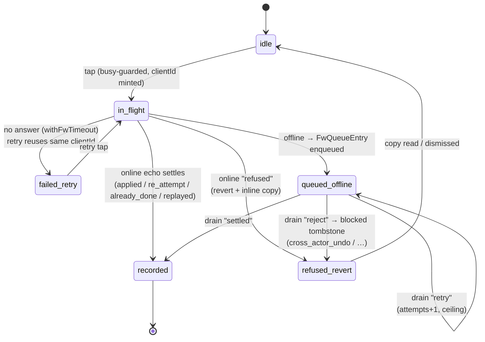

# feat: FW ops redesign, weekend editing, staff-as-guide, and the fast guide check-in loop

## Overview

Five connected upgrades to Founders Weekend tooling: (A) the `/fp/fw/ops` list page gets CRM-grade chrome (sticky pill tab row, ADMIN chip, archived filter, inline create, per-row archive/delete); (B) the weekend page gains window/timezone editing with a safe board-token re-mint path, a staff-as-guide grant path, and in-page section navigation; (C) the guide check-in flow is rebuilt around two left navs and inline icon decisions, retiring the per-task page; (D) quick-create loses its attestation checkbox (silent provenance stamp survives); (E) small copy/nav cleanups (Last used, Switch removal).

All product decisions were settled in the origin brainstorm through three review passes. This plan is the HOW.

## Problem Frame

See origin document. In short: the ops page reads as an unstyled utility; archive lives on the wrong page; weekends can't be corrected after creation (a Chicago weekend is stuck on Pacific time); staff accounts can't be added as guides; the guide check-in loop takes too many taps and page loads per decision; and several affordances (attestation checkbox, Same-tap batch, Recorded line, Next student, Switch link) slow guides down without earning their place.

## Requirements Trace

R1–R25 in the origin doc, grouped: chrome R1–R4, list R5–R10 (+R8a), create R11–R12, design R13, window edit R14/R14a, guides R15/R15a, quick-create R17/R17a, check-in flow R18–R23 (+R22a/R22b), weekend-view nav R16, copy/nav R24–R25. Each implementation unit names the requirements it advances.

## Scope Boundaries

From origin: no StaffBar changes (ADMIN chip lives in the ops tab row); no schema changes to make more weekends deletable (RESTRICT posture stays); batch capture is deliberately dropped; First Dollar confirm is deliberately removed (accepted risk recorded in origin Key Decisions); projected board and family-facing FP app untouched; cohort detail page changes only as R14/R15/R16 require.

## Context & Research

### Relevant Code and Patterns

- **Layer split (mandatory):** rules (`app/fp/lib/fw-*-rules.ts`, pure, owns copy) → core (`app/fp/lib/fw-*-core.ts`, `(db, input)` with injected `now`, no `"use server"`) → action (`app/fp/lib/actions/*.ts`, thin: gate → zod → core → copy → revalidate). Result types declared in core, never re-exported from `"use server"` files.
- **Action canon:** `app/fp/lib/actions/fw-ops.ts` — gates (`resolveFwStaffGate` cohort-free, `requireCohortStaff` per-cohort), default-less refusal-copy switches, `revalidatePath` tiers (`/fp/fw/ops`, `/fp/fw/ops/cohort/${id}`, `/fp/fw` only when the picker changes), redirect-from-the-action (never `router.push`+`refresh`).
- **Test harness:** `app/fp/lib/__tests__/fw-ops-core.test.ts` — `makeFakeDb(seed)` with `Failure {table, op, applyAnyway?, onCall?}` fault injection. Copy for every new core function.
- **Confirm model:** `anonymizeStudentAction` (`confirmName` re-verified in the core) is the server-verified pattern; `FwArchiveControl`'s typed slug is client-only today.
- **Sticky contract:** `sticky top-[var(--staff-bar-h,0px)] z-10 … bg-hq-canvas/95 backdrop-blur` (`app/fp/fw/(app)/ops/layout.tsx`); `CrmTabs` (`app/crm/components/CrmTabs.tsx`) is the pill visual (deliberately non-sticky — the ops row is a new sticky variant).
- **Menu/modal precedents:** `app/crm/components/dossiers/StatusMenu.tsx` (a11y-complete ARIA menu), `app/crm/components/pipeline/DrawerHeader.tsx` (per-row ⋯ structure), `AddFamilyModal` + `app/crm/components/useFocusTrap.ts` (modal canon; not yet imported under `/fp`), First Dollar dialog in `FwTaskView.tsx` (being removed).
- **Sidebar precedent:** `app/fp/components/shell/PathShell.tsx` (236px aside, `aria-current`).
- **Capture engine:** `fw-sync-engine.ts` (drain core; tri-state authorize), `fw-checkin-core.ts` (`runFwCheckIn` — the sole write choke point), `fw-sync-client.ts` (only IDB toucher; `readPendingFwOpsFor`; Web Lock `fw-offline-drain` NOT reentrant), `transition-table.ts` (shared decision table — read its caller-obligations docblock before touching flips), client-id ledger + unique `client_id` indexes as idempotency keys.
- **SW:** `public/sw.js` — never cache navigations except `isFwAppShell` (excludes `/fp/fw/board` and `/fp/fw/ops`); shell cache `path-sw-fw-shell-v1`, 24 entries; pinned by `app/fp/lib/__tests__/sw-discipline.test.ts`. `path-*` identifiers are deliberately kept — never rename.
- **Pinned tests to update:** `app/lib/staff-bar/__tests__/bar-wiring.test.ts` (canSwitch pin, ops-header pins), `sw-discipline.test.ts`, `fw-form-wiring.test.ts` (isNextRedirect ordering).
- **DB truth for delete/edit:** FKs into `path_cohorts`, all RESTRICT (or NO ACTION): `path_cohort_members`, `path_task_events`, `path_fw_board_tokens`, `path_fw_replay_rejects`, `path_fw_ops_audit`, `path_fw_import_exceptions`, `path_student_profiles.intended_cohort_id`. Board expiry = `ends_at`+6h **stored at mint**. Guide grants in `path_role_grants`.

### Institutional Learnings (docs/solutions/)

- Deleting a `"use server"` export = deploy-skew hazard (old bundles hold action ids); keep result types, never sequence client mutations before the server call (2026-07-27).
- `revalidatePath` + `redirect()` from the action; `isNextRedirect` first in client catch; try/catch/**finally** on every awaited action (2026-07-28, 2026-07-20).
- Destructive act + its authorizing check must share ONE classifier, or drift yields `ok:true`+`cleared:false` forever (2026-07-27).
- Multi-step PostgREST writes have no transaction: compensation + post-write verify + CAS claims (2026-07-22); audit rows key off verified outcome, not reported success (2026-07-24).
- Route retirement: boundary sweep + count-bounded straggler test; SW shells keep serving old URLs — redirect, don't 404 (2026-07-24).
- Revocation clearing must sweep every name-bearing store; a 404 is not proof of revocation (tri-state reducer in `fw-board-rules.ts`) (2026-07-28).
- Drain signals must be tri-state (success / positively-no / could-not-tell→retry); Web Locks re-entry hangs; bound the client's own await with `withFwTimeout` (2026-07-24/27).
- Migrations: apply immediately via Management API playbook (token in Windows Credential Manager); split schema vs data phases; parity tests must be mutation-checked (2026-07-13/14/23).

### External References

None — local patterns are dense and current for every layer touched.

## Key Technical Decisions

- **Delete confirm follows the anonymize pattern, not FwArchiveControl:** the typed slug travels in the action input and is re-verified in the core against the stored slug. While touching the archive path for list-side use, **upgrade archive's confirm to server-verified too** (add `confirmSlug` to the schema/core) so the two destructive confirms share one posture. (Flow gap 1.)
- **One shared "untouched" classifier:** `fwCohortUntouchedVerdict` lives in the core and is used by BOTH the list affordance (menu shows Delete) and `deleteFwCohort` itself, which re-runs it inside the delete sequence and treats the FK RESTRICT error as the backstop, mapping it to a `not_untouched` refusal. Never two hand-written predicates. (Learning 2026-07-27.)
- **Window edit and re-mint are one composed core sequence:** `updateFwCohortWindow` validates via `fwCohortWindowFromLocal` (reusing the DST-aware rules + `FW_EVENT_TIME_ZONES` allowlist), updates the row, writes an audit record. The separate `remintBoardTokenForWindow` action runs the mint verdict **against the corrected window first**, and only if mintable revokes (CAS `expectedTokenId`) then mints — never revoke-then-refuse, which would strand a dead projector. (Flow gap 2.)
- **Staff-as-guide needs a roster discriminator:** `listFwCohortGuides` gains a per-row `isStaff` signal (join against the staff row per grant-holder) because a staff grant-holder is otherwise indistinguishable from a failed invite (`never_invited`). UI suppression alone cannot distinguish them. The grant path relaxes only the adoption refusal in `provisionFwGuide`; `issueFwGuideInvite`'s `isGuideAccount` gate is untouched (structurally unreachable for staff). (Flow gap 3.)
- **Archived cohorts stay check-in-writable** (existing deliberate posture: queued offline captures must drain after archive; picker exposure for non-staff guides unchanged). Recorded here so the rebuilt guide surface doesn't "fix" it. (Flow gap 4.)
- **The composed flip is two ORDINARY queue entries, client-sequenced — not a new op kind:** the engine's ordered replay with halt-on-first-non-settle already provides leg-2-conditional-on-leg-1 (a terminally-rejected undo rejects the follow-on with the same reason; `planFwStudentTask` rejects a guarded leading-undo sequence as a unit). A composed op kind is rejected outright: `FwQueueEntry.action` feeds the `path_fw_replay_rejects.action` CHECK constraint, one entry carries one idempotency key for what are two server writes, and any shape change bumps `FW_QUEUE_ENTRY_SCHEMA_VERSION`. Three pins make the pair safe: (1) both legs enqueue in ONE call that stamps strictly increasing `enqueuedAt` — `orderFwEntries` tiebreaks same-millisecond entries by random UUID, and a mis-ordered `[not_yet, undo]` reduces as a cancel pair, silently losing the flip; (2) each leg carries its own client id (`fwTapKey` already keys per action), stable across every retry — shared ids make the RPC's replay probe swallow leg 2 as `replayed`; (3) the engine/online gate treats `replayed` as leg-success (a replayed undo still releases leg 2). Offline: enqueue both legs unconditionally. Online: awaited leg 1, gated leg 2 (fire on `applied`/`already_done`/`replayed`; also on `not_a_decision` since not_yet is legal from work states), and on `unavailable`/throw backstop-enqueue BOTH legs, **each reusing its own held client id** (both minted before the online attempt — leg 2 must never ride leg 1's id or the replay probe swallows it as `replayed`). Legs never share an `action_id`. Note `enqueueFwCheckIns` cannot host this — its shape is one-action-many-students with one shared `actionId` by design (board celebration grouping); the flip needs the inverse, so Unit 9 adds a new enqueue entry point taking ordered per-leg tuples (action, actionId, clientId) for one student. (Flow gap 5; deepening research 2026-07-28.)
- **Task detail is server-rendered into the student page** (not fetched on demand): the (i) modal must work offline on the surface built for offline, and detail comes from the static content bundle (pinned program version) — no DB cost. The retired task URLs get a server-side redirect to the student page; the FW shell cache name bumps `path-sw-fw-shell-v1` → `-v2` in the same deploy so online devices refetch fresh HTML (old shells hold dead action ids). (Flow gaps 6; learning 2026-07-24.)
- **Quick-create and the PR #86 unfinished-student banner keep first-class homes** in the new sidebar layout: the banner renders above the two-pane area; quick-create is reachable from the student sidebar (+ row at its foot). The resume/finish-setup flow must survive the restructure. (Flow gap 7.)
- **Window-edit attribution uses per-row columns, NOT `path_fw_ops_audit`:** the audit table's `subject_user_id` is NOT NULL (a window edit has no user subject) and its charter is deliberately narrow (the two liability actions + anonymize; everything else is actor-attributed by its own rows — `created_by`, `revoked_by`). One small migration adds nullable `path_cohorts.window_edited_by/window_edited_at`, following that established pattern, applied immediately via the Management API playbook. This migration is definite, not conditional. (Deepening research 2026-07-28.)
- **No schema migration for delete** (RESTRICT already in place). **Delete writes no audit row** (schema cannot anchor one to a deleted cohort; origin Key Decision). The refusal copy for "stopped being untouched" is a new member of the ops copy switches.
- **The delete backstop has exactly one hole, and the plan closes it:** every referencing table self-defends via 23503 (RESTRICT, or NO ACTION on `path_student_profiles.intended_cohort_id` — equivalent for non-deferrable constraints) EXCEPT `path_role_grants`, whose `scope_id` is deliberately polymorphic with no FK. The classifier therefore probes grants directly, and the delete sequence ends with a post-delete grant sweep for the cohort scope so a grant landing between probe and delete is removed rather than orphaned. (Deepening research 2026-07-28.)

## Open Questions

### Resolved During Planning

- Archive confirm server-verification gap → upgrade archive alongside delete (above).
- Revoke+re-mint failure mode → verdict-first composed sequence (above).
- Roster ambiguity for staff grant-holders → per-row staff discriminator (above).
- Archived-writable posture → kept, recorded (above).
- Flip atomicity → single composed queue entry / dependent pair (above).
- Old-shell deploy skew → shell cache name bump + redirect (above).
- Modal content source → static bundle server-rendered into the student page (above).

### Deferred to Implementation

- Exact mechanism for strictly-increasing `enqueuedAt` inside the single flip-enqueue call (stamp-and-increment vs caller-supplied ordinal) — depends on `enqueueFwCheckIns` internals at implementation time. (Representation itself is resolved: two ordinary entries.)
- Final icon glyphs and per-state visual treatment (recorded / queued / failed / refused) within R22a's honesty contract.
- Whether `fwOpsCohortAffordances` absorbs the untouched verdict or a sibling helper carries it.
- Exact section-nav status-chip derivations for the seven ops sections (from data already loaded).

## High-Level Technical Design

> *This illustrates the intended approach and is directional guidance for review, not implementation specification. The implementing agent should treat it as context, not code to reproduce.*

### Inline decision control (Unit 9)

State names are the engine's real vocabulary: `runFwCheckIn`'s result kinds (`applied` / `re_attempt` / `already_done` / `replayed` / `refused` / `failed`), the replay dispositions (`settled` / `reject` / `retry`), and the `blocked` tombstone.



The flip (checked → Not-yet) is one tap producing **two ordered ordinary entries** (undo, then not_yet — distinct stable client ids, strictly increasing `enqueuedAt`, one enqueue call); the drain's ordered replay is the conditionality. A pending flip's leading undo makes `projectFwPendingState` deliberately project the server state unchanged — the row needs a distinct *pending* marker rather than a premature not_yet paint (that conservatism is documented in the function; don't "fix" it).

### Window edit → re-mint (Unit 4)

```mermaid
sequenceDiagram
    participant S as Staff
    participant C as fw-ops-core
    participant R as fw-board-rules
    participant DB
    Note over S,DB: updateFwCohortWindow — always succeeds independent of the token
    S->>C: corrected local window + zone
    C->>R: fwCohortWindowFromLocal (DST + zone allowlist)
    C->>DB: UPDATE path_cohorts (starts_at+ends_at together; window_edited_by/at)
    Note over DB: live token keeps its STORED expires_at
    Note over S,DB: remintFwBoardTokenForWindow — verdict FIRST
    S->>C: re-mint (expectedTokenId from the page)
    C->>R: fwBoardTokenMintVerdict(corrected window, now)
    alt not mintable (window_passed / cohort_archived / …)
        C-->>S: refusal — old token still live
    else mintable
        C->>DB: revoke CAS (id = expectedTokenId)
        alt zero rows (stale_view / no_active_token)
            C-->>S: refusal — reload; nothing revoked blind
        else revoked
            C->>DB: insert token (expires_at = corrected ends_at + grace)
            C-->>S: new URL, shown once
        end
    end
```

Invariant across both alts: **no path revokes the prior token without minting a replacement.** Implementation note: `mintFwBoardToken` already embeds its own revoke-then-insert-with-compensation sequence — the re-mint threads `expectedTokenId` through that existing sequence rather than building a sibling one (two mint sequences with subtly different compensation would be the drift hazard).

## Implementation Units

Phases A–D are dependency-ordered; units within a phase are mostly independent. D can land any time **except Unit 11's Switch removal, which requires Unit 7's weekend-name picker link to be live first** (Unit 10 is unconstrained). Units 8 and 9 must **deploy in the same release**: Unit 8 retires the only capture surface (the task page mounts `FwTaskView`), and Unit 9 supplies its replacement — landing 8 alone leaves guides with no way to record a decision.

### Phase A — /fp/fw/ops list redesign (R1–R13)

- [x] **Unit 1: Sticky ops tab row + layout chrome**

**Goal:** Replace the ops header with the CRM-style sticky pill row: Weekends (active), Guide view link, ADMIN chip, archived toggle, pinned +.

**Requirements:** R1–R4, R10 (toggle placement), R11 (+ placement), R13.

**Dependencies:** None.

**Files:**
- Create: `app/fp/fw/components/FwOpsTabRow.tsx`
- Modify: `app/fp/fw/(app)/ops/layout.tsx`, `app/fp/fw/(app)/ops/page.tsx`
- Test: `app/lib/staff-bar/__tests__/bar-wiring.test.ts` (update ops-header pins), `app/fp/lib/__tests__/fw-ops-chrome-wiring.test.ts` (new source-assertion pins)

**Approach:** New client component: CrmTabs pill visuals in HQ tokens, ops-header stickiness (`top-[var(--staff-bar-h,0px)]`, z-10, backdrop-blur, 0px fallback). Pathname/searchParams-driven active state; archived toggle is a Link flipping `?archived=1` (shareable URL preserved); + is pinned outside the scrollable pill region; ADMIN chip is static server-safe markup (ops is SW-excluded — verified). Guide view Link to `/fp/fw`. The old header block is removed.

**Patterns to follow:** `CrmTabs.tsx` (pills, overflow-x-auto, aria-current), ops layout sticky contract, chip recipe from ops page TOKEN_CHIP.

**Test scenarios:**
- Happy path: source pins assert the row keeps `--staff-bar-h` offset with `0px` fallback, the `?archived=1` Link, and the `/fp/fw` guide-view link (node-env source-assertion style — no jsdom).
- Edge: pins assert + control is outside the `overflow-x-auto` region (375px contract).
- Integration: `bar-wiring.test.ts` still passes with rewritten ops-header assertions.

**Verification:** `/fp/fw/ops` shows StaffBar + one sticky tab row + list; archived toggle round-trips via URL; chrome scrolls correctly under the bar at 375px.

- [x] **Unit 2: Weekend rows with overflow menu; archive/restore from the list; inline create**

**Goal:** Clean list rows with a ⋯ menu (Archive/Restore, Delete when eligible), typed-slug confirm, and the + expanding `FwCohortCreate` inline.

**Requirements:** R5–R7, R9, R11–R12.

**Dependencies:** Unit 1 (row hosts), Unit 3 (delete affordance verdict — menu can land with Archive only and gain Delete when Unit 3 merges).

**Files:**
- Create: `app/fp/fw/components/FwOpsRowMenu.tsx`, `app/fp/fw/components/FwOpsCreatePanel.tsx`
- Modify: `app/fp/fw/(app)/ops/page.tsx`, `app/fp/lib/actions/fw-ops.ts` (archive schema gains `confirmSlug`), `app/fp/lib/fw-ops-core.ts` (`archiveFwCohort` verifies confirm), `app/fp/lib/fw-ops-rules.ts` (confirm-mismatch copy), `app/fp/fw/components/FwArchiveControl.tsx` (**must upgrade in lockstep** — it currently calls `archiveCohortAction({ cohortId })` with the typed slug consumed client-side only; once the schema requires `confirmSlug`, the cohort-page control sends `confirmSlug: typed` or archive dies on that page)
- Test: `app/fp/lib/__tests__/fw-ops-core.test.ts`, `app/fp/lib/__tests__/fw-ops-rules.test.ts`

**Approach:** Row becomes a card with a separate link region + sibling menu button (a whole-card `<Link>` cannot legally nest a button). Menu: DrawerHeader structure with StatusMenu's a11y (roving tabindex, Escape returns focus, outside-close). Confirm: inline expanding panel below the row (FW canon), typed slug sent to the action and re-verified in core (`fwArchiveConfirmMatches` moves server-side; `confirm_mismatch` refusal). Failure copy renders inline in the panel (`role="alert"`). Create: + toggles `FwOpsCreatePanel` wrapping `FwCohortCreate` at the top of the list; on success auto-collapse, `router.refresh()`, and render the new row (success message links to the new cohort — the action already returns `cohortId`). try/catch/finally on every await.

**Patterns to follow:** `StatusMenu.tsx`, `DrawerHeader.tsx`, `FwArchiveControl.tsx` (panel visuals), `FwCohortCreate.tsx`, `fw-form-wiring.test.ts` (isNextRedirect ordering).

**Test scenarios:**
- Happy path: `archiveFwCohort` with matching `confirmSlug` archives (board revoked first — existing sequence unchanged); restore path unchanged.
- Error path: mismatched `confirmSlug` → `confirm_mismatch`, nothing written (fault-injected fake DB asserts no update).
- Error path: `revoke_failed` still aborts archive (regression pin).
- Edge: archive an already-archived cohort → existing idempotent behavior preserved.
- Copy: new refusal member exercised through the default-less switch (compile-level exhaustiveness).

**Verification:** Archive/restore work from the list with inline confirm and inline failure copy; create appears only after +, collapses on success with a link to the new weekend.

- [x] **Unit 3: Truly-untouched hard delete**

**Goal:** `deleteFwCohort` core + action + menu wiring: Delete offered only for never-touched weekends, typed-slug server-verified, RESTRICT as backstop.

**Requirements:** R7, R8, R8a.

**Dependencies:** Unit 2 (menu host). No schema migration.

**Files:**
- Modify: `app/fp/lib/fw-ops-core.ts` (`fwCohortUntouchedVerdict`, `deleteFwCohort`, `listFwOpsCohorts` gains per-row untouched flag), `app/fp/lib/actions/fw-ops.ts` (`deleteCohortAction`), `app/fp/lib/fw-ops-rules.ts` (delete refusal copy incl. "stopped being untouched"), `app/fp/fw/components/FwOpsRowMenu.tsx`
- Test: `app/fp/lib/__tests__/fw-ops-core.test.ts`, `app/fp/lib/__tests__/fw-ops-rules.test.ts`

**Approach:** ONE classifier: `fwCohortUntouchedVerdict(db, cohortId)` probes all referencing tables: `path_cohort_members`, `path_task_events`, `path_fw_board_tokens` (any row ever, revoked included), `path_fw_replay_rejects`, `path_fw_ops_audit`, `path_fw_import_exceptions`, `path_student_profiles.intended_cohort_id` AND `.cohort_id` (RESTRICT FK exists even though FW never sets it), AND `path_role_grants` scoped to the cohort (`role='guide', scope_type='cohort'`, served by `path_role_grants_scope_idx`) — grants have NO FK, so the DB backstop cannot catch them. The list affordance and the delete both call it. Delete sequence: gate (`requireCohortStaff`), verify `confirmSlug` in-core, re-run the classifier, DELETE, post-write verify the row is gone, then a post-delete grant sweep for the cohort scope (closes the probe→delete race for the one non-FK table). A 23503 maps to `not_untouched` (backstop for every FK'd table; `intended_cohort_id`'s NO ACTION behaves identically for non-deferrable constraints — don't "fix" it). No audit row (origin decision). Revalidate `/fp/fw/ops` AND `/fp/fw` (picker may have listed it for staff), plus the cohort path.

**Test scenarios:**
- Happy path: seeded untouched cohort deletes; post-write verify passes.
- Error path: cohort with one audit row → `not_untouched`; with a revoked board token → `not_untouched` (minted-then-revoked is touched — origin decision); with an intended_cohort reference → `not_untouched`.
- Error path: confirm mismatch → refusal, no delete attempted.
- Edge (race): classifier passes, then FK 23503 on DELETE (row added between check and delete via `onCall` fault) → `not_untouched` refusal, copy says the weekend stopped qualifying.
- Edge: `applyAnyway` fault (delete landed, response lost) → post-write verify treats gone-row as success (idempotent retry safe).
- Edge: cohort with only a guide grant and no audit row (the reachable grant-without-audit state) → `not_untouched` via the direct grant probe.
- Edge: grant lands between classifier pass and DELETE (`onCall` fault) → delete succeeds, post-delete sweep removes the orphan grant.
- Copy: every refusal member has a sentence (default-less switch).

**Verification:** Delete appears in the menu only for untouched weekends; deleting one removes it from the list; a touched weekend can never be deleted through any path.

### Phase B — Weekend page: edit, staff-as-guide, section nav (R14–R16)

- [x] **Unit 4: Window/timezone edit + safe re-mint**

**Goal:** Edit start/end/timezone on the weekend page; when a live board token exists, offer verdict-first revoke+re-mint.

**Requirements:** R14, R14a.

**Dependencies:** None (parallel with Phase A).

**Files:**
- Create: `app/fp/fw/components/FwWindowEdit.tsx`
- Create: `supabase/migrations/<ts>_fw_window_edit_attribution.sql` (nullable `path_cohorts.window_edited_by/window_edited_at` — the `created_by`/`revoked_by` per-row attribution pattern; applied immediately via the Management API playbook)
- Modify: `app/fp/lib/fw-ops-core.ts` (`updateFwCohortWindow`, `remintFwBoardTokenForWindow`), `app/fp/lib/actions/fw-ops.ts` (two actions), `app/fp/lib/fw-ops-rules.ts` (copy), `app/fp/fw/(app)/ops/cohort/[cohortId]/page.tsx`, `app/fp/lib/__tests__/fw-ops-migration-parity.test.ts` (new columns pinned)
- Test: `app/fp/lib/__tests__/fw-ops-core.test.ts`, `app/fp/lib/__tests__/fw-ops-rules.test.ts`

**Approach:** Both actions gate on `requireCohortStaff(cohortId)` (per-cohort, like delete — not the cohort-free gate). Edit form prefills via `fwEventLocalParts`; validation reuses `fwCohortWindowFromLocal` (DST-gap refusals, `FW_EVENT_TIME_ZONES` allowlist) — no new window math. Attribution is per-row (`window_edited_by/at` stamped in the same UPDATE), NOT a `path_fw_ops_audit` row — its `subject_user_id` is NOT NULL and its charter is the liability actions only (Key Decision). `starts_at` and `ends_at` are always written together (the `path_cohorts_window_ordered` CHECK can 23514 a partial update). The page shows the stored-expiry truth when a live token exists with a one-click re-mint: `remintFwBoardTokenForWindow` runs `fwBoardTokenMintVerdict` against the **corrected** window FIRST; only if mintable does it revoke (CAS `expectedTokenId`) then mint — threading through `mintFwBoardToken`'s existing revoke-then-insert-with-compensation sequence rather than a sibling sequence. A non-mintable corrected window returns a refusal with the old token untouched. Editing while live is allowed (origin decision); edits landing in the past are allowed but re-mint refuses (`window_passed`) — copy says so. An edit racing a concurrent mint can produce a token stamped from the pre-edit window — benign because the page renders stored-expiry truth; noted, not fixed.

**Test scenarios:**
- Happy path: Chicago Pacific→Central edit updates row + `window_edited_by/at` stamped; `fwEventLocalParts` round-trips.
- Error path: end before start / DST-nonexistent start → existing rules refusals surface.
- Error path: re-mint on a corrected-to-past window → refusal, old token still live (fake DB asserts no revoke happened).
- Edge (race): CAS mismatch on revoke (another staff re-minted concurrently) → refusal, no second mint.
- Edge: partial-update attempt (only `ends_at`) is structurally impossible — core always writes the pair (pinned by a scenario asserting both fields in the update payload).
- Integration: after successful re-mint, exactly one active token row (partial unique index honored).

**Verification:** The mis-zoned weekend corrects to Central from its page; a live board link is never revoked without a replacement mintable; audit trail records the edit.

- [x] **Unit 5: Staff-as-guide grant-only path + roster discriminator**

**Goal:** Adding a staff email grants guide access (no invite, no email); roster renders staff grant-holders distinctly.

**Requirements:** R15, R15a.

**Dependencies:** None.

**Files:**
- Modify: `app/fp/lib/fw-guide-core.ts` (`provisionFwGuide` staff branch), `app/fp/lib/actions/fw-guide.ts` (copy; success shape distinguishes granted-existing vs created+invited), `app/fp/lib/fw-ops-core.ts` (`listFwCohortGuides` per-row `isStaff`), ops cohort page Guides section component
- Test: `app/fp/lib/__tests__/fw-guide-core.test.ts` (or the suite covering provision), `app/fp/lib/__tests__/fw-ops-core.test.ts`

**Approach:** In `provisionFwGuide`, when the address resolves to an existing account: if the account holds a live staff row → grant-only branch (idempotent upsert anchored by the `path_role_grants` unique `(user_id, role, scope_type, scope_id)` constraint the existing `onConflict` already targets; audit with staff-branch-appropriate metadata keyed to verified outcome; **no invite row, no email**). The grant and audit writes remain two untransacted calls (grant-without-audit is reachable) — acceptable because Unit 3's classifier probes grants directly. Non-staff existing accounts keep the `address_in_use` refusal (origin deferred question resolved conservatively — staff-only). `issueFwGuideInvite` untouched. Cohort gates unchanged (archived still refuses). `listFwCohortGuides` joins staff-ness per grant-holder so the roster shows "Staff" instead of a credential state; re-issue affordance suppressed for staff rows; "all guides claimed" checklist excludes staff rows from its denominator. Success UI states which branch happened ("granted existing staff account — no email sent" vs the existing invite message).

**Test scenarios:**
- Happy path: staff email → grant written, `invited` leg skipped entirely (fake DB asserts zero invite-table writes), success reports the grant branch.
- Edge: same staff added twice → idempotent already-a-guide success, single grant row.
- Error path: non-staff existing account → `address_in_use` unchanged; archived cohort → `cohort_archived` unchanged.
- Error path: grant write lands but response lost (`applyAnyway`) → retry is idempotent, no duplicate grant.
- Roster: staff grant-holder renders `isStaff: true` and no `never_invited` state; a real guide with a failed invite still shows `never_invited` (the discriminator works).
- Integration: revoking a staff member's guide grant removes the grant row only — account and credentials untouched (existing `revokeFwGuideGrant` path, new test).

**Verification:** pkuperman@gmail.com is addable as a guide with no email sent; roster shows the staff badge; checklist math ignores staff rows.

- [x] **Unit 6: Ops weekend page section navigation**

**Goal:** Sticky in-page jump nav for the seven sections with at-a-glance possibility signals.

**Requirements:** R16.

**Dependencies:** Unit 4 (page layout settles after the edit section lands).

**Files:**
- Create: `app/fp/fw/components/FwOpsSectionNav.tsx`
- Modify: `app/fp/fw/(app)/ops/cohort/[cohortId]/page.tsx` (section ids, nav data derivation)
- Test: `app/fp/lib/__tests__/fw-ops-rules.test.ts` (chip-derivation helper if extracted to rules)

**Approach:** The page already loads all section data in one pass — the nav derives per-section status chips from that same load (R16's constraint: no lazy forms). Sticky under the tab-row offset chain; anchor jumps with `scroll-margin-top` on sections; focus moves to the target heading on jump (a11y). No accordion/tabs — sections stay rendered.

**Test scenarios:**
- Rules-level: chip derivation for each section state (e.g. board: live/expired/none; guides: n unclaimed; exceptions: n open) if extracted as a pure helper — one scenario per section state family.
- Test expectation for the nav component itself: none — presentation-only wiring, pinned only if a source invariant emerges.

**Verification:** Any section reachable in one interaction from the top; chips reflect the same data the sections render.

### Phase C — Guide check-in redesign (R18–R23)

- [x] **Unit 7: Two-pane guide layout — student sidebar**

**Goal:** Cohort view becomes sidebar (first name + last initial, alphabetical, scrollable) + content pane; quick-create and the PR #86 banner keep homes; weekend name links to picker.

**Requirements:** R18, R23, R25 (header link), part of R13.

**Dependencies:** None within C; coordinates with Unit 11 (Switch removal pins).

**Files:**
- Create: `app/fp/fw/components/FwStudentSidebar.tsx`
- Modify: `app/fp/fw/(app)/cohort/[cohortId]/page.tsx`, `app/fp/fw/(app)/cohort/[cohortId]/layout.tsx` (weekend name → Link to `/fp/fw`), `app/fp/fw/components/FwRoster.tsx` (fold into new layout or retire), `app/fp/fw/components/FwRosterCache.tsx` + `app/fp/fw/components/FwOfflineRoster.tsx` (the offline roster path MUST survive: online renders keep seeding the IDB roster cache; the server-read-failure branch renders the cached-roster fallback in the sidebar), `app/fp/lib/fw-nav-rules.ts` (name-format + sort + collision rule)
- Test: `app/fp/lib/__tests__/fw-nav-rules.test.ts`

**Approach:** Name rendering is a pure rules function: "First L." with a collision rule (two Maya R.'s → extend the surname until distinct, e.g. "Maya Ro." / "Maya Ru."; falls back to full last name). Locale-aware alphabetical sort. Sidebar is PathShell-style aside with `aria-current` on the active student, scrollable, quick-create reachable from a + row at its foot (opens `FwQuickCreate` in the content pane). The resume/finish-setup seam (banner "Finish setup" → keyed `FwQuickCreate` with a resume target) crosses from banner to pane via **URL state** (`?finish=<profileId>`) rather than a shared client parent — the pane may be server-rendered with no common client ancestor, and a URL survives reloads on flaky venue wifi. The unfinished-student banner renders above the two-pane area. At narrow widths the sidebar collapses to a top strip or drawer — pick during implementation, but the R23 loop must stay one-tap-per-leg at 375px. Archived-writable posture unchanged.

**Test scenarios:**
- Happy path: name formatting ("Maya Rodriguez" → "Maya R."), alphabetical ordering incl. case/locale.
- Edge: collision → deterministic disambiguation; both orderings stable.
- Edge: empty roster → sidebar shows the empty state + quick-create entry.
- Happy path: single-cohort picker redirect behavior unchanged (`fwPickerRedirectsToSingleCohort` regression).

**Verification:** Tap a name → that student's view loads in the pane; quick-create and banner still reachable; weekend name navigates to `/fp/fw`.

- [x] **Unit 8: Student view — phase nav, accordion with inline detail, task-page retirement**

**Goal:** Second left nav (Sell/Build/Validate/Grow/Scale), steps accordion with server-rendered detail behind (i) modals, `task/[taskId]` redirected away, SW shell cache bumped.

**Requirements:** R19, R20 (structure), R21, R23.

**Dependencies:** Unit 7 (pane host).

**Files:**
- Create: `app/fp/fw/components/FwPhaseNav.tsx`, `app/fp/fw/components/FwTaskDetailModal.tsx`
- Modify: `app/fp/fw/(app)/cohort/[cohortId]/student/[studentId]/page.tsx` (render all phases/steps + detail from the static bundle), `app/fp/fw/components/FwTaskTree.tsx` (accordion hosts inline controls + (i)), `app/fp/fw/(app)/cohort/[cohortId]/student/[studentId]/task/[taskId]/page.tsx` (→ server redirect to the student page), `public/sw.js` (shell cache name `-v1` → `-v2`)
- Test: `app/fp/lib/__tests__/sw-discipline.test.ts` (cache-name pin), `app/fp/lib/__tests__/fw-nav-rules.test.ts` (tree/phase selection), route straggler sweep per the 2026-07-24 playbook (count-bounded allowlist)

**Approach:** Phase nav renders the five single-word phases from the student's pinned program (via `buildFwTaskTree`), `aria-current` on the active phase. All detail (body, done-when, band variant) server-renders into the page from the static content bundle — offline-capable by construction; the (i) modal (AddFamilyModal canon; port `useFocusTrap` into `/fp` or inline an equivalent) shows it on demand. The task page becomes a redirect (never 404 — installed SW shells hold those URLs); shell cache bump ships in the same deploy so online devices refetch HTML that references live action ids. Deleted actions keep their exported result types (skew).

**Test scenarios:**
- Happy path: tree/phase derivation — five phases, steps per phase, active selection rules.
- Integration: `sw-discipline.test.ts` passes with `-v2`; straggler sweep finds zero live references to the retired route (allowlist counts pinned).
- Edge: redirect preserves cohort/student context (task URL → its student page, not the picker).
- Test expectation for modal markup: none — presentation; focus-trap behavior noted for manual verification (no jsdom).

**Verification:** A phase's steps render with detail available offline via (i); old task URLs land on the student page; no reference to the retired route survives outside the allowlist.

- [x] **Unit 9: Inline icon decisions over the capture engine**

**Goal:** Icon-only Check/Not-yet/Undo inline per step: honest optimistic state, composed flips, removals (Same-tap, Recorded, Next student, First Dollar confirm).

**Requirements:** R20 (controls), R22, R22a, R22b, R23; origin Key Decisions (batch drop, First Dollar removal).

**Dependencies:** Unit 8.

**Files:**
- Create: `app/fp/fw/components/FwInlineDecision.tsx`
- Modify: `app/fp/fw/components/FwTaskView.tsx` (retire; salvage its engine wiring into the inline control), `app/fp/lib/fw-sync-rules.ts` (flip ordering; pending-flip projection marker) + `app/fp/lib/fw-sync-client.ts` (new per-leg-tuple enqueue entry point for the flip; `readPendingFwOpsForStudent` bulk read). `fw-rules.ts`/`transition-table.ts` are NOT modified — the composed-op-kind route was rejected (Key Decision)
- Test: `app/fp/lib/__tests__/fw-sync-rules.test.ts`, `app/fp/lib/__tests__/fw-sync-engine.test.ts`, `app/fp/lib/__tests__/fw-rules.test.ts`

**Approach:** The inline control is `FwTaskView`'s engine contract in a smaller body: direct awaited action with `withFwTimeout`, try/catch/finally. **Ledger:** ONE per student page (created in the page-level client component, shared by rows) — `fwTapKey` already keys per (task, student, action), so no key changes; an unsettled id now survives row remounts, which is the ledger's point. **Pending reads:** one `getAll` scan per student page (`readPendingFwOpsForStudent` in `fw-sync-client.ts` — no new IDB index; `fw-queue.ts` untouched), grouped per task, refreshed via the existing `subscribeFwQueue` notify. **Flip (per Key Decision):** one tap → two ordinary entries via a single enqueue call with strictly increasing `enqueuedAt` (fixing the same-ms random-tiebreak hazard in `orderFwEntries`); distinct stable client ids per leg; online path is two sequential awaited actions with leg 2 gated on leg 1 (`applied`/`already_done`/`replayed`/`not_a_decision` release it; `unavailable`/throw backstop-enqueues BOTH legs with held ids); no online CAS (offline-drain-only, existing posture). **Pending-flip rendering:** a pending sequence leading with undo deliberately projects the server state unchanged (`projectFwPendingState` conservatism — keep it); such rows show a distinct *pending* marker, never a premature not_yet paint. Visual states per R22a: idle / in-flight / recorded / queued-offline (distinct) / failed (retry inline) / refused (revert + inline copy). Removals: batch picker + shared-action-id grouping, Recorded line, Next student, First Dollar dialog (checkmark path unified — no confirm anywhere) — but the **undo-on-first-dollar banner retraction** (`foldFwSurfaceOutcome` retracts a standing bell banner) survives in the inline replacement. This does not contradict the origin's accepted risk ("undo does not un-ring it"): the celebratory *moment* on the board cannot be recalled once fired — what retraction does is take down a still-displayed banner, existing behavior kept. Icon buttons ≥44px with `aria-label`s; `re_attempt` only ever from a real tap, never from flip composition.

**Execution note:** Test-first on the rules layer — the composed-flip reducer semantics and the five-state projection are pure and must be pinned before the component is wired.

**Test scenarios:**
- Happy path: check on unchecked → apply; not_yet on unchecked → apply; undo on checked → apply (existing reducer regressions).
- Happy path: flip legs enqueued in one call carry strictly increasing `enqueuedAt`; `orderFwEntries` never reduces them as a cancel pair; drain replays undo→not_yet in order; final state not_yet with zero spurious `re_attempt`.
- Happy path: flip followed by an undo tap reduces `[undo, not_yet, undo]` → `[undo]` (existing cancel-pair logic composes).
- Error path: cross-actor flip rejects **as a unit** (`cross_actor_undo` on the whole reduced sequence); refusal surfaces inline; no lone not_yet fires.
- Error path: leg-1 drain disposition `retry` halts leg 2 as retry (not reject); queue intact.
- Error path: online leg 1 `unavailable` → both legs backstop-enqueued, each with its own held client id; drain is idempotent (a landed-but-unanswered undo replays as `replayed`, which still releases leg 2).
- Edge: a real tap enqueued in the same millisecond as a flip's two synthetic stamps orders after both legs (a third same-ms entry must never interleave between them).
- Edge: legs carry distinct client ids, each stable across retries — a shared-id flip would swallow leg 2 as `replayed` (pinned as a negative scenario).
- Edge: offline tap → queued state distinct from recorded; drain flips it without user action; sign-out drain gate unchanged.
- Edge: pending flip (leading undo) renders the pending marker while projecting server state unchanged.
- Edge: tap while a prior op for the same task is in flight → busy-guarded (no double enqueue).
- Regression: first-dollar checkmark records with NO confirm and produces the board celebration exactly once; undo on the first-dollar task still retracts a standing bell banner.

**Verification:** The R23 loop works end-to-end online and offline; every visual state maps to a real engine outcome; removed affordances are gone repo-wide (straggler sweep).

### Phase D — Small items (R17, R24, R25)

- [x] **Unit 10: Quick-create attestation removal + silent stamp**

**Goal:** Checkbox and enforcement layers removed; column silently stamped as provenance; banner untouched.

**Requirements:** R17, R17a.

**Dependencies:** None (coordinate with Unit 7's quick-create relocation if concurrent).

**Files:**
- Create: `supabase/migrations/<ts>_fw_notice_stamp_comment.sql` (comment-on-column semantic correction)
- Modify: `app/fp/fw/components/FwQuickCreate.tsx`, `app/fp/lib/actions/fw-student.ts` (schema drops the literal-true field), `app/fp/lib/fw-student-core.ts` (stamps submitting guide unconditionally), `scripts/fw-ops.ts`, `scripts/seed-fw-cohort.ts`
- Test: `app/fp/lib/__tests__/fw-student-core.test.ts` (or covering suite), `app/fp/lib/__tests__/fw-nav-rules.test.ts` (banner regression)

**Approach:** UI checkbox and disable-gating removed; action schema drops `noticeAttested` (old cached clients sending it are harmless — unknown keys strip; no strict mode); core stamps `notice_attested_by/at` from the authenticated actor unconditionally on the quick-create insert arm (both columns are nullable with no CHECK — nothing structural blocks the stamp). Result types unchanged (skew). Scripts updated in the same change. `fwUnfinishedStudents` untouched — its discriminator keeps working. **Semantics drift closed, not left standing:** a repo sweep asserts no reader renders `notice_attested_by/at` as consent (straggler-sweep style), and a one-line `comment on column` migration updates the columns' DB comments (currently "no adult has confirmed saw the program notice") to the provenance meaning — applied via the playbook.

**Test scenarios:**
- Happy path: quick-create without any attestation input stamps the actor; banner candidate query still matches the created row.
- Edge: old-client payload including `noticeAttested: true` still succeeds (skew tolerance).
- Regression: import path still stamps null (importer's deliberate posture unchanged).

**Verification:** Three-field submit, no checkbox; PR #86 banner still surfaces a half-created student.

- [x] **Unit 11: Copy + Switch removal**

**Goal:** "Last used" label; Switch link removed with pins updated.

**Requirements:** R24, R25.

**Dependencies:** Unit 7 lands the weekend-name picker link (R25's replacement path).

**Files:**
- Modify: `app/fp/fw/components/FwCohortPicker.tsx`, `app/fp/fw/(app)/cohort/[cohortId]/layout.tsx`
- Test: `app/lib/staff-bar/__tests__/bar-wiring.test.ts` (drop the `canSwitch` pin, keep `includeArchived: true` pinned for the archived header-name case, rewrite rationale comment)

**Approach:** Two independent edits. Picker: the "Last used on this iPad" string in `FwCohortPicker` becomes "Last used" — copy only, no behavior. Cohort layout: remove the `canSwitch` conditional and its Link entirely (the unfiltered cohort list stays — it still feeds the archived-cohort header name); the weekend name in the header is already a Link to the picker after Unit 7, which is why Unit 7 must land first. Update the bar-wiring pins in the same commit as the layout change so the suite never goes red between commits.

**Test scenarios:**
- Pins: updated bar-wiring assertions pass; repo sweep finds no surviving Switch-link markup.
- Test expectation for the label change: none — copy only.

**Verification:** Picker says "Last used"; cohort header has no Switch; multi-cohort navigation works via the weekend-name link.

## System-Wide Impact

- **Interaction graph:** the capture engine's write choke point (`runFwCheckIn`), drain lock, and SW messaging are all reused, not modified — except the composed-flip representation, which touches `fw-sync-rules.ts` and the engine fold. The board reducer (`fw-board-rules.ts`) is untouched; re-mint uses existing mint/revoke cores.
- **Error propagation:** all new actions follow the typed-refusal canon; inline surfaces render refusal copy in place (no toasts); composed-flip half-failures surface inline per Unit 9.
- **State lifecycle risks:** delete's check-then-delete race (CAS-style: classifier re-run in core + FK backstop); re-mint's revoke-without-mint hazard (verdict-first); audit rows on verified outcomes only; ledger rescope must preserve exactly-once retries.
- **API surface parity:** retired `"use server"` exports (task view actions, attestation field) follow the deploy-skew playbook — types kept, shell cache bumped, redirect in place. `npm run fw` CLI (`scripts/fw-ops.ts`) updated alongside core signature changes.
- **Integration coverage:** engine-fold tests with seeded queues (Unit 9); migration-parity tests only if the audit-action constraint gains a member (Unit 4).
- **Unchanged invariants:** StaffBar (R23 sign-out invariant); SW never-cache-navigations + ops/board exclusions; anti-enumeration refusal collapsing; archived-writable check-ins; `path-*` identifier names; board page PII-free shell.
- **PII posture of the denser shell cache:** the redesigned guide pages put the full roster sidebar + all task detail into every SW-cached shell entry. The existing identity-clear invariant (shell cache cleared on identity change / sign-out, per the SW discipline doc) is now load-bearing for more data — Unit 8 re-affirms it in `sw-discipline.test.ts`, and the `-v1`→`-v2` bump also means the old cache is deleted on SW activate, so no v1 content lingers past the deploy.

## Risks & Dependencies

| Risk | Mitigation |
|------|------------|
| Flip pair silently cancels (same-ms enqueue + random tiebreak) or a leg double-applies/swallows (client-id scope) | Single enqueue call with strictly increasing `enqueuedAt`; distinct stable per-leg client ids; `replayed` treated as leg-success; all pinned test-first at rules layer |
| Deleted cohort orphans a guide grant (`path_role_grants` has no FK) | Classifier probes grants directly + post-delete grant sweep |
| Old SW shells post dead action ids after deploy | Shell cache bump to `-v2` + redirect for retired routes + result types kept; failure copy for offline devices defined in Unit 9 |
| Delete eligibility drift between list and core | One shared classifier, FK RESTRICT backstop, race test with `onCall` fault injection |
| Re-mint strands a projector | Verdict-against-corrected-window before revoke; refusal leaves old token live |
| Two-nav layout breaks the 375px contract | Explicit narrow-width fallback chosen in Unit 7 with the one-tap-per-leg loop as the acceptance bar |
| bar-wiring/sw-discipline pins go red mid-stream | Pin updates land inside the same unit as the change they pin (Units 1, 8, 11) |

## Documentation / Operational Notes

- Two definite migrations (Unit 4's `window_edited_by/at` columns; Unit 10's comment-on-column correction): author + apply immediately via the Management API playbook (`docs/solutions/integration-issues/supabase-cli-stale-db-password-management-api-workaround-2026-07-13.md`).
- 0 active FW cohorts in prod and no event deadline (September target) — no live-cohort rollout risk right now; still ship the shell-cache bump with Phase C in one deploy.
- After Phase C ships, a `docs/solutions/` compound entry on the composed-flip representation is warranted.

## Sources & References

- **Origin document:** docs/brainstorms/2026-07-28-fw-ops-redesign-requirements.md
- Action canon: `app/fp/lib/actions/fw-ops.ts` · Core harness: `app/fp/lib/__tests__/fw-ops-core.test.ts`
- Engine: `app/fp/lib/fw-sync-engine.ts`, `app/fp/lib/fw-sync-client.ts`, `app/fp/lib/transition-table.ts`
- Chrome: `app/crm/components/CrmTabs.tsx`, `app/fp/fw/(app)/ops/layout.tsx`, `app/lib/staff-bar/StaffBar.tsx`
- Learnings: see Context & Research above (docs/solutions/, 2026-07-13 → 2026-07-28)
