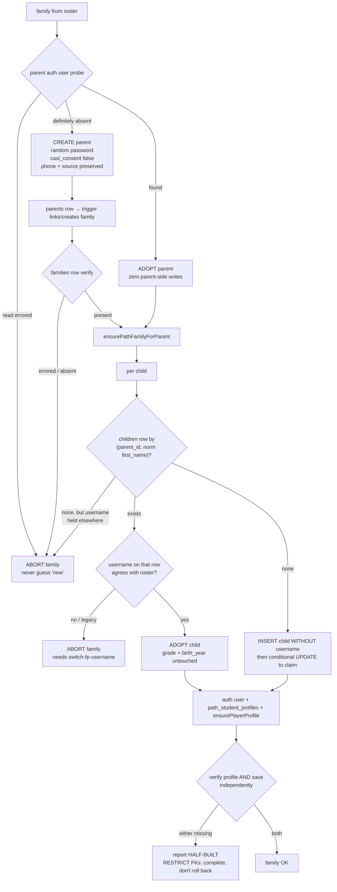

# feat: Beta cohort provisioning — 10 parents / 17 children

**Target repo:** `120-The120` (all paths relative to it). first-profit is
read-only context; nothing in it changes.

> ## ⚠ STATUS — PARTIALLY SUPERSEDED (2026-08-04, same day)
>
> **The cohort was provisioned before this plan was implemented.** The owner set
> a one-hour north star — parents emailed with working credentials so kids could
> test the same day — which this six-unit plan could not meet. A deliberately
> smaller implementation shipped instead (commit `cd1fafe`).
>
> **What actually shipped:**
> - `scripts/fp-cohort-recon.ts` — read-only reconnaissance
> - `scripts/provision-fp-cohort.ts` — the runner, dry-run by default
> - `scripts/fp-cohort-verify.ts` — independent chain verification
> - `artifacts/First Profit/beta-cohort-parent-email-2026-08-04.md` — email drafts
> - `.gitignore` entry for `scripts/.fp-cohort-credentials.local.md`
>
> **Outcome:** 10/10 families, 17/17 children provisioned and verified. All 17
> return HTTP 200 from `POST /api/fp/login` against production with the grade the
> roster intended. Zero failures, zero duplicate rows, zero half-states.
>
> **Requirements met as specified:** R2, R3, R4, R5, R7, R8, R9 (partially), R10,
> R11, R12 (phone/source left untouched rather than passed through — see below).
>
> **Requirements deliberately NOT met:**
> - **R6** — nurture is NOT neutralised. Owner decision: these families stay in
>   CRM counts and nurture sequences. The three `existingAccount` families are
>   nurture-eligible and their `signup_at` was reset by provisioning, which
>   reopens the d2/d5/d9 window. `is_test = true` on those three reverses it.
> - **R13** — no confirm digest, no project-ref assertion. The dry-run was
>   reviewed by eye immediately before the apply, in one sitting.
> - **R14** — the credentials sheet renders from the apply result (correct), but
>   there is no test pinning that.
>
> **Units NOT built** (still valid work if this is ever repeated for cohort 2):
> Unit 1's pure rules module, Unit 2's core-over-injected-DB with an in-memory
> fake, Unit 3's preflight and confirm gate, Unit 4's `set-fp-child-grade`
> operator script, Unit 6's runbook. **The shipped runner has NO tests.** Its
> 23505 branch, its family-abort branch, and its adopt-with-username-disagreement
> branch have never executed.
>
> **What recon proved that this plan had only hypothesised** — all three fired
> against live data on the first run:
> 1. One child already existed (`status=offered`). A
>    username-keyed insert would have duplicated a real funnel applicant. The
>    two-key adoption rule (R3) is why it did not.
> 2. One parent had an auth user with **no `parents` row** — R4's
>    "zero parent-side writes" would have failed both her children on 23503.
> 3. One parent was a **lead, not an account**; the roster's
>    "likely existing" hint (drawn from the CSV) was wrong for her.
>
> **Corrections to this document's own factual claims**, found during
> implementation: the email-shaped `fp_username` CHECK **is** live in production
> (proven without the Management API — an existing `@` username can only exist
> under the broadened constraint), and there is exactly one current
> `path_program_versions` row. Both preflight worries were unfounded.

> **Deepening note (2026-08-04).** This plan was revised after repo research,
> institutional-learnings research, and flow analysis. Three conclusions in the
> first draft were **wrong** and are corrected here: (a) that no nurture email
> would reach these parents; (b) that `fp_username` alone is a sufficient child
> adoption key; (c) that a shared parent password was acceptable. Each correction
> is marked ⚠ CORRECTED below.

## Overview

Build `scripts/provision-fp-cohort.ts` — a dry-run-first batch runner that
provisions the warm beta list (10 parents, 17 children) against production so
every child can log in at firstprofit.school and play.

No product code changes. A roster module, a testable orchestration core, a CLI
shell, two small operator scripts, and the hand-off artifacts.

## Problem Frame

Provisioning today is `scripts/provision-fp-family.ts` — one family, hardcoded,
edited and re-run per family. Beyond not scaling to 10, three of its defaults are
wrong for real beta testers: it **resets an existing parent's password**, stamps
`families.is_test = true`, and unconditionally upserts the `parents` row. Three
of these 10 parents are real warm-network contacts with existing funnel accounts.

See origin: `docs/brainstorms/2026-08-04-beta-cohort-provisioning-requirements.md`.

## Requirements Trace

R1–R9 from the origin document. R5/R6 amended; R10–R14 new.

- **R1.** Dry-run is the default; writing requires an explicit `--apply` **plus a
  confirm digest matching the approved dry-run** (R13).
- **R2.** Reuse the proven 8-step single-family sequence, in order.
- **R3.** Idempotent adopt-or-create. Child adoption keys on
  **`(parent_id, normalized first_name)` first, `fp_username` second**; if the two
  disagree the family aborts. A username owned by a different parent's child
  aborts that family only.
- **R4.** Existing parents untouched — no password write, no `parents` upsert, no
  direct `families` mutation, no mail. Add only genuinely missing children.
- **R5 (AMENDED).** New parents get `email_confirm: true` and a **distinct random
  password per parent**. Children get the shared password. The runner sends
  no mail.
- **R6 (⚠ CORRECTED).** `families.is_test` is not stamped. The runner must compute
  and report **post-apply** nurture eligibility per family — not the pre-apply
  `consent_given` — and the beta must not start until nurture is neutralised for
  these 10 families.
- **R7.** Write `children.grade` **fill-only**; leave `children.birth_year` unset
  (`''`). Never overwrite either on adopt.
- **R8.** Never log a password, grade or birth year.
- **R9.** Produce: dry-run plan report, per-family credentials sheet, parent beta
  email draft, post-run verification.
- **R10.** `parents.casl_consent` is written `false`, explicitly and test-asserted.
- **R11.** The shared child password across a guessable username namespace is an
  accepted, **dated** beta risk recorded in the runbook. *(Owner-decided.)*
- **R12 (NEW).** The trigger mutates `families` on the runner's behalf for created
  parents. The runner must not silently destroy lead data — `phone` and source
  attribution are preserved, and the dry-run reports every column the trigger will
  overwrite with its current value.
- **R13 (NEW).** `--apply` requires `--confirm <digest>` printed by the dry-run and
  recomputed at apply time; a mismatch is a hard refusal. Preflight asserts the
  resolved Supabase **project ref** and pins `program_version_id`.
- **R14 (NEW).** Hand-off artifacts render from the **apply** result, never the
  dry-run result.

## Scope Boundaries

- No Account Info UI (Spec B), no grade-model change (Spec C), no Google SSO
  (Spec D).
- No public-site enablement; `VITE_ENABLE_PUBLIC_SITE` stays off.
- No product code changes in either repo.
- Not broadening `no-auth-mail-guard.test.ts` to cover `scripts/` (see Deferred).
- Not building soft-delete/withdraw. None exists; the runbook names the real
  levers instead.

## Context & Research

### Relevant Code and Patterns

- `scripts/provision-fp-family.ts` — the 8-step sequence. Invoked via `npx tsx`,
  not an npm script; hand-rolls the child `createUser` payload instead of calling
  `buildStudentCreateUserPayload` (the new script should call the builder).
- `scripts/backfill-fp-username-core.ts` / `.ts` / its test — **the governing
  pattern**: pure `-core` with an injected DB type, a shell exposing `makeDb` /
  `run*` / a **self-guarded `main()`**, a test importing both. Dry-run default,
  keyset paging, three-tier error classification, in-memory fake with
  call-recording arrays and injectable faults.
- `scripts/erase-fp-family.ts` + `-args.ts` — the destructive-op posture to copy:
  `decideMode` requiring the operator to re-state the target, mismatch ⇒ hard
  refusal. **This is the precedent for R13.**
- `scripts/switch-fp-username.ts` — existing single-username repoint. Safe: the
  child's auth address derives from `children.id`, not the username.
- `scripts/backfill-families.ts` — repairs a missing CRM `families` row.
- `docs/runbooks/2026-08-01-live-provisioning-acceptance-protocol.md` — the
  runbook precedent: STOP CONDITIONS block + Phase 0 prerequisite checklist.
- `app/fp/lib/provision-core.ts`, `app/fp/lib/provision-rules.ts`,
  `app/api/fp/login/profile-core.ts`, `app/lib/funnel/applicant-rules.ts`
  (`APPLICANT_ENTRY_STATE = "added"`), `scripts/load-env.ts`.
- `app/lib/nurture/rules.ts` (`isStalledDraft`), `app/api/cron/nurture/route.ts`.

### Environment facts established this pass

- `scripts/` **is** type-checked and linted. `vitest.config.ts` already covers
  `scripts/**/__tests__/**`.
- ⚠ vitest **aliases `server-only` to a stub**, so an entrypoint import proves
  less than it appears. Only a real `tsx` run proves loadability.
- `artifacts/` is **git-tracked and unignored** (verified: `git check-ignore` on a
  file inside it returns nothing).
- `no-auth-mail-guard.test.ts` walks **`app/` only**; `scripts/` is out of scope.
- `children_fp_username_guard` raises `42501` for non-service-role principals
  **including a plain INSERT carrying a non-null `fp_username`** — hence
  insert-then-UPDATE.
- **`children` has no unique constraint on `(parent_id, first_name)`.** Nothing at
  the DB level prevents a duplicate child.
- `children.birth_year` is `text not null default ''` — "unset" means `''`.
- `parents.phone` is `not null default ''`; the trigger's link branch does
  `phone = NEW.phone` **unconditionally**.
- `seedSave` uses `ON CONFLICT DO NOTHING` on the `fp_player_saves` primary key —
  **a re-run can never reset a child's progress.** State this in the runbook; it
  is the fear an operator will actually have.
- `mintUsername` emits `^[a-z0-9]+$` only; it can never produce this cohort's
  email-shaped usernames.
- The FP login returns a **byte-identical 401** for every failure mode by design,
  so a half-provisioned child is externally indistinguishable from a typo.

### Institutional Learnings

Carried from the first draft: the bulk-import CRM/consent doc, the
`server-only`/tsx pair, no-transaction compensation, post-write-verify, PostgREST
1000-row, `createUser` `email_confirm`, dormant-migration, and the charset
invariant.

Added this pass, each with its consequence:

- `security-issues/confirmed-account-with-known-password-before-inbox-proof-is-a-provider-level-session-bypass-2026-08-01.md`
  → **drove the R5 amendment**.
- `security-issues/re-audit-an-accepted-enumeration-side-channel-…-2026-08-01.md`
  → **drove R11**.
- `security-issues/supabase-autoconfirm-forged-consent-…-2026-07-13.md` (critical)
  → **drove R10**; the P0 record of the consent OR-merge.
- `logic-errors/compensate-by-stable-identity-not-the-handle-…-2026-08-01.md`
  → `ensurePlayerProfile` can leave a profile with no save; FKs are `ON DELETE
  RESTRICT`, so the half-state **wedges teardown**. Verify the save separately.
- `logic-errors/an-external-already-exists-cannot-tell-mine-from-foreign-…-2026-07-29.md`
  → **drove the R3 adoption-key change**. "Already exists" is one bit.
- `logic-errors/audit-side-record-gated-on-primary-writes-…-2026-07-24.md`
  → the fake needs an **`applyAnyway`** mode or the landed-but-misreported class
  is untestable.
- `logic-errors/a-read-only-gate-over-a-nullable-binding-column-…-2026-08-01.md`
  → claim the username with a conditional UPDATE, not read-then-write.
- `integration-issues/postgrest-head-count-probe-false-positive-existence-check-2026-07-21.md`
  → **broke the original preflight**; `head:true` returns `204`/no-error for
  missing tables.
- `integration-issues/supabase-cli-stale-db-password-management-api-workaround-2026-07-13.md`
  → the only channel that can read `pg_constraint`, and the remediation path.
- `integration-issues/migration-version-collision-…-2026-07-28.md` → a
  `schema_migrations` row is a claim, not evidence.
- `database-issues/partial-unique-index-…-onconflict-names-different-key-…-2026-07-27.md`
  → classify a 23505 on the **constraint name**.
- `database-issues/blind-upsert-on-conflict-…-expression-index-inference-…-2026-07-16.md`
  → PostgREST cannot infer a `lower(col)` index for `onConflict`.
- `best-practices/id-keyed-upsert-trusts-client-id-as-ownership-…-2026-07-22.md`
  → `ignoreDuplicates: true` returns no error when it skips; verify owning ids.
- `best-practices/fail-closed-type-guard-…-2026-07-21.md` → an absent/unexpected
  `consent_given` renders "unknown — do not proceed", never `false`.
- `security-issues/a-user-writable-route-into-a-shared-column-…-fill-only-2026-08-03.md`
  → `children.grade` is parent/staff-authoritative across four consumers;
  **drove R7's fill-only clause**.
- `security-issues/right-to-erasure-…-2026-08-01.md` → un-provisioning is an
  ordered PII scrub, not a delete.
- `test-failures/vitest-include-allowlist-…-2026-07-18.md` → confirm the new suite
  appears **by name** in runner output.

## Key Technical Decisions

- **Pure core + CLI shell + in-memory fake**, mirroring `backfill-fp-username` —
  the only testable shape in this repo's node-only setup.
- **⚠ CORRECTED — nurture is not self-gating (R6).** The first draft concluded no
  email would send because the derived family would lack `consent_given`. Wrong
  three ways: the link branch OR-merges consent *and resets `signup_at`*, opening
  a fresh sequence; the 3 adopted parents already carry real funnel consent, and
  the **children we insert** (`applicant_state: 'added'`) make them
  `isStalledDraft` ⇒ a `stall-child` send in 3–6 days; and the owner gate reads
  consent *before* the write that changes it. The runner must project post-apply
  eligibility, and the beta must not start until nurture is neutralised for these
  10 families — by pausing the cron for the window, or per-family `revokeConsent`.
- **⚠ CORRECTED — child adoption key (R3).** Username alone is insufficient. On
  the first run all 17 roster usernames are free by construction, so R3's
  idempotence is not in force until step 5 succeeds; and the 3 funnel parents'
  children very likely already have `children` rows with no (or legacy)
  usernames. With `children` carrying no `(parent_id, first_name)` unique
  constraint, username-keyed adoption creates a **duplicate child under a real
  parent** — silently green in both the re-run and the verification query. Key on
  `(parent_id, normalized first_name)` first, username second; disagreement aborts
  the family.
- **⚠ CORRECTED — distinct random parent passwords (R5).** Ten adults with
  confirmed, sign-in-capable accounts sharing one password is a provider-level
  bypass: GoTrue's `/token` is public and the anon key ships in every bundle, so
  one leaked credential opens all ten and the child PII behind them. Per-parent
  random passwords cost nothing — the sheet is already per-family. *(Owner-decided.)*
- **Children keep one shared password (R11)**, deliberately: 8–14-year-olds type it
  themselves. Recorded as a dated accepted risk. *(Owner-decided.)*
- **Grade is fill-only (R7)** because `age - 5` is a *guess* about 17 real
  children and `grade` drives CRM dossier and course-track behaviour, not just the
  game band. A re-run must never clobber a correction.
- **`casl_consent: false`, pinned and asserted (R10)** — the trigger's OR-merge
  makes that payload field a consent write.
- **No mail from the runner (R5).** Enforced by the script header, review, and a
  source-scan assertion in the script's own test, since the app-scoped guard does
  not cover `scripts/`.
- **Confirm digest (R13)**, copying `erase-fp-family`'s posture: an approval gate
  that the apply cannot drift away from.
- **Family isolation.** A failure aborts one family; the run continues. Partial
  cohort is acceptable — but the runbook must define the transition out of it.

## Open Questions

### Resolved During Planning

- *Does creating a `parents` row for an existing lead duplicate the family?* No —
  `on_parent_created` matches by `lower(email)`, follows `merged_into_id`, and
  **links** a lead with no `parent_id`. But it also overwrites `phone`,
  `parent_name`, `email` and resets `signup_at` (see R12, R6).
- *Should the runner set `consent_given`?* No. See R10.
- *Can a trigger failure silently break the family link?* Yes; it wraps its body
  in `exception when others → raise warning`. And the trigger is `AFTER INSERT ON
  parents` **only**, so a re-run that adopts the parent never re-fires it —
  `scripts/backfill-families.ts` is the repair.
- *Does `ensurePlayerProfile` need an adopt path?* It has one, but can
  half-succeed; verify the save row independently.
- *Can a re-run reset a child's game progress?* **No** — `seedSave` is
  `ON CONFLICT DO NOTHING` on the PK.
- *Is the shared password acceptable to `validateStudentPassword`?* Yes for all 17
  names. Still preflight-checked.
- *Can `mintUsername` generate the roster usernames?* No.
- *Is a vitest entrypoint import a real `tsx` proof?* No — vitest stubs
  `server-only`.

### Deferred to Implementation

- The exact `CohortDb` shape.
- Whether to broaden `no-auth-mail-guard.test.ts` to `scripts/` — needs its own
  justification; a script-local source scan covers this script meanwhile.
- The exact Management API call for the constraint probe.
- Report/sheet rendering details.

### Blocking — must be answered before Unit 5

- **How is nurture neutralised for the beta window** — pause the cron, or
  per-family `revokeConsent`? (R6.) The preflight query in Unit 5 Phase 0 informs
  it, but the decision is the owner's and gates execution.

## High-Level Technical Design

> *Directional guidance for review, not implementation specification.*

Per-family flow. Both tri-state gates and the two-key child adoption are places
the first draft collapsed "I cannot tell" into a definite answer.

## Implementation Units

- [ ] **Unit 1: Roster, derivation rules, parent password generation**

**Goal:** Cohort data plus the pure functions producing usernames, grades and
per-parent passwords.

**Requirements:** R5, R7, R9, R12

**Dependencies:** None

**Files:**
- Create: `scripts/fp-cohort-roster.ts`
- Create: `scripts/fp-cohort-rules.ts`
- Create: `scripts/__tests__/fp-cohort-rules.test.ts`

**Approach:**
- Roster: 10 families with parent first/last name, email, **and `phone` +
  `heardAbout`** (R12 — so the trigger writes real attribution rather than
  blanking `phone` and defaulting `source` to `'website'`); children as
  `{ firstName, lastName, age }`. Two children carry a surname that differs
  from their parent's in the data.
  **No passwords in the roster.**
- `fp-cohort-rules.ts`: `gradeFromAge` (`age - 5`), `usernameForChild`,
  `normalizeFirstName` (reuse the repo's `normalizeStudentName` semantics — NFKC,
  trim, collapse, lowercase — so the adoption key matches how the app compares
  names), and `generateParentPassword` (`node:crypto`, injectable for tests).
- Module-load validation, fail loud: usernames match the live CHECK regex and are
  ≤80; grades land in 3–12; no two children share a username **or a normalized
  `(parent, firstName)` key**.

**Execution note:** Test-first. Pure functions with a fixed expected output table.

**Patterns to follow:** `app/fp/lib/fp-username-rules.ts` (charset vocabulary
only); `app/fp/lib/provision-rules.ts` `normalizeStudentName`; parse-or-throw.

**Test scenarios:**
- Happy path: `gradeFromAge` maps 8→3 … 14→9.
- Happy path: `usernameForChild({firstName:"Abe"})` → `abe@firstprofit.school`.
- Happy path: roster holds exactly 10 families and 17 children.
- Happy path: every username satisfies the live CHECK regex and ≤80 chars.
- Happy path: bands are 8 / 8 / 1 across g3_5 / g6_8 / g9_12; none band-null.
- Happy path: two children carry a differing surname; others inherit the parent's.
- Happy path: `normalizeFirstName` agrees with `normalizeStudentName` on accents,
  case, and inner whitespace.
- Happy path: `generateParentPassword` passes `validateStudentPassword`, and 100
  calls return 100 distinct values.
- Edge case: colliding first names within one family throw at validation.
- Edge case: an age producing a grade outside 3–12 throws.
- Error path: a first name with a character illegal in the username charset throws
  rather than emitting an invalid username.
- Error path (R8): roster exports contain no password field.

**Verification:** Rules test passes; roster self-validates on import; the
generated table matches the origin roster row for row.

---

- [ ] **Unit 2: Provisioning core over an injected DB**

**Goal:** Every provisioning decision as a pure, testable core.

**Requirements:** R1, R2, R3, R4, R5, R6, R7, R8, R10, R12

**Dependencies:** Unit 1

**Files:**
- Create: `scripts/provision-fp-cohort-core.ts`
- Create: `scripts/__tests__/provision-fp-cohort.test.ts`

**Approach:**
- `CohortDb` covers exactly the reads/writes the sequence needs. Every read
  informing a branch is **tri-state** (`found` / `absent` / `unknown`).
- `provisionCohort(db, roster, { apply })` returns a structured per-family result.
  With `apply: false` **no write method is invoked at all** — asserted against the
  fake.
- **Parent probe (R4).** `findAuthUserByEmail` returns `null` on query error *and*
  on absence. Wrap it so a failed read yields `unknown`, which aborts the family;
  treating `unknown` as "new" would create-and-password-write over a real account.
  Also report a **normalized-email near-miss** (dots/plus stripped) so a Gmail
  variant surfaces instead of silently becoming a second account.
- Adopt branch: zero parent-side writes.
- Create branch: `casl_consent: false` (R10), `phone` and `heard_about` passed
  through (R12). Never stamps `is_test`; reads the resulting family for reporting,
  with absent/unexpected rendering `unknown`, not `false`.
- **Child adoption (R3):** look up by `(parent_id, normalizeFirstName)` first. If
  found, check the row's `fp_username`: absent or disagreeing with the roster ⇒
  **abort the family** (the operator resolves via `switch-fp-username`), never a
  silent second child. If no row by name but the roster username is held
  elsewhere ⇒ abort. Only a clean miss on both keys creates.
- Child insert carries **no** `fp_username`; the claim is a separate conditional
  UPDATE (`where id = :child and (fp_username is null or fp_username = :u)`).
- 23505 handling reads the **constraint name**; anything else is unexpected.
- Grade and `birth_year` are written on **insert only**, never on adopt (R7).
- Post-write verification asserts `fp_player_profiles` **and** `fp_player_saves`
  independently, plus the persisted rows' owning ids.
- Verify reads are tri-state; read-errored is "ambiguous", never "broken".
- Nothing rendered by the report carries a password, grade or birth year (R8).

**Execution note:** Test-first against the in-memory fake. Establish the
dry-run-writes-nothing invariant before the logic exists.

**Patterns to follow:** `scripts/backfill-fp-username-core.ts` (injected DB,
dry-run default, keyset paging, three-tier errors); its test (fake shape,
call-recording, injectable faults); discriminated unions with `ok` + `reason`.

**Test scenarios:**
- Happy path: a fully new family provisions parent + children, recording
  create-vs-adopt per entity.
- Happy path: dry-run over the roster invokes zero write methods and still returns
  a complete plan.
- Happy path: `apply` invokes the 8 steps per child in documented **order**.
- Happy path (R10): the `parents` payload carries `casl_consent: false`.
- Happy path (R12): the `parents` payload carries the roster `phone` and
  `heard_about`, so the trigger cannot blank a lead's phone or mis-attribute source.
- Edge case (R4): an existing parent produces no `createUser`, no `parents`
  upsert, no `families` write.
- Edge case (R4): an existing parent whose children all exist is a full no-op.
- Edge case (R3): re-running `apply` over a provisioned roster performs zero writes.
- **Edge case (R3): run 1 aborted between the child insert and the username claim
  — run 2 adopts the orphan row rather than creating a sibling.**
- **Edge case (R3): a funnel-created child already exists under this parent with a
  legacy or absent username — the family aborts; no duplicate child is created.**
- Edge case (R3): a username held by a sibling **under the same parent** adopts.
- Edge case (R7): adopting a child with an existing `grade` does not overwrite it,
  even when the roster implies a different value; `birth_year` is likewise untouched.
- Edge case: the taken-set read is bounded keyset pages, fully enumerated, no
  extra empty fetch.
- Error path (R4): `findAuthUserByEmail` failing its read aborts the family.
- Error path (R3): a username held by a *different* parent's child aborts that
  family; the rest still provision.
- Error path: a 23505 naming another constraint is an unexpected error, not
  "username taken".
- Error path (R7): no child payload ever contains a `birth_year` key on adopt.
- Integration: a parent created with **no** trigger-derived family reports a
  verification failure, not success.
- Integration: profile created but save seed failed ⇒ reported **half-built**.
- Integration: a write that lands but reports an error (`applyAnyway` fake mode)
  is not reported as "nothing written" — the re-read decides.
- Integration: a verify read that itself errors reports ambiguous, not broken.

**Verification:** Core test passes including the zero-writes assertion; every
branch of the flowchart, both tri-state gates and both adoption keys, is covered.

---

- [ ] **Unit 3: CLI shell, preflight, and plan report**

**Goal:** A runnable command with correct preconditions, a binding approval gate,
and a report that tells the truth about post-apply consequences.

**Requirements:** R1, R5, R6, R8, R9, R12, R13

**Dependencies:** Unit 2

**Files:**
- Create: `scripts/provision-fp-cohort.ts`
- Modify: `package.json` (add `fp:provision-cohort`)
- Modify: `scripts/__tests__/provision-fp-cohort.test.ts`

**Approach:**
- `makeDb` / `runCohort(client, { apply, confirm, log })` / **self-guarded
  `main()`** (`fileURLToPath(import.meta.url) === process.argv[1]`). The `log` sink
  lets the test drive real wiring silently.
- `loadSupabaseEnv()` only inside `main()` — it `process.exit(1)`s, so calling it
  at module scope would kill the suite.
- Dry-run default. `--apply` additionally requires `--confirm <digest>` matching a
  digest recomputed from the apply-time plan; mismatch ⇒ hard refusal, never a
  silent downgrade (R13, copying `erase-fp-family`).
- **Preflight — each failure aborts the run:**
  - Probes use `.select('*').limit(0)` and branch on `error.code`. **Never
    `head:true`** — it returns `204`/no-error for missing tables.
  - Assert the resolved **project ref** matches an expected value (R13) — a stale
    `.env.local` would otherwise write 27 accounts into the wrong database.
  - Confirm exactly one `path_program_versions` row with `is_current = true` (two
    is a distinct failure from none) and **pin the id**, re-asserted at apply.
  - The email-shaped username CHECK **cannot be read via PostgREST**
    (`pg_constraint` is unreachable). Verify the **constraint definition** through
    the Management API playbook, not a `schema_migrations` row. The abort message
    must name the playbook doc.
  - `validateStudentPassword(sharedPassword, …)` passes for every child.
- **The report** renders per family: parent create/adopt/ambiguous (plus any
  normalized-email near-miss), each child's create/adopt/skip/abort/half-built,
  username availability, **projected post-apply nurture eligibility** (R6 — not
  the pre-apply `consent_given`; `unknown` distinct from `false`), `is_test`, the
  `families` columns the trigger will overwrite with their **current values**
  (R12), and the confirm digest. Totals plus an explicit skipped/aborted list. No
  passwords, grades or birth years (R8).
- A source-scan assertion in this script's test stands in for the app-scoped
  `no-auth-mail-guard`.

**Execution note:** The entrypoint import in the test is only a partial proof —
vitest stubs `server-only`. The real proof is a `tsx` run (Verification).

**Patterns to follow:** `scripts/backfill-fp-username.ts` (`makeDb`/`run*`/guarded
`main`, log sink, `[script-name]` prefix); `scripts/erase-fp-family-args.ts`
(`decideMode`, refusal on mismatch).

**Test scenarios:**
- Happy path: importing the entrypoint does not execute a run.
- Happy path: the renderer, given a synthetic result covering create/adopt/skip/
  abort/half-built/ambiguous, emits a line per family and correct totals.
- Happy path: projected nurture eligibility renders, with `unknown` distinct from
  `false`.
- Happy path (R12): the report lists trigger-overwritten `families` columns with
  current values.
- Edge case: no flags ⇒ dry-run, asserted via the core's `apply` argument.
- Edge case (R13): `--apply` without `--confirm` refuses.
- Error path (R13): `--apply --confirm <stale digest>` refuses rather than
  downgrading to a dry-run.
- Error path: two `is_current` program versions produces a distinct message from
  none.
- Error path: a probe returning a permission/auth error code is reported as such,
  never as "migration not applied".
- Error path: preflight rejects a project ref mismatch.
- Error path (R8): a report built from a result containing passwords, grades and
  birth years contains none of those values.
- Error path (R5): a source scan of this script finds no `generateLink`,
  `resetPasswordForEmail`, `inviteUserByEmail`, `signInWithOtp`, `reauthenticate`
  or `signUp` call.

**Verification:** `npm run fp:provision-cohort` produces a complete 10-family
dry-run report without writing; the new test file appears **by name** in the
vitest output; the entrypoint runs under `tsx` without a load-time failure.

---

- [ ] **Unit 4: Operator repair scripts**

**Goal:** The two levers the beta will actually need, which do not exist today.

**Requirements:** R7, R9

**Dependencies:** Unit 1

**Files:**
- Create: `scripts/set-fp-child-grade.ts`
- Modify: `package.json` (add `fp:set-grade`, and wire the existing
  `scripts/switch-fp-username.ts` as `fp:switch-username`)
- Create: `scripts/__tests__/set-fp-child-grade.test.ts`

**Approach:**
- `children.grade` has **no correction mechanism anywhere in the repo**:
  `POST /api/fp/grade` is fill-only, `createFounderAction`'s fill branch only
  fires on NULL, no CRM/staff UI edits `children`, no script exists. With
  `grade = age - 5` derived from a warm list, at least one of 17 is near-certainly
  wrong — and grade drives band drives curriculum content. Without this, the fix
  is hand-written SQL against production.
- `set-fp-child-grade.ts`: dry-run default, service-role, one child by username,
  prints old→new grade **and old→new band**, refuses a grade outside 3–12.
- `switch-fp-username.ts` already exists and is safe (the auth address derives
  from `children.id`); it only needs an npm script so the runbook can name it.

**Execution note:** Small and mechanical. `Execution target: external-delegate` is
reasonable here.

**Patterns to follow:** `scripts/switch-fp-username.ts` for shape;
`scripts/backfill-fp-username.ts` for the dry-run/apply split and guarded `main`.

**Test scenarios:**
- Happy path: a dry-run prints the old→new grade and band and writes nothing.
- Happy path: `--apply` updates exactly one row.
- Edge case: a grade outside 3–12 is refused with a specific message.
- Edge case: a grade change that does not cross a band boundary still reports the
  band explicitly (so the operator sees it was a no-op for content).
- Error path: an unknown username refuses; zero rows matched is an error, not a
  silent success.
- Error path: a username matching more than one child aborts.

**Verification:** Both scripts are invocable by npm name and each refuses cleanly
on a bad target.

---

- [ ] **Unit 5: Hand-off artifacts**

**Goal:** The credentials sheet and parent email — correct, and out of git.

**Requirements:** R5, R9, R14

**Dependencies:** Unit 3

**Files:**
- Create: `scripts/fp-cohort-artifacts.ts`
- Create: `artifacts/First Profit/beta-cohort-parent-email-2026-08-04.md` (no credentials)
- Modify: `.gitignore` — **landed and verified before any generator runs**
- Modify: `scripts/__tests__/provision-fp-cohort.test.ts`
- Generated at run time, never committed: `scripts/.fp-cohort-credentials.local.md`

**Approach:**
- ⚠ `artifacts/` is git-tracked and unignored — verified, not assumed. The
  credentials sheet goes to `scripts/.fp-cohort-credentials.local.md`, matching
  the repo's existing ignored `scripts/.*.local.*` precedent. The `.gitignore`
  entry is an explicit **first step**, not a post-hoc check.
- **The sheet renders from the APPLY result only (R14).** Rendering from the
  dry-run risks emailing "your temporary password is …" to a parent whose account
  turned out to already exist (or the reverse) if anything changed — including a
  transient `listUsers` hiccup — between the two runs.
- One block per family: the parent's email and generated password, or "existing
  account — password unchanged"; then each child's username and shared password.
- The parent email draft carries **no credentials** and may live in tracked
  `artifacts/`. It must set expectations about The120 dashboard: a provisioned
  parent who signs in lands on the application register showing their children as
  `draft` / `added` at ~33% completeness with paid-program CTAs. Say plainly that
  this is the school's application view and is not part of the beta, or those 10
  warm contacts read it as an abandoned application.
- Existing parents get a variant with no password and no reset instruction.

**Patterns to follow:** `artifacts/First Profit/parent-notice-2026-08-03-draft.md`
for voice; `scripts/erase-fp-family-deps.ts` for never-print-PII.

**Test scenarios:**
- Happy path: the sheet covers all 10 families and all 17 children.
- Happy path: an adopted parent renders "existing account — password unchanged"
  and no password value.
- Edge case (R14): a family whose apply-time branch differs from its dry-run
  branch produces a **different** credentials block.
- Edge case: aborted or half-built families are marked not-provisioned, never
  silently omitted.
- Error path: the email template contains no password placeholder that could be
  filled with a real credential.
- Integration: the children in the sheet are exactly those marked provisioned.
- Integration: the sheet's target path matches a `.gitignore` entry, asserted
  against the file so the rule cannot be dropped.

**Verification:** Artifacts generate from an apply result and read correctly to a
parent who has never seen the product; `git status` after a real run shows no
credential file tracked or staged.

---

- [ ] **Unit 6: Execute against production and verify**

**Goal:** Run it, prove all 17 children can play, and confirm no unintended mail.

**Requirements:** R2, R6, R9, R11, R13

**Dependencies:** Unit 5

**Files:**
- Create: `docs/runbooks/2026-08-04-fp-beta-cohort-provisioning.md`

**Approach:**
Production is the only environment — `docs/LANES.md`: "no staging copy, no
rehearsal window, no undo." Structure the runbook on
`docs/runbooks/2026-08-01-live-provisioning-acceptance-protocol.md`.

- **STOP CONDITIONS block** at the top, and a **Phase 0 prerequisite checklist**:
  named single operator (concurrent runs duplicate `children` and
  `path_families`); the 10 email addresses confirmed against the CSV/inbox (a typo
  creates an unreachable account **and** a live mailable lead); project ref
  confirmed; `.gitignore` rule landed.
- **Phase 0 nurture query — run before anything else.** For the 10 emails:
  `families.consent_given`, `consent_revoked_at`, `is_test`, `merged_into_id`,
  `signup_at`, and existing `nurture_sends`. This decides whether the beta is
  "provision and go" or "pause the cron first" (R6). **Blocking.**
- Ordered, gated protocol:
  1. Preflight + dry-run all 10; capture the report and its confirm digest.
  2. **Owner reviews and approves**, on *projected post-apply* eligibility. A
     family reporting `unknown` is not approved by default.
  3. Neutralise nurture per the Phase 0 decision.
  4. `--apply --confirm <digest>`.
  5. Verification: enumerate **all** children under the 10 parents — not just the
     17 roster usernames — and assert the count, so a duplicate or orphan child is
     visible. Per child: `fp_username`, an auth user at the derived address,
     `path_student_profiles`, `fp_player_profiles` **and** `fp_player_saves`
     (checked independently — profile-without-save is the documented half-state
     and would otherwise verify green). Assert `birth_year = ''` and `grade`
     matches the roster. Confirm a `families` row per parent.
  6. Re-read `consent_given`, `signup_at`, `is_test` and `nurture_sends`
     **post-apply**.
  7. Log one real child into firstprofit.school; confirm a playable floor and
     band. Note the login returns a byte-identical 401 for every failure, so a
     failed login needs the server log, not guesswork.
  8. Re-run the dry-run; confirm zero writes.
- **Partial-cohort decision**, written in advance: if the run ends 6-of-10, does
  the owner email the 6 now or hold? What if a failure was mid-child?
- **Record R11** — the shared child password with a review-or-rotate date.
- **"During the beta" section**, naming the levers and the gaps honestly:
  - Username change — `fp:switch-username` (safe; auth address derives from
    `children.id`).
  - Grade correction — `fp:set-grade` (Unit 4). Grades are **frozen across
    September 1 by design** while every other child rolls over; say so.
  - Parent forgot the password — "Forgot password" → `/reset`. Fails silently if
    the roster email was wrong.
  - Stop mail to one family — CRM `revokeConsent`.
  - Parent withdraws — **no soft-delete or archive exists.** The options are
    leave-it-plus-revoke-consent, or `npm run r28:erase` (irreversible, RESTRICT-
    aware, leaf-first). Confirm it covers the FP tables before promising any
    parent a withdrawal path.
  - Half-built child — not deletable (RESTRICT FKs); recovery is completion.
  - Missing `families` row — `scripts/backfill-families.ts`.
  - **One login per child.** Siblings sharing a login interleave onto one
    `fp_player_saves` row (PK on `profile_id`), undetectable server-side. Six of
    these families have 2–3 children.
  - Re-runs can **never** reset progress (`ON CONFLICT DO NOTHING` on the PK).
  - These 17 are FP-only: no `path_role_grants` / `path_task_progress`. Correct —
    do not "repair" it.

**Test scenarios:**
Test expectation: none — an operator runbook and a production execution.
Correctness rests on Units 1–5's automated coverage plus steps 5–8.

**Verification:**
- All 17 children log in and reach a playable floor in the expected band.
- The child count under the 10 parents equals the expected total — no duplicates,
  no orphans.
- The 3 pre-existing parents have unchanged `parents` rows and passwords.
- No unintended mail: `nurture_sends` shows no new rows for these families, and
  the Resend log is clean.
- The re-run dry-run reports zero writes.
- The runbook names a working un-provision path before any parent is emailed.

## System-Wide Impact

- **Interaction graph:** `on_parent_created` (AFTER INSERT on `parents` **only**)
  creates or links a CRM `families` row, overwrites `phone`/`parent_name`/`email`,
  resets `signup_at`, and may write `family_notes`.
  `children_fp_username_guard` raises `42501` for non-service-role principals. The
  **nurture cron** reads `families` + `children` and is the outward-facing
  consumer that acts unattended — `isStalledDraft` fires on
  `applicant_state = 'added'` regardless of completeness.
- **Error propagation:** the trigger swallows its own errors; a failed family link
  surfaces only as a Postgres warning, and a re-run that adopts the parent never
  re-fires it. Tri-state verification plus `backfill-families.ts` is the answer.
- **State lifecycle risks:** no transaction across 8 steps. The silently-green
  half-states are: parent auth user without a `parents` row; parent without a
  `families` row; orphan `path_families`; and **a `children` row without a
  username** — the last creating a duplicate child on re-run, which is why R3's
  adoption key changed. `fp_player_profiles`' `ON DELETE RESTRICT` FKs mean a
  half-built child **cannot be deleted**, only completed.
- **API surface parity:** none.
- **Integration coverage:** the trigger's link-vs-create behaviour, the real
  username guard, and the live CHECK cannot be proven by the fake; the dry-run and
  Unit 6 are where they are observed.
- **Unchanged invariants:** `resolveChildGrade`, `schoolYearStartYear`,
  `gradeFromBirthYear`, `birthYearBounds` are untouched in both repos — R7
  sidesteps them by leaving `birth_year` empty. `GradeAsk` and `POST /api/fp/grade`
  keep fill-only ask-once behaviour for every other child.
  `scripts/provision-fp-family.ts` is unchanged. `no-auth-mail-guard.test.ts`
  keeps its `app/`-only scope.

## Risks & Dependencies

| Risk | Mitigation |
|------|------------|
| **Automated nurture mail reaches 10 VIP contacts within 3–9 days** — via the OR-merge, the `signup_at` reset, and `isStalledDraft` on children inserted under the 3 adopted parents | **Blocking Phase 0 query + owner decision (R6): pause the cron for the window, or per-family `revokeConsent`. Verified post-apply against `nurture_sends`.** |
| **Duplicate `children` rows** for funnel-created children, or after a crash between insert and username claim — silently green in both re-run and verification | Two-key adoption (R3); verification enumerates **all** children under the 10 parents and asserts the count |
| Confirmed parent accounts on a shared known password = provider-level bypass | Resolved: distinct random per-parent passwords (R5) |
| Guessable child usernames + one shared password | Accepted, dated risk (R11) |
| A transient `listUsers` failure makes an existing parent look new | Tri-state probe; `unknown` aborts. Normalized-email near-miss reported |
| The runner forges CASL consent via the OR-merge | `casl_consent: false` pinned and asserted (R10) |
| The trigger blanks a lead's `phone` and re-attributes source to `website` | Roster carries `phone` + `heardAbout`; the dry-run reports overwritten columns with current values (R12) |
| Credentials mailed from a stale dry-run classification | Artifacts render from the apply result only (R14) |
| Preflight silently passes (`head:true` false-positive, or a `schema_migrations` row mistaken for evidence) | `.select('*').limit(0)` + error-code classification; constraint verified via Management API |
| Wrong Supabase project, or a program-version change mid-run | Project-ref assertion; `program_version_id` pinned at preflight, re-asserted at apply (R13) |
| The approved plan drifts from what executes | `--confirm <digest>` recomputed at apply; mismatch refuses (R13) |
| Live credentials committed (`artifacts/` is tracked) | Sheet written to an ignored `scripts/.*.local.*` path; `.gitignore` landed first; asserted by test |
| A wrong roster email creates an unreachable account **and** a live mailable lead | Address confirmation is a Phase 0 checklist item; near-miss reporting |
| A child's grade is wrong with no repair path | `fp:set-grade` (Unit 4) |
| A re-run clobbers a hand-corrected grade | Grade written on insert only (R7) |
| Siblings share one login and interleave onto one save row | Runbook: one login per child; undetectable server-side |
| A half-built child cannot be deleted (RESTRICT FKs) | Verified independently; recovery is completion, stated in the runbook |
| Script dies at load from a transitive `server-only` import | Entrypoint import **plus** a real `tsx` run — vitest stubs `server-only` |
| No undo | Dry-run + digest gate; family isolation; nothing deletes or overwrites. Un-provisioning is an ordered PII scrub — the path is named before any parent is emailed |

## Documentation / Operational Notes

- `docs/runbooks/2026-08-04-fp-beta-cohort-provisioning.md` is the durable record:
  per-family outcome, the nurture decision, and the R11 acceptance date.
- Strong `ce:compound` candidates: the `signup_at` reset re-opening a nurture
  sequence; `isStalledDraft` firing on provisioned children under untouched
  parents; `head:true` false-passing a preflight; and username-only adoption
  producing a silently-green duplicate child.
- These 17 children are the first real users of the full path;
  `fp:feedback:read` surfaces their `fp_task_feedback` rows during the beta.

## Sources & References

- **Origin:** `docs/brainstorms/2026-08-04-beta-cohort-provisioning-requirements.md`
- Single-family precedent: `scripts/provision-fp-family.ts`
- Governing script pattern: `scripts/backfill-fp-username-core.ts`,
  `scripts/backfill-fp-username.ts`, `scripts/__tests__/backfill-fp-username.test.ts`
- Destructive-op posture: `scripts/erase-fp-family.ts`, `scripts/erase-fp-family-args.ts`
- Runbook precedent: `docs/runbooks/2026-08-01-live-provisioning-acceptance-protocol.md`
- Repair levers: `scripts/switch-fp-username.ts`, `scripts/backfill-families.ts`
- Nurture: `app/lib/nurture/rules.ts` (`isStalledDraft`), `app/api/cron/nurture/route.ts`
- Grade fall-through: `app/api/fp/grade/grade-rules.ts` (`resolveChildGrade`)
- Mail ban + guard scope: `app/lib/funnel/account.ts`,
  `app/fp/lib/__tests__/no-auth-mail-guard.test.ts`
- CRM trigger: `supabase/migrations/20260713110000_crm_core.sql` (`on_parent_created`)
- Username guard + charset: `supabase/migrations/20260831120000_fp_children_username.sql`,
  `supabase/migrations/20260904120000_fp_username_email_shaped.sql`
- Test-family filter: `app/crm/lib/test-family-filter.ts`
- Production constraints: `docs/LANES.md`
