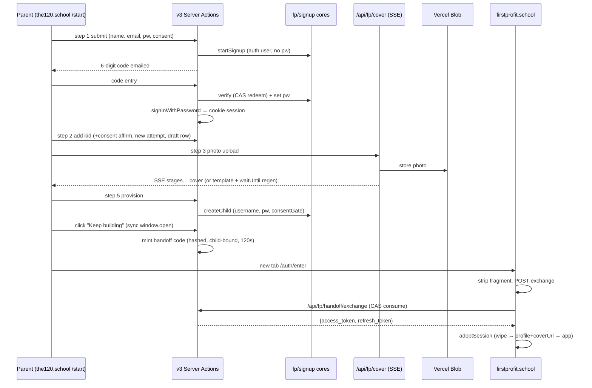
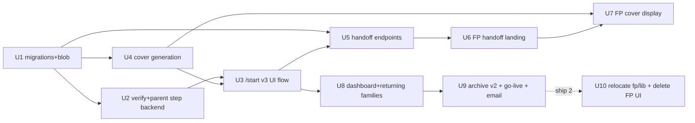

# feat: New User Flow v3 (The120 → First Profit)

**Target repos:** `120-The120` (primary — all paths unprefixed) and `first-profit`
(paths prefixed `first-profit:`). Cross-repo units are marked.

## Overview

Replace the v2 application-shaped signup at `/start` with the kid-first v3 flow:
parent step with inline 6-digit email verification → add kid → AI comic-cover
generation (OpenAI gpt-image-2, template fallback) → optional story questions →
instant account provisioning via the existing `app/api/fp/signup` cores → one-time
fragment-token auto sign-in handoff to firstprofit.school → parent dashboard.
Archive v2 under `archive/new-user-v2/`. As a separable second shipment, relocate
`app/fp/lib` and delete all FP UI surfaces from The120.

## Problem Frame

See origin doc. v2 gates families behind application review/waitlist; v3 is a
single-sitting, instant-access onboarding that is also a hard launch for ALL
families (new, mid-application, waitlisted, beta), and completes the strategic
separation: The120 = account front door, apps live in their own codebases.

## Requirements Trace

Origin R1–R18 map to units as follows: R1/R2 (parent step + inline verify) →
Units 2–3; R3 (dashboard retarget) → Unit 8; R4–R7 (kid steps, cover, credentials)
→ Units 1, 3, 4; R8/R9 (core provisioning, caps) → Units 2–4; R10 (handoff) →
Units 5–6; R11 (returning families + launch email) → Units 8–9; R12 (cover in FP)
→ Unit 7; R13 (trial messaging) → Unit 8; R14 (edge states) → distributed, see
per-unit scenarios; R15/R17 (archive, deep-route remap) → Unit 9; R16 (relocate +
delete) → Unit 10; R18 (draft record) → Unit 1.

## Scope Boundaries

Carried from origin: no trial mechanics; no staff review tooling; no FP login-model
changes beyond handoff + cover; v1 flow is history; backend endpoints extended, not
redesigned. Additional planning-time boundaries:
- `app/crm/**` must not churn (constraint from the unified-application-flow plan).
- Deposit-paying v2 families entering a free-trial product: refund/messaging is
  explicitly out of scope for this build (surface to owner separately).
- The Gemini `personGeneration` allowlist request is an operational task, not a
  code unit.

## Context & Research

### Relevant Code and Patterns

- **Write pattern (repo canon):** pure `*-rules.ts` → `server-only` deps-injected
  core → thin `"use server"` action or route wrapper; zod-parsed `input: unknown`;
  discriminated-union results; `redirect()` outside try; `supabaseAdmin()`
  comment-justified. Model: `app/lib/funnel/capture-core.ts` + `app/lib/funnel/actions/capture.ts`.
- **The tested provisioning path:** `app/api/fp/signup/signup-core.ts`
  (`startSignup`, `verifyCompletion`), `child-core.ts` (`createChild` with
  reverse-order compensation), `consent-core.ts` (`recordConsent`, `consentGate`
  CAS), `verify-store.ts` (hash-at-rest token on `fp_signup_attempts`, 60-min TTL,
  single-use CAS redeem). v3 calls these cores directly from Server Actions — not
  the CORS HTTP routes (whose Origin allowlist in `app/api/fp/login/login-rules.ts`
  is scoped to firstprofit.school).
- **Cookie session mint precedent:** `app/lib/funnel/account.ts`
  `provisionOrRecognizeAccount` — `signInWithPassword` inside a Server Action with
  a cookie-writability probe. v3 must do this at verify time because the cores
  return JSON tokens with no cookie, and `app/dashboard`'s gate
  (`app/lib/funnel/dashboard-gate-core.ts` + `dashboardGateVerdict` in
  `app/lib/funnel/session-rules.ts`) reads the cookie session.
- **Username/password rules:** `app/fp/lib/fp-username-rules.ts` (`mintUsername`,
  suffix starts at 2, `MAX_USERNAME_ATTEMPTS = 200`; first-name-only today);
  `app/fp/lib/provision-rules.ts` (`STUDENT_PASSWORD_MIN_LENGTH = 10`, ≥4 distinct
  chars, denylist, kid-name-substring refusal). The `fp_username` charset chain is
  a three-party nesting invariant (generator ⊆ DB CHECK === client regex);
  email-shaped usernames already widened via `20260904120000_fp_username_email_shaped.sql`.
- **Rate limiting:** `app/fp/lib/rate-limit-store.ts` (in-memory sliding window,
  atomic check-and-record) + `rate-limit-rules.ts` configs; encode key segments
  (documented IPv6 join-collision learning).
- **Email:** Resend via `app/lib/email.ts` `sendEmail` (idempotency-key support);
  `app/lib/auth-mail-guard.ts` must wrap any auth mail; nurture footer via
  `app/lib/nurture/send.ts` for the announcement.
- **Test harness:** `app/api/fp/signup/__tests__/helpers/{fake-supabase,signup-harness}.ts`
  — stateful in-memory PostgREST-lite + full deps harness with effect logs. v3
  cores/flows test end-to-end against it. New test dirs MUST be added to the
  `vitest.config.ts` include allowlist in the same commit (tripwire test enforces).
- **first-profit integration points:** `first-profit:src/lib/auth.ts` (`loginChild`
  → `setSession`; add `redeemSignInToken` in the same shape),
  `first-profit:src/App.tsx` `StageRouter` boot URL reads (mirror
  `src/screens/signup/verifyLink.ts`), `first-profit:src/state/GameContext.tsx`
  login sequence (shared-device wipe → `SET_PROFILE` → `hydrateAndRoute`) is
  inlined and must be extracted to a shared `adoptSession`. New single-segment
  routes require `vercel.json` + `api/_lib/reservedHandles.ts` sync (pinned by
  test) — use a multi-segment path (`/auth/enter`) to sidestep.
- **Cover surfaces in FP:** `first-profit:src/components/Avatar.tsx` (procedural
  SVG today), `MobilePath.tsx` top-of-journey avatar, `GlobalNav.tsx`
  `AppNavIdentity`. `Profile`-field pattern (login response → `SET_PROFILE` →
  hand-rolled `profileCache` mirror — new fields must be added to the cache
  read explicitly) fits `coverUrl`.
- **Migrations discipline:** one live Supabase project, no staging; query live
  `supabase_migrations.schema_migrations` for the next free version (repo file
  list is NOT truth — see `supabase/MIGRATION-LOCK.md`); idempotent, additive-only;
  migration lands before dependent code.

### Institutional Learnings (binding)

- Never a confirmed account with caller-known password before inbox proof
  (`docs/solutions/security-issues/confirmed-account-with-known-password-before-inbox-proof-*.md`)
  — the existing core order (password set only in `verifyCompletion`) already
  satisfies this; v3 must preserve it.
- Email links must mutate on POST, not GET (scanner prefetch). The inline code is
  typed, not clicked — inherently safe; the resend action is a POST.
- One-time tokens: atomic CAS claim, never SELECT-then-use
  (`a-read-only-gate-over-a-nullable-binding-column-*.md`); write-side must be
  routed and covered by a stateful end-to-end test.
- Idempotent adopt-by-stable-key against 17 live prod children; multi-step writes
  compensate by stable identity (`child-core` already does; don't bypass it).
- Constant-work responses on public paths (enumeration); nurture consumers fire on
  adjacent inserts — v3 signups' nurture eligibility must be decided explicitly at
  the insert site.
- FP shared-device/session learnings: explicit state reset on session adoption;
  sync-engine generation token guards the swap race.
- Retirement pattern: remove all surfaces + grep identifiers to zero; verify end
  state even when a cutover precondition claims it.

### External References

- Handoff: one-time authorization-code-style exchange, fragment delivery,
  sync-open/async-navigate (OWASP OAuth2 cheat sheet; RFC 9700; Ping Identity
  app-to-web handoff; MDN Referer fragment exclusion). Full citations in research
  notes.
- Image generation: OpenAI gpt-image-2, medium quality (~$0.05/image, ~10–15s),
  project-level Zero Data Retention via sales; stylized (non-photorealistic) child
  rendering permitted, photorealistic forbidden; `moderation_blocked` is the
  dominant failure with child photos — no same-input retries. Vercel: route
  handler + SSE stages, `maxDuration = 60`, `waitUntil()` background regeneration,
  Vercel Blob persistence.

## Key Technical Decisions

- **Provision via shared cores from Server Actions** (origin decision) — new thin
  v3 actions build the same deps the routes build; Origin allowlist/CORS never on
  the path. `is_test` classification re-wired at the action layer (same
  `isTestSignup(email, env)` call the route makes today).
- **Keep the core's account-creation order; edit-email = new attempt.** The tested
  `startSignup` creates the auth user (passwordless, unconfirmed-usable) before
  mail; password lands only at verify. v3 does not re-time account creation.
  "Edit email before verify" abandons the attempt (existing stranded-marker path)
  and starts a fresh one; "return after TTL with same email" extends
  `tryResumePending` to re-issue a fresh code instead of dead-ending in
  `existing_account`.
- **6-digit code follows verify-store's CAS discipline but NOT its entropy
  assumptions.** The code lives in its OWN columns on `fp_signup_attempts`
  (`verification_code_hash`, `code_expires_at`, `code_guess_count`) — never the
  link-token columns, so link mode is truly untouched and the two live front
  doors (v3 /start and the firstprofit.school HTTP path) cannot clobber each
  other's secrets on a same-email attempt; resume logic dispatches by which
  mode's columns are set. Code redemption CAS is **scoped to the caller's
  attempt id** (`WHERE id = :attemptId AND code_hash … AND verified_at IS
  NULL`), never a global hash lookup — at 10^6 entropy, cross-attempt hash
  collisions are real and the store's global-hash CAS would stamp another
  family's attempt. Hash-at-rest is NOT a meaningful control at 6 digits; the
  controls are the 10-min TTL and a **durable guess counter on the attempt row**
  (atomic increment; lockout at the cap; resend does NOT reset it; fresh code
  voids prior codes but not the counter) — the in-memory rate limiter is only a
  volumetric backstop, since it is per-instance and empty on cold start. This
  deliberately overrides funnel ruling F8 ("no Supabase OTP") — it is not
  Supabase OTP; it is our own store, and the origin doc's single-sitting
  requirement is the reason.
- **Fresh attempt + consent affirmation per kid.** `consentGate` binds one active
  consent to one child per attempt (partial unique index), so the add-another-kid
  loop entry (step 2) mints a new `fp_signup_attempts` row for the signed-in
  parent and captures a one-checkbox consent re-affirmation. Bump
  `FP_CONSENT_POLICY` to a new version whose text covers the origin R1 clauses
  (account, photo→AI including future kid-initiated uploads, storage incl. draft).
- **Consent-gated photo hook everywhere.** Cover generation (initial or re-run,
  from onboarding, dashboard, or FP) requires an unrevoked consent record at ≥ the
  new policy version for that child. Pre-v3 families (beta, v2 applicants) have no
  such record → the dashboard offers per-kid consent capture + "create their
  cover"; the FP-side hook stays visible but routes to "ask your parent" until the
  record exists. This resolves the flow-analysis compliance gap and gives beta
  kids their cover path (success criterion holds via dashboard-initiated
  generation, not silently).
- **Draft record is a table, not client state** (`fp_onboarding_drafts`): parent
  id, kid name/age, answers, photo blob ref, cover status
  (`generating | final | fallback_pending_regen | fallback_permanent`), generation
  count, linked attempt id. All three surfaces (onboarding, dashboard, FP) read
  cover state from one record; caps carry from draft to child on provisioning;
  abandoned drafts reaped after 30 days (photo blob deleted; dashboard shows the
  reaped state honestly).
- **Storage: Vercel Blob** for photos and covers (no Supabase storage precedent in
  either repo; research recommends Blob; The120 brokers all image access — the FP
  SPA never talks to storage directly). Source photo deleted from Blob immediately
  after a successful `final` generation (ZDR upstream makes our copy the main
  retention liability).
- **Generation endpoint is a route handler with SSE stages** (`maxDuration = 60`),
  honest stage events driving the prototype's progress animation; 25s soft
  deadline → template cover + `waitUntil()` background regeneration; no same-input
  retry on `moderation_blocked` (one stylization-forward prompt variant, then
  fallback). No-photo path: same model, text-only personalization from name/age/
  answers. Template cover = server-rendered name-personalized SVG composite —
  also the universal failure fallback.
- **Handoff = fragment-delivered one-time code**: ≥128-bit CSPRNG, stored hashed
  in `fp_handoff_codes` with child binding + 120s TTL; minted by a
  parent-session Server Action; consumed by `POST /api/fp/handoff/exchange`
  (Origin-allowlisted to firstprofit.school, atomic
  `UPDATE … WHERE used_at IS NULL … RETURNING`, returns the same token pair as
  `/api/fp/login`). Tab handling: `window.open` synchronously on click →
  `win.location = 'https://firstprofit.school/auth/enter#code=…'` after mint;
  `win === null` → visible manual link (R14). Replay of a consumed code is
  logged. No PKCE; audience binding + Origin check suffice (two first-party
  sites, hardcoded destination).
- **Mobile ending is same-tab.** Below `sm`, "Keep building" navigates the same
  tab to FP (no popup juggling on phones) with a "Parent dashboard" link shown on
  the account-ready screen first; the new-tab behavior is the `sm`+ path. This is
  a deliberate refinement of origin R10's "new tab", resolving the flow-analysis
  mobile gap; the origin's intent (parent keeps their context) is preserved on
  desktop where it matters.
- **Second-handoff collision:** FP's `/auth/enter` adopts the new session through
  the shared `adoptSession` (wipe → profile → hydrate), so kid B's handoff cleanly
  replaces kid A's session; The120 side shows "this will sign the device into
  <kid>'s account" copy on the second handoff in the same browser.
- **v3 go-live lever:** new env flag `V3_START_LIVE`, shipped fail-closed in the
  v3 page from its FIRST commit (Unit 3 — the page is publicly routable and
  wired to real provisioning the moment it merges under the per-unit
  push-to-main cadence). The flag gates **unauthenticated new-signup entry
  only**: signed-in resume/add-kid paths (the remap, the dashboard retarget) are
  always live, so the deploy-to-flip window never strands a returning family on
  a holding page while v2 is already archived. The flip itself is done by
  promoting a known-good deployment, not a redeploy of whatever is on main.
  `FP_SIGNUP_TEST_ONLY` is untouched and continues to govern only the
  firstprofit.school HTTP path.
- **Username minting:** extend `fp-username-rules.ts` with a two-name variant
  (`generateUsernameLocalPart(first, last)` → `remi.newal`, collision suffix
  before the `@`: `remi.newal2`); generator stays ⊆ the widened DB CHECK and the
  FP login regex (verify all three acceptors; the nesting-invariant learning).
  Password `iloveschool<word>`: word extracted from answers, validated through
  `validateStudentPassword`; on any refusal (name overlap, denylist) fall to the
  per-kid random word list. Account-ready screen shows the final username plainly
  and explains a suffix when present.
- **Duplicate-kid guard:** step 2 checks the parent's existing children AND live
  drafts for a case-insensitive same-first+last-name match → "Resume Maya" /
  "This is a different child" choice instead of silently minting `maya2`.
- **Credentials recovery:** dashboard per-kid "view username / set new password"
  (parent-authenticated, service-role reset through a new deps-injected core;
  never resets an existing parent's password — beta learning). This is the only
  recovery path for a closed account-ready tab, so it ships in this build.
- **v2→v3 route remap is one table** in `app/lib/funnel/session-rules.ts`
  (v2 state → v3 resume step + records to mint), consumed by every producer:
  `resolveReentry`, `screenRoute`, `childNextScreen`, `/resume/[token]`
  redemption, `/start` self-redirect, dashboard cards. Resume-point entry mints
  whatever records the step needs (attempt, consent, draft) — the state→records
  matrix lives in the remap table, not scattered. The table is **verdict→verdict,
  not route→route**: two destinations (`link_expired`, `link_used`) are in-place
  render states with `screenRoute → null`.
- **FP-family discriminator = `children.fp_username IS NOT NULL`** (verified:
  FP signup is the only writer, service-role trigger-guarded, already backfilled
  for the beta cohort; per-child so mixed families degrade sensibly). The
  confirmed misroute: FP kids have `arrived_at = NULL` and `applicant_state
  'added'`, so `dashboardGateVerdict` today redirects an FP/v3 parent into
  `/start/child/<id>` (the v2 mini-app), and `isFunnelProvisioned`
  (`app_metadata.funnel === true`) is semantically stale for FP parents — they
  DO have chosen passwords. Fix at the derivation level: `hasPassword` becomes
  funnel-stamped AND not-FP (one derivation change routes FP parents as password
  families everywhere at once), plus the per-child discriminator threaded through
  `loadChildRows` → `DashboardGateChild` so no FP child ever owes a `mini_app`
  verdict. `dashboardRegister`'s predicate AND the gate core's
  `verifiedTaskCounts` load condition widen together (they're coupled); no third
  register — the "path" register (screen 16) fits v3 kids with a new FP card
  cell (the funnel `cardVerdict` cells would otherwise show "Continue
  application" and a live "$250 reserve" CTA to v3 families). **Converted funnel
  parents get a set-password step:** a v2 funnel-provisioned parent (random
  never-disclosed password, resume-link sign-in) who acquires a v3 kid via the
  remap would flip to `hasPassword = true` by the per-child discriminator
  without ever choosing a password — so the remap-resume path inserts a one-time
  set-password step before their first v3 provisioning, converging all families
  on email+password.
- **Two consent anchors, not one.** `FP_CONSENT_MIN_VERSION` (the `consentGate`
  mint anchor) does NOT move — moving it would send pre-deploy consents into
  `consentGate`'s stale→compensate loop, deleting just-minted children on retry.
  The photo gate gets its own anchor (`FP_PHOTO_CONSENT_MIN_VERSION` = the new
  version). The photo gate is an EXISTS query ("any unrevoked consent for child
  Y at ≥ version", app-side version compare — `policy_version` is text), never a
  single-row read: per-child active consents are legitimately plural (per-attempt
  uniqueness, add-another-kid loop, legacy capture). Revocation sweeps ALL active
  rows for the child — anything less leaves the photo gate open. Legacy-family
  capture uses a direct child-bound consent variant (no synthetic attempt);
  since attempt-less rows escape the partial unique index, EXISTS + sweep
  semantics make duplicate capture harmless by construction. Revocation also
  writes a **per-child revocation timestamp (tombstone)** that the EXISTS gate
  checks: only consent rows created AFTER the latest tombstone count. This
  closes the sweep-vs-concurrent-capture race — without it, a capture in flight
  during revocation leaves an unrevoked row and silently re-opens the photo
  gate against explicit parent intent.
- **Blob consistency rules** (two-store discipline, stated once): (1) blob write
  confirmed before any row claims a status implying the blob exists; (2) blob
  deleted only after no row references its key — orphaned blobs are an
  acceptable leak swept later, dangling row references are corruption and must
  be impossible by ordering; (3) keys namespaced by draft/child id; (4) the
  child-erasure path gains cover+photo blob deletion (Blob URLs are permanent
  until deleted — a row delete does not revoke access to a minor's image). At
  draft→child carry, the cover blob is COPIED to a child-namespaced key (the
  draft blob then reaps freely; no shared-key ambiguity).

## Open Questions

### Resolved During Planning

- Image vendor: gpt-image-2 + ZDR (user-confirmed); template-first fallback;
  Gemini allowlist requested in parallel (operational).
- Consent per kid / attempt per kid: yes — loop entry mints both (see decisions).
- Pre-v3 families' photo consent: dashboard capture, consent-gated hooks.
- Account-creation timing at step 1: unchanged from core; edit-email = new attempt.
- Handoff mechanism: fragment one-time code (see decisions).
- Cover state model: single status record on draft/child (see decisions).
- Age vs grade: v3 collects age; `createChild` gains an optional `age` passthrough
  stored on the child; `grade` stays optional/absent (no mapping invented).
- v3 signups and nurture: v3 signups ARE nurture-eligible (consistent with the
  owner's beta decision); the insert site documents this explicitly.
- Kid credentials recovery: KEPT (owner-approved boundary exception) — the
  account-ready screen is the only credential reveal and kid emails are
  non-deliverable, so parent-side reset is the only recovery path.
- Funnel analytics parity: KEPT (owner decision) — the v3 `/start` page emits
  the same funnel events (`start_view`, CTA-source) as v2 so conversion
  measurement is continuous; Unit 9 retargets the analytics pins
  (`funnel-event-rules`) to the v3 page instead of retiring them; Unit 3's page
  includes the event emission.

### Deferred to Implementation

- Exact SSE event names and progress easing curve — UX polish during Unit 4.
- Blob pathing/naming scheme and signed-URL TTLs — Unit 1 detail.
- The `<word>` extraction stop-list beyond the prototype's — Unit 3 detail.
- Whether `fallback_permanent` covers surface a parent-visible retry — decide
  after seeing real failure rates (Unit 4 leaves the affordance stubbed off).
- Draft reaper implementation details (cron wiring, monitoring) — the 30-day
  retention period itself is DECIDED (see draft-record decision), only the
  mechanics are deferred.
- OpenAI ZDR contract timing — operational; Unit 4 ships behind the template-only
  mode flag until ZDR is confirmed (generation code merged, vendor call gated).

## High-Level Technical Design

> *Directional guidance for review, not implementation specification.*

Unit dependency graph:

## Implementation Units

### Phase 1 — the v3 flow (ship 1)

- [ ] **Unit 1: Schema, draft record, storage, and consent policy bump**

**Goal:** All persistence the flow needs: `fp_onboarding_drafts`,
`fp_handoff_codes`, child `age`/`cover` columns, new consent policy version,
Vercel Blob wiring.

**Requirements:** R18, R5, R7, R10, R1 (consent text), R9 (cap storage)

**Dependencies:** none (migration lands before dependent code — repo law)

**Files:**
- Create: `supabase/migrations/<next-live-version>_fp_onboarding_drafts.sql` (query
  the LIVE ledger for the version number; idempotent, additive)
- Create: `supabase/migrations/<next-live-version>_fp_handoff_codes.sql`
- Create: `supabase/migrations/<next-live-version>_fp_v3_verify_code.sql`
  (additive code-mode columns on `fp_signup_attempts`: `verification_code_hash`,
  `code_expires_at`, `code_guess_count`; plus the per-child photo-consent
  revocation tombstone — e.g. a `photo_consent_revoked_at` marker readable by
  the EXISTS gate)
- Modify: `app/api/fp/signup/consent-rules.ts` (new `FP_CONSENT_POLICY` version
  with the three R1 clauses incl. future kid-initiated uploads)
- Create: `app/fp/lib/cover-store.ts` (Blob put/delete/read brokering, server-only)
- Test: `app/api/fp/signup/__tests__/consent-rules.test.ts` (extend),
  `app/fp/lib/__tests__/cover-store.test.ts`

**Approach:** Draft row: parent id, kid name/age, answers jsonb, photo blob key,
cover status (TEXT + CHECK, not a native enum — repo precedent, keeps
additive-only evolution cheap) + blob key, generation_count, attempt id FK
(SET NULL), **child id FK (SET NULL) + a terminal `consumed` status** stamped at
provisioning (the attempt join is unreliable: the stranded-marker path leaves
playable children on `verified` attempts), and `updated_at` as the reaping
clock. Handoff row: `code_hash` UNIQUE (lookup index + CAS target in one),
child FK **ON DELETE CASCADE** (operational ephemera — not RESTRICT like game
state, not SET NULL like compliance evidence; comment the reasoning per repo
style), expires_at, used_at; consumed/expired rows cleaned after a 7–30 day
window (kept briefly — they're the replay-detection substrate). Any CHECK added
to the populated `children` table goes NOT VALID + separate VALIDATE migration
(the consent-hardening migration documents this rule). RLS: zero policies
(service-role only), matching `fp_signup_attempts`. Reaper (extends an existing
cron): a **status flip, not a row delete** — CAS flip to `reaped` → delete
blob(s) → null blob keys only after confirmed deletion (idempotent,
re-runnable); keys on the draft's OWN columns (old on `updated_at`, no child
stamp, attempt not `child_created`); skips fresh `generating` rows but reaps
stale-`generating` past a generation-timeout bound; and additionally sweeps
surviving `photo_blob_key` on terminal-status drafts (makes the
photo-deleted-promptly promise eventually-true when Unit 4's best-effort delete
fails).

**Test scenarios:**
- Happy path: draft insert → cover status transitions generating→final persist;
  provisioning stamps child_id + consumed.
- Edge: reaper flips only old-by-`updated_at`, unconsumed, non-child drafts;
  resumed 29-day draft untouched; stale-`generating` reaped past the timeout
  bound; failed blob delete leaves the key for retry (idempotent re-run).
- Error path: consent anchors — old-version consent still PASSES `consentGate`
  (`FP_CONSENT_MIN_VERSION` pinned unchanged) while failing the photo gate
  (`FP_PHOTO_CONSENT_MIN_VERSION`); photo gate is EXISTS over plural active
  rows; revocation sweeps all active rows for the child.
- Integration: draft→child carry copies generation_count AND the cover blob to a
  child-namespaced key; handoff-code double-consume blocked by the CAS on the
  UNIQUE hash.

**Verification:** migrations applied to the live project (per `MIGRATION-LOCK.md`
discipline) before any dependent unit merges; consent policy round-trips through
the existing consent e2e test.

- [ ] **Unit 2: Inline code verification + v3 signup backend (server actions)**

**Goal:** The parent step's backend: start/verify/resend/edit-email actions
calling the existing cores, 6-digit code in verify-store discipline, cookie
session mint at verify, `is_test` re-wired, rate limits incl. code-guess lockout.

**Requirements:** R1, R2, R8, R9

**Dependencies:** Unit 1

**Files:**
- Create: `app/start/v3/actions.ts` (thin `"use server"` wrappers — no deps param
  in the file; repo canon)
- Create: `app/lib/v3-signup/v3-signup-core.ts`, `v3-signup-rules.ts`
- Modify: `app/api/fp/signup/verify-store.ts` (code-mode: 6-digit mint into the
  dedicated code columns, 10-min TTL, attempt-scoped redeem CAS, durable
  `code_guess_count` increment/lockout), `app/api/fp/signup/signup-core.ts` —
  the re-issue hook requires editing the core: `tryResumePending` is
  module-private, so extend it in place (with mode-aware column dispatch) rather
  than duplicating resume semantics in a wrapper
- Modify: `app/fp/lib/rate-limit-rules.ts` (namespaces: `fp-v3-start`,
  `fp-v3-verify` as volumetric backstops — the load-bearing guess cap is the
  durable attempt-row counter)
- Test: `app/lib/v3-signup/__tests__/v3-signup-core.test.ts` (against the
  fake-supabase harness), `app/api/fp/signup/__tests__/verify-store.test.ts`
  (extend) — and add any new test dir to `vitest.config.ts` include in the SAME
  commit (tripwire)

**Approach:** Actions build the same deps shapes `signup-harness.ts` models.
Verify success sets the parent's chosen password (core), then mints the cookie
session via `signInWithPassword` (cookie probe first — `cookie-probe` learning).
Constant-work responses on the public start action (enumeration learning).
Resend: CAS-guarded, cooldown, counter NOT reset. Code send via
`app/lib/email.ts` + `auth-mail-guard`.

**Execution note:** test-first against the signup harness — the branch matrix
(expired/resumed/locked-out/already-account) is exactly what it exists for.

**Test scenarios:**
- Happy: start→code→verify→cookie session facts satisfy `dashboardGateVerdict`
  (no bounce to v2 routes).
- Edge: expired code + same email → fresh code on same attempt; abandoned attempt
  on edit-email leaves stranded marker; already-registered email → constant-work
  response routing to sign-in (R14).
- Error: 6th wrong guess locks; resend during lockout does not unlock; provider
  mail failure surfaces retryable state, never a half-created verified account.
- Integration: full harness e2e — start through child-create using v3 actions'
  deps; `is_test` stamped for `@test.the120.invalid`; cross-path same-email:
  a pending LINK attempt (FP front door) plus a v3 code start on the same email
  → each mode touches only its own columns, the unclicked link still redeems;
  two concurrent attempts holding the same 6-digit code → each redeems only its
  own attempt (attempt-scoped CAS).

**Verification:** harness e2e green; a manual local run shows the cookie session
landing on `/dashboard` without redirect into the merged flow.

- [ ] **Unit 3: v3 `/start` flow UI (steps 1–5) + provisioning**

**Goal:** The five-step client flow with prototype styling (ported to Tailwind 4
CSS-first + `motion/react`), draft CRUD, per-kid consent loop, username/password
minting, account-ready screen.

**Requirements:** R1–R9, R14 (back-nav, refresh persistence, duplicate-kid,
provisioning failure)

**Dependencies:** Units 2, 4 (cover step consumes Unit 4's endpoint; can stub
behind the template until Unit 4 merges)

**Files:**
- Create: `app/start/v3/{page.tsx,V3Flow.tsx}` + step components
  (`StepParent.tsx`, `StepAddKid.tsx`, `StepCover.tsx`, `StepStory.tsx`,
  `StepAccountReady.tsx`), `app/lib/v3-signup/story-questions.ts` (the 6
  prototype questions — authored under `app/start/v3/` and MOVED to `app/lib`
  during Unit 3's review: a `server-only` core in `app/lib` must not import from
  a route folder, and both consumers — `v3-onboarding-core.ts` and
  `credentials-rules.ts` — now read the ids from that one place. Unit 9's
  `app/start/v3` → `app/start` move therefore does not touch it.)
- Modify: `app/fp/lib/fp-username-rules.ts` (two-name local part + suffix-before-@),
  `app/lib/v3-signup/v3-signup-rules.ts` (password word extraction + per-kid
  random fallback)
- Test: `app/fp/lib/__tests__/fp-username-rules.test.ts` (extend),
  `app/lib/v3-signup/__tests__/credentials-rules.test.ts`

**Approach:** URL `?step=` is the step state (merged-flow precedent); draft row is
the resume anchor so refresh mid-flow restores. Step 2 = duplicate-kid check +
consent affirmation + new attempt. Step 5 calls `createChild` with the minted
username/password; retry re-invokes with the same attempt id (idempotent replay —
note the replay path returns no username, so the screen re-reads it from the
child record, not the response). **Draft consumption is stamped only AFTER
`createChild` returns ok** — stamping before would leave a consumed draft with
no child on compensated failure (dashboard shows neither draft nor kid); the
retry path treats an unconsumed draft + `child_created` attempt as the core's
idempotent-replay case. The page carries the fail-closed `V3_START_LIVE` check
from its first commit (see go-live lever decision — it is publicly routable the
moment it merges). The account-ready "Keep building" implements BOTH endings:
same-tab navigation below `sm`, sync-open/async-navigate new tab at `sm`+
(mobile decision), consuming Unit 5's mint action. Attempts minted for
signed-in parents at loop entry are created in state `verified` with parent_id
linked — a stated invariant, not a bypass (`recordConsent` refuses
non-verified attempts). Prototype's paper-grain aesthetic is the design
reference; every screen verified at ~390px, ~640px (the `sm` handoff-behavior
boundary), AND desktop.

**Patterns to follow:** `app/start/child/[childId]/MiniAppShell.tsx` step
handling; prototype `artifacts/New Login Flow Aug 2026/src` for copy/layout/
animation staging.

**Test scenarios (rules-level; components stay thin per repo canon):**
- Happy: username minting `remi.newal` → collision → `remi.newal2`; password
  `iloveschool<word>` passes `validateStudentPassword`.
- Edge: word overlapping kid name → random fallback; all answers skipped →
  per-kid random fallback (never a shared constant); `underivable` names →
  `student` base preserved through the two-name variant; charset stays ⊆ DB CHECK
  (nesting-invariant assertion vs the migration's CHECK and the FP login regex).
- Error: provisioning failure state renders retry with same attempt id.
- Integration: step-state resolver maps every `?step=` + draft state to exactly
  one screen (fail-open to first incomplete — R5-analog of the v2 landing rule).

**Verification:** flow walkable end-to-end locally with Unit 4 stubbed to
template; 390px + desktop screenshots of all five steps.

- [ ] **Unit 4: Cover generation service (gpt-image-2 + template fallback)**

**Goal:** `POST /api/fp/cover` route handler: photo validation, SSE staged
generation, 25s soft deadline, template compositor, `waitUntil` background
regeneration, per-kid caps, source-photo deletion, template-only mode flag until
ZDR is signed.

**Requirements:** R5, R9, R12 (record shape), R14 (generation failure states)

**Dependencies:** Unit 1

**Files:**
- Create: `app/api/fp/cover/route.ts`, `app/api/fp/cover/cover-core.ts`,
  `cover-rules.ts` (prompt building, stage model, deadline/cap policy),
  `app/fp/lib/cover-template.ts` (name-personalized SVG composite)
- Test: `app/api/fp/cover/__tests__/cover-core.test.ts`,
  `__tests__/cover-rules.test.ts`

**Approach:** The route requires an authenticated caller and verifies ownership
before any vendor call or Blob write (mirroring Unit 5's mint posture): during
onboarding/dashboard, the parent cookie session must own the target draft/child;
from the FP add-photo hook, the kid's Supabase Bearer token (the same credential
every FP→The120 call carries) must match the target child. The
`FP_PHOTO_CONSENT_MIN_VERSION` EXISTS gate (with tombstone check) and the
generation cap both run before the vendor call. Rate-limit namespace
`fp-v3-cover` fires before auth work. Deps-injected core (`generateImage`,
`blob`, `now`, `waitUntil`) so tests never call OpenAI. Stages emitted only on
real transitions
(photo-received / generation-started / complete). `moderation_blocked`: one
stylization-forward prompt variant, then template + `fallback_permanent` after a
second background failure. No-photo path: text-only prompt from name/age/answers.
Env flag `COVER_AI_LIVE` (fail-closed to template mode) decouples launch from the
ZDR contract. `maxDuration = 60`. **Background-regen writer resolves its target
at completion time**: CAS-update the draft; if the draft is consumed, follow its
child_id stamp and status-guard-update the child record instead (idempotent — a
parent-triggered regeneration is never clobbered by a late background write).
Blob writes follow the Unit 1 consistency rules (blob confirmed before status).

**Test scenarios:**
- Happy: photo → stages → `final`; no-photo → text-prompt → `final`.
- Edge: 25s deadline → template returned, `fallback_pending_regen`, `waitUntil`
  regen flips to `final`; cap reached → `cap_exhausted` result (UI shows "cover
  will update later", no vendor call); oversized/non-image upload refused before
  any vendor call.
- Error: `moderation_blocked` → single variant retry → template; 5xx → one retry
  with jitter; second background failure → `fallback_permanent` (terminal);
  unauthenticated caller / caller not owning the target → refused before any
  vendor call; consent below `FP_PHOTO_CONSENT_MIN_VERSION` (or post-tombstone
  absent) → refused.
- Integration: successful `final` deletes the source photo blob; draft
  generation_count increments atomically with the vendor call; **regen completes
  AFTER provisioning carried a fallback status → the child record (not the
  consumed draft) ends at `final`** (the two-writer race).

**Verification:** template mode produces a presentable personalized cover with no
vendor key configured; live mode exercised once manually against the real API.

- [ ] **Unit 5: Handoff mint + exchange (The120)**

**Goal:** One-time sign-in code: parent-session mint action, CAS-consuming
exchange route returning login-shaped tokens.

**Requirements:** R10

**Dependencies:** Units 1, 3

**Files:**
- Create: `app/api/fp/handoff/exchange/route.ts`, `app/api/fp/handoff/handoff-core.ts`,
  `handoff-rules.ts`; mint action added to `app/start/v3/actions.ts`
- Test: `app/api/fp/handoff/__tests__/handoff-core.test.ts`

**Approach:** Mint requires the parent cookie session AND that the child belongs
to that parent; ≥128-bit CSPRNG, hash stored, 120s TTL. Exchange route reuses the
login route's Origin allowlist helper (`app/api/fp/login/login-rules.ts`
`buildAllowedOrigins`) and rate-limit-before-work ordering; consume is one
conditional UPDATE...RETURNING; consumed-code replay attempts are logged as a
signal. Response body byte-shape-matches `/api/fp/login` success.

**Test scenarios:**
- Happy: mint→exchange→token pair; row marked used.
- Edge: expired → `expired`; second exchange of same code → `used` + log entry;
  code for a child not owned by the minting parent → refused at mint.
- Error: missing/foreign Origin → 403 (matches login route behavior); malformed
  code → constant-work generic refusal.
- Integration: stateful test proves the write side is routed (gate-with-no-writer
  learning) — mint through the real action deps, consume through the route core.

**Verification:** curl-level roundtrip against local dev; token pair accepted by
`supabase.auth.setSession` semantics (same shape as login).

- [ ] **Unit 6: FP handoff landing (`first-profit` repo)**

**Goal:** `/auth/enter` consumes the fragment code and lands the kid signed in
with clean session adoption.

**Requirements:** R10, R14 (phase-gap, expired-token, second-handoff states)

**Dependencies:** Unit 5 (API contract; deployable behind absence-tolerance — an
FP deploy with no The120 exchange route just shows the login fallback)

**Files:**
- Create: `first-profit:src/screens/auth/enterLink.ts` (fragment read + strip —
  runs before router/analytics, `history.replaceState` not `location.hash`),
  `first-profit:src/screens/auth/Enter.tsx` (spinner + failure fallback)
- Modify: `first-profit:src/lib/auth.ts` (add `redeemSignInToken` in the
  `verifySignup` shape), `first-profit:src/App.tsx` (StageRouter boot read +
  override branch, mirroring `verifyLink.ts` consumption),
  `first-profit:src/state/GameContext.tsx` (extract shared `adoptSession` from
  the inlined login sequence: shared-device wipe → `SET_PROFILE` → draft cache →
  `hydrateAndRoute`; both `login` and the handoff call it)
- Test: `first-profit:src/screens/auth/__tests__/enterLink.test.ts`,
  `first-profit:src/lib/__tests__/auth.redeem.test.ts`

**Approach:** Multi-segment path sidesteps the reserved-handles/vercel.json sync
for ROUTING — but reserve the `auth` handle anyway in both
`first-profit:vercel.json`'s lookahead and `first-profit:api/_lib/reservedHandles.ts`
(the pinning test keeps them in sync), so no kid site can occupy
`firstprofit.school/auth` one segment above the sign-in entry point.
Fragment stripped before anything else initializes; mid-load refresh after a
burned code shows the login screen with the soft "link expired" message, not a
retry loop. Session adoption goes through `adoptSession` so the boot-race and the
shared-device wipe behave exactly as password login (generation-token learning).

**Execution note:** extract-then-verify — extract `adoptSession` first with the
existing login path green, then add the redeem caller.

**Test scenarios:**
- Happy: `#code=x` → strip → redeem → `setSession` → app stage; URL carries no
  fragment in history.
- Edge: expired/used code → login stage + soft message; landing while another
  kid's session is live → wipe runs (no state bleed — reducer-survives-logout
  learning); no code in fragment → plain login.
- Error: exchange network failure → retryable error screen, code not burned
  client-side assumption documented (server owns single-use).
- Integration: `adoptSession` extraction — password login regression test
  proving wipe/profile/hydrate order unchanged.

**Verification:** manual two-repo local run: mint on the120 dev → new tab →
signed-in FP; mobile 390px check of the enter/failure screens.

- [ ] **Unit 7: Cover inside First Profit (`first-profit` repo)**

**Goal:** `coverUrl` rides the login/handoff profile into the FP app; cover
displays on the journey surfaces; consent-gated add-photo hook.

**Requirements:** R12, R5 (hook), R14 (cover states as seen in FP)

**Dependencies:** Units 4, 6 (profile shape from handoff/login)

**Files:**
- Modify (The120): `app/api/fp/login/route.ts` + `app/api/fp/handoff/handoff-core.ts`
  response assembly to include `coverUrl`/`coverStatus`
- Modify (FP): `first-profit:src/lib/auth.ts` (profile type),
  `first-profit:src/state/GameContext.tsx` (SET_PROFILE + the hand-rolled
  `profileCache` field-by-field read — add the new fields explicitly or they drop
  on reload), `first-profit:src/components/Avatar.tsx` (render cover image when
  present, procedural SVG otherwise), `first-profit:src/components/MobilePath.tsx`,
  `first-profit:src/components/GlobalNav.tsx` (identity thumbnail)
- Test: `first-profit:src/state/__tests__/profileCache.cover.test.ts`

**Approach:** Profile fields are OPTIONAL (`coverUrl`/`coverStatus` nullable/
absent) — accounts predating this unit and The120 responses deployed without
the assembly change must degrade to the SVG sprite with no cache corruption;
the Unit 7 The120-side response changes deploy with the FIRST (The120) deploy
step, before the FP side. Profile-field pattern (grade precedent) — no new
fetch machinery in this build; cover updates arrive on next login/handoff
(matching
`fallback_pending_regen` copy: "your cover is being drawn"). Add-photo hook:
visible affordance that routes to consent-gated upload → The120 cover endpoint
when consent ≥ policy version, else "ask your parent" state. First `` in the
codebase: explicit width/height, `object-fit`, graceful load failure back to the
SVG sprite.

**Test scenarios:**
- Happy: profile with `coverUrl` → Avatar renders image; without → SVG sprite.
- Edge: profileCache round-trip preserves the new fields (the documented drop
  hazard); `fallback_pending_regen` shows the pending copy; broken image URL
  falls back to sprite.
- Error: hook without consent record → "ask your parent" state, no upload
  affordance.
- Integration: cover status from the draft/child record drives all three surfaces
  identically (contract test on the status enum).

**Verification:** 390px + desktop screenshots of MobilePath, floor, and GlobalNav
with and without a cover (CLAUDE.md mobile mandate).

- [ ] **Unit 8: Dashboard, returning families, credentials recovery**

**Goal:** Dashboard becomes the v3 landing: kids/drafts list, add-another-kid
retarget, per-kid credentials recovery, legacy-family consent + "create cover",
trial messaging, and the single v2→v3 remap table wired through every route
producer.

**Requirements:** R3, R11, R13, R14 (dashboard states, credentials recovery),
success criteria (no family stranded)

**Dependencies:** Unit 3 (v3 steps exist to route into)

**Files:**
- Modify: `app/dashboard/DashboardApp.tsx` (`ADD_CHILD_HREF` retarget — update
  the pinned source-text assertion in
  `app/lib/__tests__/funnel-dashboard-cards.test.ts` in the same commit),
  `app/lib/funnel/session-rules.ts` (the remap table + `dashboardGateVerdict`
  v3 semantics), `app/lib/funnel/dashboard-gate-core.ts`
- Create: `app/lib/v3-signup/remap-rules.ts` (v2 state → {v3 step, records to
  mint} matrix; named to avoid colliding with the existing
  `app/lib/funnel/resume-rules.ts`), `app/dashboard/KidCredentials.tsx` + reset
  action/core (rate-limit namespace `fp-v3-kid-reset`), legacy-consent capture
  component/action, set-password step for converted funnel parents
- Test: `app/lib/v3-signup/__tests__/remap-rules.test.ts`,
  `app/lib/funnel/__tests__/session-rules.test.ts` (extend)

**Execution note:** land as two reviewable commits: (a) remap table + dashboard
landing (gate/register/cards), (b) credentials recovery + legacy consent/cover +
trial messaging — the unit is otherwise too large for one atomic review.

**Approach:** The remap table covers the enumerated v2 verdict surface — the 10
`childNextScreen` cells (`legacy`, `mini_app resume/compose`, `dossier`,
`status_only submitted/in_review/waitlisted`, `next_steps reserve/re_reserve`,
`arrival`), the `resolveReentry` reachable cells, and the resume-token outcomes
(`invalid|expired|redeemed|error` render in place) — and is the ONLY source for
`resolveReentry`, `screenRoute`, `childNextScreen`, `/resume/[token]`, `/start`
self-redirect, and dashboard cards. The root fix is at the derivation level:
`hasPassword` = funnel-stamped AND not-FP (see Key Technical Decisions —
`isFunnelProvisioned` is stale for FP parents), `fp_username` threaded through
`dashboard-gate-core.ts` `loadChildRows` → `DashboardGateChild`, and
`dashboardRegister` + the `verifiedTaskCounts` load condition widened IN
LOCKSTEP (path register renders v3 kids; new FP card cell replaces the funnel
`cardVerdict` cells that would otherwise show "Continue application" and the
$250 reserve CTA). Entry into a resume point mints missing records
(attempt/consent/draft) per the matrix. Kid password reset: parent-authorized
`updateUserById` core following `app/lib/auth/reset-core.ts`'s deps/
outcome-union/uniform-response pattern + `validateStudentPassword` (NOT
mail-based — kid emails are non-deliverable `.invalid`); never touches parent
credentials. Legacy-family consent: the child-bound variant with EXISTS/sweep
semantics (Key Technical Decisions). Trial copy: terms-neutral (origin R13).

**Test scenarios:**
- Happy: FP parent with cookie session lands on the path-register dashboard (no
  `mini_app` redirect — the confirmed misroute is the regression under test);
  add-another-kid enters step 2 with a fresh attempt+consent.
- Edge: table-driven test over ALL enumerated v2 verdict cells (10
  `childNextScreen` cells + reentry cells + resume-token outcomes) maps each to
  exactly one v3 verdict with the right records-to-mint; mixed family (one v2
  applicant kid + one FP kid) renders both correctly; waitlisted parent's old
  resume link redeems into v3, not a 404; beta family sees per-kid "create
  cover" only after consent capture; reaped draft shows the honest reaped state;
  `verifiedTaskCounts` loads for an FP-only family (no permanent 0 floor).
- Error: reset action refuses a child not owned by the caller; a genuine v2
  funnel-provisioned parent (no chosen password) still routes to sign-in — the
  `hasPassword` fix must not widen to them.
- Integration: `dashboardRegister` + gate-core load condition change together
  (coupled-predicate test); revoking a legacy consent sweeps all active rows and
  closes the FP photo hook.

**Verification:** table test enumerates all v2 states; manual pass as a fake
mid-application family lands correctly.

- [ ] **Unit 9: Archive v2, swap `/start`, go-live lever, launch email**

**Goal:** v3 owns `/start`; v2 code preserved inert; one-time announcement ready.

**Requirements:** R15, R17, R11 (email), go-live decision

**Dependencies:** Units 3, 8

**Files:**
- Move: `app/start/*` (v2) → `archive/new-user-v2/`; v3 flow takes `app/start/`
- Modify: `tsconfig.json` (exclude `archive/`), `vitest.config.ts` (include
  allowlist unchanged by archive — verify tripwire), `eslint.config.mjs`
  (ignore `archive/`), v3 `/start` page (`V3_START_LIVE` flag, fail-closed
  holding state)
- Create: `scripts/v3-launch-email.ts` (nurture-send wrapper: CASL footer,
  `isEmailable` + test-family filters, idempotency keys, resume links into the
  remap)
- Test: existing suite green is the test — plus a grep-to-zero check that no live
  code imports from `archive/`

**Approach:** Move+exclude in one commit (archive imports live modules — the
build breaks otherwise; feasibility finding). v2 deep routes gone; inbound deep
links are covered by Unit 8's remap producers (`/resume`, dashboard) — AND all
SIX v2 deep routes (`/start/children`, `/start/child/*`, `/start/review`,
`/start/next-steps`, `/start/waitlist`, `/start/arrival`) get explicit redirects
to `/dashboard` (origin R17 covers bookmarks, not just sent emails; waitlisted
and next-steps families plausibly bookmarked their status pages). **The v2
source-text pinning-test family must be dispositioned in the same commit** —
`app/lib/__tests__/funnel-fidelity-batch-{a,b1,b2,b3}`, `funnel-merged-shell`,
`one-application-editor`, `funnel-next-steps-shim`, `funnel-event-rules`,
`funnel-arrival-rules` all read v2 `/start` source from disk and redden the
moment it moves; retire the fidelity pins WITH the flow they pin (they document
v2, which the archive now does), and retarget the analytics pins per the
funnel-analytics decision (see Open Questions). If any test files are archived
alongside code, add `archive/` to the include-coverage tripwire's ignore list.

**Test expectation:** suite green after the pinning-test disposition +
grep-to-zero that no live code imports from `archive/` — plus the retargeted
analytics pins if v3 keeps funnel event parity.

**Verification:** typecheck/lint/test green with archive excluded; `V3_START_LIVE`
off renders holding state, on renders step 1; dry-run of the email script prints
recipients without sending.

### Phase 2 — FP-surface deletion (ship 2, separable)

- [ ] **Unit 10: Relocate `app/fp/lib`, delete FP UI surfaces, beta URL audit**

**Goal:** R16 executed safely: 50-module relocation, 38-module + UI-tree
deletion, grep-to-zero, beta bookmark/nurture-link audit + redirects.

**Requirements:** R16, phase-2 success criteria

**Dependencies:** Unit 9 shipped and stable

**Files:**
- Move: the 50 RELOCATE modules (audit list in research notes: provision-*,
  fp-username-rules, rate-limit-*, parent-email/, notify/, evidence-loader,
  fw-* used by cron/staff/scripts, client-ip, cover-store from Unit 1, …) →
  `app/lib/fp/` preserving `server-only` markers and `__tests__` placement
  (vitest allowlist updated same commit)
- Delete: `app/fp/(app|auth|fw|components|content)` trees, `app/first-profit/`,
  the 38 UI-only lib modules, nav links
- Modify: import sites across `app/api/fp/*`, `app/api/cron/*`, staff-bar, CRM,
  `scripts/fw-ops.ts`
- Keep deliberately: `fp-save-doc-guard-rules.ts` + tests (executable spec of two
  applied migrations) — relocate, don't delete
- ⚠ **The v3 front door imports from `app/fp/lib` too.** `app/lib/v3-signup/*`
  (`v3-signup-rules.ts` → `rate-limit-rules`) and `app/start/v3/*`
  (`actions.ts` → `rate-limit-rules` AND `rate-limit-store`) are NOT in the
  `app/api/fp/*` import set the relocate list enumerates. They must move with
  the rest in the SAME commit or `/start` v3 — the live signup door by then —
  breaks. Add them to the import-site sweep explicitly; a grep for
  `@/app/fp/lib/rate-limit` is the check.

**Approach:** Relocate first (suite green), delete second (grep identifiers to
zero — retirement learning). Before deletion: audit every URL in beta onboarding
materials + nurture templates against the deletion set; add redirects for hits.
`actions/fw-sync.ts` (`"use server"` in the relocate set) moves with its wrapper
shape intact.

**Test expectation:** none new — suite green after each of the two commits,
grep-to-zero proof, `next build` succeeds.

**Verification:** production the120.school serves no FP UI route (spot-check
`/fp`, `/first-profit`); all cron routes healthy post-deploy; beta nurture links
resolve.

## System-Wide Impact

- **Interaction graph:** `session-rules.ts` verdicts feed `/start`, `/dashboard`,
  `/resume`, dashboard cards — the remap table (Unit 8) is deliberately the single
  choke point. `verify-store` code-mode lives in DEDICATED columns so the
  firstprofit.school signup path's link tokens are physically untouched — the
  two live front doors cannot clobber each other on a same-email attempt, and
  resume logic dispatches per mode (cross-path scenario tested in Unit 2).
- **Error propagation:** cores return discriminated unions; actions map to
  screen-state, never throw through `redirect()`. Cover generation failures NEVER
  fail provisioning (decoration rule).
- **State lifecycle risks:** draft↔child cap carry with consumption stamped only
  post-success (compensated failure never strands a consumed draft); the
  cover-status two-writer race resolved by completion-time target resolution;
  consent-per-attempt claim order (consent recorded before `createChild`,
  claimed by `consentGate` inside it) with the mint anchor pinned so old
  consents never hit the stale→compensate loop; handoff single-use CAS on the
  UNIQUE hash; two-store blob discipline (blob-before-row, dereference-before-
  delete); FP session swap through `adoptSession` only; child-erasure order
  gains blob deletion.
- **API surface parity:** exchange route mirrors login route's Origin/rate-limit/
  generic-refusal posture; handoff/login responses share one shape (and both grow
  `coverUrl` together).
- **Integration coverage:** harness e2e (start→verify→consent→child) is the
  spine; remap table test enumerates all v2 states; adoptSession regression on FP
  password login.
- **Unchanged invariants:** `/api/fp/login` contract for existing FP clients;
  `FP_SIGNUP_TEST_ONLY` semantics for the FP HTTP path; parent password never
  reset by provisioning; `fp_username` charset chain; CRM untouched; the 10-child
  family cap; append-only `fp_ledger`.

## Risk Analysis & Mitigation

| Risk | Likelihood | Impact | Mitigation |
|------|-----------|--------|------------|
| OpenAI ZDR contract slips past launch | Med | Med | `COVER_AI_LIVE` fail-closed template mode; flow ships regardless (user-approved fallback ordering) |
| `moderation_blocked` rate on real kid photos higher than expected | Med | Med | Template fallback + background regen turns failures into delayed success; monitor rate before widening |
| Cookie-session mint diverges from dashboard gate expectations | Med | High | Unit 2 test asserts gate facts directly; manual `/dashboard` landing check before Unit 8 |
| v2-state remap misses a producer → stranded family | Med | High | Single-table design + table-driven test over all eight states; launch email links go through `/resume` redemption (already remapped) |
| In-memory rate limiter fails open across instances during launch spike | Med | Low | Accepted for volumetric limits only; BOTH security-load-bearing counters are durable DB state (code_guess_count on the attempt, generation_count on the draft) |
| Same-browser multi-kid handoff confuses a family device | Low | Med | `adoptSession` wipe + explicit "signing in as <kid>" copy (Unit 5/6) |
| Migration version collision (live prod, no staging) | Med | High | MIGRATION-LOCK.md discipline: query live ledger, idempotent additive, land before code |
| Consent version bump bricks in-flight signups at the mint gate | Low after mitigation | High | `FP_CONSENT_MIN_VERSION` pinned unchanged; separate photo anchor; pinning test (Unit 1) |
| Reaper deletes a blob a live child references | Low after mitigation | High | Copied-blob carry + reaper keys on the draft's own child/consumed columns, never the attempt join |
| `hasPassword` fix regresses genuine v2 funnel parents | Low | Med | Explicit negative test (Unit 8); derivation change scoped to FP discriminator |
| Archive move breaks build via live imports | High if same-commit rule ignored | Low | Move + tsconfig/vitest/eslint exclusion in one commit; grep-to-zero check |

## Documentation / Operational Notes

- Operational prerequisites tracked outside code: OpenAI ZDR sales contact (gates
  `COVER_AI_LIVE`), Gemini `personGeneration` allowlist request (future), Vercel
  Blob store creation + env vars in both Vercel projects, `V3_START_LIVE` flip as
  the launch act, launch-email script run after flip.
- Deploy order for ship 1: The120 (Units 1–5, Unit 7's The120-side response
  changes, 8, 9 with flag off) → first-profit (Units 6–7) → flip `V3_START_LIVE`
  (by promoting a known-good deployment) → launch email. Each side degrades
  gracefully alone (R14 phase-gap state; Unit 7 profile fields optional). Note:
  Unit 8's dashboard changes (hasPassword derivation, path-register widening)
  take effect for the live beta cohort at The120 deploy time, before the flip —
  they are an improvement for those families (dashboard instead of misroute),
  but verify with one beta-family account before proceeding.
- Launch-email resume links ride `/resume/[token]` redemption (single-use +
  TTL); mint them with a TTL sized for a days-later open, and expect
  `link_used`/`link_expired` render states to be some families' first
  experience — their copy matters.
- Follow the user's standing rule: full `ce:review` + `ce:compound` on every unit.

## Sources & References

- **Origin document:** [docs/brainstorms/2026-08-05-new-user-flow-v3-requirements.md](../brainstorms/2026-08-05-new-user-flow-v3-requirements.md)
- Design prototype: `artifacts/New Login Flow Aug 2026/` (Magic Patterns)
- Prior plans: `docs/plans/2026-07-27-002-feat-first-profit-funnel-plan.md` (write
  pattern, F-rulings), `2026-07-30-001-feat-unified-application-flow-plan.md`
  (landing rule, shims), `2026-08-04-001-feat-beta-cohort-provisioning-plan.md`
  (adoption keys, live-cohort constraints)
- Key learnings: see Context & Research → Institutional Learnings (paths inline)
- External: OWASP OAuth2 cheat sheet; RFC 9700; OpenAI under-18 API guidance +
  ZDR docs; Vercel functions duration/`waitUntil` docs (full URLs in research
  notes)
